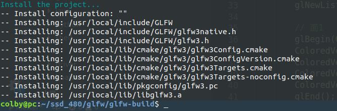

文章目录

                1. 下载GLFW包
                2. 编译
                3. Ubuntu下直接运行实例
                4. 利用Clion运行实例

1. 安装依赖库，

    $sudo apt-get build-dep glfw
    
    $sudo apt-get install cmake xorg-dev libglu1-mesa-dev
    
2. 下载GLFW包

    进入家目录：cd ~，也可以放在自己的文件夹中，用来放GLFW的压缩文件。
    GLFW的下载地址点击这里 https://www.glfw.org/
    解压GLFW，unzip glfw-3.2.1.zip
    会在当前目录生成一个同名文件夹中，内容如下。

3. 编译

    进入解压目录cd ~/glfw-3.2.1
    创建build目录mkdir glfw-build
    进入build目录cd glfw-build
    执行cmake ~/glfw-3.2.1命令，如下：

    编译，执行make命令 和 make install

    ps: make install 将安装到如下：

    

4. Ubuntu下直接运行实例

    进入cd ~/glfw-3.2.1/glfw-build/examples
    执行./simple

- 运行结果

4.  利用Clion运行实例

- 利用Clion打开`glfw-build目录`

- 运行`~/glfw-3.2.1/glfw-build/examples`下的`simple.c`实例，直接点击`main函数`运行即可。

- 运行结果如下：

## c 代码测试

