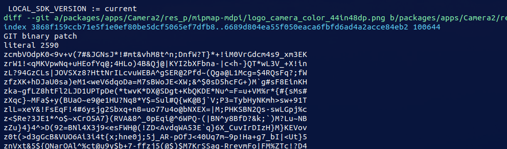

在phoenix 中， 有的patch 在当前目录中生成的，但是是在其他目录中应用的，  这就导致目录不一样，所以，这里就要注意了

# 1. 指定patch 路径

## 无新文件

```shell
# hp-4.19/packages/apps/Camera2$ 

git diff  --src-prefix=a/packages/apps/Camera2/ --dst-prefix=b/packages/apps/Camera2/ > temp.patch
```

这样生成的patch 是没有 下面图片中的 png 新文件的内容的


## 新文件

当我们新添加文件时，如果想生成patch 必须使用如下这种方式：

因为我们新添加了几张图片， 

```shell
# hp-4.19/packages/apps/Camera2$ 

git add .

git commit -sm "kkk"

git format-patch HEAD~1 --stdout  --src-prefix=a/packages/apps/Camera2/ --dst-prefix=b/packages/apps/Camera2/ > temp.patch
```

1. 这种方式 需要先 commit 之后才能生成 patch



```shell
git reset --hard aaae0ae1bbb4a32720cc742c9c3dfb0687583

# 然后回退掉之前的commit
```

de