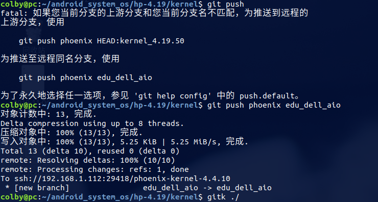
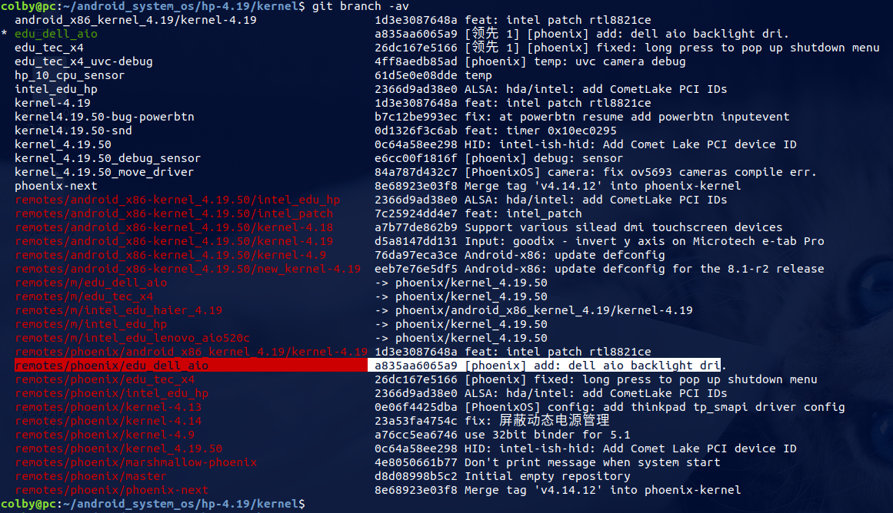
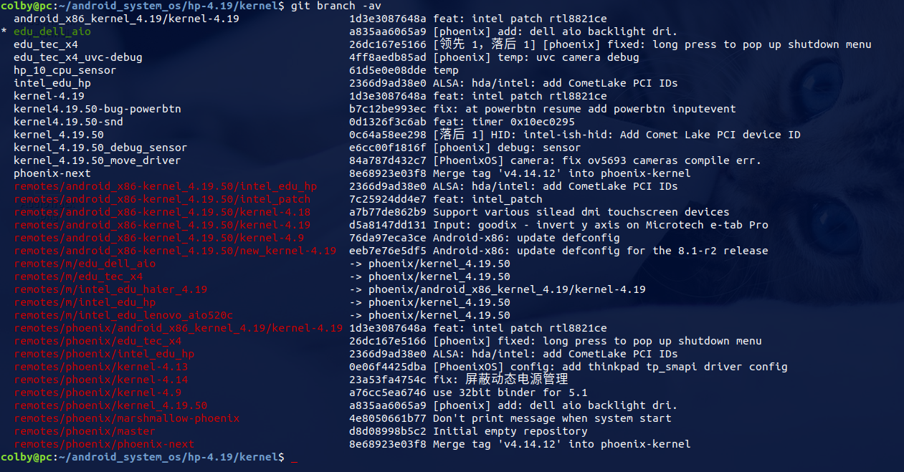

## 问题描述：

在提交代码时，不小心，在远程创建了一个新的分支：





从这里我们知道，　此时在远端　多了一个　phoenix/edu_dell_aio分支

但是这个分支，不对，**此时我们要将这个　phoenix/edu_dell_aio　删除**

## 删除分支：

```shell
hp-4.19/kernel$ git push phoenix --delete edu_dell_aio 
remote: Processing changes: refs: 1, done    
To ssh://192.168.1.112:29418/phoenix-kernel-4.4.10
 - [deleted]                   edu_dell_aio
```



此时可知已经成功删除

## 参考资料:

https://baijiahao.baidu.com/s?id=1596093203877347214&wfr=spider&for=pc

