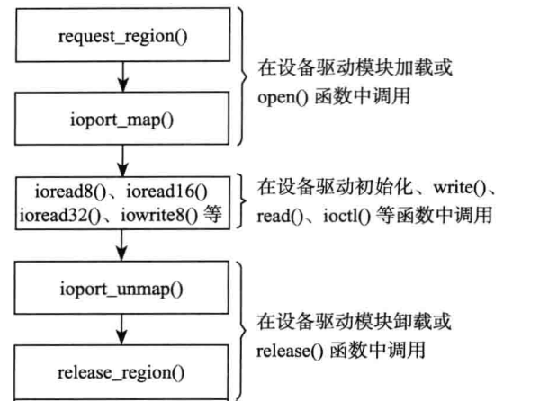

# 内存和IO

## 1 cpu 与内存和IO的关系

###  1.1 内存空间和IO空间

#### 1.1.1 内存空间：

​	内存空间可以直接通过地址、指针来访问。

进一步说明：

- 程序和程序运行中使用的变量和其他数据都存在于内存空间中。
- 嵌入式芯片中已经将原来的Ｉ/O空间纳入进内存空间中了。（如果某个地址对应着设备的ＩＯ空间，对该特定地址的访问，就将发生该设备的ＩＯ访问）
- 内存地址可以直接由Ｃ语言指针操作

```c
unsigned char *p = (unsigned char *)0x0000ff00;
*p = 11;
/*在绝对地址0x0000ff00 中写入　11,如果这个地址对应一个设备，那直接就会在对应设备引脚中产生高低电平*/
```

了解：

​	**内存空间是必需的，而ＩＯ空间是可选的：**

​	即便是在x86处理器中，虽然提供了IO空间，如果由我们自己设计电路板，外设任然可以挂接在内存空间。此时cpu可以像访问一个内存单元那样访问外设IO端口，而不需要设立专门的IO指令。从这个意义上说**内存空间是必需的，而ＩＯ空间是可选的**.但是为区别与一般内存访问，我们任然习惯将基于设备内存的访问叫做ＩＯ访问。

#### 1.1.2 ＩＯ空间

​	在x86处理器中存在着ＩＯ空间的概念。它通过特定的汇编指令IN、OUT来访问。端口号标识了外设的寄存器地址。

```c
/*IN OUT 命令格式*/
IN 累加器, {端口号 | DX}
OUT {端口号 | DX}, 累加器
```

​	大多数嵌入式cpu如 ARM、PowerPC等中并不提供IO空间，而仅存在内存空间。


## 2 MMU 内存管理单元

​	MMU硬件单元是辅助操作系统进行内存管理。

1. 职责：

- 提供虚拟地址和物理地址的映射
- 内存访问权限
- cache缓存控制

2. 目的：

- linux内核借助MMU，让用户感觉程序可以使用非常大的内存空间，从而使得编程人员在写程序时不用考虑计算机中物理内存的实际容量。

### 2.1 基本概念

#### 2.1.1 TLB（快表）

​	Translation Lookaside Buffer(地址转换旁路缓存)，是MMU的核心部件。用于缓存少量的虚拟地址和物理地址的转换关系。是转换表的cache，**故称快表。**

#### 2.1.2 TTW

​	Translation Table Walk(地址转换表漫游)

​	职责：

​		往TLB中放地址转换关系的。(如果TLB中没有要查询的 映射关系，将通过TTW去内存中的转换表中去找，TTW成功后，结果写入了TLB中)

### 2.2 ARM cpu数据访问流程

#### 2.2.1 理想情况

- cpu -> MMU使能 -> 从TLB中查到了 -> 具有该地址的访问权限 -> 该地址允许放置到cache中 -> 在cache中查到了 -> 访问cache
- --------------------------------------------------------------------------------------->该地址不允许放置到cache中 -> 直接访问物理内存
- ----------------------------------------------------------------------------------------------------------------------------------->未在cache中找到 -> 直接访问物理内存 -> 并把内存中的数据放置到cache中
- ---------------------------->在TLB中没有找到 ->TTW(去内存中的映射表中找) -> 更新TLB ->接着：从TLB中查到了-> ...


#### 2.2.2 虚->物地址 例子

背景：

​	分析bootloader中建立一个4GB虚拟地址和物理地址一一映射的一级页表的过程


## 3 内存管理

- 每个进程的用户空间都是完全独立的、互不相干的
- 用户进程各自有不同的页表，这些页表限定且保障了各进程只能访问属于自己的内存内容，而内核空间由内核负责映射，它并不会跟着进程改变，是固定的。
- 内核空间地址有自己对应的页表，内核的虚拟空间独立于其他程序

### 3.1 内核空间(3G - 4G)

​	在3G - 4G 的内核空间中，从低地址到高地址依次为：

- 物理内存映射区 -> 隔离带 -> 虚拟内存分配区 -> 隔离带 -> 高端内存映射区 -> 专用页面映射区 ->系统保留映射区

概念：

​	

| 4G   | 系统保留映射区 |                        |
| ---- | -------------- | ---------------------- |
|      | 专用页面映射区 |                        |
|      | 高端内存映射区 | 超过896MB的内存        |
|      | ---隔离带      |                        |
|      | 虚拟内存分配区 | 用于实现 vmalloc()函数 |
|      | ---隔离带      |                        |
| 3G   | 物理内存映射区 | 最大896MB              |

- 一般情况先，物理内存映射区最大的长度为896MB,**系统的物理内存被顺序映射在内核空间的这个区域中.**
- 当系统物理内存大于　896MB 时，超过物理内存映射区的那部分内存称为　高端内存（而未超过物理内存映射区的内存通常称为　常规内存），**内核在存取高端内存时必须将他们映射到高端内存映射区。（在2019-02-18-内存映射和DMA中有一个使用案例（3.2.2））**


### 3.2 内存的访问

​	kmalloc()和__get_free_pages()(及其类似的函数)申请的内存位于**物理内存映射区**，而且在物理上也是连续的，他们与真实的物理地址只有一个固定的偏移，因此存在比较简单的转换关系。

​	而vmalloc()在虚拟内存空间给出一块连续的内存区，实质上，这片连续的虚拟内存在物理内存中并不一定连续，而vmalloc()申请的虚拟内存和物理内存之间也不是简单的换算关系。申请的内存位于**虚拟内存分配区**


#### 3.2.1 kmalloc() - kfree()

```c
static __always_inline void *kmalloc(size_t size, gfp_t flags)
    
flags:

/*GFP ==> __get_free_pages()的缩写*/

 * %GFP_USER - Allocate memory on behalf of user.  May sleep.
 * 为用户空间页分配内存 ，可能阻塞
 
 * %GFP_KERNEL - Allocate normal kernel ram.  May sleep.
     在内核空间分配内存 ，可能阻塞
 *
 * %GFP_ATOMIC - Allocation will not sleep.  May use emergency pools.
 *   For example, use this inside interrupt handlers.
     若不存在空闲页，则不等待，直接返回
 *
 * %GFP_HIGHUSER - Allocate pages from high memory.
     类似GFP_USER 但是从高端内存分配
 *
 * %GFP_NOIO - Do not do any I/O at all while trying to get memory.
 *	不允许任何IO初始化
 
 * %GFP_NOFS - Do not make any fs calls while trying to get memory.
 * 不允许进行任何文件系统调用
 
 * %GFP_NOWAIT - Allocation will not sleep.
 *
 * %__GFP_THISNODE - Allocate node-local memory only.                                                                                                         
 *
 * %GFP_DMA - Allocation suitable for DMA.
 *   Should only be used for kmalloc() caches. Otherwise, use a
 *   slab created with SLAB_DMA.
     要求分配在能够DMA的内存区
 *
 * Also it is possible to set different flags by OR'ing
 * in one or more of the following additional @flags:
 *
 * %__GFP_COLD - Request cache-cold pages instead of
 *   trying to return cache-warm pages.
     请求一个较长时间不访问的页
 *
 * %__GFP_HIGH - This allocation has high priority and may use emergency pools.
 * 高优先级请求，允许获得被内核保留给紧急情况下使用的最后的内存页
 
 * %__GFP_NOFAIL - Indicate that this allocation is in no way allowed to fail
 *   (think twice before using).
 *
 * %__GFP_NORETRY - If memory is not immediately available,
 *   then give up at once.
 *
 * %__GFP_NOWARN - If allocation fails, don't issue any warnings.
 *
 * %__GFP_REPEAT - If allocation fails initially, try once more before failing.

```


kmalloc()申请内存时 flag设置不当引起的阻塞问题：

- GFP_KERNEL 若暂时不能满足，则进程会睡眠等待页，会引起阻塞
- GFP_ATOMIC 若不存在空闲页 直接返回

总结：

​	使用GFP_ATOMIC场景：

1. 中断处理程序（中断上下文）
2. 持有自旋锁的临界区中使用
3. tasklet
4. 内核定时器

#### 3.2.2 __get_free_pages 系列函数


__get_free_pages()系列函数是 kmalloc()实现的基础

```c
/* 返回一个 指向新页的对应内存的首地址 并且将该页清零*/
unsigned long get_zeroed_page(gfp_t gfp_mask)
{
    return __get_free_pages(gfp_mask | __GFP_ZERO, 0);
}
EXPORT_SYMBOL(get_zeroed_page);


/* 可分配多个页并返回分配内存的首地址，分配的页数为 2^order,分配的页不清零。order允许的最大值是10（1024页）或者11（2048页），依赖于具体的硬件平台*/
unsigned long __get_free_pages(gfp_t gfp_mask, unsigned int order)
{
    struct page *page;

    /*
     * __get_free_pages() returns a 32-bit address, which cannot represent
     * a highmem page
     */
    VM_BUG_ON((gfp_mask & __GFP_HIGHMEM) != 0);

    page = alloc_pages(gfp_mask, order);/*既可以在 内核空间分配 也可以在 用户空间分配*/
    if (!page)
        return 0;
    return (unsigned long) page_address(page);
}
EXPORT_SYMBOL(__get_free_pages);                  

```


释放

```c
void free_pages(unsigned long addr, unsigned int order)
{
    if (addr != 0) {
        VM_BUG_ON(!virt_addr_valid((void *)addr));
        __free_pages(virt_to_page((void *)addr), order);
    }
}

EXPORT_SYMBOL(free_pages);


void __free_pages(struct page *page, unsigned int order)
{
    if (put_page_testzero(page)) {
        if (order == 0)
            free_hot_cold_page(page, false);
        else
            __free_pages_ok(page, order);                                                                                                                     
    }
}

EXPORT_SYMBOL(__free_pages);

```

#### 3.2.3 vmalloc() - vfree()

- vmalloc() 在分配内存的时候会重新建立新的页表，**故开销很大，比起__get_free_pages()**
- vmalloc() 一般用在只存在于软件中（没有对应硬件意义）的较大的顺序缓冲区分配内存。
- 由于vmalloc()开销大，如果只是调用它来分配少量的内存(如1页)是不合适的。

```c
void *vmalloc(unsigned long size)
{
       return __vmalloc(size, GFP_KERNEL | __GFP_HIGHMEM, PAGE_KERNEL);
}
EXPORT_SYMBOL(vmalloc);


void *__vmalloc(unsigned long size, gfp_t gfp_mask, pgprot_t prot)
{
    /*
     *  You can't specify __GFP_HIGHMEM with kmalloc() since kmalloc()
     * returns only a logical address.
     */
    return kmalloc(size, (gfp_mask | __GFP_COMP) & ~__GFP_HIGHMEM);
}
EXPORT_SYMBOL(__vmalloc);               
```

源码分析：

vmalloc内部也是通过 kmalloc()来调用的，而flag是 GFP_KERNEL，

因此vmalloc() 在使用的过程中会引起 休眠，参看 3.2.1小节中，GFP_KERNEL使用场景的说明


#### 3.2.4 slab 

现在我们有这么一个需求：我们的对象在前后两次使用的时候能分配到同一块内存或同一类内存空间中？

背景：

​	在操作系统的运作过程中，经常会涉及到大量对象的重复生成、使用和释放问题。如果我们在前后两次使用对象时能分配到同一块内存中，并且保留了基本的数据结构，就可以大大提高效率。slab算法就可以解决这种情况。

- 创建slab缓存

```c

/*用于创建一个slab缓冲，他是一个可以驻留任意数目全部同样大小的后备缓冲。

	size：是要分配的每个数据结构的大小，
	flags:
		SLAB_NO_REAP:即使内存紧缺也不自动收缩这块缓冲
		SLAB_HWCACHE_ALIGN:每个数据对象对齐到一个缓冲行
		SLAB_CACHE_DMA:要求数据对象在DMA内存区分配*/
struct kmem_cache *kmem_cache_create(const char *name, size_t size, size_t align,unsigned long flags, void (*ctor)(void *));

```

- 分配slab缓存

```c
void *kmem_cache_alloc(struct kmem_cache *cachep, gfp_t flags) 
```

- 释放slab缓存

```c
void kmem_cache_free(struct kmem_cache *cachep, void *objp)
```

- 收回slab缓冲

```c
void kmem_cache_destroy(struct kmem_cache *s)
```


slab的使用案例：

```c
/*创建slab缓存*/
static kmem_cache_t *xxx_cachep ;
xxx_cachep = kmem_cache_create("xxx", sizeof(struct xxx), 8, SLAB_HWCACHE_ALIGN, NULL) ;

struct xxx *xxx_p ;
xxx_p = kmem_cache_alloc(xxx_cachep, GFP_KERNEL) ;

/*使用slab缓存*/
/*...code......*/
/*...code......*/

kmem_cache_free(xxx_cachep, xxx_p) ;
    
kmem_cache_destroy(xxx_cachep) ;
```

这里附一个使用 slab的案例：linux-4.13.1/drivers/misc/lkdtm_usercopy.c  里面一部分的截取

```c
/*
 * This is for all the tests related to copy_to_user() and copy_from_user()
 * hardening.
 */
#include "lkdtm.h"
#include <linux/slab.h>
#include <linux/vmalloc.h>
#include <linux/sched/task_stack.h>
#include <linux/mman.h>
#include <linux/uaccess.h>
#include <asm/cacheflush.h>

/*
 * Many of the tests here end up using const sizes, but those would
 * normally be ignored by hardened usercopy, so force the compiler
 * into choosing the non-const path to make sure we trigger the
 * hardened usercopy checks by added "unconst" to all the const copies,
 * and making sure "cache_size" isn't optimized into a const.
 */
static volatile size_t unconst = 0;
static volatile size_t cache_size = 1024;
static struct kmem_cache *bad_cache;

static void do_usercopy_heap_flag(bool to_user)
{
	unsigned long user_addr;
	unsigned char *good_buf = NULL;
	unsigned char *bad_buf = NULL;

	/* Make sure cache was prepared. */
	if (!bad_cache) {
		pr_warn("Failed to allocate kernel cache\n");
		return;
	}

	/*
	 * Allocate one buffer from each cache (kmalloc will have the
	 * SLAB_USERCOPY flag already, but "bad_cache" won't).
	 */
	good_buf = kmalloc(cache_size, GFP_KERNEL);
	bad_buf = kmem_cache_alloc(bad_cache, GFP_KERNEL);   /*第二步*/
	if (!good_buf || !bad_buf) {
		pr_warn("Failed to allocate buffers from caches\n");
		goto free_alloc;
	}

	/* Allocate user memory we'll poke at. */
	user_addr = vm_mmap(NULL, 0, PAGE_SIZE,
			    PROT_READ | PROT_WRITE | PROT_EXEC,
			    MAP_ANONYMOUS | MAP_PRIVATE, 0);
	if (user_addr >= TASK_SIZE) {
		pr_warn("Failed to allocate user memory\n");
		goto free_alloc;
	}

	memset(good_buf, 'A', cache_size);
	memset(bad_buf, 'B', cache_size);

	if (to_user) {
		pr_info("attempting good copy_to_user with SLAB_USERCOPY\n");
		if (copy_to_user((void __user *)user_addr, good_buf,
				 cache_size)) {
			pr_warn("copy_to_user failed unexpectedly?!\n");
			goto free_user;
		}

		pr_info("attempting bad copy_to_user w/o SLAB_USERCOPY\n");
		if (copy_to_user((void __user *)user_addr, bad_buf,
				 cache_size)) {
			pr_warn("copy_to_user failed, but lacked Oops\n");
			goto free_user;
		}
	} else {
		pr_info("attempting good copy_from_user with SLAB_USERCOPY\n");
		if (copy_from_user(good_buf, (void __user *)user_addr,
				   cache_size)) {
			pr_warn("copy_from_user failed unexpectedly?!\n");
			goto free_user;
		}

		pr_info("attempting bad copy_from_user w/o SLAB_USERCOPY\n");
		if (copy_from_user(bad_buf, (void __user *)user_addr,
				   cache_size)) {
			pr_warn("copy_from_user failed, but lacked Oops\n");
			goto free_user;
		}
	}

free_user:
	vm_munmap(user_addr, PAGE_SIZE);
free_alloc:
	if (bad_buf)
		kmem_cache_free(bad_cache, bad_buf);/*第..释放 步*/
	kfree(good_buf);
}

void __init lkdtm_usercopy_init(void)
{
	/* Prepare cache that lacks SLAB_USERCOPY flag. */
	bad_cache = kmem_cache_create("lkdtm-no-usercopy", cache_size, 0,
				      0, NULL); /*第一步： 创建 slab缓存*/
}

void __exit lkdtm_usercopy_exit(void)
{
	kmem_cache_destroy(bad_cache);/*最后一步： 销毁 slab缓存*/
}
```

#### 3.2.5 内存池

除了slab缓存之外，在linux内核中还包含对内存池的支持，内存池技术也是一种非常经典的用于分配大量小对象的后备缓存技术。

- 创建内存池

```c
/*gfp_mask :分配标记：只有当被指定为 __GFP_WAIT时，分配函数才会休眠*/
typedef void * (mempool_alloc_t)(gfp_t gfp_mask, void *pool_data);                                                                                            
typedef void (mempool_free_t)(void *element, void *pool_data);

/*用于创建一个内存池：
	min_nr： 需要预分配对象的数目
	alloc_fn,free_fn： 指向内存池机制提供的标准对象分配和回收的指针
	pool_data:  给alloc_fn,free_fn传递参数使用*/
mempool_t *mempool_create(int min_nr, mempool_alloc_t *alloc_fn,mempool_free_t *free_fn, void *pool_data)；

```

- 分配和回收对象

```c
void *mempool_alloc(mempool_t *pool, gfp_t gfp_mask) ;
void mempool_free(void *element, mempool_t *pool) ;
```

- 回收内存池

```c
void mempool_destroy(mempool_t *pool) ;
```

## 4 I/O 访问

- 设备通常会提供控制设备、读写设备和获取设备状态的三组寄存器（控制寄存器、数据寄存器、状态寄存器）。
- 这些寄存器可能位于I/O空间，也可能位于内存空间。当位于I/O空间时，通常称为I/O端口；而位于内存空间时，对应的内存空间称为I/O内存。
- 对I/O的访问，就是对I/O端口和I/O内存的访问，实际上就是对相应设备的访问

### 4.1 I/O 端口

函数汇总：grep  EXPORT_SYMBOL arch/alpha/kernel/io.c > cbx.tst

```c
/*in 为读 out为写*/
EXPORT_SYMBOL(inb); //8bit
EXPORT_SYMBOL(inw); //16bit  字在x86下为2个字节
EXPORT_SYMBOL(inl); //32bit
EXPORT_SYMBOL(outb);
EXPORT_SYMBOL(outw);
EXPORT_SYMBOL(outl);


EXPORT_SYMBOL(insb);
EXPORT_SYMBOL(insw);
EXPORT_SYMBOL(insl);
EXPORT_SYMBOL(outsb);
EXPORT_SYMBOL(outsw);
EXPORT_SYMBOL(outsl);

/*从端口port 读count字，并写入dst指定的地址处 */
void insw(unsigned long port, void *dst, unsigned long count);
/*将src指向的内存的count个字 连续的写入port开始的端口 */
void outsw(unsigned long port, const void *src, unsigned long count);
```

### 4.2 I/O 内存

#### 4.2.1 动态映射

​	在内核中访问I/O内存之前，需要先使用ioremap()函数将设备所处的物理地址映射到虚拟地址。

​	ioremap()和vmalloc()相似，也需要建立新的页表。ioremap()返回一个特殊的虚拟地址，该地址可用来存取特定的物理地址范围。

​	通过ioremap()获得的地址应该由iounmap()函数释放。

#### 4.2.2 静态映射

​	在将linux移植到目标电路板的过程中，因为设备是固定的，如果对设备的访问通过IO内核的方式，通常会在系统启动时就建立好外设IO内存物理地址到虚拟地址的静态映射。

​	这个映射是通过在电路板对应的map_desc结构体数组中添加新的成员来完成的.

```c
struct map_desc {
    unsigned long virtual;
    unsigned long pfn;
    unsigned long length;
    unsigned int type;
};
```

板级文件：FireNow-Nougat/kernel$ vim ./arch/arm/mach-exynos/exynos.c

```c
#define S3C_ADDR_BASE   0xF6000000
#define S3C_ADDR(x) ((void __iomem __force *)S3C_ADDR_BASE + (x))
#define S5P_VA_SROMC        S3C_ADDR(0x024C0000) 

#define EXYNOS4_PA_SROMC        0x12570000
#define PAGE_SHIFT      16
#define __phys_to_pfn(paddr)    ((unsigned long)((paddr) >> PAGE_SHIFT)) 
static struct map_desc exynos4_iodesc[] __initdata = { 
    {   
        .virtual    = (unsigned long)S5P_VA_SROMC,
        .pfn        = __phys_to_pfn(EXYNOS4_PA_SROMC),   /*__phys_to_pfn( phy_addr),*/ 
        .length     = SZ_4K,
        .type       = MT_DEVICE,
    },
};

static void __init exynos_map_io(void)
{
    if (soc_is_exynos4())
        iotable_init(exynos4_iodesc, ARRAY_SIZE(exynos4_iodesc));                                                                                             

    if (soc_is_exynos5())
        iotable_init(exynos5_iodesc, ARRAY_SIZE(exynos5_iodesc));
}


static void __init exynos_init_io(void)
{
    debug_ll_io_init();

    of_scan_flat_dt(exynos_fdt_map_chipid, NULL);

    /* detect cpu id and rev. */
    s5p_init_cpu(S5P_VA_CHIPID);

    exynos_map_io();                                                                                                                                          
}

DT_MACHINE_START(EXYNOS_DT, "SAMSUNG EXYNOS (Flattened Device Tree)")
    /* Maintainer: Thomas Abraham <thomas.abraham@linaro.org> */
    /* Maintainer: Kukjin Kim <kgene.kim@samsung.com> */
    .l2c_aux_val    = 0x3c400001,
    .l2c_aux_mask   = 0xc20fffff,
    .smp        = smp_ops(exynos_smp_ops),
    .map_io     = exynos_init_io,                                                                                                                             
    .init_early = exynos_firmware_init,
    .init_irq   = exynos_init_irq,
    .init_machine   = exynos_dt_machine_init,
    .init_late  = exynos_init_late,
    .dt_compat  = exynos_dt_compat,
    .reserve    = exynos_reserve,
    .dt_fixup   = exynos_dt_fixup,
MACHINE_END

```


```c
/*
 *  arch/arm/include/asm/mach/arch.h
 *
 *  Copyright (C) 2000 Russell King
 *
 * This program is free software; you can redistribute it and/or modify
 * it under the terms of the GNU General Public License version 2 as
 * published by the Free Software Foundation.
 */

#include <linux/types.h>

#ifndef __ASSEMBLY__
#include <linux/reboot.h>

struct tag;
struct pt_regs;
struct smp_operations;
#ifdef CONFIG_SMP
#define smp_ops(ops) (&(ops))
#define smp_init_ops(ops) (&(ops))
#else
#define smp_ops(ops) (struct smp_operations *)NULL
#define smp_init_ops(ops) (bool (*)(void))NULL
#endif

struct machine_desc {
	unsigned int		nr;		/* architecture number	*/
	const char		*name;		/* architecture name	*/
	unsigned long		atag_offset;	/* tagged list (relative) */
	const char *const 	*dt_compat;	/* array of device tree
						 * 'compatible' strings	*/

	unsigned int		nr_irqs;	/* number of IRQs */

#ifdef CONFIG_ZONE_DMA
	phys_addr_t		dma_zone_size;	/* size of DMA-able area */
#endif

	unsigned int		video_start;	/* start of video RAM	*/
	unsigned int		video_end;	/* end of video RAM	*/

	unsigned char		reserve_lp0 :1;	/* never has lp0	*/
	unsigned char		reserve_lp1 :1;	/* never has lp1	*/
	unsigned char		reserve_lp2 :1;	/* never has lp2	*/
	enum reboot_mode	reboot_mode;	/* default restart mode	*/
	unsigned		l2c_aux_val;	/* L2 cache aux value	*/
	unsigned		l2c_aux_mask;	/* L2 cache aux mask	*/
	void			(*l2c_write_sec)(unsigned long, unsigned);
	const struct smp_operations	*smp;	/* SMP operations	*/
	bool			(*smp_init)(void);
	void			(*fixup)(struct tag *, char **);
	void			(*dt_fixup)(void);
	long long		(*pv_fixup)(void);
	void			(*reserve)(void);/* reserve mem blocks	*/
	void			(*map_io)(void);/* IO mapping function	*/
	void			(*init_early)(void);
	void			(*init_irq)(void);
	void			(*init_time)(void);
	void			(*init_machine)(void);
	void			(*init_late)(void);
#ifdef CONFIG_MULTI_IRQ_HANDLER
	void			(*handle_irq)(struct pt_regs *);
#endif
	void			(*restart)(enum reboot_mode, const char *);
};

/*
 * Current machine - only accessible during boot.
 */
extern const struct machine_desc *machine_desc;

/*
 * Machine type table - also only accessible during boot
 */
extern const struct machine_desc __arch_info_begin[], __arch_info_end[];
#define for_each_machine_desc(p)			\
	for (p = __arch_info_begin; p < __arch_info_end; p++)

/*
 * Set of macros to define architecture features.  This is built into
 * a table by the linker.
 */
#define MACHINE_START(_type,_name)			\
static const struct machine_desc __mach_desc_##_type	\
 __used							\
 __attribute__((__section__(".arch.info.init"))) = {	\
	.nr		= MACH_TYPE_##_type,		\
	.name		= _name,

#define MACHINE_END				\
};
/*__mach_desc_EXYNOS_DT*/
#define DT_MACHINE_START(_name, _namestr)		\
static const struct machine_desc __mach_desc_##_name	\
 __used							\
 __attribute__((__section__(".arch.info.init"))) = {	\
	.nr		= ~0,				\
	.name		= _namestr,

#endif

```

总结：

1. 板级文件从放的目录在  arch/arm/mach-xxx
2. 在linux操作系统移植到特定平台上，MACHINE_START 或者 DT_MACHINE_START 和 MACHINE_END宏之间的定义是针对特定电路板而设计的，其中的map_io()成员函数就用来完成IO内存的静态映射的。
3. 最终调用的是cpu->map_io()来建立map_desc数组中物理地址和虚拟地址的静态映射关系的。


​	在一个已经移植好的OS的内核中，驱动开发工程师完全可以对非常规内存区域的IO内存（外设控制器寄存器、MCU内部集成的外设控制器寄存器等）依照电路板的资源使用情况添加到map_desc数组中。

​	此后在设备驱动中访问经过map_desc数组映射后的IO内存时，直接在map_desc数组中该段的虚拟地址上加上相应的偏移即可，不需要使用ioremap() 


下面是/FireNow-Nougat/kernel$ vim ./arch/arm/mach-rockchip/rockchip.c的板级文件，从中没有找到，对应的io的静态映射

```c
/*
 * Device Tree support for Rockchip SoCs
 *
 * Copyright (c) 2013 MundoReader S.L.
 * Author: Heiko Stuebner <heiko@sntech.de>
 *
 * This program is free software; you can redistribute it and/or modify
 * it under the terms of the GNU General Public License as published by
 * the Free Software Foundation; either version 2 of the License, or
 * (at your option) any later version.
 *
 * This program is distributed in the hope that it will be useful,
 * but WITHOUT ANY WARRANTY; without even the implied warranty of
 * MERCHANTABILITY or FITNESS FOR A PARTICULAR PURPOSE.  See the
 * GNU General Public License for more details.
 */

#include <linux/kernel.h>
#include <linux/init.h>
#include <linux/of_platform.h>
#include <linux/irqchip.h>
#include <linux/clk-provider.h>
#include <linux/clocksource.h>
#include <linux/mfd/syscon.h>
#include <linux/regmap.h>
#include <asm/mach/arch.h>
#include <asm/mach/map.h>
#include <asm/hardware/cache-l2x0.h>
#include "core.h"
#include "pm.h"

#define RK3288_GRF_SOC_CON0 0x244
#define RK3288_GRF_SOC_CON2 0x24C
#define RK3288_TIMER6_7_PHYS 0xff810000

static void __init rockchip_timer_init(void)
{
	if (of_machine_is_compatible("rockchip,rk3288")) {
		struct regmap *grf;

		/*
		 * Disable auto jtag/sdmmc switching that causes issues
		 * with the mmc controllers making them unreliable
		 */
		grf = syscon_regmap_lookup_by_compatible("rockchip,rk3288-grf");
		if (!IS_ERR(grf)) {
			regmap_write(grf, RK3288_GRF_SOC_CON0, 0x10000000);

			/* Set pwm_sel to RK design PWM; affects all PWMs */
			regmap_write(grf, RK3288_GRF_SOC_CON2, 0x00010001);
		} else {
			pr_err("rockchip: could not get grf syscon\n");
                }
	}

	of_clk_init(NULL);
	clocksource_probe();
}

static void __init rockchip_dt_init(void)
{
	rockchip_suspend_init();
	of_platform_populate(NULL, of_default_bus_match_table, NULL, NULL);
	platform_device_register_simple("cpufreq-dt", 0, NULL, 0);
}

static const char * const rockchip_board_dt_compat[] = {
	"rockchip,rk2928",
	"rockchip,rk3066a",
	"rockchip,rk3066b",
	"rockchip,rk3188",
	"rockchip,rk3288",
	NULL,
};

DT_MACHINE_START(ROCKCHIP_DT, "Rockchip (Device Tree)")
	.l2c_aux_val	= 0,
	.l2c_aux_mask	= ~0,
	.init_time	= rockchip_timer_init,
	.dt_compat	= rockchip_board_dt_compat,
	.init_machine	= rockchip_dt_init,
MACHINE_END
```


#### 4.2.3 操作函数

```c
EXPORT_SYMBOL(ioread8);
EXPORT_SYMBOL(ioread16);
EXPORT_SYMBOL(ioread32);
EXPORT_SYMBOL(iowrite8);
EXPORT_SYMBOL(iowrite16);
EXPORT_SYMBOL(iowrite32);
 

EXPORT_SYMBOL(readb);
EXPORT_SYMBOL(readw);
EXPORT_SYMBOL(readl);
EXPORT_SYMBOL(readq);
EXPORT_SYMBOL(writeb);
EXPORT_SYMBOL(writew);
EXPORT_SYMBOL(writel);
EXPORT_SYMBOL(writeq);

EXPORT_SYMBOL(ioread8_rep);/*读写 一串 I/O内存*/
EXPORT_SYMBOL(ioread16_rep);
EXPORT_SYMBOL(ioread32_rep);
EXPORT_SYMBOL(iowrite8_rep);
EXPORT_SYMBOL(iowrite16_rep);
EXPORT_SYMBOL(iowrite32_rep);

EXPORT_SYMBOL(memcpy_fromio); /*复制I/O内存*/
EXPORT_SYMBOL(memcpy_toio);

EXPORT_SYMBOL(_memset_c_io);

EXPORT_SYMBOL(scr_memcpyw);

```

EXPORT_SYMBOL(ioport_map);
EXPORT_SYMBOL(ioport_unmap);

ioport_map：

```c
void __iomem *ioport_map(unsigned long port, unsigned int size)
/*将端口映射成内存地址，这样我们就能将 IO端口访问，转变为 IO内存访问，这样我们就能使用共同的函数接口*/
```

### 4.3 I/O资源的申请

```c
/*IO端口的申请和释放*/
request_region
release_region

/*IO内存的申请和释放*/
request_mem_region
release_mem_region

```

​	上述request_region和request_mem_region都不是必需的，但建议使用。其任务是检查申请的资源是否可用，如果可用则申请成功，并标志为已经使用，其他驱动想再次申请该资源时就会失败。

​	有很多设备驱动程序在没有申请IO端口和IO内存之前就直接访问了，这样是不安全的。

```c 
#define request_region(start,n,name)        __request_region(&ioport_resource, (start), (n), (name), 0)

#define request_muxed_region(start,n,name)  __request_region(&ioport_resource, (start), (n), (name), IORESOURCE_MUXED)

#define __request_mem_region(start,n,name, excl) __request_region(&iomem_resource, (start), (n), (name), excl)

#define request_mem_region(start,n,name) __request_region(&iomem_resource, (start), (n), (name), 0)

#define request_mem_region_exclusive(start,n,name) \                                   
    __request_region(&iomem_resource, (start), (n), (name), IORESOURCE_EXCLUSIVE)
        
#define rename_region(region, newname) do { (region)->name = (newname); } while (0)

extern struct resource * __request_region(struct resource *,
                    resource_size_t start,
                    resource_size_t n,
                    const char *name, int flags);

/* Compatibility cruft */
#define release_region(start,n) __release_region(&ioport_resource, (start), (n))

#define release_mem_region(start,n) __release_region(&iomem_resource, (start), (n))

extern void __release_region(struct resource *, resource_size_t,
                resource_size_t);

```

### 4.4 I/O访问流程

#### 4.4.1 IO端口的访问流程


方式二：



#### 4.4.2 IO内存的访问流程


### 4.5 设备地址和用户空间的映射

​	一般情况下，用户空间是不可能也不应该直接访问设备的。但是设备驱动中可通过实现mmap函数，来实现这个功能。该函数接口实现之后，可使得用户空间直接访问设备的物理地址。

​	实际上，mmap()它将用户空间的一段内存和设备内存关联，当用户访问用户空间的这段地址范围时，实际上会转化为对设备的访问。

​	这个特性对显示适配器一类的设备非常有意义，如果用户空间可直接通过内存映射显存的话，屏幕帧的各店的像素将不再需要从用户空间到内核空间的复制过程。


#### 4.5.1 mmap()

mmap()必须以PAGE_SIZE为单位进行映射，实际上，内存只能以页为单位进行映射，若要映射非PAGE_SIZE整数倍的地址范围，要先进行页对齐，强行以PAGE_SIZE的倍数大小进行映射。

驱动实现中的mmap()

```c
struct file_operations {
	int (*mmap) (struct file *, struct vm_area_struct *);
}
```

系统调用的mmap()

```c
SYSCALL_DEFINE6(mmap, unsigned long, addr, unsigned long, len,unsigned long, prot, unsigned long, flags,unsigned long, fd, unsigned long, off)
```


驱动程序中的mmap()主要实现：

1. 建立页表
2. 填充VMA结构体中vm_operations_struct 指针（VMA即vm_operations_struct,由于描述一个虚拟内存区域，）

```c
struct vm_area_struct {
    unsigned long vm_start;     /* Our start address within vm_mm. */
    unsigned long vm_end;       /* The first byte after our end address
                       within vm_mm. */
    struct vm_area_struct *vm_next, *vm_prev;
    struct rb_node vm_rb;
    unsigned long rb_subtree_gap;
    struct mm_struct *vm_mm;    /* 所处的地址空间 */
    pgprot_t vm_page_prot;      /* 访问权限 */
    unsigned long vm_flags;     /* Flags, see mm.h. */
    struct {
        struct rb_node rb;
        unsigned long rb_subtree_last;
    } shared;
    struct list_head anon_vma_chain; /* Serialized by mmap_sem &
                      * page_table_lock */
    struct anon_vma *anon_vma;  /* Serialized by page_table_lock */

    /* Function pointers to deal with this struct. */
    const struct vm_operations_struct *vm_ops;

    /* Information about our backing store: */
    unsigned long vm_pgoff;     /* 偏移（页帧号）
                       units */
    struct file * vm_file;      /* File we map to (can be NULL). */
    void * vm_private_data;     /* was vm_pte (shared mem) */
    struct vm_userfaultfd_ctx vm_userfaultfd_ctx;
} __randomize_layout;

```

