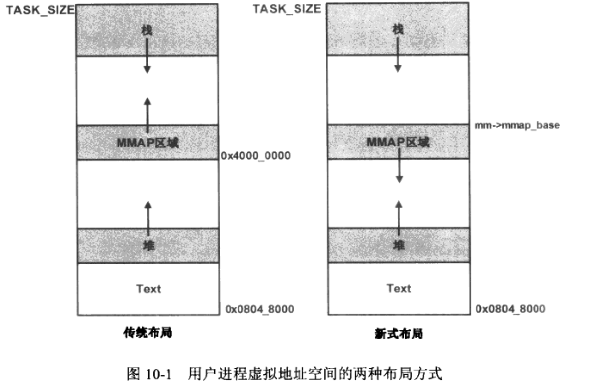
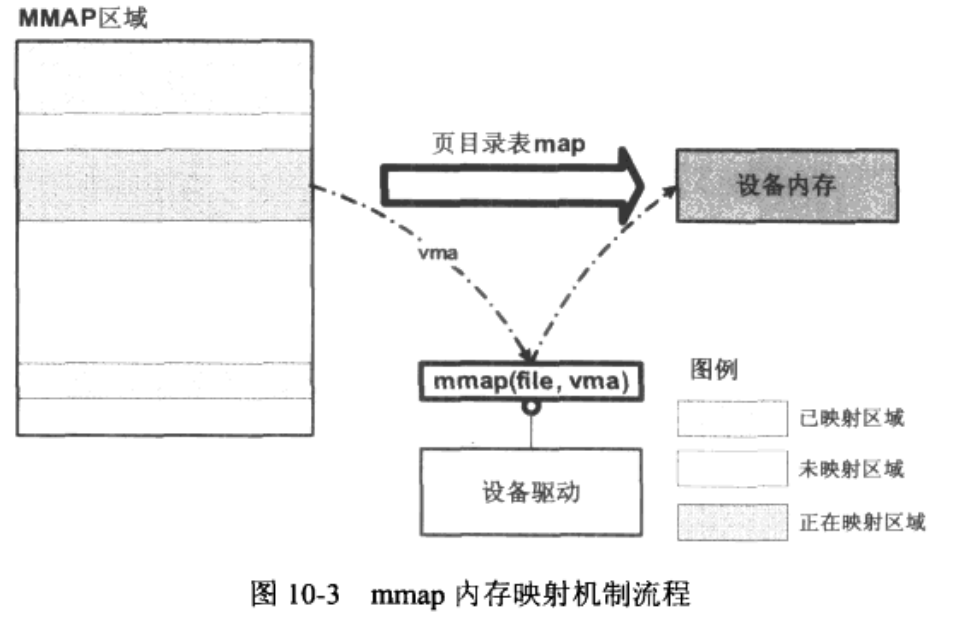
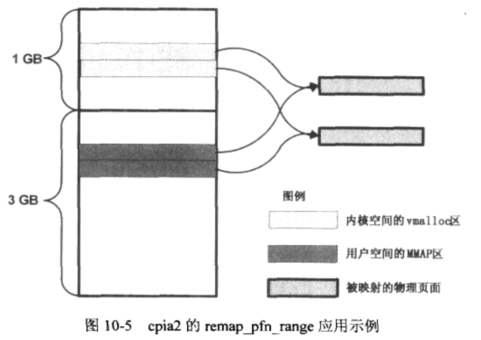

# 内存映射和DMA

意义：

- 内存映射：主要完成的工作是将设备的地址空间映射到用户空间或者直接使用用户空间中的地址。这样做的目的是提升系统性能。
- 深入的理解DMA数据的传输有利于系统设计时采用最佳的解决方案来提高系统的吞吐率。DMA的核心是如何为一个ＤＭＡ传输通道建立源地址和目标地址（这就是所谓的DMA映射的问题）

## 1 设备缓存和设备内存

设备缓存：在系统主存RAM中的一段内存区域

设备内存：是设备所固有的一段存储空间（某些设备的FIFO,显卡设备中的Frame Buffer等），从设备驱动程序的角度，它应该属于特定设备的硬件范畴，与设备是紧密相关的。


设备缓存和设备内存的联系：

​	设备缓存和设备内存是两者之间建立DMA通道。

1. 当设备内存中接收到的数据达到一定的阀值时，　设备将启动ＤＭＡ通道将数据从设备内存传输到位于主存中的设备缓冲中。
2. 发送数据正好相反，需要发送的数据首先被放到设备缓存中，然后在设备驱动程序的介入下启动DMA传输。将缓存中的数据传输到设备内存中。

### 1.1 mmap和ioremap区别

ioremap:

​	将**内核空间**中的一段虚拟地址映射到外部设备的存储区（设备的ＩＯ地址空间）

​	应用：在驱动程序中，我们要想访问ＩＯ内存，必须要做的一步就是，将设备的IO内存地址映射到内核的虚拟地址空间中。

mmap:

​	将**用户空间**的一段虚拟地址映射到设备的IO空间中，这样一来，用户空间进程将可以直接访问**设备内存**.驱动程序在此要完成的功能则是在其内部实现file_operations中的mmap方法。


我现在有个疑问，先放在这：

1. mmap的操作是：设备内存->映射为内核的虚拟地址 ->映射用户空间虚拟地址 还是 设备内存->映射用户空间虚拟地址， 我的直觉是第二种。    ？？？


## 2 用户空间虚拟地址布局

此处讨论按照经典的x86架构的3GB/1GB方式展开，此处将讨论3GB的进程虚拟地址空间中规划出进程的代码段(text)/存储全局变量和动态分配变量地址的堆，以及用于保存局部变量和实现函数调用的栈等存储块的起始地址和大小。

用户空间布局产生的时机：

​	当linux系统运行一个应用程序时，系统调用exec通过调用load_elf_binary函数来将该应用程序对应的elf二进制文件加载到进程3GB大小的虚拟地址空间中，布局就此产生。

用户空气布局：



创建虚拟地址空间的调用函数 ：

```c
static int load_elf_binary(struct linux_binprm *bprm)
---> setup_new_exec(bprm); 
	---> arch_pick_mmap_layout(current->mm);

void arch_pick_mmap_layout(struct mm_struct *mm){
    if (mmap_is_legacy())
        mm->get_unmapped_area = arch_get_unmapped_area;
    else
        mm->get_unmapped_area = arch_get_unmapped_area_topdown;

    arch_pick_mmap_base(&mm->mmap_base, &mm->mmap_legacy_base,
            arch_rnd(mmap64_rnd_bits), tasksize_64bit());

#ifdef CONFIG_HAVE_ARCH_COMPAT_MMAP_BASES
    /*
     * The mmap syscall mapping base decision depends solely on the
     * syscall type (64-bit or compat). This applies for 64bit
     * applications and 32bit applications. The 64bit syscall uses
     * mmap_base, the compat syscall uses mmap_compat_base.
     */
    arch_pick_mmap_base(&mm->mmap_compat_base, &mm->mmap_compat_legacy_base,
            arch_rnd(mmap32_rnd_bits), tasksize_32bit());
#endif
}   

```

对于驱动程序员，了解两种布局的区别并不是重点，**重点是知道要映射的地址区域出自3GB大小的用户空间的MMAP区域**，内核会很好的管理MMAP区域，管理该区域的最小单位是struct vm_area_struct数据结构表示的对象。


​	大体上，这种用户空间虚拟地址映射到设备内存的过程可以概括为：

- 内核先在进程虚拟地址空间的MMAP区域分配一个空闲（未映射）的struct vm_area_struct对象，然后通过页目录表项的方式将struct vm_area_struct对象所代表的虚拟地址空间映射到设备的存储空间中。
- 如此，用户进程可以直接访问设备的存储区，从而提高系统的性能。页目录表项的介入也意味着每个vm_area_struct对象表示的地址空间应该是页对齐的，大小是页的整数倍。

## 3 mmap

函数原型：

```c
struct file_operations {
    int (*mmap) (struct file *, struct vm_area_struct *);
}；
```

第二个参数 struct vm_area_struct *  用来表示用户进程中一段需要被映射的虚拟地址区域。

```c
struct vm_area_struct {
    unsigned long vm_start;     /* 当前struct vm_area_struct 所表示的虚拟地址的起始地址. */
    unsigned long vm_end;       /* 当前struct vm_area_struct 所表示的虚拟地址的结束地址
                       within vm_mm. */
    struct vm_area_struct *vm_next, *vm_prev;
    struct rb_node vm_rb;
    unsigned long rb_subtree_gap;
    struct mm_struct *vm_mm;    /* 当前struct vm_area_struct所表示的虚拟地址段所处的地址空间 */
    pgprot_t vm_page_prot;      /* 访问权限 */
    unsigned long vm_flags;     /* 所表示的虚拟地址段的访问属性，比如 VM_READ、VM_WRITE、VM_EXEC、VM_SHARED */
    struct {
        struct rb_node rb;
        unsigned long rb_subtree_last;
    } shared;
    struct list_head anon_vma_chain; /* Serialized by mmap_sem &
                      * page_table_lock */
    struct anon_vma *anon_vma;  /* Serialized by page_table_lock */

    /* Function pointers to deal with this struct. */
    const struct vm_operations_struct *vm_ops;

    /* Information about our backing store: */
    unsigned long vm_pgoff;     /* 偏移（页帧号）
                       units */
    struct file * vm_file;      /* File we map to (can be NULL). */
    void * vm_private_data;     /* was vm_pte (shared mem) */
    struct vm_userfaultfd_ctx vm_userfaultfd_ctx;
} __randomize_layout;

```

内核中的每个struct vm_area_struct 对象都表示用户进程 地址空间的一段区域，他是访问用户进程中mmap地址空间的最小单元。内核为了管理这些struct vm_area_struct ，一个最核心的数据结构就是 红黑树。


### 3.1 mmap 系统调用的过程

- 1.用户空间调用 mmap

用户空间系统调用的原型：man mmap 得到

```c
/*
	addr:映射区的起始地址  = NULL 让系统在MMAP区域找一个合适的空闲区域。
	length:映射区的长度
	prot：用户进程在映射区被映射时所期望的保护方式。 PROT_READ、PROT_WRITE、PROT_EXEC等
	flags:用于指定映射区的类型
	fd:当前的操作文件描述符
	offset:实际数据在映射区中的偏移值。
	
	返回值：
		如果一切正常，mmap函数将返回已经被映射的MMAP区域中一段虚拟地址的起始地址，应用程序因此可以访问到对应的物理内存。
*/

void *mmap(void *addr, size_t length, int prot, int flags,int fd, off_t offset);

int munmap(void *addr, size_t length);

```

- 2.linux系统将通过系统调用sys_mmap_pgoff进入内核

```c
SYSCALL_DEFINE6(mmap_pgoff, unsigned long, addr, unsigned long, len,unsigned long, prot, unsigned long, flags,unsigned long, fd, unsigned long, pgoff)
    
---> unsigned long vm_mmap_pgoff(struct file *file, unsigned long addr,unsigned long len, unsigned long prot,unsigned long flag, unsigned long pgoff)
    ---> do_mmap_pgoff(file, addr, len, prot, flag, pgoff,&populate, &uf);
		---> do_mmap(file, addr, len, prot, flags, 0, pgoff, populate, uf);
			---> addr = get_unmapped_area(file, addr, len, pgoff, flags);
			---> addr = mmap_region(file, addr, len, vm_flags, pgoff, uf);
				---> struct vm_area_struct *vma;
				---> vma->vm_start = addr;
				---> error = call_mmap(file, vma);
					---> file->f_op->mmap(file, vma)
    
do_mmap_pgoff 函数的主体脉络应该是根据用户空间进程调用 mmapAPI时传入的参数构造一个 struct vm_area_struct 对象的一个实例，然后调用file->f_op->mmap()
    

```

mmap_region()函数分析

```c
unsigned long mmap_region(struct file *file, unsigned long addr,unsigned long len, vm_flags_t vm_flags, unsigned long pgoff,struct list_head *uf)
{
	struct mm_struct *mm = current->mm;
    struct vm_area_struct *vma, *prev;
    int error;
    struct rb_node **rb_link, *rb_parent;
    unsigned long charged = 0;
	vma->vm_mm = mm;
    vma->vm_start = addr;
    vma->vm_end = addr + len;
    vma->vm_flags = vm_flags;
    vma->vm_page_prot = vm_get_page_prot(vm_flags);
    vma->vm_pgoff = pgoff;
    INIT_LIST_HEAD(&vma->anon_vma_chain);
	if (file) {
        vma->vm_file = get_file(file);
        error = call_mmap(file, vma);//-> 这个地方就是调用 驱动mmap函数的地方
	} else if (vm_flags & VM_SHARED) {// 这个分支可以看出，mmap除了映射设备内存，还有一些其他的用途。
        error = shmem_zero_setup(vma);
        if (error)
            goto free_vma;
    }
}
```

### 3.2 驱动中的mmap方法实现

​	设备驱动中的mmap方法的主要功能是将内核提供的用户进程空间中的MMAP区域中的一段内存(内核将这段区域以struct vm_area_struct对象 作为参数的方式告诉设备驱动程序)映射到设备的内存上。

​	驱动程序需要通过配置相对应的页目录表项的方式来完成。




#### 3.2.1 操作页目录表项函数接口

```c
/*
	用来将参数addr起始的大小为size的虚拟地址空间映射到pfn表示的一组连续的物理页面上，pfn是页框号（page frame number），在页面大小为4KB的系统中，一个物理地址右移12位即可以得到该物理地址对应的页框号。
	简而言之，函数为[add,add+size]范围的虚拟地址建立页目录表项，将其映射到以pfn开始的物理页面上*/
int remap_pfn_range(struct vm_area_struct *vma, unsigned long addr,unsigned long pfn, unsigned long size, pgprot_t prot)

```

​	通常将用户空间的地址 通过 remap_pfn_range 映射到设备内存上，尤其是设备的寄存器所在的地址空间，都是不希望cache机制发挥作用的，驱动程序可以通过最后一个参数prot来影响页表项中属性位的建立，例如使用pgprot_noncached()

remap_pfn_range函数的总体流程：

1. 首先根据需要映射的**用户空间虚拟地址的首地址**（由函数的参数addr表示）的前10位得到第一级映射在页目录表中的entry(页目录表的每一项映射的空间为4MB)
2. 接着分配一块物理页面作为新的二级页表，并将该页面的物理地址填入前面的entry中
3. 最后通过虚拟地址首地址的中间 10位来确定对应的4kb大小的映射在新页表中的entry(二级页表的每个entry映射一个4kb大小的物理页面)， **找到之后将要映射的物理页的起始地址（由remap_pfn_range函数的第三个参数pfn提供）放到该entry中。**

```c
static int omap_vout_mmap(struct file *file, struct vm_area_struct *vma)
{
    int i;
    void *pos;
    unsigned long start = vma->vm_start;
    unsigned long size = (vma->vm_end - vma->vm_start);
    struct omap_vout_device *vout = file->private_data; //来自私有数据
    struct videobuf_queue *q = &vout->vbq;

    v4l2_dbg(1, debug, &vout->vid_dev->v4l2_dev,
            " %s pgoff=0x%lx, start=0x%lx, end=0x%lx\n", __func__,
            vma->vm_pgoff, vma->vm_start, vma->vm_end);

    /* look for the buffer to map */
    for (i = 0; i < VIDEO_MAX_FRAME; i++) {
        if (NULL == q->bufs[i])
            continue;
        if (V4L2_MEMORY_MMAP != q->bufs[i]->memory)
            continue;
        if (q->bufs[i]->boff == (vma->vm_pgoff << PAGE_SHIFT))
            break;
    }    

    if (VIDEO_MAX_FRAME == i) { 
        v4l2_dbg(1, debug, &vout->vid_dev->v4l2_dev,
                "offset invalid [offset=0x%lx]\n",
                (vma->vm_pgoff << PAGE_SHIFT));                                                                                                               
        return -EINVAL;
    }
    /* Check the size of the buffer */
    if (size > vout->buffer_size) {
        v4l2_err(&vout->vid_dev->v4l2_dev,
                "insufficient memory [%lu] [%u]\n",
                size, vout->buffer_size);
        return -ENOMEM;
    }
                                                                                           q->bufs[i]->baddr = vma->vm_start;                                                                   
    vma->vm_flags |= VM_DONTEXPAND | VM_DONTDUMP;
    vma->vm_page_prot = pgprot_writecombine(vma->vm_page_prot);
    vma->vm_ops = &omap_vout_vm_ops;
    vma->vm_private_data = (void *) vout;
    pos = (void *)vout->buf_virt_addr[i];/*这里放的是 设备内存（ＩＯ内存） 在内核空间的虚拟地址，*/
    vma->vm_pgoff = virt_to_phys((void *)pos) >> PAGE_SHIFT;
    while (size > 0) {
        unsigned long pfn;
        pfn = virt_to_phys((void *) pos) >> PAGE_SHIFT;//#define PAGE_SHIFT      12
        /*得到　设备内存（ＩＯ内存）所对应的物理地址，然后将其　右移１２位，转换为页框号，　然后在做映射*/
        if (remap_pfn_range(vma, start, pfn, PAGE_SIZE, PAGE_SHARED))
            return -EAGAIN;
        start += PAGE_SIZE;
        pos += PAGE_SIZE;
        size -= PAGE_SIZE;
    }
    vout->mmap_count++;
    v4l2_dbg(1, debug, &vout->vid_dev->v4l2_dev, "Exiting %s\n", __func__);

    return 0;
}

```

#### 3.2.2 例子

```c
/*
    这里给出一个将内核空间某一物理页面映射到用户空间的例子。

    这里的物理页面其实可引申为设备的内存（比如某PCI-E显卡设备的frame buffer 所在的总线地址 0xd0000000）

    这个例子将展示用户空间如何通过mmap来映射某一段物理地址空间并对其进行操作。

    内核空间的物理页面通过　alloc_pages获得，其对应的物理地址将用printk打印出来，这样用户空间才可以告诉mmap函数要映射到那个物理页面上。
*/

#include <linux/module.h>
#include <linux/kernel.h>
#include <linux/init.h>
#include <linux/device.h>
#include <linux/cdev.h>
#include <linux/fs.h>
#include <linux/fcntl.h>
#include <linux/gfp.h>
#include <linux/string.h>
#include <linux/mm_types.h>
#include <linux/mm.h>
#include <linux/highmem.h>
#include <asm/io.h>


#define KSTR_DEF "Hello world from kernel virtual space"

static struct cdev *pcdev ;
static dev_t ndev ;
static struct page *pg ;
static struct timer_list timer ;
static char *dev_buf_viraddr;

static void timer_func(unsigned long data)
{
    printk("timer_func: %s\n", (char *)data) ;
    timer.expires = jiffies + HZ*10 ;
    add_timer(&timer) ;
}

static int demo_open(struct inode *inode, struct file *filp)
{
    printk("demo_open return 0\n") ;
    return 0 ;
}

static int demo_release(struct inode *inode, struct file *filp)
{
    printk("demo_release return 0\n") ;
    return 0 ;
}

static int demo_mmap(struct file *filp, struct vm_area_struct *vma)
{
    int err = 0 ;
    unsigned long start = vma->vm_start ;
    unsigned long size = vma->vm_end - vma->vm_start ;

    /*用remap_pfn_range将用户空间地址映射到内核空间的物理页面*/
    /*		第３个参数填的是　pfn　页框号*/
    printk("demo_mmap vma->vm_pgoff = %d\n", vma->vm_pgoff) ;
    err = remap_pfn_range(vma, start, virt_to_phys((void *)dev_buf_viraddr)>>PAGE_SHIFT, size, vma->vm_page_prot) ;
    return err ;
}

static struct file_operations mmap_fops = 
{
    .owner = THIS_MODULE, 
    .open = demo_open,
    .release = demo_release,
    .mmap = demo_mmap,
} ;

static int demo_map_init(void)
{
    int err = 0 ;

    //模拟硬件内存
    /*在高端物理内存区（内核空间１GB 中高于　896m 的空间）分配　一个页面：*/
    pg = alloc_pages(GFP_HIGHUSER, 0) ;/*2^0 = 1 页*/
    /*设置页面的PG_reserved 属性，防止映射到用户空间的页面被　swap out 出去*/
    SetPageReserved(pg) ;
    /*因为物理页面来自高端内存，所以在使用前需要调用　kmap为该物理页面建立映射关系*/
    dev_buf_viraddr = (char *)kmap(pg) ;/*映射到高端映射区的虚拟地址*/

    strcpy(dev_buf_viraddr, KSTR_DEF) ;
    printk("内核空间中高端内存中页的物理地址　kpa = 0x%X, kernel string = %s\n", page_to_phys(pg), dev_buf_viraddr) ;

    pcdev = cdev_alloc() ;
    cdev_init(pcdev, &mmap_fops) ;
    alloc_chrdev_region(&ndev, 0, 1, "demo_mmap_dev") ;
    printk("major = %d, minor = %d\n", MAJOR(ndev), MINOR(ndev)) ;
    pcdev->owner = THIS_MODULE ;
    cdev_add(pcdev, ndev, 1) ;


    /*创建定时器每隔 10s 打印一次被映射的物理页面中的内容*/
    init_timer(&timer) ;
    timer.function = timer_func ;
    timer.data = (unsigned long)dev_buf_viraddr ;
    timer.expires = jiffies + HZ * 10 ;
    add_timer(&timer) ;

    return err ;
}

static void demo_map_exit(void)
{
    del_timer_sync(&timer) ;

    cdev_del(pcdev) ;
    unregister_chrdev_region(ndev, 1) ;

    kunmap(pg) ;
    ClearPageReserved(pg) ;
    __free_pages(pg, 0) ;
    
}

module_init(demo_map_init) ;
module_exit(demo_map_exit) ;

MODULE_AUTHOR("binxin cao") ;
MODULE_DESCRIPTION("A demo kernel module to remap a physical page to the user space") ;
MODULE_LICENSE("GPL") ;
```

应用层的测试代码：

```c
#include <stdio.h>
#include <stdlib.h>
#include <string.h>
#include <sys/types.h>
#include <sys/stat.h>
#include <fcntl.h>
#include <unistd.h>
#include <sys/mman.h>

#define MAP_SIZE 4096
#define USTR_DEF "String changed from the User Space"

int main(int argc, char const *argv[])
{
    int fd ;
    char *pdata;

    if(argc <= 1)
    {
        printf("Usage: main devfile userstring\n") ;
        return 0 ;
    }

    fd = open(argv[1], O_RDWR | O_NDELAY) ;
    if(fd >= 0)
    {
        //printf("测试这个函数　strtoul(argv[2], 0, 16) = %x\n", strtoul(argv[2], 0, 16)) ;

        pdata = (char *)mmap(NULL, MAP_SIZE, PROT_READ | PROT_WRITE, MAP_SHARED, fd, 0) ;
        printf("UserAddr=%p, data from kernel: %s\n", pdata, pdata) ;
        
        printf("Writing a string to the kernel space ... ") ;
        strcpy(pdata, argv[2]) ;
        printf("Done\n") ;

        munmap(pdata, MAP_SIZE) ;
        close(fd) ;

    }
    return 0;
}


/**
 * 
 * 测试流程：
 *          sudo dmesg -c
 * 
 *              [15626.622656] 内核空间中高端内存中页的物理地址　kpa = 0xA30EB000, kernel string = Hello world from kernel virtual space
                [15626.622658] major = 242, minor = 0
            
            gcc test.c -o test

            sudo mknod /dev/demo_map c 242 0

            sudo ./test /dev/demo_map myntai智能
*/
```

小结：

​	通过这个例子，可以看出应用程序只需要通过mmap一次系统调用，就可以直接操作物理内存（或者是设备内存）。**因此如果需要在用户空间和内核空间之间传递数据，相对于copy_from_user以及copy_to_user,使用mmap的优势是不言而喻的**

#### 3.2.3 例子二



- 图中的驱动程序首先通过vmalloc函数在内核空间的vmalloc区为设备的帧缓存分配了空间，该空间将映射到两个物理页面上（他们可能连续也可能不连续）
- 然后驱动程序调用remap_pfn_range将用户空间MMAP区的一段虚拟内存也映射到这两个物理页面上。

图中的例子也展示了：**内核空间的虚拟地址如何被用户空间地址所映射.**

如果设备的frame buffer由kmalloc函数分配，在这种情况下获得的物理页面是连续的。


总结：

​	驱动通过vmalloc函数分配设备内存的虚拟地址，然后将这段虚拟地址映射的物理页面（可能是不连续的）映射到用户进程的地址空间，如此应用程序将可以直接使用这些给设备帧缓存使用的物理页面，而无须通过内核周转。

​	**现实中设备缓存的典型用法是在设备内存和设备缓存间建立一个DMA通道，这样设备的数据将以极高的性能传递到驱动程序所管理的设备缓存中，而后者可以被用户程序直接使用，这正是mmap机制要做的。**


​	如果remap_pfn_range映射的地址不属于系统的RAM区间，比如pci设备的IO地址空间等，因为这些被映射的物理地址不在内存子系统的管理范畴之列，他们没有对应的struct page对象，因而也就不存在映射到系统ram时可能会遭遇到的问题。所以在这些情况下　remap_pfn_range的使用方式就很直接。

#### 3.2.4 io_remap_pfn_range

​	他和remap_pfn_range 的区别是　io_remap_pfn_range 用来将用户地址映射到设备的IO空间，而remap_pfn_range则是将用户地址映射到主存RAM中。**然而这只是函数名称上的区分，在linux内核的实际代码中，对于绝大数常见的体系架构，他俩是完全等价的（因为映射的核心是mmu,而对mmu来说，没有必要区分映射的目标地址类型）**