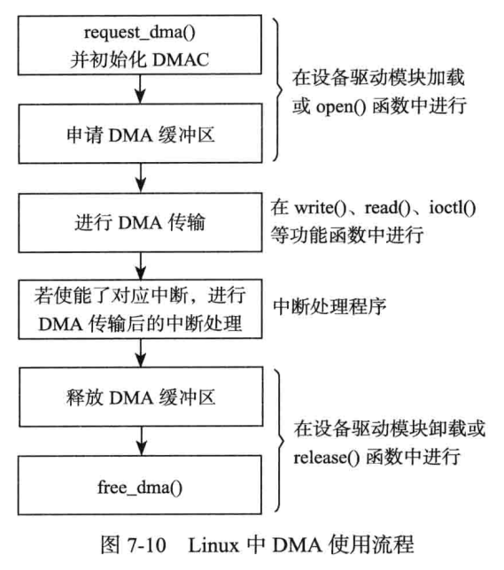

# DMA

## 1 cache和DMA一致性

解决由于DMA导致的cache一致性的问题的最简单的方法是　直接禁止DMA目标地址范围内内存的Cache功能。

## 2 DMA

​	内存中用于和外设交互数据的一块区域被叫做DMA缓冲区，在设备不支持scatter/gather(分散/聚集)操作的情况下，DMA缓冲区必须是物理上连续的。

​	对于ISA设备而言，其DMA操作这能在16MB一下的内存中进行，因此在使用kmalloc()和__get_free_pages()及其类似函数申请DMA缓冲区时应使用GFP_DMA标志，这样能保证获得内存是具备DMA能力的(DMA-capable)

### 2.1 	总线地址和物理地址

​	基于DMA的硬件使用总线地址而不是物理地址。

- 总线地址：从设备角度看到的内存地址。
- 物理地址：从ＣＰＵ角度上看到的未经转换的内存地址（经过转换的为虚拟地址）

虽然在pc上，对于ISA和PCI设备而言，总线地址就是物理地址，但并非每个平台都是如此。因为有时候接口总线通过桥接电路连接，桥接电路会将IO地址映射为不同的物理地址。


内核提供了如下函数用于进行简单的虚拟地址/总线地址转换：

```c
unsigned long virt_to_bus(void *address);
void *bus_to_virt(unsigned long address);
```

对于设备驱动程序员而言，更多的是关心dma地址，它用来在设备和主存之间寻址，虽然它就是总线地址，但是从内核代码的角度，它被叫做dma地址，与之对应的数据结构是dma_addr_t.

### 2.2 DMA的使用流程




设备xxx使用了dma，dma相关的信息应该被添加到设备结构体内。

- 在模块加载函数或打开函数中，应该申请dma通道和终端并且初始化dma。
- 不论是内存->IO的dma,还是IO->内存的dma,都应该使用下面的和硬件相关的设置函数。
- 中断服务程序完成DMA的善后处理，有时候正是中断事件的到来才触发一次dma的传输

```c
dma.c:EXPORT_SYMBOL(dma_spin_lock);
dma.c:EXPORT_SYMBOL(request_dma);
dma.c:EXPORT_SYMBOL(free_dma);
dma.c:EXPORT_SYMBOL(set_dma_sg);
dma.c:EXPORT_SYMBOL(__set_dma_addr);
dma.c:EXPORT_SYMBOL(set_dma_count);
dma.c:EXPORT_SYMBOL(set_dma_mode);
dma.c:EXPORT_SYMBOL(enable_dma);
dma.c:EXPORT_SYMBOL(disable_dma);
dma.c:EXPORT_SYMBOL(dma_channel_active);
dma.c:EXPORT_SYMBOL(set_dma_page);
dma.c:EXPORT_SYMBOL(set_dma_speed);
dma.c:EXPORT_SYMBOL(get_dma_residue);
```

- 内存到ＩＯ的ＤＭＡ发送通常是由上层触发
- IO到内存的DMA传送通常是由外设收到了数据之后的中断触发


