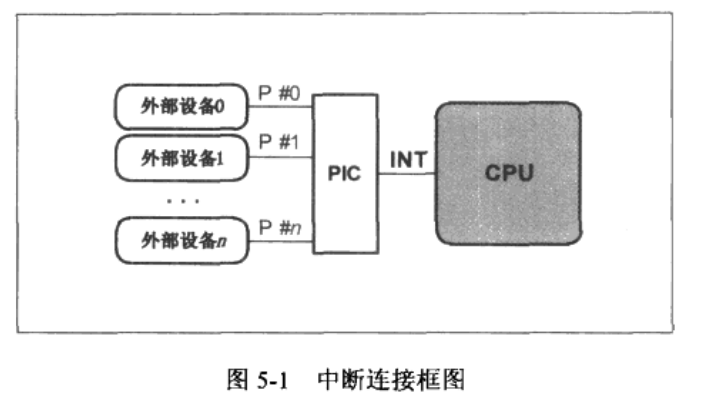
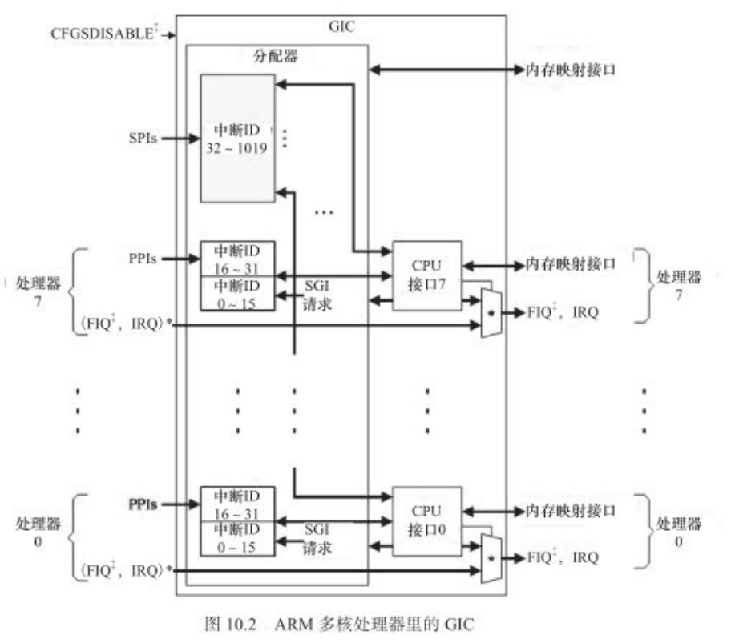

# 中断

​	外部设备和cpu交互一般有两种手段：轮询和中断


- 中断服务程序的执行是和一般的进程是异步的，也就是说不存在于进程上下文，所以要求中断服务程序的时间尽可能的短。
- 顶半部完成尽可能少的比较紧急的功能，它往往只是简单地读取寄存器中的中断状态并清除中断标识后就进行**登记中断**(所谓登记中断是指，将底半部处理程序挂到该设备的底半部执行队列中去)
- 中断处理和进程是cpu上两类完全独立的执行体，因此他们有两类上下文。


## 1 中断常用函数汇总

```c
typedef irqreturn_t (*irq_handler_t)(int, void *);

/*irq: 要申请的硬件中断号
　flags: 是中断处理的属性，若设置为了　SA_INTERRUPT,则表示中断处理程序是快速处理程序，快速处理程序被调用时屏蔽所有中断，慢速处理程序则不屏蔽*/
static inline int __must_check
request_irq(unsigned int irq, irq_handler_t handler, unsigned long flags,const char *name, void *dev)
{
    return request_threaded_irq(irq, handler, NULL, flags, name, dev);
}

const void *free_irq(unsigned int irq, void *dev_id)
    
    
/*这三个函数　作用于可编程中断控制器，因此，对系统内的所有cpu都生效*/    
void disable_irq(int irq) ;/*等待当前的中断处理完成*/
void disable_irq_nosync(int irq) ; /*执行之后立即返回*/
void enable_irq(int irq) ;

/*下面的这两个函数　只屏蔽本地cpu内的所有中断*/
void local_irq_save(unsigned long flags) ;
void local_irq_disable(void) ;

/*对应的加载函数*/
void local_irq_restore(unsigned long flags) ;
void local_irq_enable(void) ;
/*以上各local_开头的方法的作用范围是本cpu内*/
```

## 2 底半部处理机制

​	底半部的实现机制主要有tasklet、工作队列和软中断

### 2.1 tasklet

```c
#define DECLARE_TASKLET(name, func, data) \                                             struct tasklet_struct name = { NULL, 0, ATOMIC_INIT(0), func, data }
```

使用模板

```c
/*定义　tasklet和底半部函数关联*/

void xxx_do_tasklet(unsigned long) ;
DECLARE_TASKLET(xxx_tasklet, xxx_do_tasklet, 0) ;

/*中断处理底半部*/
void xxx_do_tasklet(unsigned long)
{
    ...
}

/*中断处理顶半部*/
irqreturn_t xxx_interrupt(int irq, void *dev_id, struct pt_regs *regs)
{
    ...
    tasklet_schedule(&xxx_tasklet) ;
    ...

    return IRQ_HANDLED ;
}

/*设备驱动模块加载函数*/
int __init xxx_init(void)
{
    ...
    /*申请中断*/
    result = request_irq(xxx_irq, xxx_interrupt, SA_INTERRUPT, "xxx", NULL) ;
    ...
}

/*设备驱动模块卸载函数*/
void __exit xxx_exit(void)
{
    ...
    /*释放中断*/
    free_irq(xxx_irq, xxx_interrupt) ;
    ...
}
```

### 2.2 软中断

​	软中断是用软件方式模拟硬件中断的概念，实现宏观上的异步执行效果。事实上，tasklet也是基于软中断实现的。异步ＩＯ中所基于的信号也类似于中断。

#### 2.2.1 硬中断/软中断/信号的区别

- 硬中断：外部设备对cpu的中断
- 软中断：程序对内核的中断（软中断是用软件方式模拟硬件中断的概念）
- 信号：由内核（或者其他进程）对某个进程的中断

#### 2.2.2 软中断使用

​	一般驱动开发用不到软中断

​	在linux内核中，用softirq_action结构体表征一个软中断，这个结构体中包含软中断处理函数指针和传递给该函数的参数。使用open_softirq()可以注册软中断对应的处理函数，而raise_softirq()函数可以触发一个软中断

```c

enum
{
    HI_SOFTIRQ=0,
    TIMER_SOFTIRQ,
    NET_TX_SOFTIRQ,
    NET_RX_SOFTIRQ,
    BLOCK_SOFTIRQ,
    IRQ_POLL_SOFTIRQ,
    TASKLET_SOFTIRQ,
    SCHED_SOFTIRQ,
    HRTIMER_SOFTIRQ, /* Unused, but kept as tools rely on the
                numbering. Sigh! */
    RCU_SOFTIRQ,    /* Preferable RCU should always be the last softirq */

    NR_SOFTIRQS                                                                                                                                               
};


static struct softirq_action softirq_vec[NR_SOFTIRQS] __cacheline_aligned_in_smp;

void open_softirq(int nr, void (*action)(struct softirq_action *)) 
{
    softirq_vec[nr].action = action;
}


void raise_softirq(unsigned int nr)
{
    unsigned long flags;
    local_irq_save(flags);
    raise_softirq_irqoff(nr);
    local_irq_restore(flags);
}

```

检索内核中软中断的注册情况：

```sh
colby@colby-myntai:~/work300GB/cbx-study/linux-kernel/linux-4.13.1$ grep -inR open_softirq
net/core/dev.c:8692:	open_softirq(NET_TX_SOFTIRQ, net_tx_action);
net/core/dev.c:8693:	open_softirq(NET_RX_SOFTIRQ, net_rx_action);
kernel/rcu/tree.c:4223:	open_softirq(RCU_SOFTIRQ, rcu_process_callbacks);
kernel/rcu/tiny.c:241:	open_softirq(RCU_SOFTIRQ, rcu_process_callbacks);
kernel/softirq.c:447:void open_softirq(int nr, void (*action)(struct softirq_action *))
kernel/softirq.c:659:	open_softirq(TASKLET_SOFTIRQ, tasklet_action);
kernel/softirq.c:660:	open_softirq(HI_SOFTIRQ, tasklet_hi_action);
kernel/time/timer.c:1862:	open_softirq(TIMER_SOFTIRQ, run_timer_softirq);
kernel/sched/fair.c:9501:	open_softirq(SCHED_SOFTIRQ, run_rebalance_domains);
block/blk-softirq.c:174:	open_softirq(BLOCK_SOFTIRQ, blk_done_softirq);
include/linux/interrupt.h:501:extern void open_softirq(int nr, void (*action)(struct softirq_action *));
lib/irq_poll.c:209:	open_softirq(IRQ_POLL_SOFTIRQ, irq_poll_softirq);
#从中得出结论，我们系统中所使用的软中断号　就是enum{}中的这些，这里有个疑问，既然tasklet是基于软中断的，那它多对应的软中断号是多少？？？
TASKLET_SOFTIRQ
```


### 2.3 工作队列

```c
/*定义　工作队列和关联函数*/
struct work_struct xxx_wq ;
void xxx_do_work(unsigned long) ;


/*中断处理底半部*/
void xxx_do_work(unsigned long)
{
    ...
}

/*中断处理顶半部*/
irqreturn_t xxx_interrupt(int irq, void *dev_id, struct pt_regs *regs)
{
    ...
    schedule_work(&xxx_wq) ;
    ...

    return IRQ_HANDLED ;
}

/*设备驱动模块加载函数*/
int __init xxx_init(void)
{
    ...
    /*申请中断*/
    result = request_irq(xxx_irq, xxx_interrupt, SA_INTERRUPT, "xxx", NULL) ;
    ...

    /*初始化工作队列*/
    INIT_WORK(&xxx_wq, (void(*)(void *)) xxx_do_work, NULL) ;
}

/*设备驱动模块卸载函数*/
void __exit xxx_exit(void)
{
    ...
    /*释放中断*/
    free_irq(xxx_irq, xxx_interrupt) ;
    ...
}
```

### 2.4 threaded_irq

​	在内核中，除了可以通过request_irq()、devm_request_irq()申请中断以外，还可以通过request_thread_irq()和devm_request_threaded_irq()申请。

```c
int request_threaded_irq(unsigned int irq, irq_handler_t handler,irq_handler_t thread_fn, unsigned long irqflags,const char *devname, void *dev_id);

int devm_request_threaded_irq(struct device *dev, unsigned int irq,irq_handler_t handler, irq_handler_t thread_fn,unsigned long irqflags, const char *devname,void *dev_id);


static inline int __must_check
request_irq(unsigned int irq, irq_handler_t handler, unsigned long flags,const char *name, void *dev)
{
    return request_threaded_irq(irq, handler, NULL, flags, name, dev);
}

static inline int __must_check
devm_request_irq(struct device *dev, unsigned int irq, irq_handler_t handler,unsigned long irqflags, const char *devname, void *dev_id)
{
    return devm_request_threaded_irq(dev, irq, handler, NULL, irqflags,devname,dev_id);
}


```

​	从上述的函数原型中我们发现，request_irq->request_threaded_irq

​	用request_threaded_irq和devm_request_threaded_irq这两个api申请中断的时候，内核会为相应的中断号分配一个对应的内核线程。注意这个内核线程只针对这个中断号，如果其他中断也通过request_threaded_irq申请，自然会得到新的内核线程。

​	参数handler对应的函数执行在中断上下文中，thread_fn参数对应的函数则执行在内核线程中。

​	如果handler结束的时候，返回值是IRQ_WAKE_THREAD,内核会调度对应线程执行thread_fn对应的函数。

​	request_threaded_irq()和devm_request_threaded_irq()支持在irqflags中设置IRQF_ONESHOT标记，这样内核会自动帮助我们在中断上下文中屏蔽对应的中断号，而在内核调度thread_fn执行后，重新使能该中断号。对于我们无法在上半部清除中断的情况，IRQF_ONESHOT特别有用，避免了中断服务程序一退出，中断就洪泛的情况。handler参数可以设置为NULL,这种情况下，内核会默认的调用irq_default_primary_handler()来代替handler,并会使用IRQF_ONESHOT标记。

```c
static irqreturn_t irq_default_primary_handler(int irq, void *dev_id)
{
    return IRQ_WAKE_THREAD;
}
```


### 2.5 总结

**三种底半部处理程序所处的上下文：**

- 软中断和tasklet是运行在中断上下文
- 工作队列在进程上下文中
- 在中断上下文中不能休眠，在进程上下文中是可以的。
- local_bh_disable()和local_bh_enable()是内核中用于禁止和使能软中断和tasklet底半部机制的函数

## 3 中断实例分析

vim ./drivers/input/keyboard/gpio_keys.c

## 4 中断的硬件框架

### 4.1 pic中断控制器

​	处理器一般只有两根左右的中断引脚，而管理的设备却很多。为了解决这个问题，现代设备的中断信号线并不是和处理器直接相连的。而是和一个称为中断控制器的设备相连接的，后者才是和cpu的中断引脚直接相连的。



​	中断处理框架也需要提供适当的pci配置接口函数供设备驱动程序调用，因为设备驱动所管理的设备也许并不是一开始就连接到pci的某一中断引脚上的。如果在系统运行起来之后，某一外设才被用户接入系统，那么它的驱动程序应该负责配置pci的对应引脚，使得该外设能正常中断处理器。

​	对pci的配置工作主要包括：

1. 设定外部设备中断触发电信号(水平触发和边沿触发)
2. 将外设的中断引脚编号映射到处理器可见的软件中断号irq
3. 屏蔽掉某些外部设备的中断触发

为了让处理器可以配置pic，pic常常需要提供一系列的控制寄存器。这些控制寄存器可以完成上述所有配置工作，并且配置粒度可以细分到pic的每一个中断输入引脚p.

#### 4.1.1 软件中断号

软件中断号irq，他是发生设备中断时处理器**从pic中读到的中断号码**,在操作系统建立的中断处理框架内，会使用这个irq号来标识一个外设的中断并调用对应的中断处理历程。

​	具体调用实例：

​	拿5-1图中，外部设备０触发一个中断电信号被处理的大体流程。

- pic将首先会接受到该信号，如果它没有被屏蔽，那么pic应该在int引脚产生一个中断信号告诉cpu
- cpu在接受到该信号后会从pic哪里得到一个特定的标识号码，该号码告诉中断处理框架，是设备0发生了中断。
- 于是中断处理框架会调用设备0的中断处理历程，此处的这个特定的标识设备０的中断号码就被称作软件中断号或者中断号irq.

### 4.2 gic中断控制器

​	在arm多核处理器里常用的中断控制器是gic，它支持三种类型的中断。



