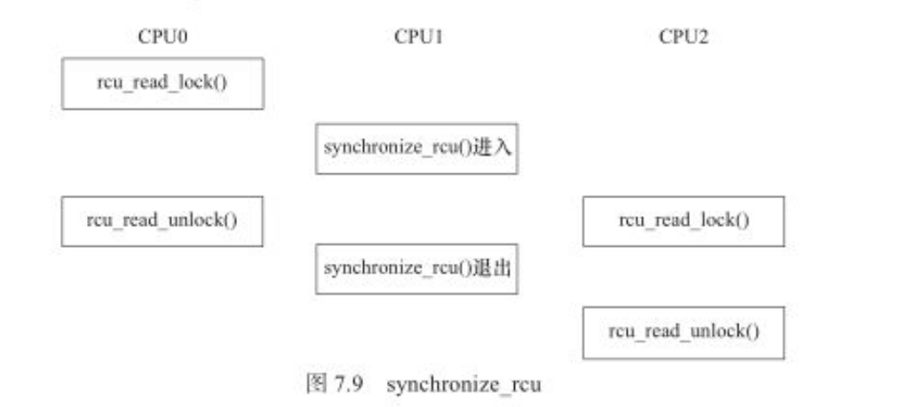

# 并发访问

## 1 中断屏蔽

在linux内核中的进程调度等操作都是依赖中断来实现的。中断屏蔽使得中断和进程之间不再发生并发。

由于linux系统的异步IO，进程调度等很多重要操作都依赖于中断，中断对于内核的运行非常的重要，在屏蔽中断期间所有的中断都无法处理，因此长时间屏蔽中断是很危险的。

local_irq_disable()和local_irq_enable()都只能禁止和使能本cpu内的中断。**因此不能解决SMP多CPU引发的竞态。因此，单独使用中断屏蔽通常不是一种值得推荐的避免竞态的方法，它适宜和自旋锁联合使用。**

## 2 原子操作

原子操作指的是在执行过程中不会被别的代码路径所中断的操作。

原子操作分为　位的原子操作　整形变量的原子操作

内核代码可以安全调用他们而不会被他们打断。位和整形变量的原子操作都是依赖底层的cpu的原子操作来实现的，因此所有这些函数都与cpu架构密切相关的。

### 2.1 整形原子操作

```c
void atomic_set(atomic_t *v, int i) ; //设置原子变量的值
atomic_t v = ATOMIC_INIT(0) ; //定义原子变量v 并初始化为０

atomic_read(atomic_t *v) ;//返回原子变量的值

void atomic_add(int i, atomic_t *v) ;//原子变量增加i
void atomic_sub(int i, atomic_t *v) ;//原子变量减少i

void atomic_inc(atomic_t *v) ;//原子变量增加１
void atomic_dec(atomic_t *v) ;//原子变量减少１

//操作并测试
int atomic_inc_and_test(atomic_t *v) ;
int atomic_dec_and_test(atomic_t *v) ;
int atomic_sub_and_test(int i, atomic_t *v) ;
//上述操作对原子变量执行自增、自减和减操作后(注意没有加)测试其是否为0,为0则返回true,否则返回false

//操作并返回
int atomic_add_return(int i, atomic_t *v) ;
int atomic_sub_return(int i, atomic_t *v) ;
int atomic_inc_return(atomic_t *v) ;
int atomic_dec_return(atomic_t *v) ;
//上述操作对原子变量进行加/减　和　自增/自减操作，并返回新的值

```

### 2.2 位原子操作

```c
void set_bit(nr, void *addr) ;//设置addr地址中的值的第nr位为１
void clear_bit(nr, void *addr) ;

void change_bit(nr, void *addr) ;//将对应位　反置

test_bit(nr, void *addr) ;//返回addr地址的第nr位

int test_and_set_bit(nr, void *addr) ;
int test_and_clear_bit(nr, void *addr) ;
int test_and_change_bit(nr, void *addr) ;
//上述test_and_xxx_bit(nr, void *addr) 操作等同于执行test_bit(nr, void *addr)后再执行xxx_bit(nr, void *addr) ;

```

```c
//目的，使设备最多只能被一个进程打开
static atomic_t xxx_available = ATOMIC_INIT(1) ;//定义原子变量

static int xxx_open(struct inode *inode, struct file *filp)
{
    ...
    if(!atomic_dec_and_test(&xxx_available))
    {
        atomic_inc(&xxx_available) ;
        return -EBUSY ;//设备已经打开
    }

    ...
    return 0 ;//成功
}

static int xxx_release(struct inode *inode, struct file *filp)
{
    atomic_inc(&xxx_available) ;//释放设备
    return 0 ;
}
```

## 3 自旋锁(spin lock)

背景：

- 由于中断屏蔽会使得中断得不到响应，从而导致系统性能变差；
- 而原子操作受限于cpu,只能实现有限几种基本数据类型的排他操作。
- 为此linux内核又设计了自旋锁以实现共享资源的同步访问。


为了获得一个自旋锁，在某cpu上运行的代码需要**执行一个原子操作，该操作测试并设置(test-and-set)某个内存变量，由于是原子操作，所以在该操作完成之前其他执行单元(cpu)不能访问这个内存变量.**

如果测试结果表明锁已经空闲，则程序获得这个自旋锁并继续执行；如果测试结果表明锁任然被占用，程序将在一个小的循环内重复这个“测试并设置”操作，即进行所谓的“自旋”。当自旋锁的持有者通过重置该变量释放这个自旋锁后，某个等待的“测试并设置”操作向其调用者报告锁已经释放。

```c
spinlock_t spin ;//定义自旋锁

spin_lock_init(lock) ;//动态初始化自旋锁

spin_lock(lock) ;//获得自旋锁　如果能够立即获得自旋锁，它就马上返回，否则，它将自旋在那里，直到该自旋锁的保持者释放。
spin_trylock(lock) ;//获得自旋锁，如果能立即获得锁，它获得锁并返回真，否则立即返回假，而不再，原地打转

spin_unlock(lock) ; //它和spin_trylock或spin_lock配对使用。

```

spin_lock使用案例：

```c
//定义一个自旋锁
spinlock_t lock ;
spin_lock_init(&lock) ;
spin_lock_init(&lock) ;//获得自旋锁，保护临界区
...//临界区
spin_unlock(&lock) ;//解锁
```

使得一个设备只能同时有一个文件打开

```c
int xxx_count = 0 ;//定义文件打开次数计数
spinlock_t lock ;


static int xxx_open(struct inode *inode, struct file *filp)
{
    ...
    spin_lock(&xxx_lock) ;
    if(xxx_count)//已经打开
    {
        spin_unlock(&xxx_lock) ;
        return -EBUSY ;
    }
    xxx_count++ ;
    spin_unlock(&xxx_lock) ;
    ...

    return 0 ;//成功
}

static int xxx_release(struct inode *inode, struct file *filp)
{
    ...
    spin_lock(&xxx_lock) ;
    xxx_count-- ;
    spin_unlock(&xxx_lock) ;
    ...
    
    return 0 ;//成功
}

void xxx_probe(...)
{
    ...
    spin_lock_init(&lock) ;
    ...
}
```


### 3.1 使用场景

- SMP和单cpu可抢占的情况

自旋锁**主要针对SMP或单CPU但内核可抢占的情况**，对于单cpu且内核不支持抢占的系统，自旋锁退化为空操作。**在单cpu且内核可抢占的系统中,自旋锁持有期间内核的抢占将被禁止。**由于内核可抢占的单cpu系统的行为实际类似于smp系统，因此在这样的单cpu系统中使用自旋锁仍十分必要。

- 中断处理程序中不可以使用自旋锁

背景：

​	自旋锁可以保证临界区**不受到别的CPU和本CPU内的抢占进程打扰，但是得到锁的代码路径在执行临界区的时候，还可能受到中断和底半部(bh)的影响。**

如果中断处理中使用了自旋锁场景分析(错误的场景)：

1. 一个进程正在访问临界区，
2. 此时本cpu或者其他核的cpu产生了一个中断，cpu转为去执行中断处理程序
3. 在中断处理程序中此时申请自旋锁，由于之前本cpu的进程并没有释放自旋锁,这里中断服务程序会死等。**导致系统其他中断得不到相应。或者本cpu卡死死锁，其他cpu上到不至于死锁，但是会造成其他中断得不到响应。**　对于本cpu而言这种情况相当于是**递归使用了一个自旋锁**


- 使用自旋锁的注意事项：

1. 临界区很大或者共享设备时，需要较长时间占用锁，使用自旋锁会降低系统的性能。

2. 自旋锁可能导致系统死锁。

   引发这个问题最常见的情况是**递归使用一个自旋锁**，即如果一个已经拥有某个自旋锁的cpu想第二次获得这个自旋锁，则该cpu将产生死锁

3. 如果进程获得自旋锁之后再阻塞，也是有可能导致死锁的发生。

   这种情况下死锁产生的情况是：　cpu在获得了自旋锁的情况下，在执行临界区代码的时候，导致该进程阻塞，从而该进程让出了cpu执行路径，此时另外一个进程得到了新的调度。第二个进程也申请同样的自旋锁，此时就会导致死锁的产生。

   **结论：在临界区不能调用函数 copy_from_user()、copy_to_user()、kmalloc()等函数，他们可能由于内存缺页而引起阻塞。**

4. 在多核编程的时候，如果进程和中断可能访问同一片临界资源，我们一般需要在进程上下文中调用spin_lock_irqsave/spin_lock_unlock_irqrestore(),在中断上下文中调用spin_lock()/spin_unlock(),此后，如果cpu1无论是进程上下文，还是中断上下文，想要获得同一spinlock，都必须忙等待，这避免了一切核间并发的可能性。同时，由于每个核的进程上下文持有锁的时候用的是spin_lock_irqsave(),所以该核上的中断是不可能进入的，这避免了核内并发的可能性。

### 3.2 整套自旋锁机制(考虑中断影响的自旋锁)

```c
spin_lock_irq() = spin_lock() + local_irq_disable() ;
spin_unlock_irq() = spin_unlock() + local_irq_enable() ;

spin_lock_irqsave() = spin_lock() + local_irq_save() ;
spin_unlock_irqstore() = spin_unlock() + local_irq_restore() ;

spin_lock_bh() = spin_lock() + local_bh_disable() ;
spin_unlock_bh() = spin_lock() + local_bh_enable() ;

```

这样就可以控制进程和中断处理程序这两个独立执行单元对临界区的同步访问。这就保证了已拥有自旋锁的进程，能够在本cpu下顺利地完成相应临界区的执行，而不致使阻塞死锁。

### 3.3 其他自旋锁

#### 3.3.1 读写自旋锁(rwlock)

背景：对共享资源并发访问时，多个执行单元**同时读取它是不会有问题的，**在这种背景下产生了读写自旋锁(rwlock)**可允许读的并发**。


读写自旋锁是一种比自旋锁粒度更小的锁机制，它保留了自旋的概念。

- 在写操作方面只能最多有一个写进程
- 在读方面可以同时有多个读执行单元
- 不能同时进行读和写

```c
rwlock_t my_rwlock = RW_LOCK_UNLOCKED ;//静态初始化

rwlock_t my_rwlock ;
rwlock_init(&my_rwlock) ;//动态初始化

//读锁定
void read_lock(rwlock_t *lock) ;
void read_lock_irqsave(rwlock_t *lock, unsigned long flags) ;
void read_lock_irq(rwlock_t *lock) ;
void read_lock_bh(rwlock_t *lock) ;

//读解锁
void read_unlock(rwlock_t *lock) ;
void read_unlock_irqrestore(rwlock_t *lock, unsigned long flags) ;
void read_unlock_irq(rwlock_t *lock) ;
void read_unlock_bh(rwlock_t *lock) ;
//在对共享资源进行读取之前，应该先调用读锁定函数，完成之后应该调用读解锁函数

//写锁定
void write_lock(rwlock_t *lock) ;
void write_lock_irqsave(rwlock_t *lock, unsigned long flags) ;
void write_lock_irq(rwlock_t *lock) ;
void write_lock_bh(rwlock_t *lock) ;
void write_trylock(rwlock_t *lock) ;

//写解锁
void write_unlock(rwlock_t *lock) ;
void write_unlock_irqrestore(rwlock_t *lock, unsigned long flags) ;
void write_unlock_irq(rwlock_t *lock) ;
void write_unlock_bh(rwlock_t *lock) ;
```

```c
rwlock_t lock ;//定义rwlock 
rwlock_init(&lock) ;

//读时获取锁
read_lock(&lock) ;
...//临界资源
read_unlock(&lock) ;

//写时获得锁
write_lock_irqsave(&lock, flags) ;
...
write_unlock_irqrestore(&lock, flags) ;


```

#### 3.3.2 顺序锁(seqlock)

​	seqlock是对rwlock的一种优化，如果使用seqlock,读执行单元绝不会被写执行单元阻塞**（读执行单元可以在写执行单元对被seqlock保护的共享资源进行写操作时任然可以继续读，而不必等到写执行单元完成写操作；写执行单元也不需要等待所有读执行单元完成操作在去进行写操作；）**

- 写执行单元和写执行单元任然保持互斥。读和写执行单元是互相不阻塞的
- 如果读执行单元在读操作期间，写执行单元已经发生了写操作，那么读执行单元必须重新读取数据，以便确保得到的数据是完整的。**在小概率读写同时进行的场景下，用seqlock的性能是非常好的，它允许读写同时进行，大大的提高了并发性**
- **seqlock有一个限制，在临界区不能使用指针，**因为写执行单元可能使得指针失效，但读执行单元如果正要访问该指针，将导致内核异常(oops) ;


在linux内核中，**写执行单元**涉及如下顺序锁操作

```c
//获得顺序锁
void write_seqlock(seqlock_t *sl) ;
int write_tryseqlock(seqlock_t *sl) ;
write_seqlock_irqsave(lock, flags) ;
write_seqlock_irq(lock) ;
write_seqlock_bh(lock) ;

//释放顺序锁
void write_sequnlock(seqlock_t *sl) ;
write_sequnlock_irqrestore(lock, flags) ;
write_sequnlock_irq(lock) ;
write_sequnlock_bh(lock) ;
```

写执行单元使用模板

```c
write_seqlock(&seqlock_a) ;
...//写操作代码块
write_sequnlock(&seqlock_a) ;
```

在linux内核中，**读执行单元**涉及如下顺序锁操作

```c
//读开始
unsigned read_seqbegin(const seqlock_t *sl) ;
read_seqbegin_irqsave(lock, flags) ;

//重读
//读执行单元在访问完被seqlock保护的共享资源后需要调用该函数，来检查在读访问期间是否有写操作，如果有写操作，读执行单元就需要重新进行读操作
int read_seqretry(const seqlock_t *sl, unsigned iv) ;
read_seqretry_irqrestore(lock, iv, flags) ;
```

使用模板

```c
//读执行代码模板
do{
    seqnum = read_seqbegin(&seqlock_a) ;
    //读操作代码块
    ...

}while(read_seqretry(&seqlock_a, seqnum));
```

### 3.4 spinlock rwlock seqlock对比


- spinlock 拿不到锁就自旋
- rwlock 同时允许多个读，其他情况都是不允许自旋
- seqlock不允许多个同时写，其他情况都是允许的，读有时会重复读

## 4 信号量(semaphore)

semaphore是保护临界区的另外一种常用的方法，和自旋锁类似的地方是，只有得到semaphore的进程才能执行临界区代码，但是和自旋锁不同的是，当获取不到semaphore时，进程不会原地打转而是进入休眠状态。

```c
//定义semaphore
struct semaphore sem ;

//初始化semaphore
void sema_init(struct semaphore *sem, int val) ;//,设置semaphore的值为val，尽管semaphore可以被初始化为大于1的值从而成为一个计数信号量，但是它通常不被这样使用。
void init_MUTEX(struct semaphore *sem) ;//＝　sema_init(struct semaphore *sem, 1) 该函数用于初始化一个用于互斥的信号量，它把semaphore的值设置为１
void init_MUTEX_LOCKED(struct semaphore *sem) ;//= sema_init(struct semaphore *sem, 0),用于初始化一个semaphore将semaphore的值设置为0 ;

//定义并初始化semaphore的快捷方式
DECLARE_MUTEX(name) ;//= struct semaphore name ; sema_init(&name, 1) ; 
DECLARE_MUTEX_LOCKED(name) ;//= struct semaphore name ; sema_init(&name, 0) ; 

//获得信号量
void down(struct semaphore *sem) ;//用于获得semaphore,他会导致睡眠（一旦进入睡眠不可以被信号打断），不能用于中断上下文中,
void down_interruptible(struct semaphore *sem) ;//进入休眠后,可以被信号打断，信号也会导致该函数返回，以响应系统的某些状态变化。这时候该函数的返回值为非0，如果检测到返回值非0,处理措施是紧接着返回 -ERESTARTSYS ;
int down_trylock(struct semaphore *sem) ;//尝试获得semaphore,如果立即获得返回0，否则非0，不会导致调用者睡眠，可以在中断上下文使用。


//释放信号量
void up(struct semaphore *sem) ;//释放semaphore,唤醒等待者

```

```c
//定义semaphore
DECLARE_MUTEX(mount_sem) ;

down(&mount_sem) ;//获取semaphore
...
up(&mount_sem) ;//释放semaphore
```

```c
//使用信号量实现设备只能被一个进程打开

static DECLARE_MUTEX(xxx_lock) ;

static int xxx_open(struct inode *inode, struct file *filp)
{
    ...
    if(down_trylock(&xxx_lock))//获得打开锁
    {
        return -EBUSY ;//设备忙
    }

    ...
    return 0 ;
}

static int xxx_release(struct inode *inode, struct file *filp)
{
    up(&xxx_lock) ;//释放锁
    return 0 ;
}
```


说明：这些函数调用接口是旧版的，新版linux没有这些接口

```c
void init_MUTEX(struct semaphore *sem) ;
void init_MUTEX_LOCKED(struct semaphore *sem) ;
DECLARE_MUTEX(name) ;
DECLARE_MUTEX_LOCKED(name) ;

```

semaphore和内核中的pv操作对应：

p(s):

- 将semaphore的值减１　s = s -1
- 如果 s >= 0 则该进程继续执行，否则该进程将被设置为等待状态，排入等待队列中

v(s):

- 将semaphore的值加1 s = s + 1
- 如果　s > 0, 唤醒队列中等待semaphore的进程

### 4.1 使用场景

#### 4.1.1 同步

这些也是旧版的同步：

semaphore除了可以保护临界资源，还可以用于两个执行单元的同步通信。**同步好比生产流程，保证执行的先后顺序。**


必须先做完　c 工序，才能进一步的做　b　工序


新版本同步图：


**在内核中semaphore更多的用于解决同步问题中。**

同步的例子：linux-4.13.1$ vim drivers/scsi/aacraid/commctrl.c +206 sema_init(&fibctx->wait_sem, 0); 

说明：个人认为将semaphore初始化为0，的情况下,当进行p　＝　down操作的时候　　semaphore < 0此时会睡眠，等待有一个 　v = up　操作的时候才能　唤醒，起到同步的效果

```c
static int open_getadapter_fib(struct aac_dev * dev, void __user *arg)
{
		/*
			初始化用于等待下一个AIF的互斥体。
		 *	Initialize the mutex used to wait for the next AIF.
		 */
		sema_init(&fibctx->wait_sem, 0);//初始化semaphore
}

static int next_getadapter_fib(struct aac_dev * dev, void __user *arg)                                                                                        
{
	down_interruptible(&fibctx->wait_sem);//P操作，如果这里得不到semaphore 将会休眠等待
}

int aac_do_ioctl(struct aac_dev * dev, int cmd, void __user *arg)                                                                                             
{
    int status;

    mutex_lock(&dev->ioctl_mutex);

    if (dev->adapter_shutdown) {
        status = -EACCES;
        goto cleanup;
    }

    /*
     *  HBA gets first crack
     */

    status = aac_dev_ioctl(dev, cmd, arg);
    if (status != -ENOTTY)
        goto cleanup;

    switch (cmd) {
    case FSACTL_OPEN_GET_ADAPTER_FIB:
        status = open_getadapter_fib(dev, arg);
        break;
      case FSACTL_GET_NEXT_ADAPTER_FIB:
        status = next_getadapter_fib(dev, arg);
        break;
    }
}

drivers/scsi/aacraid/linit.c

static int aac_ioctl(struct scsi_device *sdev, int cmd, void __user * arg) 
{
    struct aac_dev *dev = (struct aac_dev *)sdev->host->hostdata;
    if (!capable(CAP_SYS_RAWIO))
        return -EPERM;
    return aac_do_ioctl(dev, cmd, arg);
}

static struct scsi_host_template aac_driver_template = {
    .ioctl              = aac_ioctl,
    .eh_host_reset_handler      = aac_eh_reset,
};

static int aac_probe_one(struct pci_dev *pdev, const struct pci_device_id *id)
{
    shost = scsi_host_alloc(&aac_driver_template, sizeof(struct aac_dev));

}

static struct pci_driver aac_pci_driver = {
    .probe      = aac_probe_one,  
}  

static int __init aac_init(void)
{
    error = pci_register_driver(&aac_pci_driver);  
}


//唤醒等待
static void wakeup_fibctx_threads(struct aac_dev *dev,
                        struct hw_fib **hw_fib_pool,
                        struct fib **fib_pool,
                        struct fib *fib,
                        struct hw_fib *hw_fib,                                                                                                                
                        unsigned int num)
{
	up(&fibctx->wait_sem);//此时唤醒这种等待
}

static void aac_process_events(struct aac_dev *dev)
{   
    wakeup_fibctx_threads(dev, hw_fib_pool, fib_pool,
                                fib, hw_fib, num);
}

int aac_command_thread(void *data)
{                       
    aac_process_events(dev);
}
static int _aac_reset_adapter(struct aac_dev *aac, int forced, u8 reset_type)
{  
    aac->thread = kthread_run(aac_command_thread, aac, "%s",                                                                                              
                      aac->name);

}
int aac_reset_adapter(struct aac_dev *aac, int forced, u8 reset_type)
{     
    retval = _aac_reset_adapter(aac, bled, reset_type); 
}

//和.ioctl初始化一样　看前面的probe函数 
static int aac_eh_reset(struct scsi_cmnd* cmd) 
{     
	aac_reset_adapter(aac, 2, IOP_HWSOFT_RESET); 
}

//疑问　是谁调用了ioctl而引起了休眠　　又是谁调用了wakeup_fibctx_threads　而唤醒的

//解答在那调用的
drivers/scsi/scsi_error.c　+748
static int scsi_try_host_reset(struct scsi_cmnd *scmd)
{
	rtn = hostt->eh_host_reset_handler(scmd);
}

```


重新分析一个　上面那个有点乱

drivers/input/misc/hp_sdc_rtc.c:106

#### 4.1.2 互斥

新版的互斥图：


说明：

​	用于新的linux内核更加倾向于使用mutex作为互斥手段，信号量用作互斥不在被推荐使用


这里有一个semaphore实现的只允许设备　读和写的时候只能由一个　用户进程操作的案例：

linux-4.13.1$ vim drivers/char/snsc.c +175

```c
struct subch_data_s {
    nasid_t sd_nasid;   /* node on which the subchannel was opened */
    int sd_subch;       /* subchannel number */
    spinlock_t sd_rlock;    /* monitor lock for rsv */
    spinlock_t sd_wlock;    /* monitor lock for wsv */
    wait_queue_head_t sd_rq;    /* wait queue for readers */
    wait_queue_head_t sd_wq;    /* wait queue for writers */
    struct semaphore sd_rbs;    /* semaphore for read buffer */
    struct semaphore sd_wbs;    /* semaphore for write buffer */

    char sd_rb[CHUNKSIZE];  /* read buffer */
    char sd_wb[CHUNKSIZE];  /* write buffer */
};


//中断处理　要么唤醒 读等待队列，要么唤醒写等待队列
static irqreturn_t
scdrv_interrupt(int irq, void *subch_data)
{
    struct subch_data_s *sd = subch_data;
    unsigned long flags;
    int status;

    spin_lock_irqsave(&sd->sd_rlock, flags);
    spin_lock(&sd->sd_wlock);
    status = ia64_sn_irtr_intr(sd->sd_nasid, sd->sd_subch);

    if (status > 0) {
        if (status & SAL_IROUTER_INTR_RECV) {
            wake_up(&sd->sd_rq);
        }   
        if (status & SAL_IROUTER_INTR_XMIT) {
            ia64_sn_irtr_intr_disable
                (sd->sd_nasid, sd->sd_subch,
                 SAL_IROUTER_INTR_XMIT);
            wake_up(&sd->sd_wq);
        }   
    }   
    spin_unlock(&sd->sd_wlock);
    spin_unlock_irqrestore(&sd->sd_rlock, flags);
    return IRQ_HANDLED;
}                                                 

static int
scdrv_open(struct inode *inode, struct file *file)
{
	struct sysctl_data_s *scd;
	struct subch_data_s *sd;
	int rv;

	/* look up device info for this device file */
	scd = container_of(inode->i_cdev, struct sysctl_data_s, scd_cdev);

	/* allocate memory for subchannel data */
	sd = kzalloc(sizeof (struct subch_data_s), GFP_KERNEL);
	if (sd == NULL) {
		printk("%s: couldn't allocate subchannel data\n",
		       __func__);
		return -ENOMEM;
	}

	/* initialize subch_data_s fields */
	sd->sd_nasid = scd->scd_nasid;
	sd->sd_subch = ia64_sn_irtr_open(scd->scd_nasid);

	if (sd->sd_subch < 0) {
		kfree(sd);
		printk("%s: couldn't allocate subchannel\n", __func__);
		return -EBUSY;
	}

	spin_lock_init(&sd->sd_rlock);
	spin_lock_init(&sd->sd_wlock);
	init_waitqueue_head(&sd->sd_rq);
	init_waitqueue_head(&sd->sd_wq);
	sema_init(&sd->sd_rbs, 1);//读semaphore = 1
	sema_init(&sd->sd_wbs, 1);

	file->private_data = sd;

	/* hook this subchannel up to the system controller interrupt */
	mutex_lock(&scdrv_mutex);
	rv = request_irq(SGI_UART_VECTOR, scdrv_interrupt,
			 IRQF_SHARED, SYSCTL_BASENAME, sd);
	if (rv) {
		ia64_sn_irtr_close(sd->sd_nasid, sd->sd_subch);
		kfree(sd);
		printk("%s: irq request failed (%d)\n", __func__, rv);
		mutex_unlock(&scdrv_mutex);
		return -EBUSY;
	}
	mutex_unlock(&scdrv_mutex);
	return 0;
}


static ssize_t
scdrv_read(struct file *file, char __user *buf, size_t count, loff_t *f_pos)
{
	int status;
	int len;
	unsigned long flags;
	struct subch_data_s *sd = (struct subch_data_s *) file->private_data;

	/* try to get control of the read buffer */
	if (down_trylock(&sd->sd_rbs)) {//如果获取不到semaphore会返回非0 立即返回
		/* somebody else has it now;
		 * if we're non-blocking, then exit...
		 */
		if (file->f_flags & O_NONBLOCK) {//判断app层read函数是否设置不允许阻塞读
			return -EAGAIN;//不阻塞立即返回
		}
		/* ...or if we want to block, then do so here */
		if (down_interruptible(&sd->sd_rbs)) {//设置了阻塞，当获取不到，将阻塞且允许被信号中断，如果信号打断了，则会返回非0
			/* something went wrong with wait */
			return -ERESTARTSYS;
		}
	}

    //能走到这里就说明，拿到了semaphore 且此时semaphore = 0
    
	/* anything to read? */
	len = CHUNKSIZE;
	spin_lock_irqsave(&sd->sd_rlock, flags);//获取自旋锁且关闭中断
	status = read_status_check(sd, &len);//检查硬件能否可以开始读了
	//如果硬件不能读，则进入while
	/* if not, and we're blocking I/O, loop */
	while (status < 0) {
        //
		DECLARE_WAITQUEUE(wait, current);//定义一个等待队列

		if (file->f_flags & O_NONBLOCK) {//能否阻塞
            //如果app层read不让阻塞读，就立马释放锁和semaphore并返回
			spin_unlock_irqrestore(&sd->sd_rlock, flags);
			up(&sd->sd_rbs);
			return -EAGAIN;
		}
        
        //到达这里说明app层read支持阻塞等

		len = CHUNKSIZE;
		set_current_state(TASK_INTERRUPTIBLE);//当进程休眠后可以被其他唤醒
		add_wait_queue(&sd->sd_rq, &wait);//加入等待队列中，
		spin_unlock_irqrestore(&sd->sd_rlock, flags);//在休眠前先释放自旋锁，但是没有将semaphore　up

		schedule_timeout(msecs_to_jiffies(SCDRV_TIMEOUT));//如果当前设备没有在SCDRV_TIMEOUT时间内通过中断的方式唤醒进程，就超时退出了

		remove_wait_queue(&sd->sd_rq, &wait);//不管咋滴醒来后，都清除等待队列
		if (signal_pending(current)) {//
			/* wait was interrupted */
			up(&sd->sd_rbs);
			return -ERESTARTSYS;
		}

		spin_lock_irqsave(&sd->sd_rlock, flags);//重新拿到自旋锁
		status = read_status_check(sd, &len);
	}
	spin_unlock_irqrestore(&sd->sd_rlock, flags);//释放锁，表示此时设备可以正常读了

	if (len > 0) {
		/* we read something in the last read_status_check(); copy
		 * it out to user space
		 */
		if (count < len) {
			pr_debug("%s: only accepting %d of %d bytes\n",
				 __func__, (int) count, len);
		}
		len = min((int) count, len);
		if (copy_to_user(buf, sd->sd_rb, len))//从sd->sd_rd中将结果读到用户空间中
			len = -EFAULT;
	}

	/* release the read buffer and wake anyone who might be
	 * waiting for it
	 */
	up(&sd->sd_rbs);//读完释放semaphore

	/* return the number of characters read in */
	return len;
}
/*
	小结：read()
	自旋锁保护的是　是否可以从设备中读
    semaphore保护的是当请只允许　一个用户可以read
*/


static ssize_t
scdrv_write(struct file *file, const char __user *buf,
	    size_t count, loff_t *f_pos)
{
	unsigned long flags;
	int status;
	struct subch_data_s *sd = (struct subch_data_s *) file->private_data;

	/* try to get control of the write buffer */
	if (down_trylock(&sd->sd_wbs)) {
		/* somebody else has it now;
		 * if we're non-blocking, then exit...
		 */
		if (file->f_flags & O_NONBLOCK) {
			return -EAGAIN;
		}
		/* ...or if we want to block, then do so here */
		if (down_interruptible(&sd->sd_wbs)) {
			/* something went wrong with wait */
			return -ERESTARTSYS;
		}
	}

	count = min((int) count, CHUNKSIZE);
	if (copy_from_user(sd->sd_wb, buf, count)) {
		up(&sd->sd_wbs);
		return -EFAULT;
	}

	/* try to send the buffer */
	spin_lock_irqsave(&sd->sd_wlock, flags);
	status = write_status_check(sd, count);

	/* if we failed, and we want to block, then loop */
	while (status <= 0) {
		DECLARE_WAITQUEUE(wait, current);

		if (file->f_flags & O_NONBLOCK) {
			spin_unlock_irqrestore(&sd->sd_wlock, flags);
			up(&sd->sd_wbs);
			return -EAGAIN;
		}

		set_current_state(TASK_INTERRUPTIBLE);
		add_wait_queue(&sd->sd_wq, &wait);
		spin_unlock_irqrestore(&sd->sd_wlock, flags);

		schedule_timeout(msecs_to_jiffies(SCDRV_TIMEOUT));

		remove_wait_queue(&sd->sd_wq, &wait);
		if (signal_pending(current)) {
			/* wait was interrupted */
			up(&sd->sd_wbs);
			return -ERESTARTSYS;
		}

		spin_lock_irqsave(&sd->sd_wlock, flags);
		status = write_status_check(sd, count);
	}
	spin_unlock_irqrestore(&sd->sd_wlock, flags);

	/* release the write buffer and wake anyone who's waiting for it */
	up(&sd->sd_wbs);

	/* return the number of characters accepted (should be the complete
	 * "chunk" as requested)
	 */
	if ((status >= 0) && (status < count)) {
		pr_debug("Didn't accept the full chunk; %d of %d\n",
			 status, (int) count);
	}
	return status;
}
```


## 5 互斥体mutex

```c
struct mutex my_mutex ;
mutex_init(&my_mutex) ;

//获取mutex
void mutex_lock(struct mutex *lock) ;//引起的休眠不能被信号打断
int mutex_lock_interruptible(struct mutex *lock) ;//休眠之后可以被打断
int mutex_trylock(struct mutex *lock) ;

//释放mutex
void mutex_unlock(struct mutex *lock) ;

```

```c
struct mutex my_mutex ; //定义mutex
mutex_init(&my_mutex) ;//初始化mutex

mutex_lock(&my_mutex) ;//获取mutex

...//临界区代码

mutex_unlock(&my_mutex) ;//释放mutex
```

### 5.1 mutex和spinlock选择

- 自旋锁和互斥体都是解决互斥问题的基本手段，选择的依据是临界区的性质和系统的特点。
- mutex和spinlock是不同层次的互斥手段(mutex的实现是依赖spinlock的，在mutex的实现中，为了保证mutex结构存取的原子性,需要spinlock来互斥，故spinlock是更底层的手段)
- mutex是代表进程来争夺资源的。如果竞争失败，会发生进程上下文切换，当前进程进入休眠状态，cpu将运行其他进程。**鉴于进程上下文切换的开销很大，因此，只有当进程占用资源时间比较长的时候，用互斥体是比较好的选择。**
- 当所要保护的临界区访问的时间比较短的时候，用spinlock是非常的方便的，因为它可以节约上下文切换的时间。但是cou得不到spinlock会在那里空转直到其他执行单元解锁为止，所以要求锁不能在临界区长时间停留，否则会降低系统的效率。

使用的三项原则：

1. 当lock不能获得的时候，使用mutex的开销是进程上下文切换时间，使用spinlock的开销是等待获取spinlock(由临界区的执行时间决定)。若临界区比较小，宜使用spinlock,若临界区很大，应该使用mutex
2. mutex保护的临界区**可以包含**可能引起阻塞的代码,而spinlock保护的临界区则要**绝对避免**有可能引起阻塞的代码调用。（因为阻塞意味者要进行进程的切换，如果进程被切换出去之后，另外一个进程企图获取本spinlock死锁就会产生）。
3. mutex存在进程上下文中，**因此，如果临界区在中断或者软中断中，此时只能用spinlock而不能使用mutex,**如果非要使用mutex，则只能使用mutex_trylock()方式进行，不能获得lock就立即返回以避免阻塞。

## 6 完成量completion

completion用于一个执行单元等待另外一个执行单元执行完某事。

```c
struct completion my_completion ;

//下列的代码初始化或者重新初始化my_completion这个完成量的值为０(即没有完成的状态)：
init_completion(&my_completion) ;
reinit_completion(&my_completion) ;

//等待完成量被唤醒
void wait_for_completion(struct completion *c) ;

//唤醒完成量
void complete(struct completion *c) ;//只唤醒一个等待的执行单元
void complete_all(struct completion *c) ;//释放所有等待同一完成量的执行单元


```


## 7 读-复制-更新rcu

- read-copy-update,rcu并不是新的锁机制。

- 不同于spinlock,使用rcu的读端没有　锁、内存屏障、原子指令类的开销
- rcu几乎可以认为是直接读(只是简单地表明读开始和读结束)
- rcu的写执行单元在访问它的共享资源前首先复制一个副本，然后对副本进行修改，**最后使用一个回调机制在适当的时机把指向原来数据的指针重新指向新的被修改的数据。**这个时机就是所有引用该数据的cpu都退出对共享数据读操作的时候。等待适当时机的这一时期称为宽限期(grace period)。
- rcu工作的一个实例：


```c
//读锁定
rcu_read_lock() ;
rcu_read_lock_bh() ;

//读解锁
rcu_read_unlock() ;
rcu_read_unlock_bh() ;
```

```c
rcu_read_lock() ;

...//读临界区

rcu_read_unlock() ;
```


```c
//同步rcu
synchronize_rcu() ;/*该函数由rcu写执行单元调用，它将阻塞写执行单元，直到当前cpu上所有的已经存在的读执行单元完成读临界区，写执行单元才可以继续下一步操作。synchronize_rcu()并不需要等待后续读临界区的完成*/
```



```c
void call_rcu(struct rcu_head *head, void (*func)(struct rcu_head *rcu));
//函数call_rcu()也是由rcu写执行单元调用,和synchronize_rcu()不同的是，它不会使写执行单元阻塞，因此可以在中断上下文中使用。该函数把func挂接到rcu回调函数链表上，让后立即返回。挂接的回调函数会在一个宽限期结束（即所有已经存在的rcu读临界区完成）后被执行。


rcu_assign_pointer(p, v) ;//给rcu保护的指针赋一个新的值。

rcu_dereference(p) ;//读端使用rcu_dereference()获取一个rcu保护的指针，之后即可以安全的引用它（访问它指定的区域）。一般需要在rcu_read_lock()/　rcu_read_unlock()保护区域引用这个指针
```


### 7.1 一般的数据结构使用rcu的例子

把rcu_assign_pointer()和rcu_dereference()结合起来使用，写端分配一个新的struct foo内存，并初始化其中的成员，之后把该结构体的地址赋值给全局的gp指针。


例如：

vim drivers/misc/cxl/base.c +30

```c
struct cxl_calls {                                                                                                                                            
    void (*cxl_slbia)(struct mm_struct *mm);
    bool (*cxl_pci_associate_default_context)(struct pci_dev *dev, struct cxl_afu *afu);
    void (*cxl_pci_disable_device)(struct pci_dev *dev);
    int (*cxl_next_msi_hwirq)(struct pci_dev *pdev, struct cxl_context **ctx, int *afu_irq);
    int (*cxl_cx4_setup_msi_irqs)(struct pci_dev *pdev, int nvec, int type);
    void (*cxl_cx4_teardown_msi_irqs)(struct pci_dev *pdev);

    struct module *owner;
};

/* protected by rcu */
static struct cxl_calls *cxl_calls;

static inline struct cxl_calls *cxl_calls_get(void)
{
	struct cxl_calls *calls = NULL;

	rcu_read_lock();//获得rcu　readlock
	calls = rcu_dereference(cxl_calls);//要read的内容所在的指针
	if (calls && !try_module_get(calls->owner))
		calls = NULL;
	rcu_read_unlock();//释放rcu readlock

	return calls;
}

static inline void cxl_calls_put(struct cxl_calls *calls)
{
	BUG_ON(calls != cxl_calls);

	/* we don't need to rcu this, as we hold a reference to the module */
	module_put(cxl_calls->owner);
}

int register_cxl_calls(struct cxl_calls *calls)
{
	if (cxl_calls)
		return -EBUSY;

	rcu_assign_pointer(cxl_calls, calls);//注册rcu要保护的内容，rcu_dereference()那个就是这而的地址，才开始读的
	return 0;
}
EXPORT_SYMBOL_GPL(register_cxl_calls);

void unregister_cxl_calls(struct cxl_calls *calls)
{
	BUG_ON(cxl_calls->owner != calls->owner);
	RCU_INIT_POINTER(cxl_calls, NULL);//将它初始化为null 
	synchronize_rcu();//同步rcu,该函数是由rcu写执行单元调用，它将阻塞写执行单元
}
EXPORT_SYMBOL_GPL(unregister_cxl_calls);


#define rcu_assign_pointer(p, v) ((p) = (v))
#define RCU_INIT_POINTER(p, v) p=(v)       
```


总结概述：

```c
struct foo{
    int a ;
    int b ;
    int c ;
} ;

struct foo *gb = NULL ;

/*..写端..*/
p = kmalloc(sizeof(*p), GFP_KERNEL) ;
p->a = 1 ;
p->b = 2 ;
p->c = 3 ;
rcu_assign_pointer(gp, p) ;

/*读端访问该片区域*/
rcu_read_lock() ;
p = rcu_dereference(gp) ;
if(p != NULL)
{
    do_something_with(p->a, p->b, p->c) ;
}
rcu_read_unlock() ;

/**
 * 
 * 在上述代码中，我们可以吧写端　rcu_assign_pointer()看成发布了gp,
 * 
 * 而读端rcu_dereference看成订阅了gb,  他保证读端可以看到rcu_assign_pointer()之前所有内存被设置的情况（即　gb->a, gb->b, gp->c 等于1 2 3对于读端可见）
 *
 * 由此可见，和rcu相关的原语已经内嵌了相关的编译屏障或内存障碍 
*/
```

### 7.2 链表数据结构

```c
static inline void list_add_rcu(struct list_head *new, struct list_head *head) ;//把链表元素new插入rcu保护的链表head的开头

static inline void list_add_tail_rcu(struct list_head *new, struct list_head *head) ;//加在尾部

static inline void list_del_rcu(struct list_head *entry) ;//从rcu保护的链表中删除指定的链表元素

static inline void list_replace_rcu(struct list_head *old, struct list_head *new); //它使用新的链表元素new 取代旧的链表元素old

list_for_each_entry_rcu(pos, head) ;//该宏用于遍历由rcu保护的链表head,只要在读执行单元临界区使用该函数，它就可以安全的和其他rcu保护的链表操作函数如(list_add_rcu())并发运行。
```

```c
struct foo{
    struct list_head list ;
    int a ;
    int b ;
    int c ;
} ;

LIST_HEAD(head) ;

/*....*/

p = kmalloc(sizeof(*p), GFP_KERNEL) ;
p->a = 1 ;
p->b = 2 ;
p->c = 3 ;
list_add_rcu(&p->list, &head) ;

/*链表的读端代码形如*/
rcu_read_lock() ;
list_for_each_entry_rcu(p, head, list){
    do_something_with(p->a, p->b, p->c) ;
}
rcu_read_unlock() ;
```

上面是rcu保护链表中节点进行修改以及添加新节点的动作，如何从rcu保护的链表中删除节点Ｎ的工作。

写端分为两个步骤：

- 从链表中删除Ｎ，
- 之后等一个宽限期结束，在释放Ｎ的内存


