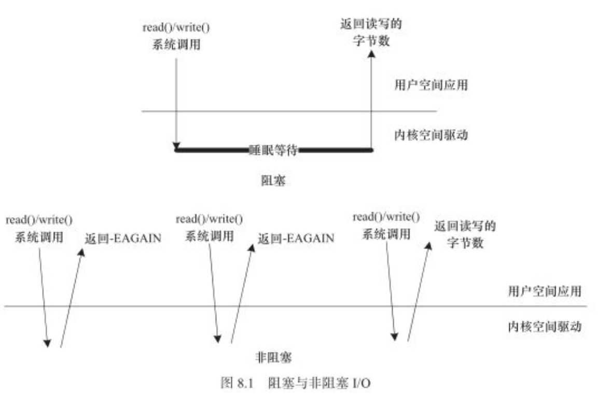
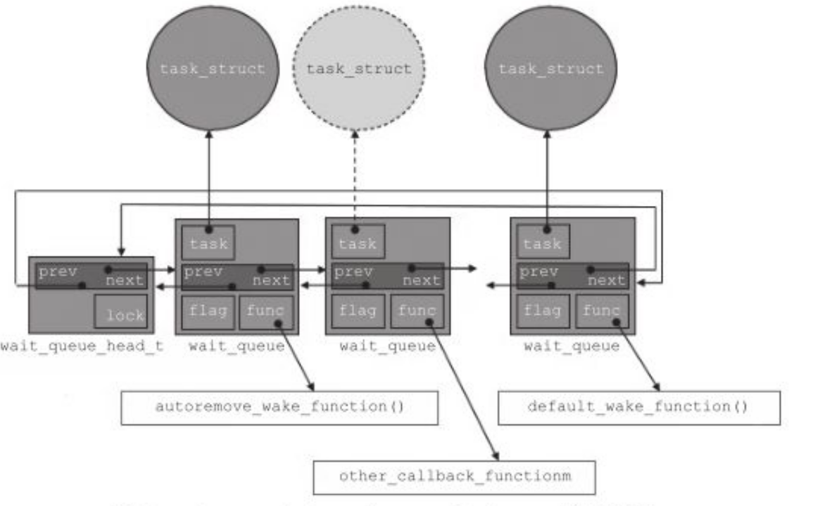
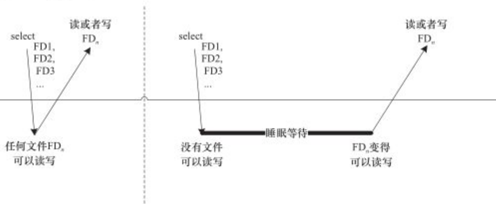

# 阻塞和非阻塞IO

​	在阻塞访问时，不能获取资源的进程将休眠，它将cpu资源礼让给其他进程。因为阻塞的进程会进入休眠状态，所以必须确保有一个地方能够唤醒休眠的进程，否则，进程就真的寿终就寝了。唤醒进程的地方最大可能发生在中断里面，因为在硬件资源获得的同时往往伴随者一个中断。而非阻塞的进程则不断尝试，直到可以进行IO.



## 1 应用层编程：

### 1.1 阻塞IO

```c
char buf ;

fd = open("/dev/ttyS1", O_RDWR) ;

...

res = read(fd, &buf, 1) ;//当串口上有输入时才返回
if(res == 1){
    printf("%c\n", buf) ;
}
```

### 1.2 非阻塞IO

```c
char buf ;
fd = open("/dev/ttyS1", O_RDWR | O_NONBLOCK) ;
...
while(read(fd, &buf, 1) != 1){
    continue ;
}

printf("%c\n", buf) ;
```

除了在打开文件时可以指定阻塞还是非阻塞方式以外，在文件打开后，也可以通过ioctl()和fcntl()改变读写的方式，如从阻塞变更为非阻塞或者从非阻塞变更为阻塞。

```c
fcntl(fd, F_SETFL, O_NONBLOCK) ;//可以设置fd对应的IO为非阻塞
```

## 2 阻塞IO

### 2.1 等待队列

可以将等待队列作为阻塞进程的唤醒。

```c
wait_queue_head_t my_queue ;//定义

init_waitqueue_head(&my_queue) ;//初始化

DECLARE_WAIT_QUEUE_HEAD(name) ;//可以作为等待队列的定义和初始化的快捷方式

void add_wait_queue(wait_queue_head_t *q, wait_queue_t *wait) ;
void remove_wait_queue(wait_queue_head_t *q, wait_queue_t *wait) ;

wait_event(queue, condition) ;//不能被信号打断
wait_event_interruptible(queue, condition) ;//可以被信号打断
wait_event_timeout(queue, condition, timeout) ;
wait_event_interruptible_timeout(queue, condition, timeout) ;

void wake_up(wait_queue_head_t *queue) ;
void wake_up_interruptible(wait_queue_head_t *queue) ;
//上述操作会唤醒以queue作为等待队列头部的队列中所有的进程
```

- wake_up()应该和wait_event()或wait_event_timeout()成对使用
- wake_up_interruptible()和wait_event_interruptible()或wait_event_interruptible_timeout()成对使用
- wake_up()可以唤醒处于TASK_INTERRUPTIBLE和TASK_UNINTERRUPTIBLE的进程
- 而wake_up_interruptible()只能唤醒处于TASK_INTERRUPTIBLE的进程

```c
sleep_on(wait_queue_head_t *q) ;//将目前进程的状态设置为TASK_UNINTERRUPTIBLE，并定义一个等待队列元素，之后把它挂到等待队列头部q指向的双向链表中，直到资源可以获得，q队列指向连接的进程被唤醒。
interruptible_sleep_on(wait_queue_head_t *q) ;//将目前进程的状态设置为TASK_INTERRUPTIBLE，并定义一个等待队列元素，之后把它挂到等待队列头部q指向的双向链表中，直到资源可以获得，q队列指向连接的进程被唤醒。
```

- sleep_on()函数应该和wake_up()成对使用，
- interruptible_sleep_on()应该和wake_up_interruptible()成对使用


使用例子：

```c
/*在进行IO操作的时候，判断设备是否可写，如果不可写且为阻塞IO,则进程睡眠并挂起到等待队列中*/

static ssize_t xxx_write(struct file *file, const char *buffer, size_t count, loff_t *ppos)
{
    ...
    DECLARE_WAITQUEUE(wait, current) ;//定义等待队列元素 current代表的就是当前的进程
    add_wait_queue(&xxx_wait, &wait) ;//添加元素到等待队列中

    /*等待设备缓存区可写*/
    do{
        avail = device_writable(...) ;
        if(avail < 0){
            if(file->f_flags & O_NONBLOCK){/*非阻塞的处理*/
                ret = -EAGAIN ;
                goto out ;
            }

            __set_current_state(TASK_INTERRUPTIBLE) ;/*改变进程状态*/
            schedule() ;/*调度其他进程执行*/
            if(signal_pending(current)){/*如果是因为信号唤醒*/
                ret = -ERESTARTSYS ;
                goto out ;

            }
        }
    }while(avail < 0);

    /*写设备缓冲区*/
    device_writable(...) ;
    
out:
    remove_wait_queue(&xxx_wait, &wait) ;/*将元素移出　xxx_wait指引的队列*/
    __set_current_state(TASK_RUNNING) ;/*设置进程状态为TASK_RUNNING*/
    
    return ret ;
    
}
```



## 3 非阻塞

### 3.1 应用层中的select poll epoll

#### 3.1.1 select

使用非阻塞IO的应用程序通常会使用select()和poll()系统调用查询是否可对设备进行无阻塞的访问。

应用层select调用接口：

```c
int select(int nfds, fd_set *readfds, fd_set *writefds,fd_set *exceptfds, struct timeval *timeout);
/**
	readfds、writefds、exceptfds 被select监视的读、写、异常处理的文件描述符集合
	nfds：的值　需要检查的号码最高的fd+1  (nfds = fd(max) + 1)
	timeout:是一个指向struct timeval的指针，它可以使得select()在等待了timeout时间后若仍然没有文件描述符准备好则超时返回。
*/

struct timeval{
    int tv_sec ;/*秒*/
    int tv_usec ; /*微秒*/
}


//readfds文件集合中的任何一个文件变得可读，select()返回；同理writefds监听的文件描述符
```

```c
void FD_CLR(int fd, fd_set *set);//将一个文件描述符从文件描述符集合中清除
int  FD_ISSET(int fd, fd_set *set);//判断文件描述符是否被置位
void FD_SET(int fd, fd_set *set);//将一个文件描述符加入文件描述符集合中
void FD_ZERO(fd_set *set);//清除一个文件描述符集合

```

```c
       #include <stdio.h>
       #include <stdlib.h>
       #include <sys/time.h>
       #include <sys/types.h>
       #include <unistd.h>

       int
       main(void)
       {
           fd_set rfds;//定义读监听集合
           struct timeval tv;
           int retval;

           /* Watch stdin (fd 0) to see when it has input. */
           FD_ZERO(&rfds);//清除一个文件描述符集合
           FD_SET(0, &rfds);//将标准读　加入读监听集合中

           /* Wait up to five seconds. */
           tv.tv_sec = 5;
           tv.tv_usec = 0;

           retval = select(1/*最大的fd加１*/, &rfds, NULL, NULL, &tv);
           /* Don't rely on the value of tv now! */

           if (retval == -1)
               perror("select()");
           else if (retval)
               printf("Data is available now.\n");/*在这个分支上去判断　那个fd返回了，然后做出对应的处理*/
               /* FD_ISSET(0, &rfds) will be true. */
           else
               printf("No data within five seconds.\n");

           exit(EXIT_SUCCESS);
       }

```

#### 3.1.2 poll

当多路复用的文件数量庞大、IO流量频繁的时候，一般不太适合使用select()和poll()，此种情况下，select()和poll()的性能表现比较差，我们宜使用epoll.epoll的最大的好处是不会随着fd的数量增长而降低效率，select()则会随着fd的数量增大性能下降明显。

select的底层数据结构是用每一个位代表一个监听的文件描述符

poll()用数组去实现

epoll()用链表去实现


- 一般在涉及的fd数量较少的时候，使用select是合适的
- 如果涉及的fd很多，如在大规模并发的服务器中监听许多socket的时候，则不太适合选用select,而适合选用epoll

#### 3.1.3 IO多路复用调用讲解



- 第一次对n个文件进行select()的时候，若任何一个文件满足要求，select()就会直接返回
- 第二次在进行select()的时候，没有文件满足读写要求，select()的进程阻塞且睡眠。
- 在我们调用select()的时候，每个驱动的poll()接口都会被调用到，**实际上执行select()的进程被挂到了每个驱动的等待队列上了，select进程可以被任何一个驱动唤醒。（疑问，具体是加在驱动中的那个等待队列上了，那有是在那个设备驱动的那个环节去唤醒的这个等待队列呢？）**
- 

### 3.2 驱动中的轮询编程

驱动接口中的poll:

```c
unsigned int (*poll)(struct file *filp, struct poll_table *wait);//wait:　轮询表指针
```

应当完成一下两项工作：

- 对可能引起设备文件状态变化的等待队列调用poll_wait()函数，将对应的等待队列头添加到 第２个参数中 poll_table中。**实际上执行select()的进程被挂到了每个驱动的等待队列上了**
- 返回表示是否能对设备进行无阻塞读、写访问的掩码

```c
void poll_wait(struct file * filp, wait_queue_head_t * queue, poll_table *wait)
```

- poll_wait()不会引起阻塞。
- poll_wait()函数说做的工作是把**把当前进程添加到wait中，实际作用是让唤醒参数queue,对应的的队列可以一起唤醒因select（）而休眠的函数**

驱动程序poll()函数应该返回设备资源的可读取状态，几POLLIN(设备的无阻塞读)、POLLOUT(设备的无阻塞写)、POLLPRI、POLLERR、POLLNAL等宏的位　或结果。每个宏的含义都表明设备的一种状态，

**总结一下就是，我们在驱动的poll函数中　将我们的进程，加入读和写的等待队列中，当某一个队列唤醒的时候，同时app层的select函数就会被激活。app层的唤醒是由驱动中的等待队列唤醒的。－－－》这就很好的解答了在3.1.3中提出的疑问。**

```c
struct globalfifo_dev{
    struct cdev cdev ;
    unsigned int current_len ;//表征当前FIFO中有效数据的长度。current_len==0 意味者FIFO空， current_len == GLOBALFIFO_SIZE 意味者FIFO满
    unsigned char mem[GLOBALFIFO_SIZE] ;
    struct mutex mutex ;
    wait_queue_head_t r_wait ;//等待队列的头
    wait_queue_head_t w_wait ;//等待队列的头
} ;


static unsigned int globalfifo_poll(struct file *filp, poll_table *wait)
{
    unsigned int mask = 0 ;
    struct globalfifo_dev *dev = filp->private_data ;

    mutex_lock(&dev->mutex) ;

    poll_wait(filp, &dev->r_wait, wait) ;
    poll_wait(filp, &dev->w_wait, wait) ;

    if(dev->current_len != 0){
        mask |= POLLIN | POLLRDNORM ;
    }

    if(dev->current_len != GLOBALFIFO_SIZE){
        mask |= POLLOUT | POLLWRNORM ;
    }

    mutex_unlock(&dev->mutex) ;
    return mask ;

}


static ssize_t globalfifo_read(struct file *filp, char __user *buf, size_t count, loff_t *ppos)
{
    int ret ;
    struct globalfifo_dev *dev = filp->private_data ;
    DECLARE_WAITQUEUE(wait, current) ;//定义等待队列元素 current代表的就是当前的进程

    mutex_lock(&dev->mutex) ;
    add_wait_queue(&dev->r_wait, &wait) ;//加入等待队列中

    while(dev->current_len == 0){
        if(filp->f_flags & O_NONBLOCK){
            ret = -EAGAIN ;
            goto out ;
        }
        __set_current_state(TASK_INTERRUPTIBLE) ;
        mutex_unlock(&dev->mutex) ;

        schedule() ;
        if(signal_pending(current)){
            ret = -ERESTARTSYS ;
            goto out2 ;
        }

        mutex_lock(&dev->mutex) ;
    }

    if(count > dev->current_len){
        count = dev->current_len ;
    }

    if(copy_to_user(buf, dev->mem, count)){
        ret = -EFAULT ;
        goto out ;
    }else{
        memcpy(dev->mem, dev->mem + count, dev->current_len - count) ;
        dev->current_len -= count ;
        printk(KERN_INFO"read %d bytes(s), current_len:%d\n", count, dev->current_len) ;

        wake_up_interruptible(&dev->w_wait) ;

        ret = count ;
    }

out:
    mutex_unlock(&dev->mutex) ;

out2:
    remove_wait_queue(&dev->w_wait, &wait) ;
    __set_current_state(TASK_RUNNING) ;
    return ret ;
}

static ssize_t globalfifo_write(struct file *filp, const char __user *buf, size_t count, loff_t *ppos)
{
    struct globalfifo_dev *dev = filp->private_data ;
    int ret ;

    DECLARE_WAITQUEUE(wait, current) ;
    mutex_lock(&dev->mutex) ;
    add_wait_queue(&dev->w_wait, &wait) ;

    while(dev->current_len == GLOBALFIFO_SIZE){
        if(filp->f_flags & O_NONBLOCK){
            ret = -EAGAIN ;
            goto out ;
        }
        __set_current_state(TASK_INTERRUPTIBLE) ;

        mutex_unlock(&dev->mutex) ;
        schedule() ;
        if(signal_pending(current)){
            ret = -ERESTARTSYS ;
            goto out2 ;
        }

        mutex_lock(&dev->mutex) ;
    }

    if(count > GLOBALFIFO_SIZE - dev->current_len){
        count = GLOBALFIFO_SIZE - dev->current_len ;
    }

    if(copy_from_user(dev->mem + dev->current_len, buf, count)){
        ret = -EFAULT ;
        goto out ;
    }else{
        dev->current_len += count ;
        printk(KERN_INFO"written %d bytes(s), current_len:%d\n", count, dev->current_len) ;

        wake_up_interruptible(&dev->r_wait) ;
        
        ret = count ;
    }

out:
    mutex_unlock(&dev->mutex) ;
out2:
    remove_wait_queue(&dev->w_wait, &wait) ;
    __set_current_state(TASK_RUNNING) ;
    return ret ;
}

static long globalmem_ioctl(struct file *filp, unsigned int cmd, unsigned long arg)
{
    struct globalmem_dev *dev = filp->private_data ;

    switch (cmd)
    {
        case MEM_CLEAR:
            mutex_lock(&dev->mutex) ;
            memset(dev->mem, 0, GLOBALMEM_SIZE) ;
            mutex_unlock(&dev->mutex) ;

            printk(KERN_INFO"globalmem is set to zero\n") ;
            break;
    
        default:
           return -EINVAL ;
    }

    return 0 ;
}


static int __init globalfifo_init(void)
{
    int ret ;
    dev_t devno = MKDEV(globalfifo_major, 0) ;

    if(globalfifo_major){
        ret = register_chrdev_region(devno, 1, "globalfifo") ;
    }else{
        ret = alloc_chrdev_region(&devno, 0, 1, "globalfifo") ;
        globalfifo_major = MAJOR(devno) ;
    }

    if(ret < 0){
        return ret ;
    }

    globalfifo_devp = kzalloc(sizeof(struct globalfifo_dev), GFP_KERNEL) ;
    if(!globalfifo_devp){
        ret = -ENOMEM ;
        goto fail_malloc ;
    }

    globalfifo_setup_cdev(globalfifo_devp, 0) ;

    mutex_init(&globalfifo_devp->mutex) ;
    init_waitqueue_head(&globalfifo_devp->r_wait) ;//初始化等待队列头
    init_waitqueue_head(&globalfifo_devp->w_wait) ;

    return 0 ;
fail_malloc:
    unregister_chrdev_region(devno, 1) ;
    return ret ;
}

module_init(globalfifo_init) ;
/**
 * 
 *  这里有一个关键点，无论读函数还是写函数，在进入真正的读写之前，都要再次判断设备是否可以读写，　
 * 
 * 　while(dev->current_len == 0){
 * 
 *　　while(dev->current_len == GLOBALFIFO_SIZE){
 * 
 *  主要的目的是为了防止并发的读或者并发的写都正确。设想如果两个读进程都阻塞在读上，写进程执行的wake_up_interruptible(&dev->r_wait)实际会同时唤醒它们
 * 其中先执行的那个进程可能会率先将FIFO再次读空。
 * 
*/
```


## 总结

- 等待队列可用于同步驱动中事件发生的先后顺序
- 使用非阻塞IO的应用程序也可借助轮询来查询设备是否能立即被访问，用户空间调用select()、poll()或者epoll接口，设备驱动提供poll()函数。*
- 设备驱动的poll()本身不会阻塞，但是和poll()、select()和epoll()相关的系统调用会阻塞的等待最少一个文件描述符集合可访问或超时。
- 阻塞和非阻塞访问是IO操作的两种不同的模式，前者在暂时不可进行IO操作时会让进程睡眠，后者则不然。
- 在设备驱动中阻塞IO一般基于等待队列或者基于等待队列的其他linux内核API来实现，等待队列可以用于同步驱动中事件发生的先后顺序。
- 使用非阻塞IO的应用程序也可借助轮询函数来查询设备是否能立即被访问，（各人理解是在应用层while　read读返回值，判断是否可以立即读）。
- 用户空间调用select()、poll()、epoll()接口，设备驱动提供poll()函数。设备驱动的poll()本身不会阻塞，但是和poll()和select()和epoll()相关的系统调用会阻塞地等待至少一个文件描述符集合可访问或超时。