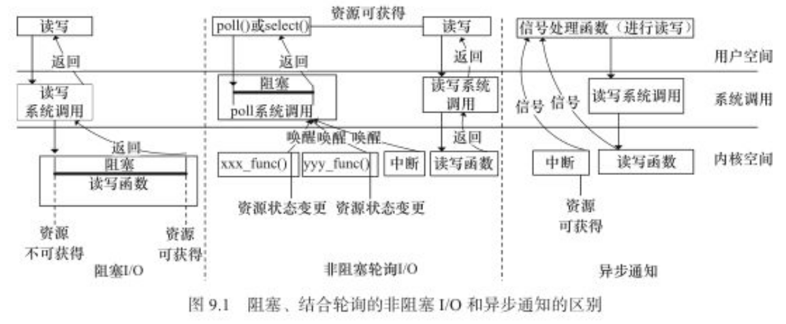
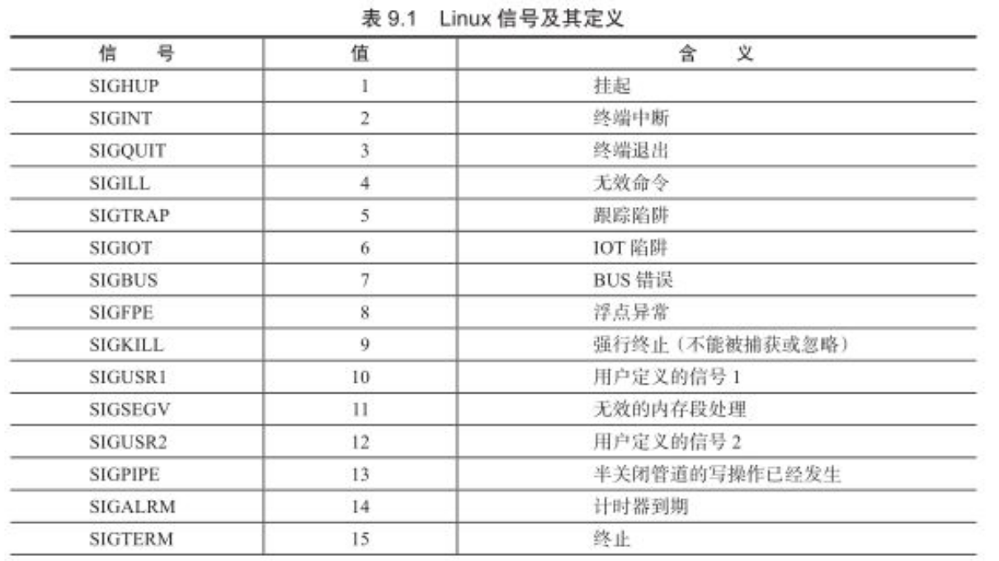
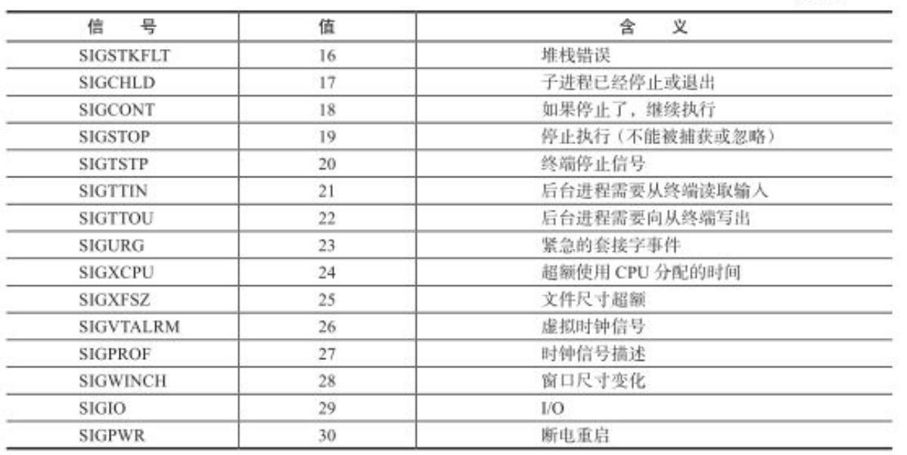
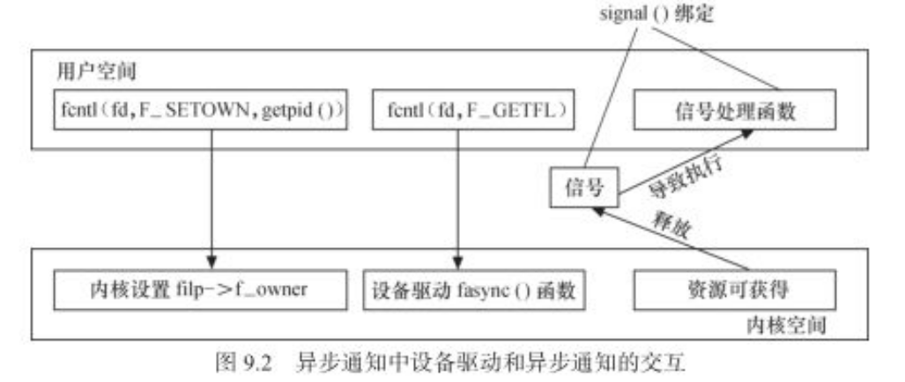
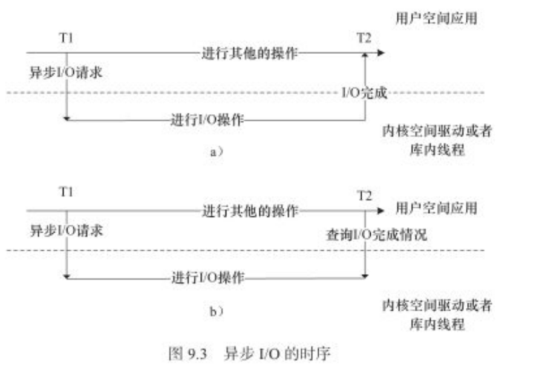
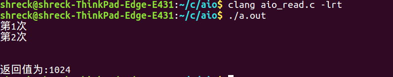
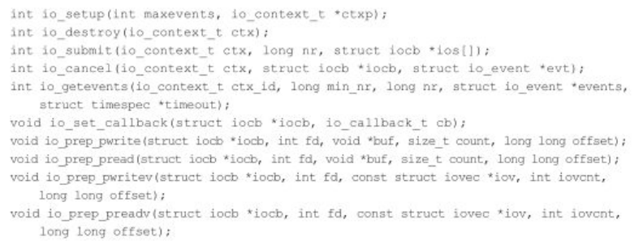

# 驱动中的异步通知和异步IO

- 在设备驱动中使用异步通知可以使得在进行对设备的访问时，由驱动主动通知应用程序进行访问。**这样，使用非阻塞IO的应用程序无须轮询设备是否可以访问，而阻塞访问也可以被类似“中断”的异步通知所取代。**
- 除了异步通知以外，应用还可以在发起IO请求后，立即返回。之后，再查询IO完成情况，或者IO完成后被调回。这个过程叫做异步IO.

## 1. 异步通知

异步通知的意思是：一旦设备准备就绪，则会主动通知应用程序，这样应用程序根本就不需要查询设备状态，这一点非常类似于硬件上的“中断的概念”。**比较准确的称谓是“信号驱动的异步IO”.**

信号是在软件层次上对中断机制的一种模拟，在原理上，一个进程收到一个信号和处理器收到一个中断请求可以说是一样的。信号是异步的，一个进程不必通过任何操作来等待信号的到达，事实上，进程也不知道信号到底什么时候到达的。

### **1.1 阻塞io/非阻塞io/异步io区别** 

阻塞IO意味着一直等待设备可访问后再访问，非阻塞IO中使用poll()意味着查询设备是否可访问，而异步通知则意味这设备通知用户自身可被访问了，之后用户在进行IO处理。



- 这里对非阻塞轮询io,补充一下：系统调用中的poll是不会阻塞的。将当前的进程加入到　读等待队列或者写等待队列中，之后就返回了。其中xxx_func()代表的就是　在这些函数中包括激活等待队列的函数。　此时应用层的poll在阻塞等待。　　底层xxx_func() 调用此时激活应用层的poll(),此时会紧接着调用底层的poll函数查询此时是读ok了还是写ok了。
- 这里要强调的是：阻塞和非阻塞IO、异步通知本身没有优劣，应该根据不同的应用场景合理选择。


### 1.2 异步通知编程

linux可用的信号及其定义如表所示：





除了SIGSTOP和SIGKILL两个信号外，进程能够忽略或者捕获其他的信号。

一个信号被捕获的意思是当一个信号到达时有相应的代码处理它。**如果一个信号没有被这个进程所捕获，内核将采用默认行为处理。**

#### 1.2.1 应用层编程

```c
#include <signal.h>

typedef void (*sighandler_t)(int);
/**
	signum:指定信号的值
	handler:指定针对前面信号值的处理函数，若为SIG_IGN,表示忽略该信号；若为SIG_DFL,表示采用系统默认方式处理信号；若为用户自定义的函数，则信号被捕获后，该函数将被执行。
	
	如果signal()调用成功，它将返回最后一次为信号signum绑定的处理函数的handler值，失败返回SIG_ERR

*/
sighandler_t signal(int signum, sighandler_t handler);

/*和signal功能一样，但比signal高级*/
#include <signal.h>
int sigaction(int signum, const struct sigaction *act,struct sigaction *oldact);


```

例子一：

```c
#include <signal.h>
void sigterm_handler(int signo)
{
    printf("Have caught sig N.o. %d\n", signo) ;
}
int main(int argc, char const *argv[])
{
    signal(SIGINT, sigterm_handler) ;
    signal(SIGTERM, sigterm_handler) ;

    while(1) ;

    return 0;
}
```

例子二：

```c
#include <sys/types.h>
#include <sys/stat.h>
#include <stdio.h>
#include <fcntl.h>
#include <signal.h>
#include <unistd.h>

#define MAX_LEN 100

void input_handler(int num)
{
    char data[MAX_LEN] ;
    int len ;

    /*读取并输出STDIN_FILENO　上的输入*/
    len = read(STDIN_FILENO, &data, MAX_LEN) ;
    data[len] = 0 ;
    printf("input available: %s\n", data) ;
}

int main(int argc, char const *argv[])
{
    int oflags ;

    /*启动信号驱动机制*/

    signal(SIGIO, input_handler) ;

    fcntl(STDIN_FILENO, __F_SETOWN, getpid()) ;//设置本进程为STDIN_FILENO文件的拥有者，如果没有这一步，内核不会知道应该将信号发给那个进程

    oflags = fcntl(STDIN_FILENO, F_GETFL) ;
    fcntl(STDIN_FILENO, F_SETFL, oflags | FASYNC) ;//为了启用异步通知机制，还需要对设备设置 FASYNC标志

    while(1);
    
    return 0;
}
```

为了能在用户空间中处理一个设备释放的信号，它必须完成３项工作：

- 通过F_SETOWN IO控制命令　设置　设备文件的拥有者为本进程，这样从设备驱动发出的信号才能被本进程接收到
- 通过F_SETFL IO控制命令设置设备文件以支持 FASYNC ,即异步通知模式
- 通过signal()函数连接信号和信号处理函数

#### 1.2.2 内核层编程

在设备驱动和应用程序的异步通知交互中，仅仅在应用程序端捕获信号是不够的，因为信号的源头在设备驱动端。因此，应该在合适的时机让设备驱动释放（发送）信号。

为了使设备支持异步通知机制，驱动程序中涉及３项工作：

1. 支持F_SETOWN命令，能在这个控制命令处理中设置　filp->f_owner为对应进程的ID.**不过此项工作已经由内核完成，设备驱动无须处理**
2. 支持F_SETFL命令的处理，每当FASYNC标志改变的时候，驱动程序中的fasync()函数将得以执行。**因此驱动中应该实现fasync()函数**
3. 这设备资源可获得时，调用kill_fasync()函数激发相应的信号


驱动中的上述3项工作和应用程序中的3项工作是一一对应的，下图是异步通知处理过程中用户空间和设备驱动的交互。



```c
struct fasync_struct {                                                     
    spinlock_t      fa_lock;
    int         magic;
    int         fa_fd;
    struct fasync_struct    *fa_next; /* singly linked list */
    struct file     *fa_file;
    struct rcu_head     fa_rcu;
};

//处理fasync标志变更的函数
extern int fasync_helper(int, struct file *, int, struct fasync_struct **);

extern struct fasync_struct *fasync_insert_entry(int, struct file *, struct fasync_struct **, struct fasync_struct *);

extern int fasync_remove_entry(struct file *, struct fasync_struct **);

extern struct fasync_struct *fasync_alloc(void);

extern void fasync_free(struct fasync_struct *);

//发送信号用的函数
extern void kill_fasync(struct fasync_struct **, int, int);

```

异步通知驱动模板

```c
struct xxx_dev{
    struct cdev cdev ;
    ...
    struct fasync_struct *async_queue ;
}

static int xxx_fasync(int fd, struct file *filp, int mode)
{
    struct xxx_dev *dev = filp->private_data ;
    return fasync_helper(fd, filp, mode, &dev->async_queue) ;
}

static ssize_t xxx_write(struct file *filp, const char __user *buf, size_t count, loff_t *f_pos)
{
    struct xxx_dev *dev = filp->private_data ;
    ...

    /*产生异步读信号*/
    if(dev->async_queue){
        kill_fasync(&dev->async_queue, SIGIO, POLL_IN) ;
    }

    ...
}

static int xxx_release(struct inode *inode, struct file *filp)
{
    /*将文件从异步通知列表中删除*/
    xxx_fasync(-1, filp, 0) ;
    ...

    return 0 ;
}
```

## 2. 异步IO

- 有的时候io请求可能需要和cpu消耗产生交叠，以充分利用cpu和IO提高吞吐率。

下图描绘了异步io的时序，应用程序发起io动作后，直接开始执行，并不等待io结束：

- 要么过一段时间来查询之前的IO请求完成情况
- 要么io请求完成了会自动被调用和io完成绑定的回调函数




linux中的AIO实现分为两种：

1. 用户空间的glibc中实现的，**本质上是借用了多线程模型**，用开启新的线程用同步的方式来做io,新的aio辅助线程和发起aio的线程以phread_cond_signal()的形式进行线程同步
2. linux aio也可以由内核空间实现:

- 对于块设备而言，aio可以一次性发出大量的read/write调用并且通过通用块层的io调度来获得更好的性能，用户空间也可以减少过多的同步负载，还可以在业务逻辑中更加灵活的进行并发控制和负载均衡。相较于glibc的用户空间多线程同步等实现也减少了线程的负载和上下文切换。
- 对于socket层面上，也可以使用aio,让cpu和网卡的收发动作充分交叠用来改善吞吐率。


选择真确的IO模型对系统性能的影响会很大。

### 2.1 AIO和gunc库中的AIO

这里先对用户空间aio进行学习。

#### 1.为什么会有异步I/O

aio异步读写是在[linux内核](https://www.baidu.com/s?wd=linux%E5%86%85%E6%A0%B8&tn=24004469_oem_dg&rsv_dl=gh_pl_sl_csd)2.6之后才正式纳入其标准。之所以会增加此模块，是因为[众所周知](https://www.baidu.com/s?wd=%E4%BC%97%E6%89%80%E5%91%A8%E7%9F%A5&tn=24004469_oem_dg&rsv_dl=gh_pl_sl_csd)我们计算机CPU的执行速度远大于I/O读写的执行速度，如果我们用传统的阻塞式或非阻塞式来操作I/O的话，那么我们在同一个程序中(不用多线程或多进程)就不能同时操作[俩个](https://www.baidu.com/s?wd=%E4%BF%A9%E4%B8%AA&tn=24004469_oem_dg&rsv_dl=gh_pl_sl_csd)以上的文件I/O，每次只能对一个文件进行I/O操作，很明显这样效率很低下(因为CPU速度远大于I/O操作的速度，所以当执行I/O时，CPU其实还可以做更多的事)。因此就诞生了相对高效的异步I/O

#### 2.异步I/O的基本概念

所谓异步I/O即我们在调用I/O操作时(读或写)我们的程序不会阻塞在当前位置，而是在继续往下执行。例如当我们调用异步读API  aio_read()时，程序执行此代码之后会接着运行此函数下面的代码，并且与此同时程序也在进行刚才所要读的文件的读取工作，但是具体什么时候读完是不确定的

#### 3.异步aio的基本API

| API函数     | 说明                                       |
| ----------- | ------------------------------------------ |
| aio_read    | 异步读操作                                 |
| aio_write   | 异步写操作                                 |
| aio_error   | 检查异步请求的状态                         |
| aio_return  | 获得异步请求完成时的返回值                 |
| aio_suspend | 挂起调用进程，直到一个或多个异步请求已完成 |
| aio_cancel  | 取消异步请求                               |
| lio_list    | 发起一系列异步I/O请求                      |

*上述的每个API都要用aiocb结构体赖进行操作*
 aiocb的结构中常用的成员有

```c
struct aiocb
{
    //要异步操作的文件描述符
    int aio_fildes;

    //用于lio操作时选择操作何种异步I/O类型
    int aio_lio_opcode;

    //异步读或写的缓冲区的缓冲区
    volatile void *aio_buf;

    //异步读或写的字节数
    size_t aio_nbytes;

    //异步通知的结构体
    struct sigevent aio_sigevent;
}
```

#### 4异步I/O操作的具体使用

##### (1)异步读aio_read5

aio_read函数请求对一个文件进行读操作，所请求文件对应的文件描述符可以是文件，套接字，甚至管道其原型如下

```c
int aio_read(struct aiocb *paiocb);
```

- 1

该函数请求对文件进行异步读操作，若请求失败返回-1，成功则返回0，并将该请求进行排队，然后就开始对文件的异步读操作
 需要注意的是，我们得先对aiocb结构体进行必要的初始化
*具体实例如下*

*aio_read*

```c
#include<stdio.h>
#include<sys/socket.h>
#include<netinet/in.h>
#include<arpa/inet.h>
#include<assert.h>
#include<unistd.h>
#include<stdlib.h>
#include<errno.h>
#include<string.h>
#include<sys/types.h>
#include<fcntl.h>
#include<aio.h>
 
 
#define BUFFER_SIZE 1024
 
int MAX_LIST = 2;
 
int main(int argc,char **argv)
{
    //aio操作所需结构体
    struct aiocb rd;
 
    int fd,ret,couter;
 
    fd = open("test.txt",O_RDONLY);
    if(fd < 0)
    {
        perror("test.txt");
    }
 
 
 
    //将rd结构体清空
    bzero(&rd,sizeof(rd));
 
 
    //为rd.aio_buf分配空间
    rd.aio_buf = malloc(BUFFER_SIZE + 1);
 
    //填充rd结构体
    rd.aio_fildes = fd;
    rd.aio_nbytes =  BUFFER_SIZE;
    rd.aio_offset = 0;
 
    //进行异步读操作
    ret = aio_read(&rd);
    if(ret < 0)
    {
        perror("aio_read");
        exit(1);
    }
 
    couter = 0;
//  循环等待异步读操作结束
    while(aio_error(&rd) == EINPROGRESS)
    {
        printf("第%d次\n",++couter);
    }
    //获取异步读返回值
    ret = aio_return(&rd);
 
    printf("\n\n返回值为:%d",ret);
 
 
    return 0;
}

/**
 *  编译说明：gcc aio_read.c -lrt
 * 
*/
```

-  

上述实例中aiocb结构体用来表示某一次特定的读写操作，在异步读操作时我们只需要注意4点内容
 1.确定所要读的文件描述符，并写入aiocb结构体中(下面几条一样不再赘余)
 2.确定读所需的缓冲区
 3.确定读的字节数
 4.确定文件的偏移量
 总结以上注意事项：基本上和我们的read函数所需的条件相似，唯一的区别就是多一个文件偏移量

值得注意的是上述代码中aio_error是用来获取其参数指定的读写操作的状态的
 其原型如下

```
int aio_error(struct aiocb *aiopcb);
```

当其状态处于EINPROGRESS则I/O还没完成，当处于ECANCELLED则操作已被取消，发生错误返回-1

而aio_return则是用来返回其参数指定I/O操作的返回值
 其原型如下

```
ssize_t aio_return(struct aiocb *paiocb);
```

如果操作没完成调用此函数，则会产生错误

特别提醒在编译上述程序时必须在编译时再加一个-lrt

上述代码运行结果如下


##### (2)异步写aio_write

aio_writr用来请求异步写操作
 其函数原型如下

```
int aio_write(struct aiocb *paiocb);
```

aio_write和aio_read函数类似，当该函数返回成功时，说明该写请求以进行排队(成功0，失败-1)
 其和aio_read调用时的区别是就是我们如果在打开文件是，flags设置了O_APPEND则我们在填充aiocb时不需要填充它的偏移量了
 具体实例如下

```c
#include<stdio.h>
#include<sys/socket.h>
#include<netinet/in.h>
#include<arpa/inet.h>
#include<assert.h>
#include<unistd.h>
#include<stdlib.h>
#include<errno.h>
#include<string.h>
#include<sys/types.h>
#include<fcntl.h>
#include<aio.h>
 
#define BUFFER_SIZE 1025
 
int main(int argc,char **argv)
{
    //定义aio控制块结构体
    struct aiocb wr;
 
    int ret,fd;
 
    char str[20] = {"hello,world"};
 
    //置零wr结构体
    bzero(&wr,sizeof(wr));
 
    fd = open("test.txt",O_WRONLY | O_APPEND);
    if(fd < 0)
    {
        perror("test.txt");
    }
 
    //为aio.buf申请空间
    wr.aio_buf = (char *)malloc(BUFFER_SIZE);
    if(wr.aio_buf == NULL)
    {
        perror("buf");
    }
 
    wr.aio_buf = str;
 
    //填充aiocb结构
    wr.aio_fildes = fd;
    wr.aio_nbytes = strlen(str);
 
    //异步写操作
    ret = aio_write(&wr);
    if(ret < 0)
    {
        perror("aio_write");
    }
 
    //等待异步写完成
    while(aio_error(&wr) == EINPROGRESS)
    {
        printf("写还未结束\n");
    }
 
    //获得异步写的返回值
    ret = aio_return(&wr);
    printf("\n\n\n返回值为:%d\n",ret);
 
    return 0;
}
```

具体运行结果请读者自己去试试

##### (3)使用aio_suspend阻塞异步I/O

aio_suspend函数可以时当前进程挂起，知道有向其注册的异步事件完成为止
 该函数原型如下

```
int aio_suspend(const struct aiocb *const cblist[],int n,const struct timespec *timeout);
```

第一个参数是个保存了aiocb块地址的数组，我们可以向其内添加想要等待阻塞的异步事件，第二个参数为向cblist注册的aiocb个数,第三个参数为等待阻塞的超时事件，NULL为无限等待

*具体使用如下*
*suspend:*

```c
#include<stdio.h>
#include<sys/socket.h>
#include<netinet/in.h>
#include<arpa/inet.h>
#include<assert.h>
#include<unistd.h>
#include<stdlib.h>
#include<errno.h>
#include<string.h>
#include<sys/types.h>
#include<fcntl.h>
#include<aio.h>
 
 /**
  * 用户可以使用　aio_suspend()函数来阻塞调用进程，直到异步请求完成为止。调用者提供了一个aiocb引用列表，其中任何一个完成
  * 都会导致aio_suspend()返回。
  * 
 */

#define BUFFER_SIZE 1024
 
int MAX_LIST = 1;
 
int main(int argc,char **argv)
{
    //aio操作所需结构体
    struct aiocb rd;
 
    int fd,ret,couter;
 
    //cblist链表
    struct aiocb *aiocb_list[MAX_LIST];
 
 
 
    fd = open("test.txt",O_RDONLY);
    if(fd < 0)
    {
        perror("test.txt");
    }
 
 
 
    //将rd结构体清空
    bzero(&rd,sizeof(rd));
 
 
    //为rd.aio_buf分配空间
    rd.aio_buf = malloc(BUFFER_SIZE + 1);
 
    //填充rd结构体
    rd.aio_fildes = fd;
    rd.aio_nbytes =  BUFFER_SIZE;
    rd.aio_offset = 0;
 
    //将读fd的事件注册
    aiocb_list[0] = &rd;
 
    //进行异步读操作
    ret = aio_read(&rd);
    if(ret < 0)
    {
        perror("aio_read");
        exit(1);
    }

#if 0
 //  循环等待异步读操作结束
    couter = 0;
    while(aio_error(&rd) == EINPROGRESS)
    {
        printf("第%d次\n",++couter);
    }
 #else
     //阻塞等待异步读事件完成
    printf("我要开始等待异步读事件完成\n");
    ret = aio_suspend(aiocb_list,MAX_LIST,NULL);
 #endif

    printf("查看返回的结果\n") ;
    //获取异步读返回值
    ret = aio_return(&rd);
 
    printf("\n\n返回值为:%d\n",ret);
 
 
    return 0;
}
```

##### (4)lio_listio函数

aio同时还为我们提供了一个可以发起多个或多种I/O请求的接口lio_listio
 这个函数效率很高，因为我们只需一次系统调用(一次内核上下位切换)就可以完成大量的I/O操作
 其函数原型如下

```
int lio_listio(int mode,struct aiocb *list[],int nent,struct sigevent *sig);
```

- 1

第一个参数mode可以有俩个实参，LIO_WAIT和LIO_NOWAIT，前一个会阻塞该调用直到所有I/O都完成为止，后一个则会挂入队列就返回

*具体实例如下*
*lio_listio*

```c
#include<stdio.h>
#include<sys/socket.h>
#include<netinet/in.h>
#include<arpa/inet.h>
#include<assert.h>
#include<unistd.h>
#include<stdlib.h>
#include<errno.h>
#include<string.h>
#include<sys/types.h>
#include<fcntl.h>
#include<aio.h>
 

/**
 * lio_listio()函数可用于同时发起多个传输。这个函数非常的重要，它使得用户可以在一个系统调用中启动大量的io操作
 * 
 * */ 
#define BUFFER_SIZE 1025
 
int MAX_LIST = 2;
 
 
int main(int argc,char **argv)
{
    struct aiocb *listio[MAX_LIST];
    struct aiocb rd,wr;
    int fd,ret;
 
    //异步读事件
    fd = open("test1.txt",O_RDONLY);
    if(fd < 0)
    {
        perror("test1.txt");
    }
 
    bzero(&rd,sizeof(rd));
 
    rd.aio_buf = (char *)malloc(BUFFER_SIZE);
    if(rd.aio_buf == NULL)
    {
        perror("aio_buf");
    }
 
    rd.aio_fildes = fd;
    rd.aio_nbytes = 1024;
    rd.aio_offset = 0;
    rd.aio_lio_opcode = LIO_READ;   ///lio操作类型为异步读
 
    //将异步读事件添加到list中
    listio[0] = &rd;
 
 
    //异步些事件
    fd = open("test2.txt",O_WRONLY | O_APPEND);
    if(fd < 0)
    {
        perror("test2.txt");
    }
 
    bzero(&wr,sizeof(wr));
 #if 0
    wr.aio_buf = (char *)malloc(BUFFER_SIZE);
    wr.aio_nbytes = 1024;
#else
    wr.aio_buf = "caobinxin";
    wr.aio_nbytes = strlen(wr.aio_buf);
    printf("rd.aio_buf:%s  wr.aio_nbytes:%d\n",rd.aio_buf, wr.aio_nbytes) ;
#endif
    if(wr.aio_buf == NULL)
    {
        perror("aio_buf");
    }
 
    wr.aio_fildes = fd;
 
    wr.aio_lio_opcode = LIO_WRITE;   ///lio操作类型为异步写
 
    //将异步写事件添加到list中
    listio[1] = &wr;
 
    //使用lio_listio发起一系列请求
    ret = lio_listio(LIO_WAIT,listio,MAX_LIST,NULL);
 
    //当异步读写都完成时获取他们的返回值
 
    ret = aio_return(&rd);
    printf("\n读返回值:%d",ret);
 
    ret = aio_return(&wr);
    printf("\n写返回值:%d",ret);
 
 
 
    return 0;
}
```

#### 5.I/O完成时进行异步通知

当我们的异步I/O操作完成之时，我们可以通过信号通知我们的进程也可用回调函数来进行异步通知，接下来我会为大家主要介绍以下回调函数来进行异步通知，关于信号通知有兴趣的同学自己去学习吧

使用回调进行异步通知

该种通知方式使用一个系统回调函数来通知应用程序，要想完成此功能，我们必须在aiocb中设置我们想要进行异步回调的aiocb指针，以用来回调之后表示其自身

实例如下
*aio线程回调通知*

```c
#include<stdio.h>
#include<sys/socket.h>
#include<netinet/in.h>
#include<arpa/inet.h>
#include<assert.h>
#include<unistd.h>
#include<stdlib.h>
#include<errno.h>
#include<string.h>
#include<sys/types.h>
#include<fcntl.h>
#include<aio.h>
#include<unistd.h>
 

 /**
  *     当我们的异步io操作完成的时候，我们可以通过信号通知我们的进程　也可以　用回调函数来进行异步通知，
  * 
  *     这个demo是用回调函数来进行异步通知，
  * 
 */
#define BUFFER_SIZE 1024
 
 
void aio_completion_handler(sigval_t sigval)
{
    //用来获取读aiocb结构的指针
    struct aiocb *prd;
    int ret;
 
    prd = (struct aiocb *)sigval.sival_ptr;//取出传入的　&rd
 
    printf("读到的内容:%s\n", prd->aio_buf);
 
    //判断请求是否成功
    if(aio_error(prd) == 0)
    {
        //获取返回值
        ret = aio_return(prd);
        printf("读返回值为:%d\n",ret);
    }

    //在次触发读，构成一个循环读  发现每次都从开头开始读，如果不从开头开始读的话，需要设置　rd.aio_offset = 累加和;
    ret = aio_read(prd);
    if(ret < 0)
    {
        perror("aio_read");
    }
}
 
int main(int argc,char **argv)
{
    int fd,ret;
    struct aiocb rd;
 
    fd = open("test.txt",O_RDONLY);
    if(fd < 0)
    {
        perror("test.txt");
    }
 
 
 
    //填充aiocb的基本内容
    bzero(&rd,sizeof(rd));
 
    rd.aio_fildes = fd;
    rd.aio_buf = (char *)malloc(sizeof(BUFFER_SIZE + 1));
    rd.aio_nbytes = BUFFER_SIZE;
    rd.aio_offset = 0;
 
    //填充aiocb中有关回调通知的结构体sigevent
    rd.aio_sigevent.sigev_notify = SIGEV_THREAD;//使用线程回调通知
    rd.aio_sigevent.sigev_notify_function = aio_completion_handler;//设置回调函数
    rd.aio_sigevent.sigev_notify_attributes = NULL;//使用默认属性
    rd.aio_sigevent.sigev_value.sival_ptr = &rd;//在aiocb控制块中加入自己的引用  这里传入&rd,在回调函数中我们可以使用
 
    //异步读取文件
    ret = aio_read(&rd);
    if(ret < 0)
    {
        perror("aio_read");
    }
 
    printf("异步读以开始\n");
    while(1);
    printf("异步读结束\n");
 
 
 
    return 0;
}

/**
 * 这种方式和使用 异步通知的效果是一样的
 * 
 * 异步通知，需要驱动去主动发　SIGIO信号，需要驱动支持
 * 
 * 而这个demo中的例子中，不需要底层的驱动去发送信号，而是在glibc中利用线程技术实现的。用的是一种回调的技术，值得参考和学习
 * 
*/
```

-  

线程会掉是通过使用aiocb结构体中的aio_sigevent结构体来控制的，
 其定义如下

```c
struct sigevent
{
    sigval_t sigev_value;
    int sigev_signo;
    int sigev_notify;
    union {
         int _pad[SIGEV_PAD_SIZE];
         int _tid;
        struct {
            void (*_function)(sigval_t);
            void *_attribute;   /* really pthread_attr_t */
        } _sigev_thread;
    } _sigev_un;
}
#define sigev_notify_function   _sigev_un._sigev_thread._function
#define sigev_notify_attributes _sigev_un._sigev_thread._attribute
#define sigev_notify_thread_id   _sigev_un._tid
```


### 2.2 内核空间的aio

#### 2.2.1 用户空间的aio 对应的系统调用

在用户空间中，我们一般要结合libaio来进行内核aio的系统调用。内核aio提供的系统调用主要包括：



- aio的读写请求都用io_submit()下发。下发前通过io_prep_pwrite()和io_prep_pread()生成iocb的结构体，作为io_submit()的参数。这个结构体指定了读写类型、起始地址、长度和设备标志符等信息。
- 读写请求下发之后，使用io_getevents()函数等待io完成事件。
- io_set_callback()则可设置一个aio完成的回调函数。

下面的demo演示了一个简单的利用libaio向内核发起aio请求的模板，运行时带１个文本路径作为参数，该程序会打印文本前4096个字节的内容。

```c
#define _GNU_SOURCE 
#include <stdio.h>
#include <unistd.h>
#include <fcntl.h>
#include <string.h>
#include <inttypes.h>
#include <stdlib.h>
#include <libaio.h>

#define BUF_SIZE 4096

int main(int argc, char const *argv[])
{
    io_context_t ctx = 0 ;
    struct iocb cb ;
    struct iocb *cbs[1] ;
    unsigned char *buf ;
    struct io_event events[1] ;

    int ret ;
    int fd ;
    
    if(argc < 2){
        printf("the command format: aior [FILE]\n") ;
        exit(1) ;
    }

    fd = open(argv[1], O_RDWR | O_DIRECT) ;
    if(fd < 0){
        perror("open error") ;
        goto err ;
    }

    //allocate aligned memory
    ret = posix_memalign((void **)&buf, 512, (BUF_SIZE + 1)) ;
    if(ret < 0){
        perror("posix_memalign failed") ;
        goto err1 ;
    }
    memset(buf, 0, BUF_SIZE + 1) ;

    ret = io_setup(128, &ctx) ;
    if(ret < 0){
        printf("io_setup error:%s", strerror(-ret)) ;
        goto err2 ;
    }

    //setup io control block
    io_prep_pread(&cb, fd, buf, BUF_SIZE, 0) ;

    cbs[0] = &cb ;
    ret = io_submit(ctx, 1, cbs) ;
    if(ret != 1){
        if(ret < 0){
            printf("io_submit error:%s", strerror(-ret)) ;
        }else{
            fprintf(stderr, "could not submit ios") ;
        }
        goto err3 ;
    }

    //get the reply
    ret = io_getevents(ctx, 1, 1, events, NULL) ;
    if( ret != 1){
        if( ret < 0){
            printf("io_getevents error:%s", strerror(-ret)) ;
        }else{
            fprintf(stderr, "could not get Events") ;
        }
        goto err3 ;
    }

    if(events[0].res2 == 0){
        printf("%s\n", buf) ;
    }else{
        printf("AIO error:%s", strerror(-events[0].res)) ;
        goto err3 ;
    }

    if( (ret = io_destroy(ctx)) < 0){
        printf("io_destroy error:%s", strerror(-ret)) ;
        goto err2 ;
    }

    free(buf) ;
    close(fd) ;
    return 0;

err3:
    if( (ret = io_destroy(ctx)) < 0){
        printf("io_destroy error:%s", strerror(-ret)) ;
    }
err2:
    free(buf) ;
err1:
    close(fd) ;
err:
    return -1 ;
}


/**
 * 编译的时候发现找不到　libaio.h
 * 安装：　sudo apt-get install libaio-dev
 * 
 * 编译命令：gcc demo.c -laio
 * 
 * 运行：./a.out test.txt
*/
```


在Direct IO模式下，异步是非常有必要的（因为绕过了pagecache，直接和磁盘交互）。linux Native AIO正是基于这种场景设计的，具体的介绍见：[Kernel](http://lse.sourceforge.net/io/aio.html)[Asynchronous](http://lse.sourceforge.net/io/aio.html)[I](http://lse.sourceforge.net/io/aio.html)[/](http://lse.sourceforge.net/io/aio.html)[O](http://lse.sourceforge.net/io/aio.html)[  (](http://lse.sourceforge.net/io/aio.html)[AIO](http://lse.sourceforge.net/io/aio.html)[) ](http://lse.sourceforge.net/io/aio.html)[Support](http://lse.sourceforge.net/io/aio.html)[for](http://lse.sourceforge.net/io/aio.html)[Linux](http://lse.sourceforge.net/io/aio.html)。下面我们就来分析一下AIO编程的相关知识。

​       阻塞模式下的IO过程如下：

**int fd = open(const char \*pathname, int flags, mode_t mode);**

**ssize_t pread(int fd, void \*buf, size_t count, off_t offset);**

**ssize_t pwrite(int fd, const void \*buf, size_t count, off_t offset);**

**int close(int fd);**

因为整个过程会等待read/write的返回，所以不需要任何额外的数据结构。但异步IO的思想是：应用程序不能阻塞在昂贵的系统调用上让[CPU](https://www.baidu.com/s?wd=CPU&tn=24004469_oem_dg&rsv_dl=gh_pl_sl_csd)睡大觉，而是将IO操作抽象成一个个的任务单元提交给内核，内核完成IO任务后将结果放在应用程序可以取到的地方。这样在底层做I/O的这段时间内，CPU可以去干其他的计算任务。但异步的IO任务批量的提交和完成，必须有自身可描述的结构，最重要的两个就是iocb和io_event。

##### libaio中的structs

**struct iocb {**

​        **void     \*data;  /* Return in the io completion event */**

​        **unsigned key;   /\*r use in identifying io requests */**

​        **short           aio_lio_opcode;**

​        **short           aio_reqprio;**

​        **int             aio_fildes;**

​        **union {**

​                **struct io_iocb_common           c;**

​                **struct io_iocb_vector           v;**

​                **struct io_iocb_poll             poll;**

​                **struct io_iocb_sockaddr saddr;**

​        **} u;**

**};**

**struct io_iocb_common {**

​        **void            \*buf;**

​        **unsigned long   nbytes;**

​        **long long       offset;**

​        **unsigned        flags;**

​        **unsigned        resfd;**

**};**

iocb是提交IO任务时用到的，可以完整地描述一个IO请求：

data是留给用来自定义的指针：可以设置为IO完成后的callback函数；

aio_lio_opcode表示操作的类型：IO_CMD_PWRITE | IO_CMD_PREAD；

aio_fildes是要操作的文件：fd；

io_iocb_common中的buf, nbytes, offset分别记录的IO请求的mem buffer，大小和偏移。

**struct io_event {**

​        **void \*data;**

​        **struct iocb \*obj;**

​        **unsigned long res;**

​        **unsigned long res2;**

**};**

io_event是用来描述返回结果的：

obj就是之前提交IO任务时的iocb；

res和res2来表示IO任务完成的状态。

##### libaio提供的API和完成IO的过程

libaio提供的API有：io_setup, io_submit, io_getevents, io_destroy。

\1. 建立IO任务

**int io_setup (int maxevents, io_context_t \*ctxp);**

io_context_t对应内核中一个结构，为异步IO请求提供上下文环境。注意在setup前必须将io_context_t初始化为0。

当然，这里也需要open需要操作的文件，注意设置O_DIRECT标志。

2.提交IO任务

**long io_submit (aio_context_t ctx_id, long nr, struct iocb \**iocbpp);**

提交任务之前必须先填充iocb结构体，libaio提供的包装函数说明了需要完成的工作：

**void io_prep_pread(struct iocb \*iocb, int fd, void *buf, size_t count, long long offset)**

**{**

​        **memset(iocb, 0, sizeof(\*iocb));**

​        **iocb->aio_fildes = fd;**

​        **iocb->aio_lio_opcode = IO_CMD_PREAD;**

​        **iocb->aio_reqprio = 0;**

​        **iocb->u.c.buf = buf;**

​        **iocb->u.c.nbytes = count;**

​        **iocb->u.c.offset = offset;**

**}**

**void io_prep_pwrite(struct iocb \*iocb, int fd, void *buf, size_t count, long long offset)**

**{**

​        **memset(iocb, 0, sizeof(\*iocb));**

​        **iocb->aio_fildes = fd;**

​        **iocb->aio_lio_opcode = IO_CMD_PWRITE;**

​        **iocb->aio_reqprio = 0;**

​        **iocb->u.c.buf = buf;**

​        **iocb->u.c.nbytes = count;**

​        **iocb->u.c.offset = offset;**

**}**

这里注意读写的buf都必须是按扇区对齐的，可以用posix_memalign来分配。

3.获取完成的IO

**long io_getevents (aio_context_t ctx_id, long min_nr, long nr, struct io_event \*events, struct timespec *timeout);**

这里最重要的就是提供一个io_event数组给内核来copy完成的IO请求到这里，数组的大小是io_setup时指定的maxevents。

timeout是指等待IO完成的超时时间，设置为NULL表示一直等待所有到IO的完成。

4.销毁IO任务

**int io_destroy (io_context_t ctx);**

##### libaio和epoll的结合

在异步编程中，任何一个环节的阻塞都会导致整个程序的阻塞，所以一定要避免在io_getevents调用时阻塞式的等待。还记得io_iocb_common中的flags和resfd吗？看看libaio是如何提供io_getevents和事件循环的结合：

**void io_set_eventfd(struct iocb \*iocb, int eventfd)**

**{**

​        **iocb->u.c.flags |= (1 << 0) /\* IOCB_FLAG_RESFD */;**

​        **iocb->u.c.resfd = eventfd;**

**}**

这里的resfd是通过系统调用eventfd生成的。

**int eventfd(unsigned int initval, int flags);**

eventfd是linux  2.6.22内核之后加进来的syscall，作用是内核用来通知应用程序发生的事件的数量，从而使应用程序不用频繁地去轮询内核是否有时间发生，而是有内核将发生事件的数量写入到该fd，应用程序发现fd可读后，从fd读取该数值，并马上去内核读取。

有了eventfd，就可以很好地将libaio和epoll事件循环结合起来：

\1. 创建一个eventfd

**efd = eventfd(0, EFD_NONBLOCK | EFD_CLOEXEC);**

\2. 将eventfd设置到iocb中

**io_set_eventfd(iocb, efd);**

\3. 交接AIO请求

**io_submit(ctx, NUM_EVENTS, iocb);**

\4. 创建一个epollfd，并将eventfd加到epoll中

**epfd = epoll_create(1);**

**epoll_ctl(epfd, EPOLL_CTL_ADD, efd, &epevent);**

**epoll_wait(epfd, &epevent, 1, -1);**

\5. 当eventfd可读时，从eventfd读出完成IO请求的数量，并调用io_getevents获取这些IO

**read(efd, &finished_aio, sizeof(finished_aio);**

**r = io_getevents(ctx, 1, NUM_EVENTS, events, &tms);**

###### 一个完整的编程实例

```c
#define _GNU_SOURCE
#define __STDC_FORMAT_MACROS

#include <stdio.h>
#include <errno.h>
#include <libaio.h>
#include <sys/eventfd.h>
#include <sys/epoll.h>
#include <stdlib.h>
#include <sys/types.h>
#include <unistd.h>
#include <stdint.h>
#include <sys/stat.h>
#include <fcntl.h>
#include <inttypes.h>

#define TEST_FILE   "aio_test_file"
#define TEST_FILE_SIZE  (127 * 1024)
#define NUM_EVENTS  128
#define ALIGN_SIZE  512
#define RD_WR_SIZE  1024

struct custom_iocb
{
    struct iocb iocb;
    int nth_request;
};

void aio_callback(io_context_t ctx, struct iocb *iocb, long res, long res2)
{
    struct custom_iocb *iocbp = (struct custom_iocb *)iocb;
    printf("nth_request: %d, request_type: %s, offset: %lld, length: %lu, res: %ld, res2: %ld\n", 
            iocbp->nth_request, (iocb->aio_lio_opcode == IO_CMD_PREAD) ? "READ" : "WRITE",
            iocb->u.c.offset, iocb->u.c.nbytes, res, res2);
}

int main(int argc, char *argv[])
{
    int efd, fd, epfd;
    io_context_t ctx;
    struct timespec tms;
    struct io_event events[NUM_EVENTS];
    struct custom_iocb iocbs[NUM_EVENTS];
    struct iocb *iocbps[NUM_EVENTS];
    struct custom_iocb *iocbp;
    int i, j, r;
    void *buf;
    struct epoll_event epevent;

    efd = eventfd(0, EFD_NONBLOCK | EFD_CLOEXEC);
    if (efd == -1) {
        perror("eventfd");
        return 2;
    }

    fd = open(TEST_FILE, O_RDWR | O_CREAT | O_DIRECT, 0644);
    if (fd == -1) {
        perror("open");
        return 3;
    }
    ftruncate(fd, TEST_FILE_SIZE);
    
    ctx = 0;
    if (io_setup(8192, &ctx)) {
        perror("io_setup");
        return 4;
    }

    if (posix_memalign(&buf, ALIGN_SIZE, RD_WR_SIZE)) {
        perror("posix_memalign");
        return 5;
    }
    printf("buf: %p\n", buf);

    for (i = 0, iocbp = iocbs; i < NUM_EVENTS; ++i, ++iocbp) {
        iocbps[i] = &iocbp->iocb;
        io_prep_pread(&iocbp->iocb, fd, buf, RD_WR_SIZE, i * RD_WR_SIZE);
        io_set_eventfd(&iocbp->iocb, efd);
        io_set_callback(&iocbp->iocb, aio_callback);
        iocbp->nth_request = i + 1;
    }

    if (io_submit(ctx, NUM_EVENTS, iocbps) != NUM_EVENTS) {
        perror("io_submit");
        return 6;
    }

    epfd = epoll_create(1);
    if (epfd == -1) {
        perror("epoll_create");
        return 7;
    }

    epevent.events = EPOLLIN | EPOLLET;
    epevent.data.ptr = NULL;
    if (epoll_ctl(epfd, EPOLL_CTL_ADD, efd, &epevent)) {
        perror("epoll_ctl");
        return 8;
    }

    i = 0;
    while (i < NUM_EVENTS) {
        uint64_t finished_aio;

        if (epoll_wait(epfd, &epevent, 1, -1) != 1) {
            perror("epoll_wait");
            return 9;
        }

        if (read(efd, &finished_aio, sizeof(finished_aio)) != sizeof(finished_aio)) {
            perror("read");
            return 10;
        }

        printf("finished io number: %"PRIu64"\n", finished_aio);
    
        while (finished_aio > 0) {
            tms.tv_sec = 0;
            tms.tv_nsec = 0;
            r = io_getevents(ctx, 1, NUM_EVENTS, events, &tms);
            if (r > 0) {
                for (j = 0; j < r; ++j) {
                    ((io_callback_t)(events[j].data))(ctx, events[j].obj, events[j].res, events[j].res2);
                }
                i += r;
                finished_aio -= r;
            }
        }
    }
    
    close(epfd);
    free(buf);
    io_destroy(ctx);
    close(fd);
    close(efd);
    remove(TEST_FILE);

    return 0;
}

/**
 * 
 * 说明：
1. 运行通过
2. struct io_event中的res字段表示读到的字节数或者一个负数错误码。在后一种情况下，-res表示对应的
   errno。res2字段为0表示成功，否则失败
3. iocb在aio请求执行过程中必须是valid的
4. 在上面的程序中，通过扩展iocb结构来保存额外的信息(nth_request)，并使用iocb.data
   来保存回调函数的地址。如果回调函数是固定的，那么也可以使用iocb.data来保存额外信息。
*/
```

#### 2.2.2 驱动中的异步io 编写

参考drivers/char/mem.c的代码

```c
static int __init chr_dev_init(void)
{
    ...
    register_chrdev(MEM_MAJOR, "mem", &memory_fops);
    ...
}

static const struct file_operations memory_fops = {                                         .open = memory_open,
    .llseek = noop_llseek,
};
static int memory_open(struct inode *inode, struct file *filp)
{
    int minor;
    const struct memdev *dev;
                                                               
    minor = iminor(inode);//根据不同的inode 来区分不同的　设备
    if (minor >= ARRAY_SIZE(devlist))
        return -ENXIO;

    dev = &devlist[minor];
    if (!dev->fops)
        return -ENXIO;

    filp->f_op = dev->fops;
    filp->f_mode |= dev->fmode;

    if (dev->fops->open)
        return dev->fops->open(inode, filp);

    return 0;
}
static const struct memdev {                                                                                                                                  
    const char *name;
    umode_t mode;
    const struct file_operations *fops;
    fmode_t fmode;
} devlist[] = {
#ifdef CONFIG_DEVMEM
     [1] = { "mem", 0, &mem_fops, FMODE_UNSIGNED_OFFSET },
#endif
#ifdef CONFIG_DEVKMEM
     [2] = { "kmem", 0, &kmem_fops, FMODE_UNSIGNED_OFFSET },
#endif
     [3] = { "null", 0666, &null_fops, 0 },
#ifdef CONFIG_DEVPORT
     [4] = { "port", 0, &port_fops, 0 },
#endif
     [5] = { "zero", 0666, &zero_fops, 0 },
     [7] = { "full", 0666, &full_fops, 0 },
     [8] = { "random", 0666, &random_fops, 0 },
     [9] = { "urandom", 0666, &urandom_fops, 0 },
#ifdef CONFIG_PRINTK
    [11] = { "kmsg", 0644, &kmsg_fops, 0 },
#endif
};
//这里选择zero的fops做分析

static const struct file_operations zero_fops = {                                                                                                             
    .llseek     = zero_lseek,
    .write      = write_zero,
    .read_iter  = read_iter_zero,/*这个是异步读*/
    .write_iter = write_iter_zero,/*这个是异步写*/
    .mmap       = mmap_zero,
    .get_unmapped_area = get_unmapped_area_zero,
#ifndef CONFIG_MMU
    .mmap_capabilities = zero_mmap_capabilities,
#endif
};

static ssize_t read_iter_zero(struct kiocb *iocb, struct iov_iter *iter)                                                                                      
{
    size_t written = 0;

    while (iov_iter_count(iter)) {
        size_t chunk = iov_iter_count(iter), n;

        if (chunk > PAGE_SIZE)
            chunk = PAGE_SIZE;  /* Just for latency reasons */
        n = iov_iter_zero(chunk, iter);
        if (!n && iov_iter_count(iter))
            return written ? written : -EFAULT;
        written += n;
        if (signal_pending(current))
            return written ? written : -ERESTARTSYS;
        cond_resched();
    }
    return written;
}

#define write_iter_zero write_iter_null
static ssize_t write_iter_null(struct kiocb *iocb, struct iov_iter *from)                                                                                     
{
    size_t count = iov_iter_count(from);
    iov_iter_advance(from, count);
    return count;
}


static inline size_t iov_iter_count(const struct iov_iter *i)                                                                                                 
{
    return i->count;
}   
size_t iov_iter_zero(size_t bytes, struct iov_iter *i)                                                                                                        
{
    if (unlikely(i->type & ITER_PIPE))
        return pipe_zero(bytes, i);
    iterate_and_advance(i, bytes, v,
        clear_user(v.iov_base, v.iov_len),/*v.iov_base 用户空间的基地址*/
        memzero_page(v.bv_page, v.bv_offset, v.bv_len),
        memset(v.iov_base, 0, v.iov_len)
    )
    
    return bytes;
}       
void iov_iter_advance(struct iov_iter *i, size_t size)                                                                                                        
{   
    if (unlikely(i->type & ITER_PIPE)) {
        pipe_advance(i, size);
        return;
    }
    iterate_and_advance(i, size, v, 0, 0, 0)
}       
```


总结aio:

- aio一般由内核空间的通用代码处理，对于块设备和网络设备而言，一般在linux核心层的代码已经解决。
- 字符设备驱动一般是不需要实现aio支持
- linux内核对字符设备驱动实现aio的特例包括./drivers/char/mem.c里面实现的null,zero,等，由于zero这样的虚拟设备其实也不存在要去读的时候读不到东西的情况，所以read_iter_zero本质上也不包含异步操作

## 总结

- 使用信号可以实现设备驱动和用户程序之间的异步通知，总体而言，设备驱动和用户空间要分别完成3项对应的工作，用户空间设置文件的拥有者、FASYNC标志及捕获信号，内核空间响应对文件的拥有者、FASYNC标志的设置并在资源可获得时释放信号
- linux2.6以后的内核包含对aio的支持，它为用户空间提供了统一的异步io接口。另外，glibc也提供了一个不依赖于内核空间的aio支持。

