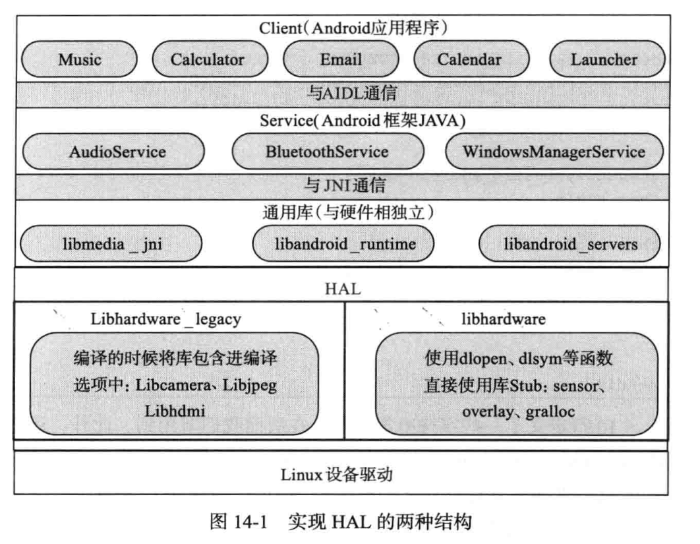

# HAL层



HAL层：该层实现android上层对linux中驱动程序的调用，向android上层提供访问底层设备的接口，以便android系统的其他部分访问这些硬件。

- android驱动和一般linux驱动的最大区别就是把对硬件的支持分为了两个层：一层放在用户空间，我们称只为硬件抽象层；另一层则放在了内核空间，我们称它为内核驱动层。
- 内核驱动层只提供简单的访问硬件的逻辑，例如提供读写硬件寄存器的方法，而具体读写什么值到硬件的逻辑，则放到硬件抽象层中。（将卡机的通信协议可以放在hal层做处理，只给上层的应用层提供接口即可）


实现hal层有两种不同的方式：

- libhardware_legacy是老式的hal结构，各个驱动逻辑在这里直接实现为一个个.so动态库，上层应用或framework通过这些.so库，实现底层的硬件访问。
- libhardware是新式的hal结构，采用stub代理调用方式，由stub向hal提供operations方法，进而向上层提供对底层硬件的操作。　　　事实上，新式hal结构中的stub任然是以*.so的形式存在的，但hal已经将*.so的具体实现方式隐藏起来了；(也就是说对上层应用程序员而言，不在需要它来确保某个驱动的.so库已经装载和运行（jni中要在java中装载对应的.so），)，上层的应用程序员只需要调用libandroid_runtime相关的接口函数即可。　runtime会负责符合android新hal结构stub驱动的加载。而且runtime通过stub提供的.so获取它的operations方法，并告知runtime的callback方法，因此runtime和stub都有可供对方调用的方法：一个使用流程，一个应用请求通过runtime调用stub的operations方法，stub在完成operations方法响应后，再调用runtime的callback方法进行返回。


## 1. code鉴赏

hal层的代码可以参考的案例：振动器　Vibrator

```shell
FireNow-Nougat/frameworks$ find -name *Vibrator*
./base/core/java/android/os/SystemVibrator.java
./base/core/java/android/os/Vibrator.java
./base/core/java/android/os/NullVibrator.java
./base/core/java/android/os/IVibratorService.aidl
./base/docs/html/sdk/api_diff/21/changes/android.os.Vibrator.html
./base/tests/permission/src/com/android/framework/permission/tests/VibratorServicePermissionTest.java
./base/services/core/java/com/android/server/VibratorService.java
./base/services/core/jni/com_android_server_VibratorService.cpp
FireNow-Nougat/frameworks$ 

```

### 1.1 app层使用

```shell
FireNow-Nougat/packages$ grep -inR Vibrator
apps/Camera2/src/com/android/camera/util/AndroidServices.java:32:import android.os.Vibrator;
apps/Camera2/src/com/android/camera/util/AndroidServices.java:125:    public Vibrator provideVibrator() {
apps/Camera2/src/com/android/camera/util/AndroidServices.java:126:        return (Vibrator) getSystemService(Context.VIBRATOR_SERVICE);
```


```java
public Vibrator provideVibrator() {
        return (Vibrator) getSystemService(Context.VIBRATOR_SERVICE);                                                                                 
    }   

```


### 1.2 java

在实现jni接口之后，为了让android java应用程序真正使用到vibrator的硬件服务，那么我们需要完成最后一步：在android的framework层实现相应的VibratorService服务。

1. 在android系统中，硬件服务一般是运行在和应用程序相独立的进程中。因此，调用这些硬件服务的应用程序和这些硬件服务之间的通信需要通过代理来进行。为此，我们要首先定义好通信接口。

2. 编写对应的VibratorService.java

   #### 1.1.1 aidl

   vim ./base/core/java/android/os/IVibratorService.aidl

   ```java
   package android.os;
   
   /** {@hide} */
   interface IVibratorService
   {
       boolean hasVibrator();
       void vibrate(int uid, String opPkg, long milliseconds, int usageHint, IBinder token);
       void vibratePattern(int uid, String opPkg, in long[] pattern, int repeat, int usageHint, IBinder token);
       void cancelVibrate(IBinder token);
   }
   ```


#### 1.1.2 编写java

vim ./base/services/core/java/com/android/server/VibratorService.java

```java
//代码太多截取一部分
    native static boolean vibratorExists();
    native static void vibratorInit();
    native static void vibratorOn(long milliseconds);
    native static void vibratorOff();                     
```

#### 1.1.3 添加到systemServer中

```sh
FireNow-Nougat/frameworks/base/services$ grep -inR VibratorService
core/java/com/android/server/VibratorService.java:30:import android.os.IVibratorService;
core/java/com/android/server/VibratorService.java:59:public class VibratorService extends IVibratorService.Stub
core/java/com/android/server/VibratorService.java:61:    private static final String TAG = "VibratorService";
core/java/com/android/server/VibratorService.java:199:    VibratorService(Context context) {
core/java/com/android/server/VibratorService.java:384:        mPreviousVibrations.addLast(new VibratorService.VibrationInfo(vib.mTimeout, vib.mStartTime,
core/java/com/android/server/VibratorService.java:713:                            VibratorService.this.doVibratorOn(duration, uid, usageHint);
core/jni/onload.cpp:39:int register_android_server_VibratorService(JNIEnv* env);
core/jni/onload.cpp:76:    register_android_server_VibratorService(env);
core/jni/com_android_server_VibratorService.cpp:17:#define LOG_TAG "VibratorService"
core/jni/com_android_server_VibratorService.cpp:92:int register_android_server_VibratorService(JNIEnv *env)
core/jni/com_android_server_VibratorService.cpp:94:    return jniRegisterNativeMethods(env, "com/android/server/VibratorService",
core/jni/Android.mk:37:    $(LOCAL_REL_DIR)/com_android_server_VibratorService.cpp \
java/com/android/server/SystemServer.java:521:        VibratorService vibrator = null;
java/com/android/server/SystemServer.java:611:                traceBeginAndSlog("StartVibratorService");
java/com/android/server/SystemServer.java:612:                vibrator = new VibratorService(context);
java/com/android/server/SystemServer.java:1246:            Trace.traceBegin(Trace.TRACE_TAG_SYSTEM_SERVER, "MakeVibratorServiceReady");
FireNow-Nougat/frameworks/base/services$ vim java/com/android/server/SystemServer.java +612

```

```java
if(!isBox){
                traceBeginAndSlog("StartVibratorService");
                vibrator = new VibratorService(context);
                ServiceManager.addService("vibrator", vibrator);
                Trace.traceEnd(Trace.TRACE_TAG_SYSTEM_SERVER);
            }           
```


### 1.3 jni层代码

./base/services/core/jni/com_android_server_VibratorService.cpp

```cpp
/*
 * Copyright (C) 2009 The Android Open Source Project
 *
 * Licensed under the Apache License, Version 2.0 (the "License");
 * you may not use this file except in compliance with the License.
 * You may obtain a copy of the License at
 *
 *      http://www.apache.org/licenses/LICENSE-2.0
 *
 * Unless required by applicable law or agreed to in writing, software
 * distributed under the License is distributed on an "AS IS" BASIS,
 * WITHOUT WARRANTIES OR CONDITIONS OF ANY KIND, either express or implied.
 * See the License for the specific language governing permissions and
 * limitations under the License.
 */

#define LOG_TAG "VibratorService"

#include "jni.h"
#include "JNIHelp.h"
#include "android_runtime/AndroidRuntime.h"

#include <utils/misc.h>
#include <utils/Log.h>
#include <hardware/vibrator.h>

#include <stdio.h>

namespace android
{

static hw_module_t *gVibraModule = NULL;
static vibrator_device_t *gVibraDevice = NULL;

static void vibratorInit(JNIEnv /* env */, jobject /* clazz */)
{
    if (gVibraModule != NULL) {
        return;
    }
    
//这两个步骤都是，hal层框架的 属于 EI
//1. 找hal层最后注册的　struct hw_module_t HAL_MODULE_INFO_SYM
    int err = hw_get_module(VIBRATOR_HARDWARE_MODULE_ID, (hw_module_t const**)&gVibraModule);

    if (err) {
        ALOGE("Couldn't load %s module (%s)", VIBRATOR_HARDWARE_MODULE_ID, strerror(-err));
    } else {
        if (gVibraModule) {
            //2. 找hal层对应的　方法集合
            vibrator_open(gVibraModule, &gVibraDevice);
        }
    }
}

static jboolean vibratorExists(JNIEnv* /* env */, jobject /* clazz */)
{
    if (gVibraModule && gVibraDevice) {
        return JNI_TRUE;
    } else {
        return JNI_FALSE;
    }
}

static void vibratorOn(JNIEnv* /* env */, jobject /* clazz */, jlong timeout_ms)
{
    if (gVibraDevice) {
        int err = gVibraDevice->vibrator_on(gVibraDevice, timeout_ms);
        if (err != 0) {
            ALOGE("The hw module failed in vibrator_on: %s", strerror(-err));
        }
    } else {
        ALOGW("Tried to vibrate but there is no vibrator device.");
    }
}

static void vibratorOff(JNIEnv* /* env */, jobject /* clazz */)
{
    if (gVibraDevice) {
        int err = gVibraDevice->vibrator_off(gVibraDevice);
        if (err != 0) {
            ALOGE("The hw module failed in vibrator_off(): %s", strerror(-err));
        }
    } else {
        ALOGW("Tried to stop vibrating but there is no vibrator device.");
    }
}

static const JNINativeMethod method_table[] = {
    { "vibratorExists", "()Z", (void*)vibratorExists },
    { "vibratorInit", "()V", (void*)vibratorInit },
    { "vibratorOn", "(J)V", (void*)vibratorOn },
    { "vibratorOff", "()V", (void*)vibratorOff }
};

int register_android_server_VibratorService(JNIEnv *env)
{
    return jniRegisterNativeMethods(env, "com/android/server/VibratorService",
            method_table, NELEM(method_table));
}

};
```

注册：

```shell
FireNow-Nougat/frameworks/base/services/core$ grep -inR register_android_server_VibratorService

jni/onload.cpp:39:int register_android_server_VibratorService(JNIEnv* env);
jni/onload.cpp:76:    register_android_server_VibratorService(env);
jni/com_android_server_VibratorService.cpp:92:int register_android_server_VibratorService(JNIEnv *env)

FireNow-Nougat/frameworks/base/services/core$
```

vim jni/onload.cpp

```c
/*
 * Copyright (C) 2009 The Android Open Source Project
 *
 * Licensed under the Apache License, Version 2.0 (the "License");
 * you may not use this file except in compliance with the License.
 * You may obtain a copy of the License at
 *
 *      http://www.apache.org/licenses/LICENSE-2.0
 *
 * Unless required by applicable law or agreed to in writing, software
 * distributed under the License is distributed on an "AS IS" BASIS,
 * WITHOUT WARRANTIES OR CONDITIONS OF ANY KIND, either express or implied.
 * See the License for the specific language governing permissions and
 * limitations under the License.
 */

#include "JNIHelp.h"
#include "jni.h"
#include "utils/Log.h"
#include "utils/misc.h"

namespace android {
int register_android_server_ActivityManagerService(JNIEnv* env);
int register_android_server_AlarmManagerService(JNIEnv* env);
int register_android_server_AssetAtlasService(JNIEnv* env);
int register_android_server_BatteryStatsService(JNIEnv* env);
int register_android_server_ConsumerIrService(JNIEnv *env);
int register_android_server_InputApplicationHandle(JNIEnv* env);
int register_android_server_InputWindowHandle(JNIEnv* env);
int register_android_server_InputManager(JNIEnv* env);
int register_android_server_LightsService(JNIEnv* env);
int register_android_server_PowerManagerService(JNIEnv* env);
int register_android_server_SerialService(JNIEnv* env);
int register_android_server_SystemServer(JNIEnv* env);
int register_android_server_UsbDeviceManager(JNIEnv* env);
int register_android_server_UsbMidiDevice(JNIEnv* env);
int register_android_server_UsbHostManager(JNIEnv* env);
int register_android_server_vr_VrManagerService(JNIEnv* env);
int register_android_server_VibratorService(JNIEnv* env);
int register_android_server_location_GnssLocationProvider(JNIEnv* env);
int register_android_server_location_FlpHardwareProvider(JNIEnv* env);
int register_android_server_connectivity_Vpn(JNIEnv* env);
int register_android_server_hdmi_HdmiCecController(JNIEnv* env);
int register_android_server_tv_TvUinputBridge(JNIEnv* env);
int register_android_server_tv_TvInputHal(JNIEnv* env);
int register_android_server_PersistentDataBlockService(JNIEnv* env);
int register_android_server_Watchdog(JNIEnv* env);
int register_android_server_HardwarePropertiesManagerService(JNIEnv* env);
};

using namespace android;

extern "C" jint JNI_OnLoad(JavaVM* vm, void* /* reserved */)
{
    JNIEnv* env = NULL;
    jint result = -1;

    if (vm->GetEnv((void**) &env, JNI_VERSION_1_4) != JNI_OK) {
        ALOGE("GetEnv failed!");
        return result;
    }
    ALOG_ASSERT(env, "Could not retrieve the env!");

    register_android_server_ActivityManagerService(env);
    register_android_server_PowerManagerService(env);
    register_android_server_SerialService(env);
    register_android_server_InputApplicationHandle(env);
    register_android_server_InputWindowHandle(env);
    register_android_server_InputManager(env);
    register_android_server_LightsService(env);
    register_android_server_AlarmManagerService(env);
    register_android_server_UsbDeviceManager(env);
    register_android_server_UsbMidiDevice(env);
    register_android_server_UsbHostManager(env);
    register_android_server_vr_VrManagerService(env);
    register_android_server_VibratorService(env);
    register_android_server_SystemServer(env);
    register_android_server_location_GnssLocationProvider(env);
    register_android_server_location_FlpHardwareProvider(env);
    register_android_server_connectivity_Vpn(env);
    register_android_server_AssetAtlasService(env);
    register_android_server_ConsumerIrService(env);
    register_android_server_BatteryStatsService(env);
    register_android_server_hdmi_HdmiCecController(env);
    register_android_server_tv_TvUinputBridge(env);
    register_android_server_tv_TvInputHal(env);
    register_android_server_PersistentDataBlockService(env);
    register_android_server_Watchdog(env);
    register_android_server_HardwarePropertiesManagerService(env);


    return JNI_VERSION_1_4;
}
```


### 1.4 hal层

```shell
FireNow-Nougat/hardware$ grep -inR VIBRATOR_HARDWARE_MODULE_ID
libhardware/modules/vibrator/vibrator.c:132:    .id = VIBRATOR_HARDWARE_MODULE_ID,
libhardware/modules/vibrator/Android.mk:22:# hw/<VIBRATOR_HARDWARE_MODULE_ID>.default.so
libhardware/include/hardware/vibrator.h:29:#define VIBRATOR_HARDWARE_MODULE_ID "vibrator"
FireNow-Nougat/hardware$ 

```

libhardware/include/hardware/vibrator.h

```c
#ifndef _HARDWARE_VIBRATOR_H
#define _HARDWARE_VIBRATOR_H

#include <hardware/hardware.h>

__BEGIN_DECLS

#define VIBRATOR_API_VERSION HARDWARE_MODULE_API_VERSION(1,0)

/**
 * The id of this module
 */
#define VIBRATOR_HARDWARE_MODULE_ID "vibrator"

/**
 * The id of the main vibrator device
 */
#define VIBRATOR_DEVICE_ID_MAIN "main_vibrator"

struct vibrator_device;
typedef struct vibrator_device {
    /**
     * Common methods of the vibrator device.  This *must* be the first member of
     * vibrator_device as users of this structure will cast a hw_device_t to
     * vibrator_device pointer in contexts where it's known the hw_device_t references a
     * vibrator_device.
     */
    struct hw_device_t common;

    /** Turn on vibrator
     *
     * This function must only be called after the previous timeout has expired or
     * was canceled (through vibrator_off()).
     *
     * @param timeout_ms number of milliseconds to vibrate
     *
     * @return 0 in case of success, negative errno code else
     */
    int (*vibrator_on)(struct vibrator_device* vibradev, unsigned int timeout_ms);

    /** Turn off vibrator
     *
     * Cancel a previously-started vibration, if any.
     *
     * @return 0 in case of success, negative errno code else
     */
    int (*vibrator_off)(struct vibrator_device* vibradev);
} vibrator_device_t;

static inline int vibrator_open(const struct hw_module_t* module, vibrator_device_t** device)
{
    return module->methods->open(module, VIBRATOR_DEVICE_ID_MAIN, (struct hw_device_t**)device);
}

__END_DECLS

#endif  // _HARDWARE_VIBRATOR_H
```


libhardware/modules/vibrator/vibrator.c 代码

```c
#include <hardware/vibrator.h>
#include <hardware/hardware.h>

#include <cutils/log.h>

#include <malloc.h>
#include <stdio.h>
#include <unistd.h>
#include <fcntl.h>
#include <errno.h>
#include <math.h>

static const char THE_DEVICE[] = "/sys/class/timed_output/vibrator/enable";

static int vibra_exists() {
    int fd;

    fd = TEMP_FAILURE_RETRY(open(THE_DEVICE, O_RDWR));
    if(fd < 0) {
        ALOGE("Vibrator file does not exist : %d", fd);
        return 0;
    }

    close(fd);
    return 1;
}

static int sendit(unsigned int timeout_ms)
{
    int to_write, written, ret, fd;

    char value[20]; /* large enough for millions of years */

    fd = TEMP_FAILURE_RETRY(open(THE_DEVICE, O_RDWR));
    if(fd < 0) {
        return -errno;
    }

    to_write = snprintf(value, sizeof(value), "%u\n", timeout_ms);
    written = TEMP_FAILURE_RETRY(write(fd, value, to_write));

    if (written == -1) {
        ret = -errno;
    } else if (written != to_write) {
        /* even though EAGAIN is an errno value that could be set
           by write() in some cases, none of them apply here.  So, this return
           value can be clearly identified when debugging and suggests the
           caller that it may try to call vibraror_on() again */
        ret = -EAGAIN;
    } else {
        ret = 0;
    }

    errno = 0;
    close(fd);

    return ret;
}

static int vibra_on(vibrator_device_t* vibradev __unused, unsigned int timeout_ms)
{
    /* constant on, up to maximum allowed time */
    return sendit(timeout_ms);
}

static int vibra_off(vibrator_device_t* vibradev __unused)
{
    return sendit(0);
}

static int vibra_close(hw_device_t *device)
{
    free(device);
    return 0;
}

static int vibra_open(const hw_module_t* module, const char* id __unused,
                      hw_device_t** device __unused) {
    if (!vibra_exists()) {
        ALOGE("Vibrator device does not exist. Cannot start vibrator");
        return -ENODEV;
    }

    vibrator_device_t *vibradev = calloc(1, sizeof(vibrator_device_t));

    if (!vibradev) {
        ALOGE("Can not allocate memory for the vibrator device");
        return -ENOMEM;
    }

    vibradev->common.tag = HARDWARE_DEVICE_TAG;
    vibradev->common.module = (hw_module_t *) module;
    vibradev->common.version = HARDWARE_DEVICE_API_VERSION(1,0);
    vibradev->common.close = vibra_close;

    vibradev->vibrator_on = vibra_on;
    vibradev->vibrator_off = vibra_off;

    *device = (hw_device_t *) vibradev;

    return 0;
}

/*===========================================================================*/
/* Default vibrator HW module interface definition                           */
/*===========================================================================*/

static struct hw_module_methods_t vibrator_module_methods = {
    .open = vibra_open,
};

struct hw_module_t HAL_MODULE_INFO_SYM = {
    .tag = HARDWARE_MODULE_TAG,
    .module_api_version = VIBRATOR_API_VERSION,
    .hal_api_version = HARDWARE_HAL_API_VERSION,
    .id = VIBRATOR_HARDWARE_MODULE_ID,
    .name = "Default vibrator HAL",
    .author = "The Android Open Source Project",
    .methods = &vibrator_module_methods,
};
```

#### 1.4.1 hal层架构分析

hal框架里面只有３个主要的struct结构：

- 其中的hw_module_methods_t 是从 hw_module_t 中独立出来的<函数表的定义>

##### EI

```c
Ｅ　　　　　　　　　　　　　　　　　　　　　　　Ｉ
struct hw_module_t --<> struct hw_module_methods_t
```

E : hw_module_t

I : hw_module_methods_t

T: 实现Ｉ中的抽象函数 


##### T

hal_stub :hal层的插件,这个是通过静态的方法去创建Ｔ

Ｔ

```c

static struct hw_module_methods_t vibrator_module_methods = {
    .open = vibra_open,
};

struct hw_module_t HAL_MODULE_INFO_SYM = {
...
    .id = VIBRATOR_HARDWARE_MODULE_ID,
    .methods = &vibrator_module_methods,
};

#define HAL_MODULE_INFO_SYM         HMI
#define HAL_MODULE_INFO_SYM_AS_STR  "HMI"
```

HAL_MODULE_INFO_SYM 这儿这个名字是固定的　HMI ,每个T 都得定义成这样，只有这样才能让hal框架层抓到　Ｔ的对象。


#### hal层框架的调用步骤：

1. 去找HMI  / HAL_MODULE_INFO_SYM

HAL层的框架是如何抓到　HMI (T)这个对象的？

```c
int hw_get_module(const char *id, const struct hw_module_t **module)
{
    return hw_get_module_by_class(id, NULL, module);
}                     
```

这个函数主要功能是根据模块ID 去查找注册在当前系统中和ID对应的硬件对象，然后载入(load)其相应的hal层驱动模块的*so文件。

从*.so里查找“HMI”这个符号，如果在so代码里面有定义的函数名或变量名为HMI，返回其地址。


2. 框架去调用open


