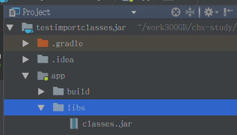
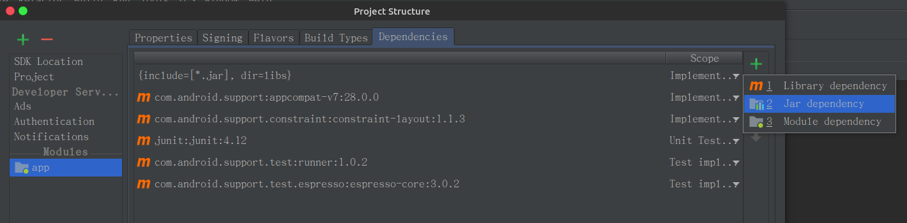
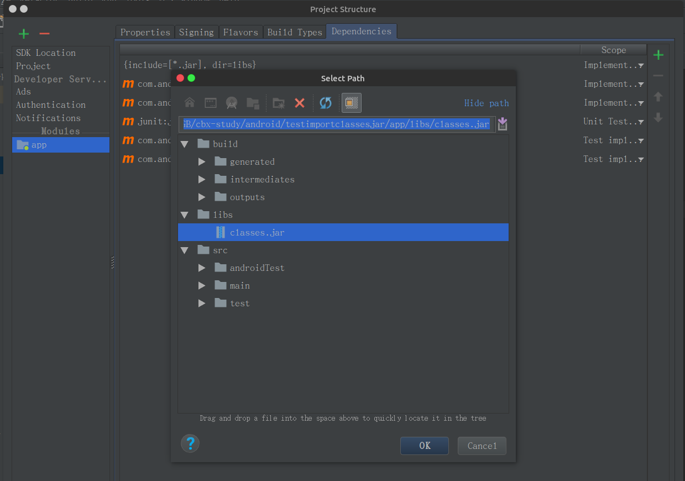
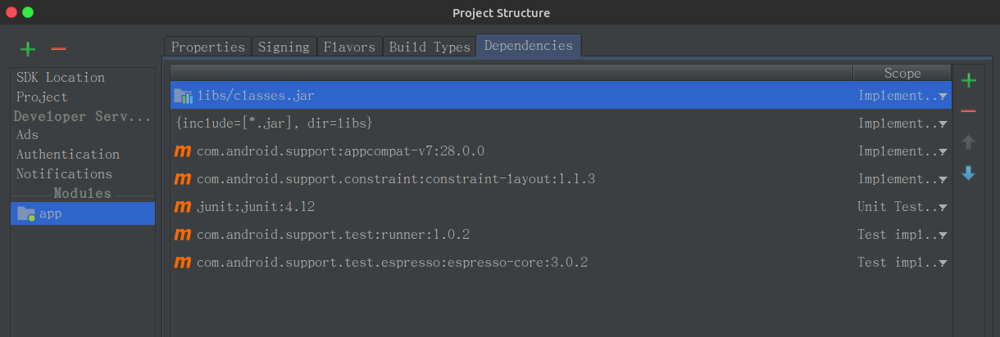
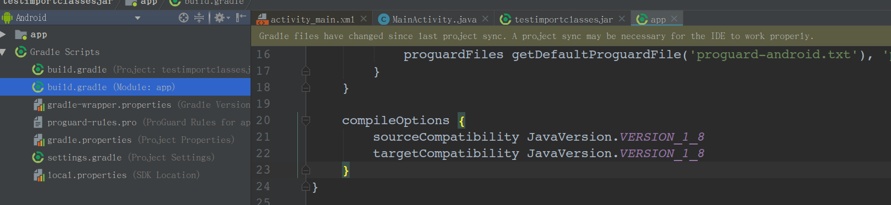
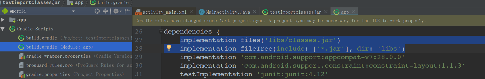

# android driver

## 1. virtualio 驱动编写

gedit drivers/virtualio/virtualio.c

```c
#include <linux/init.h>
#include <linux/module.h>
#include <linux/types.h>
#include <linux/fs.h>
#include <linux/proc_fs.h>
#include <linux/uaccess.h>
#include <linux/kernel.h>
#include <linux/slab.h>
#include <linux/device.h>
#include "virtualio.h"

static int virtualio_major = 0 ;
static int virtualio_minor = 0 ;

static struct class* virtualio_class = NULL ;
static struct virtualio_android_dev *virtualio_dev = NULL ;

static int virtualio_open(struct inode *inode, struct file *filp) ;
static int virtualio_release(struct inode *inode, struct file *filp) ;
static ssize_t virtualio_read(struct file *filp, char __user *buf, size_t num, loff_t *loff) ;
static ssize_t virtualio_write(struct file *filp, const char __user *buf, size_t num, loff_t *loff) ;

static struct file_operations virtualio_fops = {
	.owner = THIS_MODULE, 
	.open = virtualio_open, 
	.release= virtualio_release, 
	.read = virtualio_read, 
	.write = virtualio_write,
} ;

static int virtualio_open(struct inode *inode, struct file *filp)
{
	struct virtualio_android_dev *dev ;

	dev = container_of(inode->i_cdev, struct virtualio_android_dev, dev) ;
	filp->private_data = dev ;

    printk(KERN_INFO"virtualio_open...\n") ;

	return 0 ;
}


static int virtualio_release(struct inode *inode, struct file *filp)
{
    printk(KERN_INFO"virtualio_release...\n") ;
	return 0 ;
}


static ssize_t virtualio_read(struct file *filp, char __user *buf, size_t num, loff_t *loff) 
{
	ssize_t err = 0 ;
	struct virtualio_android_dev *dev = filp->private_data ;
    int num_i = (int)num ;

    printk(KERN_INFO"virtualio_read...\n") ;
    printk(KERN_INFO"num = %d\n", (int)num) ;
    

#if 1

	// if(down_interruptible(&(dev->sem))){
	// 	return -ERESTARTSYS ;
	// }

	if(num_i < 1 || num_i > 4){
		goto out ;
	}

    printk(KERN_INFO"reg= %d %d %d %d ...\n", dev->reg1, dev->reg2, dev->reg3, dev->reg4) ;

    #if 1
	switch (num_i){
		case 1:
			err = copy_to_user((char *)buf, (void *)&(dev->reg1), 1) ;
			break ;
		case 2:
			err = copy_to_user(buf + 1, &(dev->reg2), 1) ;
			break ;
		case 3:
			err = copy_to_user(buf + 2, &(dev->reg3), 1) ;
			break ;
		case 4:
			err = copy_to_user(buf + 3, &(dev->reg4), 1) ;
			break ;
		default :
			err = -EFAULT ;
			goto out ;
			break ;
	}
    #endif

	err = num_i ;

out:
	// up(&(dev->sem)) ;
	return err ;
#endif
}

static ssize_t virtualio_write(struct file *filp, const char __user *buf, size_t num, loff_t *loff)
{
	struct virtualio_android_dev *dev = filp->private_data ;
	ssize_t err = 0 ;
    int num_i = (int)num ;

    printk(KERN_INFO"virtualio_write...\n") ;
    printk(KERN_INFO"num = %d\n", (int)num) ;

#if 1

	// if(down_interruptible(&(dev->sem))){
	// 	return -ERESTARTSYS ;
	// }

	if(num_i < 1 || num_i > 4){
		goto out ;
	}

	switch(num_i){
		case 1:
			err = copy_from_user(&(dev->reg1), buf, 1) ;
			break ;
		case 2:
			err = copy_from_user(&(dev->reg2), buf, 1) ;
			break ;
		case 3:
			err = copy_from_user(&(dev->reg3), buf, 1) ;
			break ;
		case 4:
			err = copy_from_user(&(dev->reg4), buf, 1) ;
			break ;
		default:
			err = -EFAULT ;
			goto out ;
			break ;
	}
	err = num ;

out:
	// up(&(dev->sem)) ;
	return err ;
#endif

}

static const struct file_operations virtualio_proc_fops = {                                                                                                  
    .owner = THIS_MODULE, 
	.open = virtualio_open, 
	.release= virtualio_release, 
	.read = virtualio_read, 
	.write = virtualio_write,
};


static void virtualio_create_proc(void)
{
	struct proc_dir_entry *entry ;
#if 1
    entry = proc_create("VIRTUALIO_DEVICE_PROC_NAME", 0, NULL, &virtualio_proc_fops);

#else
    //很旧的函数接口 现在废弃了
	entry = create_proc_entry(VIRTUALIO_DEVICE_PROC_NAME, 0, NULL) ;
	if(entry){
		entry->owner = THIS_MODULE ;
		entry->read_proc = virtualio_proc_read ;
		entry->write_proc = virtualio_proc_write ;
	}
#endif
}

static void virtualio_remove_proc(void)
{
	remove_proc_entry(VIRTUALIO_DEVICE_PROC_NAME, NULL) ;
}

static int __virtualio_setup_dev(struct virtualio_android_dev *dev)
{
	int err ;
	DEFINE_SEMAPHORE(semaphore_virtualio) ;
	dev_t devno = MKDEV(virtualio_major, virtualio_minor) ;

	memset(dev, 0, sizeof(struct virtualio_android_dev)) ;

	cdev_init(&(dev->dev), &virtualio_fops) ;
	dev->dev.owner = THIS_MODULE ;
	dev->dev.ops = &virtualio_fops ;

	err = cdev_add(&(dev->dev), devno, 1) ;
	if(err){
		return err ;
	}


    dev->sem = semaphore_virtualio;
	dev->reg1 = 0 ;
	dev->reg2 = 0 ;
	dev->reg3 = 0 ;
	dev->reg4 = 0 ;

	return 0 ;
}

static int __init virtualio_init(void)
{
	int err = -1 ;
	dev_t dev = 0 ;
	struct device *temp = NULL ;

	printk(KERN_ALERT"Initializing virtualio device.\n") ;

	err = alloc_chrdev_region(&dev, 0, 1, VIRTUALIO_DEVICE_NODE_NAME) ;
	if(err < 0){
		printk(KERN_ALERT"Failed to alloc char dev region.\n") ;
		goto fail ;
	}

	virtualio_major = MAJOR(dev) ;
	virtualio_minor = MINOR(dev) ;

	virtualio_dev = kmalloc(sizeof(struct virtualio_android_dev), GFP_KERNEL) ;
	if(!virtualio_dev){
		err = -ENOMEM ;
		printk(KERN_ALERT"Failed to alloc virtualio_dev.\n") ;
		goto unregister ;
	}

	err = __virtualio_setup_dev(virtualio_dev) ;
	if(err){
		printk(KERN_ALERT"Failed to setup dev: %d\n", err) ;
		goto cleanup ;
	}

	virtualio_class = class_create(THIS_MODULE, VIRTUALIO_DEVICE_CLASS_NAME) ;
	if(IS_ERR(virtualio_class)){
		err = PTR_ERR(virtualio_class) ;
		printk(KERN_ALERT"Failed to create virtualio class.\n") ;
		goto destroy_cdev ;
	}

	temp = device_create(virtualio_class, NULL, dev, "%s", VIRTUALIO_DEVICE_FILE_NAME) ;
	if(IS_ERR(temp)){
		err = PTR_ERR(temp) ;
		printk(KERN_ALERT"Failed to create virtualio device.") ;
		goto destroy_class ;
	}

	dev_set_drvdata(temp, virtualio_dev) ;
	virtualio_create_proc() ;

	printk(KERN_ALERT"Succedded to initialize virtualio device.\n") ;
	return 0 ;

	device_destroy(virtualio_class, dev) ;

destroy_class:
	class_destroy(virtualio_class) ;

destroy_cdev:
	cdev_del(&(virtualio_dev->dev)) ;

cleanup:
	kfree(virtualio_dev) ;

unregister:
	unregister_chrdev_region(MKDEV(virtualio_major, virtualio_minor), 1) ;

fail:
	return err ;
}

static void __exit virtualio_exit(void) 
{
	dev_t devno = MKDEV(virtualio_major, virtualio_minor) ;
	printk(KERN_ALERT"Destroy virtualio device.\n") ;
	
	virtualio_remove_proc() ;

	if(virtualio_class){
		device_destroy(virtualio_class, MKDEV(virtualio_major, virtualio_minor)) ;
		class_destroy(virtualio_class) ;
	}

	if(virtualio_dev){
		cdev_del(&(virtualio_dev->dev)) ;
		kfree(virtualio_dev) ;
	}

	unregister_chrdev_region(devno, 1) ;

}

MODULE_LICENSE("GPL") ;
MODULE_DESCRIPTION("First android driver") ;

module_init(virtualio_init) ;
module_exit(virtualio_exit) ;
```


gedit drivers/virtualio/Makefile

```makefile
obj-$(CONFIG_VIRTUALIO) += virtualio.o
```


gedit drivers/virtualio/Kconfig

```shell
menu "virtualio"
config VIRTUALIO
	tristate "caobinxin test android driver virtualio"
	default n
	help
	This is the first android driver.
endmenu

```


## 2. 配置Kconfig

在当前kconfig中添加的menu将在  make menuconfig的 首页中会出现 

FireNow-Nougat/kernel/arch/arm64$ vim Kconfig

```shell
menu "colby test" 
source "drivers/virtualio/Kconfig"
endmenu            

```


这个暂时没有配

在make menuconfig 中 Device Drivers -> 会出现这个

FireNow-Nougat/kernel/drivers$ vim Kconfig

```shell
menu "Device Drivers" 
...
source "drivers/virtualio/Kconfig"  
...
endmenu

```


添加对应的目录：

FireNow-Nougat/kernel/drivers$ vim Makefile

```shell
obj-$(CONFIG_VIRTUALIO) += virtualio/
```


编译

```shell
FireNow-Nougat/kernel$make ARCH=arm64 firefly_defconfig #选取默认的配置文件
FireNow-Nougat/kernel$make menuconfig #选择驱动
FireNow-Nougat/kernel$ make -j8 ARCH=arm64 rk3399-firefly.img #编译
```


### 函数接口的变化：

#### 1. create_proc_entry接口发生变化

```shell
-   entry = create_proc_entry("sequence", 0, NULL);                                                                                                           
-   if (entry)
-       entry->proc_fops = &ct_file_ops;
+   entry = proc_create("sequence", 0, NULL, &ct_file_ops);

```

#### 2. 定义semaphore信号量变为

```c
DEFINE_SEMAPHORE(semaphore_virtualio) ;
```

## 3.编写简单的android测试代码

```shell
FireNow-Nougat/external$ mkdir virtualio

cd virtual
vim virtual.c
```

```c
#include <stdio.h>
#include <stdlib.h>
#include <fcntl.h>
#define DEVICE_NAME "/dev/virtualio"

int main(int argc, const char *argv[])
{
	int fd = -1 ;
	int reg_val = 0 ;
	int i ;

	fd = open(DEVICE_NAME, O_RDWR) ;
	if(fd == -1){
		printf("Failed to open device %s.\n", DEVICE_NAME) ;
		return -1 ;
	}

	printf("Read original value:\n") ;
	for(i = 0; i < 4; i++){
		read(fd, &reg_val, i + 1) ;
		printf("%d.\n", reg_val) ;
	}

	for(i = 0; i < 4; i++){
		reg_val = 6 + i ;
		printf("Write value %d to %s.\n\n", reg_val, DEVICE_NAME) ;
		write(fd, &reg_val, i + 1) ;
	}

	printf("Read the value again:\n") ;
	for(i = 0; i < 4; i++){
		read(fd, &reg_val, i + 1) ;
		printf("%d.\n",reg_val) ;
	}

	close(fd) ;
	return 0;
}
```

添加Android.mk

```shell
LOCAL_PATH:= $(call my-dir)
include $(CLEAR_VARS)
LOCAL_MODULE_TAGS := optional
LOCAL_SRC_FILES := $(call all-subdir-c-files)
LOCAL_MODULE:= virtualio
include $(BUILD_EXECUTABLE)

```

编译：

```shell
FireNow-Nougat$ . ./build/envsetup.sh
FireNow-Nougat$ lunch 13
FireNow-Nougat/external/virtualio$ mm
...
Install: out/target/product/rk3399_firefly_box/system/bin/virtualio
#### make completed successfully (18 seconds) ####

FireNow-Nougat$ ./mkimage.sh
FireNow-Nougat$ ./FFTools/mkupdate/mkupdate.sh update


```

测试：

```shell
FireNow-Nougat$ adb root
FireNow-Nougat$ adb shell
rk3399_firefly_box:/ # ./system/bin/virtualio                                                                                                                
Read original value:


```

居然奔溃了驱动有问题：


### 重新构建工作环境：

没有改变前的开发环境：

1. 驱动和img是一体的

构建后的开发环境是：驱动以模块的形式编译

1. make menuconfig 将 virtualio 变为[M], 然后在kernel目录中  make modules :方式一
2. 方式二：不用去配置make menuconfig ,在任意目录中去编译

```makefile
obj-m := virtualio.o
CONFIG_MODULE_SIG=n

UBUNTU_PATH=/lib/modules/$(shell uname -r)/build

ANDROID_3399_PATH=/home/colby/androidos/bottom_layer_work/FireNow-Nougat/kernel

all :
	$(MAKE) -C $(ANDROID_3399_PATH) M=$(PWD) modules  
clean:
	$(MAKE) -C /lib/modules/$(shell uname -r)/build M=$(PWD) clean 

```

用这种方式编译后的结果为：证明是ok的

```shell
module/11.android-driver/00.virtualio$ file virtualio.ko

virtualio.ko: ELF 64-bit LSB relocatable, ARM aarch64, version 1 (SYSV), BuildID[sha1]=4cde58072d7bb0116f2322743de212f0ac6f8728, not stripped
```

```shell
adb root
adb remount /
adb push virtualio.ko /system/

adb shell
rk3399_firefly_box:/system # insmod virtualio.ko
```


#### 以后使用这个Makefile

```makefile

CURRENT_MODULE_NAME=virtualio

obj-m := $(CURRENT_MODULE_NAME).o
CONFIG_MODULE_SIG=n

UBUNTU_PATH=/lib/modules/$(shell uname -r)/build

ANDROID_3399_PATH=/home/colby/androidos/bottom_layer_work/FireNow-Nougat/kernel

all :
	$(MAKE) -C $(ANDROID_3399_PATH) M=$(PWD) modules  
clean:
	$(MAKE) -C /lib/modules/$(shell uname -r)/build M=$(PWD) clean 

push:all
	adb root
	adb remount /
	sleep 1s
	adb push $(CURRENT_MODULE_NAME).ko /system/

test:push
	adb root
	adb shell rmmod $(CURRENT_MODULE_NAME)
	adb shell insmod /system/$(CURRENT_MODULE_NAME).ko
	sleep 1s
	adb shell ./system/bin/$(CURRENT_MODULE_NAME)
```

## 4.编写hal层文件

参照例子：

```shell
FireNow-Nougat/hardware$ find -name vibrator*
./libhardware/modules/vibrator
./libhardware/modules/vibrator/vibrator.c
./libhardware/include/hardware/vibrator.h
FireNow-Nougat/hardware$ 
```


### 4.1 virtualio.h

```shell
FireNow-Nougat/hardware/libhardware/include/hardware$ cp vibrator.h virtualio.h
```


vim virtualio.h

```c

#ifndef _HARDWARE_VIRTUALIO_H
#define _HARDWARE_VIRTUALIO_H

#include <hardware/hardware.h>

__BEGIN_DECLS

#define VIRTUALIO_API_VERSION HARDWARE_MODULE_API_VERSION(1,0)

#define VIRTUALIO_HARDWARE_MODULE_ID "virtualio"

#define VIRTUALIO_DEVICE_ID_MAIN "main_virtualio"

struct virtualio_device;
typedef struct virtualio_device {
    struct hw_device_t common;
    char (*virtualio_get_reg)(struct virtualio_device* virtualio_dev, char index);
    void (*virtualio_set_reg)(struct virtualio_device* virtualio_dev, char index, char buf);
} virtualio_device_t;

static inline int virtualio_open(const struct hw_module_t* module, virtualio_device_t** device)
{
    return module->methods->open(module, VIRTUALIO_DEVICE_ID_MAIN, (struct hw_device_t**)device);
}

__END_DECLS

#endif  // _HARDWARE_VIBRATOR_H
```

### 4.2 virtualio.c

```shell
FireNow-Nougat/hardware/libhardware/modules$ mkdir virtualio

```

```c
#define LOG_TAG "VirtualioStub"

#include <hardware/virtualio.h>
#include <hardware/hardware.h>

#include <cutils/log.h>

#include <malloc.h>
#include <stdio.h>
#include <unistd.h>
#include <fcntl.h>
#include <errno.h>
#include <math.h>

static const char THE_DEVICE[] = "/dev/virtualio";

static int virtualio_exists() {
    int fd;

    fd = TEMP_FAILURE_RETRY(open(THE_DEVICE, O_RDWR));
    if(fd < 0) {
        ALOGE("Vibrator file does not exist : %d -- %s", fd, strerror(errno));

        return 0;
    }

    close(fd);
    return 1;
}

char virtualio_get_reg(struct virtualio_device* virtualio_dev __unused, char index)
{
	char reg = 0 ;
	int fd = 0 ;
	int ret ;
	int count = (int)index ;

	if( count <= 0 || count > 3){
		ALOGE("virtualio_get_reg arg index error...\n") ;
		return -1 ;
	}

	count++ ;
	
    fd = TEMP_FAILURE_RETRY(open(THE_DEVICE, O_RDWR));
    if(fd < 0) {
        ALOGE("Vibrator file does not exist : %d -- %s", fd, strerror(errno));

        return 0;
    }

	ret = TEMP_FAILURE_RETRY(read(fd, &reg, count)) ;
	if(reg < 0){
		ALOGE("read failed ... %s\n", strerror(errno)) ; 
	}
	
	ALOGI("read -> reg[%d]=%d\n", count, (int)reg) ;
	
	close(fd) ;

	return reg ;
}

void virtualio_set_reg(struct virtualio_device* virtualio_dev, char index, char buf)
{
	int fd ;
	int ret ;
	int count = (int)index ;

	if( count <= 0 || count > 3){
		ALOGE("virtualio_set_reg arg index error...\n") ;
		return ;
	}
	
	count++ ;

    fd = TEMP_FAILURE_RETRY(open(THE_DEVICE, O_RDWR));
    if(fd < 0) {
        ALOGE("virtualio device does not open : %d -- %s", fd, strerror(errno));
        return ;
    }

	ret = TEMP_FAILURE_RETRY(write(fd, &buf, count)) ;
	if(ret < 0){
		ALOGE("virtualio_set_reg write failed... %s\n", strerror(errno)) ;  
		return ;
	}

	ALOGI("write -> reg[%d] = %d\n", count, (int)buf) ;

	close(fd) ;
}


static int virtualio_close(hw_device_t *device)
{
    free(device);
    return 0;
}

static int virlio_open(const hw_module_t* module, const char* id __unused,
                      hw_device_t** device __unused) {
    if (!virtualio_exists()) {
        ALOGE("Virtualio device does not exist. Cannot start vibrator");
        return -ENODEV;
    }

    virtualio_device_t *virtualio_dev = calloc(1, sizeof(virtualio_device_t));

    if (!virtualio_dev) {
        ALOGE("Can not allocate memory for the virtualio device");
        return -ENOMEM;
    }

    virtualio_dev->common.tag = HARDWARE_DEVICE_TAG;
    virtualio_dev->common.module = (hw_module_t *) module;
    virtualio_dev->common.version = HARDWARE_DEVICE_API_VERSION(1,0);
    virtualio_dev->common.close = virtualio_close;

    virtualio_dev->virtualio_get_reg = virtualio_get_reg;
    virtualio_dev->virtualio_set_reg = virtualio_set_reg;

    *device = (hw_device_t *) virtualio_dev;

    return 0;
}

/*===========================================================================*/
/*  virtualio HW module interface definition                           */
/*===========================================================================*/

static struct hw_module_methods_t virtualio_module_methods = {
    .open = virlio_open,
};

struct hw_module_t HAL_MODULE_INFO_SYM = {
    .tag = HARDWARE_MODULE_TAG,
    .module_api_version = VIRTUALIO_API_VERSION,
    .hal_api_version = HARDWARE_HAL_API_VERSION,
    .id = VIRTUALIO_HARDWARE_MODULE_ID,
    .name = "Default virtualio HAL",
    .author = "colbycao",
    .methods = &virtualio_module_methods,
};
```

#### 4.2.1 权限*

注意：由于设备文件是在内核驱动里面通过device_create创建的，而device_create创建的设备文件默认只有root用户可读写，而virtualio_open一般是由上层应用程序来调用的，这些程序一般是不具备root权限的，这时候应该会导致打开设备文件失败：


解决方案是：

​	基于类似linux的udev规则，在android源代码工程目录中，进入system/core/rootdir目录，打开里面的ueventd.rc文件，往里面添加一行，赋予其他用户对该文件的读/写权限。

/dev/virtualio 0666 root root

```shell
FireNow-Nougat/system/core/rootdir$ vim ueventd.rc
```


```shell
#colby add                                                                                                                                                  
/dev/virtualio            0666   root       root

```

**这个权限加完之后，在当前目录下的Android.mk下执行 mm,是无效的，只有将android源码重新编译，才能让这条规则编译进去。**

这条规则不生效将导致，hal层open()函数失败，报权限缺失的错

#### 4.2.2 Android.mk

FireNow-Nougat/hardware/libhardware/modules/virtualio$ vim Android.mk

```makefile
LOCAL_PATH := $(call my-dir)

include $(CLEAR_VARS)

#这里添加.default就能保证我们的模块virtualio默认要被硬件抽象层加载 
LOCAL_MODULE := virtualio.default

# HAL module implementation stored in
# hw/<VIBRATOR_HARDWARE_MODULE_ID>.default.so
LOCAL_MODULE_RELATIVE_PATH := hw
LOCAL_C_INCLUDES := hardware/libhardware
LOCAL_SRC_FILES := virtualio.c
LOCAL_SHARED_LIBRARIES := liblog
LOCAL_MODULE_TAGS := optional

include $(BUILD_SHARED_LIBRARY)

```

编译后的

```shell
FireNow-Nougat/out/target/product/rk3399_firefly_box/system/lib/hw$ ls
virtualio.default.so
```

## 5. 编写jni

参照

```shell
FireNow-Nougat/frameworks$ find -name *Vibrator*
./base/core/java/android/os/SystemVibrator.java
./base/core/java/android/os/Vibrator.java
./base/core/java/android/os/NullVibrator.java
./base/core/java/android/os/IVibratorService.aidl
./base/docs/html/sdk/api_diff/21/changes/android.os.Vibrator.html
./base/tests/permission/src/com/android/framework/permission/tests/VibratorServicePermissionTest.java
./base/services/core/java/com/android/server/VibratorService.java
./base/services/core/jni/com_android_server_VibratorService.cpp

FireNow-Nougat/frameworks/base/services/core/jni$ cp com_android_server_VibratorService.cpp com_android_server_VirtualioService.cpp

```


```c++
/*
 * Copyright (C) 2009 The Android Open Source Project
 *
 * Licensed under the Apache License, Version 2.0 (the "License");
 * you may not use this file except in compliance with the License.
 * You may obtain a copy of the License at
 *
 *      http://www.apache.org/licenses/LICENSE-2.0
 *
 * Unless required by applicable law or agreed to in writing, software
 * distributed under the License is distributed on an "AS IS" BASIS,
 * WITHOUT WARRANTIES OR CONDITIONS OF ANY KIND, either express or implied.
 * See the License for the specific language governing permissions and
 * limitations under the License.
 */

#define LOG_TAG "VirtualioService"

#include "jni.h"
#include "JNIHelp.h"
#include "android_runtime/AndroidRuntime.h"

#include <utils/misc.h>
#include <utils/Log.h>
#include <hardware/virtualio.h>

#include <stdio.h>

namespace android
{

static hw_module_t *gVirtualioModule = NULL;
static virtualio_device_t *gVirtualioDevice = NULL;

static void virtualioInit(JNIEnv /* env */, jobject /* clazz */)
{
	ALOGI("virtualioInit ...\n") ;
    if (gVirtualioModule != NULL) {
        return;
    }

    int err = hw_get_module(VIRTUALIO_HARDWARE_MODULE_ID, (hw_module_t const**)&gVirtualioModule);

    if (err) {
        ALOGE("Couldn't load %s module (%s)", VIRTUALIO_HARDWARE_MODULE_ID, strerror(-err));
    } else {
        if (gVirtualioModule) {
            virtualio_open(gVirtualioModule, &gVirtualioDevice);
        }
    }
}

static jboolean virtualioExists(JNIEnv* /* env */, jobject /* clazz */)
{
	ALOGI("virtualioExists ... \n") ;
    if (gVirtualioModule && gVirtualioDevice) {
        return JNI_TRUE;
    } else {
        return JNI_FALSE;
    }
}

static jchar virtualio_get_reg(JNIEnv* /* env */, jobject /* clazz */, jchar index)
{
	char reg = 0 ;
	ALOGI("virtualio_get_reg ... \n") ;
    if (gVirtualioDevice) {
        reg = gVirtualioDevice->virtualio_get_reg(gVirtualioDevice, index);
    } else {
        ALOGW("Tried to virtualio but there is no vibrator device.");
    }

	ALOGI("jni-> get_reg: reg[%d] = %d\n", (int)index, (int)reg) ;

	return reg ;
}

static void virtualio_set_reg(JNIEnv* /* env */, jobject /* clazz */, jchar index, jchar buf)
{
	ALOGI("jni-> set_reg: reg[%d] = %d\n", (int)index, (int)buf) ;
    if (gVirtualioDevice) {
        gVirtualioDevice->virtualio_set_reg(gVirtualioDevice, index, buf);
    } else {
        ALOGW("Tried to stop vibrating but there is no vibrator device.");
    }
}

static const JNINativeMethod method_table[] = {
    { "virtualioExists", "()Z", (void*)virtualioExists },
    { "virtualioInit", "()V", (void*)virtualioInit },
    { "virtualioSetReg", "(CC)V", (void*)virtualio_set_reg },
    { "virtualioGetReg", "(C)C", (void*)virtualio_get_reg }
};

int register_android_server_VirtualioService(JNIEnv *env)
{
	ALOGI("register_android_server_VirtualioService...\n") ;
    return jniRegisterNativeMethods(env, "com/android/server/VirtualioService",
            method_table, NELEM(method_table));
}

};
```

在当前目录中的 onload.cpp中 添加

```c++
int register_android_server_VirtualioService(JNIEnv* env);


extern "C" jint JNI_OnLoad(JavaVM* vm, void* /* reserved */)
{

	register_android_server_VirtualioService(env);
    
}
```

在当前的目录的Android.mk中添加

```makefile
$(LOCAL_REL_DIR)/com_android_server_VirtualioService.cpp \ 
```

## 6. 在framework 添加 VirtualioService

在android的framework层实现相应的virtualioService服务。

### 6.1 aidl

由于我们的硬件服务一般是运行在和应用程序相独立的进程中。因此，调用这些硬件服务的应用程序和这些硬件服务之间的通信是需要代理来进行的。

定义通信接口：

```shell
FireNow-Nougat/frameworks$ find -name *Vibrator*
./base/core/java/android/os/SystemVibrator.java
./base/core/java/android/os/Vibrator.java
./base/core/java/android/os/NullVibrator.java
./base/core/java/android/os/IVibratorService.aidl
./base/docs/html/sdk/api_diff/21/changes/android.os.Vibrator.html
./base/tests/permission/src/com/android/framework/permission/tests/VibratorServicePermissionTest.java
./base/services/core/java/com/android/server/VibratorService.java
./base/services/core/jni/com_android_server_VibratorService.cpp


FireNow-Nougat/frameworks/base/core/java/android/os$ cp IVibratorService.aidl IVirtualioService.aidl


FireNow-Nougat$ find -name IVibratorService.java
./out/target/common/obj/JAVA_LIBRARIES/framework_intermediates/src/core/java/android/os/IVibratorService.java
```


```java
package android.os;
interface IVirtualioService
{
    boolean hasVirtualio();
    void setReg(int index, int value) ;
    int getReg(int index) ;                                                                                                                                   
}
```

添加对应的 Android.mk   frameworks/base$ vim Android.mk

```make

LOCAL_SRC_FILES += \
...
core/java/android/os/IVirtualioService.aidl \   
```


这次编译后的结果是：生成 IVirtualioService.java

```shell
Install: out/target/product/rk3399_firefly_box/system/framework/framework.jar
make: Leaving directory '/home/colby/androidos/bottom_layer_work/FireNow-Nougat'

#### make completed successfully (01:03 (mm:ss)) ####

```

```shell
#生成：IVirtualioService.java  和 classes.jar（应用编程的时候得需要）

FireNow-Nougat$ find -name IVirtualioService.java
./out/target/common/obj/JAVA_LIBRARIES/framework_intermediates/src/core/java/android/os/IVirtualioService.java

#classes.jar的路径
FireNow-Nougat/out/target/common/obj/JAVA_LIBRARIES/framework_intermediates/classes.jar
```

补充一点，要想这个时候，生成classes.jar 需要  在, 这样才能更新 在classes.jar中包含IVirtualioService.class

```shell
FireNow-Nougat/$ make update-api -j4
```


### 6.2 编写服务

参照：./base/services/core/java/com/android/server/VibratorService.java


```shell
FireNow-Nougat/frameworks/base/services/core/java/com/android/server$ cp VibratorService.java VirtualioService.java
```

```java
/*
 * Copyright (C) 2008 The Android Open Source Project
 *
 * Licensed under the Apache License, Version 2.0 (the "License");
 * you may not use this file except in compliance with the License.
 * You may obtain a copy of the License at
 *
 *      http://www.apache.org/licenses/LICENSE-2.0
 *
 * Unless required by applicable law or agreed to in writing, software
 * distributed under the License is distributed on an "AS IS" BASIS,
 * WITHOUT WARRANTIES OR CONDITIONS OF ANY KIND, either express or implied.
 * See the License for the specific language governing permissions and
 * limitations under the License.
 */

package com.android.server;
import android.content.Context;
import android.os.IVirtualioService;
import android.util.Slog;

public class VirtualioService extends IVirtualioService.Stub{
	private static final String TAG = "VirtualioService" ;

	VirtualioService(){
		Slog.i(TAG, "VirtualioService 构造函数...") ;
		virtualioInit() ;
	}
	public boolean hasVirtualio() throws android.os.RemoteException{
		Slog.i(TAG, "hasVirtualio ...") ;
        virtualioInit() ;
		return virtualioExists() ;
	}

	public void setReg(int index, int value) throws android.os.RemoteException{
		Slog.i(TAG, "setReg -> index: " + index + "  value: " + value) ;
		virtualioSetReg((char)index, (char)value) ;
	}

	public int getReg(int index) throws android.os.RemoteException{
		int ret = virtualioGetReg((char)index) ;
		Slog.i(TAG, "getReg -> ret" + index + " = " + ret) ;
		return ret;
	}

	private static native void virtualioInit() ;
	private static native boolean virtualioExists() ;
	private static native void virtualioSetReg(char index, char buf) ;
	private static native char virtualioGetReg(char index) ;
}
```

将该服务添加到系统服务中，添加到SystemService.java

```java
FireNow-Nougat/frameworks/base$ vim services/java/com/android/server/SystemServer.java
```

```java
private void startOtherServices() {
    VibratorService vibrator = null;  //这个是参照                                                           
    VirtualioService virtualio = null;


	try{
    	traceBeginAndSlog("StartVirtualioService");
        virtualio = new VirtualioService() ;
        ServiceManager.addService("virtualio", virtualio) ;
        Trace.traceEnd(Trace.TRACE_TAG_SYSTEM_SERVER);
     }catch(Throwable e){
                Slog.e("virtualio", "add ServiceManager fail ");
     }
}
```

到目前为止，编译都通过。

重新刷rom: 发现服务是起来了

```shell
rk3399_firefly_box:/ $ logcat | grep -inR virtualio                                                                                                      
(standard input):251:01-18 16:56:02.678   611   611 I SystemServer: StartVirtualioService
(standard input):252:01-18 16:56:02.679   611   611 I VirtualioService: VirtualioService 构造函数...


```

### 6.3 给服务添加权限

**这个权限是必须添加的，不然app层，会拿到服务的空指针.**把seandroid关了也白搭，必须加

参照如下进行添加：

```shell
FireNow-Nougat/system/sepolicy$ grep -inR vibrator
service.te:114:type vibrator_service, app_api_service, system_server_service, service_manager_type;
dumpstate.te:87:# /sys/class/timed_output/vibrator/enable
service_contexts:139:vibrator                                  u:object_r:vibrator_service:s0

```

修改：vim service_contexts

```shell
vibrator                                  u:object_r:vibrator_service:s0
virtualio                                  u:object_r:virtualio_service:s0        
```

修改：vim  service.te

```shell
type vibrator_service, app_api_service, system_server_service, service_manager_type;
type virtualio_service, app_api_service, system_server_service, service_manager_type;  
```


## 7.android app层测试

```shell
$ adb shell service list | less #查看当前服务有没有起来

colby@colby-myntai:~$ adb root
colby@colby-myntai:~$ adb shell setenforce 0
colby@colby-myntai:~$ adb shell getenforce
Permissive
```

### 7.1 创建app 应用

参照：

```java
package com.myntai.slightech.testvirtualioservice;

import android.support.v7.app.AppCompatActivity;
import android.os.Bundle;
import android.os.IVirtualioService ;
import android.util.Log;

public class MainActivity extends AppCompatActivity {

    static private String TAG = "MainActivity" ;
    IVirtualioService iVirtaulioService ;
    @Override
    protected void onCreate(Bundle savedInstanceState) {
        super.onCreate(savedInstanceState);
        setContentView(R.layout.activity_main);
        getVirtualioService() ;

        try{
            if(null == iVirtaulioService){
                Log.e(TAG, "iVirtaulioService = " + iVirtaulioService) ;
            }

            Log.i(TAG, "hasVirtualio = " + iVirtaulioService.hasVirtualio()) ;
            iVirtaulioService.setReg(0, 3) ;
            iVirtaulioService.setReg(1, 5) ;
            iVirtaulioService.setReg(2, 6) ;
            iVirtaulioService.setReg(3, 8) ;

            int reg1 = iVirtaulioService.getReg(0) ;
            int reg2 = iVirtaulioService.getReg(1) ;
            int reg3 = iVirtaulioService.getReg(2) ;
            int reg4 = iVirtaulioService.getReg(3) ;

            Log.i(TAG, "reg1:" + reg1 + "  reg2:" + reg2) ;
            Log.i(TAG, "reg3:" + reg3 + "  reg4:" + reg4) ;

        }catch(Exception e){
            Log.e(TAG, "" + e) ;
        }

    }

    void getVirtualioService(){
        try{
            android.os.IBinder b = android.os.ServiceManager.getService("virtualio") ;
            Log.e(TAG, "b = " + b) ;
            iVirtaulioService = IVirtualioService.Stub.asInterface(b) ;
        }catch(Exception e){
            Log.e(TAG, "" + e) ;
        }
    }
}

```


#### 遇到的问题：

##### 1.引入classes.jar

android studio 在引入classes.jar 编译的过程中各种报错

https://www.cnblogs.com/Sharley/p/9560466.html

https://blog.csdn.net/sk569437/article/details/84871041

1. classer.jar的生成和目录：

生成classer.jar:在编译完aidl后，将产生 IVirtualioService.java,**但此时并不更新classes.jar,需要在**

```shell
FireNow-Nougat/$ make update-api -j4
```

```shell
#生成：IVirtualioService.java  和 classes.jar（应用编程的时候得需要）

FireNow-Nougat$ find -name IVirtualioService.java
./out/target/common/obj/JAVA_LIBRARIES/framework_intermediates/src/core/java/android/os/IVirtualioService.java

#classes.jar的路径
FireNow-Nougat/out/target/common/obj/JAVA_LIBRARIES/framework_intermediates/classes.jar
```

2. android studio 导入classes.jar出的问题：

导入步骤1：将jar包放到libs下



步骤2：






将classes.jar移动到最上面




编译后报第一个错：

```shell
Default interface methods are only supported starting with Android N (--min-api 24): void android.view.Window$Callback.onProvideKeyboardShortcuts(java.util.List, android.view.Menu, int)
Message{kind=ERROR, text=Default interface methods are only supported starting with Android N (--min-api 24): void android.view.Window$Callback.onProvideKeyboardShortcuts(java.util.List, android.view.Menu, int), sources=[Unknown source file], tool name=Optional.of(D8)}
#原因分析： java8才支持静态接口方法，Android N 要求jdk版本为1.8
#解决方案：定义和调用静态接口方法的module编译时都使用jdk1.8即可
```



```makefile
android {
...
  compileOptions {
        sourceCompatibility JavaVersion.VERSION_1_8
        targetCompatibility JavaVersion.VERSION_1_8
    }
...
}

```

在编译后报错失败：

```shell
Caused by: java.lang.NoSuchMethodException: no such method: android.os.PowerManager$WakeLock.lambda$wrap$0(Runnable)void/invokeSpecial
```




解决办法：

```groovy
	implementation files('libs/classes.jar') 
    implementation fileTree(include: ['*.jar'], dir: 'libs') 
        |
        V
    compileOnly files('libs/classes.jar')
    compileOnly fileTree(include: ['*.jar'], dir: 'libs')
```

**这里我们只是需要我们的classes.jar参与编译，但不参与打包**,所以这里将用compileOnly替换。

https://blog.csdn.net/yuzhiqiang_1993/article/details/78366985?locationNum=6&fps=1

再次编译通过，将上述app中java代码copy后测试可以正常获取到 virtulio 服务


##### 2.hal层open失败

hal层的open函数 打开/dev/virtualio失败：

https://blog.csdn.net/qq_20678703/article/details/50057723


解决方案是：

​	基于类似linux的udev规则，在android源代码工程目录中，进入system/core/rootdir目录，打开里面的ueventd.rc文件，往里面添加一行，赋予其他用户对该文件的读/写权限。

/dev/virtualio 0666 root root

**之后一定要将android源码进行全部编译**

##### 3. seandroid

参照这个修改：

```shell
FireNow-Nougat/system$ grep -inR zero_device --exclude=*.c* --exclude=*.h*
sepolicy/device.te:43:type zero_device, dev_type, mlstrustedobject;
sepolicy/file_contexts:143:/dev/zero		u:object_r:zero_device:s0
sepolicy/domain.te:74:allow domain zero_device:chr_file rw_file_perms;

```


vim device.te

```shell
type zero_device, dev_type, mlstrustedobject;
type virtualio_device, dev_type, mlstrustedobject;   
```

vim file_contexts

```shell
/dev/zero       u:object_r:zero_device:s0
/dev/virtualio      u:object_r:virtualio_device:s0    
```

vim sepolicy/domain.te

```shell
allow domain zero_device:chr_file rw_file_perms;
allow domain virtualio_device:chr_file rw_file_perms;   
```

## 8.总览

修改和添加的文件总浏览图

```shell
colby@colby-myntai:~/androidos/bottom_layer_work/FireNow-Nougat$ git status 
位于分支 develop
您的分支与上游分支 'origin/develop' 一致。
尚未暂存以备提交的变更：
  （使用 "git add <文件>..." 更新要提交的内容）
  （使用 "git checkout -- <文件>..." 丢弃工作区的改动）

	修改：     frameworks/base/Android.mk
	修改：     frameworks/base/api/current.txt
	修改：     frameworks/base/api/system-current.txt
	修改：     frameworks/base/api/test-current.txt
	修改：     frameworks/base/services/core/jni/Android.mk
	修改：     frameworks/base/services/core/jni/onload.cpp
	修改：     frameworks/base/services/java/com/android/server/SystemServer.java
	修改：     kernel/arch/arm64/Kconfig
	修改：     kernel/drivers/Makefile
	修改：     system/core/rootdir/ueventd.rc
	修改：     system/sepolicy/device.te
	修改：     system/sepolicy/domain.te
	修改：     system/sepolicy/file_contexts
	修改：     system/sepolicy/service.te
	修改：     system/sepolicy/service_contexts

未跟踪的文件:
  （使用 "git add <文件>..." 以包含要提交的内容）

	external/virtualio/
	frameworks/base/core/java/android/os/IVirtualioService.aidl
	frameworks/base/services/core/java/com/android/server/VirtualioService.java
	frameworks/base/services/core/jni/com_android_server_VirtualioService.cpp
	hardware/libhardware/include/hardware/virtualio.h
	hardware/libhardware/modules/virtualio/
	hardware/tags
	kernel/drivers/virtualio/


耗费了 11.99 秒以枚举未跟踪的文件。'status -uno' 也许能提高速度，
但您需要小心不要忘了添加新文件（参见 'git help status'）。
修改尚未加入提交（使用 "git add" 和/或 "git commit -a"）
colby@colby-myntai:~/androidos/bottom_layer_work/FireNow-Nougat$ 

```

