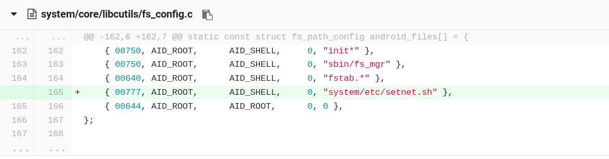

# wifi eth0 共存

https://note.youdao.com/ynoteshare1/index.html?id=976ac5bbc1ab1584ce0345235c6e39c6&type=note#/

https://blog.csdn.net/jiuxin/article/details/68485038

https://blog.csdn.net/javon_hzw/article/details/46831771

https://blog.csdn.net/qq_32072451/article/details/73826030

https://blog.csdn.net/andyhuabing/article/details/7790092


frameworks/opt/net/ethernet/java/com/android/server/ethernet/EthernetNetworkFactory.java

```java
class EthernetNetworkFactory {
    private static final String NETWORK_TYPE = "Ethernet";
    private static final String TAG = "EthernetNetworkFactory";
    private static final int NETWORK_SCORE = 50;
    private static final int NETWORK_SCORE = 51;
    private static final boolean DBG = true;

    /** Tracks interface changes. Called from NetworkManagementService. */
@@ -252,6 +252,9 @@ class EthernetNetworkFactory {
            // so we get dropped.  TODO - just unregister the factory
            // when link goes down.
            mFactory.setScoreFilter(up ? NETWORK_SCORE : -1);
            if(up) {
                mFactory.startNetwork();
            }
        }
    }


```


frameworks/base/core/java/android/net/NetworkFactory.java


frameworks/base/core/java/android/net/NetworkFactory.java


添加路由表




工作要求：开机之后，wifi和以太网均能够工作，获取到ip地址


自己网络的分值(数据连接50，WIFI60，蓝牙69，网线70)

现状分析：

​    

改进尝试1：降低了以太网的评分: 70降低为50  wifi为60

现状分析1：

> 开机之后，以太网总是先启动，wifi后启动

> 如果以太网先连接，再wifi连接，这样两者都可以获取到ip；

> 如果wifi先连接，以太网后连接，则wifi会有ip，以太网无法获取；


3、修改Connectivity.java:

<http://blog.csdn.net/qq_32072451/article/details/73826030>

<http://blog.csdn.net/jiuxin/article/details/68485038>


先连接以太网，然后连接wifi    都有ip , 以太网优先

--->断开 wifi, 无影响   再连接上，对以太网无影响  但是不能自动获取到ip

---->断开 以太网， 对WiFi无影响，再连接上以太网wifi都恢复


现在修改了 ：   2018.1.13

1、修改wifi优先，在 NetworkAgentInfo.java的方法getCurrentScore() 中加入： 

if (networkCapabilities.hasTransport(NetworkCapabilities.TRANSPORT_WIFI)) { 

return MAXIMUM_NETWORK_SCORE; 

} 

2、修改 wifi 连接上的情况下，插入有线会主动连接。由于上面将 wifi 的优先级调到最高了，所有插入有线时， 

判断当前网络连接优先级高于有线，所以不会主动连接有线。在 EthernetNetworkFactory.java的方法 updateInterfaceState 

中加入 

mFactory.setScoreFilter(up ? NETWORK_SCORE : -1); 

if (up) { 

mFactory.startNetwork(); 

} 

以太网连接了，wifi断开重连，并不会替换了以太网

修正：去掉升分，换为降分

此处有问题：在adb shell里面其实可以获取到ip地址，在应用层显示正在获取IP信息.


注释掉修改1，改为设置分数为50；保留插上有线自动连接，修改2


1.15    晚

eth0: IPv4 configuration succeeded

eth0: onProvisioningSuccess()

01-15 11:46:57.057 397-1663/system_process E/EthernetNetworkFactory: Already have a NetworkAgent - aborting new request

错误信息如上，之前ip地址已获取成功，之后就无法显示或上网.NetworkAgent是在真正接入网络时才会创建。


EthernetNetworkFactory：

​                synchronized(EthernetNetworkFactory.this) {

​                    if (mNetworkAgent != null) {

​                        Log.e(TAG, "Already have a NetworkAgent - aborting new request");

​                        return;

​                    }


-----------------》

mNetworkAgent	  != NULL  ----------->想办法置为NULL


不应该这样改


在最原始的基础上（去掉了startNetwork（）函数的调用，将以太网的score恢复为70），更改了EthernetNetworkFactory.java 里的score     （按照<http://blog.csdn.net/qq_32072451/article/details/73826030>博客）


还是以太网优先，当wifi关闭打开之后就不会自动连接

​            --------------------------------失败

减低以太网的Score，EthernetNetworkFactory.javaupdateInterfaceState 

中加入 

mFactory.setScoreFilter(up ? NETWORK_SCORE : -1); 

if (up) { 

mFactory.startNetwork(); 

} 

根据Log信息，从网络接口的改变到最后Agent的设置之间对于Agent的处理，在哪设为NULL？？？？？

加入reconnetc();


-----------------------------修改以太网、WIFI共存成功-----------------------------------------

1、EthernetNetworkFactory.java：

score = 51;


updateInterfaceState():+ 

​        if (up) { 

​            mFactory.startNetwork(); 

​        } 


2、NetworkFactory.java:


eventquest():+

​    if(!(mScore == 51)){//51是以太网的网络评分

​        needNetworkfor();

​    }

------------------------------修改以太网访问内网、WIFI访问外网--------------------------------------------

命令测试：

ip ru flush// 清空路由规则缓冲

ip ru add from xxx.xxx.xxx.xxx lookup eth0//设置以太网访问内网规则

ip ru add from all lookup wlan0//其它连接WIFI