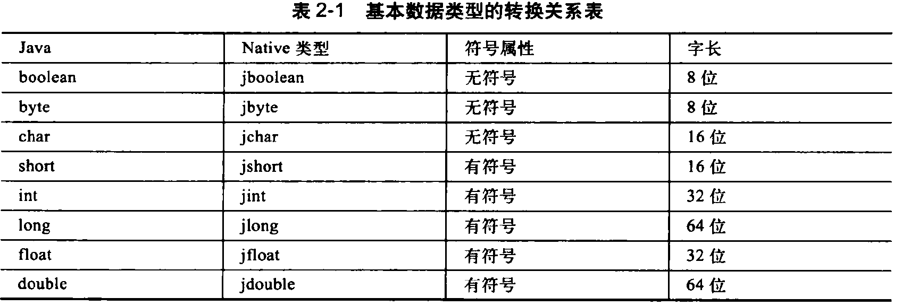
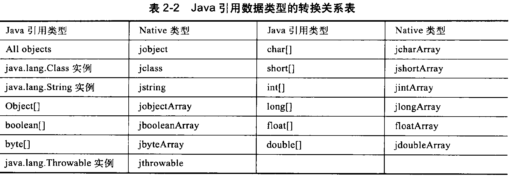
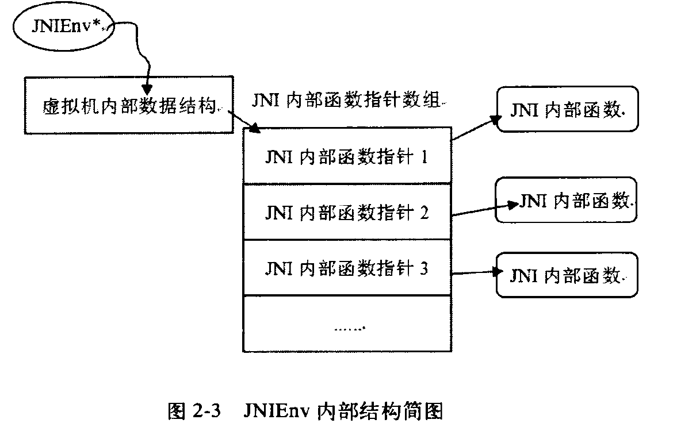
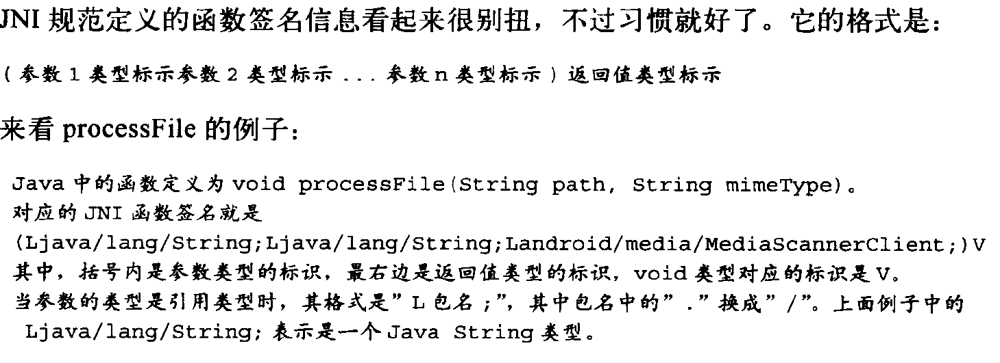
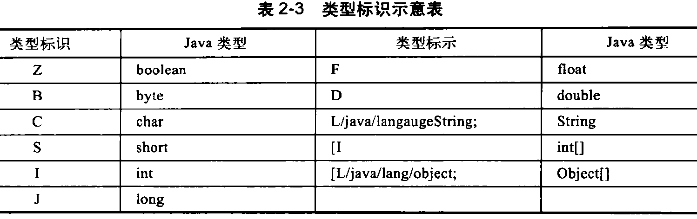
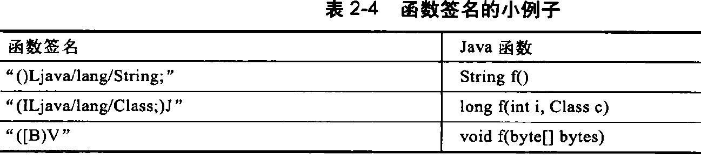
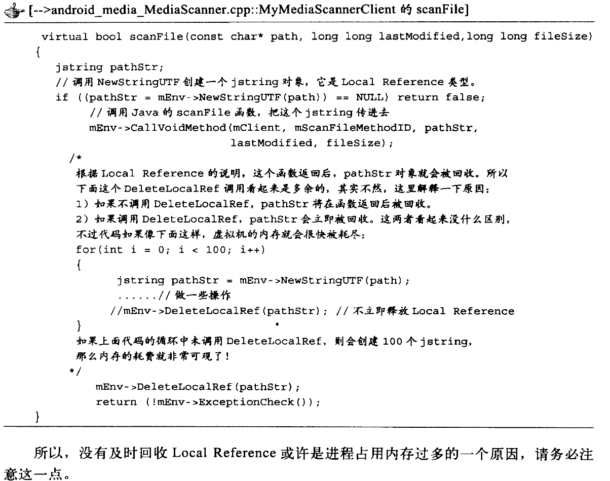

# JNI

JNI的常用方法的中文API:https://www.jianshu.com/p/67081d9b0a9c

## 1. java层

jni层基本的命名规则：

- jni库的名字可以随便取的，不过android平台上基本都采用的是**lib模块名_jni.so**的命名方式
- native层对应的是**lib模块名.so**
- MediaScancer将通过jni库libmedia_jni.so和native层的libmedia.so交互
- jni层必须实现为动态库的形式，这样java虚拟机才能加载它并进行调用

### 1.1 加载jni库

```java
static {
        System.loadLibrary("hello-jni");
    }   
```

在什么时候以及在什么地方加载这个库呢？

原则上是：**在调用native函数前，任何时候、任何地方加载都可以**,所加载的名字是：当库叫libhello-jni.so时，加载的时候名字写hello-jni即可，在linux中会自动找libhello-jni.so在windows中会找libhello-jni.dll文件。

要点：

1. 加载jni库
2. 声明关键字native修饰的函数

学习的案例：

```shell
FireNow-Nougat$ grep -inR "system.loadlibrary("media_jni" --include=*.java

frameworks/base/media/java/android/media/MediaScanner.java:122:        System.loadLibrary("media_jni");
```

```java
public class MediaScanner implements AutoCloseable {
    static {
        System.loadLibrary("media_jni");
        native_init();                                                                                                                                        
    }
   

	private native void processDirectory(String path, MediaScannerClient client);
    private native void processFile(String path, String mimeType, MediaScannerClient client);                                                                 
    private native void setLocale(String locale);

    public native byte[] extractAlbumArt(FileDescriptor fd); 

    private static native final void native_init();
    private native final void native_setup();
    private native final void native_finalize();
    
}
```

## 2.jni层

```shell
colby@colby-myntai:~/androidos/bottom_layer_work/FireNow-Nougat$ find -name Android.mk -exec grep -l media_jni {} \;
./frameworks/base/media/jni/Android.mk
```

```makefile
LOCAL_PATH:= $(call my-dir)
include $(CLEAR_VARS)

LOCAL_SRC_FILES:= \
    android_media_MediaDrm.cpp \
    android_media_MediaExtractor.cpp \

LOCAL_SHARED_LIBRARIES := \
    libnativehelper \
    libutils \
    libbinder \

LOCAL_STATIC_LIBRARIES := \
    libstagefright_amrnbenc

LOCAL_C_INCLUDES += \
    $(call include-path-for, libhardware)/hardware \
    $(PV_INCLUDES) \
    $(JNI_H_INCLUDE)

LOCAL_CFLAGS += -Wall -Werror -Wno-error=deprecated-declarations -Wunused -Wunreachable-code

LOCAL_MODULE:= libmedia_jni

ifeq ($(strip $(TARGET_BOARD_PLATFORM_PRODUCT)),box)
	LOCAL_CFLAGS += -DBOX
endif

include $(BUILD_SHARED_LIBRARY)
include $(call all-makefiles-under,$(LOCAL_PATH))
```

vim android_media_MediaScanner.cpp

```c
static const JNINativeMethod gMethods[] = {
    {
        "processDirectory",
        "(Ljava/lang/String;Landroid/media/MediaScannerClient;)V",
        (void *)android_media_MediaScanner_processDirectory
    },

    {
        "processFile",
        "(Ljava/lang/String;Ljava/lang/String;Landroid/media/MediaScannerClient;)V",
        (void *)android_media_MediaScanner_processFile
    },

    {
        "setLocale",
        "(Ljava/lang/String;)V",
        (void *)android_media_MediaScanner_setLocale
    },  

    {   
        "extractAlbumArt",
        "(Ljava/io/FileDescriptor;)[B",
        (void *)android_media_MediaScanner_extractAlbumArt
    },  
                                                                                                                                                              
    {   
        "native_init",
        "()V",
        (void *)android_media_MediaScanner_native_init
    }, 
    
    {
        "native_setup",
        "()V",
        (void *)android_media_MediaScanner_native_setup
    },

    {
        "native_finalize",
        "()V",
        (void *)android_media_MediaScanner_native_finalize
    },
};


int register_android_media_MediaScanner(JNIEnv *env)
{
    return AndroidRuntime::registerNativeMethods(env,
                kClassMediaScanner, gMethods, NELEM(gMethods));
}                          
```

FireNow-Nougat/frameworks/base/media/jni$ vim android_media_MediaPlayer.cpp

```c
jint JNI_OnLoad(JavaVM* vm, void* /* reserved */)
{
	if (register_android_media_MediaScanner(env) < 0) {                                                                                                       
        ALOGE("ERROR: MediaScanner native registration failed\n");
        goto bail;
    }
    
}

```

### 2.1 注册jni函数

注册：就是将java层的native函数和jni层对应的实现函数关联起来，有了这种关联，调用java层的native函数时，就能顺利转到jni层对应的函数执行了。

#### 2.1.1 静态注册

步骤：

1. 先编写java代码，然后编译生成.class文件
2. 使用java的工具程序 javah, 如  javah -o output pachagename.classname,这样它就会产生一个叫output.h的jni层头文件，其中packagename.classname 是java代码编译后的class文件，而生成的output.h文件里，声明了对应的jni层函数，只要实现里面的函数即可。

```java
package com.example.hellojni;

public class HelloJni
{
    public static void main(String[] args) {
    }

    public native String  stringFromJNI();

    public native String  unimplementedStringFromJNI();

    static {
        System.loadLibrary("hello-jni");
    }
}
```

```shell
# -d ./ 会在当前目录下生成 package com.example.hellojni;所对应的目录
cbx-study/java/jni/00.hello/java$ javac -d ./ HelloJni.java 
cbx-study/java/jni/00.hello/java$ tree
.
├── com
│   └── example
│       └── hellojni
│           └── HelloJni.class
└── HelloJni.java

cbx-study/java/jni/00.hello/java$ javah -o output.h com.example.hellojni.HelloJni
cbx-study/java/jni/00.hello/java$ tree
.
├── com
│   └── example
│       └── hellojni
│           └── HelloJni.class
├── HelloJni.java
└── output.h

3 directories, 3 files
```

```h
/* DO NOT EDIT THIS FILE - it is machine generated */
#include <jni.h>
/* Header for class com_example_hellojni_HelloJni */

#ifndef _Included_com_example_hellojni_HelloJni
#define _Included_com_example_hellojni_HelloJni
#ifdef __cplusplus
extern "C" {
#endif
/*
 * Class:     com_example_hellojni_HelloJni
 * Method:    stringFromJNI
 * Signature: ()Ljava/lang/String;
 */
JNIEXPORT jstring JNICALL Java_com_example_hellojni_HelloJni_stringFromJNI
  (JNIEnv *, jobject);

/*
 * Class:     com_example_hellojni_HelloJni
 * Method:    unimplementedStringFromJNI
 * Signature: ()Ljava/lang/String;
 */
JNIEXPORT jstring JNICALL Java_com_example_hellojni_HelloJni_unimplementedStringFromJNI
  (JNIEnv *, jobject);

#ifdef __cplusplus
}
#endif
#endif

```

用这种方法：会影响运行效率

#### 2.1.2 动态注册

```c
typedef struct {
    const char* name;/*java中对应的函数名*/
    const char* signature;/*函数签名*/
    void*       fnPtr;/*c函数指针*/
} JNINativeMethod;  
```

使用例子：

```c
static const JNINativeMethod gMethods[] = {
    {
        "processDirectory",
        "(Ljava/lang/String;Landroid/media/MediaScannerClient;)V",
        (void *)android_media_MediaScanner_processDirectory
    },

    {
        "processFile",
        "(Ljava/lang/String;Ljava/lang/String;Landroid/media/MediaScannerClient;)V",
        (void *)android_media_MediaScanner_processFile
    },
};

```

注册：

```c
int register_android_media_MediaScanner(JNIEnv *env)/*该函数最终会在 JNI_Onload中调用*/
{
    return AndroidRuntime::registerNativeMethods(env,
                kClassMediaScanner, gMethods, NELEM(gMethods));
}             
```

源码追踪：

```shell
FireNow-Nougat$ find -name AndroidRuntime.cpp
./frameworks/base/core/jni/AndroidRuntime.cpp

```

```cpp
/*static*/ int AndroidRuntime::registerNativeMethods(JNIEnv* env, 
    const char* className, const JNINativeMethod* gMethods, int numMethods)                                                                                   
{
    return jniRegisterNativeMethods(env, className, gMethods, numMethods);
}

```

```c
extern "C" int jniRegisterNativeMethods(C_JNIEnv* env, const char* className,
    const JNINativeMethod* gMethods, int numMethods)
{
    JNIEnv* e = reinterpret_cast<JNIEnv*>(env);                                                                                                               

    ALOGV("Registering %s's %d native methods...", className, numMethods);

    scoped_local_ref<jclass> c(env, findClass(env, className));
    if (c.get() == NULL) {
        char* tmp;
        const char* msg;
        if (asprintf(&tmp,
                     "Native registration unable to find class '%s'; aborting...",
                     className) == -1) {
            // Allocation failed, print default warning.
            msg = "Native registration unable to find class; aborting...";
        } else {
            msg = tmp;
        }
        e->FatalError(msg);
    }   

    if ((*env)->RegisterNatives(e, c.get(), gMethods, numMethods) < 0) {
        char* tmp;
        const char* msg;
        if (asprintf(&tmp, "RegisterNatives failed for '%s'; aborting...", className) == -1) {
            // Allocation failed, print default warning.
            msg = "RegisterNatives failed; aborting...";
        } else {
            msg = tmp;
        }
        e->FatalError(msg);
    }   

    return 0;
}

```


**重点：**

**当java层通过System.loadLibrary()加载完JNI动态库后，紧接着会查找该库中的一个叫JNI_OnLoad的函数。**如果有，就调用它，而动态注册的工作就是在这个函数中完成的。

采取动态注册必须要实现JNI_Onload()函数，静态注册可以不用实现JNI_OnLoad()函数，**但是推荐在静态注册中也要去实现这个函数接口，一些初始化工作可以放在该函数中进行计算。**

## 3 手动搭建jni开发的环境

### 3.1 java code

HelloJni.java

```java

public class HelloJni
{
    public static void main(String[] args) {
        System.out.println(System.getProperty("java.library.path"));
        System.out.println("" + stringFromJNI());
    }

    public static native String  stringFromJNI();

    public static native String  unimplementedStringFromJNI();

    static {
        System.loadLibrary("hello-jni");
    }
}
```

### 3.2 编译生成.h

```shell
 2033  javac HelloJni.java #编译生成 HelloJni.class
 2034  ls
 2035  javah -o hellojni.h HelloJni #只有先生成HelloJni.class才能进一步编译生成 .h文件（因为我们这里走的是静态注册的过程，所以我们要编译生成.h，不生成.h也没关系，此时我们要收到去写C的函数名，很麻烦，所以我们这里采取编译的方式生成.h文件）
```

### 3.3 编写.c文件

```c
#include "hellojni.h"

JNIEXPORT jstring JNICALL Java_HelloJni_stringFromJNI
  (JNIEnv *env, jobject object){
      printf("jni-> stringFromJNI\n") ;

      return (*env)->NewStringUTF(env, "Hello from JNI !  Compiled with ABI ");
  }

JNIEXPORT jstring JNICALL Java_HelloJni_unimplementedStringFromJNI
  (JNIEnv *env, jobject object){
      printf("jni-> unimplementedStringFromJNI\n") ;

      return (*env)->NewStringUTF(env, "Hello from JNI !  Compiled with ABI ");
  }
```

### 3.4 生成.so

我们要将我们的.c文件编译生成动态库:    **lib模块名.so**   这里的模块名要和System.loadLibrary("hello-jni");保持一致。

```shell
java$ gcc -c hellojni.c -o hellojni.o
In file included from hellojni.c:1:0:
hellojni.h:2:17: fatal error: jni.h: 没有那个文件或目录
```

解决方法：

1. 在gcc中指定 jni.h的路径 https://blog.csdn.net/jiangda_0_0/article/details/74747218

   - 先找到jdk的路径，然后在找jni.h 

   ```shell
    gcc -fPIC -c -I /usr/lib/jvm/java-8-openjdk-amd64/include/linux/ -I /usr/lib/jvm/java-8-openjdk-amd64/include  hellojni.c -o hellojni.o
    
    gcc -shared -o libhello-jni.so hellojni.o #最终生成 libhello-jni.so成功
   ```

### 3.5 执行java

运行java文件：

```shell
cd "/home/colby/work300GB/cbx-study/java/jni/00.hello/java/" && javac HelloJni.java && java HelloJni
Exception in thread "main" java.lang.UnsatisfiedLinkError: no hello-jni in java.library.path
	at java.lang.ClassLoader.loadLibrary(ClassLoader.java:1867)
	at java.lang.Runtime.loadLibrary0(Runtime.java:870)
	at java.lang.System.loadLibrary(System.java:1122)
	at HelloJni.<clinit>(HelloJni.java:14)
```

问题：找不到我们的 libhello-jni.so库

分析：java 在找库的时候，没有找到，库的路径不对

解决方案：https://blog.csdn.net/daylight_1/article/details/70199452

1. 方案一：将我们的.so放到java能找到的目录中
2. 方案二：使用绝对路径 （使用全路径我这里没有跑通）

javaVM从下面的路径下找.so库：

必须在 java.library.path这一jvm变量所指向的路径中，可以通过如下方法获得该变量的值：

```
   System.getProperty("java.library.path");
```

/home/colby/catkin_ws/devel/lib:/opt/ros/kinetic/lib:/opt/ros/kinetic/lib/x86_64-linux-gnu:/usr/java/packages/lib/amd64:/usr/lib/x86_64-linux-gnu/jni:/lib/x86_64-linux-gnu:/usr/lib/x86_64-linux-gnu:/usr/lib/jni:/lib:/usr/lib

```shell
sudo cp libhello-jni.so /usr/lib/jni/

 cd "/home/colby/work300GB/cbx-study/java/jni/00.hello/java/" && javac HelloJni.java && java HelloJni

打印输出：
Hello from JNI !  Compiled with ABI 
jni-> stringFromJNI
```

整个过程如下Makefile:

```makefile
all:
	echo "编译"
	javac HelloJni.java
	javah -o hellojni.h HelloJni
	gcc -fPIC -c -I /usr/lib/jvm/java-8-openjdk-amd64/include/linux/ -I /usr/lib/jvm/java-8-openjdk-amd64/include  hellojni.c -o hellojni.o
	gcc -shared -o libhello-jni.so hellojni.o
	sudo cp libhello-jni.so /usr/lib/jni/
	echo "运行"
	java HelloJni
clean:
	sudo rm /usr/lib/jni/libhello-jni.so
	rm hellojni.h
	rm *.class *.o *.so
```

### 3.6 额外补充

查找jdk的安装路径：

先了解下ls命令：

```shell
-a 显示所有文件及目录 (ls内定将文件名或目录名称开头为"."的视为隐藏档，不会列出) 

-l 除文件名称外，亦将文件型态、权限、拥有者、文件大小等资讯详细列出 

-r 将文件以相反次序显示(原定依英文字母次序) 

-t 将文件依建立时间之先后次序列出 

-A 同 -a ，但不列出 "." (目前目录) 及 ".." (父目录) 

-F 在列出的文件名称后加一符号；例如可执行档则加 "*", 目录则加 "/" 

-R 若目录下有文件，则以下之文件亦皆依序列出
```

```shell
java$ whereis java
java: /usr/bin/java /usr/lib/java /usr/share/java /usr/share/man/man1/java.1.gz

java$ which java
/usr/bin/java

java$ ls -lrt /usr/bin/java
lrwxrwxrwx 1 root root 22 Sep 17  2018 /usr/bin/java -> /etc/alternatives/java

java$ ls -lrt /etc/alternatives/java
lrwxrwxrwx 1 root root 46 Sep 17  2018 /etc/alternatives/java -> /usr/lib/jvm/java-8-openjdk-amd64/jre/bin/java

colby@colby-myntai:~/work300GB/cbx-study/java/jni/00.hello/java$
```

## 4. 数据类型的转换

jni层的数据类型：

1. 基本数据类型
2. 引用数据类型

### 4.1 基本数据类型的转换



char在java中占两个字节，而在c中是一个字节

### 4.2 引用数据类型的转换



**jobject就好比是native层的void*类型** ,所以不管那种应用类型都是可以用jobject来表示的。

例子：

```c
static void
android_media_MediaScanner_processFile(JNIEnv *env, jobject thiz, jstring path,jstring mimeType, jobject client){

}
```

这里重点对第二个参数thiz进行说明：

- jobject thiz 代表的是java层的MediaScanner对象，它表示的是那个MediaScanner对象上调用的processFile.
- 如果java层中的processFile()函数是static,那么这个参数是jclass,表示的是在调用那个java class的静态函数

## 5. JNIEnv

JNIEnv是和线程相关的，**每个线程到达jni层后，都会产生一个JNIEnv对象**



**从图中我们可以得知，jni内部有一个函数表**

JNIEnv和线程相关：

- 线程A有一个JNIEnv，线程B有一个JNIEnv.**由于和线程相关，所以不能在线程Ｂ中使用A的JNIEnv结构体。**

- 从java层调用jni层时，对应的jni层的函数中都会有一个　JNIEnv,此时使用JNIEnv是没有错的

- 但是从jni层回调java层时：

  假如：当一个后台线程收到一个网络消息时，而又需要由native层函数主动回调java层函数时，JNIEnv从哪里获得呢？

  ​	由于我们的JNIEnv和线程相关，**我们不能通过保存另外一个线程的JNIEnv结构体，然后把它放到后台线程中来用。**

  ​	**基础储备：**

   	1. 在JNI_Onload()中，它的第一个参数就是JavaVM
   	2. javaVM是虚拟机在JNI层的代表
   	3. **一个进程只有一个虚拟机，所以可以保存，并且在任何一个地方使用都是没有问题的**
   	4. javaVM和JNIEnv的关系是：
        	1. 调用JavaVM的AttachCurrentThread()函数，就可得到这个线程的JNIEnv结构体。这样就可以在后台线程中回调java函数了
        	2. 另外在后台线程退出之前，需要调用javaVm的DetachCurrentThread()函数来释放对应的资源

### 5.1 JNIEnv操作jobject


如果我们每次操作jobject前都去查询jmethodID和jfieldID，那么将会影响程序运行的效率，所以我们在初始化的时候可以取出这些ID并保存起来供后续使用。


### 5.2 JNIEnv操作jstring

- 调用JNIEnv的NewString(),可以从Native的字符串中得到一个jstring对象。由于java　String存储的是Unicode字符串，所以NewString函数的参数也必须是Unicode字符串
- 调用JNIEnv的NewStringUTF将根据Native的一个UTF-8字符串得到一个jstring对象。在实际工作中这个用的比较多
- GetStringChars()和GetStringUTFChars(),他们可以将Java String对象转换成本地字符串。其中GetStringChars得到一个Unicode字符串，而GetStringUTFChars()得到一个UTF-8字符串
- 如果在代码中调用了上面的几个函数，在做完相关工作后，就都需要调用ReleaseStringChars函数或ReleaseStringUTFChars()函数来对应地释放资源，否则会导致JVM内存的泄露。

```c++
#if 1
    //转换的　方案一
    char* resultName = jstringToChar(env, fatherName);
    printf("%s\n", resultName);
#else
    //对java中的String 转换成　native字符串的　方案二
    char *resultName = env->GetStringUTFChars(fatherName, NULL) ;
    printf("%s\n", resultName);
    env->ReleaseStringUTFChars(fatherName, resultName) ;
#endif
```

```c++
// 由于jvm和c++对中文的编码不一样，因此需要转码。 utf8/16转换成gb2312
char* jstringToChar(JNIEnv* env, jstring jstr) {
    char* rtn = NULL;
    jclass clsstring = env->FindClass("java/lang/String");
    jstring strencode = env->NewStringUTF("UTF-8");
    jmethodID mid = env->GetMethodID(clsstring, "getBytes", "(Ljava/lang/String;)[B");
    jbyteArray barr = (jbyteArray) env->CallObjectMethod(jstr, mid, strencode);
    jsize alen = env->GetArrayLength(barr);
    jbyte* ba = env->GetByteArrayElements(barr, JNI_FALSE);
    if (alen > 0) {
        rtn = (char*) malloc(alen + 1);
        memcpy(rtn, ba, alen);
        rtn[alen] = 0;
    }
    env->ReleaseByteArrayElements(barr, ba, 0);
    return rtn;
}
```

## 6. 函数签名

为啥需要这个函数签名？

java支持函数重载，也就是说，可以定义同名但不同参数的函数，但仅仅根据函数的名字是没法找到具体的函数的。为了解决这个问题，JNI技术中就将参数类型和返回值类型组合成为了一个函数的签名，有了函数的签名信息和函数名，就能顺利地找到Java中的函数了。





如果java类型是数组，则标识中会有一个“[”，另外，引用类型（除基本类型的数组外）的标识最后都有一个";"



## 7.垃圾回收

```c++
static jobject call_java_job ;//c call java 时作为对象使用 定义一个全局的jobject

JNIEXPORT void JNICALL Java_JavaMain_triggerCAddTask(JNIEnv *env, jobject job, jint num)
{
    printf("c: 接受到java下发的任务　num = %d   job = %p\n", num, (void *)job) ;

    call_java_job = job ;//保存java层传入的jobject对象，代表JavaMain

    pthread_add_task(num) ;
}

//假设在某个时间上，有地方调用callJava()
void callJava(){
    //在这个函数中操作　call_java_job,会有问题？
}
```

自己做个测试，这样会使得JVM奔溃，因为和 call_java_job 对应的Java层中的　JavaMain很有可能已经被垃圾回收了。call_java_job保存的这个jobject可能是一个野指针。

**垃圾回收机制只会保证那些没有被引用的对象才会被清理。**但是在JNI层使用下面的语句，是不会增加引用计数的。

```java
call_java_job = job ;//保存java层传入的jobject对象，代表JavaMain
```

在JNI层并没有增加object在java层的引用，针对这种情况，JNI规范已经很好地解决了这个问题:JNI技术一共提供了三种类型的引用：

1. 本地引用：Local Reference:
2. 全局引用：Global Reference:
3. 弱全局引用：Weak Global Reference:

### 7.1 Local Reference

本地引用。在JNI层函数中使用的非全局引用对象都是Local Reference,它包括函数调用时传入的jobject和在JNI层函数中创建的jobject. **Local Reference 最大的特点就是，一旦JNI层函数返回，这些jobject就可能被垃圾回收。**




### 7.2 Global Reference 

全局引用，这种对象如不主动释放，它永远不会被垃圾回收


每当JNI层想要保存JAVA层中的某个对象时，就可以使用Global Reference，使用完之后，记住要释放它就可以了。


```c++

#include <stdio.h>
#include <stdlib.h>
#include <unistd.h>
#include "add_task.h"
#include <memory>
#include <string>
#include <pthread.h>
#include <sys/prctl.h>


static JavaVM *javaVm = NULL;
static jobject call_java_job ;//c call java 时作为对象使用
static int base_num;

static void pthread_add_task(int num) ;

static int add_task(int num) ;

static void call_java(int sum) ;

JNIEXPORT void JNICALL Java_JavaMain_triggerCAddTask(JNIEnv *env, jobject job, jint num)
{
    
    printf("c: 接受到java下发的任务　num = %d   job = %p\n", num, (void *)job) ;

#define GLOBAL_JOBJECT
#ifdef GLOBAL_JOBJECT
    call_java_job = env->NewGlobalRef(job) ;//保存为一个全局的引用 ，用完记得释放
#else
    call_java_job = job ;这里我们不应该直接这样保存，
#endif

    pthread_add_task(num) ;
}

static int add_task(int num)
{
    int i;
    int sum ;
    
    for(i = 0, sum = 0; i <= num ; i++)
    {
        sleep(1) ;
        sum += i ;
    }

    return sum ;
}

void *task_thr_fn(void *args)
{
    int num, sum ;
    pid_t pid;
    pthread_t tid;

    pid = getpid();
    tid = pthread_self();
    printf("pid %u tid %u (0x%x)\n",(unsigned int) pid,(unsigned int) tid, (unsigned int) tid);

    sleep(1);
    num = (int)(*((int*)args));
    printf("pthread: num = %d\n", num) ;

    sum = add_task(num) ;
    printf("jni: sum = %d\n", sum) ;
    
    call_java(sum) ;

    return NULL;
}

static void pthread_add_task(int num)
{
    int err;
    pthread_t task;
    base_num = num ;
    err = pthread_create(&task, NULL, task_thr_fn, &base_num);
    if (err != 0)
        printf("can't create thread: \n");

    //这里不要阻塞，这里一旦阻塞住，就没意义了
    // pthread_join(task,NULL);//主线程将等待　task_thr_fn处理完后才返回

    printf("main thread exit.\n") ;
    
}

/**
 * call_java(sum) 
 * 当任务结束时，回调　java的 cEndOfTask()
*/

static void call_java(int sum)
{
    JNIEnv* env;

    jint ret = sum ;
    JavaVMAttachArgs args;

    args.version = JNI_VERSION_1_6;
    args.group = NULL;

    printf("AttachCurrentThread...\n") ;
    //2. 获得本线程的JNIEnv
    if (javaVm->AttachCurrentThread(&env, NULL) != JNI_OK) {
        printf("Attach failed\n");
        return ;
    }

    // jclass clasz = env->GetObjectClass(call_java_job) ;//这个是获取不到clasz
    jclass clasz = env->FindClass("JavaMain") ;
    jmethodID method_id = env->GetMethodID( clasz, "cEndOfTask","(I)I") ;

   
#ifdef GLOBAL_JOBJECT
    jobject object = call_java_job;
#else
 /*
    * 这个是创建一个java层的对象，如果用之前Java_JavaMain_triggerCAddTask中保存的对象去，调用java层的对象，JVM会奔溃
    *
    * */
    jobject object = env->AllocObject(clasz) ;
#endif

    jint ret_r = env->CallIntMethod(object, method_id, sum) ;

    printf("ret = %d\n", ret_r) ;

#ifdef GLOBAL_JOBJECT
    env->DeleteLocalRef(call_java_job) ;//释放
#endif

    //3.释放这次JNIEnv
    if (javaVm->DetachCurrentThread() != JNI_OK) {
        printf("DetachCurrentThread failed\n");
    }

}

int JNI_OnLoad(JavaVM* vm, void* v) {
    //1. 保存全局的VM
    javaVm = vm;//一个进程只有一个，VM，将它保存下来，在c回传java的时候使用
    return JNI_VERSION_1_6;
}

```


### 7.3 Weak Global Reference

弱全局引用，一种特使的Global Reference,在运行过程中可能会被垃圾回收，所以在使用它之前，需要调用JNIEnv的IsSameObject()判断它是否被回收了。

## 8.JNI中的异常

JNI中也是有异常的，不过和c++和java的异常不太一样。如果调用JNIEnv的某些函数出错了，则会产生一个异常，**但这个异常不会中断本地函数的执行，直到从JNI层返回到JAVA层后，虚拟机才会抛出这个异常。**虽然在JNI层中产生的异常不会中断本地函数的运行，但一旦产生异常后，就只能做一些资源清理工作了（例如释放全局引用，或者ReleaseStringChars）。如果这时调用除了上面所说的函数之外的其他JNIEnv函数，则会导致程序死掉。

- ExceptionOccurred函数，用来判断是否发生异常
- ExceptionClear函数，用来清理当前JNI层中发生的异常
- ThrowNew函数，用来向Java层抛出异常

异常处理是JNI层代码必须关注的事情，读者在编写代码时务必要小心对待

```c++
int tagSocket(JNIEnv* env, int fd) {
    if (env->ExceptionOccurred()) { return fd; }//如果检测到异常，直接退出
    jmethodID get = env->GetStaticMethodID(JniConstants::socketTaggerClass,
                                           "get", "()Ldalvik/system/SocketTagger;");
    jobject socketTagger =
        env->CallStaticObjectMethod(JniConstants::socketTaggerClass, get);
    jmethodID tag = env->GetMethodID(JniConstants::socketTaggerClass,
                                     "tag", "(Ljava/io/FileDescriptor;)V");

    jobject fileDescriptor = jniCreateFileDescriptor(env, fd);
    env->CallVoidMethod(socketTagger, tag, fileDescriptor);
    return fd; 
}

```


```c++
// Temporarily clear any pending exception so we can clean up.
  jthrowable pending_exception = env_->ExceptionOccurred();//检测是否有异常发生
  if (pending_exception != NULL) {
    env_->ExceptionClear(); //清除异常                                                                                                                                  
  }

```

## 9.例子

