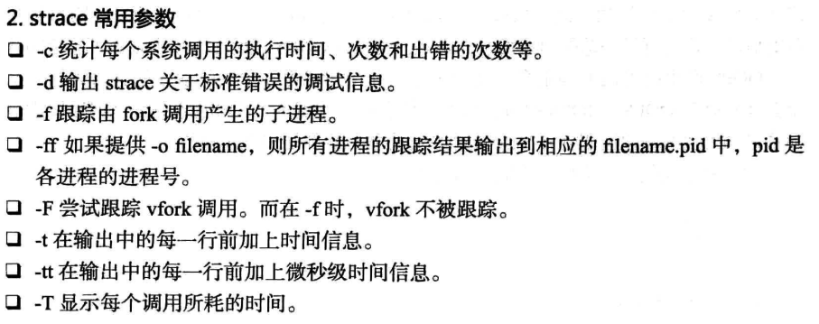
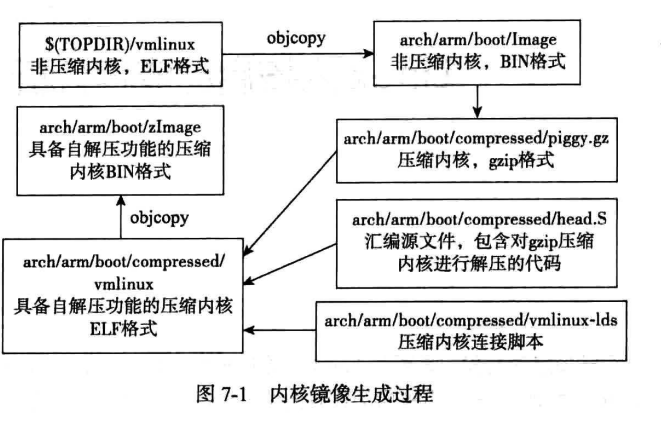

# linux内核移植

## 1.基础知识

标准的C库glibc提供了新的连接内核的接口，这些接口同样通过系统调用访问内核，不过通常都带有缓冲区，将数次操作合并为一次，以有效减少系统调用的次数。

Linux的层次结构：（从最上层说起）

1. 系统调用接口层
2. 和体系架构无关的内核，这部分内核对于linux支持的所有处理器是通用的
3. 和体系结构相关的部分，通常为BSP

内核的组件：

1. 系统调用接口SCI
2. 进程管理PM
3. 内存管理MM
4. 网络协议栈
5. 虚拟文件系统
6. 设备驱动
7. cpu体系结构相关


## 2. 配置内核

### 2.1 交叉编译设置

方案一：

```shell
make ARCH=arm CROSS_COMPILE=arm-linux-
```

方案二：

直接修改顶层的Makefile


### 2.2 加载默认配置项

内核中各个平台的配置项：

arch/<arch>/configs

```shell
FireNow-Nougat/kernel/arch/arm64/configs$ ls
firefly_defconfig
```

加载默认的配置命令：

```shell
make ARCH=arm64 firefly_defconfig
```

通常默认的配置并不能完全满足实际的需求，但有了一个和所有开发板比较接近的默认配置，在此基础上调整起来将会更加容易。加载默认配置后，可以使用如下命令对内核配置进行调整

```shell
make config # 加载.config作为默认配置，会用命令行一个一个询问
make oldconfig #和config功能类似，不过只询问在.config中未出现的新配置项
make menuconfig
```

## 3.编译

```shell
make zImage #编译内核
#编译生成的内核镜像是位于arch/<arch>/boot目录下的zImage


make modules #编译模块
```

make zImage生成的镜像不能直接由bootloader加载，还需要借助make uImage

```shell
make uImage
```

uImage是在zImage的基础之上添加了64个字节的uImage头部信息，需要借助工具mkimage来生成，从u-boot的tools目录中可以找到mkimage,将它复制到宿主机的/usr/sbin目录即可，生成的uImage和zImage在同一个目录下面

在编译x86内核时，如果最终内核镜像大于512KB,则需要使用如下命令：

```shell
make bzImage
```

大内核镜像同样会在arch/<arch>/boot目录下产生。

更新内核：

1. 在内核镜像生成后，对于x86宿主机本身内核的更新，可以使用

```shell
make install

make modules_install #安装内核模块
```

## 4. 内核的调试技术

### 4.1 BUG()和BUG_ON()

```c
#ifndef HAVE_ARCH_BUG
#define BUG() do { \
    printk("BUG: failure at %s:%d/%s()!\n", __FILE__, __LINE__, __func__); \
    panic("BUG!"); \
} while (0)
#endif

#ifndef HAVE_ARCH_BUG_ON
#define BUG_ON(condition) do { if (unlikely(condition)) BUG(); } while (0)                                                                                    
#endif

```

当调用BUG()时，内核通过调用panic()引发OOPS,导致函数调用栈的回溯和错误的打印消息的输出。

### 4.2 WARN()和WARN_ON()

```c
#ifndef WARN_ON
#define WARN_ON(condition) ({                       \
    int __ret_warn_on = !!(condition);              \
    if (unlikely(__ret_warn_on))                    \
        __WARN();                       \
    unlikely(__ret_warn_on);                    \
})
#endif                                                                                                                                                        

#ifndef WARN
#define WARN(condition, format...) ({                       \
    int __ret_warn_on = !!(condition);              \
    if (unlikely(__ret_warn_on))                    \
        __WARN_printf(format);                  \
    unlikely(__ret_warn_on);                    \
})
#endif

```

和BUG_ON()差不多，但逻辑上只是起到警告的作用（一般不会引起内核的挂起）

### 4.3 dump_stack()

有些时候，只是需要在终端上打印栈的回溯信息来帮助调试。这时可以使用dump_stack()函数。该函数只在终端上打印寄存器上下文和函数的跟踪线索。

### 4.4 printk()

printk()是内核提供的格式化打印函数，几乎可以在任何地方，任何时候都可以调用它（**中断上下文、进程上下文、持有锁、多处理器时等**）。

不能使用printk()进行打印的地方：

1. 在系统启动的过程中和终端初始化之前，就不能直接调用printk().

如果在终端还没有初始化之前使用的话：

- 通过底层调试接口，将调试信息输出到串口等输出设备中


#### 4.4.1 打印的等级

```c
#define KERN_EMERG  KERN_SOH "0"    /* system is unusable */
#define KERN_ALERT  KERN_SOH "1"    /* action must be taken immediately */
#define KERN_CRIT   KERN_SOH "2"    /* critical conditions */
#define KERN_ERR    KERN_SOH "3"    /* error conditions */
#define KERN_WARNING    KERN_SOH "4"    /* warning conditions */
#define KERN_NOTICE KERN_SOH "5"    /* normal but significant condition */
#define KERN_INFO   KERN_SOH "6"    /* informational */                                                                                                       
#define KERN_DEBUG  KERN_SOH "7"    /* debug-level messages */

```

修改内核的打印输出等级：

```shell
$ cat /proc/sys/kernel/printk
4	4	1	7
$ cat /proc/sys/kernel/printk_delay #表示printk消息之间延迟的毫秒数（用于提高某些场景下的可读性）。注意这里的值是0，它不可以通过/proc设置
0
$ cat /proc/sys/kernel/printk_devkmsg 
ratelimit
$ cat /proc/sys/kernel/printk_ratelimit
5
$ cat /proc/sys/kernel/printk_ratelimit_burst 
10
#每打印10次就会有5s不再向控制台输出


```


4     4    1   7:从左到右依次

1. 控制台的日志级别
2. 默认的消息日志级别：printk中不指定日志级别时
3. 最小控制台日志级别
4. 默认控制台日志级别

#### 4.4.2 日志缓冲区

```shell
kernel/printk/printk.c:285:#define __LOG_BUF_LEN (1 << CONFIG_LOG_BUF_SHIFT)
```

```makefile
arch/arm64/configs/firefly_defconfig:10:CONFIG_LOG_BUF_SHIFT=19
```

日志缓冲区具有如下特点：

1. 消息被读出到用户空间时，此消息就从环形队列中删除了
2. 当消息缓冲区满时，再有printk调用时，新的消息将覆盖队列中的老消息
3. 在读写环形队列时，同步问题很容易得到解决

#### 4.4.3 dmesg

dmesg 命令也可以用于打印和控制内核缓冲区。该命令使用klogctl系统调用来读取内核的环形缓冲区，并将它转发到标准输出stdout中。

- 该命令也可以用来清除内核缓冲区（使用-c选项） 
- -n 设置控制台日志输出级别
- -s 用于定义读取内核日志消息的缓冲区大小（注意，如果没有指定缓冲区大小，那么dmesg会使用klogctl的SYSLOG_ACTION_SIZE_BUFFER操作确定缓冲区大小）

注意事项：

1. 虽然printk()很健壮，但是函数的效率很低；复制字符时，一次只能复制一个字节，并在控制台输出还可能产生中断。所以驱动在功能调试完成以后，进行性能测试或者发布的时候，切记要尽量的减少printk()输出，而仅在出错时输出少量的信息。
2. printk()的临时缓存printk_buf只有1kb,所以printk()函数一次只能记录小于1kb的信息到日志缓冲区中，并且在使用时注意printk()使用的是环形缓冲区。

### 4.5 printk_ratelimit()

频繁的向控制台输出信息，可能将会造成CPU的拥堵，特别是对于慢速控制台（如串口）。为了限制输出的速率，内核提供了该函数

```c
if (printk_ratelimit())                                                                                                                               
            pr_warn("IRQ %04x for non-allocated DMA channel %d\n",
                status, ch); 

```


### 4.6 strace

**strace命令可以跟踪到一个进程产生的系统调用，包括参数、返回值、执行消耗的时间等。**,这些消息对于应用程序的开发者，甚至是内核开发者都是相当的有用。

```shell
$ strace cat /dev/null 
execve("/bin/cat", ["cat", "/dev/null"], [/* 82 vars */]) = 0
brk(NULL)                               = 0xc1c000
access("/etc/ld.so.nohwcap", F_OK)      = -1 ENOENT (No such file or directory)
access("/etc/ld.so.preload", R_OK)      = -1 ENOENT (No such file or directory)

```

等号左边为 系统调用的函数名 参数 ，右边的为 返回值




### 4.7 使用oops调试系统故障

oops也叫做panic消息包含系统错误的细节，如cpu寄存器的内容等，是内核告知用户有异常发生最常用的方式。内核发布oops过程包括向终端输出错误消息、输出寄存器保存的信息、输出可供跟踪的回溯线索。

通常，发送完oops之后，内核会处于不稳定的状态。

oops产生的可能原因很多，其中包括内存访问越界和非法的指令等。

oops中包含的重要信息：寄存器上下文和回溯线索，对所有体系结构的机器都是完全相同的。


需要注意的是,要使内核打印出可以看到函数名的调用钱,就必须打开内核配置选项“ CONFIG_KALLSYMS ”,
否则只能看到一个表示函数标号的十六进制地址列表。 “ CONFIG KALLSYMS ”在配置菜单
中的位置如下:
-> General setup
-> Configure standard kernel features (for small systems)


```shell
 Symbol: KALLSYMS [=y]                                                                                                                                 │  
  │ Type  : boolean                                                                                                                                       │  
  │ Prompt: Load all symbols for debugging/ksymoops                                                                                                       │  
  │   Location:                                                                                                                                           │  
  │     -> General setup                                                                                                                                  │  
  │ (1)   -> Configure standard kernel features (expert users) (EXPERT [=y])       
```

## 5. 内核镜像的产生过程



```shell
make Image
```

1. 内核的各个模块经过编译、链接，在内核源代码的顶层目录下产生vmlinux文件，该文件是一个elf格式的镜像
2. 用arm-linux-objcopy 命令把vmlinux转换为二进制格式的镜像arch/arm64/boot/Image（无压缩镜像）

```shell
make zImage
```

接着后续步骤完成


## 6.内核的启动流程

1. 首先生成的是 vmlinux

- 查询顶层的Makefile

```makefile
vmlinux: scripts/link-vmlinux.sh $(vmlinux-deps) FORCE
```

分析：

scripts/link-vmlinux.sh 里面包含的是一些sh函数

```makefile
vmlinux-deps := $(KBUILD_LDS) $(KBUILD_VMLINUX_INIT) $(KBUILD_VMLINUX_MAIN)

export KBUILD_LDS          := arch/$(SRCARCH)/kernel/vmlinux.lds
export KBUILD_VMLINUX_INIT := $(head-y) $(init-y)
export KBUILD_VMLINUX_MAIN := $(core-y) $(libs-y) $(drivers-y) $(net-y) $(virt-y)
```

在进一步的分析vmlinux.lds


### 6.1 分析内核

顶层目录下的makefile

```makefile
ARCH        ?= arm64
ARCH        ?= $(SUBARCH)
ifeq ($(ARCH),arm64)
ifneq ($(wildcard $(srctree)/../prebuilts/gcc/linux-x86/aarch64/aarch64-linux-android-4.9),)                                                                  
CROSS_COMPILE   ?= $(srctree)/../prebuilts/gcc/linux-x86/aarch64/aarch64-linux-android-4.9/bin/aarch64-linux-android-
endif
endif

```


 Linux启动，会启动内核编译后的文件vmlinux

 vmlinux是一个ELF文件，按照./arch/arm64/kernel/vmlinux.lds设定的规则进行链接的

 ./arch/arm64/kernel/vmlinux.lds 是 ./arch/arm64/kernel/vmlinux.lds.S编译之后生成的

查看内核的入口地址：

```shell
FireNow-Nougat/kernel$ readelf -a vmlinux | less
```

```shell
ELF 头：
  Magic：   7f 45 4c 46 02 01 01 00 00 00 00 00 00 00 00 00 
  类别:                              ELF64
  数据:                              2 补码，小端序 (little endian)
  版本:                              1 (current)
  OS/ABI:                            UNIX - System V
  ABI 版本:                          0
  类型:                              EXEC (可执行文件)
  系统架构:                          AArch64
  版本:                              0x1
  入口点地址：               0xffffff8008080000
  程序头起点：          64 (bytes into file)
  Start of section headers:          208164952 (bytes into file)
  标志：             0x0
  本头的大小：       64 (字节)
  程序头大小：       56 (字节)
  Number of program headers:         3
  节头大小：         64 (字节)
  节头数量：         38
  字符串表索引节头： 35

```

其中我们发现我们的入口地址是：入口点地址：               0xffffff8008080000


 这个地址是怎么来的，对应内核代码中的哪个代码呢？最简单的方法是反汇编

 对vmlinux反汇编的命令为：objdump -dxh vmlinux > vmlinux.s

 在查找地址0xfffffe0000080000：grep fffffe0000080000 vmlinux.s

添加环境变量

```shell
PATH=$PATH:/home/colby/androidos/bottom_layer_work/FireNow-Nougat/prebuilts/gcc/linux-x86/aarch64/aarch64-linux-android-4.9/bin                               
export PATH
~/.bashrc [+]                                                                                                                               143,127       底端
:set nonu

```

#### 6.1.1 objdump 反汇编 vmlinux

从编译终端界面查找 CROSS_COMPILE=aarch64-linux-android- 交叉编译工具的版本

从android顶层/prebuilts/gcc/linux-x86/aarch64/aarch64-linux-android-4.9/bin查找aarch64-linux-android-objdump

输入命令sudo ./aarch64-linux-android-objdump，切忌./ 一定要有，代表当前目录的aarch64-linux-android-objdump，否则出现command not found。

1.确保vmlinux中包含debug信息。主要由编译设置gcc   -g
​    使成生的vmlinux中含有debug信息

3.  sudo ./aarch64-linux-android-objdump -h vmlinux   > vmlinux.txt
    显示  linux 内核段信息，如段的开始虚拟地址，段的长度
4.  sudo ./aarch64-linux-android-objdump -S -l -z vmlinux > vmlinux.txt
     反汇编  vmlinux  到vmlinux.txt， vmlinux.txt  含有汇编和  c 源文件的混合代码，看起来很方
     便。而且能一步步看linux怎么一步步运行的。
5.  sudo ./aarch64-linux-android-objdump -S -l -z  -j xxxx(section name)  vmlinux  > vmlinux.txt
    反汇编  linux 内核段 xxxx  到文件  vmlinux.txt  中。
6.   sudo ./aarch64-linux-android-objdump -x vmlinux > x.txt
     vmliux中所有段的头信息，其中包口vmlinux的入口地址等
7.   sudo ./aarch64-linux-android-objdump --debugging vmlinux > debugging.txt
     很多有用的debug信息，如函数名，结构体定义等
---------------------


反汇编

```shell
FireNow-Nougat/kernel$ aarch64-linux-android-objdump -dxh vmlinux > vmlinux.s
```

查看vmlinux.s

```shell
Sections:
Idx Name          Size      VMA               LMA               File off  Algn
  0 .head.text    00000040  ffffff8008080000  ffffff8008080000  00010000  2**0

```

发现我们内核的起始段是 ： .head.text


```shell
0000000000000000 l    df *ABS*  0000000000000000 arch/arm64/kernel/head.o
ffffff8008080000 l       .head.text     0000000000000000 _head
# 对应的是 arch/arm64/kernel/head.o(s)文件中的  _head
```

```shell
FireNow-Nougat$ grep -inR " __HEAD" --include=*.h
kernel/include/linux/init.h:103:#define __HEAD		.section	".head.text","ax"
```

其实，总结一句话，就是在head.S中，紧挨着_HEAD下面的就是第一条执行的指令

head.S

```asm
    __HEAD                                                                                                                                                    
_head:
    /*
     * DO NOT MODIFY. Image header expected by Linux boot-loaders.
     */
#ifdef CONFIG_EFI
    /*
     * This add instruction has no meaningful effect except that
     * its opcode forms the magic "MZ" signature required by UEFI.
     */
    add x13, x18, #0x16
    b   stext  #所以，加载vmlinux后，第一个就开始执行stext
#else
    b   stext               // branch to kernel start, magic
    .long   0               // reserved
#endif


ENTRY(stext)                                                                                                                                                  
    bl  preserve_boot_args
    bl  el2_setup           // Drop to EL1, w20=cpu_boot_mode
    adrp    x24, __PHYS_OFFSET
    and x23, x24, MIN_KIMG_ALIGN - 1    // KASLR offset, defaults to 0
    bl  set_cpu_boot_mode_flag
    bl  __create_page_tables        // x25=TTBR0, x26=TTBR1
    /*
     * The following calls CPU setup code, see arch/arm64/mm/proc.S for
     * details.
     * On return, the CPU will be ready for the MMU to be turned on and
     * the TCR will have been set.
     */
    bl  __cpu_setup         // initialise processor
    adr_l   x27, __primary_switch       // address to jump to after
                        // MMU has been enabled
    b   __enable_mmu
ENDPROC(stext)


```

查看连接原理：FireNow-Nougat/kernel/arch/arm64/kernel$ vim vmlinux.lds.S 

整个镜像是由 vmlinux.lds链接的：但是它是由  vmlinux.lds.S 产生的。

```assembly
SECTIONS
{
   
    /DISCARD/ : { 
        ARM_EXIT_DISCARD(EXIT_TEXT)
        ARM_EXIT_DISCARD(EXIT_DATA)
        EXIT_CALL
        *(.discard)
        *(.discard.*)
        *(.interp .dynamic)
        *(.dynsym .dynstr .hash)
    }   

    . = KIMAGE_VADDR + TEXT_OFFSET;

    .head.text : { 
        _text = .;
        HEAD_TEXT
    }
    ...
}
```


```shell
FireNow-Nougat/kernel$ vim arch/arm64/Makefile +66
TEXT_OFFSET := 0x00080000

```

https://blog.csdn.net/xiaohua0877/article/details/78615776

参照上面的解释


arm-none-eabi-objdump -Dz -S vmlinux >linux.dump**

值得注意的是，arm-none-eabi-objdump的参数-S表示尽可能的把原来的代码和反汇编出来的代码一起呈现出来，-S参数需要结合   arm-linux-gcc编译参数-g，才能达到反汇编时同时输出原来的代码。所以，我在linux内核代码根目录的Makefile中增加-g编译参  数：

```makefile
KBUILD_CFLAGS   := -g -Wall -Wundef -Wstrict-prototypes -Wno-trigraphs \                                                                                      
           -fno-strict-aliasing -fno-common \
           -Werror-implicit-function-declaration \
           -Wno-format-security \
           -std=gnu89 $(call cc-option,-fno-PIE)

```

重新编译内核：

```shell
make -j8 ARCH=arm64 rk3399-firefly.img
```


