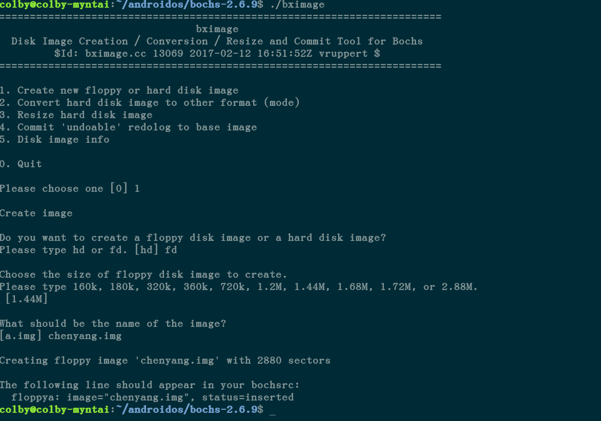
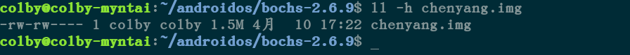
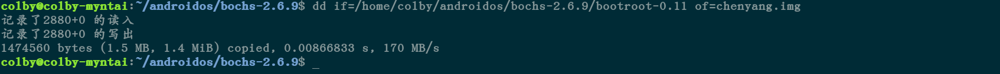
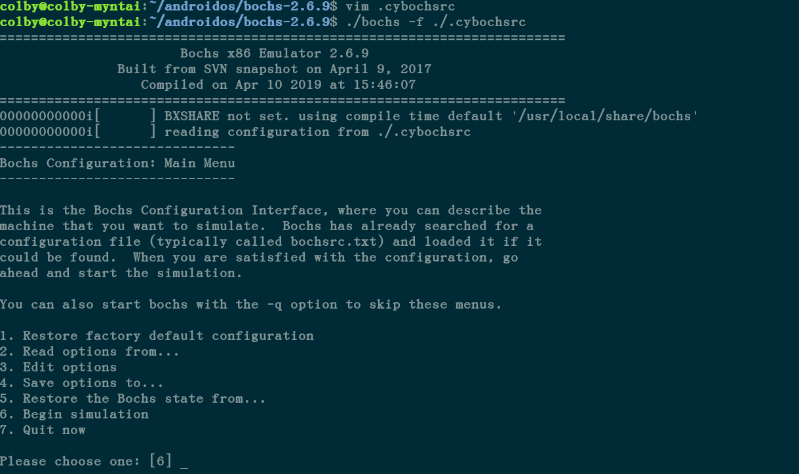
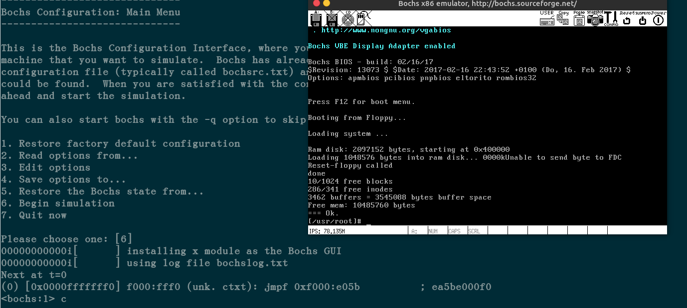
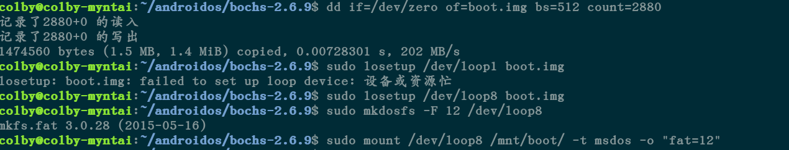

# bochs2.6.9 安装和配置

## 1.参照资料

https://blog.csdn.net/chprain/article/details/79328673

https://www.jianshu.com/p/db3a62564b47

https://www.cnblogs.com/y724107196/p/4019586.html

https://blog.csdn.net/m0_37946085/article/details/82920664

https://blog.csdn.net/xiaoyi39/article/details/81094747

## 2. 下载并安装

### 2.1 准备

*Bochs 需要在 X11 环境下运行，因此你的 Linux 系统必须已经安装了X Window 系统才能使用Bochs。*

*因为 Bochs 是用C++写的，所以这里要安装GNU gcc/g++编译器。*
 *安装命令如下：*

```
sudo apt-get install build-essential 
sudo apt-get install g++ 
```

### 2.2 具体安装步骤:

1.先去[https://sourceforge.net/projects/bochs/files/](https://link.jianshu.com?t=https://sourceforge.net/projects/bochs/files/)
 下载 bochs-2.6.9.tar.gz

https://sourceforge.net/projects/bochs/files/bochs/2.6.9/

2.解压下载的源代码：

```
sudo tar zxvf bochs-2.6.9.tar.gz
```

3.进入bochs-2.6.9目录，运行configure脚本，它会测试你的机器，C/C++编译器以及一些库，用来判断何种配置适合于你的机器。运行：

```
sudo ./configure --enable-debugger --enable-disasm
```

（这两个是用来开启调试和反汇编功能）

4.第3步正确运行后，会产生一个Makefile文件，然后：

```
sudo make 
```

5.安装：

```
sudo make install 
```

至此，bochs安装已经结束。

------

### 2.3 编译安装过程中可能遇到的错误：

错误1：

> checking for default gui on this platform... x11
>
> ERROR: X windows gui was selected, but X windows libraries were not
>  found.

解决办法1：

```
sudo apt-get install xorg-dev  
```

错误2：

> ERROR: pkg-config was not found, or unable to access the gtk+-2.0
>  package.

解决办法2：

```
sudo apt-get install libgtk2.0-dev  
```

错误3：

> symbols: DSO missing  from command line collect2: error: ld returned 1 exit status

解决方法3：

在Makefile的LIBS中添加如下内容 ：

```
-lz -lrt -lm -lpthread 
```

------

成功安装完成后能在命令行终端中输入 bochs 看到 bochs ：


安装完成后

------

## 3. 运行简单的Linux

先制作软盘

编译以后的 bochs2.6.9 文件夹下会有一个 bximage 可执行文件,在终端运行：

按步骤先做一个软盘：

制作软盘






然后写入一个系统镜像,镜像文件可以去下载

[http://www.oldlinux.org/Linux.old/images/bootroot-0.11](https://link.jianshu.com?t=http://www.oldlinux.org/Linux.old/images/bootroot-0.11)

这个是linux0.11的镜像文件

然后在终端执行命令把镜像写入我们制作的软盘:

```
dd if=/home/jack/Downloads/bootroot-0.11 of=a.img 
```

if 是下载的镜像所在的位置 ，of 是你软盘所在的路径。

写入镜像




接下来是处理配置文件:
 通过 *ls - a* 能看到原始的 .bochsrc 来参考，不过是全英文的（_!!一点都不友善）。

新建一个配置文件：

.cybochsrc 配置文件

```shell
memory: guest=256,host=128
romimage: file=/usr/local/share/bochs/BIOS-bochs-latest
floppya: 1_44=chenyang.img, status=inserted
ata0: enabled=1,ioaddr1=0x1f0, ioaddr2=0x3f0,irq=14
boot: floppy
log: bochslog.txt
mouse: enabled=0
```

要能在 Bochs 中运行一个操作系统，至少需要以下一些资源或信息：

- Bochs执行文件

- BIOS映像文件（通常称为BIOS-bochs-latest）

- VGA BIOS映像文件（例如VGABIOS-lgpl-latest）

- 至少一个引导启动磁盘映像文件（软盘，硬盘或CDROM的映像文件）
   我的配置如下:


  配置

在命令行终端输入：

```
./bochs -f ./.cybochsrc
```

记得自己改文件位置，不要复制粘帖。

然后会出现运行界面



按完6回车 会出现

快成功

虽然是黑屏，当你在命令行终端输入c回车后，世界还是很美好的。

成功



## 4. 运行简单汇编

```assembly
org 0x7c00 ;汇编地址从0x7c00开始
;我们知道BIOS固件(BIOS ROM)会把我们的程序加载到0x7c00物理地址处开始执行.

mov ax,0xb800  ;显存段地址
mov ds,ax

xor bx,bx
mov byte [bx],'h'  ;字符
inc bx
mov byte [bx],2   ;字符属性
inc bx
mov byte [bx],'e'  ;字符
inc bx
mov byte [bx],2   ;字符属性
inc bx
mov byte [bx],'l'  ;字符
inc bx
mov byte [bx],2   ;字符属性
inc bx
mov byte [bx],'l'  ;字符
inc bx
mov byte [bx],2   ;字符属性
inc bx
mov byte [bx],'o'  ;字符
inc bx
mov byte [bx],2   ;字符属性
inc bx
mov byte [bx],','  ;字符
inc bx
mov byte [bx],2   ;字符属性
inc bx

mov byte [bx],'w'  ;字符
inc bx
mov byte [bx],2   ;字符属性
inc bx
mov byte [bx],'o'  ;字符
inc bx
mov byte [bx],2   ;字符属性
inc bx
mov byte [bx],'r'  ;字符
inc bx
mov byte [bx],2   ;字符属性
inc bx
mov byte [bx],'d'  ;字符
inc bx
mov byte [bx],2   ;字符属性
; $当前汇编地址
jmp $

; $$ 开始汇编地址 ,为了确保512字节对齐
; 因为我们要写入主引导扇区才能运行
;主引导扇区最后两个字符为0x55,0xaa
;times 重复多少次 比如:times 10 db 1 ;重复10次 db 1
times  510-($-$$) db 0
db 0x55,0xaa

```


## 5. 运行自己写的os

格式话fat12



```shell
sudo mount -t vfat -o loop boot.img /mnt/boot/
```


https://www.cnblogs.com/pacoson/p/4816614.html

https://blog.csdn.net/czg13548930186/article/details/78608034


```shell
 2099  dd if=/dev/zero of=boot.img bs=512 count=2880
 2102  sudo losetup /dev/loop9 boot.img
 2103  sudo mkdosfs -F 12 /dev/loop9
 2104  dd if=../OS-Physical-Platform/LegacyBootLoader/boot.bin of=boot.img bs=512 count=1 conv=notrunc
 2106  sudo mount /dev/loop9 /mnt/boot/ -t msdos -o "fat=12"
 2109  bochs -f .osbochsrc

```

