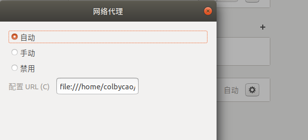

# ubuntu18.04解决翻墙问题

参考url:

https://ywnz.com/linuxjc/2687.html


以下是我在 Ubuntu18.04 中配置 shadowsocks（ss）和 privoxy 的全过程，这样就可以试试利用官方源同步最新代码，因为要是想把 android 系统源码同步下来直接用官方源是无法同步成功的，但是可以考虑使用清华大学的源。

## 1. 前期准备软件的安装

```shell
  134  sudo apt install python-pip
  135  sudo pip install shadowsocks
  
```

## 2. 配置文件

```shell
136  sudo gedit /etc/shadowsocks.json
```

```json
{
	"server": "rb3.gejw.cn",
	"server_port": 443,
	"password": "slightech",
	"local_port":1080,
	"timeout":600,
	"localPort": 1080,
	"shareOverLan": false,
	"method": "rc4-md5",
	"remarks": "slightech"
}
```

## 3. 启动shadowsocks

```shell
sudo sslocal -c /etc/shadowsocks.json -d  start
```

 	然后并不是一路顺利，在这里报错了

 	

 	这个问题是由于在openssl1.1.0版本中，废弃了EVP_CIPHER_CTX_cleanup函数，如官网中所说：

 	EVP_CIPHER_CTX was made opaque in OpenSSL 1.1.0. As a result,  EVP_CIPHER_CTX_reset() appeared and EVP_CIPHER_CTX_cleanup()  disappeared. 

 	EVP_CIPHER_CTX_init() remains as an alias for EVP_CIPHER_CTX_reset().

 	解决方法：

 	找到 /usr/local/lib/python2.7/dist-packages/shadowsocks/crypto/openssl.py 文件进行修改，

 	用vim 或 gedit 命令行都行：

 	此处以 shadowsocks-2.8.2的版本为例，其他版本自行在文件中搜索

 	1、将第52行

 	libcrypto.EVP_CIPHER_CTX_cleanup.argtypes = (c_void_p,)

 	改为

 	libcrypto.EVP_CIPHER_CTX_reset.argtypes = (c_void_p,)

 	2、将第111行

 	libcrypto.EVP_CIPHER_CTX_cleanup(self._ctx)

 	改为

 	libcrypto.EVP_CIPHER_CTX_reset(self._ctx)

 	修改完之后保存退出即可,然后再次执行：

 	$ sudo sslocal -c /etc/shadowsocks.json -d -start

 	这次应该就能启动成功了！

 	

 	至此，shadowssocks 已经配置完成，但还没完哦，接着往下看：配置系统全局代理。

```shell

  139  sudo cp /usr/local/lib/python2.7/dist-packages/shadowsocks/crypto/openssl.py /usr/local/lib/python2.7/dist-packages/shadowsocks/crypto/openssl.py_cbx
  140  sudo vim /usr/local/lib/python2.7/dist-packages/shadowsocks/crypto/openssl.py

  145  sudo sslocal -c /etc/shadowsocks.json -d  start
```

## 4. 安装 genPac

```shell
  146  sudo pip install genpac
  147  sudo pip install --upgrade genpac
```

## 5. 下载gfwlist

```shell
150  genpac --pac-proxy "SOCKS5 127.0.0.1:1080" --gfwlist-proxy="SOCKS5 127.0.0.1:1080" --gfwlist-url=https://raw.githubusercontent.com/gfwlist/gfwlist/master/gfwlist.txt --output="autoproxy.pac"
```

## 6. 配置系统

 	找到下载下来的 autoproxy.pac文件，然后进入：设置—网络—网络代理，选择自动，URL 指向该文件路径即可，url 格式为：

 	file:///home/{user}/autoproxy.pac

 	({user}替换成自己的用户)



## 7. 配置火狐浏览器

此处以火狐为例：首选项——网络代理—— 设置，选择 “使用系统代理设置” 即可


## 8. 配置开机自动打开翻墙

```shell
sudo chmod 755 /etc/rc.local 
```

rc.local

```shell
#!/bin/bash
sslocal -c /etc/shadowsocks.json -d  start
exit 0
```

备注:这个文件是自己添加的，添加完一定要 赋予对应的权限，不然这个自动开机脚本还是不能执行。

参考：https://blog.csdn.net/zhengchaooo/article/details/80202599

## 9. 备注文件

对关键文件备注 sudo gedit /usr/local/lib/python2.7/dist-packages/shadowsocks/crypto/openssl.py

```py
#!/usr/bin/env python
#
# Copyright 2015 clowwindy
#
# Licensed under the Apache License, Version 2.0 (the "License"); you may
# not use this file except in compliance with the License. You may obtain
# a copy of the License at
#
#     http://www.apache.org/licenses/LICENSE-2.0
#
# Unless required by applicable law or agreed to in writing, software
# distributed under the License is distributed on an "AS IS" BASIS, WITHOUT
# WARRANTIES OR CONDITIONS OF ANY KIND, either express or implied. See the
# License for the specific language governing permissions and limitations
# under the License.

from __future__ import absolute_import, division, print_function, \
    with_statement

from ctypes import c_char_p, c_int, c_long, byref,\
    create_string_buffer, c_void_p

from shadowsocks import common
from shadowsocks.crypto import util

__all__ = ['ciphers']

libcrypto = None
loaded = False

buf_size = 2048


def load_openssl():
    global loaded, libcrypto, buf

    libcrypto = util.find_library(('crypto', 'eay32'),
                                  'EVP_get_cipherbyname',
                                  'libcrypto')
    if libcrypto is None:
        raise Exception('libcrypto(OpenSSL) not found')

    libcrypto.EVP_get_cipherbyname.restype = c_void_p
    libcrypto.EVP_CIPHER_CTX_new.restype = c_void_p

    libcrypto.EVP_CipherInit_ex.argtypes = (c_void_p, c_void_p, c_char_p,
                                            c_char_p, c_char_p, c_int)

    libcrypto.EVP_CipherUpdate.argtypes = (c_void_p, c_void_p, c_void_p,
                                           c_char_p, c_int)

    #libcrypto.EVP_CIPHER_CTX_cleanup.argtypes = (c_void_p,)
    libcrypto.EVP_CIPHER_CTX_reset.argtypes = (c_void_p,)
    libcrypto.EVP_CIPHER_CTX_free.argtypes = (c_void_p,)
    if hasattr(libcrypto, 'OpenSSL_add_all_ciphers'):
        libcrypto.OpenSSL_add_all_ciphers()

    buf = create_string_buffer(buf_size)
    loaded = True


def load_cipher(cipher_name):
    func_name = 'EVP_' + cipher_name.replace('-', '_')
    if bytes != str:
        func_name = str(func_name, 'utf-8')
    cipher = getattr(libcrypto, func_name, None)
    if cipher:
        cipher.restype = c_void_p
        return cipher()
    return None


class OpenSSLCrypto(object):
    def __init__(self, cipher_name, key, iv, op):
        self._ctx = None
        if not loaded:
            load_openssl()
        cipher_name = common.to_bytes(cipher_name)
        cipher = libcrypto.EVP_get_cipherbyname(cipher_name)
        if not cipher:
            cipher = load_cipher(cipher_name)
        if not cipher:
            raise Exception('cipher %s not found in libcrypto' % cipher_name)
        key_ptr = c_char_p(key)
        iv_ptr = c_char_p(iv)
        self._ctx = libcrypto.EVP_CIPHER_CTX_new()
        if not self._ctx:
            raise Exception('can not create cipher context')
        r = libcrypto.EVP_CipherInit_ex(self._ctx, cipher, None,
                                        key_ptr, iv_ptr, c_int(op))
        if not r:
            self.clean()
            raise Exception('can not initialize cipher context')

    def update(self, data):
        global buf_size, buf
        cipher_out_len = c_long(0)
        l = len(data)
        if buf_size < l:
            buf_size = l * 2
            buf = create_string_buffer(buf_size)
        libcrypto.EVP_CipherUpdate(self._ctx, byref(buf),
                                   byref(cipher_out_len), c_char_p(data), l)
        # buf is copied to a str object when we access buf.raw
        return buf.raw[:cipher_out_len.value]

    def __del__(self):
        self.clean()

    def clean(self):
        if self._ctx:
            #libcrypto.EVP_CIPHER_CTX_cleanup(self._ctx)
            libcrypto.EVP_CIPHER_CTX_reset(self._ctx)
            libcrypto.EVP_CIPHER_CTX_free(self._ctx)


ciphers = {
    'aes-128-cfb': (16, 16, OpenSSLCrypto),
    'aes-192-cfb': (24, 16, OpenSSLCrypto),
    'aes-256-cfb': (32, 16, OpenSSLCrypto),
    'aes-128-ofb': (16, 16, OpenSSLCrypto),
    'aes-192-ofb': (24, 16, OpenSSLCrypto),
    'aes-256-ofb': (32, 16, OpenSSLCrypto),
    'aes-128-ctr': (16, 16, OpenSSLCrypto),
    'aes-192-ctr': (24, 16, OpenSSLCrypto),
    'aes-256-ctr': (32, 16, OpenSSLCrypto),
    'aes-128-cfb8': (16, 16, OpenSSLCrypto),
    'aes-192-cfb8': (24, 16, OpenSSLCrypto),
    'aes-256-cfb8': (32, 16, OpenSSLCrypto),
    'aes-128-cfb1': (16, 16, OpenSSLCrypto),
    'aes-192-cfb1': (24, 16, OpenSSLCrypto),
    'aes-256-cfb1': (32, 16, OpenSSLCrypto),
    'bf-cfb': (16, 8, OpenSSLCrypto),
    'camellia-128-cfb': (16, 16, OpenSSLCrypto),
    'camellia-192-cfb': (24, 16, OpenSSLCrypto),
    'camellia-256-cfb': (32, 16, OpenSSLCrypto),
    'cast5-cfb': (16, 8, OpenSSLCrypto),
    'des-cfb': (8, 8, OpenSSLCrypto),
    'idea-cfb': (16, 8, OpenSSLCrypto),
    'rc2-cfb': (16, 8, OpenSSLCrypto),
    'rc4': (16, 0, OpenSSLCrypto),
    'seed-cfb': (16, 16, OpenSSLCrypto),
}


def run_method(method):

    cipher = OpenSSLCrypto(method, b'k' * 32, b'i' * 16, 1)
    decipher = OpenSSLCrypto(method, b'k' * 32, b'i' * 16, 0)

    util.run_cipher(cipher, decipher)


def test_aes_128_cfb():
    run_method('aes-128-cfb')


def test_aes_256_cfb():
    run_method('aes-256-cfb')


def test_aes_128_cfb8():
    run_method('aes-128-cfb8')


def test_aes_256_ofb():
    run_method('aes-256-ofb')


def test_aes_256_ctr():
    run_method('aes-256-ctr')


def test_bf_cfb():
    run_method('bf-cfb')


def test_rc4():
    run_method('rc4')


if __name__ == '__main__':
    test_aes_128_cfb()
```

