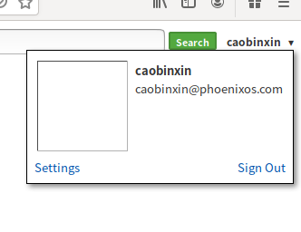
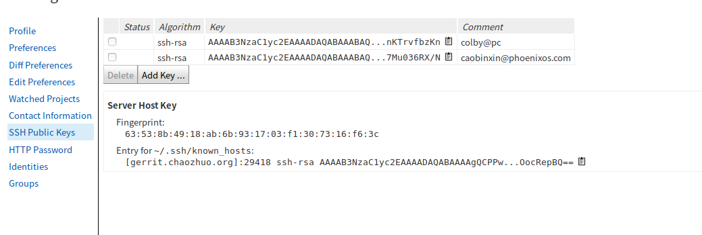

# 凤凰操作环境的搭建


## 1. 公司其他相关

### 1.1 邮箱

caobinxin@phoenixos.com

用户名：caobinxin

密码: 123qweasd.

http://mail.phoenixos.com/alimail/#h=WyJmbV8yIixbIjIiLCIiLHsiZklkIjoiMiIsInNlbElkIjoiMl8wOkR6enp6eVhILWdQJC0tLS5FTFJ4cHVBIiwib2Zmc2V0IjowLCJyZyI6W1siMiIseyJpZCI6Im0hMl8wOkR6enp6eVhILWdQJC0tLS5FTFJ4cHVBIiwic2YiOjB9XV19LHsibGFiZWwiOiLpgq7ku7YifV1d

```
锐创国际中心B座11层1110 北京超卓科技有限公司 曹斌鑫 136 9316 4682
```

wifi 密码：d9dgrsjh.

## 2. 业务相关

### 2.1 代码拉取：

- huo qu quan xian

```shell
# colby@colby-pc:~$
ssh-keygen -t rsa -C "caobinxin@phoenixos.com"

cat .ssh/id_rsa.pub


# http://gerrit.chaozhuo.org/login/%23%2Fq%2Fstatus%3Aopen
```






```shell
repo init --repo-url git://aosp.chaozhuo.org/git-repo -u ssh://caobinxin@gerrit.chaozhuo.org:29418/x86manifest -b phoenix-n


repo init --repo-url git://aosp.chaozhuo.org/git-repo -u ssh://caobinxin@gerrit.chaozhuo.org:29418/x86manifest -b phoenix-n

#以后就用这个
 repo init --repo-url git://aosp.chaozhuo.org/git-repo -u ssh://caobinxin@192.168.1.112:29418/x86manifest -b phoenix-n

#拉取代码
repo sync -c -j8 #最好 加一个 -c 这样就不会拉取所有， 
```


- 代码提交：

```shell
#　git push phoenix branch-name
colby@pc:~/androidos/kernel$ git push phoenix kernel-4.19

#配置编译的分支
colby@pc:~/androidos/.repo/manifests$ gedit default.xml
# 修改manifests 在当前目录的下就有.git 修改完在这进行提交
```

default.xml

```xml
<-->revision=要编译的分支名</-->
<project path="kernel" name="phoenix-kernel-4.4.10" remote="phoenix" revision="kernel-4.19" />
```


- haier教育项目

```
「华硕: repo init -b haier 这是海尔
repo init -b intel_edu 这是台电
repo init -b phoenix-n 这个是主干，也就是外网发的公版。」
—————————
「华硕: [Intel_edu_haier] $ /home/fanguofeng/bin/repo init -u ssh://fanguofeng@192.168.1.112:29418/x86manifest -b haier --repo-url=git://aosp.chaozhuo.net/git-repo --no-repo-verify」
—————————

「华硕: 遇到chaozhuo.net改成chaozhuo.org」
—————————
「华硕: chaozhuo.net这个域名 已经废弃了，」
—————————
```

```shell
repo init -u ssh://caobinxin@192.168.1.112:29418/x86manifest -b intel_edu_haier_4.19 --repo-url=git://aosp.chaozhuo.org/git-repo --no-repo-verify
```


在同一个目录下面去切换不同的工程：

```shell
 # 先切换分支
 repo init -u ssh://caobinxin@192.168.1.112:29418/x86manifest -b intel_edu_hp
 
 # 然后
 repo sync -c -j4
 
 #　这样就切换成功了
```


apt source

gedit /etc/apt/sources.list

```shell
deb http://mirrors.aliyun.com/ubuntu/ bionic main restricted universe multiverse
deb http://mirrors.aliyun.com/ubuntu/ bionic-security main restricted universe multiverse
deb http://mirrors.aliyun.com/ubuntu/ bionic-updates main restricted universe multiverse
deb http://mirrors.aliyun.com/ubuntu/ bionic-proposed main restricted universe multiverse
deb http://mirrors.aliyun.com/ubuntu/ bionic-backports main restricted universe multiverse
deb-src http://mirrors.aliyun.com/ubuntu/ bionic main restricted universe multiverse
deb-src http://mirrors.aliyun.com/ubuntu/ bionic-security main restricted universe multiverse
deb-src http://mirrors.aliyun.com/ubuntu/ bionic-updates main restricted universe multiverse
deb-src http://mirrors.aliyun.com/ubuntu/ bionic-proposed main restricted universe multiverse
deb-src http://mirrors.aliyun.com/ubuntu/ bionic-backports main restricted universe multiverse

deb https://typora.io/linux ./
# deb-src https://typora.io/linux ./
deb http://us.archive.ubuntu.com/ubuntu trusty main universe
```


### 2.2 编译前环境搭建：


android官方　源码变异环境指导安装：https://source.android.com/source/initializing.html

```shell
「秦少辉: android官网有些android编译时需要的工具。我也好久没更新了，你参考下

sudo apt-get install p7zip-full syslinux-utils python-networkx python-mako
sudo apt-get install git gnupg flex bison gperf build-essential zip curl libc6-dev libncurses5-dev:i386 x11proto-core-dev libx11-dev:i386 libreadline6-dev:i386 libgl1-mesa-dev g++-multilib mingw32 tofrodos python-markdown libxml2-utils xsltproc zlib1g-dev:i386 yasm

sudo apt-get install git-core gnupg flex bison gperf build-essential zip curl zlib1g-dev gcc-multilib g++-multilib libc6-dev-i386 lib32ncurses5-dev x11proto-core-dev libx11-dev lib32z-dev ccache libgl1-mesa-dev libxml2-utils xsltproc unzip libssl-dev
```

在安装 libreadline6-dev:i386 和　mingw32　时报错

错误解决参照：https://blog.csdn.net/u011596455/article/details/53267009

```
sudo gedit /etc/apt/sources.list
//在sources.list末尾添加，保存
deb http://us.archive.ubuntu.com/ubuntu trusty main universe
sudo apt-get update
sudo apt-get install mingw32
sudo apt-get install libreadline6-dev:i386
```

再次安装即可安装成功

安装jdk

```shell
sudo apt-get update
sudo apt-get install openjdk-8-jdk
```

解决缺少依赖项的问题：

```shell
sudo apt-get -f install 
```

### 2.3 源码编译指令

```shell
source build/envsetup.sh;
lunch android_x86_64-userdebug;
make iso_img -j8;
```


#### 2.3.1 编译记录

https://www.twblogs.net/a/5b844d572b71775d1cd031c0/zh-cn

在我修复的过程中，有时候执行make命令会报同样的错，这个时候我通常执行make clobber命令清除之前编译生成的环境和文件，全部重新执行生效。

```shell
make clobber
```

##### 错误1

描述：

```shell
[  1% 604/52809] Lex: aidl <= system/tools/aidl/aidl_language_l.ll
FAILED: /bin/bash -c "prebuilts/misc/linux-x86/flex/flex-2.5.39 -oout/host/linux-x86/obj/STATIC_LIBRARIES/libaidl-common_intermediates/aidl_language_l.cpp system/tools/aidl/aidl_language_l.ll"
flex-2.5.39: loadlocale.c:130:_nl_intern_locale_data: ?? 'cnt < (sizeof (_nl_value_type_LC_TIME) / sizeof (_nl_value_type_LC_TIME[0]))' ???
Aborted (core dumped)

```

解决的办法：

https://blog.csdn.net/aaa111/article/details/80330848

修复:

在build/envsetup.sh脚本中最后添加一句话  推荐将这句话，放在系统的.bashrc中

```
export LC_ALL=C
```

这里需要从build/envsetup.sh重新执行

参考链接：<https://stackoverflow.com/questions/49955137/error-when-build-lineageos-make-ninja-wrapper-error-1>

LC_ALL=C 是为了去除所有本地化的设置，让命令能正确执行。

最后编译成功：

```shell
out/target/product/x86_64/android_x86_64.iso is built successfully.


#### make completed successfully (01:41:53 (hh:mm:ss)) ####

colby@pc:~/androidos$ 

```

### 2.4 运行


一个脚步文件：

```shell
rm /run/user/1000/gvfs/smb-share:server=192.168.1.112,share=user/caobinxin/tmp/*

cp out/target/product/x86_64/*.img "/run/user/1000/gvfs/smb-share:server=192.168.1.112,share=user/caobinxin/tmp/"


cp out/target/product/x86_64/kernel "/run/user/1000/gvfs/smb-share:server=192.168.1.112,share=user/caobinxin/tmp/"
```


进入/home/colby/androidos/out/target/product/x86_64

```shell
x86_64$ ll *.img
-rw-r--r-- 1 colby colby    4342235 Apr 15 19:09 initrd.img
-rw-r--r-- 1 colby colby    5199430 Apr 15 18:53 install.img
-rw-r--r-- 1 colby colby    1749354 Apr 15 18:53 ramdisk.img
-rw-r--r-- 1 colby colby 2097152000 Apr 15 19:09 system.img

x86_64$ ls kernel 
kernel
```

将这五个文件放置到windows的c盘底下的　PhoenicOS目录中：

#### 2.4.1 uefi 安装

注意点：如果是uefi这种新的bios启动的话，需要我们额外的关注一下 kernel 和　initrd.img 两个文件的放置位置

1. 首先在windows底下用命令行**超级用户**
2. 运行：powershell
3. 运行：mountvol.exe z: /S
4. z:
5. ls
6. cd .\EFI\
7. dir
8. cd .\PhoenixOS\
9. dir
10. c:\PhoenixOS\kernel 

将我们的kernel 和 initrd.img放置到EFI目录下面的PhoenixOS中即可


首先到达EFI/PhoenixOS 目录下执行复制 拷贝

copy C:\PhoenixOS\caobinxin.txt .\ 

rm caobinxin.txt


### 2.5 smb:

```shell
smb://192.168.1.112/temp/0429/kernel.zip
```


### 2.6 公司翻墙

这个是服务器端，需要参照这个配置客户端


```c
「华硕: 端口10924, d9dgrsjh 」
—————————
「华硕: 45.78.8.254」
—————————
「华硕: 这是server端的配置，你对应配置client端的参数吧。」
—————————
```