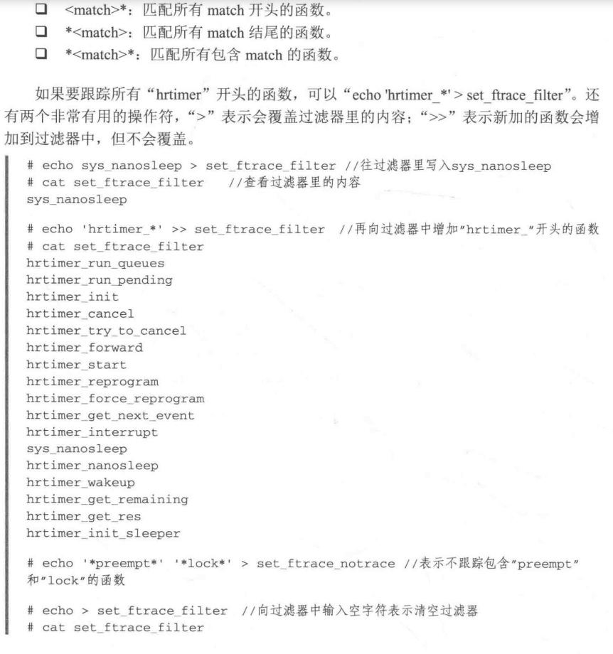
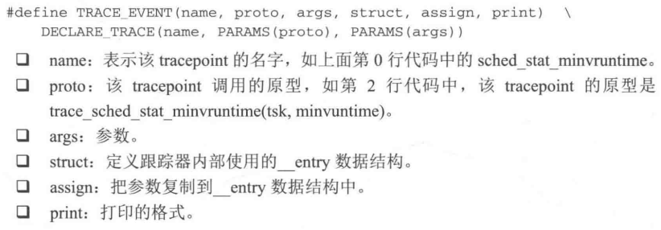

# kernel调试

## 1. ftrace

- 静态代码的插装技术
- 利用gcc编译器的profile特性在所有函数入口处添加一段插装(stub)代码，ftrace重载这段代码来实现trace功能。
- gcc -pg　选项会在每个函数入口处加入mcount的调用代码，原本mcount有libc来实现，因为内核不会链接libc库，因此ftrace编写了自己的mcount stub函数


1. 打开对应的编译宏开关

使用ftrace之前，需要保证内核配置编译了配置选项


```makefile
CONFIG_FTRACE=y
CONFIG_HAVE_FUNCTION_TRACER=y
CONFIG_HAVE_FUNCTION_GRAPH_TRACER=y
CONFIG_HAVE_DYNAMIC_FTRACE=y
CONFIG_FUNCTION_TRACER=y

CONFIG_FUNCTION_GRAPH_TRACER=y

CONFIG_IRQSOFF_TRACER=y
CONFIG_SCHED_TRACER=y
CONFIG_ENABLE_DEFAULT_TRACERS=y
CONFIG_FTRACE_SYSCALLS=y
CONFIG_PREEMPT_TRACER=y
```

关于ftarce的开关很多，这里只是打开了一部分。

- 配置小插曲

将CONFIG_GENERIC_TRACER注销然后打开CONFIG_ENABLE_DEFAULT_TRACERS

```makefile
#CONFIG_GENERIC_TRACER is not set
CONFIG_ENABLE_DEFAULT_TRACERS=y
```

理论依据：

```makefile
config ENABLE_DEFAULT_TRACERS                                                                                   
    bool "Trace process context switches and events"
    depends on !GENERIC_TRACER
    select TRACING
    help
      This tracer hooks to various trace points in the kernel,
      allowing the user to pick and choose which trace point they
      want to trace. It also includes the sched_switch tracer plugin.

```

参考：https://blog.csdn.net/liao20081228/article/details/81286729

```makefile
requires(或depends on）<expr>，
依赖: 依赖项给菜单入口或配置项定义了一个依赖规则，只有当expr为真或被选中时，该菜单入口或配置项才有效，依赖对菜单入口或配置项中的其它属性都有效。
```

2. 挂载debugfs

ftrace是通过debugfs文件系统向用户空间提供访问的接口，因此需要在系统启动时挂载debugfs,可以修改系统的/etc/fstab文件或者手动挂载

```shell
mount -t debugfs debugfs /sys/kernel/debug
```

在　/sys/kernel/debug/tracing　中提供了各种跟踪器(tracer)和event事件

常用的选项如下：

1. available_tracers：列出了当前系统支持的跟踪器

```shell
intel_haier:/sys/kernel/debug/tracing # cat available_tracers                  
function_graph function nop
```

2. available_events ：列出了当前系统支持的event事件

```shell
intel_haier:/sys/kernel/debug/tracing # cat available_events
i2c:i2c_result
i2c:i2c_reply
i2c:i2c_read
i2c:i2c_write
#有很多，这里只列举如下
```

3. trace 读跟踪信息

```shell
intel_haier:/sys/kernel/debug/tracing # cat trace                            
# tracer: nop
#
#                              _-----=> irqs-off
#                             / _----=> need-resched
#                            | / _---=> hardirq/softirq
#                            || / _--=> preempt-depth
#                            ||| /     delay
#           TASK-PID   CPU#  ||||    TIMESTAMP  FUNCTION
#              | |       |   ||||       |         |
```

4. tracing_on: 用于开始跟踪

```shell
intel_haier:/sys/kernel/debug/tracing # echo 1 > tracing_on                    
intel_haier:/sys/kernel/debug/tracing # echo 0 > tracing_on
```

5. trace_options: 设置ftrace的一些相关选项

```shell
intel_haier:/sys/kernel/debug/tracing # cat trace_options 
```

6. nop: 不跟踪任何消息

```shell
intel_haier:/sys/kernel/debug/tracing # echo nop > current_tracer
#可以清空之情收集到的跟踪信息
```

  7.其他说明


### 1.1 irq跟踪器

```shell
#关闭function-tracing 可以减少一些延迟
intel_haier:/sys/kernel/debug/tracing # echo 0 > options/function-trace

#打开irqsoff来跟踪中断延迟
intel_haier:/sys/kernel/debug/tracing # echo irqsoff > current_tracer

#打开追踪
130|intel_haier:/sys/kernel/debug/tracing # echo 1 > tracing_on                           ＃等待一会           

#关闭跟踪
intel_haier:/sys/kernel/debug/tracing # echo 0 > tracing_on
```

这里仅仅是使用跟踪器的一个大致的流程，

这里只记录，这个跟踪器能做什么事，具体如果要用到的话，请参照，奔跑吧linux

irq跟踪器，可以跟踪出：

- 当前中断的最大延迟，进程的pid，进程的名字cmd,
- 中断发生的开始函数，和结束函数

### 1.2 preemptoff跟踪器

preemptoff跟踪器用于　跟踪和记录关闭抢占的最大延迟

### 1.3 function跟踪器

function跟踪器会记录当前系统运行过程中所有的函数，如果只是想跟踪某个进程，可以设置set_ftrace_pid

```shell
intel_haier:/sys/kernel/debug/tracing # cat set_ftrace_pid                                                            
no pid
```

```shell
intel_haier:/sys/kernel/debug/tracing # ps 
u0_a26    2433  1486  1092548 93680    ep_poll 0000000000 S com.chaozhuo.launcher:pushservice
```

跟踪这个进程为例：

```shell
intel_haier:/sys/kernel/debug/tracing # echo 2433 > set_ftrace_pid
intel_haier:/sys/kernel/debug/tracing # echo nop > current_tracer #清除trace的跟踪记录
intel_haier:/sys/kernel/debug/tracing # echo function > current_tracer

intel_haier:/sys/kernel/debug/tracing # echo 1 > tracing_on
intel_haier:/sys/kernel/debug/tracing # echo 0 > tracing_on

intel_haier:/sys/kernel/debug/tracing # cat trace                                                                     
# tracer: function
#
#                              _-----=> irqs-off
#                             / _----=> need-resched
#                            | / _---=> hardirq/softirq
#                            || / _--=> preempt-depth
#                            ||| /     delay
#           TASK-PID   CPU#  ||||    TIMESTAMP  FUNCTION
#              | |       |   ||||       |         |
           <...>-2209  [001] d..2  2260.780904: switch_mm_irqs_off <-__schedule
           <...>-2209  [001] d..2  2260.780905: load_new_mm_cr3 <-switch_mm_irqs_off
 her:pushservice-2433  [001] d..2  2260.780907: finish_task_switch <-__schedule
 her:pushservice-2433  [001] d..2  2260.780907: _raw_spin_unlock_irq <-finish_task_switch
 her:pushservice-2433  [001] ....  2260.780908: _raw_spin_lock_irqsave <-ep_poll

```

### 1.4 function_graph跟踪器

和function跟踪器类似

```shell
intel_haier:/sys/kernel/debug/tracing # echo nop > current_tracer                                                     
intel_haier:/sys/kernel/debug/tracing # cat trace                                                                     
# tracer: nop
#
#                              _-----=> irqs-off
#                             / _----=> need-resched
#                            | / _---=> hardirq/softirq
#                            || / _--=> preempt-depth
#                            ||| /     delay
#           TASK-PID   CPU#  ||||    TIMESTAMP  FUNCTION
#              | |       |   ||||       |         |
intel_haier:/sys/kernel/debug/tracing # echo function_graph > current_tracer

intel_haier:/sys/kernel/debug/tracing # echo 1 > tracing_on                                                           
intel_haier:/sys/kernel/debug/tracing # echo 0 > tracing_on                                                           
intel_haier:/sys/kernel/debug/tracing # cat trace   

intel_haier:/sys/kernel/debug/tracing # cat trace                                                                     
# tracer: function_graph
#
# CPU  DURATION                  FUNCTION CALLS
# |     |   |                     |   |   |   |
 3)               |  switch_mm_irqs_off() {
 3)   0.440 us    |    load_new_mm_cr3();
 3)   1.331 us    |  }
 ------------------------------------------
 3)  .recomm-2915  =>  her:pus-2433 
 ------------------------------------------

 3)               |  finish_task_switch() {
 3)   0.053 us    |    _raw_spin_unlock_irq();
 3)   0.531 us    |  }
 3)   0.202 us    |  _raw_spin_lock_irqsave();
 3)   0.093 us    |  _raw_spin_unlock_irqrestore();
 3)               |  ep_scan_ready_list() {
 3)   0.057 us    |    mutex_lock();
 3)   0.061 us    |    _raw_spin_lock_irqsave();
 3)   0.082 us    |    _raw_spin_unlock_irqrestore();
 3)               |    ep_send_events_proc() {
 3)   0.193 us    |      eventfd_poll();
 3)   0.871 us    |    }
 3)   0.066 us    |    _raw_spin_lock_irqsave();
 3)   0.048 us    |    __pm_relax();
 3)   0.061 us    |    _raw_spin_unlock_irqrestore();
 3)   0.046 us    |    mutex_unlock();
 3)   4.410 us    |  }

```

### 1.5 动态ftrace

在配置内核时打开CONFIG_DYNAMIC_FTRACE=y,就可以支持动态ftrace功能。

- set_ftrace_filter 设置要跟踪的函数
- set_ftrace_notrace　设置不要跟踪的函数
- available_filter_functions　可以罗列出当前系统支持的所有函数

```shell
intel_haier:/sys/kernel/debug/tracing # cat available_filter_functions
i2c_hid_stop [i2c_hid]
__i2c_hid_command [i2c_hid]
i2c_hid_set_or_send_report [i2c_hid]
i2c_hid_set_power [i2c_hid]
i2c_hid_free_buffers [i2c_hid]
i2c_hid_alloc_buffers [i2c_hid]
i2c_hid_parse [i2c_hid]
i2c_hid_open [i2c_hid]
i2c_hid_close [i2c_hid]
i2c_hid_power [i2c_hid]
i2c_hid_start [i2c_hid]
i2c_hid_remove [i2c_hid]
i2c_hid_match [i2c_hid]
i2c_hid_raw_request [i2c_hid]
i2c_hid_probe [i2c_hid]
i2c_hid_irq [i2c_hid]
i2c_hid_output_report [i2c_hid]
i2c_hid_shutdown [i2c_hid]
```

例如我们现在只关心i2c_hid_raw_request和i2c_hid_output_report这两个函数，

```shell
intel_haier:/sys/kernel/debug/tracing # echo i2c_hid_output_report i2c_hid_raw_request > set_ftrace_filter

intel_haier:/sys/kernel/debug/tracing # echo function > current_tracer

intel_haier:/sys/kernel/debug/tracing # echo 1 > tracing_on                                                           
intel_haier:/sys/kernel/debug/tracing # echo 0 > tracing_on   

intel_haier:/sys/kernel/debug/tracing # cat trace                                                                     
# tracer: function
#
#                              _-----=> irqs-off
#                             / _----=> need-resched
#                            | / _---=> hardirq/softirq
#                            || / _--=> preempt-depth
#                            ||| /     delay
#           TASK-PID   CPU#  ||||    TIMESTAMP  FUNCTION
#              | |       |   ||||       |         |
intel_haier:/sys/kernel/debug/tracing # 

```


例子，追踪hrtimer_interrupt函数　和　SyS_nanosleep　函数

```shell
intel_haier:/sys/kernel/debug/tracing # echo hrtimer_interrupt SyS_nanosleep > set_ftrace_filter

intel_haier:/sys/kernel/debug/tracing # echo 1 > tracing_on                                                           
intel_haier:/sys/kernel/debug/tracing # usleep 1                                                                      
intel_haier:/sys/kernel/debug/tracing # echo 0 > tracing_on                                                           
intel_haier:/sys/kernel/debug/tracing # cat trace        

```

过滤器还支持通配符



### 1.6 事件跟踪

- ftrace里的跟踪机制主要有两种，分别是函数和tracepoint，前者属于傻瓜式操作，后者tracepoint可以理解为一个linux内核中的占位符函数，内核子系统的开发者通常喜欢利用他来进行调试。

- tracepoint可以输出开发者想要的参数、局部变量等信息。

- tracepoint的位置比较固定，一般都是内核开发者添加上去的，可以把他理解为传统c语言中的#if DEBUG部分。

- 如果在运行时没有开启DEBUG,那么是不占用任何系统开销的


在阅读内核代码的时候，会遇到"trace_"开头的函数，

找到一个案例进行分析：

```shell
colby@pc:~/android_system_os/haier/kernel/drivers/gpio$ grep -inR "trace"
gpiolib.c:33:#define CREATE_TRACE_POINTS
gpiolib.c:34:#include <trace/events/gpio.h>
gpiolib.c:2280:	trace_gpio_direction(desc_to_gpio(desc), 1, status);
gpiolib.c:2342:	trace_gpio_value(desc_to_gpio(desc), 0, val);
gpiolib.c:2343:	trace_gpio_direction(desc_to_gpio(desc), 0, ret);
gpiolib.c:2461:	trace_gpio_value(desc_to_gpio(desc), 1, value);
gpiolib.c:2533:	trace_gpio_direction(desc_to_gpio(desc), value, err);
gpiolib.c:2560:	trace_gpio_direction(desc_to_gpio(desc), !value, err);
gpiolib.c:2572:	trace_gpio_value(desc_to_gpio(desc), 0, value);
gpiolib.c:2628:			trace_gpio_value(desc_to_gpio(desc), 0, value);

```

```shell
#按照这个进行分析
colby@pc:~/android_system_os/haier/kernel/drivers/gpio$ vim gpiolib.c +2280
```

```shell
#查看系统是否支持这个情况
intel_haier:/sys/kernel/debug/tracing # cat available_events | grep gpio                                       
gpio:gpio_value
gpio:gpio_direction

#跟踪这个事件
intel_haier:/sys/kernel/debug/tracing # echo gpio:gpio_value > set_event
intel_haier:/sys/kernel/debug/tracing # echo 1 > tracing_on 

#支持统配符
intel_haier:/sys/kernel/debug/tracing # echo gpio:* > set_event                           
intel_haier:/sys/kernel/debug/tracing # cat set_event            
gpio:gpio_value
gpio:gpio_direction

```

事件跟踪还支持一个强大的功能，可以设定跟踪的条件，做到更加精细化的设置。

每个tracepoint都定义了一个format格式，其中定义了该tracepoint支持的域

- 案例

```shell
intel_haier:/sys/kernel/debug/tracing/events/gpio/gpio_value # cat format                                             
name: gpio_value
ID: 438
format:
	field:unsigned short common_type;	offset:0;	size:2;	signed:0;
	field:unsigned char common_flags;	offset:2;	size:1;	signed:0;
	field:unsigned char common_preempt_count;	offset:3;	size:1;	signed:0;
	field:int common_pid;	offset:4;	size:4;	signed:1;

	field:unsigned gpio;	offset:8;	size:4;	signed:0;
	field:int get;	offset:12;	size:4;	signed:1;
	field:int value;	offset:16;	size:4;	signed:1;

print fmt: "%u %3s %d", REC->gpio, REC->get ? "get" : "set", REC->value
intel_haier:/sys/kernel/debug/tracing/events/gpio/gpio_value #
```

gpio_value支持７个域，前４个为通用域，后３个是该tracepoint支持的域，

- gpio 是一个unsigned域　其他的都为　int　域
- 根据域的不同，可以对事件进行精细化的过滤，对于数字域支持："==","!=","<","<=" , " >", ">=", "&",对于字符串域支持"==" , "!=" , "~"操作符


#### 1.6.1 添加tracepoint

参考：haier/kernel$ vim ./include/trace/events/gpio.h

```c
/* SPDX-License-Identifier: GPL-2.0 */
#undef TRACE_SYSTEM
#define TRACE_SYSTEM gpio

#ifndef CONFIG_TRACING_EVENTS_GPIO
#define NOTRACE
#endif

#if !defined(_TRACE_GPIO_H) || defined(TRACE_HEADER_MULTI_READ)
#define _TRACE_GPIO_H

#include <linux/tracepoint.h>

TRACE_EVENT(gpio_direction,

	TP_PROTO(unsigned gpio, int in, int err),

	TP_ARGS(gpio, in, err),

	TP_STRUCT__entry(
		__field(unsigned, gpio)
		__field(int, in)
		__field(int, err)
	),

	TP_fast_assign(
		__entry->gpio = gpio;
		__entry->in = in;
		__entry->err = err;
	),

	TP_printk("%u %3s (%d)", __entry->gpio,
		__entry->in ? "in" : "out", __entry->err)
);

TRACE_EVENT(gpio_value,

	TP_PROTO(unsigned gpio, int get, int value),

	TP_ARGS(gpio, get, value),

	TP_STRUCT__entry(
		__field(unsigned, gpio)
		__field(int, get)
		__field(int, value)
	),

	TP_fast_assign(
		__entry->gpio = gpio;
		__entry->get = get;
		__entry->value = value;
	),

	TP_printk("%u %3s %d", __entry->gpio,
		__entry->get ? "get" : "set", __entry->value)
);

#endif /* if !defined(_TRACE_GPIO_H) || defined(TRACE_HEADER_MULTI_READ) */

/* This part must be outside protection */
#include <trace/define_trace.h>
```



内核中提供了一个tracepoint的例子，在kernel/samples/trace_events


### 1.7 trace-cmd kernelshark

```shell
 1999  sudo apt-get install trace-cmd kernelshark
 2000  trace-cmd record -h
 2001  trace-cmd record -e 'sched_wakeup*' -e sched_switch -e 'sched_migrate*'
 2002  sudo trace-cmd record -e 'sched_wakeup*' -e sched_switch -e 'sched_migrate*'
 2003  ls
 2004  kernelshark trace.dat 
 2005  rm trace.dat 
```

