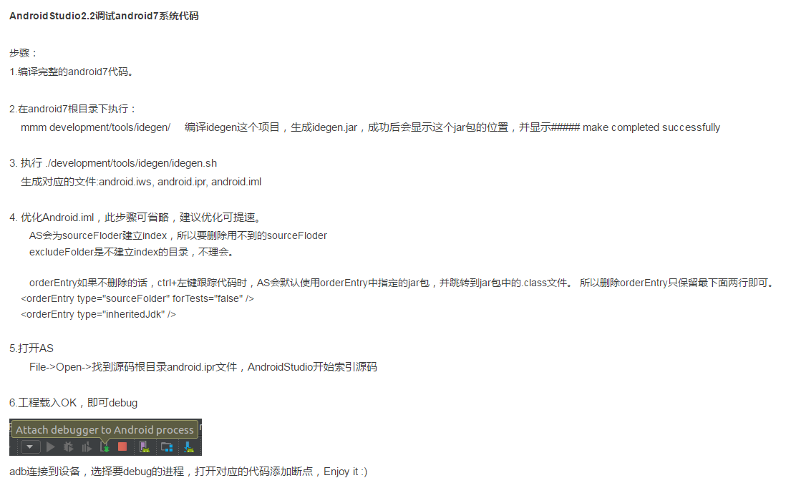
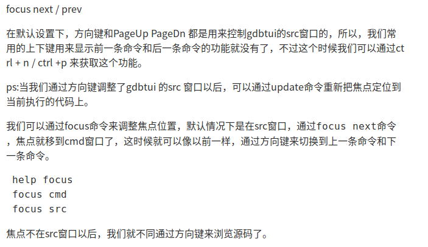

# android-framework编译调试

## 1. 资料准备

url :https://www.cnblogs.com/liumce/p/8027559.html(详细记录从源码下载到framework调试的详细过程)

https://blog.csdn.net/gjy_it/article/details/80733904

快捷键：https://www.cnblogs.com/lao-liang/p/5022303.html

## 2. 环境搭建

### 2.0 搭建流程



备注：

将 <orderEntry type="module-library">   。。。</orderEntry>全部删除

### 2.1 编译调试

调试参考代码：https://blog.csdn.net/turtlejj/article/details/83860708

```shell
空灵: AS可以断点调java，上网搜下文章很多。
局部更新：
1. 根据要调试的代码找到对应的Android.mk，找到目标target(如services.jar)
2. mmm path或make target， java可mmm，c最好make
3. adb push file 
4. adb  shell stop; adb shell start 即可更新
```

adb shell命令详解以及实例：http://www.511yj.com/eyuyan-android-shell.html

## 3. 其它：

#### 4.设置USB接口访问设备

在linux下，默认情况是不允许普通用户直接通过USB接口来访问设备的.

推荐方法是以根用户身份在 `/etc/udev/rules.d/51-android.rules` 路径创建文件。

我们可以通过如下指令来实现（**注意用你的系统username替换指令中的**）:


## 4. gdb调试

进程的id

```shell

```

### 4.1 应用层的调试

#### 4.1.1环境准备

https://blog.csdn.net/zhu929033262/article/details/76064044

查看gdbserver的版本号：

```shell
intel_haier:/ # gdbserver --version
GNU gdbserver (GDB) 7.11
Copyright (C) 2016 Free Software Foundation, Inc.
gdbserver is free software, covered by the GNU General Public License.
This gdbserver was configured as "i686-linux-android"
```


查看gdb版本号：

```shell
colby@pc:~/android_system_os/haier$ ./prebuilts/gdb/linux-x86/bin/gdb
GNU gdb (GDB) 7.11
Copyright (C) 2016 Free Software Foundation, Inc.
License GPLv3+: GNU GPL version 3 or later <http://gnu.org/licenses/gpl.html>
This is free software: you are free to change and redistribute it.
There is NO WARRANTY, to the extent permitted by law.  Type "show copying"
and "show warranty" for details.
This GDB was configured as "x86_64-linux-gnu".
Type "show configuration" for configuration details.
For bug reporting instructions, please see:
<http://www.gnu.org/software/gdb/bugs/>.
Find the GDB manual and other documentation resources online at:
<http://www.gnu.org/software/gdb/documentation/>.
For help, type "help".
Type "apropos word" to search for commands related to "word".
(gdb)
```

```shell
intel_haier:/ # getenforce
Permissive #表示已经关闭sendroid
```

#### 4.1.2  调试

1. 查看要调试的进程

```shell
intel_haier:/ # ps | grep system_server
system    27375 27136 1882060 210696    ep_poll 0000000000 S system_server
```

2.  启动gdbserver attach到目标进程  （在adb进入手机上操作，注意此时需要root权限）

```shell
intel_haier:/ # gdbserver64 remote:1234 --attach 27375                                     Attached; pid = 27375
Listening on port 1234
```

其中 remote:1234 表示映射成tcp的1234端口，这个时候重新打开一个 adb shell 再ps system_server发现进程状态已经变为T了，表示attach已经成功了

```shell
colby@pc:~/android_system_os/haier$ adb shell
intel_haier:/ # ps | grep system_server
system    27375 27136 1882060 210784 do_signal_ 0000000000 T system_server
```

3. 启动gdb进行调试

从目标机中拷贝文件

```shell
colby@pc:~/android_system_os/gdb-env$ adb pull /system/bin/linker64 ./
/system/bin/linker64: 1 file pulled. 9.1 MB/s (1120480 bytes in 0.117s)

colby@pc:~/android_system_os/gdb-env$ adb pull /system/bin/app_process64 ./
/system/bin/app_process64: 1 file pulled. 0.4 MB/s (22720 bytes in 0.049s)

colby@pc:~/android_system_os/gdb-env$ adb pull /system/lib/libc.so ./
/system/lib/libc.so: 1 file pulled. 15.2 MB/s (1131376 bytes in 0.071s)
```

加载到gdb中

```shell
colby@pc:~/android_system_os/haier$ ./prebuilts/gdb/linux-x86/bin/gdb
GNU gdb (GDB) 7.11

(gdb) file ~/android_system_os/gdb-env/app_process64 
Reading symbols from ~/android_system_os/gdb-env/app_process64...(no debugging symbols found)...done.
(gdb) file ~/android_system_os/gdb-env/linker64 
Reading symbols from ~/android_system_os/gdb-env/linker64...(no debugging symbols found)...done.
(gdb) file ~/android_system_os/gdb-env/libc.so 
Reading symbols from ~/android_system_os/gdb-env/libc.so...(no debugging symbols found)...done.
(gdb) 
```

这个我没有进行到底：还得继续完善

### 4.2 系统级别的调试

https://www.cnblogs.com/liumce/p/8027559.html　最后有说明

1. #### 查看要调试的进程

```shell
intel_haier:/ # ps | grep system_
system    1771  1478  1858744 186528    ep_poll 0000000000 S system_server
```

2. #### gdbclient调试

```shell
 2015  . ./build/envsetup.sh 
 2016  lunch 
colby@pc:~/android_system_os/haier$ gdbclient 31549
```

报错：Error: couldn't find symbols: out/target/product/android_x86_64/symbols does not exist or is not a directory.

原因：路径不对

解决方案：临时解决

```shell
colby@pc:~/android_system_os/haier/out/target/product$ mv x86_64/ android_x86_64
```

3. #### 调试android_view_InputChannel.cpp

frameworks/base/core/jni/android_view_InputChannel.cpp

的android_view_InputChannel_nativeOpenInputChannelPair()

```shell
colby@pc:~/android_system_os/haier$ gdbclient 1771
Starting gdbserver...
. adb forward for port=5039...
. starting gdbserver to attach to pid=1771...
. give it couple of seconds to start...
Attached; pid = 1771
Listening on port 5039
. done


(gdb) b frameworks/base/core/jni/android_view_InputChannel.cpp:125
#===========================
Breakpoint 2 at 0x7323e47b49dc: file frameworks/base/core/jni/android_view_InputChannel.cpp, line 125.
#说明我们的断点设置成功了。

#开始监听
(gdb) c
Continuing.

#此时点击目标机的　开始图标
#=================================
[New Thread 1771.18338]
[Switching to Thread 1771.1782]

Thread 8 "Binder:1771_1" hit Breakpoint 2, android::android_view_InputChannel_nativeOpenInputChannelPair (env=0x7323daa1f300, clazz=<optimized out>, nameObj=0x7323e199c5b8)
    at frameworks/base/core/jni/android_view_InputChannel.cpp:126
126	    String8 name(nameChars);
(gdb)
#========================================= 说明我们已经监视成功
```

4. #### 希望某个进程启动时，就开始监听

```shell
adb shell gdbserver :5039 /system/bin/my_test_app
Process my_test_app created; pid = 3460
Listening on port 5039
gdbclient <app pid>
```

5. #### 参看下面的教程，可以打开代码浏览　**focus**

### 4.3 gdb教程

https://blog.csdn.net/liigo/article/details/582231

- file <文件名>：

加载被调试的可执行程序文件。
因为一般都在被调试程序所在目录下执行GDB，因而文本名不需要带路径。

```shell
(gdb) file gdb-sample
```

- r

Run的简写，运行被调试的程序。
如果此前没有下过断点，则执行完整个程序；如果有断点，则程序暂停在第一个可用断点处。

```shell
(gdb) r
```

- c

Continue的简写，继续执行被调试程序，直至下一个断点或程序结束。

```shell
(gdb) c
```

- b

b: Breakpoint的简写，设置断点。两可以使用“行号”“函数名称”“执行地址”等方式指定断点位置。
其中在函数名称前面加“*”符号表示将断点设置在“由编译器生成的prolog代码处”。如果不了解汇编，可以不予理会此用法。

d: Delete breakpoint的简写，删除指定编号的某个断点，或删除所有断点。断点编号从1开始递增。

```shell
(gdb) b 8
(gdb) b main
(gdb) b *main
(gdb) b *0x804835c

(gdb) d
#对应的解释
b <行号>
b <函数名称>
b *<函数名称>
b *<代码地址>

d [编号]
```

- s, n

```shell
s: 执行一行源程序代码，如果此行代码中有函数调用，则进入该函数；
n: 执行一行源程序代码，此行代码中的函数调用也一并执行。

s 相当于其它调试器中的“Step Into (单步跟踪进入)”；
n 相当于其它调试器中的“Step Over (单步跟踪)”。

这两个命令必须在有源代码调试信息的情况下才可以使用（GCC编译时使用“-g”参数）。
```

```shell
(gdb) s
(gdb) n
```

- si, ni

si命令类似于s命令，ni命令类似于n命令。所不同的是，这两个命令（si/ni）所针对的是汇编指令，而s/n针对的是源代码。

- p <变量名称>

Print的简写，显示指定变量（临时变量或全局变量）的值。

```shell
(gdb) p i
(gdb) p nGlobalVar
```

- display ...  undisplay <编号>

display，设置程序中断后欲显示的数据及其格式。
例如，如果希望每次程序中断后可以看到即将被执行的下一条汇编指令，可以使用命令
“display /i $pc”
其中 $pc 代表当前汇编指令，/i 表示以十六进行显示。当需要关心汇编代码时，此命令相当有用。

undispaly，取消先前的display设置，编号从1开始递增。

```shell
(gdb) display /i $pc
(gdb) undisplay 1
```

- i

Info的简写，用于显示各类信息，详情请查阅“help i”。

使用“i r”命令显示寄存器中的当前值———“i r”即“Infomation Register”：

```shell
(gdb) i r
eax 0xbffff6a4 -1073744220
ecx 0x42015554 1107383636
edx 0x40016bc8 1073834952
ebx 0x42130a14 1108544020
esp 0xbffff6a0 0xbffff6a0
ebp 0xbffff6a8 0xbffff6a8
esi 0x40015360 1073828704
edi 0x80483f0 134513648
eip 0x8048366 0x8048366
eflags 0x386 902
cs 0x23 35
ss 0x2b 43
ds 0x2b 43
es 0x2b 43
fs 0x0 0
gs 0x33 51
```

```shell
(gdb) i r eax
eax 0xbffff6a4 -1073744220
```


- help [命令名称]

GDB帮助命令，提供对GDB名种命令的解释说明。
如果指定了“命令名称”参数，则显示该命令的详细说明；如果没有指定参数，则分类显示所有GDB命令，供用户进一步浏览和查询。

```shell
(gdb) help display
```

- focus

http://www.360doc.com/content/14/0325/15/15064667_363606885.shtml

可以动态的显示代码

使用如下命令启动gdb: **gdb -tui main** 或者在启动gdb后, 输入命令**focus**或**layout:**

(GDB版本要求: 7.0及以上)

亲自测试是可以的




- 调试正在运行的进程

gdb -p pid

- layout

```shell
#打开各个窗口
help layout
layout src
layout asm
layout split
```

- winheight

```shell
help winheight 
winheight src +5
winheight src -4
```

- 空格键

当前窗口放大或者缩小后，gdbtui窗口不会发生变化，我们可以通过 space键强行进行刷新gdbtui窗口

- 关闭信号

https://blog.csdn.net/artine/article/details/80008529

