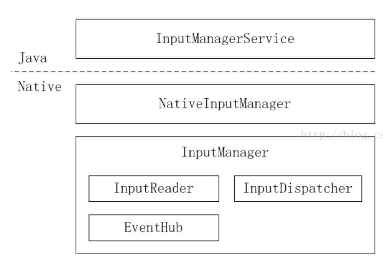
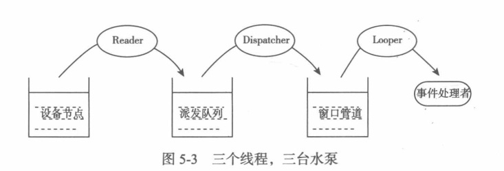
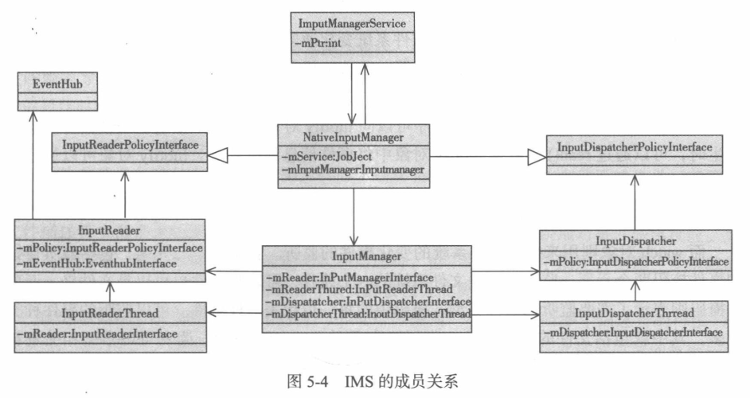
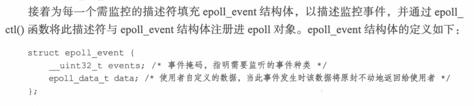
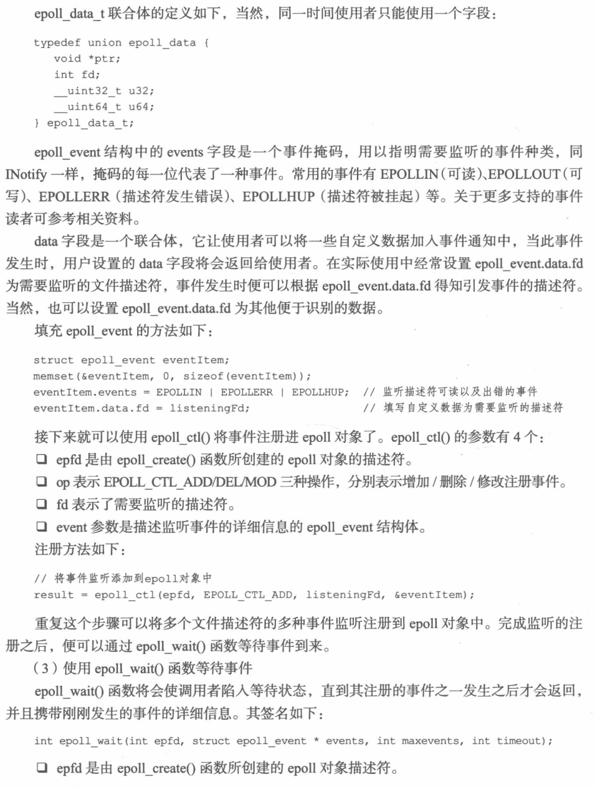
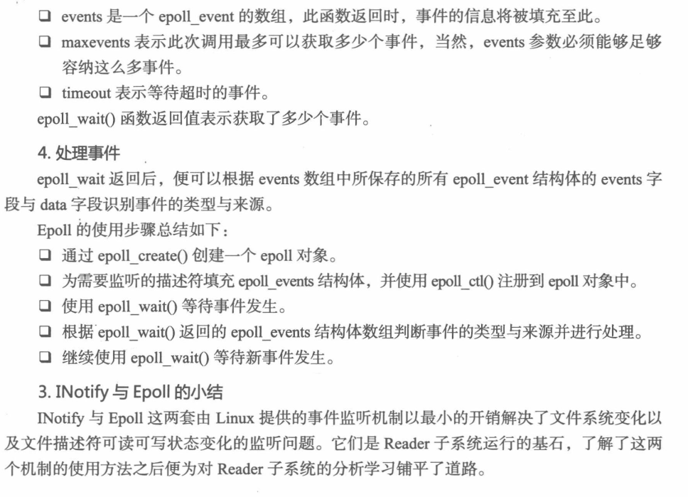
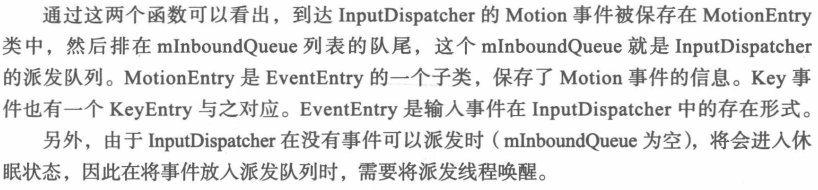
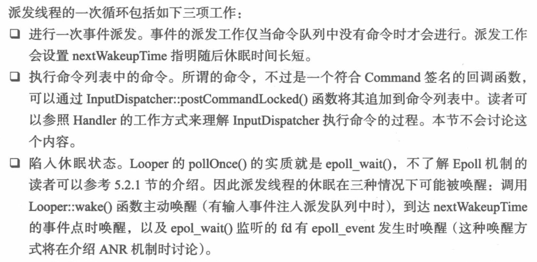
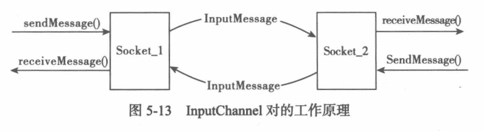

# android-input子系统

## 1. 基础

- 命令

```shell
adb shell getevent [-选项] [device_path]
```

其中 device_path 是可选参数,用以指明需要监听的设备节点路径。如果省略
此参数,则监听所有设备节点的事件。
打开模拟器,执行 adb shell getevent –t

注意其输出是十六进制的

```shell
endevent <节点路径> <类型><代码> <值>
```

sendevent 的参数为十进制。电源键的代码 0x74 的十进制为 116,因此可以通
过快速执行如下两条命令实现点击电源键的效果:
adb shell sendevent /dev/input/event0 1 116 1 #按下电源键
adb shell sendevent /dev/input/event0 1 116 0 #抬起电源键

另外,执行这两条命令的时间间隔便是用户按住电源键所保持
的时间,所以如果执行第一条命令后迟迟不执行第二条,则会产生长按电源键的
效果

- 输入系统概述：

最初的输入事件为内核生成的原始事件,而最
终交付给窗口的则是 KeyEvent 或 MotionEvent 对象。因此 Android 输入系统
的主要工作是读取设备节点中的原始事件,将其加工封装,然后派发给一个特定
的窗口以及窗口中的控件。这个过程由 InputManagerService (以下简称 IMS)
系统服务为核心的多个参与者共同完成。


简单来说,内核将原始事件写入到设备节点中,InputReader 不断地通过EventHub 将原始事件取出来并翻译加工成 Android 输入事件,然后交给InputDispatcher。InputDispatcher 根据 WMS 提供的窗口信息将事件交给合适的窗口。窗口的 ViewRootImpl 对象再沿着控件树将事件派发给感兴趣的控件。控件对其收到的事件作出响应,更新自己的画面、执行特定的动作。所有这些参与者以 IMS 为核心,构建了 Android 庞大而复杂的输入体系。


### 1.1 java知识

- isAssignableFrom()

https://www.cnblogs.com/greatfish/p/6097507.html

判定是否是它的子类：

```java
SystemService.class.isAssignableFrom(serviceClass)
```

- getConstructor()和newInstance()

https://blog.csdn.net/leifengpeng/article/details/74228829

通过反射来创建对象

```java
final T service;
try {
     Constructor<T> constructor = serviceClass.getConstructor(Context.class);
     service = constructor.newInstance(mContext);                                                                                                                                                       
} catch (InstantiationException ex) {
      throw new RuntimeException("Failed to create service " + name
                        + ": service could not be instantiated", ex);
}
```

- SystemServiceManager.startService()

```java
public <T extends SystemService> T startService(Class<T> serviceClass) {
    //1.通过反射机制创建对象
    Constructor<T> constructor = serviceClass.getConstructor(Context.class);
    service = constructor.newInstance(mContext);
    
    //2.添加到系统服务中
    mServices.add(service);
    //3.启动系统服务
    service.onStart();
}

//举例：
mDisplayManagerService = mSystemServiceManager.startService(DisplayManagerService.class); 
```


## 2. IMS init分析

### 2.1 启动IMS

其启动过程是从 Java 部分的初始化开始,进而完成 Native 部分的初始化。

```shell
haier/frameworks$ find -name SystemServer.java
./base/services/java/com/android/server/SystemServer.java
```

```java
private void startOtherServices() {
    
    		mDisplayManagerService = mSystemServiceManager.startService(DisplayManagerService.class);
    
    	    inputManager = new InputManagerService(context); 				                           Trace.traceEnd(Trace.TRACE_TAG_SYSTEM_SERVER);

            traceBeginAndSlog("StartWindowManagerService");
            wm = WindowManagerService.main(context, inputManager,
                    mFactoryTestMode != FactoryTest.FACTORY_TEST_LOW_LEVEL,
                    !mFirstBoot, mOnlyCore);
            ServiceManager.addService(Context.WINDOW_SERVICE, wm); 
            ServiceManager.addService(Context.INPUT_SERVICE, inputManager);
			//设置向 WMS 发起回调的 callback 对象
            inputManager.setWindowManagerCallbacks(wm.getInputMonitor());
            
    		//正式启动 IMS
    		inputManager.start();
}
```

### 2.2 分析InputManagerService

```java
public InputManagerService(Context context) {
        this.mContext = context;
    
    	//DisplayThread在创建mDisplayManagerService就已经创建成功了，这里相当是拿到了　和　DisplayManagerService　沟通的渠道
        this.mHandler = new InputManagerHandler(DisplayThread.get().getLooper());
   		 mPtr = nativeInit(this, mContext, mHandler.getLooper().getQueue());//java层将c层中的NativeInputManager　此对象将是 Native 层组件与Java 层 IMS 进行通信的桥梁
    	LocalServices.addService(InputManagerInternal.class, new LocalService());
}
```

#### 2.2.1 nativeInit分析

每一个分为 Java 和 Native 两部分的对象在创建时都会有一个nativeInit()函数

```shell
haier/frameworks$ find -name *InputManagerService.cpp
./base/services/core/jni/com_android_server_input_InputManagerService.cpp
```

```c++
static jlong nativeInit(JNIEnv* env, jclass /* clazz */,jobject serviceObj, jobject contextObj, jobject messageQueueObj) {
    sp<MessageQueue> messageQueue = android_os_MessageQueue_getMessageQueue(env, messageQueueObj);
       

    NativeInputManager* im = new NativeInputManager(contextObj, serviceObj,
            messageQueue->getLooper());
    im->incStrong(0);
    return reinterpret_cast<jlong>(im);
}
```

-　android_os_MessageQueue_getMessageQueue函数分析

结论是拿到　该对象在c层面的对象MessageQueue

android_os_MessageQueue.cpp

```c++
static struct {
    jfieldID mPtr;   // native object attached to the DVM MessageQueue
    jmethodID dispatchEvents;
}

sp<MessageQueue> android_os_MessageQueue_getMessageQueue(JNIEnv* env, jobject messageQueueObj) {
    //该对象在java层保存了c中的messageQueue对象
    jlong ptr = env->GetLongField(messageQueueObj, gMessageQueueClassInfo.mPtr); 
    return reinterpret_cast<NativeMessageQueue*>(ptr);
}


int register_android_os_MessageQueue(JNIEnv* env) {
    int res = RegisterMethodsOrDie(env, "android/os/MessageQueue", gMessageQueueMethods,
                                   NELEM(gMessageQueueMethods));

    jclass clazz = FindClassOrDie(env, "android/os/MessageQueue");
    gMessageQueueClassInfo.mPtr = GetFieldIDOrDie(env, clazz, "mPtr", "J"); //在开始注册的时候，就已经拿到fileid                                                                                                                                       
    gMessageQueueClassInfo.dispatchEvents = GetMethodIDOrDie(env, clazz,
            "dispatchEvents", "(II)I");

    return res;
}
```

MessageQueue的定义在MessageQueue.h中

- new NativeInputManager()

```c++
NativeInputManager::NativeInputManager(jobject contextObj,                                                                                                                                                         
        jobject serviceObj, const sp<Looper>& looper) :
        mLooper(looper), mInteractive(true) {
    JNIEnv* env = jniEnv();

    mContextObj = env->NewGlobalRef(contextObj);//将java对象保存为一个全局的引用，留着c->java用
    mServiceObj = env->NewGlobalRef(serviceObj);
            
    {
        AutoMutex _l(mLock);
        mLocked.systemUiVisibility = ASYSTEM_UI_VISIBILITY_STATUS_BAR_VISIBLE;
        mLocked.pointerSpeed = 0;
        mLocked.pointerGesturesEnabled = true;
        mLocked.showTouches = false;
    }
    mInteractive = true;
    
    sp<EventHub> eventHub = new EventHub();/*EventHub 使其在创建后便拥有了监听设备节点的能力*/
    mInputManager = new InputManager(eventHub, this, this);
}


/*这个类的声明可以发现,它实现了 InputReaderPolicyInterface 与
InputDispatcherPolicyInterface 两个接口。这说明上一节曾经介绍过的两个重要的输入系统参与者 InputReaderPolicy 和 InputDispatcherPolicy 是由
NativeInputManager 实现的,

然而它仅仅为两个策略提供接口实现而已,并
不是策略的实际实现者。NativeInputManager 通过 JNI 回调 Java 层的 IMS,
由它完成决策。
*/
class NativeInputManager : public virtual RefBase,
	public virtual InputReaderPolicyInterface,
    public virtual InputDispatcherPolicyInterface,
    public virtual PointerControllerPolicyInterface {
        
    }
```

- new InputManager()

```c++
nputManager::InputManager(               
        const sp<EventHubInterface>& eventHub,
        const sp<InputReaderPolicyInterface>& readerPolicy,
        const sp<InputDispatcherPolicyInterface>& dispatcherPolicy) {
    
    mDispatcher = new InputDispatcher(dispatcherPolicy);//注意这里的mDispatcher
    mReader = new InputReader(eventHub, readerPolicy, mDispatcher);
    initialize(); 
}

void InputManager::initialize() {                   
    mReaderThread = new InputReaderThread(mReader);
    mDispatcherThread = new InputDispatcherThread(mDispatcher);
}
/*InputManager 的创建过程分别为 InputReader 与
InputDispatcher 创建了承载它们运行的线程,然而并未将这两个线程启动,因
此 IMS 的各员大将仍处于待命状态。此时 start()函数的功能就是启动这两个线
程,使得 InputReader 于 InputDispatcher 开始工作。*/
```

到目前为止初始化算是创建完毕：



### 2.3 inputManager.start


此时 start()函数的功能就是启动这两个线程,使得 InputReader 于 InputDispatcher 开始工作。

SystemServer.java

```java
inputManager.start();
```


com/android/server/input/InputManagerService.java

```java
public void start() {
        Slog.i(TAG, "Starting input manager");
        nativeStart(mPtr);

        // Add ourself to the Watchdog monitors.
        Watchdog.getInstance().addMonitor(this);

        registerPointerSpeedSettingObserver();
        registerShowTouchesSettingObserver();
        registerAccessibilityLargePointerSettingObserver();

        mContext.registerReceiver(new BroadcastReceiver() {
            @Override
            public void onReceive(Context context, Intent intent) {
                updatePointerSpeedFromSettings();
                updateShowTouchesFromSettings();
                updateAccessibilityLargePointerFromSettings();
            }
        }, new IntentFilter(Intent.ACTION_USER_SWITCHED), null, mHandler);

        updatePointerSpeedFromSettings();
        updateShowTouchesFromSettings();
        updateAccessibilityLargePointerFromSettings();
    }
```

#### 2.3.2 nativeStart

com_android_server_input_InputManagerService.cpp

```c++
static void nativeStart(JNIEnv* env, jclass /* clazz */, jlong ptr) {
    NativeInputManager* im = reinterpret_cast<NativeInputManager*>(ptr);
    status_t result = im->getInputManager()->start();
    if (result) {                    
        jniThrowRuntimeException(env, "Input manager could not be started.");
    }
}
```


```c++
class NativeInputManager : public virtual RefBase,
    public virtual InputReaderPolicyInterface,
    public virtual InputDispatcherPolicyInterface,
    public virtual PointerControllerPolicyInterface {
        
inline sp<InputManager> getInputManager() const { return mInputManager; }
    
    }
```


InputManager.cpp

```c++
status_t InputManager::start() {
    //在这里启动的线程
    status_t result = mDispatcherThread->run("InputDispatcher", PRIORITY_URGENT_DISPLAY);
    if (result) {
        ALOGE("Could not start InputDispatcher thread due to error %d.", result);
        return result;
    }

    result = mReaderThread->run("InputReader", PRIORITY_URGENT_DISPLAY);
    if (result) {
        ALOGE("Could not start InputReader thread due to error %d.", result);

        mDispatcherThread->requestExit();
        return result;
    }

    return OK;
}
```


- 当两个线程启动后,InputReader 在其线程循环中不断地从 EventHub 中抽取原始输入事件,进行加工处理后将加工所得的事件放入 InputDispatcher 的派发发队列中。
- InputDispatcher 则在其线程循环中将派发队列中的事件取出,查找合适的窗口,将事件写入到窗口的事件接收管道中。
- 窗口事件接收线程的Looper 从管道中将事件取出,交由事件处理函数进行事件响应。整个过程共有三个线程首尾相接,像三台水泵似的一层层地将事件交付给事件处理函数。如图





## 3. Reader子系统分析

- Reader 子系统的输入端是设备节点,输出端是 Dispatcher 子系统的派发队列。
- 一个设备节点对应了一个输入设备,并且其中存储了内核写入的原始事件。因此设备节点拥有两个概念:设备与原始事件。因此 Reader 子系统需要处理输入设备以及原始事件两种类型的对象。
- 设备节点的新建与删除表示了输入设备的可用与无效,Reader 子系统需要加载或删除对应设备的配置信息;
- 而设备节点中是否有内容可读表示了是否有新的原始事件到来,有新的原始事件到来时 Reader 子系统需要开始对新事件进行加工并放置到派发队列中。


**如何监控设备节点的新建与删除动作以及如何确定节点中有内容可读呢?**

1. 最简单的办法是在线程循环中不断地轮询,然而这会导致非常低下的效率,更会导致电量在无谓地轮询中消耗。

2. Android 使用由Linux 提供的两套机制 INotify 与 Epoll 优雅地解决了这两个问题。

### 3.1 INotify

- INotify 是一个 Linux 内核所提供的一种文件系统变化通知机制。它可以为应用程序监控文件系统的变化,如文件的新建、删除、读写等。

- INotify 机制有两个基本对象,分别为 inotify 对象与 watch 对象,都使用文件描述符表示。


**INotify对象：**

- inotify 对象对应了一个队列,应用程序可以向 inotify 对象添加多个监听。当被监听的事件发生时,可以通过 read()函数从 inotify 对象中将事件信息读取出来。


创建Inotify对象：

```c
int inotifyFd = inotify_init()
```

**watch对象：**

- watch 对象则用来描述文件系统的变化事件的监听
- 它是一个二元组,包括监听目标和事件掩码两个元素。监听目标是文件系统的一个路径,可以是文件也
  可以是文件夹。
- 而事件掩码则表示了需要需要监听的事件类型,掩码中的每一位代表一种事件。可以监听的事件种类很多,其中就包括文件的创建(IN_CREATE)与删除(IN_DELETE)。

一下代码即可将一个用于监听输入设备节点的创建与删除的 watch 对象添加到inotify 对象中:

```c
int inotifyFd = inotify_init();
int wd = inotify_add_watch (inotifyFd, “/dev/input”,IN_CREATE |
IN_DELETE);
```

完成上述 watch 对象的添加后,当/dev/input/下的设备节点发生创建与删除操作时,都会将相应的事件信息写入到 inotifyFd 所描述的 inotify 对象中,此时可以通过 read()函数从 inotifyFd 描述符中将事件信息读取出来。

事件信息使用结构体 inotify_event 进行描述:

```c
struct inotify_event { 
    __s32       wd;    /* 事件对应的 Watch 对象的描述符 */
    __u32       mask;       /* 事件类型,例如文件被删除,此处值为IN_DELETE */
    __u32       cookie;     /* cookie to synchronize two events */
    __u32       len;        /* name 字段的长度 */
    char        name[0];    /* 可变长的字段,用于存储产生此事件的文件路径*/
};
```

当没有监听事件发生时,可以通过如下方式将一个或多个未读取的事件信息读取
出来:

```c
size_t len = read (inotifyFd, events_buf,BUF_LEN)
```

其中 events_buf 是 inotify_event 的数组指针,能够读取的事件数量由取决于数组的长度。成功读取事件信息后,便可根据 inotify_event 结构体的字段判断事件类型以及产生事件的文件路径了。

**总结INotify机制的使用过程：**

· 通过 inotify_init()创建一个 inotify 对象。
· 通过 inotify_add_watch 将一个或多个监听添加到 inotify 对象中。
· 通过 read()函数从 inotify 对象中读取监听事件。当没有新事件发生时, inotify
对象中无任何可读数据。

通过 INotify 机制**避免了轮询文件系统的麻烦,**但是还有一个问题,INotify 机制并不是通过回调的方式通知事件,而需要使用者主动从 inotify 对象中进行事件读取。**那么何时才是读取的最佳时机呢?**这就需要借助 Linux 的另一个优秀的机制 Epoll 了。

### 3.2 epoll

- 无论是从设备节点中获取原始输入事件还是从 inotify 对象中读取文件系统事件,都面临一个问题,就是这些事件都是偶发的。也就是说,大部分情况下设备节点、inotify 对象这些文件描述符中都是无数据可读的,同时又希望有事件到来时可以尽快地对事件作出反应。为解决这个问题,我们不希望不断地轮询这些描述符,也不希望为每个描述符创建一个单独的线程进行阻塞时的读取,因为这都将会导致资源的极大浪费。
- Epoll 可以使用一次等待监听多个描述符的可读/可写状态。等待返回时携带了可读的描述符或自定义的数据,使用者可以据此读取所需的数据后可以再次进入等待。因此不需要为每个描述符创建独立的线程进行阻塞读取,避免了资源浪费的同时又可以获得较快的响应速度。

**函数介绍：**

-  epoll_create(int max_fds):创建一个 epoll 对象的描述符,之后对 epoll 的操作均使用这个描述符完成。 max_fds 参数表示了此 epoll 对象可以监听的描述符的最大数量。
-  epoll_ctl (int epfd, int op,int fd, struct epoll_event *event):用于管理注册事件的函数。这个函数可以增加/删除/修改事件的注册。
- int epoll_wait(int epfd, structepoll_event * events, int maxevents, int timeout):用于等待事件的到来。当此函数返回时,events 数组参数中将会包含产生事件的文件描述符。

**使用案例：**

1. 创建 epoll 对象

```c
int epfd = epoll_create(MAX_FDS);
```

2. 填充 epoll_event 结构体







man epoll中的一个案例

```c
		   #define MAX_EVENTS 10
           struct epoll_event ev, events[MAX_EVENTS];
           int listen_sock, conn_sock, nfds, epollfd;

           /* Code to set up listening socket, 'listen_sock',
              (socket(), bind(), listen()) omitted */

           epollfd = epoll_create1(0);
           if (epollfd == -1) {
               perror("epoll_create1");
               exit(EXIT_FAILURE);
           }

           ev.events = EPOLLIN;
           ev.data.fd = listen_sock;
           if (epoll_ctl(epollfd, EPOLL_CTL_ADD, listen_sock, &ev) == -1) {
               perror("epoll_ctl: listen_sock");
               exit(EXIT_FAILURE);
           }

           for (;;) {
               nfds = epoll_wait(epollfd, events, MAX_EVENTS, -1);
               if (nfds == -1) {
                   perror("epoll_wait");
                   exit(EXIT_FAILURE);
               }

               for (n = 0; n < nfds; ++n) {
                   if (events[n].data.fd == listen_sock) {
                       conn_sock = accept(listen_sock,
                                          (struct sockaddr *) &addr, &addrlen);
                       if (conn_sock == -1) {
                           perror("accept");
                           exit(EXIT_FAILURE);
                       }
                       setnonblocking(conn_sock);
                       ev.events = EPOLLIN | EPOLLET;
                       ev.data.fd = conn_sock;
                       if (epoll_ctl(epollfd, EPOLL_CTL_ADD, conn_sock,
                                   &ev) == -1) {
                           perror("epoll_ctl: conn_sock");
                           exit(EXIT_FAILURE);
                       }
                   } else {
                       do_use_fd(events[n].data.fd);
                   }
               }
           }

```

### 3.3 InputReader 分析：

InputReader 被 InputManager 创建,并运行于 InputReaderThread 线程中。InputReader 如何在 InputReaderThread 中运行呢?

InputReaderThread 继承自 C++的 Thread 类,Thread 类封装了 pthread 线程工具,提供了与 Java 层 Thread 类相似的 API。

**C++的 Thread 类提供了一个名为 threadLoop()的纯虚函数,当线程开始运行后,将会在内建的线程循环
中不断地调用 threadLoop(),直到此函数返回 false,则退出线程循环,从而结束线程。**


**注意 C++层的 Thread 类与 Java 层的 Thread 类有着一个显著的不同。C++层 Thread 类内建了线程循环, threadLoop()就是一次循环而已,只要返回值为true,threadLoop()将会不断地被内建的循环调用。这也是InputReader.loopOnce()函数名称的由来。而 Java 层 Thread 类的 run()函数则是整个线程的全部,一旦其退出,线程也便完结。**

```c
bool InputReaderThread::threadLoop() {                     
    mReader->loopOnce();
    return true; 
}
```

InputReaderThread 启动后,其线程循环将不断地执行InputReader.loopOnce()函数。因此这个 loopOnce()函数作为线程循环的循环体包含了 InputReader 的所有工作。

```c++
void InputReader::loopOnce() {
    int32_t oldGeneration;
    int32_t timeoutMillis;
    bool inputDevicesChanged = false;
    
    /*1. 通过 EventHub 抽取事件列表。读取的结果存储在参数 mEventBuffer
中,返回值表示事件的个数*/
    /*2. 当 EventHub 中无事件可以抽取时,此函数的调用将会阻塞直到事件到来或者
超时*/
    /*3. mEventBuffer 我们将原始事件放在这个buffer中*/
    size_t count = mEventHub->getEvents(timeoutMillis, mEventBuffer, EVENT_BUFFER_SIZE);
    
    /*如果有抽得事件,则调用 processEventsLocked()函数对事件进行加工处理*/
    processEventsLocked(mEventBuffer, count); 
    
    
    /*发布事件。 processEventsLocked()函数在对事件进行加工处理之后,便将处理后的事件存在mQueuedListener 中。在循环的最后,通过调用 flush()函数将所有事件交付给InputDispatcher*/
    mQueuedListener->flush(); 
}
```

InputReader 的一次线程循环的工作思路非常清晰,一共三步:

1.  首先从 EventHub 中抽取未处理的事件列表。这些事件分为两类,一类是从设备节点中读取的原始输入事件,另一类则是输入设备可用性变化事件,简称为设备事件。
2.  通过 processEventsLocked()对事件进行处理。对于设备事件,此函数对根据设备的可用性加载或移除设备对应的配置信息。对于原始输入事件,则在进行转译、封装与加工后将结果暂存到 mQueuedListener 中。
3.  所有事件处理完毕后,调用 mQueuedListener.flush()将所有暂存的输入事件一次性地交付InputDispatcher。

#### 3.3.1 EventHub

它将所有的输入事件通过一个接口getEvents()将从多个输入设备节点中读取的事件交给 InputReader,是输入系
统最底层的一个组件。它是如何工作呢?没错,正是基于前文所述的 INotify 与Epoll 两套机制。

在 EventHub 的构造函数中,它通过 INotify 与 Epoll 机制建立起了对设备节点增删事件以及可读状态的监听。


从eventhub构造函数开始分析：./native/services/inputflinger/EventHub.cpp

```c
static const char *DEVICE_PATH = "/dev/input";
const uint32_t EventHub::EPOLL_ID_INOTIFY;//

EventHub::EventHub(void) :
        mBuiltInKeyboardId(NO_BUILT_IN_KEYBOARD), mNextDeviceId(1), mControllerNumbers(),
        mOpeningDevices(0), mClosingDevices(0),
        mNeedToSendFinishedDeviceScan(false),
        mNeedToReopenDevices(false), mNeedToScanDevices(true),
        mPendingEventCount(0), mPendingEventIndex(0), mPendingINotify(false) {
            
            /*这个 epoll 对象将用来监听设备节点是否有数据可读(有无事件)*/
            mEpollFd = epoll_create(EPOLL_SIZE_HINT);
            
            /*创建一个 inotify 对象。这个 inotify 对象将被用来监听设备节点的增删事件*/
            /* 将存储设备节点的路径/dev/input 作为监听对象添加到 inotify 对象中。当此文件夹下的设备节点发生创建与删除事件时,都可以通过 mINotifyFd 读取事件的详细信息 */
            mINotifyFd = inotify_init();
            int result = inotify_add_watch(mINotifyFd, DEVICE_PATH, IN_DELETE | IN_CREATE);
            
            struct epoll_event eventItem;
            memset(&eventItem, 0, sizeof(eventItem));
    		eventItem.events = EPOLLIN;
    		eventItem.data.u32 = EPOLL_ID_INOTIFY;
    		result = epoll_ctl(mEpollFd, EPOLL_CTL_ADD, mINotifyFd, &eventItem);
            
            
            
            int wakeFds[2];                                                               
    		result = pipe(wakeFds);
    		mWakeReadPipeFd = wakeFds[0];
    		mWakeWritePipeFd = wakeFds[1];

    		result = fcntl(mWakeReadPipeFd, F_SETFL, O_NONBLOCK);
    		result = fcntl(mWakeWritePipeFd, F_SETFL, O_NONBLOCK);
            eventItem.events = EPOLLIN;
    		eventItem.data.u32 = EPOLL_ID_WAKE;
    		result = epoll_ctl(mEpollFd, EPOLL_CTL_ADD, mWakeReadPipeFd, &eventItem);
            
            
        }
```


#### 3.3.2 getEvents分析

```c++
size_t EventHub::getEvents(int timeoutMillis, RawEvent* buffer, size_t bufferSize) {
    struct input_event readBuffer[bufferSize];
    RawEvent* event = buffer;
    size_t capacity = bufferSize;
    
    for (;;) {
        if (mNeedToScanDevices) {              
            mNeedToScanDevices = false;
            /*将会把/dev/input 下所有可用的输入设备打开并存储到 Device结构体中*/
            scanDevicesLocked();//在这个地方将设备打开，并切用epoll监听读(输入事件)
            mNeedToSendFinishedDeviceScan = true;
        }
        
        while (mPendingEventIndex < mPendingEventCount) {
            const struct epoll_event& eventItem =mPendingEventItems[mPendingEventIndex++];
            if (eventItem.events & EPOLLIN) {
                int32_t readSize = read(device->fd, readBuffer,sizeof(struct input_event) * capacity);
                for (size_t i = 0; i < count; i++) { 
                    	struct input_event& iev = readBuffer[i];
                    	event->deviceId = deviceId;
                        event->type = iev.type;
                        event->code = iev.code;
                        event->value = iev.value;
                        event += 1;
                        capacity -= 1;
                        ALOGI("colby [event.deviceID:%d] [event.value: %d]", event->deviceId,event->value);
            }
        }
            
        //没有输入事件　就在这进行阻塞
        int pollResult = epoll_wait(mEpollFd, mPendingEventItems, EPOLL_MAX_EVENTS, timeoutMillis);
    }
}
```

- getEvents()函数使用 Epoll 的核心是 mPendingEventItems 数组,它是一个事件池。
- getEvents()函数会优先从这个事件池获取 epoll 事件进行处理,并将读取相应的原始输入事件返回给调用者。当因为事件池枯竭而导致调用者无法获得任何事件时,会调用 epoll_wait()函数等待新事件的到来,将事件池重新注满,然后再重新处理事件池中的 Epoll 事件。
- 从这个意义来说,getEvents()函数的调用过程,就是消费 epoll_wait()所产生的 Epoll 事件的过程。因此可以将从
  epoll_wait()的调用开始,到将 Epoll 事件消费完毕的过程称为 EventHub 的一个监听周期。依据每epoll_wait()产生的 Epoll 事件的数量以及设备节点中原始输入事件的数量,一个监听周期包含一次或多次 getEvents()用。周期中的第一次调用会因为事件池枯竭而直接进入 epoll_wait(),而周期中的最后一次调用一定会将最后的事件取走。
- 注意 getEvents()采用事件池机制的根本原因是 buffer 的容量限制。由于一次epoll_wait()可能返回多个设备节点的可读事件,每个设备节点又有可能读取多条原始输入事件,一段时间内原始输入事件的数量可能大于 buffer 的容量。因此需要一个事件池以缓存因 buffer 容量不够而无法处理的 epoll 事件,以便在下次调用时可以将这些事件优先处理。这是缓冲区操作的一个常用技巧。
- **通过上述分析可以看到,getEvents()包含了原始输入事件读取、输入设备加载/卸载等操作。**
- getEvents()在将一个设备节点中的所有原始输入事件读取完毕之前,不会读取其他设备节点中的事件。

#### **测试小工具**

感兴趣的读者可以通过 gitclone git://github.com/barzooka/robert.git下载一个可以录制用户输入操作并可以实时回放的小工具

一个工具，记录和回放输入事件队列下的android &linux。当你的老板要求你做1000次测试时，这是很有用的

#### 3.3.3 processEventsLocked分析

- processEventsLocked()函数处理列表中的所有事件

//InputReader.cpp

```c
void InputReader::loopOnce() {
    processEventsLocked(mEventBuffer, count);
}

void InputReader::processEventsLocked(const RawEvent* rawEvents, size_t count) {
    processEventsForDeviceLocked(deviceId, rawEvent, batchSize);
}

void InputReader::processEventsForDeviceLocked(int32_t deviceId,const RawEvent* rawEvents, size_t count) {
    ssize_t deviceIndex = mDevices.indexOfKey(deviceId);
    device->process(rawEvents, count);
}

/*中间还有一部分没有分析，直接跳到这里*/

//这个就是触摸屏对应的加载函数
void MultiTouchInputMapper::process(const RawEvent* rawEvent) {
    TouchInputMapper::process(rawEvent);
    ALOGI("colby MultiTouchInputMapper ...") ;                    
    mMultiTouchMotionAccumulator.process(rawEvent);
}

void MultiTouchMotionAccumulator::process(const RawEvent* rawEvent) {
    Slot* slot = &mSlots[mCurrentSlot];
    switch (rawEvent->code) {
    case ABS_MT_POSITION_X:
         slot->mInUse = true;
         slot->mAbsMTPositionX = rawEvent->value;
         break;
     case ABS_MT_POSITION_Y:
          slot->mInUse = true;
          slot->mAbsMTPositionY = rawEvent->value;
          break;
}
```

点击事件的整合、变换与高级事件的生成

```c
void TouchInputMapper::process(const RawEvent* rawEvent) {                        
    mCursorButtonAccumulator.process(rawEvent);
    mCursorScrollAccumulator.process(rawEvent);
    mTouchButtonAccumulator.process(rawEvent);

    if (rawEvent->type == EV_SYN && rawEvent->code == SYN_REPORT) {
        ALOGI("colby TouchInputMapper::process sync !!! reported data ") ;
        sync(rawEvent->when);//这个是事件合成的入口
    }
}

void TouchInputMapper::sync(nsecs_t when) { 
	syncTouch(when, next);//分析这一路　会看到　mSlots被使用了
    processRawTouches(false /*timeout*/);
}

void TouchInputMapper::processRawTouches(bool timeout) {
    cookAndDispatch(mCurrentRawState.when);
}

void TouchInputMapper::cookAndDispatch(nsecs_t when) {
    cookPointerData();//将触电信息从传感器的物理坐标转换到屏幕坐标系
    dispatchPointerUsage(when, policyFlags, pointerUsage); 
    dispatchTouches(when, policyFlags);//进行高级触摸事件的生成和派发
    
    mLastRawState.copyFrom(mCurrentRawState);
    mLastCookedState.copyFrom(mCurrentCookedState);
}

void TouchInputMapper::dispatchPointerUsage(nsecs_t when, uint32_t policyFlags,PointerUsage pointerUsage) {
    dispatchPointerGestures(when, policyFlags, false /*isTimeout*/);
}

void TouchInputMapper::dispatchPointerGestures(nsecs_t when, uint32_t policyFlags,
        bool isTimeout) { 
    NotifyMotionArgs   args(when,getDeviceId(),mSource,policyFlags,AMOTION_EVENT_ACTION_HOVER_MOVE, 0, 0,
                metaState, buttonState, AMOTION_EVENT_EDGE_FLAG_NONE,
                mViewport.displayId, 1, &pointerProperties, &pointerCoords,
                0, 0, mPointerGesture.downTime);
    
        getListener()->notifyMotion(&args);//最后都是通过他来将数据传递给　分发模块的
}
```


#### 3.3.3.1 从inputReader到inputDispatcher

```c
nputManager::InputManager(               
        const sp<EventHubInterface>& eventHub,
        const sp<InputReaderPolicyInterface>& readerPolicy,
        const sp<InputDispatcherPolicyInterface>& dispatcherPolicy) {
    
    mDispatcher = new InputDispatcher(dispatcherPolicy);//注意这里的mDispatcher
    mReader = new InputReader(eventHub, readerPolicy, mDispatcher);
    initialize(); 
}

InputReader::InputReader(const sp<EventHubInterface>& eventHub,const sp<InputReaderPolicyInterface>& policy, const sp<InputListenerInterface>& listener){
    mQueuedListener = new QueuedInputListener(listener);//在InputReader的构造方法中调用的　listener＝InputDispatcher
        
        }

QueuedInputListener::QueuedInputListener(const sp<InputListenerInterface>& innerListener) :mInnerListener(innerListener) {//mInnerListener = InputDispatcher
}
```

上面重点追了innerListener的来历

- getListener()->notifyMotion(&args);　//分析

```c
InputListenerInterface* InputReader::ContextImpl::getListener() {
    return mReader->mQueuedListener.get();                  
}

void QueuedInputListener::notifyMotion(const NotifyMotionArgs* args) { 
    mArgsQueue.push(new NotifyMotionArgs(*args));//压入数据
    flush();
}

void QueuedInputListener::flush() {                    
    size_t count = mArgsQueue.size();
    for (size_t i = 0; i < count; i++) {
        NotifyArgs* args = mArgsQueue[i];
        args->notify(mInnerListener);//接着这个分析　　mInnerListener＝InputDispatcher
        delete args;
    }
    mArgsQueue.clear();
}

void NotifyMotionArgs::notify(const sp<InputListenerInterface>& listener) const {
    listener->notifyMotion(this/*args*/);//listener = InputDispatcher                        
}
```

## 4. Dispatcher系统分析

InputDispatcher.cpp

```c
void InputDispatcher::notifyMotion(const NotifyMotionArgs* args) {
   //获取派发策略
    uint32_t policyFlags = args->policyFlags;                     
    policyFlags |= POLICY_FLAG_TRUSTED;
    mPolicy->interceptMotionBeforeQueueing(args->eventTime, /*byref*/ policyFlags);
    
    //过滤
    mPolicy->filterInputEvent(&event, policyFlags);
    
    //构造出一个MotionEntry，并通过enqueueInboundEventLocked将他放到派发队列之中即可
    MotionEntry* newEntry = new MotionEntry(args->eventTime,
                args->deviceId, args->source, policyFlags,
                args->action, args->actionButton, args->flags,
                args->metaState, args->buttonState,
                args->edgeFlags, args->xPrecision, args->yPrecision, args->downTime,
                args->displayId,
                args->pointerCount, args->pointerProperties, args->pointerCoords, 0, 0);                                                                                                                           
		//返回值needWake　，它指示派发线程是否处于休眠状态
        needWake = enqueueInboundEventLocked(newEntry);
    
    //唤醒派发线程
    if (needWake) {                 
        mLooper->wake();
    }
}
```

notifyMotion　是在inputReader中的线程中调用的，mLooper->wake();　之上的代码都是在　inputReader的线程中执行，mLooper->wake();　后，就唤醒了Dispatcher线程

### 4.1 enqueueInboundEventLocked

```c
bool InputDispatcher::enqueueInboundEventLocked(EventEntry* entry) {
    bool needWake = mInboundQueue.isEmpty();//为空表示需要唤醒
    mInboundQueue.enqueueAtTail(entry);//将事件放到队尾
    
    //这部分内容是对home 键或者其他窗口上的点击事件提高响应速度的优化操作，这些优化操作可能会导致派发队列之前的所有事件被丢弃。
    switch (entry->type) {
            
    }
    
    return needWake;
}
```




### 4.2 派发线程的线程循环

inputDispatcher工作在inputDispatcherThread中，和inputReader一次线程循环可以读取并生成多个输入事件不同，inputDispather至少需要一次线程循环才能完成一个输入事件的派发动作。

```c
bool InputDispatcherThread::threadLoop() {
    mDispatcher->dispatchOnce();
    return true;
}
```

#### 4.2.1 dispatchOnce

```c
void InputDispatcher::dispatchOnce() {
    //进行输入事件的派发　nextWakeupTime　决定了下次派发线程循环执行的时间
    dispatchOnceInnerLocked(&nextWakeupTime);
    runCommandsLockedInterruptible();//执行命令队列中的命令
    
    mLooper->pollOnce(timeoutMillis);//如果有必要，将派发线程进入休眠状态
}
```



#### 4.2.2 dispatchOnceInnerLocked

dispatchOnceInnerLocked 体现了派发过程的整体流程。

```c
void InputDispatcher::dispatchOnceInnerLocked(nsecs_t* nextWakeupTime) {
    if (mDispatchFrozen) {/*如果冻结将不派发*/　return;}
    if (mInboundQueue.isEmpty()) {}else{
        mPendingEvent = mInboundQueue.dequeueAtHead();//取出要派发的事件
    }
    
    resetANRTimeoutsLocked(); //为此事件重置anr信息。
    
    DropReason dropReason = DROP_REASON_NOT_DROPPED;//检查事件是否需要丢弃
    if(){}...
        
    //根据事件类型进行派发
    switch (mPendingEvent->type) {
            case EventEntry::TYPE_MOTION: {
                MotionEntry* typedEntry = static_cast<MotionEntry*>(mPendingEvent);
                done = dispatchMotionLocked(currentTime, typedEntry,&dropReason, nextWakeupTime);
                break;
            }
    }
    
    if (done) {                    
        //如果事件派发完成，则准备派发下一个事件
    }
}
```

#### 4.2.3 dispatchMotionLocked

motion事件目标窗口的确定

```c
bool InputDispatcher::dispatchMotionLocked(nsecs_t currentTime, MotionEntry* entry, DropReason* dropReason, nsecs_t* nextWakeupTime) {
	entry->dispatchInProgress = true;//标记事件进入派发流程
    
    if (*dropReason != DROP_REASON_NOT_DROPPED) {
        //对于那些不幸被丢弃的事件，直接返回
        return true;
    }
    
    //根据isPointerEvent事件的类型，寻找合适的目标窗口
    bool isPointerEvent = entry->source & AINPUT_SOURCE_CLASS_POINTER;
    Vector<InputTarget> inputTargets;//列表保存了此事件的发送目标
    
    if (isPointerEvent) {                
        // Pointer event.  (eg. touchscreen)
        //injectionResult指明寻找结果，而找到的合适的窗口信息将被保存在inputTargets列表中
        injectionResult = findTouchedWindowTargetsLocked(currentTime,
                entry, inputTargets, nextWakeupTime, &conflictingPointerActions);
    }
    
    if (injectionResult == INPUT_EVENT_INJECTION_PENDING) {
        ALOGI("1.4.1 colby 窗口无响应,暂时不派发") ;
        return false;
    }
    
    if (injectionResult != INPUT_EVENT_INJECTION_SUCCEEDED) {
        ALOGI("1.4.2 colby 无法找到合适的窗口") ;
        return true;//直接抛弃此次　输入事件
    }
    
    dispatchEventLocked(currentTime, entry, inputTargets);//将事件派发给inputTargets列表的目标
    return true;
}
```

```c
void InputDispatcher::dispatchEventLocked(nsecs_t currentTime,EventEntry* eventEntry, const Vector<InputTarget>& inputTargets) {
    
    for (size_t i = 0; i < inputTargets.size(); i++) {
        const InputTarget& inputTarget = inputTargets.itemAt(i);
        ssize_t connectionIndex = getConnectionIndexLocked(inputTarget.inputChannel);
        if (connectionIndex >= 0) {
            sp<Connection> connection = mConnectionsByFd.valueAt(connectionIndex);
            
            //针对当前inputTarget启动事件发送循环
            prepareDispatchCycleLocked(currentTime, connection, eventEntry, &inputTarget);
        } else {
           
        }
    }
}
```

```c
void InputDispatcher::prepareDispatchCycleLocked(nsecs_t currentTime,
        const sp<Connection>& connection, EventEntry* eventEntry, const InputTarget* inputTarget) {
    
    //在这可以打印出　分发到那个窗口
    ALOGD("1.5.1.1 colby channel '%s' ~ prepareDispatchCycle - flags=0x%08x, "
            "xOffset=%f, yOffset=%f, scaleFactor=%f, "
            "pointerIds=0x%x",
            connection->getInputChannelName(), inputTarget->flags,
            inputTarget->xOffset, inputTarget->yOffset, 
            inputTarget->scaleFactor, inputTarget->pointerIds.value);
    
    enqueueDispatchEntriesLocked(currentTime, connection, eventEntry, inputTarget);
    ALOGI("1.5.1.2 colby 暂时可以理解为　此时已经完成了，向对应窗口派发的工作") ;
}
```


## 5. 输入事件发往app

inputdispatcher 选择好输入事件的目标窗口后，便准备将事件发送给它。然而，InputDispatcher运行在system_sever进程中，而窗口运行在其所在的应用进程中。

### 5.1 inputChannel

- inputDispatcher和窗口之间的通信的核心在于inputChannel.
- inputChannel的本质是一对SocketPair
- inputChannel就是socketPair描述符及其操作的封装，而且是成对使用的。配对的两个inputChannel分别保有一个socketPair的描述符，并分别分配给inputDispatcher和窗口。**因此inputDispatcher向其保有的inputChannel中写入的输入事件，可以由窗口从自己的inputChannel中读取。并且窗口可以将事件处理完毕的反馈写入inputChannel中，inputDispatcher再将反馈进行读取。**


#### 5.1.1 创建inputChannel

InputTransport.cpp

```c
status_t InputChannel::openInputChannelPair(const String8& name,
        sp<InputChannel>& outServerChannel, sp<InputChannel>& outClientChannel) {
    int sockets[2];
    //创建一对　socketpair
    if (socketpair(AF_UNIX, SOCK_SEQPACKET, 0, sockets)) {
        status_t result = -errno;
        ALOGE("channel '%s' ~ Could not create socket pair.  errno=%d",
                name.string(), errno);
        outServerChannel.clear();
        outClientChannel.clear();
        return result;
    }   

    int bufferSize = SOCKET_BUFFER_SIZE;
    setsockopt(sockets[0], SOL_SOCKET, SO_SNDBUF, &bufferSize, sizeof(bufferSize));
    setsockopt(sockets[0], SOL_SOCKET, SO_RCVBUF, &bufferSize, sizeof(bufferSize));
    setsockopt(sockets[1], SOL_SOCKET, SO_SNDBUF, &bufferSize, sizeof(bufferSize));
    setsockopt(sockets[1], SOL_SOCKET, SO_RCVBUF, &bufferSize, sizeof(bufferSize));

    //创建server端的inputChannel对象
    String8 serverChannelName = name;
    serverChannelName.append(" (server)");
    outServerChannel = new InputChannel(serverChannelName, sockets[0]);
    
    //创建client端的inputChannel对象
    String8 clientChannelName = name;
    clientChannelName.append(" (client)");
    outClientChannel = new InputChannel(clientChannelName, sockets[1]);
    
    return OK; 
}

InputChannel::InputChannel(const String8& name, int fd) :
        mName(name), mFd(fd) {

    int result = fcntl(mFd, F_SETFL, O_NONBLOCK);//将socket设置为非阻塞式读写，也就是当描述符中没有数据时或写入缓冲区满时立即返回错误而不是阻塞                                         
}
```

在socketPair的两端的地位是对等的，并不存在service端和client端之分。android为了便于管理所以才会区分这两个端。

#### 5.1.2 发送和接收消息

send函数的包装

```c
status_t InputChannel::sendMessage(const InputMessage* msg) {
    size_t msgLength = msg->size();
    ssize_t nWrite;
    do {
        nWrite = ::send(mFd, msg, msgLength, MSG_DONTWAIT | MSG_NOSIGNAL);
    } while (nWrite == -1 && errno == EINTR);
    
    return OK;
}
```

recv()函数的包装

```c
status_t InputChannel::receiveMessage(InputMessage* msg) {
    ssize_t nRead;
    do {
        nRead = ::recv(mFd, msg, sizeof(InputMessage), MSG_DONTWAIT);
    } while (nRead == -1 && errno == EINTR);
    return OK;
}
```

#### 5.1.3 InputMessage结构体

inputChannel在两个进程中通过InputMessage结构体相互传递信息

```c
struct InputMessage {
    enum {
        TYPE_KEY = 1,
        TYPE_MOTION = 2,
        TYPE_FINISHED = 3,
    };

    struct Header {
        uint32_t type;//描述body中所存储的事件类型
        uint32_t padding;
    } header;
    
    union Body {//这是一个联合体，根据携带事件的类型不同而使用不同的数据结构
        struct Key {
            uint32_t seq;//重点关注每一个seq字段，它唯一的表示了一个事件
            nsecs_t eventTime __attribute__((aligned(8)));
            int32_t deviceId;
            int32_t source;
            int32_t action;
            int32_t flags;
            int32_t keyCode;
            int32_t scanCode;
            int32_t metaState;
            int32_t repeatCount;
            nsecs_t downTime __attribute__((aligned(8)));

            inline size_t size() const {
                return sizeof(Key);
            }
        } key;//保存了按键事件的所有信息
        struct Motion {
            uint32_t seq;
            nsecs_t eventTime __attribute__((aligned(8)));
            int32_t deviceId;
            int32_t source;                                                                                                                                                                                    
            int32_t action;
            int32_t actionButton;
            int32_t flags;
            int32_t metaState;
            int32_t buttonState;
            int32_t edgeFlags;
            nsecs_t downTime __attribute__((aligned(8)));
            float xOffset;
            float yOffset;
            float xPrecision;
            float yPrecision;
            uint32_t pointerCount;
            // Note that PointerCoords requires 8 byte alignment.
            struct Pointer {
                PointerProperties properties;
                PointerCoords coords;
            } pointers[MAX_POINTERS];

            int32_t getActionId() const {
                uint32_t index = (action & AMOTION_EVENT_ACTION_POINTER_INDEX_MASK)
                        >> AMOTION_EVENT_ACTION_POINTER_INDEX_SHIFT;
                return pointers[index].properties.id;
            }

            inline size_t size() const {
                return sizeof(Motion) - sizeof(Pointer) * MAX_POINTERS
                        + sizeof(Pointer) * pointerCount;
            }
        } motion;//保存了motion事件的所有信息，触摸屏的信息就在这个里面

        struct Finished {
            uint32_t seq;
            bool handled;

            inline size_t size() const {
                return sizeof(Finished);
            }
        } finished;//保存了窗口的反馈信息
    } __attribute__((aligned(8))) body;

    bool isValid(size_t actualSize) const;
    size_t size() const;
};
```

不管他定义多么复杂，只要知道inputMessage是为了便于在socket中进行传输而对输入事件信息所进行的一个封装即可。



#### 5.1.4 连接inputDispatcher和窗口

WindowManagerService.java从窗口的添加流程为切入点去看：

```java
public int addWindow(Session session, IWindow client, int seq,
            WindowManager.LayoutParams attrs, int viewVisibility, int displayId,
            Rect outContentInsets, Rect outStableInsets, Rect outOutsets,
            InputChannel outInputChannel) {
    
    final boolean openInputChannels = (outInputChannel != null&& (attrs.inputFeatures & INPUT_FEATURE_NO_INPUT_CHANNEL) == 0);
    
    if  (openInputChannels) {
         win.openInputChannel(outInputChannel);//为此窗口创建inputChannel对
    }
}

 void openInputChannel(InputChannel outInputChannel) {
     	String name = makeInputChannelName();
        InputChannel[] inputChannels = InputChannel.openInputChannelPair(name);//用c层去创建socker，并返回给java层进行保存
        mInputChannel = inputChannels[0];
        mClientChannel = inputChannels[1];
        mInputWindowHandle.inputChannel = inputChannels[0];
        if (outInputChannel != null) {
            mClientChannel.transferTo(outInputChannel);
            mClientChannel.dispose();
            mClientChannel = null;
        } else {
            mDeadWindowEventReceiver = new DeadWindowEventReceiver(mClientChannel);
        }
        mService.mInputManager.registerInputChannel(mInputChannel, mInputWindowHandle);
 }

public static InputChannel[] openInputChannelPair(String name) {
        return nativeOpenInputChannelPair(name);//调用c的代码
    }
```

- #### InputChannel[] inputChannels = InputChannel.openInputChannelPair(name)详细分析

这个native函数在android_view_InputChannel.cpp中

```c
static const JNINativeMethod gInputChannelMethods[] = { 
    { "nativeOpenInputChannelPair", "(Ljava/lang/String;)[Landroid/view/InputChannel;",   (void*)android_view_InputChannel_nativeOpenInputChannelPair },
}
int register_android_view_InputChannel(JNIEnv* env) {
    int res = RegisterMethodsOrDie(env, "android/view/InputChannel", gInputChannelMethods,
                                   NELEM(gInputChannelMethods));

    jclass clazz = FindClassOrDie(env, "android/view/InputChannel");
    gInputChannelClassInfo.clazz = MakeGlobalRefOrDie(env, clazz);
	//找到java层的mPtr进行保存
    gInputChannelClassInfo.mPtr = GetFieldIDOrDie(env, gInputChannelClassInfo.clazz, "mPtr", "J");
	//找到一个全局的构造方法
    gInputChannelClassInfo.ctor = GetMethodIDOrDie(env, gInputChannelClassInfo.clazz, "<init>","()V");

    return res;
}
```

```c
static jobjectArray android_view_InputChannel_nativeOpenInputChannelPair(JNIEnv* env,
        jclass clazz, jstring nameObj) {
    //转换为ｃ的字符串
    const char* nameChars = env->GetStringUTFChars(nameObj, NULL);
    String8 name(nameChars);
    env->ReleaseStringUTFChars(nameObj, nameChars);
    
    sp<InputChannel> serverChannel;
    sp<InputChannel> clientChannel;
    status_t result = InputChannel::openInputChannelPair(name, serverChannel, clientChannel);//这个在5.1.1中分析过，这里返回的serverChannel和clientChannel都是c层中的对象
    
    
    //创建一个java层的数组
    jobjectArray channelPair = env->NewObjectArray(2, gInputChannelClassInfo.clazz, NULL);
    
    //这儿返回的是对应java层的InputChannel对象
    jobject serverChannelObj = android_view_InputChannel_createInputChannel(env,new NativeInputChannel(serverChannel));//创建一个java的InputChannel对象，将c层对应的channel保存在，这个java对象的mPtr中
    
    //这儿返回的是对应java层的InputChannel对象
    jobject clientChannelObj = android_view_InputChannel_createInputChannel(env,new NativeInputChannel(clientChannel));
    
    //将java层中的对象放入数组中，并将这个数组返回给java层
    env->SetObjectArrayElement(channelPair, 0, serverChannelObj);
    env->SetObjectArrayElement(channelPair, 1, clientChannelObj);
    return channelPair;
}
//为每一个channel在c层创建一个对象
NativeInputChannel::NativeInputChannel(const sp<InputChannel>& inputChannel) :
    mInputChannel(inputChannel), mDisposeCallback(NULL) {
}

static jobject android_view_InputChannel_createInputChannel(JNIEnv* env,NativeInputChannel* nativeInputChannel) {
    jobject inputChannelObj = env->NewObject(gInputChannelClassInfo.clazz,gInputChannelClassInfo.ctor);//创建一个java层的InputChannel对象
    if (inputChannelObj) {
        android_view_InputChannel_setNativeInputChannel(env, inputChannelObj, nativeInputChannel);
    }
    return inputChannelObj;
}

static void android_view_InputChannel_setNativeInputChannel(JNIEnv* env, jobject inputChannelObj,NativeInputChannel* nativeInputChannel) {
    env->SetLongField(inputChannelObj, gInputChannelClassInfo.mPtr,
             reinterpret_cast<jlong>(nativeInputChannel));//将c层中的channel保存在java对象的mPtr中
}
```

- #### 接着分析

暂时告一段落，继续升级内核问题

## 6. 调试

```shell
make libinputflinger
out/target/product/x86_64/system/lib64/libinputflinger.so
```

https://blog.csdn.net/zifehng/article/details/73931524

最终查明原因是：自己用的是 system.sfs 文件，

```shell
adb shell mount -o remount /system
make libinputflinger;adb connect 192.168.1.230;sleep 1s;adb root; sleep 5s;adb push out/target/product/x86_64/system/lib64/libinputflinger.so /system/lib64/
adb  shell stop; adb shell start;
```

测试又一次崩溃：system_server_wtf@1557998373125.txt

pwd:/data/system/dropbox