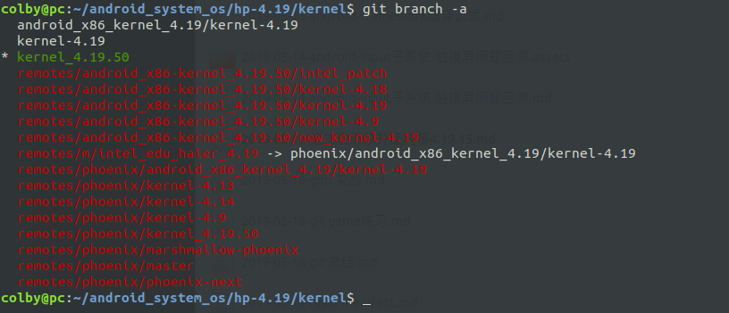
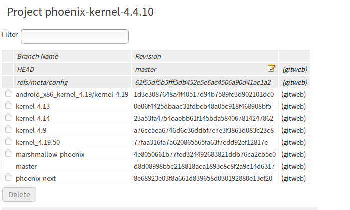

# 第二次继续升级内核4.19.15

## 1. 准备

### 1.2 版本回退，加.git

#### 1.2.1 之前内容记录

```shell
commit e5b09d7a37071d2279438340e8a711d3953626bf
Author: caobinxin <caobinxin@phoenixos.com>
Date:   Mon May 6 14:45:14 2019 +0800

    调整栈对齐

commit 4e7e4c756b3ad229652aaef16247bc341e79f411
Author: caobinxin <caobinxin@phoenixos.com>
Date:   Mon Apr 29 17:02:27 2019 +0800

    调试i915

commit def91c41330cd5aa61f9e7085053b537abe74a23
Author: caobinxin <caobinxin@phoenixos.com>
Date:   Mon Apr 29 11:15:04 2019 +0800

    kernel 4.19.15
```

```shell
colby@pc:~/android_system_os/haier/kernel$ git show e5b09d7a37071d2
commit e5b09d7a37071d2279438340e8a711d3953626bf
Author: caobinxin <caobinxin@phoenixos.com>
Date:   Mon May 6 14:45:14 2019 +0800

    调整栈对齐

diff --git a/arch/x86/Makefile b/arch/x86/Makefile
index ef5bad6cb0e9..575ae1bade85 100644
--- a/arch/x86/Makefile
+++ b/arch/x86/Makefile
@@ -16,7 +16,7 @@ endif
 # clang has the option -mstack-alignment for that purpose.
 ifneq ($(call cc-option, -mpreferred-stack-boundary=4),)
       cc_stack_align4 := -mpreferred-stack-boundary=2
-      cc_stack_align8 := -mpreferred-stack-boundary=3
+      cc_stack_align8 := -mpreferred-stack-boundary=4
 else ifneq ($(call cc-option, -mstack-alignment=16),)
       cc_stack_align4 := -mstack-alignment=4
       cc_stack_align8 := -mstack-alignment=8
```

```shell
colby@pc:~/android_system_os/haier/kernel$ git show 4e7e4c756b3ad229652aae
commit 4e7e4c756b3ad229652aaef16247bc341e79f411
Author: caobinxin <caobinxin@phoenixos.com>
Date:   Mon Apr 29 17:02:27 2019 +0800

    调试i915

diff --git a/arch/x86/configs/android-x86_64_defconfig b/arch/x86/configs/android-x86_64_defconfig
index 0aba48ed9e50..fea9d3c8f2fe 100644
--- a/arch/x86/configs/android-x86_64_defconfig
+++ b/arch/x86/configs/android-x86_64_defconfig
@@ -4799,7 +4799,7 @@ CONFIG_NOUVEAU_DEBUG=5
 CONFIG_NOUVEAU_DEBUG_DEFAULT=3
 # CONFIG_NOUVEAU_DEBUG_MMU is not set
 CONFIG_DRM_NOUVEAU_BACKLIGHT=y
-CONFIG_DRM_I915=m
+CONFIG_DRM_I915=y
 CONFIG_DRM_I915_ALPHA_SUPPORT=y
 CONFIG_DRM_I915_CAPTURE_ERROR=y
 CONFIG_DRM_I915_COMPRESS_ERROR=y
@@ -4809,14 +4809,14 @@ CONFIG_DRM_I915_GVT=y
 #
 # drm/i915 Debugging
 #
-# CONFIG_DRM_I915_WERROR is not set
-# CONFIG_DRM_I915_DEBUG is not set
-# CONFIG_DRM_I915_SW_FENCE_DEBUG_OBJECTS is not set
-# CONFIG_DRM_I915_SW_FENCE_CHECK_DAG is not set
-# CONFIG_DRM_I915_DEBUG_GUC is not set
-# CONFIG_DRM_I915_SELFTEST is not set
-# CONFIG_DRM_I915_LOW_LEVEL_TRACEPOINTS is not set
-# CONFIG_DRM_I915_DEBUG_VBLANK_EVADE is not set
+CONFIG_DRM_I915_WERROR=y
+CONFIG_DRM_I915_DEBUG=y
+CONFIG_DRM_I915_SW_FENCE_DEBUG_OBJECTS=y
+CONFIG_DRM_I915_SW_FENCE_CHECK_DAG=y
+CONFIG_DRM_I915_DEBUG_GUC=y
+CONFIG_DRM_I915_SELFTEST=y
+CONFIG_DRM_I915_LOW_LEVEL_TRACEPOINTS=y
+CONFIG_DRM_I915_DEBUG_VBLANK_EVADE=y
 CONFIG_DRM_VGEM=m
 # CONFIG_DRM_VKMS is not set
 CONFIG_DRM_VMWGFX=m

```

#### 1.2.2 版本回退

```shell
colby@pc:~/android_system_os/haier/kernel$ git reset --hard def91c41330cd5aa6
HEAD 现在位于 def91c41330c kernel 4.19.15
```

#### 1.2.3 社区代码拉入自己的库中

说明:

​	将社区代码的提交记录，放置到我们的代码库中

../../android_x86/kernel/ 就是这个/home/colby/android_system_os/android_x86/kernel

```shell
colby@pc:~/android_system_os/haier/kernel$　git remote add android_x86_kernel_4.19 ../../android_x86/kernel/
colby@pc:~/android_system_os/haier/kernel$　git fetch --all
```

1. 重新建立一个分支（android_x86_kernel_4.19）,远端指向社区代码所在的仓库
2. 然后在拉取代码


设置远端url

```shell
colby@pc:~/android_system_os/haier/kernel$ git remote -v
android_x86_kernel_4.19	../../android_x86/kernel/ (fetch)
android_x86_kernel_4.19	../../android_x86/kernel/ (push)
phoenix	ssh://caobinxin@192.168.1.112:29418/phoenix-kernel-4.4.10 (fetch)
phoenix	ssh://caobinxin@192.168.1.112:29418/phoenix-kernel-4.4.10 (push)


colby@pc:~/android_system_os/haier/kernel$ git remote set-url android_x86_kernel_4.19 ssh://caobinxin@192.168.1.112:29418/phoenix-kernel-4.4.10

colby@pc:~/android_system_os/haier/kernel$ git remote -v
android_x86_kernel_4.19	ssh://caobinxin@192.168.1.112:29418/phoenix-kernel-4.4.10 (fetch)
android_x86_kernel_4.19	ssh://caobinxin@192.168.1.112:29418/phoenix-kernel-4.4.10 (push)
phoenix	ssh://caobinxin@192.168.1.112:29418/phoenix-kernel-4.4.10 (fetch)
phoenix	ssh://caobinxin@192.168.1.112:29418/phoenix-kernel-4.4.10 (push)
```

3. 由于我们的远端源指向的是本地的目录，上面的流程是改变，远端的url，改为本地的

**同步到我们自己的服务器中：**

在升级 4.19.50 的时候，前面的流程都一样，不记录了，从同步到我们自己的代码服务器开始记录：

```shell
git checkout intel_patch #切换到 android_x86 可以工作的分支中
git checkout -b  kernel_4.19.50 # 创建分支
git push --set-upstream phoenix kernel_4.19.50 # 这个就可以同步到我们自己的服务器中
```




解释一下：

```shell
git push --set-upstream phoenix kernel_4.19.50 
由于 android_x86-kernel_4.19.50 和 phoenix 的地址是一样的，所以这里我们直接使用 phoenix 好了
```



从图中发现已经推送成功：

下面是配置工程：

```shell
hp-4.19/.repo/manifests$ git checkout -b intel_edu_haier_4.19 m/intel_edu_haier_4.19 
hp-4.19/.repo/manifests$ vim default.xml
```

将如下内容：

```xml
<project path="kernel" name="phoenix-kernel-4.4.10" remote="phoenix" revision="android_x86_kernel_4.19/kernel-4.19" />
```

改为：

```xml
<project path="kernel" name="phoenix-kernel-4.4.10" remote="phoenix" revision="kernel_4.19.50" />
```

到这里就算是配置完成。

### 1.3 脚本准备

抓取log

```shell
adb disconnect;adb connect 192.168.1.45;adb shell logcat | grep CHAOZHUO_COLBY > ~/logcat.hair
```


调试系统服务

com/android/server/SystemServer.java

```shell

cd ~/android_system_os/haier;source ./build/envsetup.sh;lunch android_x86_64-userdebug;make services

adb disconnect;adb connect 192.168.1.45; adb root; sleep 2s;adb push out/target/product/x86_64/system/framework/services.jar /system/framework/ ; adb shell stop ; sleep 1s ; adb shell start
```

调试android/hardware/camera2/CameraManager.java

调试android/hardware/Camera.java

```shell
cd ~/android_system_os/haier;source ./build/envsetup.sh;lunch android_x86_64-userdebug;make framework

adb disconnect;adb connect 192.168.1.45; adb root; sleep 2s;adb push out/target/product/x86_64/system/framework/framework.jar /system/framework/ ; adb shell stop ; sleep 1s ; adb shell start
```


### 1.4 java 函数调用栈

```java
//CHAOZHUO_COLBY
StackTraceElement stack[] = Thread.currentThread().getStackTrace();
```

### 1.5 binder app编程

https://www.cnblogs.com/punkisnotdead/p/5163464.html

### 1.6 系统服务的注册：


vim ./base/services/core/java/com/android/server/SystemService.java中找到的

```java
   protected final void publishBinderService(String name, IBinder service,                          
            boolean allowIsolated) {
        ServiceManager.addService(name, service, allowIsolated);
    }   

    /** 
     * Get a binder service by its name.
     */
    protected final IBinder getBinderService(String name) {
        return ServiceManager.getService(name);
    }   
```

## 2. 分析

摄像头服务注册：frameworks$ vim base/services/core/java/com/android/server/camera/CameraService.java +174

```java
    private static final String CAMERA_SERVICE_BINDER_NAME = "media.camera";

    public static final String CAMERA_SERVICE_PROXY_BINDER_NAME = "media.camera.proxy";

public void onStart() {
    publishBinderService(CAMERA_SERVICE_PROXY_BINDER_NAME, mCameraServiceProxy);
}

```

服务：

```java
    private final ICameraServiceProxy.Stub mCameraServiceProxy = new ICameraServiceProxy.Stub() {                                                                                                              
        @Override
        public void pingForUserUpdate() {
            notifySwitchWithRetries(30);
        }

        @Override
        public void notifyCameraState(String cameraId, int newCameraState) {
            String state = cameraStateToString(newCameraState);
            if (DEBUG) Slog.v(TAG, "Camera " + cameraId + " state now " + state);

            updateActivityCount(cameraId, newCameraState);
        }
    };
```


### 2.1 getLegacyParameters

./base/services/core/java/com/android/server/camera/CameraService.java