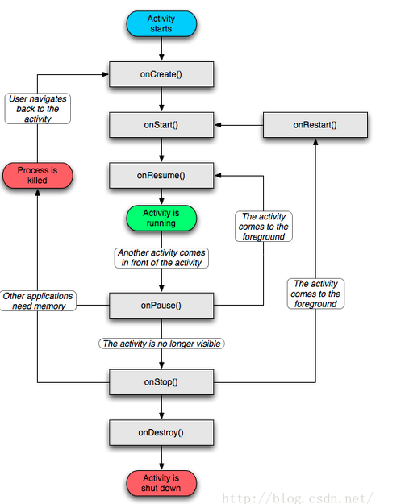

# camera 框架分析记录

## 1.参考资料准备

url: https://www.cnblogs.com/younghao/p/5337058.html

https://www.jianshu.com/p/1332d3864f7c


vim 格式化

https://blog.csdn.net/qachenzude/article/details/25511875

## 2.framework分析

### 2.1 Camera.java

/home/colby/android_system_os/haier/frameworks/base/core/java/android/hardware/Camera.java

```java
public static Camera open() {
        int numberOfCameras = getNumberOfCameras();
        CameraInfo cameraInfo = new CameraInfo();
        for (int i = 0; i < numberOfCameras; i++) {
            getCameraInfo(i, cameraInfo);
            if (cameraInfo.facing == CameraInfo.CAMERA_FACING_BACK) {
                return new Camera(i);
            }
        }
        return null;
    }
```

- getNumberOfCameras为native方法，实现在android_hardware_Camera.cpp中； 

- CameraInfo是Camera定义的静态内部类，包含facing、orientation、canDisableShutterSound；  

- getCameraInfo内部调用native方法_getCameraInfo获取摄像头信息；  

- open()默认启动的是后置摄像头（CAMERA_FACING_BACK）。

```java
/*Camera构造器的核心实现在cameraInitNormal中，cameraInitNormal调用cameraInitVersion，并传入参数cameraId和CAMERA_HAL_API_VERSION_NORMAL_CONNECT，后者代表HAL的版本。*/
Camera(int cameraId) {
        int err = cameraInitNormal(cameraId);
    }

private int cameraInitNormal(int cameraId) {
    //private static final int CAMERA_HAL_API_VERSION_NORMAL_CONNECT = -2;
        return cameraInitVersion(cameraId, CAMERA_HAL_API_VERSION_NORMAL_CONNECT);
    }


private int cameraInitVersion(int cameraId, int halVersion) {
        mShutterCallback = null;
        mRawImageCallback = null;
        mJpegCallback = null;
        mPreviewCallback = null;
        mPostviewCallback = null;
        mUsingPreviewAllocation = false;
        mZoomListener = null;

        Looper looper;
        if ((looper = Looper.myLooper()) != null) {
            mEventHandler = new EventHandler(this, looper);
        } else if ((looper = Looper.getMainLooper()) != null) {
            mEventHandler = new EventHandler(this, looper);
        } else {
            mEventHandler = null;
        }

        return native_setup(new WeakReference<Camera>(this), cameraId, halVersion,
                ActivityThread.currentOpPackageName());
    }

//cameraInitNormal调用本地方法native_setup()，由此进入到android_hardware_Camera.cpp中
private native final int native_setup(Object camera_this, int cameraId, int halVersion,
                                           String packageName);
```

### 2.2 jni 分析

haier/frameworks/base/core/jni/android_hardware_Camera.cpp

```c++
static const JNINativeMethod camMethods[] = {
    { "native_setup",                  
    "(Ljava/lang/Object;IILjava/lang/String;)I",
    (void*)android_hardware_Camera_native_setup },
}

static jint android_hardware_Camera_native_setup(JNIEnv *env, jobject thiz,
    jobject weak_this, jint cameraId, jint halVersion, jstring clientPackageName)
{
    //应用层的包名
    const char16_t *rawClientName = reinterpret_cast<const char16_t*>(env->GetStringChars(clientPackageName, NULL));    
    
    jsize rawClientNameLen = env->GetStringLength(clientPackageName);
    String16 clientName(rawClientName, rawClientNameLen);
    env->ReleaseStringChars(clientPackageName,reinterpret_cast<const jchar*>(rawClientName));
    
    sp<Camera> camera;
    if (halVersion == CAMERA_HAL_API_VERSION_NORMAL_CONNECT) {
        // Default path: hal version is don't care, do normal camera connect.
        camera = Camera::connect(cameraId, clientName,
                Camera::USE_CALLING_UID, Camera::USE_CALLING_PID);
    } 
}
```

Camera::connect()位于Camera.cpp中，由此进入到Library层。

### 2.3 Library层分析

frameworks/av/camera/Camera.cpp

```c++
sp<Camera> Camera::connect(int cameraId, const String16& clientPackageName,
        int clientUid, int clientPid)                         
{
    //typedef CameraBase<TCam>         CameraBaseT;//被重新定义了,而Camera 继承了　CameraBase<Camera>
    return CameraBaseT::connect(cameraId, clientPackageName, clientUid, clientPid);
}
```

frameworks/av/camera/CameraBase.cpp

CameraBase实际上又继承了IBinder的DeathRecipient内部类，DeathRecipient虚拟继承自RefBase。RefBase是Android中的引用计数基础类，其中定义了incStrong、decStrong、incWeak和decWeak等涉及sp/wp的指针操作函数，当然这扯远了。

/home/colby/android_system_os/haier/frameworks/av/include/camera/CameraBase.h

```c++
typedef typename TCamTraits::TCamListener       TCamListener;                     
typedef typename TCamTraits::TCamUser           TCamUser;
typedef typename TCamTraits::TCamCallbacks      TCamCallbacks;
typedef typename TCamTraits::TCamConnectService TCamConnectService;

typedef CameraBase<TCam>         CameraBaseT;//被重新定义了

//CameraBase是个模板
template <typename TCam, typename TCamTraits = CameraTraits<TCam> >
class CameraBase : public IBinder::DeathRecipient
{

}

template <typename TCam>
struct CameraTraits {                                                                                                                                                                                          
};
//CameraBase 的　TCamTraits　默认类型是　CameraTraits模板，

//CameraBase.cpp
template class CameraBase<Camera>;

```


```c++
//frameworks/av/include/camera/Camera.h
// Camera 继承了　CameraBase<Camera> 也同时继承了BnCameraClient
class Camera :public CameraBase<Camera>,public ::android::hardware::BnCameraClient
{
	friend class        CameraBase;
}


template <>
struct CameraTraits<Camera>{
    typedef CameraListener                     TCamListener;
    typedef ::android::hardware::ICamera       TCamUser;
    typedef ::android::hardware::ICameraClient TCamCallbacks;
    typedef ::android::binder::Status(::android::hardware::ICameraService::*TCamConnectService)
        (const sp<::android::hardware::ICameraClient>&,
        int, const String16&, int, int,
        /*out*/
        sp<::android::hardware::ICamera>*);
    static TCamConnectService     fnConnectService; 
};
```

继续分析CameraBase.cpp

回到Camera::connect()的实现上，其中，new TCam(cameraId)生成BnCameraClient对象，BnCameraClient定义在ICameraClient.h文件中，继承自模板类BnInterface。getCameraService()方法返回CameraService的服务代理BpCameraService，BpCameraService同样继承自模板类BnInterface。然后通过Binder通信发送CONNECT命令，当BnCameraService收到CONNECT命令后调用CameraService的connect()成员函数来做相应的处理。

```c++
#define LOG_TAG "CHAOZHUO_COLBY_CameraBase"//改变了tag

template <typename TCam, typename TCamTraits>
sp<TCam> CameraBase<TCam, TCamTraits>::connect(int cameraId,const String16& clientPackageName,int clientUid, int clientPid){

	//Tcam = Camera　; Camera 继承了　CameraBase<Camera> 也同时继承了BnCameraClient
	sp<TCam> c = new TCam(cameraId);//BnCameraClient　类型
	
	//::android::hardware::ICameraClient = TCamCallbacks
	sp<TCamCallbacks> cl = c;//ICameraClient  类型        
    
    const sp<::android::hardware::ICameraService> cs = getCameraService();//BpCameraService 类型　2.3.1 分析
    
    if (cs != nullptr) {
        TCamConnectService fnConnectService = TCamTraits::fnConnectService;
        ret = (cs.get()->*fnConnectService)(cl, cameraId, clientPackageName, clientUid, clientPid, /*out*/ &c->mCamera);//在2.3.２中进行分析
    }
    if (ret.isOk() && c->mCamera != nullptr) {
        IInterface::asBinder(c->mCamera)->linkToDeath(c);
        c->mStatus = NO_ERROR;
    } else {
        ALOGW("An error occurred while connecting to camera %d: %s", cameraId,
                (cs != nullptr) ? "Service not available" : ret.toString8().string());
        c.clear();
    }
    return c;
}


```

#### BnCameraClient

注：connect()函数在BpCameraService和BnCameraService的父类ICameraService中声明为纯虚函数，在BpCameraService和CameraService中分别给出了实现，BpCameraService作为代理类，提供接口给客户端，真正实现在BnCameraService的子类CameraService中。

```c++
class BnCameraClient: public BnInterface<ICameraClient>
{
public:
    virtual status_t    onTransact( uint32_t code,
                                    const Parcel& data,
                                    Parcel* reply,
                                    uint32_t flags = 0);
};
```

#### BpCameraService

```c++
class BpCameraService: public BpInterface<ICameraService>
{
public:
    BpCameraService(const sp<IBinder>& impl)
        : BpInterface<ICameraService>(impl)
    {
    }
    ……
}
```

#### 2.3.1 getCameraService分析

```c++
//CameraBase.cpp
template <typename TCam, typename TCamTraits>
const sp<::android::hardware::ICameraService> CameraBase<TCam, TCamTraits>::getCameraService()
{
    
    sp<IServiceManager> sm = defaultServiceManager();
    
    do {
        //const char* kCameraServiceName = "media.camera";
            binder = sm->getService(String16(kCameraServiceName));
            if (binder != 0) {
                break;
            }
            ALOGW("CameraService not published, waiting...");
            usleep(kCameraServicePollDelay);
        } while(true);
    
    if (gDeathNotifier == NULL) {      
            gDeathNotifier = new DeathNotifier();
        }
        binder->linkToDeath(gDeathNotifier);
        gCameraService = interface_cast<::android::hardware::ICameraService>(binder);
    return gCameraService;//这个就是ibinder借口，这个就可以通信了
}
```


#### 2.3.2 fnConnectService分析

Camera.cpp

```c++
CameraTraits<Camera>::TCamConnectService CameraTraits<Camera>::fnConnectService =         
        &::android::hardware::ICameraService::connect;//这里是一个地址
```

haier$ vim ./out/target/product/x86_64/obj/SHARED_LIBRARIES/libcamera_client_intermediates/aidl-generated/include/android/hardware/ICameraService.h

在out目录下我们可以推断出他是自动生成的ICameraService.h

现在在回过头来，看CameraBase.cpp

```c++
if (cs != nullptr) {
    
    	//TCamConnectService 是个函数指针　TCamTraits = CameraTraits<Camera>
        TCamConnectService fnConnectService = TCamTraits::fnConnectService;                                                                                                                                    
        ret = (cs.get()->*fnConnectService)(cl, cameraId, clientPackageName, clientUid,
                                               clientPid, /*out*/ &c->mCamera);
    	/*翻译过来就是　cs->connect(,,,,)*/
    }

//CameraBase.h
typedef typename TCamTraits::TCamConnectService TCamConnectService;

//Camera.h
//函数指针的依据
typedef　
::android::binder::Status(::android::hardware::ICameraService::*TCamConnectService)
    (const sp<::android::hardware::ICameraClient>&,
        int, const String16&, int, int,
        /*out*/
        sp<::android::hardware::ICamera>*);
```

vim out/target/product/x86_64/obj/SHARED_LIBRARIES/libcamera_client_intermediates/aidl-generated/src/aidl/android/hardware/ICameraService.cpp

connect 函数中的一句代码，由于，是aidl自动生成的，函数名太长，这里是自动进行binder通讯的，这个函数追到这里就不追了。

```c++
//connect [android::hardware::BpCameraService]
connect{
    _aidl_ret_status = remote()->transact(ICameraService::CONNECT, _aidl_data, &_aidl_reply);
}

```

从这里发出，接收也在这个文件里：这里不写函数名了直接贴代码

```c++
//onTransact [android::hardware::BnCameraService]
BnCameraService::onTransact{
    case Call::CONNECT:
    	//调用这里的connect函数
		::android::binder::Status _aidl_status(connect(in_client, in_cameraId, in_opPackageName, in_clientUid, in_clientPid, &_aidl_return));
}
```

这个connect是在CameraService.cpp中调用的

### 2.4 服务的分析CameraService.cpp

```shell
haier/frameworks/av$ vim ./services/camera/libcameraservice/CameraService.cpp
haier/frameworks/av$ vim ./services/camera/libcameraservice/CameraService.h
```

#### 2.4.1 继承关系

```c++
class CameraService :
    public BinderService<CameraService>,
    public ::android::hardware::BnCameraService,
    public IBinder::DeathRecipient,
    public camera_module_callbacks_t
{

}
```

#### 2.4.2 connect函数

```c++
//connect [android::CameraService]
Status CameraService::connect(
        const sp<ICameraClient>& cameraClient,
        int cameraId,
        const String16& clientPackageName,
        int clientUid,
        int clientPid,
        /*out*/
        sp<ICamera>* device) {

    ATRACE_CALL();
    Status ret = Status::ok();
    String8 id = String8::format("%d", cameraId);
    sp<Client> client = nullptr;
    //connectHelper 在2.4.3中分析
    ret = connectHelper<ICameraClient,Client>(cameraClient, id,
            CAMERA_HAL_API_VERSION_UNSPECIFIED, clientPackageName, clientUid, clientPid, API_1,
            /*legacyMode*/ false, /*shimUpdateOnly*/ false,
            /*out*/client);

    if(!ret.isOk()) {
        logRejected(id, getCallingPid(), String8(clientPackageName),
                ret.toString8());
        return ret;
    }

    *device = client;
    return ret;
}

```

最后，BpCamera实例是通过CameraService::connect()函数返回的。CameraService::connect()实现的核心是调用connectHelperLocked()函数根据HAL不同API的版本创建不同的client实例（早期版本中好像没有connectHelperLocked()这个函数，但功能基本相似）。

#### 2.4.3 connectHelper

```c++
CameraService::connectHelper(){
    
    if(!(ret = makeClient(this, cameraCb, clientPackageName, id, facing, clientPid,
                clientUid, getpid(), legacyMode, halVersion, deviceVersion, effectiveApiLevel,                                                                                                                 
                /*out*/&tmp)).isOk()) {
            return ret;
        }
    
    client->initialize(mModule);
}
```


```c++
status_t CameraClient::initialize(CameraModule *module) {


    mHardware = new CameraHardwareInterface(camera_device_name);
    res = mHardware->initialize(module);
    
    mHardware->setCallbacks(notifyCallback,             
            dataCallback,
            dataCallbackTimestamp,
            (void *)(uintptr_t)mCameraId);

}

```

```c++
//device1/CameraHardwareInterface.h:120　
status_t initialize(CameraModule *module)
    {   
        ALOGI("Opening camera %s", mName.string());
        camera_info info;
        status_t res = module->getCameraInfo(atoi(mName.string()), &info);
        if (res != OK) {
            return res;
        }   

        int rc = OK; 
        if (module->getModuleApiVersion() >= CAMERA_MODULE_API_VERSION_2_3 &&
            info.device_version > CAMERA_DEVICE_API_VERSION_1_0) {
            // Open higher version camera device as HAL1.0 device.
            ALOGI("CHAOZHUO_COLBY　在获得hw_device_t 时　，用的是openLegacy接口") ;                                                                                                                            
            rc = module->openLegacy(mName.string(),
                                     CAMERA_DEVICE_API_VERSION_1_0,
                                     (hw_device_t **)&mDevice);
        } else {
            ALOGI("CHAOZHUO_COLBY　在获得hw_device_t 时　，用的是open 接口") ;
            rc = module->open(mName.string(), (hw_device_t **)&mDevice);
            //mDevice 所有的操作都在这里
        }   
        if (rc != OK) {
            ALOGE("Could not open camera %s: %d", mName.string(), rc);
            return rc; 
        }   
        initHalPreviewWindow();
        return rc; 
    } 
```

使用hal的函数将通过这种方式使用：**mDevice->ops->**


上述函数中，主要注意以下流程：

1. 加粗的代码CameraHardwareInterface新建了了一个Camera硬件接口，当然，camera_device_name为摄像头设备名；  
2. mHardware->initialize(&module->common)调用底层硬件的初始化方法；  
3. mHardware->setCallbacks将CamerService处的回调函数注册到HAL处。

## 3.hal层分析

从这里开始分析

```c++
mHardware = new CameraHardwareInterface(camera_device_name);
    res = mHardware->initialize(module);
```

CameraHardwareInterface.h

```c++

```


```c++

```


### 3.1  找到hal层

CameraService.cpp

```c++
void CameraService::onFirstRef()
{
    camera_module_t *rawModule;
    int err = hw_get_module(CAMERA_HARDWARE_MODULE_ID,
            (const hw_module_t **)&rawModule);
    mModule = new CameraModule(rawModule);
    err = mModule->init();
}
```

### 3.2 camera_module_t

```c++
typedef struct camera_module {
    hw_module_t common;
    int (*get_number_of_cameras)(void);
    int (*get_camera_info)(int camera_id, struct camera_info *info);
    int (*set_callbacks)(const camera_module_callbacks_t *callbacks);
    void (*get_vendor_tag_ops)(vendor_tag_ops_t* ops);
    int (*open_legacy)(const struct hw_module_t* module, const char* id,
            uint32_t halVersion, struct hw_device_t** device);
    int (*set_torch_mode)(const char* camera_id, bool enabled);
    int (*init)();
	void* reserved[5];
} camera_module_t;
```

### 3.3 hal层头

CameraHal.cpp

```c++
camera_module_t HAL_MODULE_INFO_SYM = {               
    common: {
         tag:           HARDWARE_MODULE_TAG,
         version_major: 1,
         version_minor: 0,
         id:            CAMERA_HARDWARE_MODULE_ID,
         name:          "Camera Module",
         author:        "The Android Open Source Project",
         methods:       &android::CameraFactory::mCameraModuleMethods,
         dso:           NULL,
         reserved:      {0},
    },  
    get_number_of_cameras:  android::CameraFactory::get_number_of_cameras,
    get_camera_info:        android::CameraFactory::get_camera_info,
};
```

CameraFactory.cpp

```c++
struct hw_module_methods_t CameraFactory::mCameraModuleMethods = {
    open: CameraFactory::device_open
};

int CameraFactory::device_open(const hw_module_t* module,
                                       const char* name,
                                       hw_device_t** device)
{
    int camera_id = atoi(name);
    return gCameraFactory.cameraDeviceOpen(module, camera_id, device);                                         
}

int CameraFactory::cameraDeviceOpen(const hw_module_t* module,int camera_id, hw_device_t** device)
{

    *device = NULL;

    if (!mCamera[camera_id]) {
        mCamera[camera_id] = new CameraHardware(module, mCameraDevices[camera_id]);
    }
    return mCamera[camera_id]->connectCamera(device);
}

status_t CameraHardware::connectCamera(hw_device_t** device)                  
{

    *device = &common;//找到了
    return NO_ERROR;
}
```


### 3.4 jni层的调用

```c++
//然而并不是在　这里调用的
//而是在 CameraHardwareInterface::initialize 中调用的，在上面有

int CameraModule::open(const char* id, struct hw_device_t** device) {            
    int res;
    ATRACE_BEGIN("camera_module->open");
    res = filterOpenErrorCode(mModule->common.methods->open(&mModule->common, id, device));
    ATRACE_END();
    return res;
}
```

### 3.5 hal 层方法集合

/home/colby/android_system_os/haier/hardware/libhardware/include/hardware/camera.h

```c++
typedef struct camera_device_ops {
    int (*set_preview_window)(struct camera_device *,
            struct preview_stream_ops *window);

    void (*set_callbacks)(struct camera_device *,
            camera_notify_callback notify_cb,
            camera_data_callback data_cb,
            camera_data_timestamp_callback data_cb_timestamp,
            camera_request_memory get_memory,
            void *user);

    void (*enable_msg_type)(struct camera_device *, int32_t msg_type);

    void (*disable_msg_type)(struct camera_device *, int32_t msg_type);

    int (*msg_type_enabled)(struct camera_device *, int32_t msg_type);

    int (*start_preview)(struct camera_device *);

    void (*stop_preview)(struct camera_device *);
    
    int (*preview_enabled)(struct camera_device *);
    
    int (*store_meta_data_in_buffers)(struct camera_device *, int enable);
    
    int (*start_recording)(struct camera_device *);
    
    void (*stop_recording)(struct camera_device *);
    
    int (*recording_enabled)(struct camera_device *);

    void (*release_recording_frame)(struct camera_device *,
                    const void *opaque);


    int (*auto_focus)(struct camera_device *);


    int (*cancel_auto_focus)(struct camera_device *);


    int (*take_picture)(struct camera_device *);


    int (*cancel_picture)(struct camera_device *);
                                                                                           
    int (*set_parameters)(struct camera_device *, const char *parms);
      char *(*get_parameters)(struct camera_device *);

    void (*put_parameters)(struct camera_device *, char *);

    int (*send_command)(struct camera_device *,
                int32_t cmd, int32_t arg1, int32_t arg2);

    void (*release)(struct camera_device *);

    int (*dump)(struct camera_device *, int fd);
} camera_device_ops_t;


typedef struct camera_device {                                                             
    hw_device_t common;//找到common就能找到　　camera_device_ops_t　了
    camera_device_ops_t *ops;
    void *priv;
} camera_device_t;
```

## 4. 带着问题分析：

### 4.1  getLegacyParameters

描述：Java层调用这个函数haier/frameworks/base/core/java/android/hardware/camera2/CameraManager.java

```java
public CameraCharacteristics getCameraCharacteristics(@NonNull String cameraId)
            throws CameraAccessException {
    String parameters = cameraService.getLegacyParameters(id);
}
```


这里猜测是调用hal层的 CameraHardware.cpp

```c++
camera_device_ops_t CameraHardware::mDeviceOps = {
    CameraHardware::set_preview_window,
    CameraHardware::set_callbacks,
    CameraHardware::enable_msg_type,
    CameraHardware::disable_msg_type,
    CameraHardware::msg_type_enabled,
    CameraHardware::start_preview,
    CameraHardware::stop_preview,
    CameraHardware::preview_enabled,
    CameraHardware::store_meta_data_in_buffers,
    CameraHardware::start_recording,
    CameraHardware::stop_recording,                                                                                   
    CameraHardware::recording_enabled,
    CameraHardware::release_recording_frame,
    CameraHardware::auto_focus,
    CameraHardware::cancel_auto_focus,
    CameraHardware::take_picture,
    CameraHardware::cancel_picture,
    CameraHardware::set_parameters,
    CameraHardware::get_parameters,//猜测调用这个函数
    CameraHardware::put_parameters,
    CameraHardware::send_command,
    CameraHardware::release,
    CameraHardware::dump
};
```

```c++
char* CameraHardware::get_parameters(struct camera_device* dev)                                                       
{
    CameraHardware* ec = reinterpret_cast<CameraHardware*>(dev->priv);
    if (ec == NULL) {
        ALOGE("%s: Unexpected NULL camera device", __FUNCTION__);
        return NULL;
    }
    return ec->getParameters();
}

char* CameraHardware::getParameters()
{   
    ALOGD("CHAOZHUO_COLBY CameraHardware::getParameters");
    String8 params;      
    {
        Mutex::Autolock lock(mLock);
        params = mParameters.flatten();//最主要的是这个
    }
    
    char* ret_str = reinterpret_cast<char*>(malloc(sizeof(char) * (params.length()+1)));
    memset(ret_str, 0, params.length()+1);
    if (ret_str != NULL) {    
        strncpy(ret_str, params.string(), params.length()+1);
        return ret_str;
    }
    
    ALOGE("%s: Unable to allocate string for %s", __FUNCTION__, params.string());
    /* Apparently, we can't return NULL fron this routine. */
    return &lNoParam;    
}
```

现在是追击，这个参数mParameters是从那来的，是从底层读取的还是从上层传递过来的：

```c++
CameraHardware::CameraHardware(const hw_module_t* module, char* devLocation) :
mParameters(),{
    ALOGD("CHAOZHUO_COLBY mParameters: 0.0 构造函数中 此时为空") ;
    
    /* Common header */
    common.tag = HARDWARE_DEVICE_TAG;
    common.version = 0;
    common.module = const_cast<hw_module_t*>(module);
    common.close = CameraHardware::close;

    /* camera_device fields. */
    ops = &mDeviceOps;
    priv = this;

    // Power on camera
    PowerOn();

    // Init default parameters
    initDefaultParameters();// 在构造CameraHardware的时候就会默认调用这个

}

void CameraHardware::initDefaultParameters()
{
    CameraParameters p;
    ALOGD("CHAOZHUO_COLBY mParameters: 0.1 设置默认的 参数，这里首先填充的是p") ;
    p.set(CameraParameters::KEY_SUPPORTED_ANTIBANDING,"auto");
    p.set(CameraParameters::KEY_ANTIBANDING,"auto");
    ...
      
    ALOGD("CHAOZHUO_COLBY mParameters: 0.2 默认p 的内容是: %s\n", p) ;
    if (setParameters(p.flatten()) != NO_ERROR) {                   
        ALOGE("CameraHardware::initDefaultParameters: Failed to set default parameters.");
    }
}

status_t CameraHardware::setParameters(const char* parms)
{
    ALOGD("CHAOZHUO_COLBY mParameters: 0.3 将新的params 保存在 mParameters 中 ") ;               mParameters = params;
}
```

现在关系很明确，是谁构造的CameraHardware对象呢?

现在我们要清楚一点**CameraHardware 是继承了 camera_device **

```c++
class CameraHardware : public camera_device {
    
}
typedef struct camera_device {                                                             
    hw_device_t common;
    camera_device_ops_t *ops;
    void *priv;
} camera_device_t;
```

从上面的关系中，我们就不难发现，当我们jni能找到 hw_device_t common;也就能找到 我们的 ops，也就能找到我们的CameraHardware

接下来就在 jni层中进行查找：


从日志中分析可知：我们的摄像头是没有 camera.power_file 这个文件的

```c++
//CameraHardware.cpp
#define CAMERA_POWER_FILE  "camera.power_file"
bool CameraHardware::PowerOn() {
	mCameraPowerFile = new char[PROPERTY_VALUE_MAX];
    if (!property_get(CAMERA_POWER_FILE, mCameraPowerFile, "")) {
        ALOGD("CameraHardware::PowerOn: no power_file set");//相机0 在这是对的，相机1在这就是有问题的
        delete [] mCameraPowerFile;
        mCameraPowerFile = 0; 
        return true;
    }
    
    ...
}
```


**初步定位是 VIDIOC_ENUM_FMT ioctl有问题,并没有返回对应摄像机的内参**


## 5. 调试记录

### 5.1 脚本

```shell
cd ~/android_system_os/haier;source ./build/envsetup.sh;lunch android_x86_64-userdebug;make camera.x86

adb connect 192.168.1.45;adb root ; adb push out/target/product/x86_64/system/lib64/hw/camera.x86.so /system/lib64/hw/camera.x86.so

adb disconnect;adb connect 192.168.1.45;adb shell logcat | grep camera > ~/logcat.hair

adb disconnect;adb connect 192.168.1.45;adb shell stop ; sleep 2s; adb shell start
```


### 5.2  一个坑人的操作

在编译的时候，会自动打patch，导致新的修改会被丢弃

目录：/home/colby/android_system_os/haier/packages/apps/chaozhuo/CZApplyPatches/x86

修改方案：将对应的patch包，重新命名，让其找不到，

hardware_libcamera.patch 改为 hardware_libcamera_patch


### 5.3 摄像头参数

前置摄像头：

```shell
parameters=antibanding=auto;antibanding-values=auto;effect=none;effect-values=none;exposure-compensation=6;exposure-compensation-step=0.5;flash-mode=off;flash-mode-values=off;focal-length=4;focus-mode=fixed;focus-mode-values=fixed;horizontal-view-angle=90;jpeg-quality=85;jpeg-thumbnail-size-values=640x480,0x0;max-video-continuous-zoom=0;max-zoom=100;picture-format=jpeg;picture-format-values=jpeg;picture-size=0x0;picture-size-values=176x144,240x160,320x200,320x240,352x288,432x320,480x320;preferred-preview-size-for-video=640x480;preview-format=yuv422sp;preview-format-values=yuv422i-yuyv,yuv422sp,yuv420sp,yuv420p;preview-fps-range-values=;preview-frame-rate=0;preview-frame-rate-values=;preview-size=0x0;preview-size-values=176x144,240x160,320x200,320x240,352x288,432x320,480x320;rotation=0;rotation-values=0;scene-mode=auto;scene-mode-values=auto;smooth-zoom-supported=false;vertical-view-angle=90;video-frame-format=yuv420p;video-size=0x0;video-size-values=176x144,240x160,320x200,320x240,352x288,432x320,480x320;whitebalance=auto;whitebalance-values=auto;zoom=0;zoom-ratios=100;zoom-supported=false
```

后置摄像头：

## 6. 从头在分析一遍

### 6.1 app所在进程




#### 6.1.1 java

/home/colby/android_system_os/haier/development/samples/ApiDemos/src/com/example/android/apis/graphics/CameraPreview.java

```java
// 1. 步
//activity 才开始创建    
protected void onCreate(Bundle savedInstanceState) {
        super.onCreate(savedInstanceState);

        // Hide the window title.
        requestWindowFeature(Window.FEATURE_NO_TITLE);
        getWindow().addFlags(WindowManager.LayoutParams.FLAG_FULLSCREEN);

        // Create a RelativeLayout container that will hold a SurfaceView,
        // and set it as the content of our activity.
        mPreview = new Preview(this);//为了配合相机，生成preview类的实例化对象，用来负责在显示屏上执行绘画操作
        setContentView(mPreview);

        // Find the total number of cameras available
        numberOfCameras = Camera.getNumberOfCameras();//public native static

        // Find the ID of the default camera
        CameraInfo cameraInfo = new CameraInfo();
            for (int i = 0; i < numberOfCameras; i++) {
                Camera.getCameraInfo(i, cameraInfo);
                if (cameraInfo.facing == CameraInfo.CAMERA_FACING_BACK) {
                    defaultCameraId = i;//这才是这个for的真实目的，找到默认的后置摄像头
                }
            }
    }

// 3. 步
//activity可以在前台可见了
@Override
    protected void onResume() {
        super.onResume();

        // Open the default i.e. the first rear facing camera.
        mCamera = Camera.open();//这个时候打开的摄像头
        cameraCurrentlyLocked = defaultCameraId;//后置摄像头
        mPreview.setCamera(mCamera);
    }
```


- 分析 Preview对象

```java
// 1. 1 步
class Preview extends ViewGroup implements SurfaceHolder.Callback {
    Preview(Context context) {
        super(context);

        //SurfaceView 在系统视图层次结构中，为应用程序提供了专用的绘图空间（surface）。
        //在专用绘图空间中实施的所有绘图作业都在后台被处理，应用程序不必等到surface生成或者绘图作业完成的时候
        mSurfaceView = new SurfaceView(context);
        addView(mSurfaceView);

        // Install a SurfaceHolder.Callback so we get notified when the
        // underlying surface is created and destroyed.
        mHolder = mSurfaceView.getHolder();
        mHolder.addCallback(this);
        mHolder.setType(SurfaceHolder.SURFACE_TYPE_PUSH_BUFFERS);
    }
    
    // 2.  步
    //当surface 对象生成后，会自动回调这个方法surfaceCreated
    public void surfaceCreated(SurfaceHolder holder) {
        // The Surface has been created, acquire the camera and tell it where
        // to draw.
        try {
            //如果 该方法回调的时机，早于 activity的 onResume，mCamera为空，
            if (mCamera != null) {
                mCamera.setPreviewDisplay(holder);
            }
        } catch (IOException exception) {
            Log.e(TAG, "IOException caused by setPreviewDisplay()", exception);
        }
    }
    
    // 5. 步
    //当surface的属性发生改变的时候，将会调用 surfaceChanged()方法，并且画面的尺寸信息将作为参数传入其中。
    public void surfaceChanged(SurfaceHolder holder, int format, int w, int h) {
        // Now that the size is known, set up the camera parameters and begin
        // the preview.
        Camera.Parameters parameters = mCamera.getParameters();
        parameters.setPreviewSize(mPreviewSize.width, mPreviewSize.height);
        requestLayout();

        // 这个将在6.3 小节，具体的分析
        mCamera.setParameters(parameters);//根据实际的surface的信息，来设置相机的参数,并设置
        mCamera.startPreview();//开始预览
    }
    
    // 4. 步
    public void setCamera(Camera camera) {
        mCamera = camera;
        if (mCamera != null) {
            //拿到支持的预览的值
            //最后调用到 private native final String native_getParameters方法
            mSupportedPreviewSizes = mCamera.getParameters().getSupportedPreviewSizes();
            requestLayout();
        }
    }
    
    //当 surface销毁的时候，将调用这个 停止预览
    public void surfaceDestroyed(SurfaceHolder holder) {
        // Surface will be destroyed when we return, so stop the preview.
        if (mCamera != null) {
            mCamera.stopPreview();//最终会调用到（native） _stopPreview();
        }
    }
}
```

注意：

- 这里分析的时候，要始终考虑 activity和surface的生命周期的事，才能看的懂
- 这里暂时不贴Camera.java中的内容,6.1.2直接从他们所对应的jni开始分析

总结：

1. mCamera = Camera.open()
2. mCamera.startPreview()
3. mCamera.stopPreview();
4. 其中夹杂这 mCamera.getParameters()和mCamera.setParameters(parameters)
5. 在这些调用中，我暂时还没有看到关于相机跨进程通讯的借口IBinder，
6. 暂时猜测是 app->Camera.java -> native方法 -jni-> c++ 代码 -> IBinder借口（这些都是在一个进程中完成）

#### 6.1.2 jni

这里主要分析Camera.java的open函数

/home/colby/android_system_os/haier/frameworks/base/core/java/android/hardware/Camera.java

```shell
/home/colby/android_system_os/haier/frameworks/base/core/java/android/hardware/Camera.java
```

```java
// 1. mCamera = Camera.open() 主线程进来的

// 2.
public static Camera open() {
        int numberOfCameras = getNumberOfCameras();
        CameraInfo cameraInfo = new CameraInfo();
        for (int i = 0; i < numberOfCameras; i++) {
            getCameraInfo(i, cameraInfo);
            if (cameraInfo.facing == CameraInfo.CAMERA_FACING_BACK) {
                return new Camera(i);//这里new一个后置摄像头
            }
        }
        return null;
    }

// 3.
Camera(int cameraId) {
        int err = cameraInitNormal(cameraId);//
        if (checkInitErrors(err)) {
            if (err == -EACCES) {
                throw new RuntimeException("Fail to connect to camera service");
            } else if (err == -ENODEV) {
                throw new RuntimeException("Camera initialization failed");
            }
            // Should never hit this.
            throw new RuntimeException("Unknown camera error");
        }
    }
// 4. 
private int cameraInitNormal(int cameraId) {
    // CAMERA_HAL_API_VERSION_NORMAL_CONNECT = -2;
        return cameraInitVersion(cameraId, CAMERA_HAL_API_VERSION_NORMAL_CONNECT);
    }
// 5. 
private int cameraInitVersion(int cameraId = 后置摄像头, int halVersion = -2) {
        mShutterCallback = null;
        mRawImageCallback = null;
        mJpegCallback = null;
        mPreviewCallback = null;
        mPostviewCallback = null;
        mUsingPreviewAllocation = false;
        mZoomListener = null;

        Looper looper;
        if ((looper = Looper.myLooper()) != null) {
            mEventHandler = new EventHandler(this, looper);
        } else if ((looper = Looper.getMainLooper()) != null) {
            mEventHandler = new EventHandler(this, looper);
        } else {
            mEventHandler = null;
        }

        return native_setup(new WeakReference<Camera>(this), cameraId, halVersion,
                ActivityThread.currentOpPackageName());
    }

// 6. 
private native final int native_setup(Object camera_this, int cameraId, int halVersion,
                                           String packageName);
```

从这里开始，就进入c++ 层了

此时打点分析：

线程： 主线程

函数参数： 后置摄像头， hal层的版本号为 -2, app的包的名字

##### 6.1.2.1 jni 文件整体分析

base/core/jni/android_hardware_Camera.cpp分析

```c++
int register_android_hardware_Camera(JNIEnv *env)
{
    field fields_to_find[] = {
        { "android/hardware/Camera", "mNativeContext",   "J", &fields.context },
        { "android/hardware/Camera$CameraInfo", "facing",   "I", &fields.facing },
        { "android/hardware/Camera$CameraInfo", "orientation",   "I", &fields.orientation },
        { "android/hardware/Camera$CameraInfo", "canDisableShutterSound",   "Z",
          &fields.canDisableShutterSound },
        { "android/hardware/Camera$Face", "rect", "Landroid/graphics/Rect;", &fields.face_rect },
        { "android/hardware/Camera$Face", "leftEye", "Landroid/graphics/Point;", &fields.face_left_eye},
        { "android/hardware/Camera$Face", "rightEye", "Landroid/graphics/Point;", &fields.face_right_eye},
        { "android/hardware/Camera$Face", "mouth", "Landroid/graphics/Point;", &fields.face_mouth},
        { "android/hardware/Camera$Face", "score", "I", &fields.face_score },
        { "android/hardware/Camera$Face", "id", "I", &fields.face_id},
        { "android/graphics/Rect", "left", "I", &fields.rect_left },
        { "android/graphics/Rect", "top", "I", &fields.rect_top },
        { "android/graphics/Rect", "right", "I", &fields.rect_right },
        { "android/graphics/Rect", "bottom", "I", &fields.rect_bottom },
        { "android/graphics/Point", "x", "I", &fields.point_x},
        { "android/graphics/Point", "y", "I", &fields.point_y},
    };
    
    find_fields(env, fields_to_find, NELEM(fields_to_find));

    jclass clazz = FindClassOrDie(env, "android/hardware/Camera"); 
    fields.post_event = GetStaticMethodIDOrDie(env, clazz, "postEventFromNative",
                                               "(Ljava/lang/Object;IIILjava/lang/Object;)V");

    clazz = FindClassOrDie(env, "android/graphics/Rect");
    fields.rect_constructor = GetMethodIDOrDie(env, clazz, "<init>", "()V");

    clazz = FindClassOrDie(env, "android/hardware/Camera$Face");
    fields.face_constructor = GetMethodIDOrDie(env, clazz, "<init>", "()V");

    clazz = env->FindClass("android/graphics/Point");
    fields.point_constructor = env->GetMethodID(clazz, "<init>", "()V");
    if (fields.point_constructor == NULL) {
        ALOGE("Can't find android/graphics/Point()");
        return -1;
    }    
    
    // Register native functions 
    return RegisterMethodsOrDie(env, "android/hardware/Camera", camMethods, NELEM(camMethods));                                                                                                                
}
```

这里抛出一个疑问，我们在java中要用c的函数，都是要去加载so库的，但是我找了Camera.java中没有发现有加载库的地方，今天就来探个究竟

```c++
// 1.
void AndroidRuntime::start(...){
    /*
     * Register android functions.
     */
    if (startReg(env) < 0) {
        ALOGE("Unable to register all android natives\n");
        return;
    }
}

// 2. 
/*
 * Register android native functions with the VM.
 */
/*static*/ int AndroidRuntime::startReg(JNIEnv* env){
    if (register_jni_procs(gRegJNI, NELEM(gRegJNI), env) < 0) {           
        env->PopLocalFrame(NULL);
        return -1;
    }
}

//数组
static const RegJNIRec gRegJNI[] = {
    ...
    REG_JNI(register_android_hardware_Camera),
    ...
};


// 1. 另外一种加载的时机，就是surface flinger's DdmConnection 加载的
/**
 * Used by surface flinger's DdmConnection to register native methods from
 * the framework.
 */                       
extern "C" jint registerFrameworkNatives(JNIEnv* env) {
    return register_jni_procs(gRegJNI, NELEM(gRegJNI), env);
}
```

从这段分析可以看出来，我们系统层面用的jni库在 AndroidRuntime::start() 就已经给我们准备好了。不用单独加载了。


##### 6.1.2.2 native_setup 分析

继续分析 native_setup的执行流程：

回忆一下此时，线程处于主线程, 函数参数： 后置摄像头， hal层的版本号为 -2, app的包的名字

```c++
static const JNINativeMethod camMethods[] = {
    { "native_setup",
    "(Ljava/lang/Object;IILjava/lang/String;)I",
    (void*)android_hardware_Camera_native_setup },
}

//1.  主要是连接 camera service
// connect to camera service
static jint android_hardware_Camera_native_setup(JNIEnv *env, jobject thiz,
    jobject weak_this, jint cameraId, jint halVersion, jstring clientPackageName)
{
    sp<Camera> camera;
    // CAMERA_HAL_API_VERSION_NORMAL_CONNECT = -2
    if (halVersion == CAMERA_HAL_API_VERSION_NORMAL_CONNECT) {
        // Default path: hal version is don't care, do normal camera connect.
        camera = Camera::connect(cameraId, clientName,
                Camera::USE_CALLING_UID, Camera::USE_CALLING_PID);
    }
}


//2.
sp<Camera> Camera::connect(int cameraId, const String16& clientPackageName,
        int clientUid, int clientPid)
{
    return CameraBaseT::connect(cameraId, clientPackageName, clientUid, clientPid);
}

//3.
template <typename TCam, typename TCamTraits>
sp<TCam> CameraBase<TCam, TCamTraits>::connect(int cameraId,
                                               const String16& clientPackageName,
                                               int clientUid, int clientPid)
{
    //TCam 是Camera类
    sp<TCam> c = new TCam(cameraId); //对应第4步 创建一个 camera实例
    sp<TCamCallbacks> cl = c;/*BnCameraClient 对象,对应于服务端的BpCameraClient*/
    /*
    	这里补充一点： TCam 就是 Camera类，这里看一下 Camera的继承关系
    	class Camera : public CameraBase<Camera>,public BnCameraClient
    	这里我们发现 Camera 继承了 BnCameraClient,也就是说 此地的Camera是一个 服务，不过这个服务是没有 注册到 ServiceManager中的。
    
    */
    const sp<::android::hardware::ICameraService> cs = getCameraService();// 对应第6步
    
    if (cs != nullptr) {
        TCamConnectService fnConnectService = TCamTraits::fnConnectService;
        ret = (cs.get()->*fnConnectService)(cl, cameraId, clientPackageName, clientUid,
                                               clientPid, /*out*/ &c->mCamera/*这个就是BpCamera*/);//对应7步
        
        // 这里值得注意的是 将 c 传入了 connect函数中，  这句类似于 c->mCamera = cs->connect(c);
        // c->mCamera中将放置 BpCamera 对应于服务端的 BnCamera
    }
}

// 4.
Camera::Camera(int cameraId)
    : CameraBase(cameraId)
{
}  
// 5.
template <typename TCam, typename TCamTraits>
CameraBase<TCam, TCamTraits>::CameraBase(int cameraId) :                     
    mStatus(UNKNOWN_ERROR),   
    mCameraId(cameraId)
{   
}

// 6.
// establish binder interface to camera service
template <typename TCam, typename TCamTraits>
const sp<::android::hardware::ICameraService> CameraBase<TCam, TCamTraits>::getCameraService()
{
 		sp<IServiceManager> sm = defaultServiceManager();
        sp<IBinder> binder;
        do {
            //kCameraServiceName="media.camera"
            //很开心，这里我们已经拿到了 跨进程通讯的Binder接口
            binder = sm->getService(String16(kCameraServiceName));//从这里我们可以看到我们去获得了这个服务
            if (binder != 0) {
                break;
            }
            ALOGW("CameraService not published, waiting...");
            usleep(kCameraServicePollDelay);
        } while(true);
        if (gDeathNotifier == NULL) {
            gDeathNotifier = new DeathNotifier();
        }
        binder->linkToDeath(gDeathNotifier);
        gCameraService = interface_cast<::android::hardware::ICameraService>(binder); 
    
    return gCameraService;//从这里我们就得出一个结论，c的服务只能有c来直接获得，java只能通过jni借助c来获得系统服务
}

//给函数指针赋值
CameraTraits<Camera>::TCamConnectService CameraTraits<Camera>::fnConnectService =
        &::android::hardware::ICameraService::connect;

//7. ICameraService->connect,这儿就是Ibiner通讯的封装了
out$ vim ./target/product/x86_64/obj/SHARED_LIBRARIES/libcamera_client_intermediates/aidl-generated/src/aidl/android/hardware/ICameraService.cpp
//这个文件是自动生成的，这里简单分析

BpCameraService::connect(){

	_aidl_ret_status = _aidl_data.writeStrongBinder(::android::hardware::ICameraClient::asBinder(client));
	/*
		将参数传递过来的Camera实例(继承了BnCameraClient) 转换为Binder对象后，保存到BinderRPC数据中，以便传递。在保存Binder对象时，BinderDriver将为Camera分配新的Binder节点，且Camera以服务的形式运行。并且在 BInderRPC数据的接收端将使用Camera的Binder对象为Camera生成服务代理BpCameraClient实例对象。
		
	*/
	_aidl_ret_status = remote()->transact(ICameraService::CONNECT, _aidl_data, &_aidl_reply);
	//注意，这里，我们的主线程就会 暂停等待了，此时就要借助我们的binder驱动来通讯了
	
	_aidl_ret_status = _aidl_reply.readStrongBinder(_aidl_return/*这个就是BpCamera*/); 
}
```

### 6.2 跨进程了

此时我们分析到，app的主进程已经暂停，binder驱动将我们的数据传递到 CameraService，并且从线程池中拿了一个线程，来执行我们接下来的connect任务

**线程池中拿一个线程**

#### 6.2.1 服务注册和启动

从上面的分析中，我们很明确，我们找的服务叫做 media.camera

##### 6.2.1.1 启动

frameworks/av/camera/cameraserver$ cat cameraserver.rc

```shell
service cameraserver /system/bin/cameraserver
    class main
    user cameraserver
    group audio camera input drmrpc
    ioprio rt 4
    writepid /dev/cpuset/camera-daemon/tasks /dev/stune/top-app/tasks
```

该目录下面的Android.mk文件可以好好分析一下

```makefile
LOCAL_PATH:= $(call my-dir)

ifeq ($(TARGET_HAS_LEGACY_CAMERA_HAL1),true)
$(warning Target has integrated cameraserver into mediaserver. This is weakening security measures introduced in 7.0)
else
include $(CLEAR_VARS)

LOCAL_SRC_FILES:= \
	main_cameraserver.cpp

LOCAL_SHARED_LIBRARIES := \
	libcameraservice \#需要用到 这个so
	libcutils \
	libutils \
	libbinder \
	libcamera_client#需要用到 这个so 
#??? libcameraservice.so libcamera_client.so 都做了些啥事，在那处理的

LOCAL_MODULE:= cameraserver # 这个是个二进制可执行文件
LOCAL_32_BIT_ONLY := true

LOCAL_CFLAGS += -Wall -Wextra -Werror -Wno-unused-parameter

LOCAL_INIT_RC := cameraserver.rc #拷贝 rc文件到什么地方，就不知道了

include $(BUILD_EXECUTABLE)
endif
```


##### 6.2.1.2 服务注册

frameworks/av/camera/cameraserver$ cat main_cameraserver.cpp

```c++
int main(int argc __unused, char** argv __unused)
{
    signal(SIGPIPE, SIG_IGN);
    sp<ProcessState> proc(ProcessState::self());
    sp<IServiceManager> sm = defaultServiceManager();
    ALOGI("ServiceManager: %p", sm.get());
    CameraService::instantiate();//其实是在这里注册的
    ProcessState::self()->startThreadPool();//这个就是那个线程池
    IPCThreadState::self()->joinThreadPool();
}
```

找了好久CameraService::instantiate()中就没有这个函数的实现，那说明在他的父类中的

这里就来首先揭秘libcameraservice.so在那进行编译的

```shell
frameworks$ grep -inR "libcameraservice" --include=Android.mk
av/services/camera/libcameraservice/Android.mk:99:LOCAL_MODULE:= libcameraservice
```

```c++
//首先要明白这个继承关系 BinderService
class CameraService :
    public BinderService<CameraService>,
    public ::android::hardware::BnCameraService,
    public IBinder::DeathRecipient,
    public camera_module_callbacks_t
{

}
//看看BinderService 中有没有 instantiate 函数，
```

```shell
frameworks$ find -name BinderService.h
./native/include/binder/BinderService.h
```

```c++
template<typename SERVICE>
class BinderService
{
public:
    // 2.
    static status_t publish(bool allowIsolated = false) {
        sp<IServiceManager> sm(defaultServiceManager());
        return sm->addService(
            //SERVICE就是CameraService，这里我们在看CameraService的getServiceName()
                String16(SERVICE::getServiceName()),
                new SERVICE(), allowIsolated);
    }   

    static void publishAndJoinThreadPool(bool allowIsolated = false) {
        publish(allowIsolated);
        joinThreadPool();
    }   

    // 1.
    static void instantiate() { publish(); } // 哎居然有，     
    
    static status_t shutdown() { return NO_ERROR; }

private:
    static void joinThreadPool() {
        sp<ProcessState> ps(ProcessState::self());
        ps->startThreadPool();
        ps->giveThreadPoolName();
        IPCThreadState::self()->joinThreadPool();
    }   
};
```

```shell
frameworks/av/services/camera/libcameraservice$ grep -inR "getServiceName"
CameraService.h:95:    static char const* getServiceName() { return "media.camera"; }
```

**此时，我们可以得出结论了，我们在app端主线程找的服务就是这个服务了，**

#### 6.2.2 connect分析

当客户端调用 remote->transact，服务端对应的会调用ontransact()

```c++
//1. 在自动生成的ICameraService.cpp文件中 在out目录下面搜索
BnCameraService::onTransact(){ 
    case Call::CONNECT:
    	sp<ICameraClient> in_client;
    	sp<ICamera> _aidl_return;
        _aidl_ret_status = _aidl_data.readStrongBinder(&in_client);//BpCameraClient
		connect(in_client/*BpCameraClient*/, in_cameraId, in_opPackageName, in_clientUid, in_clientPid, &_aidl_return/*BnCamera*/);// 2. 
    
    _aidl_reply->writeStrongBinder(ICamera::asBinder(_aidl_return/*BnCamera*/));
    /*
    	这里又有一个 asBinder ,和上面的那个很类似 我猜测  _aidl_return 继承了 BnCamera, 当执行完asBinder后，，相当是有启动了一个 服务，不过，这个服务并没有注册到 ServiceManager中
    	
    	客户端							服务端
    	1.发送BnCameraClient
    								2.按照BpCameraClient接收
    								3.产生BnCamera 并发送
    	4.按照BpCamera接收	
    */
}


//2. 
// ./services/camera/libcameraservice/CameraService.cpp
Status CameraService::connect(
        const sp<ICameraClient>& cameraClient/*BpCameraClient*/,
        int cameraId,
        const String16& clientPackageName,
        int clientUid,
        int clientPid,
        /*out*/
        sp<ICamera>* device) {

    ATRACE_CALL();
    Status ret = Status::ok();
    String8 id = String8::format("%d", cameraId);
    sp<Client> client = nullptr;/*BnCamera*/
    
    /*在6.2.2.1 小节中去详细分析*/
    ret = connectHelper<ICameraClient,Client>(cameraClient, id,
            CAMERA_HAL_API_VERSION_UNSPECIFIED, clientPackageName, clientUid, clientPid, API_1,
            /*legacyMode*/ false, /*shimUpdateOnly*/ false,
            /*out*/client);

    if(!ret.isOk()) {
        logRejected(id, getCallingPid(), String8(clientPackageName),
                ret.toString8());          
        return ret; 
    }    

    *device = client;/*返回了*/
    return ret; 
}
```


总结一下：

1. 首先客户端通过 ServiceManager 获取到 CameraService
2. 此时客户端已经拿到了跨进程通信的Ibinder接口了
3. 然后客户端启动一个服务BnCameraClient
4. 然后客户端借助Ibinder接口中的connect函数，将BnCameraClient的IBInder接口发送给 服务端 
5. 服务端保存 Ibinder接口(BpCameraClient), 然后创建BnCamera服务，
6. 然后服务借助 Ibinder接口返回  BnCamera的Ibiner接口

在这其中创建的两个服务 BnCameraClient和BnCameraClient都没有注册到 ServiceManager中，**说明：不是谁都能访问这两个服务的。**

##### 6.2.2.1 connectHelper

./av/services/camera/libcameraservice/CameraService.cpp

```c++
Status CameraService::connect(
        const sp<ICameraClient>& cameraClient,
        int cameraId,
        const String16& clientPackageName,
        int clientUid,
        int clientPid,
        /*out*/
        sp<ICamera>* device) {

    ATRACE_CALL();
    Status ret = Status::ok();
    String8 id = String8::format("%d", cameraId);
    sp<Client> client = nullptr;
    ret = connectHelper<ICameraClient,Client>(cameraClient, id,                                                       
            CAMERA_HAL_API_VERSION_UNSPECIFIED, clientPackageName, clientUid, clientPid, API_1,
            /*legacyMode*/ false, /*shimUpdateOnly*/ false,
            /*out*/client);

    if(!ret.isOk()) {
        logRejected(id, getCallingPid(), String8(clientPackageName),
                ret.toString8());
        return ret; 
    }    

    *device = client;
    return ret; 
}

```

```c++
template<class CALLBACK, class CLIENT>
binder::Status CameraService::connectHelper(
    const sp<CALLBACK>& cameraCb, /*传入的BpCameraClient*/
    const String8& cameraId,
    int halVersion, 
    const String16& clientPackageName, 
    int clientUid, int clientPid,
    apiLevel effectiveApiLevel, 
    bool legacyMode, 
    bool shimUpdateOnly,
    /*out*/sp<CLIENT>& device /*传出 BnCamera*/
    ) 
{
    makeClient(this, 
               cameraCb, /*传入的BpCameraClient*/
               clientPackageName, 
               id, 
               facing, 
               clientPid,
               clientUid, 
               getpid(), 
               legacyMode, 
               halVersion, 
               deviceVersion, 
               effectiveApiLevel,
                /*out*/&tmp));/*传出 BnCamera*/
    
    client = static_cast<CLIENT*>(tmp.get());
    
    // 这个还要重点分析 6.2.2.2 小节
    // 这里的mModule 在那初始化的
    client->initialize(mModule)；// 这个接口就是初始化相机设备用的，估计和hal层有关系
    
    device = client;
}

// 最主要看 makeClient都干了些啥事情
Status CameraService::makeClient(
    const sp<CameraService>& cameraService,
    const sp<IInterface>& cameraCb, /*传入的BpCameraClient*/
    const String16& packageName, 
    int cameraId,                                    
    int facing, 
    int clientPid, 
    uid_t clientUid, 
    int servicePid, 
    bool legacyMode,
    int halVersion, 
    int deviceVersion, 
    apiLevel effectiveApiLevel,
    /*out*/sp<BasicClient>* client) /*传出 BnCamera*/
{
    sp<ICameraClient> tmp = static_cast<ICameraClient*>(cameraCb.get());
    
    /*传出 BnCamera*/
    *client = new CameraClient(
        cameraService, 
        tmp, /*传入的BpCameraClient*/
        packageName, 
        cameraId, 
        facing,                             
        clientPid, 
        clientUid, 
        servicePid, 
        legacyMode);
}


CameraClient::CameraClient(
    const sp<CameraService>& cameraService,
    const sp<hardware::ICameraClient>& cameraClient,
    const String16& clientPackageName,
    int cameraId, 
    int cameraFacing,
    int clientPid, 
    int clientUid,
    int servicePid, 
    bool legacyMode)
    :// 重点关注这个
        Client(cameraService, cameraClient, clientPackageName,
                cameraId, cameraFacing, clientPid, clientUid, servicePid)
{
   int callingPid = getCallingPid();
    LOG1("CameraClient::CameraClient E (pid %d, id %d)", callingPid, cameraId);

    mHardware = NULL;// 重点关注这个 这个和 6.2.2.2分析的有关系
    mMsgEnabled = 0; 
    mSurface = 0; 
    mPreviewWindow = 0; 
    mDestructionStarted = false;

    // Callback is disabled by default
    mPreviewCallbackFlag = CAMERA_FRAME_CALLBACK_FLAG_NOOP;
    mOrientation = getOrientation(0, mCameraFacing == CAMERA_FACING_FRONT);
    mLegacyMode = legacyMode;
    mPlayShutterSound = true;

    mLongshotEnabled = false;
    mBurstCnt = 0; 
    LOG1("CameraClient::CameraClient X (pid %d, id %d)", callingPid, cameraId);
}


CameraService::Client::Client(const sp<CameraService>& cameraService,                 
        const sp<ICameraClient>& cameraClient,
        const String16& clientPackageName,
        int cameraId, int cameraFacing,
        int clientPid, uid_t clientUid,
        int servicePid) :
        CameraService::BasicClient(cameraService,
                IInterface::asBinder(cameraClient),
                clientPackageName,
                cameraId, cameraFacing,
                clientPid, clientUid,
                servicePid)
{
    int callingPid = getCallingPid();
    LOG1("Client::Client E (pid %d, id %d)", callingPid, cameraId);

    mRemoteCallback = cameraClient;/*从这里我们就知道  我们将 传入的BpCameraClient 保存在这个里面*/

    cameraService->loadSound();

    LOG1("Client::Client X (pid %d, id %d)", callingPid, cameraId);
}

```


继续看一下 继承关系：

```c++
class CameraClient : public CameraService::Client{}

class Client : public hardware::BnCamera, public BasicClient{}


sp<hardware::ICameraClient> mRemoteCallback;
class ICameraClient: public IInterface{}
class IInterface : public virtual RefBase
```

**这里也进一步证明了 我们在 服务端 又创建了一个新的服务 BnCamera ,这个就是作证。**

**将客户端创建的BnCameraClient 保存在服务端的 mRemoteCallback**


总结：

connectHelper干了两件事：

1. 将BpCameraClient保存在mRemoteCallback 中
2. 创建一个新的服务 BnCamera


##### 6.2.2.2 initialize

场景回顾：

```c++
class CameraModule { 
    // 析构
    CameraModule(camera_module_t *module);/*居然看到了 camera_module_t 它和 hw_module_t 是不是有关系呢？*/
}

CameraModule*     mModule;

//具体分析看前面的
connectHelper(){
    ....
  	if ((err = client->initialize(mModule)) != OK) {
        
    }  
    
    ....
}
```

首先要搞明白 mModule在那进行的初始化：

```c++
// onFirstRef这个函数应该是在  服务刚开始起来的时候，就开始回调了
void CameraService::onFirstRef(){
    ALOGI("CameraService process starting");
    camera_module_t *rawModule;
    int err = hw_get_module(CAMERA_HARDWARE_MODULE_ID,
            (const hw_module_t **)&rawModule);
    mModule = new CameraModule(rawModule);
}
```


frameworks/av/services/camera$ vim libcameraservice/api1/CameraClient.cpp +43

这里只分析 CameraClient 的，这里还有Camera2Client等等的，类似

```c++
status_t CameraClient::initialize(CameraModule *module) {
    int callingPid = getCallingPid();
    status_t res; 

    
    res = startCameraOps();// 1. 

    char camera_device_name[10];
    snprintf(camera_device_name, sizeof(camera_device_name), "%d", mCameraId);

    mHardware = new CameraHardwareInterface(camera_device_name);// 2. 
    res = mHardware->initialize(module); // 3. 

    mHardware->setCallbacks(notifyCallback,
            dataCallback,
            dataCallbackTimestamp,
            (void *)(uintptr_t)mCameraId);// 4.  在6.2.2.3 中进行详细的分析


    
    return OK;
}

```


```c++
// 2. 
CameraHardwareInterface(const char *name):
            mDevice(nullptr),
            mName(name),
            mPreviewScalingMode(NOT_SET),
            mPreviewTransform(NOT_SET),
            mPreviewWidth(NOT_SET),
            mPreviewHeight(NOT_SET),                                                                                                                                                                           
            mPreviewFormat(NOT_SET),
            mPreviewUsage(0),
            mPreviewSwapInterval(NOT_SET),
            mPreviewCrop{NOT_SET,NOT_SET,NOT_SET,NOT_SET}
    {   
    }

// 3. 
status_t initialize(CameraModule *module)
    {
        ALOGI("Opening camera %s", mName.string());
        camera_info info;
        status_t res = module->getCameraInfo(atoi(mName.string()), &info);
        if (res != OK) {
            return res;
        }

        int rc = OK;
        if (module->getModuleApiVersion() >= CAMERA_MODULE_API_VERSION_2_3 &&
            info.device_version > CAMERA_DEVICE_API_VERSION_1_0) {
            // Open higher version camera device as HAL1.0 device.
            ALOGI("CHAOZHUO_COLBY　在获得hw_device_t 时　，用的是openLegacy接口") ;
            rc = module->openLegacy(mName.string(),
                                     CAMERA_DEVICE_API_VERSION_1_0,
                                     (hw_device_t **)&mDevice);
        } else {
            ALOGI("CHAOZHUO_COLBY　在获得hw_device_t 时　，用的是open 接口") ;
            rc = module->open(mName.string(), (hw_device_t **)&mDevice);
        }
        if (rc != OK) {
            ALOGE("Could not open camera %s: %d", mName.string(), rc);
            return rc;
        }
        initHalPreviewWindow();
        return rc;
    }
```

将 hal 层的方法集合 都放在 mDevice中了。

##### 6.2.2.3 setCallbacks

这儿的分析是 接着 6.2.2.2 中的第 4 步进行分析

haier/frameworks/av/services/camera/libcameraservice$ vim api1/CameraClient.cpp +90

```cpp
status_t CameraClient::initialize(CameraModule *module) {
    int callingPid = getCallingPid();
    status_t res; 

    LOG1("CameraClient::initialize E (pid %d, id %d)", callingPid, mCameraId);

    // Verify ops permissions
    res = startCameraOps();
    if (res != OK) {
        return res; 
    }    

    char camera_device_name[10];
    snprintf(camera_device_name, sizeof(camera_device_name), "%d", mCameraId);

    mHardware = new CameraHardwareInterface(camera_device_name);
    res = mHardware->initialize(module);
    if (res != OK) {
        ALOGE("%s: Camera %d: unable to initialize device: %s (%d)",
                __FUNCTION__, mCameraId, strerror(-res), res);
        mHardware.clear();
        return res; 
    }    

    // sp<CameraHardwareInterface>     mHardware;
    // 这个地方和 相机把准备好的 图片返回给  app层的 路线有很大的关系，
    
    /* 其中这里传入的 notifyCallback 要着重进行分析，这个和 图片回传有很大的关系*/
    mHardware->setCallbacks(notifyCallback,
            dataCallback,
            dataCallbackTimestamp,
            (void *)(uintptr_t)mCameraId);

    // Enable zoom, error, focus, and metadata messages by default
    enableMsgType(CAMERA_MSG_ERROR | CAMERA_MSG_ZOOM | CAMERA_MSG_FOCUS |
                  CAMERA_MSG_PREVIEW_METADATA | CAMERA_MSG_FOCUS_MOVE);

    LOG1("CameraClient::initialize X (pid %d, id %d)", callingPid, mCameraId);
    return OK;
}
```

这里先暂时 notifyCallback 把代码贴到这里，有这么会事，在后面的 6.4.2.2 中会详细分析的

```cpp
void CameraClient::notifyCallback(int32_t msgType, int32_t ext1,                                                      
        int32_t ext2, void* user) {
    LOG2("notifyCallback(%d)", msgType);

    sp<CameraClient> client = static_cast<CameraClient*>(getClientFromCookie(user).get());
    if (client.get() == nullptr) return;

    if (!client->lockIfMessageWanted(msgType)) return;

    switch (msgType) {
        case CAMERA_MSG_SHUTTER:
            // ext1 is the dimension of the yuv picture.
            client->handleShutter();
            break;
        default:
            client->handleGenericNotify(msgType, ext1, ext2);
            break;
    }
}
```


```cpp
sp<CameraHardwareInterface>     mHardware;

// setCallbacks [android::CameraHardwareInterface]
void setCallbacks(notify_callback notify_cb,                                                                      
                      data_callback data_cb,
                      data_callback_timestamp data_cb_timestamp,
                      void* user)
    {
        mNotifyCb = notify_cb;/* 这个 被保存在了 mNotifyCb 中，并没有继续向下传递*/
        mDataCb = data_cb;
        mDataCbTimestamp = data_cb_timestamp; 
        mCbUser = user;
    
        ALOGV("%s(%s)", __FUNCTION__, mName.string());

        if (mDevice->ops->set_callbacks) {
            // 在这里就调用到了 hal 层哦
            mDevice->ops->set_callbacks(mDevice,
                                   __notify_cb,/*这儿 传递了一个默认的*/
                                   __data_cb,
                                   __data_cb_timestamp,
                                   __get_memory,
                                   this);
        }
    }

```

```cpp

static void __notify_cb(int32_t msg_type, int32_t ext1,                                                           
                            int32_t ext2, void *user)
    {
        ALOGV("%s", __FUNCTION__);
        CameraHardwareInterface *__this =
                static_cast<CameraHardwareInterface *>(user);
        __this->mNotifyCb(msg_type, ext1, ext2, __this->mCbUser);// 这里最终还是 调用到了 我们在上面的代码中看到的 由最开始传递过了的  notifyCallback
    }

```


**hal 层的调用分析**

haier/hardware$ vim libcamera/CameraHardware.cpp

```cpp
void CameraHardware::set_callbacks(
        struct camera_device* dev,                                                                                    
        camera_notify_callback notify_cb,
        camera_data_callback data_cb,
        camera_data_timestamp_callback data_cb_timestamp,
        camera_request_memory get_memory,
        void* user)
{
    CameraHardware* ec = reinterpret_cast<CameraHardware*>(dev->priv);
    if (ec == NULL) {
        ALOGE("%s: Unexpected NULL camera device", __FUNCTION__);
        return;
    }    
    // 重点
    ec->setCallbacks(notify_cb, data_cb, data_cb_timestamp, get_memory, user);
}

```

```cpp
void CameraHardware::setCallbacks(camera_notify_callback notify_cb,                                                   
                                  camera_data_callback data_cb,
                                  camera_data_timestamp_callback data_cb_timestamp,
                                  camera_request_memory get_memory,
                                  void* user)
{
    ALOGD("CameraHardware::setCallbacks");
    {
        Mutex::Autolock lock(mLock);
        mNotifyCb = notify_cb;
        mDataCb = data_cb;
        mDataCbTimestamp = data_cb_timestamp;
        mRequestMemory = get_memory;
        mCallbackCookie = user;
    }
}

```


总结：

客户端BnCameraClient 中的mCamera 保存了BpCamera(是服务端创建的BnCamera的代理) 

服务端的CameraService::Client (BnCamera) 中的 mRemoteCallback 保存了BpCameraClient(是客户端创建的BnCameraClient的代理)

### 6.3 相机设置和控制

这里对相机的设置和控制，也是从 app层开始分析：

#### 6.3.1 app 层

haier/development/samples/ApiDemos$ vim src/com/example/android/apis/graphics/CameraPreview.java +202

```java
Camera mCamera；
// 这个在 6.1 小节有说明
public void surfaceChanged(SurfaceHolder holder, int format, int w, int h) {
    Camera.Parameters parameters = mCamera.getParameters();
        parameters.setPreviewSize(mPreviewSize.width, mPreviewSize.height);                                           
        requestLayout();

        mCamera.setParameters(parameters);// 分析这个
        mCamera.startPreview();
}
```


frameworks$ find -name Camera.java
./base/core/java/android/hardware/Camera.java

```java
shipublic void setParameters(Parameters params) {                                                                    
        native_setParameters(params.flatten());
    } 

private native final void native_setParameters(String params);
```

#### 6.3.2 jni 层

frameworks$ grep -inR "native_setParameters" --include=*.cpp
base/core/jni/android_hardware_Camera.cpp

```c++
{ "native_setParameters",                       
    "(Ljava/lang/String;)V",
    (void *)android_hardware_Camera_setParameters },
```

```c++
static void android_hardware_Camera_setParameters(JNIEnv *env, jobject thiz, jstring params)                          
{
    ALOGV("setParameters");
    sp<Camera> camera = get_native_camera(env, thiz, NULL);// 重点 拿到IBinder
    if (camera == 0) return;

    const jchar* str = env->GetStringCritical(params, 0);
    String8 params8;
    if (params) {
        params8 = String8(reinterpret_cast<const char16_t*>(str),
                          env->GetStringLength(params));
        env->ReleaseStringCritical(params, str);
    }    
    
    /*这里开始 跨进程通信*/
    /* 这里是通过 BinderRPC调用 CameraService::Client的SetParameters()函数*/
    if (camera->setParameters(params8) != NO_ERROR) {/*这里是 之间进程之间的通信*/
        jniThrowRuntimeException(env, "setParameters failed");
        return;
    }    
}
```

##### 6.3.2.1  get_native_camera

**拿到IBinder**

```c++
sp<Camera> get_native_camera(JNIEnv *env, jobject thiz, JNICameraContext** pContext)
{
    sp<Camera> camera;
    Mutex::Autolock _l(sLock);
    JNICameraContext* context = reinterpret_cast<JNICameraContext*>(env->GetLongField(thiz, fields.context));         
    if (context != NULL) {
        camera = context->getCamera();// 重点 context 的类型是 JNICameraContext
    }
    ALOGV("get_native_camera: context=%p, camera=%p", context, camera.get());
    if (camera == 0) {
        jniThrowRuntimeException(env,
                "Camera is being used after Camera.release() was called");
    }
    
    if (pContext != NULL) *pContext = context;
    return camera;
}   

```

```c++
class JNICameraContext: public CameraListener
{
	// mCamera中放的是 保存了BpCamera(是服务端创建的BnCamera的代理) 是IBinder
	sp<Camera> getCamera() { Mutex::Autolock _l(mLock); return mCamera; }
}
```

#### 6.3.3 跨进程

这里是通过 BinderRPC调用 CameraService::Client的SetParameters()函数

frameworks/av/services/camera/libcameraservice$ vim api1/CameraClient.cpp +624

```c++
sp<CameraHardwareInterface>     mHardware；

status_t CameraClient::setParameters(const String8& params) {                                                         
    LOG1("setParameters (pid %d) (%s)", getCallingPid(), params.string());

    Mutex::Autolock lock(mLock);
    status_t result = checkPidAndHardware();
    if (result != NO_ERROR) return result;

    mLatestSetParameters = CameraParameters(params);
    CameraParameters p(params);
    return mHardware->setParameters(p);
}
```

```c++
status_t setParameters(const CameraParameters &params)                                                            
    {
        ALOGV("%s(%s)", __FUNCTION__, mName.string());
        if (mDevice->ops->set_parameters)
            // 这里直接就调用到了 hal层
            return mDevice->ops->set_parameters(mDevice,
                                               params.flatten().string());
        return INVALID_OPERATION;
    }
```

#### 6.3.4 hal层

暂时不分析

#### 6.3.5 总结

从上面的分析我们知道， 服务端创建的BnCamera 是专门为了 应用app来控制 相机用的

### 6.4 相机事件的处理

当相机设备(底层设备)发生事件的时候，相机服务使用ICameraClient(BpCameraClient) 的BinderRPC,将其传递给应用程序。例如，应用程序在调用takePicture()函数获取相机的静态图像的时候，相机设备准备好静态图像后，将以异步的方式将静态图像已准备好的信息通知给应用程序。在这个过程中，首先会发生Shutter事件，随后分别发生与RAW图像和JPEG图像相关的事件。

**CameraService::Client 通过 BpCameraClient 使用 Binder RPC将事件传递给Camera,最后再经过JNI传递给应用程序。**

分析：

先按照（用户请求）： 用户app -> 下发拍照(takePicture) - 跨进程 -> Bncamera -> 相机去拍照 

其次按照（设备通知）： 相机拍完照 - > BpCameraClient - 跨进程 - > 给用户app 

#### 6.4.1 用户请求

##### 6.4.1.1 app层

/packages$ vim apps/Messaging/src/com/android/messaging/ui/mediapicker/CameraManager.java +578

```java
import android.hardware.Camera;// frameworks/base/core/java/android/hardware/Camera.java
private Camera mCamera;

// 应用层启动拍照
mCamera.takePicture(
                    null /* shutter */,
                    null /* raw */,
                    null /* postView */,
                    jpegCallback);
```

```java
// 拍照结果的回调
final Camera.PictureCallback jpegCallback = new Camera.PictureCallback() {                                    
            @Override
            public void onPictureTaken(final byte[] bytes, final Camera camera) {
                
                final Camera.Size size = camera.getParameters().getPictureSize();
                int width;
                int height;
                if (mRotation == 90 || mRotation == 270) {
                    width = size.height;
                    height = size.width;
                } else {
                    width = size.width;
                    height = size.height;
                }
                // 这儿是下发了一个 图片保存的任务
                new ImagePersistTask(
                        width, height, heightPercent, bytes, mCameraPreview.getContext(), callback)
                        .executeOnThreadPool();
            }
        };
```

##### 6.4.1.2 framework

haier/frameworks$ vim base/core/java/android/hardware/Camera.java

```java
public final void takePicture(ShutterCallback shutter, PictureCallback raw, 
            PictureCallback postview, PictureCallback jpeg) {                                                         
        mShutterCallback = shutter;
        mRawImageCallback = raw; 
        mPostviewCallback = postview;
        mJpegCallback = jpeg;

        // If callback is not set, do not send me callbacks.
        int msgType = 0; 
        if (mShutterCallback != null) {
            msgType |= CAMERA_MSG_SHUTTER;
        }    
        if (mRawImageCallback != null) {
            msgType |= CAMERA_MSG_RAW_IMAGE;
        }    
        if (mPostviewCallback != null) {
            msgType |= CAMERA_MSG_POSTVIEW_FRAME;
        }    
        if (mJpegCallback != null) {
            msgType |= CAMERA_MSG_COMPRESSED_IMAGE;
        }    

    	//留意这里的msgType 
        native_takePicture(msgType);// 转到jni层中
        mFaceDetectionRunning = false;
    } 
```

##### 6.4.1.3 jni

```java
private native final void native_takePicture(int msgType);
```

frameworks$ vim base/core/jni/android_hardware_Camera.cpp +1052

```cpp
{ "native_takePicture",                      
    "(I)V",
    (void *)android_hardware_Camera_takePicture },
```

```cpp
static void android_hardware_Camera_takePicture(JNIEnv *env, jobject thiz, jint msgType)                              
{
    ALOGV("takePicture");
    JNICameraContext* context;
    sp<Camera> camera = get_native_camera(env, thiz, &context);// 这个地方是不是很熟悉啊
    if (camera == 0) return;

    if (msgType & CAMERA_MSG_RAW_IMAGE) {
        ALOGV("Enable raw image callback buffer");
        if (!context->isRawImageCallbackBufferAvailable()) {
            ALOGV("Enable raw image notification, since no callback buffer exists");
            msgType &= ~CAMERA_MSG_RAW_IMAGE;
            msgType |= CAMERA_MSG_RAW_IMAGE_NOTIFY;
        }
    }    

    // 重点关注 camera实际是 BpCamera
    if (camera->takePicture(msgType) != NO_ERROR) {
        jniThrowRuntimeException(env, "takePicture failed");
        return;// 这个任务从这里就  放回到了 java层，，， 此时就是异步的开始， 等相机拿到数据后，会在通知 应用程序的
    }    
}

```


这里的camera 是从通过  get_native_camera 获取的，这个函数在 6.3.2.1 小节中有分析过，这里不在细究。

此时想当于已经拿到了IBinder 此时就可以跨进程了

get_native_camera并不是直接返回IBinder接口的，  这里还要进一步要分析的，暂时可以认为是 此时拿到了IBinder接口

这里暂时记录一下：transact的调用的地方：

haier/frameworks/av/camera$ vim ICamera.cpp +228

```cpp

// takePicture [android::hardware::BpCamera]
status_t takePicture(int msgType)                    
    {   
        ALOGV("takePicture: 0x%x", msgType);
        Parcel data, reply;
        data.writeInterfaceToken(ICamera::getInterfaceDescriptor());
        data.writeInt32(msgType);
        remote()->transact(TAKE_PICTURE, data, &reply);// 正式开始跨进程了呦 
        status_t ret = reply.readInt32();
        return ret;
    } 
```


##### 6.4.1.4 跨进程

此时跨进程，就在服务端开始执行了

haier/frameworks/av/camera$ vim ICamera.cpp

```cpp
//onTransact [android::hardware::BnCamera]
status_t BnCamera::onTransact(
    uint32_t code, const Parcel& data, Parcel* reply, uint32_t flags)
{
    case TAKE_PICTURE: {
            ALOGV("TAKE_PICTURE");
            CHECK_INTERFACE(ICamera, data, reply);
            int msgType = data.readInt32();
            reply->writeInt32(takePicture(msgType));
            return NO_ERROR;
        } break;
}
```

haier/frameworks/av/services/camera/libcameraservice$ vim api1/CameraClient.cpp +591

```cpp

mHardware = new CameraHardwareInterface(camera_device_name); // 留意类型

// Client [android::CameraService]
// class Client : public hardware::BnCamera, public BasicClient

status_t CameraClient::takePicture(int msgType) { 

    Mutex::Autolock lock(mLock);
    status_t result = checkPidAndHardware();
    if (result != NO_ERROR) return result;

    if ((msgType & CAMERA_MSG_RAW_IMAGE) &&
        (msgType & CAMERA_MSG_RAW_IMAGE_NOTIFY)) {
        
        return BAD_VALUE;
    }    

    // We only accept picture related message types
    // and ignore other types of messages for takePicture().
    int picMsgType = msgType
                        & (CAMERA_MSG_SHUTTER |
                           CAMERA_MSG_POSTVIEW_FRAME |
                           CAMERA_MSG_RAW_IMAGE |
                           CAMERA_MSG_RAW_IMAGE_NOTIFY |
                           CAMERA_MSG_COMPRESSED_IMAGE);

    // 这里的enableMsgType 是 [android::CameraClient]里面的，
    //因为 takePicture [android::CameraClient]
    enableMsgType(picMsgType);// 这个是重点 在 6.4.1.6 中详细分析
    
    mBurstCnt = mHardware->getParameters().getInt("num-snaps-per-shutter");
    if(mBurstCnt <= 0)
        mBurstCnt = 1; 

    return mHardware->takePicture();// 6.4.1.5 中详细分析
}

```


```cpp
// takePicture [android::CameraHardwareInterface]
status_t takePicture(){
        ALOGV("%s(%s)", __FUNCTION__, mName.string());
        if (mDevice->ops->take_picture)
            return mDevice->ops->take_picture(mDevice);// 这里就跨越到 hal层的分析了
        return INVALID_OPERATION;   
    }
```

##### 6.4.1.5 hal层

hal层在之后的分析中补上

haier/hardware$ vim libcamera/CameraHardware.cpp

为了方便后面的分析，在这里还是 把这个补上：

```cpp
int CameraHardware::take_picture(struct camera_device* dev)                               {
    CameraHardware* ec = reinterpret_cast<CameraHardware*>(dev->priv);
    if (ec == NULL) {
        ALOGE("%s: Unexpected NULL camera device", __FUNCTION__);
        return -EINVAL;
    }
    return ec->takePicture();
}
```

```cpp
status_t CameraHardware::takePicture()
{
    ALOGD("CameraHardware::takePicture");
    if (createThread(beginPictureThread, this) == false)// 看到了没，这里居然起了一个线程
        return UNKNOWN_ERROR;

    return NO_ERROR;
}
```

```cpp
int CameraHardware::beginPictureThread(void *cookie)                                                                  
{
    ALOGD("CameraHardware::beginPictureThread");
    CameraHardware *c = (CameraHardware *)cookie;
    return c->pictureThread(); // 重点
}

```

这里就开始运行 pictureThread

```cpp
int CameraHardware::pictureThread(){
    bool raw = false;
    bool jpeg = false;
    bool shutter = false;// 这里初始化为 false
    
    int w, h; 
    mParameters.getPictureSize(&w, &h);
    
    if (mMsgEnabled & CAMERA_MSG_SHUTTER) {
            shutter = true; // 这里会走这个 已经将值传入到 mMsgEnabled 了 在调用 enableMsgType的时候
    }
    
    // 这里就开始打开相机，开始去拿图片了
    if (camera.Open(mVideoDevice) == NO_ERROR) {
        
        initHeapLocked();
        camera.StartStreaming();
        
        //代码太多了，这里就不贴代码了，想看自己去查源码
        
        camera.Uninit();
        camera.StopStreaming();
        camera.Close();
        // 从这里出来，就说明，我们已经准备好了一张图片了
    }
    
    if (shutter) {
        ALOGD("Sending the Shutter message");
        mNotifyCb(CAMERA_MSG_SHUTTER, 0, 0, mCallbackCookie);// 这里就是 将图片 开始回传给 app的 开端 跟加详细的分析 在 6.4.2 中
    }
    
    return NO_ERROR;
}
```


**用户请求 分析到这里，算是基本分析结束了，但是这里有个疑问：**

enableMsgType(picMsgType) 这个函数到底做了那些事

##### 6.4.1.6 enableMsgType

```cpp
sp<CameraHardwareInterface>     mHardware;

//enableMsgType [android::CameraClient]
void CameraClient::enableMsgType(int32_t msgType) {                      
    android_atomic_or(msgType, &mMsgEnabled);
    mHardware->enableMsgType(msgType);//
}
```

```cpp
// enableMsgType [android::CameraHardwareInterface]
void enableMsgType(int32_t msgType)
{   
        if (mDevice->ops->enable_msg_type)
            mDevice->ops->enable_msg_type(mDevice, msgType);// 这里就有到达了hal层， hal层先暂时不做分析
    }   
```

为了方便 后面的分析，这里分析hal层的调用：

**hal层分析：**

haier/hardware$ vim libcamera/CameraHardware.cpp

```cpp
// enable_msg_type [android::CameraHardware]
void CameraHardware::enable_msg_type(struct camera_device* dev, int32_t msg_type)
{
    CameraHardware* ec = reinterpret_cast<CameraHardware*>(dev->priv);

    ec->enableMsgType(msg_type);// 进一步去分析
}
```

```cpp
void CameraHardware::enableMsgType(int32_t msgType)                                                                   
{
    ALOGD("CameraHardware::enableMsgType: %d", msgType);
    {    
        Mutex::Autolock lock(mLock);
        int32_t old = mMsgEnabled;
        mMsgEnabled |= msgType;  // 所以这里才是本函数  做的主要的事

        // If something changed related to the starting or stopping of
        //  the recording process...
        if ((msgType & CAMERA_MSG_VIDEO_FRAME) &&
                (mMsgEnabled ^ old) & CAMERA_MSG_VIDEO_FRAME && mRecordingEnabled) {

            // Recreate the heaps if toggling recording changes the raw preview size
            //  and also restart the preview so we use the new size if needed
            // 如果切换录制更改原始预览大小并重新启动预览，则重新创建堆，以便在需要时使用新大小
            initHeapLocked();// 根据注释可知，我们这里可能不需要，我保证还有其他地方肯定已经帮我们调用过了
        }
    }    
}

```


##### 6.4.1.7 总结

我们发现这里的调用流程和 6.3.5 小节总结的一样，凡是 和相机控制相关的都走这一流程

#### 6.4.2 设备通知

在6.4.1中，我们已经给 相机下发了 去拍照的指令

这里要分析的是，当我们的相机准备好 图片，怎么从 hal层 开始返回数据给 app层的应用呢，这中间还需要跨进程通信。

- 在这一过程中，首先发生Shutter事件，随后分别发生和RAW图像和JPEG图像相关的事件。

##### 6.4.2.1 hal 层

这里从 6.4.1.5 接这分析走：

haier/hardware$ vim libcamera/CameraHardware.cpp

```cpp
int CameraHardware::pictureThread(){
    if (shutter) {
        ALOGD("Sending the Shutter message");
        mNotifyCb(CAMERA_MSG_SHUTTER, 0, 0, mCallbackCookie);// 这里就是 将图片 开始回传给 app的 开端 跟加详细的分析 在 6.4.2 中
    }
}
```

这里对 mNotifyCb的赋值过程，在6.2.2.3的最后有很详细的分析：

##### 6.4.2.2 framework层

当我们调用 mNotifyCb()函数的时候，最终会调用到 框架层的代码

haier/frameworks/av/services/camera/libcameraservice$ vim api1/CameraClient.cpp

```cpp

// notifyCallback [android::CameraClient]
void CameraClient::notifyCallback(int32_t msgType, int32_t ext1,                                                      
        int32_t ext2, void* user) {
    LOG2("notifyCallback(%d)", msgType);

    sp<CameraClient> client = static_cast<CameraClient*>(getClientFromCookie(user).get());
    if (client.get() == nullptr) return;

    if (!client->lockIfMessageWanted(msgType)) return;

    switch (msgType) {
        case CAMERA_MSG_SHUTTER:
            // ext1 is the dimension of the yuv picture.
            client->handleShutter(); // 从这里调用
            break;
        default:
            client->handleGenericNotify(msgType, ext1, ext2);
            break;
    }
}
```

```cpp
void CameraClient::handleShutter(void) {
    if (mPlayShutterSound) {
        mCameraService->playSound(CameraService::SOUND_SHUTTER);
    }

    sp<hardware::ICameraClient> c = mRemoteCallback;// 这里是不是发现了啥，这里保存这 BpCameraClient 也就是 后面要 跨进程了
    if (c != 0) {
        mLock.unlock();
        c->notifyCallback(CAMERA_MSG_SHUTTER, 0, 0);// 这里重点
        if (!lockIfMessageWanted(CAMERA_MSG_SHUTTER)) return;
    }
    if ( !mLongshotEnabled ) {
        disableMsgType(CAMERA_MSG_SHUTTER); // 这里重点
    }

    // Shutters only happen in response to takePicture, so mark device as
    // idle now, until preview is restarted
    mCameraService->updateProxyDeviceState(
        ICameraServiceProxy::CAMERA_STATE_IDLE,
        String8::format("%d", mCameraId));

    mLock.unlock();                                                                                                   
}
```

ICameraClient.cpp

```cpp
class BpCameraClient: public BpInterface<ICameraClient>
{   
    // generic callback from camera service to app
    void notifyCallback(int32_t msgType, int32_t ext1, int32_t ext2)                                                  
    {
        ALOGV("notifyCallback");
        Parcel data, reply;
        data.writeInterfaceToken(ICameraClient::getInterfaceDescriptor());
        data.writeInt32(msgType);
        data.writeInt32(ext1);
        if ((msgType == CAMERA_MSG_PREVIEW_FRAME) && (ext1 == CAMERA_FRAME_DATA_FD)) {
            ALOGD("notifyCallback: CAMERA_MSG_PREVIEW_FRAME fd = %d", ext2);
            data.writeFileDescriptor(ext2);
        } else {
            data.writeInt32(ext2);
        }
        remote()->transact(NOTIFY_CALLBACK, data, &reply, IBinder::FLAG_ONEWAY);
    }
}
```


##### 6.4.2.3 跨进程了

ICameraClient.cpp

```cpp
status_t BnCameraClient::onTransact(
    uint32_t code, const Parcel& data, Parcel* reply, uint32_t flags)
{
    switch(code) {
        case NOTIFY_CALLBACK: {
            ALOGV("NOTIFY_CALLBACK");
            CHECK_INTERFACE(ICameraClient, data, reply);
            int32_t msgType = data.readInt32();
            int32_t ext1    = data.readInt32();
            int32_t ext2    = 0;
            if ((msgType == CAMERA_MSG_PREVIEW_FRAME) && (ext1 == CAMERA_FRAME_DATA_FD)) {
                ext2 = data.readFileDescriptor();
                ALOGD("onTransact: CAMERA_MSG_PREVIEW_FRAME fd = %d", ext2);
            } else {
                ext2 = data.readInt32();
            }
            notifyCallback(msgType, ext1, ext2);// 这里调用的是Camera.cpp中的
            return NO_ERROR;
        } break;
    }
    ...
}
```

原因是 继承了 BnCameraClient

class Camera :
    public CameraBase<Camera>,
    public ::android::hardware::BnCameraClient

##### 6.4.2.4 jni

haier/frameworks$ vim ./av/camera/Camera.cpp  客户端的代码在这里

```cpp
// callback from camera service
void Camera::notifyCallback(int32_t msgType, int32_t ext1, int32_t ext2)
{
    return CameraBaseT::notifyCallback(msgType, ext1, ext2);                                                   
}

typedef CameraBase<TCam>         CameraBaseT; 
```

```cpp
// callback from camera service                                                                                       
template <typename TCam, typename TCamTraits>
void CameraBase<TCam, TCamTraits>::notifyCallback(int32_t msgType,
                                                  int32_t ext1,
                                                  int32_t ext2)
{
    sp<TCamListener> listener;
    {
        Mutex::Autolock _l(mLock);
        listener = mListener;
    }
    if (listener != NULL) {
        listener->notify(msgType, ext1, ext2);// 通过这里就可以调用 传递到 app层
    }
}

```


