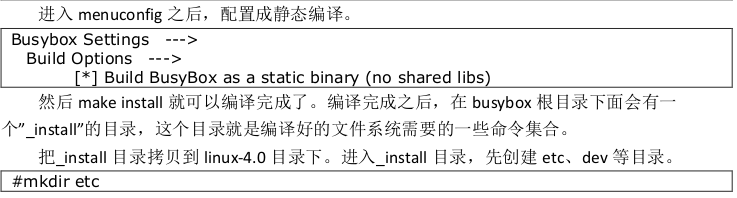

# 奔跑吧linux 系统调试环境搭建

## 1. 交叉工具链搭建

https://blog.csdn.net/gaojy19881225/article/details/80026644

下载：https://releases.linaro.org/archive/15.06/components/toolchain/binaries/4.8/arm-linux-gnueabi/

由于下载太慢：

这里直接使用 我之前下载好的

gcc-linaro-6.4.1-2017.08-x86_64_arm-linux-gnueabi.tar.xz

```shell
vim ~/.bashrc
export PATH=$PATH:/home/colbycao/sda9_112GB/gcc-linaro-6.4.1-2017.08-x86_64_arm-linux-gnueabi/bin

source ~/.bashrc

arm-none-linux-gnueabi-gcc -v
```

编译 linux4.0

```shell
export ARCH=arm; export SUBARCH=arm; export CROSS_COMPILE=arm-linux-gnueabi-; make vexpress_defconfig; make -j8 ;make tags cscope TAGS
```

编译报错：

fatal error: linux/compiler-gcc6.h: No such file or directory

```shell
kernel4.0$ find -name compiler-gcc*
./include/linux/compiler-gcc.h
./include/linux/compiler-gcc5.h
./include/linux/compiler-gcc4.h
./include/linux/compiler-gcc3.h
```

错误原因：

因为我使用的交叉编译工具链版本太高(6.4.1版本)导致，先在内核代码根目录下搜索compiler-gcc*

支持的版本有3、4、5。 
在[Linaro官网](https://releases.linaro.org/components/toolchain/binaries/5.4-2017.01/arm-linux-gnueabihf/)上下载5版本的交叉编译工具链即可解决问题

还得继续下载

## 2. 调试环境搭建

其实不用去官网下载交叉编译

我们可以借助apt-get去安装交叉编译环境

```shell
sudo apt-get install qemu libncurses5-dev gcc-arm-linux-gnueabi build-essential
```

```shell
arm-linux-gnueabi-gcc -v
gcc version 7.4.0 (Ubuntu/Linaro 7.4.0-1ubuntu1~18.04) #版本太高了，还是得下载
```

编译最小文件系统

```shell
colbycao@pc:~/sda9_112GB/busybox-1.24.0$ export ARCH=arm; export CROSS_COMPILE=arm-linux-gnueabi-; make menuconfig;make -j8; make install
```



报错：

Library crypt is not needed, excluding it
 Library m is needed, can't exclude it (yet)

解决方案：

```shell
# 这不是报错，说明已经编译成功
```

```shell
colbycao@pc:~/sda9_112GB/busybox-1.24.0$ cp _install/ ../repo-project/os/kernel4.0/ -r
colbycao@pc:~/sda9_112GB/repo-project/os/kernel4.0$ mv _install _install_arm32

colbycao@pc:~/sda9_112GB/repo-project/os/kernel4.0$ make bzImage -j8 ARCH=arm CROSS_COMPILE=arm-linux-gnueabi-
```

