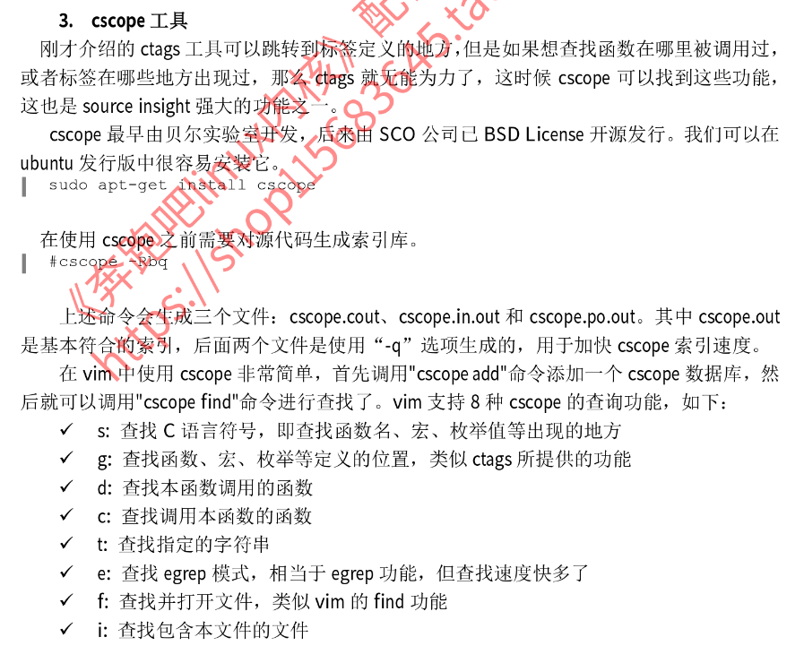
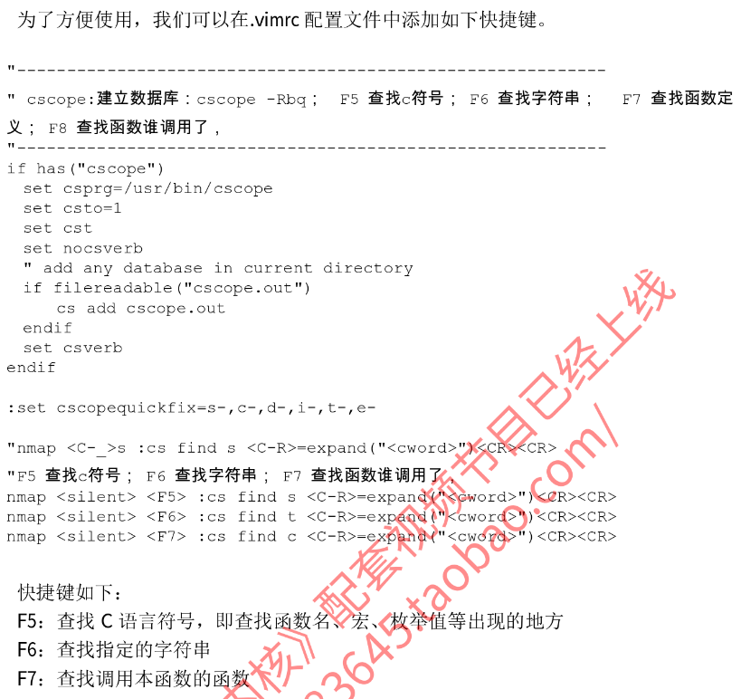

# 配置vim记录

## 1. 配置流程：

### 1.1  .vimrc

这里需要先下载：

```shell
cd sda9_112GB
git clone https://github.com/VundleVim/Vundle.vim.git
#在.vimrc中的rtp 去指定这个地址
```

.vimrc 

```shell

" Vundle manage
set nocompatible              " be iMproved, required
filetype off                  " required

" set the runtime path to include Vundle and initialize
set rtp+=/home/colbycao/sda9_112GB/Vundle.vim
call vundle#begin()

" let Vundle manage Vundle, required
Plugin 'VundleVim/Vundle.vim'
Plugin 'Valloric/YouCompleteMe'
Plugin 'scrooloose/nerdtree'
Plugin 'majutsushi/tagbar' " Tag bar"
"Plugin 'Xuyuanp/nerdtree-git-plugin'
"Plugin 'jistr/vim-nerdtree-tabs'
Plugin 'scrooloose/syntastic'
Plugin 'vim-airline/vim-airline' | Plugin 'vim-airline/vim-airline-themes' " Status line"
Plugin 'jiangmiao/auto-pairs'
Plugin 'mbbill/undotree'
Plugin 'gdbmgr'
Plugin 'scrooloose/nerdcommenter'
Plugin 'Yggdroot/indentLine' " Indentation level"
Plugin 'bling/vim-bufferline' " Buffer line"
"Plugin 'kepbod/quick-scope' " Quick scope"

" All of your Plugins must be added before the following line
call vundle#end()            " required
filetype plugin indent on    " required

let g:ycm_server_python_interpreter='/usr/bin/python'
let g:ycm_global_ycm_extra_conf='~/.vim/.ycm_extra_conf.py'

set guifont=Monospace\ 14

 set nu!             " 显示行号

syntax enable
syntax on
colorscheme desert

:set autowrite   " 自动保存

set foldmethod=syntax
set foldlevel=100  " 启动vim时不要自动折叠代码
"  折行
"autocmd FileType c,cpp  setl fdm=syntax | setl fen

 "--------------------------------------------------------------------------------
 " TagList :Tlist 和 wm
 "--------------------------------------------------------------------------------
let Tlist_Show_One_File=1
let Tlist_Exit_OnlyWindow=1
let Tlist_Use_Right_Window=1
let Tlist_Show_Menu=1
let Tlist_Auto_Open=1

" Tagbar
"nmap tag :TagbarToggle<CR>
let g:tagbar_width=25
autocmd BufReadPost *.cpp,*.c,*.h,*.cc,*.cxx call tagbar#autoopen()

" NetRedTree
autocmd StdinReadPre * let s:std_in=1
autocmd VimEnter * if argc() == 0 && !exists("s:std_in") | NERDTree | endif
let NERDTreeWinSize=15
let NERDTreeShowLineNumbers=1
"let NERDTreeAutoCenter=1
let NERDTreeShowBookmarks=1

let g:winManagerWindowLayout='TagList'
nmap wm :WMToggle<cr>

" syntastic 
set statusline+=%#warningmsg#
set statusline+=%{SyntasticStatuslineFlag()}
set statusline+=%*

let g:syntastic_always_populate_loc_list = 1
let g:syntastic_auto_loc_list = 1
let g:syntastic_check_on_open = 1
let g:syntastic_check_on_wq = 0

"--------------------------------------------------------------------------------
" cscope:建立数据库：cscope -Rbq；  F5 查找c符号； F6 查找字符串；   F7 查找函数谁调用了，
"--------------------------------------------------------------------------------
if has("cscope")
  set csprg=/usr/bin/cscope
  set csto=1
  set cst
  set nocsverb
  " add any database in current directory
  if filereadable("cscope.out")
      cs add cscope.out
  endif
  set csverb
endif


:set cscopequickfix=s-,c-,d-,i-,t-,e-

nmap <C-_>s :cs find s <C-R>=expand("<cword>")<CR><CR>
nmap <C-_>g :cs find g <C-R>=expand("<cword>")<CR><CR>
nmap <C-_>c :cs find c <C-R>=expand("<cword>")<CR><CR>
nmap <C-_>t :cs find t <C-R>=expand("<cword>")<CR><CR>
nmap <C-_>e :cs find e <C-R>=expand("<cword>")<CR><CR>
nmap <C-_>f :cs find f <C-R>=expand("<cfile>")<CR><CR>
nmap <C-_>i :cs find i ^<C-R>=expand("<cfile>")<CR>$<CR>
nmap <C-_>d :cs find d <C-R>=expand("<cword>")<CR><CR>


"nmap <C-_>s :cs find s <C-R>=expand("<cword>")<CR><CR>
"F5 查找c符号； F6 查找字符串；   F7 查找函数定义； F8 查找函数谁调用了，
nmap <silent> <F5> :cs find s <C-R>=expand("<cword>")<CR><CR> :botright copen<CR><CR> 
nmap <silent> <F6> :cs find t <C-R>=expand("<cword>")<CR><CR> :botright copen<CR><CR>
"nmap <silent> <F7> :cs find g <C-R>=expand("<cword>")<CR><CR> 
nmap <silent> <F7> :cs find c <C-R>=expand("<cword>")<CR><CR> :botright copen<CR><CR>


 "--------------------------------------------------------------------------------
"  自动加载ctags: ctags -R
if filereadable("tags")
      set tags=tags
endif


"  自动保存 kernel 的ctags文件
if isdirectory("kernel/") && isdirectory("mm/")
	au BufWritePost *.c,*.h silent! !ctags -L tags.files&
	au BufWritePost *.c,*.h silent! !cscope -bkq -i tags.files&
endif


"--------------------------------------------------------------------------------
" global:建立数据库
"--------------------------------------------------------------------------------
if filereadable("GTAGS")
	set cscopetag
	set cscopeprg=gtags-cscope
	cs add GTAGS
	au BufWritePost *.c,*.cpp,*.h silent! !global -u &
endif


 "--------------------------------------------------------------------------------
 " QuickFix
 "--------------------------------------------------------------------------------
 nmap <F1> :cn<cr>   " 切换到下一个结果
 nmap <F2> :cp<cr>   " 切换到上一个结果

 "--------------------------------------------------------------------------------
" MiniBufExp :  Ctrl + Tab 键可以在minibuf中选择，Ctrl+h,j,k,l或者方向键
" 来选择窗口
 "--------------------------------------------------------------------------------
let g:miniBufExplMapCTabSwitchBufs = 1
let g:miniBufExplMapWindowNavVim = 1
let g:miniBufExplMapWindowNavArrows = 1

 "--------------------------------------------------------------------------------
 " A, c和h文件切换
 "--------------------------------------------------------------------------------
nnoremap <silent> <F12> :A<CR>
```

### 1.2 安装插件

随便打开一个vim

```shell
:PluginInstall
```

将插件安装好

### 1.3 YouCompleteMe

我们安装YouCompleteMe这个插件的时候，仅仅是下载了源码，此时我们需要编译源码并进行安装

```shell
cd .vim/bundle/YouCompleteMe/ #这个是源码下载到的地方
./install.py --clang-completer # 编译　--clang-completer：代表c c++的代码补齐
cp third_party/ycmd/examples/.ycm_extra_conf.py ~/.vim #这个是安装

####################################################################################
#编译前要安装的软件
sudo apt-get update
sudo apt-get install build-essential cmake python-dev python3-dev
```

此时vim基本算是都配置好了

## 2. VundleVim介绍

https://blog.csdn.net/weixin_34029680/article/details/88210910

```
喜欢vim编辑的我们，繁多的插件使vim功能更加强大，所以需要安装配置插件
vundle是一个很常用，很好用的插件管理器，其安装简单配置方便，功能强大。
```

vundle帮助命令

:BundleList -列举出列表中(.vimrc中)配置的所有插件
:BundleInstall -安装列表中全部插件
:BundleInstall! -更新列表中全部插件
:BundleSearch foo -查找foo插件
:BundleSearch! foo -刷新foo插件缓存
:BundleClean -清除列表中没有的插件
:BundleClean! -清除列表中没有的插件

---------------------
## 3. .vimrc 配置文件解析

### 3.1 按键映射

主要有**map，noremap，unmap，mapclear**四个 命令，并且有四个前缀**i,c,n,v**修饰

##  

nore

表示非递归，见下面的介绍

n

表示在普通模式下生效

v

表示在可视模式下生效

i

表示在插入模式下生效

c

表示在命令行模式下生效

 

map

表示递归的映射

unmap

表示删除某个映射

mapclear

表示清楚映射

#### 3.1.1 inoremap

- i代表是在插入模式（insert）下有效
- nore表示不递归no recursion，例如：`inoremap Y y`和`inoremap y Y`并不会出现无限循环。
- map映射

举个例子，将Shift+Enter用来跳出括号。

```
inoremap <s-cr> <ESC>la
```

本映射利用了vim中，由编辑模式进入插入模式会向前跳一个位置的特点，来实现。有不懂的可以自己试一下，观察一下。

如果键入{，自动补全后面，并格式化。

```
inoremap { {<CR>}<ESC>kA<CR>
```

### 3.2 设置括号自动补全

https://www.cnblogs.com/songdechiu/p/5844073.html

```
inoremap ' ''<ESC>i
inoremap " ""<ESC>i
inoremap ( ()<ESC>i
inoremap [ []<ESC>i
inoremap { {<CR>}<ESC>O
```

其中花括号{设置，自动补全并换行缩进，这在写函数的时候或语句块的时候特别有用。

注：inoremap { {}<ESC>i<CR><ESC>V<O

这句在我的环境中有问题，后来改为

inoremap { {<CR>}<ESC>O

参考：

<http://blog.csdn.net/dark_fire/article/details/41970477>

<http://www.cnblogs.com/lovepurple/p/3373959.html>

#### 3.2.1 设置自动跳出自动补全的括号

```shell
"设置跳出自动补全的括号
func SkipPair()  
    if getline('.')[col('.') - 1] == ')' || getline('.')[col('.') - 1] == ']' || getline('.')[col('.') - 1] == '"' || getline('.')[col('.') - 1] == "'" || getline('.')[col('.') - 1] == '}'  
        return "\<ESC>la"  
    else  
        return "\t"  
    endif  
endfunc  
" 将tab键绑定为跳出括号  
inoremap <TAB> <c-r>=SkipPair()<CR>
```

参考：<http://blog.csdn.net/larrygoode/article/details/12377977>

### 3.3 全面的配置文档

https://blog.csdn.net/u013920085/article/details/46953293

## 4. cscope工具





cscope的使用url:

https://blog.csdn.net/hunter___/article/details/80333543

tar.bz2 格式

```shell
压缩：bzip2 [原文件名].tar
解压：bunzip2 [原文件名].tar.bz2

打包并压缩： tar -jcvf [目标文件名].tar.bz2 [原文件名/目录名]
解压并解包： tar -jxvf [原文件名].tar.bz2
```

