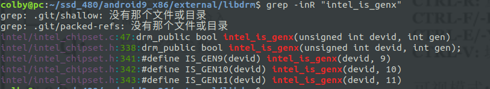
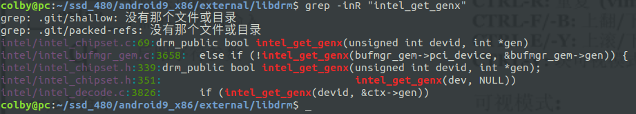
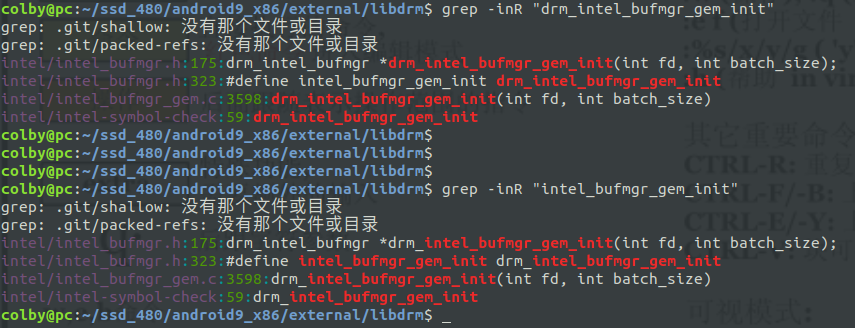
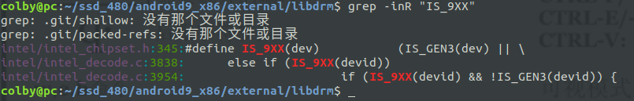
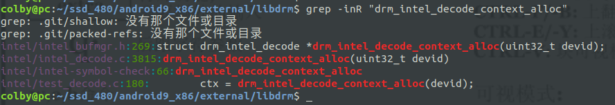
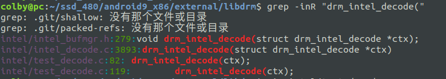

# 00.day1

将android7 中 kernel由原来的 4.14 升级为 4.19 后发现， 开机后无法进入图形界面。

问题原因：

​	当前gup  0x3ea0 在kernel4.19 中给予了支持， 但是android7 hal external 中 没有给予相应的支持。

此时要做的工作就是 将android9 中相关的code 往 android7中merge.

## 1. 代码比对

**1. ** 首先比对如下目录：

libdrm drm_hwcomposer drm_gralloc, drm_framebuffer, Mesa

比对后的结果：

1. 在libdrm 和 mesa 目录中 有 0x3ea0的定义
2. android7中不存在  drm_framebuffer 目录，其他目录差异很巨大

## 2. 移动代码

两个方案：

1. 方案一： 将external hardware两个目录 的代码全部进行挪动 根据编译报错 修改 framework
2. 方案二： 根据线索，一步一步的去挪动代码： 0x3ea0 相关的

## 3. 方案一：

1. 挪动代码：

```shell
rsync -av --exclude hp-4.19/external --exclude hp-4.19/hardware --exclude hp-4.19/out/ hp-4.19 /home/colby/ssd_480/

cp android9_x86/external/ hp-4.19/ -rf

cp android9_x86/hardware/ hp-4.19/ -rf
```

rsync 的使用：https://www.cnblogs.com/hubavyn/p/5452039.html

2. 编译

```shell
# 编译的时候，发现 编译的规则都变了 例如对应目录中没有 Android.mk
```

所以这个路是不通的

## 4. 方案二：

只能是根据 ox3ea0 这个线索去挪动代码了。

### 4.1 分析 android9  中0x3ea0相关的代码

#### 4.1.1 external/libdrm

**1. 定位**

```shell
android9_x86/external/libdrm$ grep -inR "0x3ea0"

intel/i915_pciids.h:414:	INTEL_VGA_DEVICE(0x3EA0, info)
```

```shell
external/libdrm$ vim intel/i915_pciids.h +414
```

```c
/* WHL/CFL U GT2 */
#define INTEL_WHL_U_GT2_IDS(info) \
    INTEL_VGA_DEVICE(0x3EA0, info)

#define INTEL_CFL_IDS(info)    \
    INTEL_CFL_S_GT1_IDS(info), \
    INTEL_CFL_S_GT2_IDS(info), \
    INTEL_CFL_H_GT2_IDS(info), \
    INTEL_CFL_U_GT2_IDS(info), \
    INTEL_CFL_U_GT3_IDS(info), \
    INTEL_WHL_U_GT1_IDS(info), \
    INTEL_WHL_U_GT2_IDS(info), \       /*这个是*/                                                    
    INTEL_WHL_U_GT3_IDS(info)
```

**2. 是谁使用了 INTEL_CFL_IDS **

```shell
vim intel/intel_chipset.c +40
```

```c
static const struct pci_device {
    uint16_t device;
    uint16_t gen;
} pciids[] = { 
    /* Keep ids sorted by gen; latest gen first */
    INTEL_ICL_11_IDS(11),
    INTEL_CNL_IDS(10),
    INTEL_CFL_IDS(9), /* 这个地方使用了*/                                                                          
    INTEL_GLK_IDS(9),
    INTEL_KBL_IDS(9),
    INTEL_BXT_IDS(9),
    INTEL_SKL_IDS(9),
};
```

**3. 这里谁使用了 pciids **

```shell
vim intel/intel_chipset.c
# 和  pciids[] 数组的定义在同一个 文件中
```

```c
drm_public bool intel_is_genx(unsigned int devid, int gen)
{
    const struct pci_device *p, 
          *pend = pciids + sizeof(pciids) / sizeof(pciids[0]);

    for (p = pciids; p < pend; p++) {
        /* PCI IDs are sorted */
        if (p->gen < gen)
            break;

        if (p->device != devid)
            continue;

        if (gen == p->gen)
            return true;
        break;
    }   

    return false;
}

drm_public bool intel_get_genx(unsigned int devid, int *gen)
{
    const struct pci_device *p, 
          *pend = pciids + sizeof(pciids) / sizeof(pciids[0]);

    for (p = pciids; p < pend; p++) {
        if (p->device != devid)
            continue;

        if (gen)
            *gen = p->gen;

        return true;
    }   

    return false;
}
```

这里总结一下：

```c
/* 
判断 devid 是不是 gen 中数字
	这里猜测： devid = 0x3ea0, gen = 9 此时返回 true 
*/
drm_public bool intel_is_genx(unsigned int devid, int gen);


/*
这里是将 devid 对应的gen 号，放到 gen 中
	这里猜测： devid = 0x3ea0, 此时返回 gen = 9, ture
*/
drm_public bool intel_get_genx(unsigned int devid, int *gen);
```

**4. 这里分别分析 intel_is_genx 和 intel_get_genx **

# **4.1 intel_is_genx**



既然0x3ea0 是 gen9, 这里只需要关注  IS_GEN9 的使用

通过在 exteran/libdrm中搜索发现 没有人使用，这是个很重要的信息：

**那能不能此时可以断定 IS_GEN9 是一个接口，提供给其他模块使用的，出于解耦的考虑。那我们在android7中对应的修改是不是，可以到此为止了呢！！！，暂时这么认为，有待验证。**

# **4.2 intel_get_genx**



从中发现 在如下地方中使用到这个：

```shell
intel/intel_bufmgr_gem.c:3658 # 4.2.1

intel/intel_chipset.h:351     # 4.2.2

intel/intel_decode.c:3826     # 4.2.3
```

接下来就去追

## **4.2.1**

```shell
android9_x86/external/libdrm$ vim intel/intel_bufmgr_gem.c +3658
```

```c
drm_public drm_intel_bufmgr *
drm_intel_bufmgr_gem_init(int fd, int batch_size)
{
    if (IS_GEN2(bufmgr_gem->pci_device))
        bufmgr_gem->gen = 2;
    else if (IS_GEN3(bufmgr_gem->pci_device))
        bufmgr_gem->gen = 3;
    else if (IS_GEN4(bufmgr_gem->pci_device))
        bufmgr_gem->gen = 4;
    else if (IS_GEN5(bufmgr_gem->pci_device))
        bufmgr_gem->gen = 5;
    else if (IS_GEN6(bufmgr_gem->pci_device))
        bufmgr_gem->gen = 6;
    else if (IS_GEN7(bufmgr_gem->pci_device))
        bufmgr_gem->gen = 7;
    else if (IS_GEN8(bufmgr_gem->pci_device))
        bufmgr_gem->gen = 8;
    else if (!intel_get_genx(bufmgr_gem->pci_device, &bufmgr_gem->gen)) {/* 这里使用了*/
        free(bufmgr_gem);
        bufmgr_gem = NULL;
        goto exit;
    }
    
    return bufmgr_gem != NULL ? &bufmgr_gem->bufmgr : NULL;
}
```

**这个文件在 merge到android7的时候要，重点对比 ，因为看看 drm_intel_bufmgr_gem_init 的使用地方，就明白了。**



```shell
vim intel/intel_bufmgr.h +323
```

```c
#define intel_bufmgr_gem_init drm_intel_bufmgr_gem_init
// 为了统一各个版本的差异， 这里做了一个 接口映射
```

**从这里发现是没有人使用 intel_bufmgr_gem_init ， 也就是说 这个函数也是个接口，分析到此为止。** 

## **4.2.2**

```shell
vim intel/intel_chipset.h +351 
```

```c
#define IS_9XX(dev)     (IS_GEN3(dev) || \
                 IS_GEN4(dev) || \
                 IS_GEN5(dev) || \
                 IS_GEN6(dev) || \
                 IS_GEN7(dev) || \
                 IS_GEN8(dev) || \
                 intel_get_genx(dev, NULL))/*这里使用到了*/
```



这里发现有两个地方使用到了：

```shell
intel/intel_decode.c:3838  # 4.2.2.1

intel/intel_decode.c:3954  # 4.2.2.2
```

这里分别分析：

### **4.2.2.1 **

```c
drm_public struct drm_intel_decode *
drm_intel_decode_context_alloc(uint32_t devid)
{                                                                                                                      
    struct drm_intel_decode *ctx;

    ctx = calloc(1, sizeof(struct drm_intel_decode));
    if (!ctx)
        return NULL;

    ctx->devid = devid;
    ctx->out = stdout;

    if (intel_get_genx(devid, &ctx->gen))
        ;
    else if (IS_GEN8(devid))
        ctx->gen = 8; 
    else if (IS_GEN7(devid))
        ctx->gen = 7; 
    else if (IS_GEN6(devid))
        ctx->gen = 6; 
    else if (IS_GEN5(devid))
        ctx->gen = 5; 
    else if (IS_GEN4(devid))
        ctx->gen = 4; 
    else if (IS_9XX(devid))/*这里使用到了*/
        ctx->gen = 3; /**/
    else {
        assert(IS_GEN2(devid));
        ctx->gen = 2; 
    }    

    return ctx; 
}
```

**这里假如是 0x3ea0 ctx->gen = 3 将会成立**



这里只有一个文件中使用到了：

```shell
vim intel/test_decode.c +180
```

```c
int
main(int argc, char **argv) // 重点
{
    uint16_t devid;
    struct drm_intel_decode *ctx;

    if (argc < 2)
        usage();


    devid = infer_devid(argv[1]);

    ctx = drm_intel_decode_context_alloc(devid);                                                                                                                                                                   

    if (argc == 3) {
        if (strcmp(argv[2], "-dump") == 0)
            dump_batch(ctx, argv[1]);
        else
            usage();
    } else {
        compare_batch(ctx, argv[1]);
    }   

    drm_intel_decode_context_free(ctx);

    return 0;
}
```

**两个信息： **

1. 文件名 test_decode.c 说明是个测试文件，**可以不用关注**
2. 在main函数中被调用了， **暂时追到这里可以停止了， 但是不是对外的接口，还需要验证。**

### **4.2.2.2**

```shell
vim intel/intel_decode.c +3954
```

```c
drm_public void                    
drm_intel_decode(struct drm_intel_decode *ctx)
{
	case 0x3: 
            if (IS_9XX(devid) && !IS_GEN3(devid)) { // 这个地方调用了      
                index +=
                    decode_3d_965(ctx);// 会调用这个函数， 这里先不分析了
            } else if (IS_GEN3(devid)) {
                index += decode_3d(ctx);
            } else {
                index +=
                    decode_3d_i830(ctx);
            }
            break;
}
```

**在向android7合并 代码时，要重点关注  decode_3d_965 这个函数的实现，我觉地里面需要merge 一部分代码进去。**

现在继续向上分析 drm_intel_decode 谁调用他了。



**这里是测试代码， 没有必要继续关注了。**

## **4.2.3**

```shell
vim intel/intel_decode.c +3826 
```

````c
drm_public struct drm_intel_decode *
drm_intel_decode_context_alloc(uint32_t devid)
{
    struct drm_intel_decode *ctx;

    ctx = calloc(1, sizeof(struct drm_intel_decode));
    if (!ctx)
        return NULL;

    ctx->devid = devid;
    ctx->out = stdout;

    if (intel_get_genx(devid, &ctx->gen)) /*只用这个地方使用到了，  这里 gen 被赋值为9*/        
        ;    
    else if (IS_GEN8(devid))
        ctx->gen = 8; 
    else if (IS_GEN7(devid))
        ctx->gen = 7; 
    else if (IS_GEN6(devid))
        ctx->gen = 6; 
    else if (IS_GEN5(devid))
        ctx->gen = 5; 
    else if (IS_GEN4(devid))
        ctx->gen = 4; 
    else if (IS_9XX(devid))/*在前面分析， IS_9XX时: 这里分析错了， 如果是0x3eao 根本就不会走到这里*/
        ctx->gen = 3; 
    else {
        assert(IS_GEN2(devid));
        ctx->gen = 2; 
    }    

    return ctx; 
}
````

drm_intel_decode_context_alloc() 这个函数在  4.2.2.1 中分析过，这里不再分析。

#### 4.1.2 向android7中合并/libdrm

既然已经分析完 android9中的libdrm中的内容了，现在做的就是向android7中进行代码合并。

**合并的原则： 根据上述对libdrm 分析的小节，逐个小节去合并； 参照591e去合并。**


```shell
hp-4.19/external/libdrm$ vim intel/intel_chipset.h +205
```


