# day2

## 1. 环境：

​	机器： HP EDU PC

​	kernel: 4.19.15

​	android 7.1.1

​	问题：

​		开机后可以进入终端shell，但是无法进入图形界面。

ps:

1.  linux层 暂且可以认为是正常启动。 Android层中的 surfaceFlinger 等一些核心服务启动失败。

2. 内核传参中添加 nomodeset 后，图形界面可以启动。当此时发现，如下问题

   a. 屏幕无法调节亮度

   b. 声卡没有声音

   c. 摄像头可以拍照，但无法正常录像

​	

## 2. 问题定位

### 2.1 无法进入图形界面


**无法进入图形界面**

这个是没有加 nomodeset 同时也启动不了图形界面

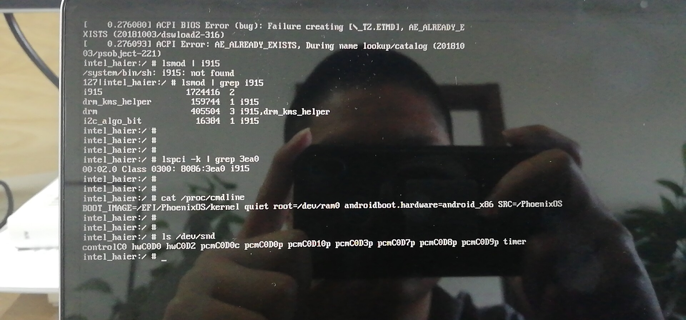

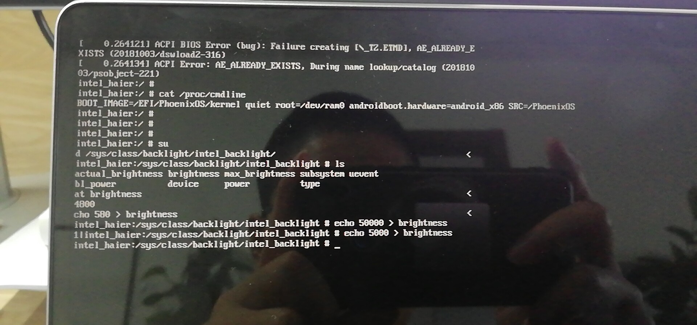

这个背光亲自测试，是可以调节的。

不加nomodeset 的内核，我们发现：

**1. 首先加载了 i915驱动**

**2.并且i915 驱动被引用了，且引用计数为2**

**3. 并且lspci -k 可以发现 3ea0 这个设备使用了 i915驱动**

**4. 声卡节点 有很多**

**5. 存在背光接口，且可以调节亮度**


**可以进入图形界面**

这个是加了nomodeset 后，可以正常进入图形界面中。

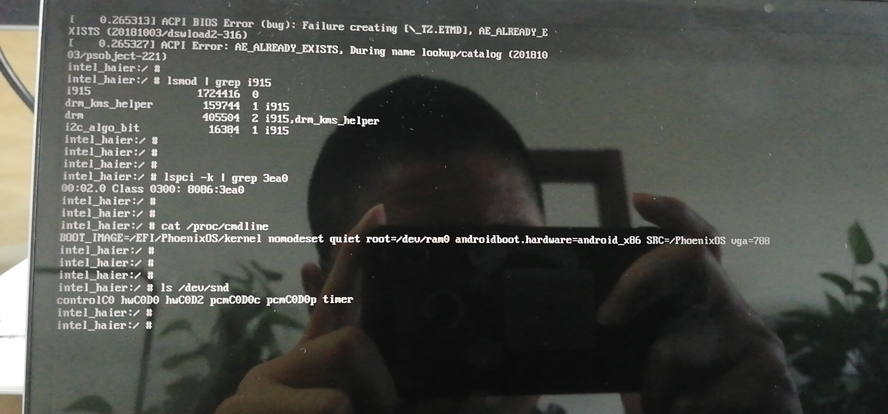

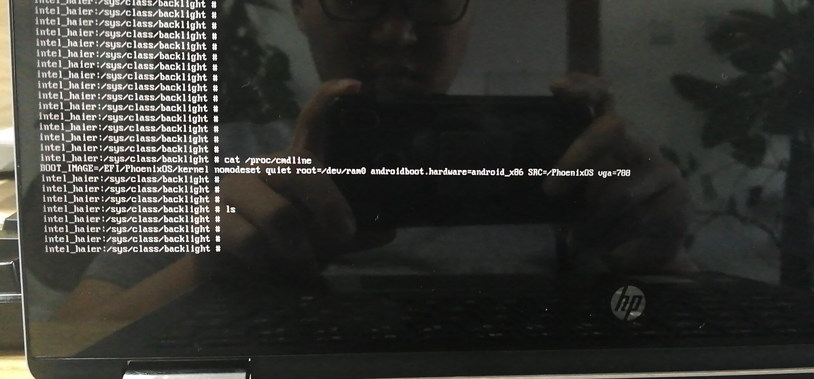


从图中我们得到如下信息：

**1. 虽然系统加载了 i915驱动，但是没人使用（引用计数为0）**

**2. lspci -k 中显示， 0x3ea0 设备并没有使用 i915 dri**

**3. 声卡设备节点 数目，显然比较少**

**4. 无背光的相关接口**


我们怎么就知道 0x3ea0是显卡设备？

答：我们是在ubuntu中 lspci -k | grep VGA 时，确认的。


**问题定位：**

根据intel的说法，当我们加nomodeset ，kernel 中不会去使用 i915的驱动，而是使用VGA通用的驱动，这种驱动是一种很低级的显卡驱动。所以这里不应该去使用这种驱动。根据这个影子，我们就开始去查这个i915驱动了。

1. 刚开始的时候，我们用的是 4.14的kernel去查的。4.14的i915驱动中并不存在0x3ea0相关的驱动。 所以4.14之所以能起来，也是走的vga通用驱动。

2. 当我们在4.14中添加 好相对应的0x3ea0驱动后，我们发现4.14 和 4.19 表现一样了。都是kernel 可以起来，android层启动不了。
3. 此时我们就回归到4.19 开始查问题了。
4. 由于我们的4.19的 kernel中是有 0x3ea0相关的驱动的。现在的问题就聚焦在 hardware 和   external 两个目录下了。
5. 显卡要想正常工作，必须kernel_space和 user_space必须匹配。**现在最大的问题是， 两者的版本不能匹配导致的。**
6. android9的代码，都是可以正常工作的。

**根据，上面的分析：我们可以得出一个结论， 我们此时要做的就是，将我们android9中相关的 东东，拿到android7中**

这里相关的是指： 

	1. 0x3ea0相关的

## 3. 修复buf

既然我们问题已经分析清楚了，那接下来就是干：

通过在android9 的 external 中检索， 我们发现 只有在 libdrm和mesa两个目录中，有相关0x3ea0的code

**那接下来就重点关注libdrm和mesa两个目录即可：**

### 3.1 我自己的修改方案：

#### 3.1.1 libdrm 目录

这里插播一个信息： 台电的机器使用的显卡型号是 0x591e,这里我们不妨参照这个进行修改。

通过阅读android9 和 android7中的code，我们发现，在libdrm中 目的就只有一个， 能够识别出 0x3ea0这个显卡设备是gen 9 即可。 这个是通过分析android9中的代码发现的。

代码如下：

这个是修改后的android7中的代码：

```shell
hp-4.19/external/libdrm$ vim intel/intel_chipset.h +452
```

```c
#define IS_KBL_GT2(devid)   ((devid) == PCI_CHIP_KABYLAKE_ULT_GT2   || \                                                                                                           
                 (devid) == PCI_CHIP_KABYLAKE_ULT_GT2F  || \
                 (devid) == PCI_CHIP_KABYLAKE_ULX_GT2   || \
                 (devid) == 0x3ea0  || \
                 (devid) == PCI_CHIP_KABYLAKE_DT_GT2    || \
                 (devid) == PCI_CHIP_KABYLAKE_HALO_GT2  || \
                 (devid) == PCI_CHIP_KABYLAKE_SRV_GT2   || \
                 (devid) == PCI_CHIP_KABYLAKE_WKS_GT2)
           
#define IS_KABYLAKE(devid)  (IS_KBL_GT1(devid) || \
                 IS_KBL_GT2(devid) || \   /*这个*/
                 IS_KBL_GT3(devid) || \
                 IS_KBL_GT4(devid))
       
/*目的就是 判断 0x3ea0 是 gen9*/                     
#define IS_GEN9(devid)      (IS_SKYLAKE(devid)  || \
                 IS_BROXTON(devid)  || \
                 IS_KABYLAKE(devid) || \ /*这个*/
                 IS_GEMINILAKE(devid) || \
                 IS_COFFEELAKE(devid))
```

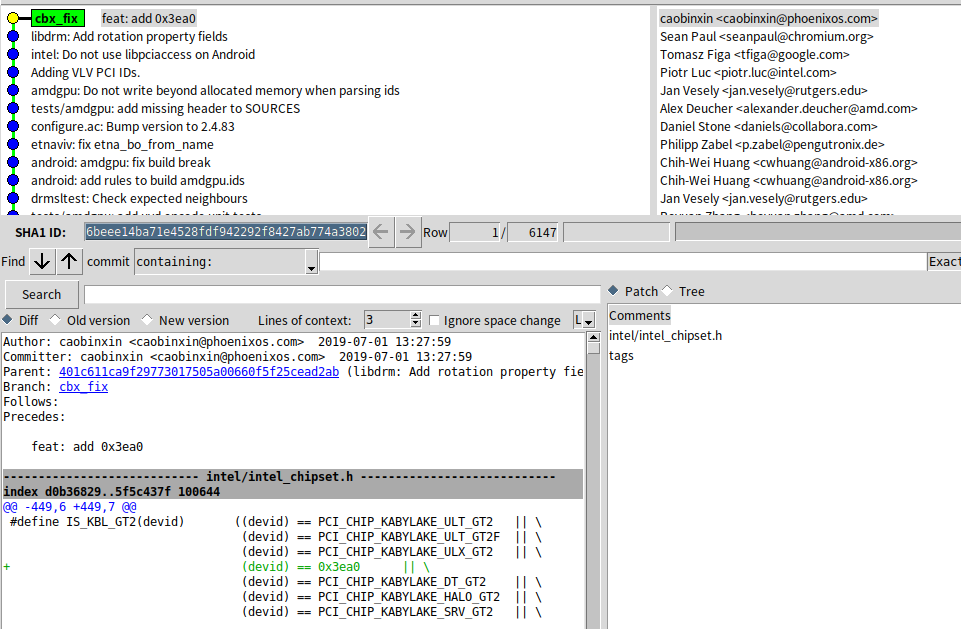


#### 3.1.2 mesa 目录

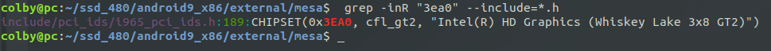

从中我们发现 在这个 i965_pci_ids.h 文件中有相关的内容：

通过检索 在这个几个文件中引用了 这个头文件：

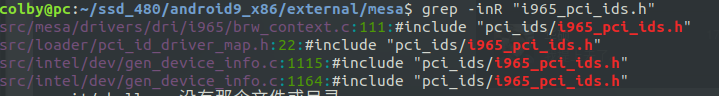

```shell
src/mesa/drivers/dri/i965/brw_context.c:111:#include "pci_ids/i965_pci_ids.h"
src/loader/pci_id_driver_map.h:22:#include "pci_ids/i965_pci_ids.h"
src/intel/dev/gen_device_info.c:1115:#include "pci_ids/i965_pci_ids.h"
src/intel/dev/gen_device_info.c:1164:#include "pci_ids/i965_pci_ids.h"
```

然后重点关注这几个目录：

通过阅读android9中的内容，给出了android7的修改：

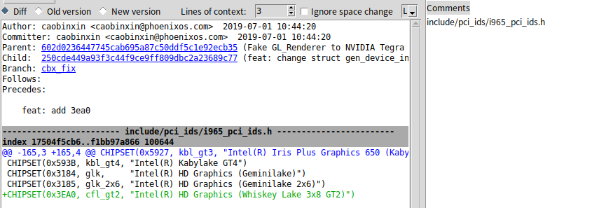

 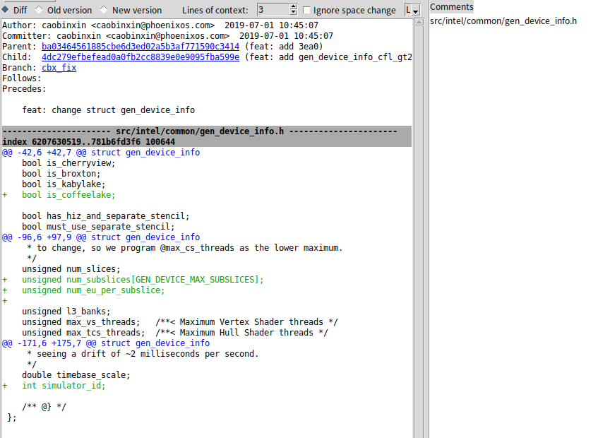

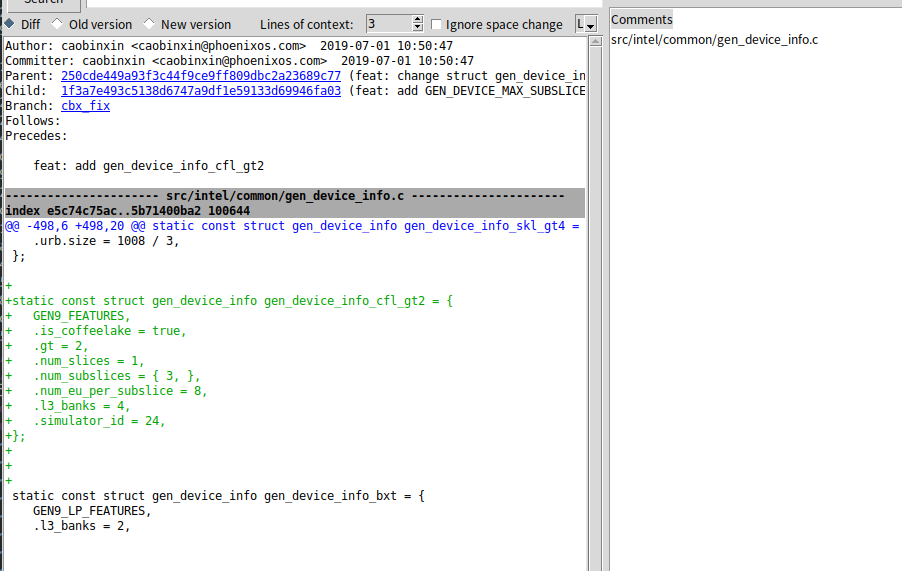


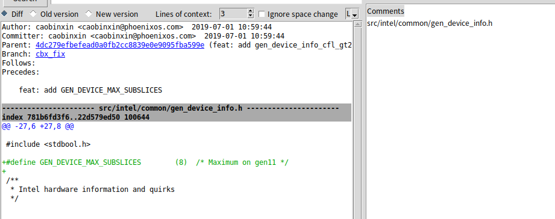

编译后发现 不加nomodeset 后 图形界面 声音 摄像头都可以工作了。

## intel patch

### libdrm :

将patch 文件放置在 external 文件下：

```shell
hp-4.19/external$ patch -d libdrm -p1 < 0001-add-whiskeylake-U-serial-chip-id-in-libdrm.patch
```

### mesa

