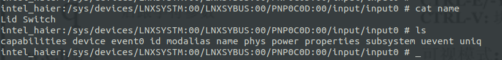
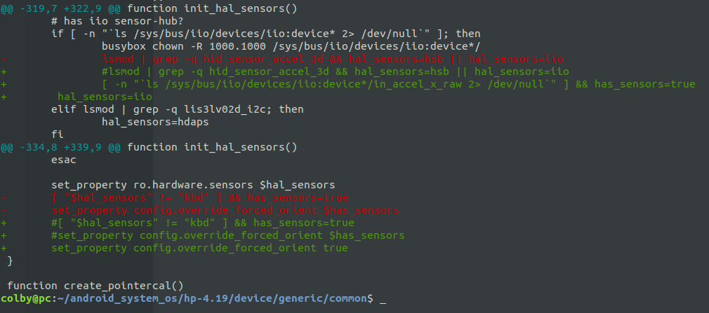
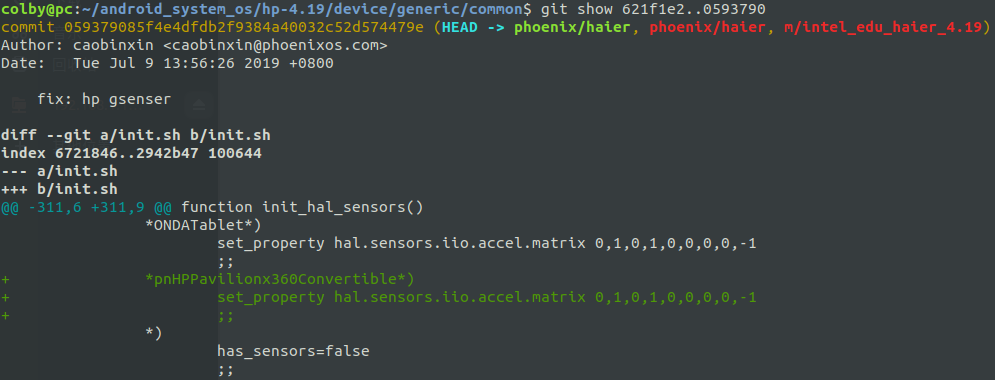
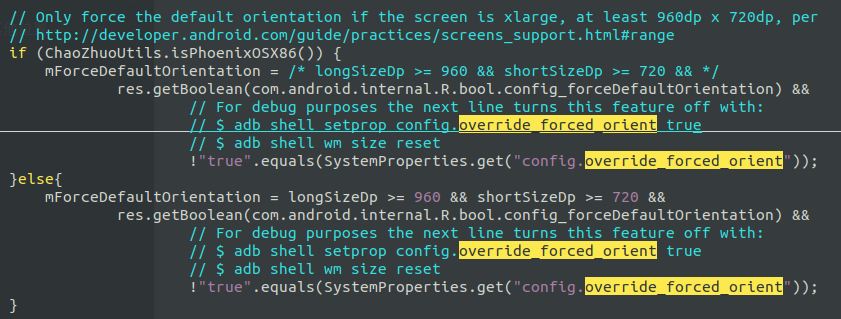
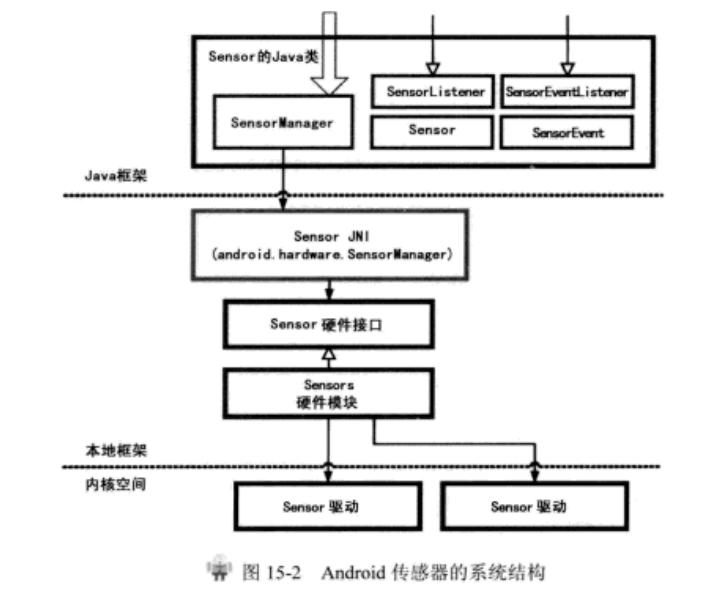
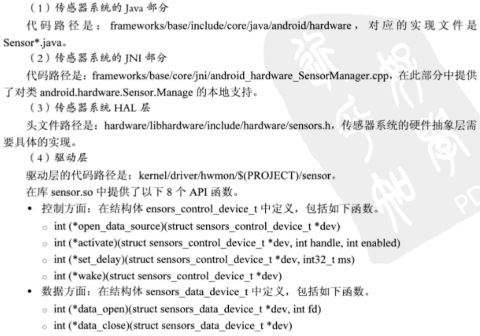
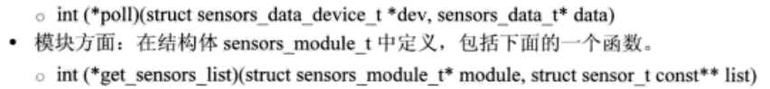
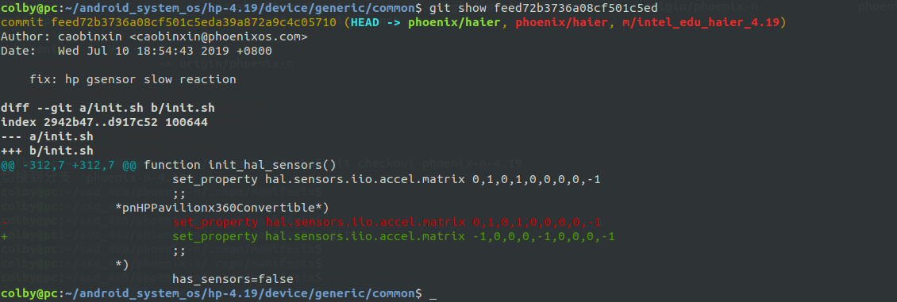

# GSensor问题查错：

## 1. log分析

logcat:

```shell
E SensorManager: sensor or listener is null
```

dmesg:

```shell
input: Lid Switch as /devices/LNXSYSTM:00/LNXSYBUS:00/PNP0C0D:00/input/input0
ACPI: Lid Switch [LID0]

lis3lv02d: unknown sensor type 0x0
```

**Lid Switch  代表的是 霍尔开关（霍尔传感器），这是一个很重要的信息。**

lis3lv02d： 从中我们发现我们的传感器用的芯片是这个：

进一步验证：



## 2. 解决方方案：

### 2.1 修改init.sh

**背景：**

根据测试，我们发现将android-x86-7.1.2中的init.sh拿到我们的里面后：发现 Gsensor是可以使用的，只不过是显示的屏幕是反方向的。根据这个init.sh 和 我们自己的init.sh 通过  init_hal_sensors 函数中执行路径进行打log分析，将没有的加上之后， 发现我们的Gsensor也是可以使用了，但是屏幕是反向的。

 

此时的屏幕反向，是因为我们的重力感应没有配置对：

所以这里我们要配置 重力感应：

```shell
set_property hal.sensors.iio.accel.matrix 0,1,0,1,0,0,0,0,-1
```

修改后的结果：



其中*pnHPPavilionx360Convertible* 是为了表示 我们hp的机型。这个值是由 

```shell
intel_haier:/sys/class/dmi/id # cat uevent

MODALIAS=dmi:bvnInsyde:bvrF.02:bd01/11/2019:svnHP:pnHPPavilionx360Convertible14-dh0xxx:pvrType1ProductConfigId:rvnHP:rn85C4:rvr33.16:cvnHP:ct31:cvrChassisVersion:
```

这里附上完整的init.sh的 init_hal_sensors函数：

```shell
function init_hal_sensors()
{
	# if we have sensor module for our hardware, use it
	ro_hardware=$(getprop ro.hardware)
	[ -f /system/lib/hw/sensors.${ro_hardware}.so ] && return 0

	local hal_sensors=kbd
	local has_sensors=true
	case "$(cat $DMIPATH/uevent)" in
		*Lucid-MWE*)
			set_property ro.ignore_atkbd 1
			hal_sensors=hdaps
			;;
		*ICONIA*W5*)
			hal_sensors=w500
			;;
		*S10-3t*)
			hal_sensors=s103t
			;;
		*Inagua*)
			#setkeycodes 0x62 29
			#setkeycodes 0x74 56
			set_property ro.ignore_atkbd 1
			set_property hal.sensors.kbd.type 2
			;;
		*TEGA*|*2010:svnIntel:*)
			set_property ro.ignore_atkbd 1
			set_property hal.sensors.kbd.type 1
			io_switch 0x0 0x1
			setkeycodes 0x6d 125
			;;
		*DLI*)
			set_property ro.ignore_atkbd 1
			set_property hal.sensors.kbd.type 1
			setkeycodes 0x64 1
			setkeycodes 0x65 172
			setkeycodes 0x66 120
			setkeycodes 0x67 116
			setkeycodes 0x68 114
			setkeycodes 0x69 115
			setkeycodes 0x6c 114
			setkeycodes 0x6d 115
			;;
		*tx2*)
			setkeycodes 0xb1 138
			setkeycodes 0x8a 152
			set_property hal.sensors.kbd.type 6
			set_property poweroff.doubleclick 0
			set_property qemu.hw.mainkeys 1
			;;
		*MS-N0E1*)
			set_property ro.ignore_atkbd 1
			set_property poweroff.doubleclick 0
			setkeycodes 0xa5 125
			setkeycodes 0xa7 1
			setkeycodes 0xe3 142
			;;
		*Aspire1*25*)
			modprobe lis3lv02d_i2c
			echo -n "enabled" > /sys/class/thermal/thermal_zone0/mode
			;;
		*ThinkPad*Tablet*)
			modprobe hdaps
			hal_sensors=hdaps
			;;
		*i7Stylus*|*S10T*)
			set_property hal.sensors.iio.accel.matrix 1,0,0,0,-1,0,0,0,-1
			[ -z "$(getprop sleep.state)" ] && set_property sleep.state none
			;;
		*ST70416-6*)
			set_property hal.sensors.iio.accel.matrix 0,-1,0,-1,0,0,0,0,-1
			;;
		*ONDATablet*)
			set_property hal.sensors.iio.accel.matrix 0,1,0,1,0,0,0,0,-1
			;;
		*pnHPPavilionx360Convertible*)
			set_property hal.sensors.iio.accel.matrix 0,1,0,1,0,0,0,0,-1
			;;
		*)
			has_sensors=false
			;;
	esac

	# has iio sensor-hub?
	if [ -n "`ls /sys/bus/iio/devices/iio:device* 2> /dev/null`" ]; then
		busybox chown -R 1000.1000 /sys/bus/iio/devices/iio:device*/
		#lsmod | grep -q hid_sensor_accel_3d && hal_sensors=hsb || hal_sensors=iio
		[ -n "`ls /sys/bus/iio/devices/iio:device*/in_accel_x_raw 2> /dev/null`" ] && has_sensors=true
        hal_sensors=iio
	elif lsmod | grep -q lis3lv02d_i2c; then
		hal_sensors=hdaps
	fi

	# TODO close Surface Pro 4 sensor until bugfix
	case "$(cat $DMIPATH/uevent)" in
		*SurfacePro4*)
			hal_sensors=kbd
			;;
		*)
			;;
	esac

	set_property ro.hardware.sensors $hal_sensors
	#[ "$hal_sensors" != "kbd" ] && has_sensors=true
	#set_property config.override_forced_orient $has_sensors
	set_property config.override_forced_orient true
}
# config.override_forced_orient 是否允许翻转屏幕 
```

## 3. 资料：

### 3.1 config.override_forced_orient  属性

config.override_forced_orient  ：

1. ture: 允许屏幕翻转
2. false: 不允许屏幕翻转

frameworks/base/core/res/res/values/config.xml

```xml
<!-- If true, the direction rotation is applied to get to an application's requested
         orientation is reversed.  Normally, the model is that landscape is
         clockwise from portrait; thus on a portrait device an app requesting
         landscape will cause a clockwise rotation, and on a landscape device an
         app requesting portrait will cause a counter-clockwise rotation.  Setting
         true here reverses that logic. -->
    <bool name="config_reverseDefaultRotation">true</bool>
```

系统中的调用处：

```shell
hp-4.19/frameworks$ vim base/services/core/java/com/android/server/policy/PhoneWindowManager.java +2067
```



### 3.2 hal.sensors.iio.accel.matrix

发现 屏幕是反的， 配置这个后，正常了， 这个属性是修正 重力传感器的值的。 现在很好奇，我在这里配置的值， 具体是什么含义：

```shell
*pnHPPavilionx360Convertible*)
            set_property hal.sensors.iio.accel.matrix 0,1,0,1,0,0,0,0,-1
            ;;
# 这里这个值配置后，导致hp的屏幕 开机后，是竖屏显示：
```

根据这个问题：现在就要搞明白这几个数字所代表的含义：

```shell
hp-4.19/hardware$ vim libsensors/iio-sensors.cpp +246 # 唯一使用这个属性的地方
```

```cpp
template<> Sensor<ID_ACCELERATION>::Sensor()
{
    static const char *ns0[] = { "in_accel_scale", 0 };// 从这个接口中读的 分辨率
    static const char **ns[] = { ns0, 0 };
    nodes = ns;

    name = "IIO Accelerometer Sensor";
    type = SENSOR_TYPE_ACCELEROMETER;
    maxRange = RANGE_A;
    resolution = RESOLUTION_A;
    power = 0.23f;
    minDelay = 10000;
}


template<> int Sensor<ID_ACCELERATION>::readEvents(sensors_event_t *data, int cnt)
{
    static float scale = read_sysfs_float((*nodes)[0]);
    int ret = SensorBase::readEvents(data, cnt);
    char cm[PROPERTY_VALUE_MAX];
    float m[9];
    int v[3];

    // 拿到我们的属性值
    property_get("hal.sensors.iio.accel.matrix", cm, "-1,0,0,0,1,0,0,0,-1" );                                                                                                            // 根据 格式 ，读出 cm中的值 放到 m 中                          
    sscanf(cm, "%f,%f,%f,%f,%f,%f,%f,%f,%f", &m[0], &m[1], &m[2], &m[3], &m[4], &m[5], &m[6], &m[7], &m[8]);

    for (int i = 0; i < ret; ++i) {
        v[0] = read_sysfs_int("in_accel_x_raw");
        v[1] = read_sysfs_int("in_accel_y_raw");
        v[2] = read_sysfs_int("in_accel_z_raw");
        // create matrix * vector product
        data[i].acceleration.x = scale * (m[0] * v[0] + m[1] * v[1] + m[2] * v[2]);
        data[i].acceleration.y = scale * (m[3] * v[0] + m[4] * v[1] + m[5] * v[2]);
        data[i].acceleration.z = scale * (m[6] * v[0] + m[7] * v[1] + m[8] * v[2]);
        data[i].acceleration.status = SENSOR_STATUS_ACCURACY_HIGH;
    }   
    return ret;
}
```

从对加速度传感器的使用中，我们可以得知，这几个值的含义：

这里拿默认值 -1,0,0,0,1,0,0,0,-1 举例

| -1,0,0     | 0,1,0,    | 0,0,-1    |
| ---------- | --------- | --------- |
| x 轴的方向 | y轴的方向 | z轴的方向 |

从上面的定义中，也可以看到，当前的分辨率是从 in_accel_scale 中获取的。

### 3.3 用户态，直接读 sys文件接口的函数实现

**这里顺便记录几个比较有意义的函数：**

```c
int SensorBase::read_sysfs_int(const char *file)                            
{
    char buf[4096];
    return read_sysfs_str(file, buf) ? 0 : atoi(buf);
}

float SensorBase::read_sysfs_float(const char *file)
{
    char buf[4096];
    return read_sysfs_str(file, buf) ? 0 : atof(buf);
}

int SensorBase::read_sysfs_str(const char *file, char *buf)                        
{
    int res = 0;
    char filename[PATH_MAX];
    snprintf(filename, PATH_MAX, "%s/%s", path, file);
    int fd = open(filename, O_RDONLY);
    if (fd >= 0) {
        ssize_t sz = read(fd, buf, 4096);
        if (sz < 0) {
            ALOGE("failed to read from %s: %s", filename, strerror(errno));
            res = -errno;
        }
        close(fd);
    }
    return res;
}
```


### 3.3 屏幕翻转的资料

这个条款中的内容都是摘抄自如下链接：

http://imxuening.cn/?p=315

网上搜到一份修改4.1和4.2屏幕方向的方法，可惜4.4所有的文件或函数都变了。好在从这位网友的文章里还是能看出大致思路，最终还是顺利找到几个文件，改完编译验证过所有界面都已经旋转180度，并且触摸屏也能够如常使用，没有出现上下颠倒。

步骤如下：

1. **修改屏幕旋转角度**
    **1）修改设置的属性值**
    打开文件：device/softwinner/kylin-cubieboard4/kylin_cubieboard4.mk
    修改属性：ro.sf.hwrotation=180
    **2）设置窗体默认显示方向**
    frameworks/native/services/surfaceflinger/SurfaceFlinger.cpp中找到字段：d.orientation  = DisplayState::eOrientationDefault;，修改为d.orientation =  DisplayState::eOrientation180;
    **3）设置窗体动画旋转方向**
    在frameworks/base/core/java/android/view/Surface.java加入方法
    /** @hide */
    public static int getDefaultRotation() {
    return android.os.SystemProperties.getInt(“ro.sf.hwrotation”,0);
    }
    /** @hide */
    public static int getDefaultRotationIndex() {
    int rotation=getDefaultRotation();
    switch(rotation){
    case 0:
    return ROTATION_0;
    case 90:
    return ROTATION_90;
    case 180:
    return ROTATION_180;
    case 270:
    return ROTATION_270;
    }
    return ROTATION_0;
    }
    同时在frameworks/base/services/java/com/android/server/wm/ScreenRotationAnimation.java
    修改deltaRoataion为deltaRoataion(rotation.Surface.getDefaultRotationIndex())

## 4. 解决GSensor反应慢的问题：

### 4.1 Gsensor架构：



### 

传感器相关的代码路径：





在java层中的 Sensor的状态控制是由SensorService来负责的，他的java代码 和Jni 代码 分别位于如下文件中。

**set_delay(): 的功能是设置延时，实际上就是设置了传感器的精度，这个精度对应数据设备Poll阻塞返回的时间。**


### 4.2 屏幕翻转

在framework层的内容在：

```shell
com/android/server/policy/WindowOrientationListener.java
```

```java
public void onSensorChanged(SensorEvent event) {
    ...
    // Tell the listener.
            if (proposedRotation != oldProposedRotation && proposedRotation >= 0) {
                if (LOG) {
                    Slog.v(TAG, "Proposed rotation changed!  proposedRotation=" + proposedRotation
                            + ", oldProposedRotation=" + oldProposedRotation);
                }
                // CHAOZHUO BEGIN
                if (proposedRotation == Surface.ROTATION_0 || proposedRotation == Surface.ROTATION_180) {
                    onProposedRotationChanged(proposedRotation);
                }
                // CHAOZHUO END
            }
}
```

这里仅仅是 允许 0 ~ 180 的旋转， 其他角度是不允许旋转的。这里仅仅是找到代码的点，先暂时不修改

### 4.3 修复反应慢：

原来反应慢，还是因为参数没有调节对：



```shell
set_property hal.sensors.iio.accel.matrix -1,0,0,0,-1,0,0,0,-1
```

## 5. 休眠后Gsensor不能使用

现象：当休眠唤醒一次之后屏幕不能旋转， 这个现象是偶发：

```shell
# 该脚本是个测试脚本 在sys目录下 搜索in_accel_x_raw ，在该目录下执行该脚本
while true;do printf "x=%s y=%s z=%s\n" `cat in_accel_x_raw` `cat in_accel_y_raw` `cat in_accel_z_raw` ; sleep 0.5;done;
```

从这个测试脚本中，可以看出来，底层上报数据太慢  大概7s才上报：

先看看驱动能不能把这个上报的频率给调节大一点：

查看驱动

```shell
intel_hp:/ # lsmod | grep hp
hp_wireless            16384  0 
hp_accel               28672  0  # 重点关注 drivers/platform/x86/hp_accel.c
lis3lv02d              20480  1 hp_accel # 重点关注 drivers/misc/lis3lv02d/lis3lv02d.c


intel_hp:/sys # find -name "*HPQ6007*"                                         
./devices/platform/HPQ6007:00
./devices/LNXSYSTM:00/LNXSYBUS:00/HPQ6007:00
./bus/platform/devices/HPQ6007:00
./bus/acpi/devices/HPQ6007:00
intel_hp:/sys # 


intel_hp:/sys/devices/pci0000:00/0000:00:13.0/{33AECD58-B679-4E54-9BD9-A04D34F0C226}/001F:8086:22D8.0003/HID-SENSOR-200073.7.auto/iio:device1 #
```

### 5.1 hp_accel.c分析

dmesg中相关打印：

```shell
[    2.511285] hp_accel: laptop model unknown, using default axes configuration  
[    2.527196] lis3lv02d: unknown sensor type 0x0
[    2.527200] hp_accel: probe of HPQ6007:00 failed with error -22

[    3.758853] ish-hid {33AECD58-B679-4E54-9BD9-A04D34F0C226}: [hid-ish]: enum_devices_done OK, num_hid_devices=4
[    3.769097] hid-generic 001F:8086:22D8.0003: hidraw2: <UNKNOWN> HID v2.00 Device [hid-ishtp 8086:22D8] on # EXPORT_SYMBOL_GPL(hid_connect); 这个函数的最后
```


首先是一个  acpi_driver

```c
static const struct acpi_device_id lis3lv02d_device_ids[] = {   
    {"HPQ0004", 0}, /* HP Mobile Data Protection System PNP */  
    {"HPQ6000", 0}, /* HP Mobile Data Protection System PNP */  
    {"HPQ6007", 0}, /* HP Mobile Data Protection System PNP */ // 我们的是这个设备                    
    {"", 0},                                                    
};  
MODULE_DEVICE_TABLE(acpi, lis3lv02d_device_ids); 

static struct acpi_driver lis3lv02d_driver = { 
    .name  = DRIVER_NAME,
    .class = ACPI_MDPS_CLASS,
    .ids   = lis3lv02d_device_ids,// 匹配表
    .ops = { 
        .add     = lis3lv02d_add,
        .remove  = lis3lv02d_remove,
    },  
    .drv.pm = HP_ACCEL_PM,
};
module_acpi_driver(lis3lv02d_driver);
```


```c
static int lis3lv02d_add(struct acpi_device *device)
{
    int ret;

    if (!device)
        return -EINVAL;

    lis3_dev.bus_priv = device;
    lis3_dev.init = lis3lv02d_acpi_init;
    lis3_dev.read = lis3lv02d_acpi_read;
    lis3_dev.write = lis3lv02d_acpi_write;
    strcpy(acpi_device_name(device), DRIVER_NAME);
    strcpy(acpi_device_class(device), ACPI_MDPS_CLASS);
    device->driver_data = &lis3_dev;

    /* obtain IRQ number of our device from ACPI */
    lis3lv02d_enum_resources(device);

    /* If possible use a "standard" axes order */
    if (lis3_dev.ac.x && lis3_dev.ac.y && lis3_dev.ac.z) {
        pr_info("Using custom axes %d,%d,%d\n",
            lis3_dev.ac.x, lis3_dev.ac.y, lis3_dev.ac.z);
    } else if (dmi_check_system(lis3lv02d_dmi_ids) == 0) {
        pr_info("laptop model unknown, using default axes configuration\n"); // 这个被打印了
        lis3_dev.ac = lis3lv02d_axis_normal;
    }

    /* call the core layer do its init */
    ret = lis3lv02d_init_device(&lis3_dev);
    if (ret)
        return ret;

    /* filter to remove HPQ6000 accelerometer data
     * from keyboard bus stream */
    if (strstr(dev_name(&device->dev), "HPQ6000"))
        i8042_install_filter(hp_accel_i8042_filter);

    INIT_WORK(&hpled_led.work, delayed_set_status_worker);
    ret = led_classdev_register(NULL, &hpled_led.led_classdev);
    if (ret) {
        lis3lv02d_joystick_disable(&lis3_dev);
        lis3lv02d_poweroff(&lis3_dev);
        flush_work(&hpled_led.work);
        return ret;                                                                                                                                                                                                
    }

    return ret;
}

```


分析：lis3lv02d_init_device(&lis3_dev) ：

```c
int lis3lv02d_init_device(struct lis3lv02d *lis3)
{
    int err;
    irq_handler_t thread_fn;
    int irq_flags = 0;

    lis3->whoami = lis3lv02d_read_8(lis3, WHO_AM_I);

    switch (lis3->whoami) {
    case WAI_12B:
        pr_info("12 bits sensor found\n");
        lis3->read_data = lis3lv02d_read_12;
        lis3->mdps_max_val = 2048;
        lis3->pwron_delay = LIS3_PWRON_DELAY_WAI_12B;
        lis3->odrs = lis3_12_rates;
        lis3->odr_mask = CTRL1_DF0 | CTRL1_DF1;
        lis3->scale = LIS3_SENSITIVITY_12B;
        lis3->regs = lis3_wai12_regs;
        lis3->regs_size = ARRAY_SIZE(lis3_wai12_regs);
        break;
    case WAI_8B:
        pr_info("8 bits sensor found\n");
        lis3->read_data = lis3lv02d_read_8;
        lis3->mdps_max_val = 128;
        lis3->pwron_delay = LIS3_PWRON_DELAY_WAI_8B;
        lis3->odrs = lis3_8_rates;
        lis3->odr_mask = CTRL1_DR;
        lis3->scale = LIS3_SENSITIVITY_8B;
        lis3->regs = lis3_wai8_regs;
        lis3->regs_size = ARRAY_SIZE(lis3_wai8_regs);
        break;
    case WAI_3DC:
        pr_info("8 bits 3DC sensor found\n");
        lis3->read_data = lis3lv02d_read_8;
        lis3->mdps_max_val = 128;
        lis3->pwron_delay = LIS3_PWRON_DELAY_WAI_8B;
        lis3->odrs = lis3_3dc_rates;
        lis3->odr_mask = CTRL1_ODR0|CTRL1_ODR1|CTRL1_ODR2|CTRL1_ODR3;
        lis3->scale = LIS3_SENSITIVITY_8B;
        break;
    case WAI_3DLH:
        pr_info("16 bits lis331dlh sensor found\n");
        lis3->read_data = lis331dlh_read_data;
        lis3->mdps_max_val = 2048; /* 12 bits for 2G */
        lis3->shift_adj = SHIFT_ADJ_2G;
        lis3->pwron_delay = LIS3_PWRON_DELAY_WAI_8B;
        lis3->odrs = lis3_3dlh_rates;                                                                                                                                                                              
        lis3->odr_mask = CTRL1_DR0 | CTRL1_DR1;
        lis3->scale = LIS3DLH_SENSITIVITY_2G;
        break;
    default:
        pr_err("unknown sensor type 0x%X\n", lis3->whoami);// 当前在这里就被返回了
        return -EINVAL;
    }

    lis3->reg_cache = kzalloc(max(sizeof(lis3_wai8_regs),
                     sizeof(lis3_wai12_regs)), GFP_KERNEL);

    if (lis3->reg_cache == NULL) {
        printk(KERN_ERR DRIVER_NAME "out of memory\n");
        return -ENOMEM;
    }

    mutex_init(&lis3->mutex);
    atomic_set(&lis3->wake_thread, 0);

    lis3lv02d_add_fs(lis3);
    err = lis3lv02d_poweron(lis3);
    if (err) {
        lis3lv02d_remove_fs(lis3);
        return err;
    }

    if (lis3->pm_dev) {
        pm_runtime_set_active(lis3->pm_dev);
        pm_runtime_enable(lis3->pm_dev);
    }

    if (lis3lv02d_joystick_enable(lis3))
        pr_err("joystick initialization failed\n");

    /* passing in platform specific data is purely optional and only
     * used by the SPI transport layer at the moment */
    if (lis3->pdata) {
        struct lis3lv02d_platform_data *p = lis3->pdata;

        if (lis3->whoami == WAI_8B)
            lis3lv02d_8b_configure(lis3, p);

        irq_flags = p->irq_flags1 & IRQF_TRIGGER_MASK;

        lis3->irq_cfg = p->irq_cfg;
        if (p->irq_cfg)
            lis3->write(lis3, CTRL_REG3, p->irq_cfg);

        if (p->default_rate)
            lis3lv02d_set_odr(lis3, p->default_rate);
    }
                                                                                                                                                                                                                   
    /* bail if we did not get an IRQ from the bus layer */
    if (!lis3->irq) {
        pr_debug("No IRQ. Disabling /dev/freefall\n");
        goto out;
    }

    /*
     * The sensor can generate interrupts for free-fall and direction
     * detection (distinguishable with FF_WU_SRC and DD_SRC) but to keep
     * the things simple and _fast_ we activate it only for free-fall, so
     * no need to read register (very slow with ACPI). For the same reason,
     * we forbid shared interrupts.
     *
     * IRQF_TRIGGER_RISING seems pointless on HP laptops because the
     * io-apic is not configurable (and generates a warning) but I keep it
     * in case of support for other hardware.
     */
    if (lis3->pdata && lis3->whoami == WAI_8B)
        thread_fn = lis302dl_interrupt_thread1_8b;
    else
        thread_fn = NULL;

    err = request_threaded_irq(lis3->irq, lis302dl_interrupt,
                thread_fn,
                IRQF_TRIGGER_RISING | IRQF_ONESHOT |
                irq_flags,
                DRIVER_NAME, lis3);

    if (err < 0) {
        pr_err("Cannot get IRQ\n");
        goto out;
    }

    lis3->miscdev.minor = MISC_DYNAMIC_MINOR;
    lis3->miscdev.name  = "freefall";
    lis3->miscdev.fops  = &lis3lv02d_misc_fops;

    if (misc_register(&lis3->miscdev))
        pr_err("misc_register failed\n");
out:
    return 0;
}
```

分析后发现没有找到，上报数据的点：

### 5.2  开启 dev_dbg

https://www.e-learn.cn/content/qita/2522278

内核中的大部分驱动都使用了dev_dbg接口打印调试信息，默认是不会输出到控制台的。

先看一下dev_dbg的定义：

```
文件路径：/kernel/include/linux/device.h
#if defined(CONFIG_DYNAMIC_DEBUG)
#define dev_dbg(dev, format, ...)		     \
do {						     \
	dynamic_dev_dbg(dev, format, ##__VA_ARGS__); \
} while (0)
#elif defined(DEBUG)
#define dev_dbg(dev, format, arg...)		\
	dev_printk(KERN_DEBUG, dev, format, ##arg)
#else
#define dev_dbg(dev, format, arg...)				\
({								\
	if (0)							\
		dev_printk(KERN_DEBUG, dev, format, ##arg);	\
})
#endif
```

动态调试dev_dbg要打开CONFIG_DYNAMIC_DEBUG这个配置项，具体没有操作过，其中的原理也没有跟踪分析。这里指介绍第二种开启dev_dbg的方式。

在需要打印dev_dbg调试信息的驱动文件开头定义DEBUG宏。注意必须是在<linux/device.h>前面：

```
#define DEBUG
#include <linux/device.h>
```

打开DEBUG宏是第一步，这个时候还是不能输出到控制台的，还必须要修改printk打印等级。

```
printk打印等级：
#define KERN_EMERG	KERN_SOH "0"	/* system is unusable */
#define KERN_ALERT	KERN_SOH "1"	/* action must be taken immediately */
#define KERN_CRIT	KERN_SOH "2"	/* critical conditions */
#define KERN_ERR	KERN_SOH "3"	/* error conditions */
#define KERN_WARNING	KERN_SOH "4"	/* warning conditions */
#define KERN_NOTICE	KERN_SOH "5"	/* normal but significant condition */
#define KERN_INFO	KERN_SOH "6"	/* informational */
#define KERN_DEBUG	KERN_SOH "7"	/* debug-level messages */
```

printk.c中定义的默认打印等级如下：

```
#define CONSOLE_LOGLEVEL_SILENT  0 /* Mum's the word */
#define CONSOLE_LOGLEVEL_MIN	 1 /* Minimum loglevel we let people use */
#define CONSOLE_LOGLEVEL_QUIET	 4 /* Shhh ..., when booted with "quiet" */
#define CONSOLE_LOGLEVEL_DEFAULT 7 /* anything MORE serious than KERN_DEBUG */
```

printk默认的打印等级是7，而dev_dbg的打印等级也是7，只有等级高于printk默认打印等级的日志信息才能输出出来。

所以这里直接修改DEFAULT_CONSOLE_LOGLEVEL为8，这样dev_dbg就可以输出了，当然还有其他的修改方式。

在cmdline中传入loglevel=8也能输出dev_dbg日志。

补充：DEFAULT_CONSOLE_LOGLEVEL 这个对应在 arch/x86/config 中的文件中赋值

### 5.3  hid-sensor-accel-3d.c 分析

vim ./drivers/iio/accel/hid-sensor-accel-3d.c

经过测试发现，hid_sensor_accel_3d 这个驱动，卸载后，将不能引起屏幕卸载，重新加载后，才可以使用。

log信息：

```shell
[    3.910911] hid_sensor_accel_3d HID-SENSOR-200073.7.auto: accel_3d 5:7, 6:7, 7:7                                                                                                                                
[    3.910912] hid_sensor_accel_3d HID-SENSOR-200073.7.auto: Sensitivity index:report 13:7                                                                                                                         
[    3.911366] hid_sensor_accel_3d HID-SENSOR-20007b.31.auto: accel_3d 5:6, 6:6, 7:6                                                                                                                               
[    3.911367] hid_sensor_accel_3d HID-SENSOR-20007b.31.auto: Sensitivity index:report 13:6 
```

```c
ret = accel_3d_parse_report(pdev, hsdev,        
                (struct iio_chan_spec *)indio_dev->channels,
                hsdev->usage, accel_state);
```

```c
/* Parse report which is specific to an usage id*/
static int accel_3d_parse_report(struct platform_device *pdev,
                struct hid_sensor_hub_device *hsdev,
                struct iio_chan_spec *channels,
                unsigned usage_id,
                struct accel_3d_state *st)
{
    int ret;
    int i;

    for (i = 0; i <= CHANNEL_SCAN_INDEX_Z; ++i) {
        ret = sensor_hub_input_get_attribute_info(hsdev,
                HID_INPUT_REPORT,
                usage_id,
                HID_USAGE_SENSOR_ACCEL_X_AXIS + i,
                &st->accel[CHANNEL_SCAN_INDEX_X + i]);
        if (ret < 0)
            break;
        accel_3d_adjust_channel_bit_mask(channels,
                CHANNEL_SCAN_INDEX_X + i,
                st->accel[CHANNEL_SCAN_INDEX_X + i].size);
    }
    dev_dbg(&pdev->dev, "accel_3d %x:%x, %x:%x, %x:%x\n",
            st->accel[0].index,
            st->accel[0].report_id,
            st->accel[1].index, st->accel[1].report_id,
            st->accel[2].index, st->accel[2].report_id);

    st->scale_precision = hid_sensor_format_scale(
                hsdev->usage,
                &st->accel[CHANNEL_SCAN_INDEX_X],
                &st->scale_pre_decml, &st->scale_post_decml);

    /* Set Sensitivity field ids, when there is no individual modifier */
    if (st->common_attributes.sensitivity.index < 0) {
        sensor_hub_input_get_attribute_info(hsdev,
            HID_FEATURE_REPORT, usage_id,
            HID_USAGE_SENSOR_DATA_MOD_CHANGE_SENSITIVITY_ABS |
            HID_USAGE_SENSOR_DATA_ACCELERATION,
            &st->common_attributes.sensitivity);
        dev_dbg(&pdev->dev, "Sensitivity index:report %d:%d\n",
            st->common_attributes.sensitivity.index,
            st->common_attributes.sensitivity.report_id);
    }

    return ret;
} 
```


#### 事件上报：

这个驱动中会反复调用如下两个函数，完成事件的上报：

log:

```shell
[ 1978.152782] iio iio:device1: accel_3d_proc_event
[ 1978.152786] iio iio:device1: hid_sensor_push_data
```

