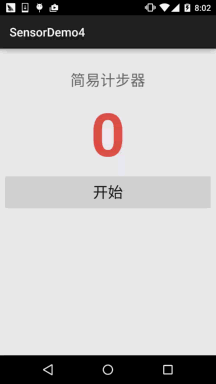
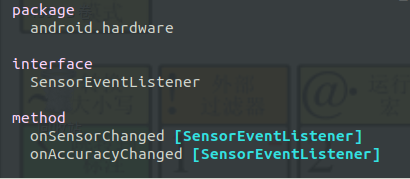
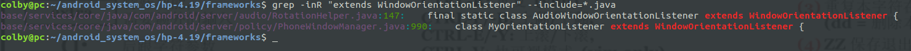
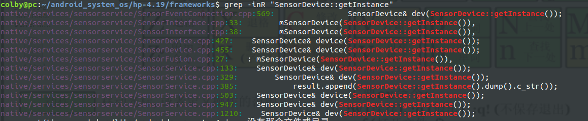
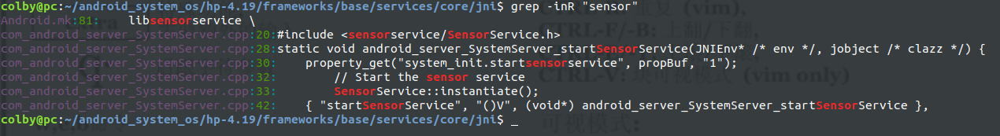

# Gsensor架构&屏幕翻转应用分析

## 1. app 层：

### 1.1 app层编程

这里是对加速度传感器的应用层编程范例：

https://www.runoob.com/w3cnote/android-tutorial-sensor3.html

**activity_main.xml**：

```xml
<LinearLayout xmlns:android="http://schemas.android.com/apk/res/android"
    android:layout_width="match_parent"
    android:layout_height="match_parent"
    android:orientation="vertical"
    android:padding="5dp">

    <TextView
        android:layout_width="wrap_content"
        android:layout_height="wrap_content"
        android:layout_gravity="center_horizontal"
        android:layout_marginTop="30dp"
        android:text="简易计步器"
        android:textSize="25sp" />

    <TextView
        android:id="@+id/tv_step"
        android:layout_width="wrap_content"
        android:layout_height="wrap_content"
        android:layout_gravity="center_horizontal"
        android:layout_marginTop="5dp"
        android:text="0"
        android:textColor="#DE5347"
        android:textSize="100sp"
        android:textStyle="bold" />

    <Button
        android:id="@+id/btn_start"
        android:layout_width="match_parent"
        android:layout_height="64dp"
        android:text="开始"
        android:textSize="25sp" />

</LinearLayout>
```

```java
public class MainActivity extends AppCompatActivity implements View.OnClickListener, SensorEventListener {

    private SensorManager sManager;
    private Sensor mSensorAccelerometer;
    private TextView tv_step;
    private Button btn_start;
    private int step = 0;   //步数
    private double oriValue = 0;  //原始值
    private double lstValue = 0;  //上次的值
    private double curValue = 0;  //当前值
    private boolean motiveState = true;   //是否处于运动状态
    private boolean processState = false;   //标记当前是否已经在计步


    @Override
    protected void onCreate(Bundle savedInstanceState) {
        super.onCreate(savedInstanceState);
        setContentView(R.layout.activity_main);
        /***
        	1. 获取SENSOR_SERVICE
        	2. 获取传感器 
        	3. 注册这个传感器的监听
        */
        sManager = (SensorManager) getSystemService(SENSOR_SERVICE);
        mSensorAccelerometer = sManager.getDefaultSensor(Sensor.TYPE_ACCELEROMETER);
        sManager.registerListener(this, mSensorAccelerometer, SensorManager.SENSOR_DELAY_UI);
        
        
        bindViews();
    }

    private void bindViews() {

        tv_step = (TextView) findViewById(R.id.tv_step);
        btn_start = (Button) findViewById(R.id.btn_start);
        btn_start.setOnClickListener(this);
    }


    @Override
    public void onSensorChanged(SensorEvent event) {
        double range = 1;   //设定一个精度范围
        float[] value = event.values;
        curValue = magnitude(value[0], value[1], value[2]);   //计算当前的模
        //向上加速的状态
        if (motiveState == true) {
            if (curValue >= lstValue) lstValue = curValue;
            else {
                //检测到一次峰值
                if (Math.abs(curValue - lstValue) > range) {
                    oriValue = curValue;
                    motiveState = false;
                }
            }
        }
        //向下加速的状态
        if (motiveState == false) {
            if (curValue <= lstValue) lstValue = curValue;
            else {
                if (Math.abs(curValue - lstValue) > range) {
                    //检测到一次峰值
                    oriValue = curValue;
                    if (processState == true) {
                        step++;  //步数 + 1
                        if (processState == true) {
                            tv_step.setText(step + "");    //读数更新
                        }
                    }
                    motiveState = true;
                }
            }
        }
    }

    @Override
    public void onAccuracyChanged(Sensor sensor, int accuracy) {}

    @Override
    public void onClick(View v) {
        step = 0;
        tv_step.setText("0");
        if (processState == true) {
            btn_start.setText("开始");
            processState = false;
        } else {
            btn_start.setText("停止");
            processState = true;
        }
    }

    //向量求模
    public double magnitude(float x, float y, float z) {
        double magnitude = 0;
        magnitude = Math.sqrt(x * x + y * y + z * z);
        return magnitude;
    }

    @Override
    protected void onDestroy() {
        super.onDestroy();
        sManager.unregisterListener(this);
    }
}
```



这里主要关注：

1. MainActivity 实现了SensorEventListener 接口： MainActivity implements SensorEventListener 

2. 这个接口中只有两个函数：



```java
public interface SensorEventListener {
	public void onSensorChanged(SensorEvent event);
	public void onAccuracyChanged(Sensor sensor, int accuracy);
}
```

其实这两个接口是方便 将下层的数据回传到上层的应用层中的。

**总结：**

- APP层使用GSensor的步骤：
  - 获取传感器服务
  - 获取想要的传感器
  - 注册对这个传感器的监听

### 1.2 framework层中屏幕翻转逻辑

这里的APP层是指 framework层中类似 app中使用Gsensor的方式

代码的入口：

```shell
hp-4.19/frameworks$ 
vim ./base/services/core/java/com/android/server/policy/WindowOrientationListener.java
```

```java
// onSensorChanged [WindowOrientationListener.AccelSensorJudge]

public void onSensorChanged(SensorEvent event) {
    ...
        if (proposedRotation != oldProposedRotation && proposedRotation >= 0) {
                if (LOG) {
                    Slog.v(TAG, "Proposed rotation changed!  proposedRotation=" + proposedRotation
                            + ", oldProposedRotation=" + oldProposedRotation);
                }
            	// 这里建议在 0 和 180 度的，情况下才允许旋转
                // CHAOZHUO BEGIN Proposed：建议；Rotation:旋转
                if (proposedRotation == Surface.ROTATION_0 || proposedRotation == Surface.ROTATION_180) {
                    onProposedRotationChanged(proposedRotation);
                }
                // CHAOZHUO END
            }
        ...
}
```

1. onSensorChanged 是一个回调。
2. 作用域：[WindowOrientationListener.AccelSensorJudge]
3. 现在找：AccelSensorJudge 是谁创建的，又是被最终赋值给谁？

```java
// WindowOrientationListener [WindowOrientationListener]
private WindowOrientationListener(Context context, Handler handler, int rate) {  
        mHandler = handler;
    
    /***
    	1. 获取传感器服务
    	2. 获取传感器
    	3. 注册这个传感器的监听
    */
        mSensorManager = (SensorManager)context.getSystemService(Context.SENSOR_SERVICE);                                                                                                                          
        mRate = rate;
        mSensor = mSensorManager.getDefaultSensor(Sensor.TYPE_DEVICE_ORIENTATION);       
    
        if (mSensor != null) {
            mOrientationJudge = new OrientationSensorJudge();
        }
    
        if (mOrientationJudge == null) {
            // private static final boolean USE_GRAVITY_SENSOR = false;
            mSensor = mSensorManager.getDefaultSensor(USE_GRAVITY_SENSOR
                    ? Sensor.TYPE_GRAVITY : Sensor.TYPE_ACCELEROMETER);// 所以这里使用的是 加速度传感器。
            
            if (mSensor != null) {                                              
                // Create listener only if sensors do exist                     
                mOrientationJudge = new AccelSensorJudge(context);     // 在这创建并被赋值给了    mOrientationJudge      ； private OrientationJudge mOrientationJudge;
            }
        }
    }
```

1. 首先 WindowOrientationListener 是一个构造函数；
2. 是一个抽象类：public abstract class WindowOrientationListener {}
3. 在这个构造中我们已经找到了 getSystemService(Context.SENSOR_SERVICE)； 这个在app开发中，也是同样调用这个服务。
4. 这里简短的记录一下： 是谁继承了WindowOrientationListener



```shell
server/policy/PhoneWindowManager.java:990:    class MyOrientationListener extends WindowOrientationListener {

# 和audio相关的 就先不看了
server/audio/RotationHelper.java:147:    final static class AudioWindowOrientationListener extends WindowOrientationListener {
```

**这里仅仅简短的记录一下： 是 PhoneWindowManager的 **MyOrientationListener 继承了这个类，由于我们这里是重点分析Gsensor。这里就不在展开分析了。

这里还需要继续回头分析这里的 WindowOrientationListener 构造函数。

**从构造函数中我们分析，我们相对于app层使用Gsensor还少一步，就是注册对传感器的监听：**

```java
// enable [WindowOrientationListener]
// disable [WindowOrientationListener]


public void enable() {
        synchronized (mLock) {
            if (mSensor == null) {
                Slog.w(TAG, "Cannot detect sensors. Not enabled");
                return;
            }
            if (mEnabled == false) {
                if (LOG) {
                    Slog.d(TAG, "WindowOrientationListener enabled");
                }
                mOrientationJudge.resetLocked();
                if (mSensor.getType() == Sensor.TYPE_ACCELEROMETER) {
                    mSensorManager.registerListener(
                            mOrientationJudge, mSensor, mRate, DEFAULT_BATCH_LATENCY, mHandler); /*  在这里找到了注册：那是谁调用的呢*/
                } else {
                    mSensorManager.registerListener(mOrientationJudge, mSensor, mRate, mHandler);
                }
                mEnabled = true;
            }
        }
    }

    /**
     * Disables the WindowOrientationListener.
     */
    public void disable() {
        synchronized (mLock) {
            if (mSensor == null) {
                Slog.w(TAG, "Cannot detect sensors. Invalid disable");
                return;
            }
            if (mEnabled == true) {
                if (LOG) {
                    Slog.d(TAG, "WindowOrientationListener disabled");
                }
                mSensorManager.unregisterListener(mOrientationJudge);/*将其注销*/
                mEnabled = false;
            }
        }
    }
```

是谁调用了 WindowOrientationListener 的 enable?

```shell
PhoneWindowManager.java
```

```java
// updateOrientationListenerLp [PhoneWindowManager]

// mOrientationListener = new MyOrientationListener(mContext, mHandler);

void updateOrientationListenerLp() {
        if (!mOrientationListener.canDetectOrientation()) {
            return;
        }
    
        boolean disable = true;

        if (mScreenOnEarly && mAwake &&
                mKeyguardDrawComplete && mWindowManagerDrawComplete) {
            if (needSensorRunningLp()) {
                disable = false;

                if (!mOrientationSensorEnabled) {
                    mOrientationListener.enable();// 在这里调用了
                    if(localLOGV) Slog.v(TAG, "Enabling listeners");
                    mOrientationSensorEnabled = true;
                }
            }
        }

        if (disable && mOrientationSensorEnabled) {
            mOrientationListener.disable();
            if(localLOGV) Slog.v(TAG, "Disabling listeners");
            mOrientationSensorEnabled = false;
        }
    }
```

看到 MyOrientationListener 就知道已经关联上了。不明白的同志可以看上面的详细分析过程。自己找答案。

**这里之前都分析的是 APP层的编程**

------

**从这里开始就要开始重点分析 SensorManager 和 Sensor了： **

我们暂时将上关于Gsensor的部分提取出来：

```java
/// 1. 获取Sensor服务
mSensorManager = (SensorManager)context.getSystemService(Context.SENSOR_SERVICE);

// 2. 获取加速度传感器
mSensor = mSensorManager.getDefaultSensor(USE_GRAVITY_SENSOR
                    ? Sensor.TYPE_GRAVITY : Sensor.TYPE_ACCELEROMETER);

// 3. 注册传感器的监听
mSensorManager.registerListener(
                            mOrientationJudge, mSensor, mRate, DEFAULT_BATCH_LATENCY, mHandler);
```


## 2. framework层：

### 2.1 java层

#### 2.1.1 SensorManager

这里就从Context.SENSOR_SERVICE 开始分析，既然，这里拿这个获取服务，那么。就有人那这个关键字去注册服务的。现在就找到 注册服务的地方。

```shell
vim base/core/java/android/app/SystemServiceRegistry.java +421
```

```java
final class SystemServiceRegistry {
    static {
    ...
    	registerService(Context.SENSOR_SERVICE, SensorManager.class,
                new CachedServiceFetcher<SensorManager>() {
            @Override
            public SensorManager createService(ContextImpl ctx) {
                return new SystemSensorManager(ctx.getOuterContext(),
                  ctx.mMainThread.getHandler().getLooper());
            }});
    ...
	}
}
```

1. 注册服务是在 SystemServiceRegistry 类的静态代码块中进行注册的。也就是所，当第一次加载这个类的时候，就已经完成了注册。

```java
// registerService [SystemServiceRegistry]
private static <T> void registerService(String serviceName, Class<T> serviceClass,      
            ServiceFetcher<T> serviceFetcher) {
        SYSTEM_SERVICE_NAMES.put(serviceClass, serviceName);
        SYSTEM_SERVICE_FETCHERS.put(serviceName, serviceFetcher);
    }

private static final HashMap<Class<?>, String> SYSTEM_SERVICE_NAMES = new HashMap<Class<?>, String>();

private static final HashMap<String, ServiceFetcher<?>> SYSTEM_SERVICE_FETCHERS = new HashMap<String, ServiceFetcher<?>>();


public static String getSystemServiceName(Class<?> serviceClass) {
        return SYSTEM_SERVICE_NAMES.get(serviceClass);  // 这个是对应的拿             
    }

public static Object getSystemService(ContextImpl ctx, String name) {
        ServiceFetcher<?> fetcher = SYSTEM_SERVICE_FETCHERS.get(name);
        return fetcher != null ? fetcher.getService(ctx) : null;
    }
```

1. 发现这里的注册仅仅是加到 一个键值对中。
2. 注册就是放到一个键值对中，那拿是getSystemServiceName() 发现是个静态方法。那是如何调用的呢？

```shell
hp-4.19/frameworks$ vim base/core/java/android/app/ContextImpl.java +1517
```

```java
// getSystemService [ContextImpl]
@Override                 
public Object getSystemService(String name) {
        return SystemServiceRegistry.getSystemService(this, name);
    }

// getSystemServiceName [ContextImpl]
@Override
    public String getSystemServiceName(Class<?> serviceClass) {
        return SystemServiceRegistry.getSystemServiceName(serviceClass); 
    }
```

1. 从 Override 中我们知道这个是被复写的方法：

```java
class ContextImpl extends Context {}
```

1. 从中我们就能发现， 上面被复写的方法，肯定是来自于 Context 类中的。
2. 那 Context 类中是不是有一个static的 getSystemService()方法呢？

```shell
hp-4.19/frameworks$ vim ./base/core/java/android/content/Context.java
```

```java
public abstract class Context {
    
    /* 
     * @see #getSystemService
     * @see android.hardware.SensorManager
     */
    public static final String SENSOR_SERVICE = "sensor";// 定义处
    
    // 1. 直接用字符串去获取服务
    public abstract Object getSystemService(@ServiceName @NonNull String name);
    
    // 2. 用类去获取服务
    @SuppressWarnings("unchecked")               
    public final <T> T getSystemService(Class<T> serviceClass) {
        String serviceName = getSystemServiceName(serviceClass);
        return serviceName != null ? (T)getSystemService(serviceName) : null;
        /* 用类获取服务的时候，也是先在 HashMap 去找对应的字符串，如果没有找到直接就返回 null*/
    }
}
```

这里我们确实找到了.

从上面Context类中对这两个方法的定义中，我们发现两个使用方法：

1. 直接用字符串去获取服务
2. 用类去获取服务

```java
// 源码中的使用案例：

// 1. 直接用字符串去获取服务
mSensorManager = (SensorManager)context.getSystemService(Context.SENSOR_SERVICE);

// 2. 用类去获取服务
mStorageManager = mContext.getSystemService(StorageManager.class);
```

**显然我们这里的传感器服务是通过第一种方式获得的。**

**截止这里：**

我们就分析清楚了，这里的服务，并没有加入到 SystemManager  (也就是Binder 0)中，也就是说通过 Context获得的服务都不是通过 跨进程（binder）方式进行通信的。**这种服务，只不过是同一个进程中的函数调用罢了，并不能算是真正意义上的服务。**

------


**Q 我这里有一个疑问， 这样做的意义在哪里，为何不直接去 new SensorManager 呢? 反正也是在找这个类。**

这里就要从 上面分析过的 注册这个服务说起了：

```java
final class SystemServiceRegistry {
    static {
    ...
    	registerService(Context.SENSOR_SERVICE, SensorManager.class,
                new CachedServiceFetcher<SensorManager>() {
            @Override
            public SensorManager createService(ContextImpl ctx) {
                return new SystemSensorManager(ctx.getOuterContext(),
                  ctx.mMainThread.getHandler().getLooper());// new 了这个类。
            }});
    ...
	}
}
```

```java
static abstract class CachedServiceFetcher<T> implements ServiceFetcher<T> {
        private final int mCacheIndex;

        public CachedServiceFetcher() {
            mCacheIndex = sServiceCacheSize++;                 
        }

        @Override
        @SuppressWarnings("unchecked")
        public final T getService(ContextImpl ctx) {
            final Object[] cache = ctx.mServiceCache;
            synchronized (cache) {
                // Fetch or create the service.
                Object service = cache[mCacheIndex];
                if (service == null) {
                    service = createService(ctx);// 这里就会被调用到
                    cache[mCacheIndex] = service;
                }
                return (T)service;
            }
        }

        public abstract T createService(ContextImpl ctx);
    }
```

```java
static abstract interface ServiceFetcher<T> {       
        T getService(ContextImpl ctx);
    }
```

这里有了这么多函数作为铺垫：我们就可以分析了：

要想解答这个问题，我们先模拟一个调用路线。**这里模拟，获取这个服务的过程，也就是mSensorManager = (SensorManager)context.getSystemService(Context.SENSOR_SERVICE);**

```shell
app -> context.getSystemService(Context.SENSOR_SERVICE); ->  

-> getSystemService [Context] -> 

-> getSystemService [ContextImpl] ->

-> getSystemService [SystemServiceRegistry] ->

-> getService [CachedServiceFetcher<SensorManager>] ->

-> createService [CachedServiceFetcher<SensorManager>] ->

-> new SystemSensorManager(ctx.getOuterContext(),ctx.mMainThread.getHandler().getLooper())


```

这里分析这个 getSystemService [SystemServiceRegistry]

```java
//  getSystemService [SystemServiceRegistry]
public static Object getSystemService(ContextImpl ctx, String name) {
        ServiceFetcher<?> fetcher = SYSTEM_SERVICE_FETCHERS.get(name);
        return fetcher != null ? fetcher.getService(ctx) : null;
    }
```

1. 这里找到了我们注册的时候，放进去的 new CachedServiceFetcher<SensorManager>()

**从中我们发现， 最终确实 就是通过 new SystemSensorManager 得到了。**

这样做的好处，我还是没有明显的感觉到： 这个问题只能是根据以后的积累，在思考了。暂时，能力比较有限，也分析不出什么出来了。

------

这里我们知道了 context.getSystemService(Context.SENSOR_SERVICE); 就是帮我们new SystemSensorManager 出来。那我们接着app使用的第二个步骤开始分析：

**获取特定的传感器：**

```java
// 2. 获取加速度传感器
mSensor = mSensorManager.getDefaultSensor(USE_GRAVITY_SENSOR
                    ? Sensor.TYPE_GRAVITY : Sensor.TYPE_ACCELEROMETER);
```

既然我们知道  new SystemSensorManager 那 getDefaultSensor 是不是要从这个类中找了呢。

```shell
hp-4.19/frameworks$ vim ./base/core/java/android/hardware/SystemSensorManager.java
```

```java
public class SystemSensorManager extends SensorManager {
    // 没有找到 getDefaultSensor 那就是在 SensorManager 中
}
```

```shell
hp-4.19/frameworks$ vim ./base/core/java/android/hardware/SensorManager.java
```

```java
// getDefaultSensor [SensorManager]
public Sensor getDefaultSensor(int type) {
        List<Sensor> l = getSensorList(type);// 获取 传感器列表
        boolean wakeUpSensor = false;
        if (type == Sensor.TYPE_PROXIMITY || type == Sensor.TYPE_SIGNIFICANT_MOTION ||
                type == Sensor.TYPE_TILT_DETECTOR || type == Sensor.TYPE_WAKE_GESTURE ||
                type == Sensor.TYPE_GLANCE_GESTURE || type == Sensor.TYPE_PICK_UP_GESTURE ||
                type == Sensor.TYPE_WRIST_TILT_GESTURE) {
            wakeUpSensor = true;
        }    

        for (Sensor sensor : l) { 
            if (sensor.isWakeUpSensor() == wakeUpSensor) return sensor;  // 从这里出
        }    
        return null;
    }

// getSensorList [SensorManager]
public List<Sensor> getSensorList(int type) {
        // cache the returned lists the first time
        List<Sensor> list;
        final List<Sensor> fullList = getFullSensorList();
        synchronized (mSensorListByType) {
            list = mSensorListByType.get(type);
            if (list == null) {
                if (type == Sensor.TYPE_ALL) {
                    list = fullList;
                } else {
                    list = new ArrayList<Sensor>();
                    for (Sensor i : fullList) {
                        if (i.getType() == type)
                            list.add(i);
                    }
                }
                list = Collections.unmodifiableList(list);
                mSensorListByType.append(type, list);
            }
        }
        return list;
    }
```

1. 看到了一个切入点：getSensorList
2. getSensorList函数做的是从众多传感器中，找出我们想要的传感器  Sensor.TYPE_ACCELEROMETER = 1；
3. 现在两个思路，一 去找 TYPE_ACCELEROMETER 他的注册点，二、只需要分析 getSensorList，逆向思维，找里面的 xxx,什么时候加入了 TYPE_ACCELEROMETER 传感器。

**现在就去找，我们的 TYPE_ACCELEROMETER 是何时，注册进我们的系统中的： **

用第一种思路，直接搜索  TYPE_ACCELEROMETER ，并没有找到，我们需要的信息。

所以这里只能使用第二种思路：**踏踏实实分析代码咯!!!**

```java
// getFullSensorList [SystemSensorManager]

private final ArrayList<Sensor> mFullSensorsList = new ArrayList<>();

@Override
protected List<Sensor> getFullSensorList() {
        return mFullSensorsList;
    }
```

逆向思维：在哪里加入的呢？

```java
// SystemSensorManager [SystemSensorManager]

/** {@hide} */
public SystemSensorManager(Context context, Looper mainLooper) {                                                                                                                                               
        synchronized(sLock) {     
            if (!sNativeClassInited) {
                sNativeClassInited = true;
                nativeClassInit(); // 在c中先找到 java Sensor类中的 函数 和 变量，但并没有创建 Sensor对象。
            }
        }
    
        mMainLooper = mainLooper; 
        mTargetSdkLevel = context.getApplicationInfo().targetSdkVersion;
        mContext = context;
        mNativeInstance = nativeCreate(context.getOpPackageName());// 创建了对应c 层的 SensorManager 对象。
    
        // initialize the sensor list
        for (int index = 0;;++index) {
            Sensor sensor = new Sensor();// 在 java中创建的 Sensor对象
            if (!nativeGetSensorAtIndex(mNativeInstance, sensor, index)) break;
            mFullSensorsList.add(sensor); /* 是在这里加入的呢 */
            mHandleToSensor.put(sensor.getHandle(), sensor);
        }
    }
```

1.  nativeClassInit 和 nativeCreate 和 nativeGetSensorAtIndex 这两个函数都做了什么，这个分析我们就放在jni层去分析了。
2. nativeCreate 创建了 c层的 SensorManager 并将c对象保存在 java中的 mNativeInstance
3. 在 nativeGetSensorAtIndex 的第一个参数就是  mNativeInstance

### 2.2 jni层

```cpp
static const JNINativeMethod gSystemSensorManagerMethods[] = {                                                                                                                                                     
    {"nativeClassInit",
            "()V",
            (void*)nativeClassInit },
    {"nativeCreate",
             "(Ljava/lang/String;)J",
             (void*)nativeCreate },

    {"nativeGetSensorAtIndex",
            "(JLandroid/hardware/Sensor;I)Z",
            (void*)nativeGetSensorAtIndex },

    {"nativeGetDynamicSensors",
            "(JLjava/util/List;)V",
            (void*)nativeGetDynamicSensors },

    {"nativeIsDataInjectionEnabled",
            "(J)Z",
            (void*)nativeIsDataInjectionEnabled},
};

static const JNINativeMethod gBaseEventQueueMethods[] = { 
    {"nativeInitBaseEventQueue",
             "(JLjava/lang/ref/WeakReference;Landroid/os/MessageQueue;Ljava/lang/String;ILjava/lang/String;)J",
             (void*)nativeInitSensorEventQueue },

    {"nativeEnableSensor",
            "(JIII)I",
            (void*)nativeEnableSensor },

    {"nativeDisableSensor",
            "(JI)I",
            (void*)nativeDisableSensor },

    {"nativeDestroySensorEventQueue",
            "(J)V",
            (void*)nativeDestroySensorEventQueue },

    {"nativeFlushSensor",
            "(J)I",
            (void*)nativeFlushSensor },

    {"nativeInjectSensorData",
            "(JI[FIJ)I",translateNativeSensorToJavaSensor
            (void*)nativeInjectSensorData },
};
```

```cpp
int register_android_hardware_SensorManager(JNIEnv *env)
{
    RegisterMethodsOrDie(env, "android/hardware/SystemSensorManager",
            gSystemSensorManagerMethods, NELEM(gSystemSensorManagerMethods));

    RegisterMethodsOrDie(env, "android/hardware/SystemSensorManager$BaseEventQueue",
            gBaseEventQueueMethods, NELEM(gBaseEventQueueMethods));

    gBaseEventQueueClassInfo.clazz = FindClassOrDie(env,
            "android/hardware/SystemSensorManager$BaseEventQueue");

    gBaseEventQueueClassInfo.dispatchSensorEvent = GetMethodIDOrDie(env,
            gBaseEventQueueClassInfo.clazz, "dispatchSensorEvent", "(I[FIJ)V");

    gBaseEventQueueClassInfo.dispatchFlushCompleteEvent = GetMethodIDOrDie(env,
            gBaseEventQueueClassInfo.clazz, "dispatchFlushCompleteEvent", "(I)V");

    gBaseEventQueueClassInfo.dispatchAdditionalInfoEvent = GetMethodIDOrDie(env,
            gBaseEventQueueClassInfo.clazz, "dispatchAdditionalInfoEvent", "(III[F[I)V");

    return 0;
}
```


#### 2.2.1 nativeClassInit

```java
// nativeClassInit [SystemSensorManager]
private static native void nativeClassInit();
```

```shell
hp-4.19/frameworks$ vim base/core/jni/android_hardware_SensorManager.cpp +433
```

```cpp
{"nativeClassInit",           
            "()V",
            (void*)nativeClassInit },
```

```cpp

struct SensorOffsets
{
    jclass      clazz;
    //fields
    jfieldID    name;
    jfieldID    vendor;
    jfieldID    version;
    jfieldID    handle;
    jfieldID    range;
    jfieldID    resolution;
    jfieldID    power;
    jfieldID    minDelay;
    jfieldID    fifoReservedEventCount;
    jfieldID    fifoMaxEventCount;
    jfieldID    stringType;
    jfieldID    requiredPermission;
    jfieldID    maxDelay;
    jfieldID    flags;
    //methods
    jmethodID   setType;
    jmethodID   setUuid;
    jmethodID   init;  
} gSensorOffsets;

struct ListOffsets {
    jclass      clazz;
    jmethodID   add;
} gListOffsets;

static void
nativeClassInit (JNIEnv *_env, jclass _this)
{
    //android.hardware.Sensor
    SensorOffsets& sensorOffsets = gSensorOffsets;
    jclass sensorClass = (jclass) _env->NewGlobalRef(_env->FindClass("android/hardware/Sensor"));// 找的java的class
    sensorOffsets.clazz       = sensorClass;
    sensorOffsets.name        = _env->GetFieldID(sensorClass, "mName",      "Ljava/lang/String;");
    sensorOffsets.vendor      = _env->GetFieldID(sensorClass, "mVendor",    "Ljava/lang/String;");
    sensorOffsets.version     = _env->GetFieldID(sensorClass, "mVersion",   "I");
    sensorOffsets.handle      = _env->GetFieldID(sensorClass, "mHandle",    "I");
    sensorOffsets.range       = _env->GetFieldID(sensorClass, "mMaxRange",  "F");
    sensorOffsets.resolution  = _env->GetFieldID(sensorClass, "mResolution","F");
    sensorOffsets.power       = _env->GetFieldID(sensorClass, "mPower",     "F");
    sensorOffsets.minDelay    = _env->GetFieldID(sensorClass, "mMinDelay",  "I");
    sensorOffsets.fifoReservedEventCount =
            _env->GetFieldID(sensorClass, "mFifoReservedEventCount",  "I");
    sensorOffsets.fifoMaxEventCount = _env->GetFieldID(sensorClass, "mFifoMaxEventCount",  "I");
    sensorOffsets.stringType = _env->GetFieldID(sensorClass, "mStringType", "Ljava/lang/String;");
    sensorOffsets.requiredPermission = _env->GetFieldID(sensorClass, "mRequiredPermission",
                                                        "Ljava/lang/String;");
    sensorOffsets.maxDelay    = _env->GetFieldID(sensorClass, "mMaxDelay",  "I");
    sensorOffsets.flags = _env->GetFieldID(sensorClass, "mFlags",  "I");

    sensorOffsets.setType = _env->GetMethodID(sensorClass, "setType", "(I)Z");
    sensorOffsets.setUuid = _env->GetMethodID(sensorClass, "setUuid", "(JJ)V");
    sensorOffsets.init = _env->GetMethodID(sensorClass, "<init>", "()V");

    // java.util.List;
    ListOffsets& listOffsets = gListOffsets;
    jclass listClass = (jclass) _env->NewGlobalRef(_env->FindClass("java/util/List"));
    listOffsets.clazz = listClass;
    listOffsets.add = _env->GetMethodID(listClass, "add", "(Ljava/lang/Object;)Z");
}
```

1.  gSensorOffsets 和 gListOffsets 是一个全局的变量
2. 主要完成： 找到java 中的类 Sensor 和 List， 保存 FieldID 和 MethodID
3. **注意：**这里并没有创建 Sensor对象和 List对象

#### 2.2.2 nativeCreate

```java
// nativeCreate [SystemSensorManager]
private static native long nativeCreate(String opPackageName); 
```

```cpp
{"nativeCreate",
             "(Ljava/lang/String;)J",
             (void*)nativeCreate },
```

```cpp
static jlong
nativeCreate
(JNIEnv *env, jclass clazz, jstring opPackageName)
{
    ScopedUtfChars opPackageNameUtf(env, opPackageName);  /*字符串的转换*/          
    return (jlong) &SensorManager::getInstanceForPackage(String16(opPackageNameUtf.c_str()));
}
```

```cpp
// SensorManager.cpp

std::map<String16, SensorManager*> android::SensorManager::sPackageInstances;

SensorManager& SensorManager::getInstanceForPackage(const String16& packageName) {
    Mutex::Autolock _l(sLock);
    SensorManager* sensorManager;
    std::map<String16, SensorManager*>::iterator iterator =
        sPackageInstances.find(packageName);                                                                                                                                                                       

    if (iterator != sPackageInstances.end()) {
        sensorManager = iterator->second;
    } else {
        String16 opPackageName = packageName;
    
        sensorManager = new SensorManager(opPackageName);//  这里根据包的名字创建了 c层的 SensorManager
                

        // Stash the per package sensor manager.
        sPackageInstances.insert(std::make_pair(opPackageName, sensorManager));
    }
        
    return *sensorManager;
}


SensorManager::SensorManager(const String16& opPackageName)
    : mSensorList(0), mOpPackageName(opPackageName) {
    // okay we're not locked here, but it's not needed during construction
    assertStateLocked(); // 这个函数也做了很多事。 有空可以细致看一看的
}
```

1.  nativeCreate 主要的功能是创建了 对应c层中的  sensorManager 对象。 并将这个c的对象回传给java层 保存。**这个就是 JNI中很重要的一种思想： 动态对动态，静态对静态**， 这里显然是动态。


#### 2.2.3 nativeGetSensorAtIndex

```java
// nativeGetSensorAtIndex [SystemSensorManager]
private static native boolean nativeGetSensorAtIndex(long nativeInstance,Sensor sensor, int index);
```

```cpp
{"nativeGetSensorAtIndex",
            "(JLandroid/hardware/Sensor;I)Z",
            (void*)nativeGetSensorAtIndex },
```

```cpp
static jboolean
nativeGetSensorAtIndex(JNIEnv *env, jclass clazz, jlong sensorManager, jobject sensor, jint index)                                                                                                                 
{
    SensorManager* mgr = reinterpret_cast<SensorManager*>(sensorManager);

    Sensor const* const* sensorList;
    ssize_t count = mgr->getSensorList(&sensorList);
    if (ssize_t(index) >= count) {
        return false;
    }

    return translateNativeSensorToJavaSensor(env, sensor/*java 已经创建好了*/, *sensorList[index]) != NULL;
}
```

1. 这儿传入的 sensorManager 对象，就是在 nativeCreate 中创建的 c层的 sensorManager对象。
2. 传入的 sensor ；他是一个java层的 Sensor 对象。
3. 传入的  index 是一个 0 ～ 不知道  的一个索引值
4. 这里的 sensorList 需要重点关注一下。

------

**重点分析：sensorList**

```cpp
Sensor const* const* sensorList;
ssize_t count = mgr->getSensorList(&sensorList);
```

```shell
hp-4.19/frameworks$ vim ./native/libs/gui/SensorManager.cpp
```

```cpp
ssize_t SensorManager::getSensorList(Sensor const* const** list) {
    Mutex::Autolock _l(mLock);
    status_t err = assertStateLocked();
    if (err < 0) {
        return static_cast<ssize_t>(err);
    }   
    *list = mSensorList;
    return static_cast<ssize_t>(mSensors.size());
}
```

1.  mSensorList 有那些操作呢？


------


```cpp
static jobject
translateNativeSensorToJavaSensor(JNIEnv *env, jobject sensor, const Sensor& nativeSensor) {
    const SensorOffsets& sensorOffsets(gSensorOffsets);

    if (sensor == NULL) {
        // Sensor sensor = new Sensor(); 如果java层中 不 new Sensor, 这里也会为 java 层 new Sersor 对象的。
        sensor = env->NewObject(sensorOffsets.clazz, sensorOffsets.init, "");
    }   

    if (sensor != NULL) {
        jstring name = env->NewStringUTF(nativeSensor.getName().string());
        jstring vendor = env->NewStringUTF(nativeSensor.getVendor().string());
        jstring requiredPermission =
                env->NewStringUTF(nativeSensor.getRequiredPermission().string());

        env->SetObjectField(sensor, sensorOffsets.name,      name);                                                                                                                                                
        env->SetObjectField(sensor, sensorOffsets.vendor,    vendor);
        env->SetIntField(sensor, sensorOffsets.version,      nativeSensor.getVersion());
        env->SetIntField(sensor, sensorOffsets.handle,       nativeSensor.getHandle());
        env->SetFloatField(sensor, sensorOffsets.range,      nativeSensor.getMaxValue());
        env->SetFloatField(sensor, sensorOffsets.resolution, nativeSensor.getResolution());
        env->SetFloatField(sensor, sensorOffsets.power,      nativeSensor.getPowerUsage());
        env->SetIntField(sensor, sensorOffsets.minDelay,     nativeSensor.getMinDelay());
        env->SetIntField(sensor, sensorOffsets.fifoReservedEventCount,
                         nativeSensor.getFifoReservedEventCount());
        env->SetIntField(sensor, sensorOffsets.fifoMaxEventCount,
                         nativeSensor.getFifoMaxEventCount());
        env->SetObjectField(sensor, sensorOffsets.requiredPermission,
                            requiredPermission);
        env->SetIntField(sensor, sensorOffsets.maxDelay, nativeSensor.getMaxDelay());
        env->SetIntField(sensor, sensorOffsets.flags, nativeSensor.getFlags());

        if (env->CallBooleanMethod(sensor, sensorOffsets.setType, nativeSensor.getType())
                == JNI_FALSE) {
            jstring stringType = getInternedString(env, &nativeSensor.getStringType());
            env->SetObjectField(sensor, sensorOffsets.stringType, stringType);
        }

        // TODO(b/29547335): Rename "setUuid" method to "setId".
        int64_t id = nativeSensor.getId();
        env->CallVoidMethod(sensor, sensorOffsets.setUuid, id, 0); 
    }   
    return sensor;
}
```

1. 主要完成了 对 java 创建的Sensor对象进行赋值操作。
2. 从这里 我们发现，我们要着重去分析 **nativeSensor**的来历


### 2.3 native 层

#### 2.3.1 加载 hal 库

**关键点:** SENSORS_HARDWARE_MODULE_ID

```shell
# SENSORS_HARDWARE_MODULE_ID 从这句话中我们就可以找到 frameworks中的调用的地方。
hp-4.19/frameworks$ vim native/services/sensorservice/SensorDevice.cpp +43
```

```cpp

ANDROID_SINGLETON_STATIC_INSTANCE(SensorDevice)
    
SensorDevice::SensorDevice()
    :  mSensorDevice(0),
       mSensorModule(0) {
           /*在这里加载 hal层的库：*/
    status_t err = hw_get_module(SENSORS_HARDWARE_MODULE_ID,
            (hw_module_t const**)&mSensorModule);

    ALOGE_IF(err, "couldn't load %s module (%s)",
            SENSORS_HARDWARE_MODULE_ID, strerror(-err));

    if (mSensorModule) {
        err = sensors_open_1(&mSensorModule->common, &mSensorDevice);

        ALOGE_IF(err, "couldn't open device for module %s (%s)",
                SENSORS_HARDWARE_MODULE_ID, strerror(-err));

        if (mSensorDevice) {
            if (mSensorDevice->common.version == SENSORS_DEVICE_API_VERSION_1_1 ||
                mSensorDevice->common.version == SENSORS_DEVICE_API_VERSION_1_2) {
                ALOGE(">>>> WARNING <<< Upgrade sensor HAL to version 1_3");
            }

            sensor_t const* list;
            ssize_t count = mSensorModule->get_sensors_list(mSensorModule, &list);
            mActivationCount.setCapacity(count);
            Info model;
            for (size_t i=0 ; i<size_t(count) ; i++) {
                mActivationCount.add(list[i].handle, model);
                mSensorDevice->activate(
                        reinterpret_cast<struct sensors_poll_device_t *>(mSensorDevice),
                        list[i].handle, 0);
            }
        }
    }
}
```

------

**Q SensorDevice 是谁创建的呢？**

1. 首先要搞明白：　ANDROID_SINGLETON_STATIC_INSTANCE

```shell
hp-4.19$ vim system/core/include/utils/Singleton.h
```

```shell
#define ANDROID_SINGLETON_STATIC_INSTANCE(TYPE)                 \
    template<> ::android::Mutex  \
        (::android::Singleton< TYPE >::sLock)(::android::Mutex::PRIVATE);  \
    template<> TYPE* ::android::Singleton< TYPE >::sInstance(0);  \
    template class ::android::Singleton< TYPE >;
    

```

```c

ANDROID_SINGLETON_STATIC_INSTANCE(SensorDevice)   // 等价于： 

template<> ::android::Mutex (::android::Singleton< SensorDevice >::sLock)(::android::Mutex::PRIVATE); 

template<> SensorDevice* ::android::Singleton< SensorDevice >::sInstance(0); // 定义了　sInstance　变量，并初始化为0　    注意这里不是声明

template class ::android::Singleton< SensorDevice >; 
```

1. Singleton 有是个什么鬼？

```cpp
#define ANDROID_API __attribute__((visibility("default")))

template <typename TYPE>
class ANDROID_API Singleton
{
public:
    static TYPE& getInstance() {
        Mutex::Autolock _l(sLock);
        TYPE* instance = sInstance;
        if (instance == 0) {
            instance = new TYPE();// 这里创建了　SensorDevice　
            sInstance = instance;                                                                                                                                                                                  
        }   
        return *instance;
    }   

    static bool hasInstance() {
        Mutex::Autolock _l(sLock);
        return sInstance != 0;
    }   
        
protected:
    ~Singleton() { };
    Singleton() { };

private:
    Singleton(const Singleton&);
    Singleton& operator = (const Singleton&);
    static Mutex sLock;
    static TYPE* sInstance;
};
```

1. **大胆猜测　我们这里的SensorDevice　是采用单例模式。**
2. 获得SensorDevice对象的地方：



在我们的os中，　并没有启动　SensorService　所以首先排除掉　SensorService.cpp中的内容。

通过查看Android.mk文件：

```makefile
LOCAL_PATH:= $(call my-dir)
include $(CLEAR_VARS)

LOCAL_SRC_FILES:= \
    BatteryService.cpp \
    CorrectedGyroSensor.cpp \
    Fusion.cpp \
    GravitySensor.cpp \
    LinearAccelerationSensor.cpp \
    OrientationSensor.cpp \
    RecentEventLogger.cpp \
    RotationVectorSensor.cpp \
    SensorDevice.cpp \　　　　　　# 在这
    SensorEventConnection.cpp \ # 在这
    SensorFusion.cpp \          # 在这                                                                                                                                                                                   
    SensorInterface.cpp \       # 在这
    SensorList.cpp \
    SensorRecord.cpp \
    SensorService.cpp \
    SensorServiceUtils.cpp \


LOCAL_CFLAGS:= -DLOG_TAG=\"SensorService\"

LOCAL_CFLAGS += -Wall -Werror -Wextra

LOCAL_CFLAGS += -fvisibility=hidden

LOCAL_SHARED_LIBRARIES := \
    libcutils \
    libhardware \
    libhardware_legacy \
    libutils \
    liblog \
    libbinder \
    libui \
    libgui \
    libcrypto

LOCAL_MODULE:= libsensorservice　# 最终被编译成库

include $(BUILD_SHARED_LIBRARY)


#####################################################################
# build executable
include $(CLEAR_VARS)

LOCAL_SRC_FILES:= \
    main_sensorservice.cpp　#　这个里面有 main 函数。

LOCAL_SHARED_LIBRARIES := \
    libsensorservice \
    libbinder \
    libutils

LOCAL_CFLAGS := -Wall -Werror -Wextra

LOCAL_MODULE_TAGS := optional

LOCAL_MODULE:= sensorservice

include $(BUILD_EXECUTABLE)
```

这里插一句：

```shell
main_sensorservice.cpp
```

```cpp
using namespace android;

int main(int /*argc*/, char** /*argv*/) {
    signal(SIGPIPE, SIG_IGN);
    SensorService::publishAndJoinThreadPool();
    return 0;
}
```

**昨天我错误的认为，在我们的os 中　就没有这个sensorservice进程。　很惊奇，没有c层的SensorService是怎么将　data　上报到java层的。　通过今天的阅读代码，我发现。这个sensorService的启动有两种方式，一种就是　自己独自占一个进程（main）；　还有一种方式就是，依附在其他进程中启动。**这里先透露一下，SensorService是依附在　SystemService这个进程中启动的。接下来就分析一下他是怎么在　SystemService中启动的。

1. 这里我的思路是　既然他们都被编译到了　libsensorservice　中，那通过Android.mk中查看，　是谁编译的时候依赖了　libsensorservice。结果不就出来了吗：　

```shell
hp-4.19/frameworks$ grep -inR "libsensorservice" --include=*.mk
base/services/core/jni/Android.mk:81:    libsensorservice \ # 这个就是我们要找的
native/services/sensorservice/Android.mk:40:LOCAL_MODULE:= libsensorservice
native/services/sensorservice/Android.mk:52:    libsensorservice \
```



```shell
hp-4.19/frameworks/base/services/core/jni$ vim com_android_server_SystemServer.cpp +33
```

```cpp
static void android_server_SystemServer_startSensorService(JNIEnv* /* env */, jobject /* clazz */) {
    char propBuf[PROPERTY_VALUE_MAX];
    property_get("system_init.startsensorservice", propBuf, "1");
    if (strcmp(propBuf, "1") == 0) {
        // Start the sensor service  注释里写的很明白，　从这里启动了　SensorService
        
        ALOGI("colby %s %d \n", __func__, __LINE__); // 打点　看是不是这样
        SensorService::instantiate();                 
    }   
}

/*
 * JNI registration.
 */
static const JNINativeMethod gMethods[] = { 
    /* name, signature, funcPtr */
    { "startSensorService", "()V", (void*) android_server_SystemServer_startSensorService },
};

int register_android_server_SystemServer(JNIEnv* env)
{
    return jniRegisterNativeMethods(env, "com/android/server/SystemServer",/*这里我们就可以直接找　SystemServer.java文件了*/
            gMethods, NELEM(gMethods));
}

```

1. **java层中的　SystemServer.java文件　通过jni调用　startSensorService　来启动SensorService**
2. 通过我的测试，　上面说的仅仅是其中启动　SensorService的一种方式，　这种方式需要在　intel_haier:/ # cat system/build.prop　中配置　system_init.startsensorservice=1　这样才能启动　SensorService.显然我们这里并是采用这种方式。
3. 这里我想把 SystemServer.java分析完。看看具体这种方式是在哪里被调用的。

```shell
hp-4.19/frameworks$ vim ./base/services/java/com/android/server/SystemServer.java
```

```java
// startBootstrapServices [SystemServer]

private static native void startSensorService();

private void startBootstrapServices() {
    startSensorService();
}

// 是谁调用了　startBootstrapServices
// run [SystemServer]
private void run() {
    // Start services.
        try {
            Trace.traceBegin(Trace.TRACE_TAG_SYSTEM_SERVER, "StartServices");
            startBootstrapServices();     // 在这里启动了服务
            
            startCoreServices();
            startOtherServices();
        } catch (Throwable ex) {
            Slog.e("System", "******************************************");
            Slog.e("System", "************ Failure starting system services", ex); 
            throw ex;
        } finally {
            Trace.traceEnd(Trace.TRACE_TAG_SYSTEM_SERVER);
        }
}

/**分析到这里，这种启动方式就算是找到源头了*/
public static void main(String[] args) {
        new SystemServer().run();               
    }
```

1. 这种方式启动的　SensorService是和　SystemServer　在同一个进程中

------


## 3. hal层

由于我们屏幕翻转主要使用了这个 iio-sensors.cpp相关的。我们这里先分析这个：

```shell
hp-4.19/hardware/libsensors$ vim iio-sensors.cpp
```

```cpp
static struct hw_module_methods_t sensors_methods = { 
    open: open_iio_sensors
};

struct sensors_module_t HAL_MODULE_INFO_SYM = { 
    common: {
        tag: HARDWARE_MODULE_TAG,
        version_major: 1,
        version_minor: 0,
        id: SENSORS_HARDWARE_MODULE_ID,
        name: "IIO Sensors",
        author: "Chih-Wei Huang",
        methods: &sensors_methods,
        dso: 0,
        reserved: { } 
    },
    get_sensors_list: sensors_get_sensors_list,
    set_operation_mode: 0
};
```

1.   id: SENSORS_HARDWARE_MODULE_ID,

2. 从id 中我们就能找到，在framework层中谁 加载了这个 hal的库


## 4. kernel层