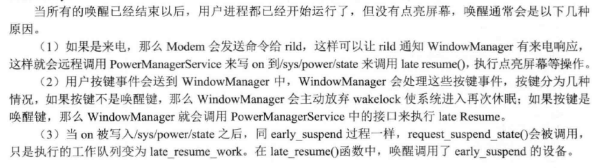
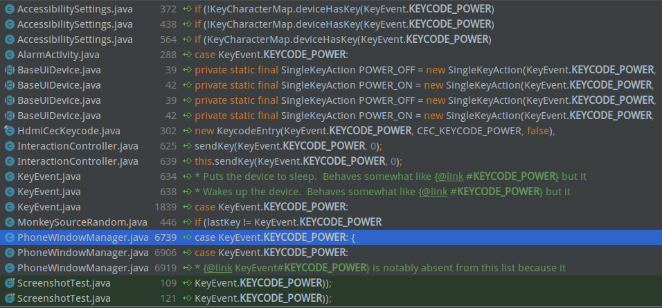
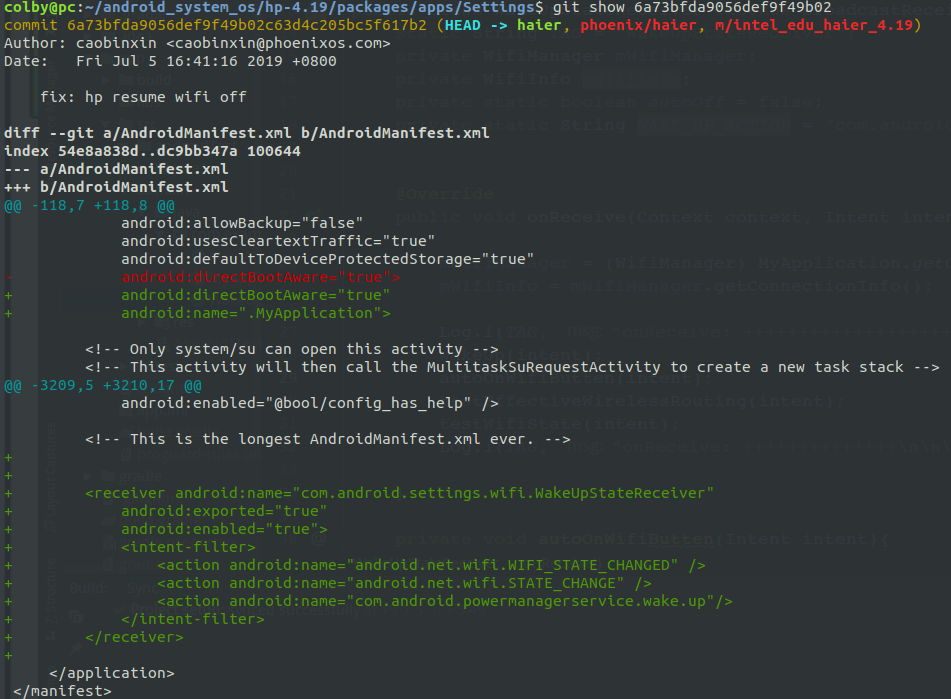
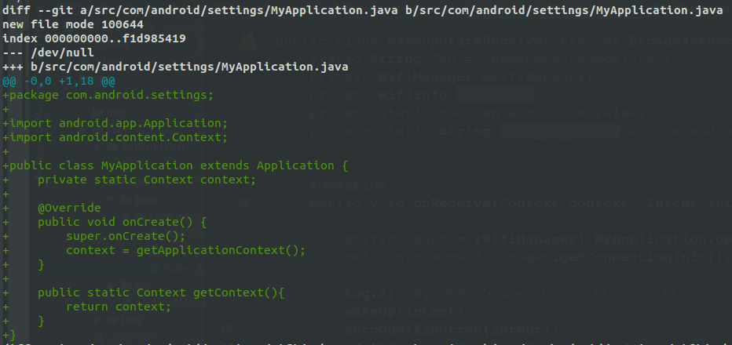
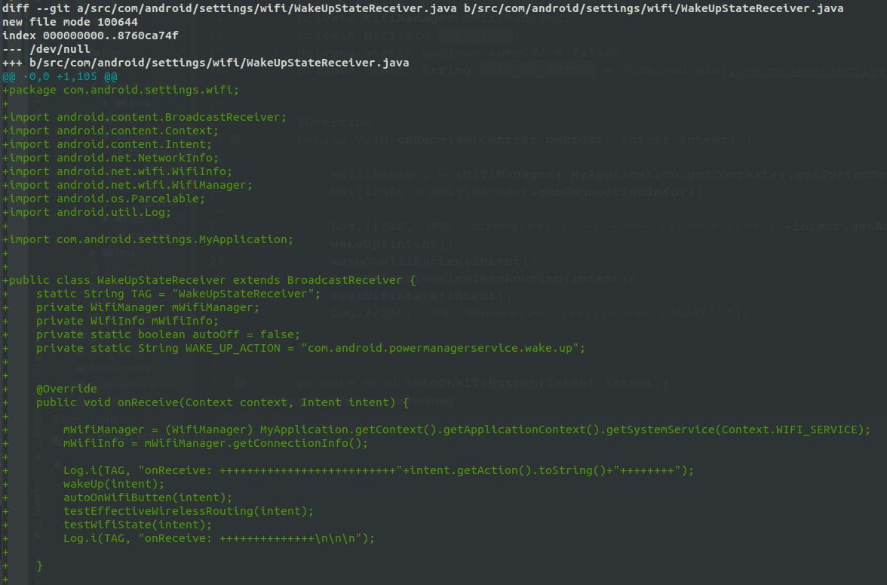
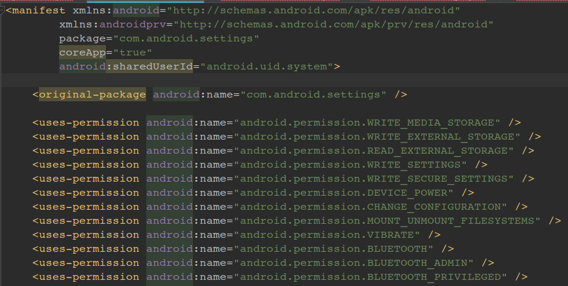

# wifi 测试：


## 1. 问题描述：

当很长时间才能休眠下去的情况发生之后。唤醒后，发现wifi不能够重新连接：


## 2. 问题定位

log记录：

```shell
E wpa_supplicant: Could not read interface wlan0 flags: No such device

D WifiNative-HAL: Failing getSupportedFeatureset because HAL isn't started

I wpa_supplicant: rfkill: Cannot open RFKILL control device

E WifiConnectivityManager: SingleScanListener onFailure: reason: -1 description: Scan was interrupted

E WifiStateMachine: Driver start failed, retrying

E wpa_supplicant: Could not read interface wlan0 flags: No such device

I WifiScanningService: wifi driver unloaded
```

ps: 这个问题没有继续升入的去查。而是采用了一种最简单的方法：

**思路:**每次唤醒之后， 都将 setting中的wifi开关，重新开关一次，这样wifi就能会连成功

## 3. fix

### 3.1 找到系统的唤醒点并发送广播

当Android从睡眠中被唤醒起来之后，并没有先外广播出，此时系统已经被唤醒。所以我们首先要找到，系统的唤醒点。让更上层 感知到此时系统已经被唤醒。

通过查资料我们知道： 当我们按下powerbt 的时候，input 系统会向 windManagerService上报 这个KEY，然后WMS 在根据当前的状态，是唤醒/休眠os. 然后在调用 PowerManagerService中的WakeUp去唤醒。



现在就根据这个信息，去源码中找到唤醒点。

#### 3.1.1 源码分析：

这里分析也可以有如下几个入口点：

1. 由于我们找的是和Power键相关的，所以我们可以先找这个键对应事件的定义：android/view/KeyEvent.java
2. 直接去WindowManager中去找。

android/view/KeyEvent.java

```java
public static final int KEYCODE_POWER           = 26;// 这里直接就找到这个键的编码了
```



从使用这个 KEYCODE_POWER 的地方，而且有和 WindowManager相关的就两个地方。

com/android/server/policy/PhoneWindowManager.java

```java
private static boolean isValidGlobalKey(int keyCode) {
        switch (keyCode) {
            case KeyEvent.KEYCODE_POWER:/*这个地方显然和wakeUp 是没有关系的*/
            case KeyEvent.KEYCODE_WAKEUP:
            case KeyEvent.KEYCODE_SLEEP:
                return false;
            default:
                return true;
        }
    }

/**
	interceptKeyBeforeQueueing 这个似乎说，在加入队列之前对 按键事件进行拦截
*/

public int interceptKeyBeforeQueueing(KeyEvent event, int policyFlags) {
    
    switch (keyCode) {
            case KeyEvent.KEYCODE_POWER: {/* 有关电源的 */
                result &= ~ACTION_PASS_TO_USER;
                isWakeKey = false; // wake-up will be handled separately 唤醒将单独处理
                if (down) {
                    /*截断电源键 按下*/
                    interceptPowerKeyDown(event, interactive);
                } else {
                    /*截断电源键 抬起*/
                    interceptPowerKeyUp(event, interactive, canceled);
                }
                break;
            }
    }
    
    // 唤醒是下这单独处理的。
    if (isWakeKey) {
            wakeUp(event.getEventTime(), mAllowTheaterModeWakeFromKey, "android.policy:KEY");
        }
}

```

这里我们说 isWakeKey = true 将会被单独处理， 所以我们这里应该去找，他在那被单独处理的。发现就在这个函数的最底下。

```java
private boolean wakeUp(long wakeTime, boolean wakeInTheaterMode, String reason) {
        final boolean theaterModeEnabled = isTheaterModeEnabled();
        if (!wakeInTheaterMode && theaterModeEnabled) {
            return false;
        }

        if (theaterModeEnabled) {
            Settings.Global.putInt(mContext.getContentResolver(),
                    Settings.Global.THEATER_MODE_ON, 0);
        }

        mPowerManager.wakeUp(wakeTime, reason);/*这儿就和PMS有关系了，有可能是这个*/
        return true;
    }
```

android/os/PowerManager.java

```java
public void wakeUp(long time, String reason) {
        try {
            mService.wakeUp(time, reason, mContext.getOpPackageName());/* 这里有调用了 mService.wakeUp*/
        } catch (RemoteException e) {
            throw e.rethrowFromSystemServer();
        }
    }
```

那我们这里应该去找这个 mService是谁了：

android/os/IPowerManager.java 这个是aidl自动生成的。通过阅读这个文件是我们发现服务是

```java
public interface IPowerManager extends android.os.IInterface
{
		public static abstract class Stub{
		
		}
}
// 谁继承了 extends IPowerManager.Stub 谁就是服务的实现处， 

```

```shell
hp-4.19/frameworks$ grep -inR "extends IPowerManager.Stub" --include=*.java

base/services/core/java/com/android/server/power/PowerManagerService.java:3338:    private final class BinderService extends IPowerManager.Stub {
```

果然搜索到服务了：PowerManagerService.java

```java
private final class BinderService extends IPowerManager.Stub {
    
    /**
    	从注释中，我们也可以再次确认，就是我们 客户端要调用的 wakeUp方法。
    	*/
    @Override // Binder call
        public void wakeUp(long eventTime, String reason, String opPackageName) {
            if (eventTime > SystemClock.uptimeMillis()) {
                throw new IllegalArgumentException("event time must not be in the future");
            }

            mContext.enforceCallingOrSelfPermission(
                    android.Manifest.permission.DEVICE_POWER, null);

            final int uid = Binder.getCallingUid();
            final long ident = Binder.clearCallingIdentity();
            try {
                wakeUpInternal(eventTime, reason, uid, opPackageName, uid);
            } finally {
                Binder.restoreCallingIdentity(ident);
            }
        }
    
    
    /**
    	这里是 休眠的函数
    
    */
    @Override // Binder call
        public void goToSleep(long eventTime, int reason, int flags) {
            if (eventTime > SystemClock.uptimeMillis()) {
                throw new IllegalArgumentException("event time must not be in the future");
            }

            mContext.enforceCallingOrSelfPermission(
                    android.Manifest.permission.DEVICE_POWER, null);

            final int uid = Binder.getCallingUid();
            final long ident = Binder.clearCallingIdentity();
            try {
                goToSleepInternal(eventTime, reason, flags, uid);
            } finally {
                Binder.restoreCallingIdentity(ident);
            }
        }
}
```

找到这里，我想我们应该是找到了系统唤醒的地方了。可以尝试在这里去加 广播了。

#### 3.1.2 添加code:

参照笔记 201903:  2019-03-07-wifi热点分享.md 写

广播： 

com/android/server/power/PowerManagerService.java

```java
private static final String WAKE_UP_INTENT = "com.android.powermanagerservice.wake.up";

@Override // Binder call
        public void wakeUp(long eventTime, String reason, String opPackageName) {
            if (eventTime > SystemClock.uptimeMillis()) {
                throw new IllegalArgumentException("event time must not be in the future");
            }

            mContext.enforceCallingOrSelfPermission(
                    android.Manifest.permission.DEVICE_POWER, null);

            final int uid = Binder.getCallingUid();
            final long ident = Binder.clearCallingIdentity();
            try {
                wakeUpInternal(eventTime, reason, uid, opPackageName, uid);
            } finally {
                Binder.restoreCallingIdentity(ident);
            }

            /*此时发出系统唤醒的广播*/
            Intent wakeUpIntent = new Intent(WAKE_UP_INTENT);
            mContext.sendBroadcast(wakeUpIntent);
        }
```

经过测试， 发现，确实是这个地方。当和上盖 或者 点电源键 或者 点击菜单里的休眠， 唤醒之后，都可以成功的发送广播出来。

```shell
# 用命令行发送广播
adb shell am broadcast -a com.android.powermanagerservice.wake.up
```

### 3.2 接收这个唤醒广播

#### 3.2.1 接收唤醒广播

app/src/main/AndroidManifest.xml

```xml
<application
        android:allowBackup="true"
        android:icon="@mipmap/ic_launcher"
        android:label="@string/app_name"
        android:roundIcon="@mipmap/ic_launcher_round"
        android:supportsRtl="true"
        android:theme="@style/AppTheme">
    
        <receiver android:name=".WakeUpStateReceiver"
            android:exported="true"
            android:enabled="true">
            <intent-filter>
                <action android:name="com.android.powermanagerservice.wake.up"/>
            </intent-filter>
        </receiver>
    </application>
```

```java
public class WakeUpStateReceiver extends BroadcastReceiver {
    @Override
    public void onReceive(Context context, Intent intent) {
        Log.i(TAG, "onReceive: ++++"+intent.getAction().toString()+"++++");
    }
}
```

ps: 这里有一个不同的是， 这种属于静态注册广播接收器， 在高版本的Android中 只有app 起来才能接收到广播； 低版本的Android，不是这样，不用启动app, 就能接收广播。 这个没有去试哈，记住有这么个事，就可以了。

#### 3.2.2 去写WiFi相关的内容了

这里要实现的功能是， 当我们接收到这个广播之后，表示os已经被唤醒了:

1. 此时 如果判断出 WiFi开关是开的状态，就说明在休眠之前用户是使用wifi的，唤醒之后，要继续使用wifi. 如果不是这种情况就说明，之前用户并没有使用wifi，这里我们唤醒之后，不用从处理了。
2. wifiButton on : 此时我们要将wifi button 关了， 然后等检测到 wifi关成功后，我们要再次打开wifi .

code 如下；

```java
package com.example.wakeupcheck;

import android.content.BroadcastReceiver;
import android.content.Context;
import android.content.Intent;
import android.net.NetworkInfo;
import android.net.wifi.WifiInfo;
import android.net.wifi.WifiManager;
import android.os.Parcelable;
import android.util.Log;


public class WakeUpStateReceiver extends BroadcastReceiver {
    static String TAG = "WakeUpStateReceiver";
    private WifiManager mWifiManager;
    private WifiInfo mWifiInfo;
    private static boolean autoOff = false;
    private static String WAKE_UP_ACTION = "com.android.powermanagerservice.wake.up";


    @Override
    public void onReceive(Context context, Intent intent) {

        mWifiManager = (WifiManager) MyApplication.getContext().getSystemService(Context.WIFI_SERVICE);
        mWifiInfo = mWifiManager.getConnectionInfo();

        wakeUp(intent);
        autoOnWifiButten(intent);
        testEffectiveWirelessRouting(intent);
        testWifiState(intent);
    }

    private void autoOnWifiButten(Intent intent){
        if(WifiManager.WIFI_STATE_CHANGED_ACTION.equals(intent.getAction())){
            int wifiState = intent.getIntExtra(WifiManager.EXTRA_WIFI_STATE, 0);
            if (wifiState == WifiManager.WIFI_STATE_DISABLED) {
                Log.i(TAG, "onReceive: Wi-Fi is disabled. ");
                if(autoOff){
                    mWifiManager.setWifiEnabled(true);
                    Log.i(TAG, "onReceive: Wi-Fi is abled. ");
                    autoOff = false;
                }

            }
        }
    }
    /***
     * wifi()
     */
    private void wakeUp(Intent intent){
        if(!WAKE_UP_ACTION.equals(intent.getAction())){
            return;
        }

        Log.i(TAG, "WakeUp in : .....");
        if(!mWifiManager.isWifiEnabled()){
            Log.i(TAG, "wifi: wifi butern off...");
        }else {
            Log.i(TAG, "wifi: wifi butern on...");
            mWifiManager.setWifiEnabled(false);
            autoOff = true;
        }
    }

    /***
     * 测试 wifi 的开关状态
     * @param intent
     */
    void testWifiState(Intent intent){
        Context context = MyApplication.getContext();

        if(WifiManager.WIFI_STATE_CHANGED_ACTION.equals(intent.getAction())){

            int wifiState = intent.getIntExtra(WifiManager.EXTRA_WIFI_STATE, 0);
            if(wifiState == WifiManager.WIFI_STATE_DISABLED){
                Log.i(TAG, "testWifiState: WiFi disabled");
            }else if( wifiState == WifiManager.WIFI_STATE_ENABLED){
                Log.i(TAG, "testWifiState: wifi enabled");
            }
        }
    }

    /***
     * 监听wifi 是否连接上一个有效的无线路由
     */

    void testEffectiveWirelessRouting(Intent intent){
        if(WifiManager.NETWORK_STATE_CHANGED_ACTION.equals(intent.getAction())){
            Parcelable parcelableExtra = intent.getParcelableExtra(WifiManager.EXTRA_NETWORK_INFO);
            if(parcelableExtra != null){
                NetworkInfo networkInfo = (NetworkInfo) parcelableExtra;
                if(networkInfo.getState() == NetworkInfo.State.CONNECTED){
                    Log.i(TAG, "testEffectiveWirelessRouting: wifi Connected Network");
                }else {
                    Log.i(TAG, "testEffectiveWirelessRouting: wifi no conected Network");
                }
            }else {
                Log.i(TAG, "testEffectiveWirelessRouting: wifi parcelableExtra == NULL");
            }
        }
    }
}

```

最后测试是可以的。

**参考资料：**

网络状态：

https://blog.csdn.net/gsw333/article/details/78864604

https://www.cnblogs.com/fnlingnzb-learner/p/7531811.html

wif相关操作：

https://www.cnblogs.com/demodashi/p/8481645.html

#### 3.2.3 集成到Rom中







最后的这张图：就是将 我们写的问题，全部放入对应目录下即可。


## 4. 技能

### 4.1 将APP赋予 system用户的权限，

目的：我们将我们自己开发的app,赋予系统app一样的权限

操作：

1. 在APP的app/src/main/AndroidManifest.xml 中首先要写sharedUserId = system

```xml
android:sharedUserId="android.uid.system" 
```



2. 将我们的编译后的app ，进行系统签名：

```shell
# 在源码的根目录下执行
colby@pc:~/android_system_os/hp-4.19$

java -Xmx2048m -Djava.library.path=out/host/linux-x86/lib64 -jar out/host/linux-x86/framework/signapk.jar build/target/product/security/platform.x509.pem build/target/product/security/platform.pk8 /home/colby/work/arcgis-runtime-samples-android/java/WakeUpCheck/app/build/outputs/apk/debug/app-debug.apk ./app-debug_signed.apk

# /home/colby/work/arcgis-runtime-samples-android/java/WakeUpCheck/app/build/outputs/apk/debug/app-debug.apk  将要被签名的apk

# ./app-debug_signed.apk 签名后的 app
```

ps: 如果我们 不签名直接安装apk 的话， 会报错,报错如下，此时需要将 sharedUserId = system 删除。

```shell
nstallation failed with message Fa测试iled to commit install session 1819785842 with command cmd package install-commit 1819785842. Error: INSTALL_FAILED_SHARED_USER_INCOMPATIBLE: Package couldn't be installed in /data/app/com.example.wakeupcheck-1: Package com.example.wakeupcheck has no signatures that match those in shared user android.uid.system; ignoring!.
It is possible that this issue is resolved by uninstalling an existing version of the apk if it is present, and then re-installing.

WARNING: Uninstalling will remove the application data!

Do you want to uninstall the existing application?
```

ps,如果想直接改 apk的包名字，可以直接这要修改：

目的： 同一个应用包名是相同，系统只能安装一个，如果这个地方改了，就可以安装两个一样的app.

app/build.gradle

```groovy
defaultConfig {
        applicationId "com.example.wakeupcheck" // 直接修改这个就可以
        minSdkVersion 25
        targetSdkVersion 28
        versionCode 1
        versionName "1.0"
        testInstrumentationRunner "android.support.test.runner.AndroidJUnitRunner"
    }
```

