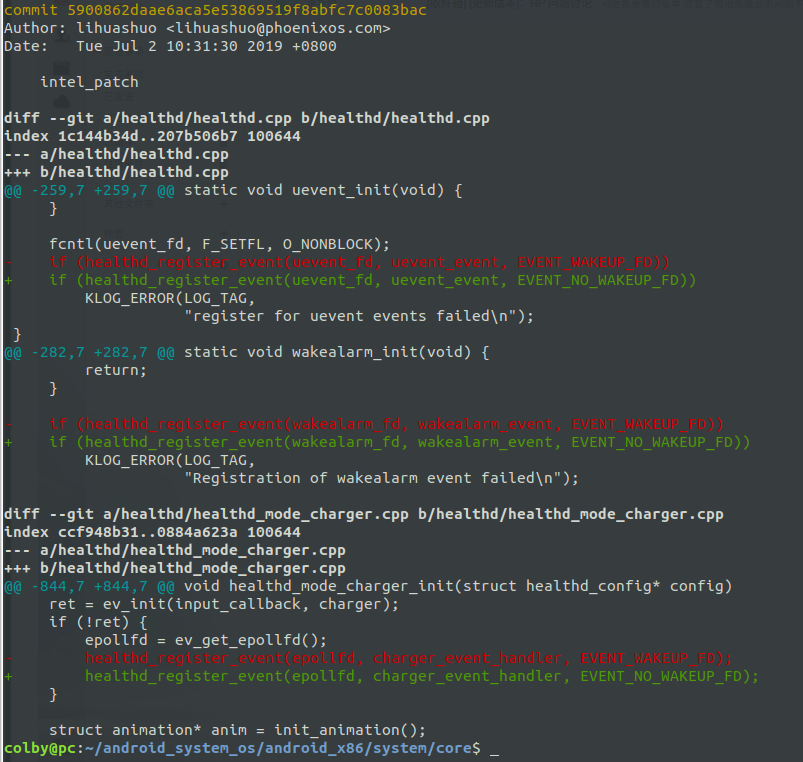
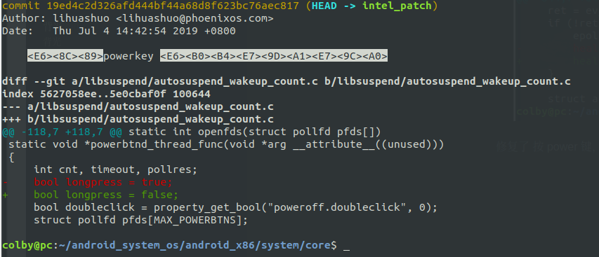
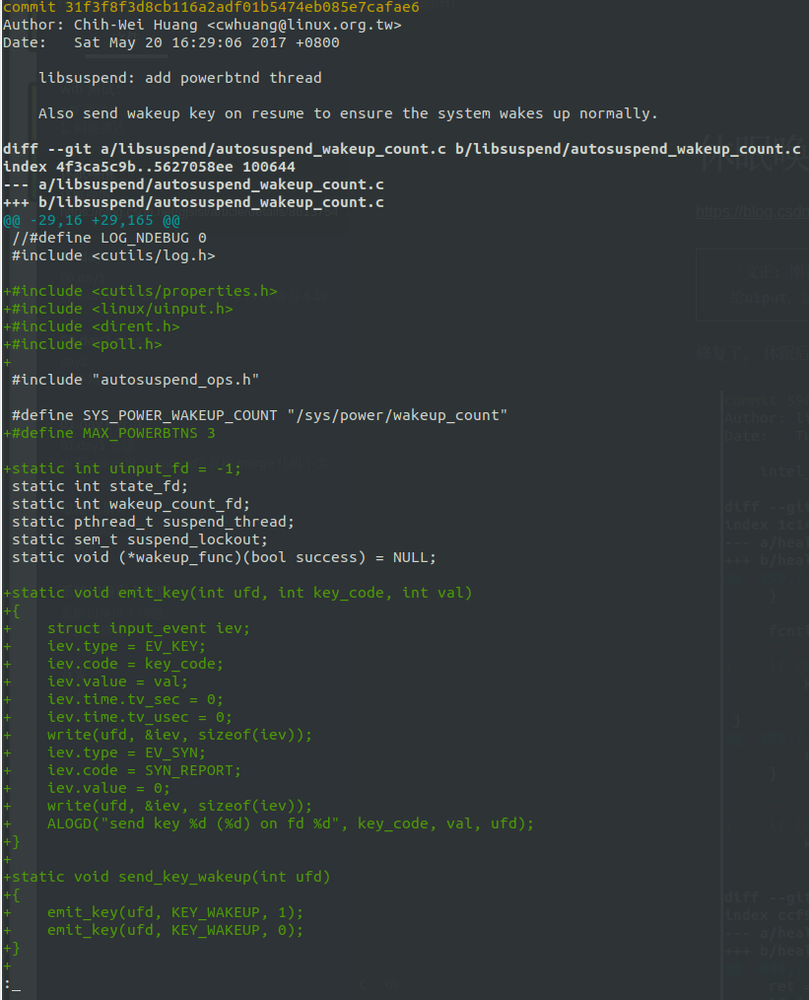

# 休眠唤醒

https://blog.csdn.net/gjsisi/article/details/8613754

```
「文正: 刚看了下Androidx86的行为，systemserver会拿/dev/uiput,libsuspend会收到powerket,然后又转发给uiput，这样阻止了powerkey的睡眠」
```

修复了， 休眠后无法唤醒：



修复了 按 power 键，不会休眠的问题：




可以根据这个commit 去定制，power键的功能：



