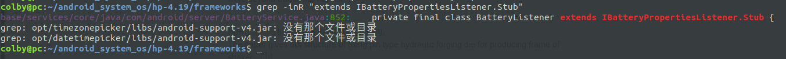

# 电池电量：

## 1. env

hp cpu

kernel层中可以看到电量， 但android层始终显示 为100%电量：

## 2. 问题定位

### 2.1 猜测是hal 层的问题

```shell 
intel_haier:/sys/class/power_supply/BAT0 # cat capacity                        
24
```

在windows也确定过，此时确实是这个电量。kernel层电池电量是对的。

问题出现在了， hal层中。

**这里记录一个 电源键上报：**

```shell
intel_haier:/ # logcat | grep Power

I powerbtn: open event2(Power Button) ok fd=4
I powerbtn: open event1(Power Button) ok fd=6
I SystemServiceManager: Starting com.android.server.power.PowerManagerService

D EventHub: No input device configuration file found for device 'Android Power Button'.

I EventHub: New device: id=1, fd=86, path='/dev/input/event21', name='Android Power Button', classes=0x1, configuration='', keyLayout='/system/usr/keylayout/Generic.kl', keyCharacterMap='/system/usr/keychars/Generic.kcm', builtinKeyboard=false, wakeMechanism=EPOLLWAKEUP, usingClockIoctl=true

I EventHub: ignoring event id /dev/input/event2 driver Power Button
I EventHub: ignoring event id /dev/input/event1 driver Power Button

I InputReader: Device added: id=1, name='Android Power Button', sources=0x00000101
```

### 2.2 猜测是framewrok层的问题

由于 hal层中并不存在获得 电池电量的接口，所以这里不是hal层的问题。需要重新定位问题：

```shell
colby@pc:~/hp_pm$ adb shell dumpsys battery
Current Battery Service state:
  AC powered: true # 这个代表 插电源
  USB powered: false
  Wireless powered: false
  Max charging current: 0
  Max charging voltage: 0
  Charge counter: 0
  status: 1
  health: 1
  present: true
  level: 0     # 这个应该是当前的值 应该是 24 才对
  scale: 100   # 这个最大的值
  voltage: 12166
  temperature: 0
  technology: Li-ion
```

所以这里应该从  Battery Service 开始查。

## 3. fix bug

```shell
W BatteryNotifier: batterystats service unavailable! # cpp 层

D BatteryStatsImpl: Reading daily items from /data/system/batterystats-daily.xml # java 层

I SystemServiceManager: Starting com.android.server.BatteryService # java 层

E BatteryStatsService: power: Missing API # cpp 层

E BatteryStatsService: no controller energy info supplied # java 层

E BatteryStatsService: modem info is invalid: ModemActivityInfo{ mTimestamp=0 mSleepTimeMs=0 mIdleTimeMs=0 mTxTimeMs[]=[0, 0, 0, 0, 0] mRxTimeMs=0 mEnergyUsed=0} # java 层
```


### 3.1  power: Missing API

```shell
hp-4.19/frameworks$ vim base/services/core/jni/com_android_server_am_BatteryStatsService.cpp +196
```

```cpp
static jint getPlatformLowPowerStats(JNIEnv* env, jobject /* clazz */, jobject outBuf) {
    
    if (! (gPowerModule->get_platform_low_power_stats && gPowerModule->get_number_of_platform_modes
       && gPowerModule->get_voter_list)) {             
        ALOGE("%s: Missing API", POWER_HARDWARE_MODULE_ID);
        goto error;
    }
}
```

这三个只要其中有一个出错，都会执行到这里。

gPowerModule->get_platform_low_power_stats    -> 3.1.1

gPowerModule->get_number_of_platform_modes   -> 3.1.2

gPowerModule->get_voter_list    -> 3.1.3


先看 gPowerModule 的赋值的地方：

```shell
hp-4.19/frameworks$ vim base/services/core/jni/com_android_server_power_PowerManagerService.cpp +107
```

```cpp
static void nativeInit(JNIEnv* env, jobject obj) {
    gPowerManagerServiceObj = env->NewGlobalRef(obj);

    status_t err = hw_get_module(POWER_HARDWARE_MODULE_ID,
            (hw_module_t const**)&gPowerModule);  /* 在这个地方， 赋值的*/       
    if (!err) {
        gPowerModule->init(gPowerModule);
    } else {
        ALOGE("Couldn't load %s module (%s)", POWER_HARDWARE_MODULE_ID, strerror(-err));
    }   
}
```

找到hal层的对应：

```shell
hp-4.19/hardware$ vim x86power/power.c +96
```

```cpp
struct power_module HAL_MODULE_INFO_SYM = { 
    .common = { 
        .tag = HARDWARE_MODULE_TAG,
        .module_api_version = POWER_MODULE_API_VERSION_0_2,
        .hal_api_version = HARDWARE_HAL_API_VERSION,
        .id = POWER_HARDWARE_MODULE_ID,
        .name = "x86 Power HAL",
        .author = "The Android-x86 Project",
        .methods = &power_module_methods, 
    },  
    .init = power_init,
    .setInteractive = power_set_interactive,
    .powerHint = power_hint,
};
```


#### 3.1.1 get_platform_low_power_stats

在第4小节中我们已经找到了 对应的hal库，从中我们就**没有发现 那三个接口， 所以这里就没有必要去查了， 这里的报错是真确的。其他就不用查了。 而且hal层中， 就没有获取电池电量的接口，不是hal层的问题**

```c
struct power_module HAL_MODULE_INFO_SYM = { 
    .common = { 
        .tag = HARDWARE_MODULE_TAG,
        .module_api_version = POWER_MODULE_API_VERSION_0_2,
        .hal_api_version = HARDWARE_HAL_API_VERSION,
        .id = POWER_HARDWARE_MODULE_ID,
        .name = "x86 Power HAL",
        .author = "The Android-x86 Project",
        .methods = &power_module_methods, 
    },  
    .init = power_init,
    .setInteractive = power_set_interactive,
    .powerHint = power_hint,
};
```

### 3.2 framework查错

```shell
frameworks$ vim base/services/core/java/com/android/server/BatteryService.java
```

```java
private void dumpInternal(FileDescriptor fd, PrintWriter pw, String[] args) {
        synchronized (mLock) {
            if (args == null || args.length == 0 || "-a".equals(args[0])) {
                pw.println("Current Battery Service state:");
                if (mUpdatesStopped) {
                    pw.println("  (UPDATES STOPPED -- use 'reset' to restart)");
                }   
                pw.println("  AC powered: " + mBatteryProps.chargerAcOnline);
                pw.println("  USB powered: " + mBatteryProps.chargerUsbOnline);
                pw.println("  Wireless powered: " + mBatteryProps.chargerWirelessOnline);
                pw.println("  Max charging current: " + mBatteryProps.maxChargingCurrent);
                pw.println("  Max charging voltage: " + mBatteryProps.maxChargingVoltage);
                pw.println("  Charge counter: " + mBatteryProps.batteryChargeCounter);
                pw.println("  status: " + mBatteryProps.batteryStatus);
                pw.println("  health: " + mBatteryProps.batteryHealth);
                pw.println("  present: " + mBatteryProps.batteryPresent);
                pw.println("  level: " + mBatteryProps.batteryLevel);
                pw.println("  scale: " + BATTERY_SCALE);
                pw.println("  voltage: " + mBatteryProps.batteryVoltage);
                pw.println("  temperature: " + mBatteryProps.batteryTemperature);
                pw.println("  technology: " + mBatteryProps.batteryTechnology);
            } else {
                Shell shell = new Shell();
                shell.exec(mBinderService, null, fd, null, args, new ResultReceiver(null));
            }   
        }   
    }
```

```shell
colby@pc:~/hp_pm$ adb shell dumpsys battery
Current Battery Service state:
  AC powered: true # 这个代表 插电源
  USB powered: false
  Wireless powered: false
  Max charging current: 0
  Max charging voltage: 0
  Charge counter: 0
  status: 1
  health: 1
  present: true
  level: 0     # 这个应该是当前的值 应该是 24 才对
  scale: 100   # 这个最大的值
  voltage: 12166
  temperature: 0
  technology: Li-ion
```

现在只需要， 去看  mBatteryProps.batteryLevel 他是从哪 拿到的值，即可。

#### 3.2.1  mBatteryProps

找到这个的来源 就找到了 电量值的来源：

```shell
frameworks$ vim base/services/core/java/com/android/server/BatteryService.java
```


```java
// update [BatteryService]

private void update(BatteryProperties props) {
        synchronized (mLock) {
            if (!mUpdatesStopped) {
                mBatteryProps = props;                                                                                                                                                                             
                // Process the new values.
                processValuesLocked(false);
            } else {
                mLastBatteryProps.set(props);
            }
        }
    }


// 这是服务端， 从中发现， props 的值是从 客户端 传递过来的
private final class BatteryListener extends IBatteryPropertiesListener.Stub {
        @Override public void batteryPropertiesChanged(BatteryProperties props) {
            final long identity = Binder.clearCallingIdentity();
            try {
                BatteryService.this.update(props);  /* 在这里调用了*/                                                                                                                                                               
            } finally {
                Binder.restoreCallingIdentity(identity);
            }   
       }   
    }

/*这里的 BatteryListener 注册到哪里了*/

// onStart [BatteryService]
@Override
    public void onStart() {
        IBinder b = ServiceManager.getService("batteryproperties"); /*从这里我们可以发现 这里属于跨进程通讯的范畴了；*/
        final IBatteryPropertiesRegistrar batteryPropertiesRegistrar =
                IBatteryPropertiesRegistrar.Stub.asInterface(b);
        try {
            batteryPropertiesRegistrar.registerListener(new BatteryListener()); /*注册到这里了*/                                                                                                                                   
        } catch (RemoteException e) {
            // Should never happen.
        }

        mBinderService = new BinderService();
        publishBinderService("battery", mBinderService);
        publishLocalService(BatteryManagerInternal.class, new LocalService());
    }
```

**现在去查 batteryproperties 这个服务 **

1. 找到了 base/core/java/android/os/IBatteryPropertiesListener.aidl
2. 找到服务

如何快速找到服务：


#### 3.2.2 cpp

BatteryMonitor.cpp

```cpp
bool BatteryMonitor::update(void) {
    KLOG_ERROR(LOG_TAG, "colby batteryCapacityPath= %s\n", mHealthdConfig->batteryCapacityPath);
}
```

```c
path.appendFormat("%s/%s/capacity", POWER_SUPPLY_SYSFS_PATH,name);  

#define POWER_SUPPLY_SYSFS_PATH "/sys/class/" POWER_SUPPLY_SUBSYSTEM

#define POWER_SUPPLY_SUBSYSTEM "power_supply"
// 这里猜测 name 应该是写错了。所以导致，电池电量才会被读错
```


```shell
正确的接口：
/sys/class/power_supply/BAT0 # cat capacity

```


## 4. hal

### 4.1 确定使用的hal层的库：


现在hal层中对应两个库，一个是default, 一个是x86的 这里想再次确认 是不是有的x86的库：adb shell dumpsys battery

```shell
hp-4.19/hardware$ mmm libhardware/modules/power/

build out/target/product/x86_64/obj/lib/power.default.so.toc
```

```shell
hp-4.19/hardware$ mmm x86power/

build out/target/product/x86_64/obj_x86/lib/power.x86.so.toc
```

验证的结果是 确实使用的 x86

还有一个办法： 看我们的设备中 是否有  power.default.so 和 power.x86.so  通过搜索发现我们的设备中只存在 power.x86.so。

## 5. 测试技巧

### 5.1 Android获取电池电量

方法一：注册广播（被动接受）

```java
IntentFilter filter2 = new IntentFilter();
filter2.addAction(Intent.ACTION_BATTERY_CHANGED);
registerReceiver(filter2,receiver);
接收到广播后，用getIntExtra("level")和getIntExtra("scale")获得相应值
intent.getIntExtra("level", 0);    ///电池剩余电量
intent.getIntExtra("scale", 0);  ///获取电池满电量数值
intent.getStringExtra("technology");  ///获取电池技术支持
intent.getIntExtra("status",BatteryManager.BATTERY_STATUS_UNKNOWN); ///获取电池状态
intent.getIntExtra("plugged", 0);  ///获取电源信息
intent.getIntExtra("health",BatteryManager.BATTERY_HEALTH_UNKNOWN);  ///获取电池健康度
intent.getIntExtra("voltage", 0);  ///获取电池电压
intent.getIntExtra("temperature", 0);  ///获取电池温度
```

方法二：通过执行命令（不需要root）

通过 `adb shell dumpsys battery`，返回结果后有电池的各种信息，其中就包括level（百分比）

```shell
C:\Users\ShawnXia>adb shell dumpsys battery
Current Battery Service state:
  AC powered: false ///有线充电器状态
  USB powered: true ///USB连接状态
  Wireless powered: false ///无线充电状态
  Max charging current: 500000 ///最大充电电流，单位微安(uA)
  Max charging voltage: 5000000 ///最大充电电压，单位微伏(uV)
  Charge counter: 4149000 ///
  status: 2 ///充电状态，UNKNOWN=1，CHARGING=2，DISCHARGING=3，NOT_CHARGING=4，FULL=5
  health: 2 ///电池健康状态
  present: true ///
  level: 95 ///当前95%
  scale: 100 ///满电100%
  voltage: 4244 ///电压
  temperature: 250 ///温度
  technology: Li-ion
```

方法三：通过 BatteryManager

```java
API >= 21 (5.0，L)
BatteryManager manager = (BatteryManager) getSystemService(BATTERY_SERVICE);
manager.getIntProperty(BatteryManager.BATTERY_PROPERTY_CHARGE_COUNTER);
manager.getIntProperty(BatteryManager.BATTERY_PROPERTY_CURRENT_AVERAGE);
manager.getIntProperty(BatteryManager.BATTERY_PROPERTY_CURRENT_NOW);
manager.getIntProperty(BatteryManager.BATTERY_PROPERTY_CAPACITY);///当前电量百分比
API >= 26 (8.0，O)
manager.getIntProperty(BatteryManager.BATTERY_PROPERTY_STATUS);///充电状态
```

### 5.2 快速找到服务：

aidl 文件如下：

base/core/java/android/os/IBatteryPropertiesListener.aidl

```java
interface IBatteryPropertiesListener {
    void batteryPropertiesChanged(in BatteryProperties props); 
}
```

此时该这样搜索：

```shell
hp-4.19/frameworks$ grep -inR "extends IBatteryPropertiesListener.Stub"
```



这样就找到对应的服务了，记住这个规律：

```java
private final class BatteryListener extends IBatteryPropertiesListener.Stub {
        @Override public void batteryPropertiesChanged(BatteryProperties props) {
            final long identity = Binder.clearCallingIdentity();
            try {
                BatteryService.this.update(props);
            } finally {
                Binder.restoreCallingIdentity(identity);
            }
       }
    }
```


