# day2

## 1. 环境：

​	机器： HP EDU PC

​	kernel: 4.19.15

​	android 7.1.1

​	问题：

​		开机后可以进入终端shell，但是无法进入图形界面。

ps:

1.  linux层 暂且可以认为是正常启动。 Android层中的 surfaceFlinger 等一些核心服务启动失败。

2. 内核传参中添加 nomodeset 后，图形界面可以启动。当此时发现，如下问题

   a. 屏幕无法调节亮度

   b. 声卡没有声音

   c. 摄像头可以拍照，但无法正常录像

​	

## 2. 问题定位

### 2.1 无法进入图形界面


**无法进入图形界面**

这个是没有加 nomodeset 同时也启动不了图形界面


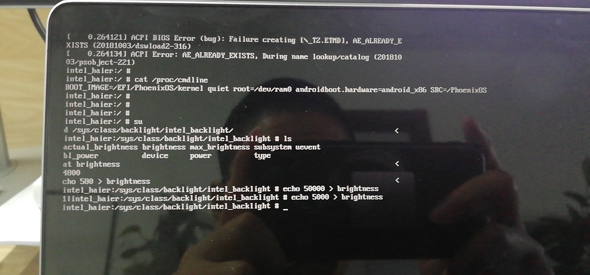

这个背光亲自测试，是可以调节的。

不加nomodeset 的内核，我们发现：

**1. 首先加载了 i915驱动**

**2.并且i915 驱动被引用了，且引用计数为2**

**3. 并且lspci -k 可以发现 3ea0 这个设备使用了 i915驱动**

**4. 声卡节点 有很多**

**5. 存在背光接口，且可以调节亮度**


**可以进入图形界面**

这个是加了nomodeset 后，可以正常进入图形界面中。

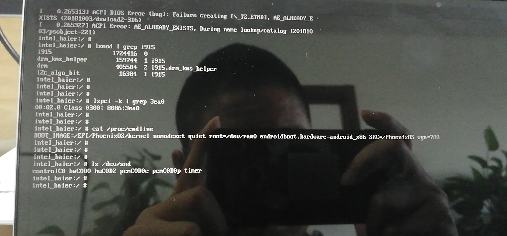


从图中我们得到如下信息：

**1. 虽然系统加载了 i915驱动，但是没人使用（引用计数为0）**

**2. lspci -k 中显示， 0x3ea0 设备并没有使用 i915 dri**

**3. 声卡设备节点 数目，显然比较少**

**4. 无背光的相关接口**


我们怎么就知道 0x3ea0是显卡设备？

答：我们是在ubuntu中 lspci -k | grep VGA 时，确认的。


**问题定位：**

根据intel的说法，当我们加nomodeset ，kernel 中不会去使用 i915的驱动，而是使用VGA通用的驱动，这种驱动是一种很低级的显卡驱动。所以这里不应该去使用这种驱动。根据这个影子，我们就开始去查这个i915驱动了。

1. 刚开始的时候，我们用的是 4.14的kernel去查的。4.14的i915驱动中并不存在0x3ea0相关的驱动。 所以4.14之所以能起来，也是走的vga通用驱动。

2. 当我们在4.14中添加 好相对应的0x3ea0驱动后，我们发现4.14 和 4.19 表现一样了。都是kernel 可以起来，android层启动不了。
3. 此时我们就回归到4.19 开始查问题了。
4. 由于我们的4.19的 kernel中是有 0x3ea0相关的驱动的。现在的问题就聚焦在 hardware 和   external 两个目录下了。
5. 显卡要想正常工作，必须kernel_space和 user_space必须匹配。**现在最大的问题是， 两者的版本不能匹配导致的。**
6. android9的代码，都是可以正常工作的。

**根据，上面的分析：我们可以得出一个结论， 我们此时要做的就是，将我们android9中相关的 东东，拿到android7中**

这里相关的是指： 

	1. 0x3ea0相关的

## 3. 修复显卡bug

既然我们问题已经分析清楚了，那接下来就是干：

通过在android9 的 external 中检索， 我们发现 只有在 libdrm和mesa两个目录中，有相关0x3ea0的code

**那接下来就重点关注libdrm和mesa两个目录即可：**

### 3.1 我自己的修改方案：

#### 3.1.1 libdrm 目录

这里插播一个信息： 台电的机器使用的显卡型号是 0x591e,这里我们不妨参照这个进行修改。

通过阅读android9 和 android7中的code，我们发现，在libdrm中 目的就只有一个， 能够识别出 0x3ea0这个显卡设备是gen 9 即可。 这个是通过分析android9中的代码发现的。

代码如下：

这个是修改后的android7中的代码：

```shell
hp-4.19/external/libdrm$ vim intel/intel_chipset.h +452
```

```c
#define IS_KBL_GT2(devid)   ((devid) == PCI_CHIP_KABYLAKE_ULT_GT2   || \                                                                                                           
                 (devid) == PCI_CHIP_KABYLAKE_ULT_GT2F  || \
                 (devid) == PCI_CHIP_KABYLAKE_ULX_GT2   || \
                 (devid) == 0x3ea0  || \
                 (devid) == PCI_CHIP_KABYLAKE_DT_GT2    || \
                 (devid) == PCI_CHIP_KABYLAKE_HALO_GT2  || \
                 (devid) == PCI_CHIP_KABYLAKE_SRV_GT2   || \
                 (devid) == PCI_CHIP_KABYLAKE_WKS_GT2)
           
#define IS_KABYLAKE(devid)  (IS_KBL_GT1(devid) || \
                 IS_KBL_GT2(devid) || \   /*这个*/
                 IS_KBL_GT3(devid) || \
                 IS_KBL_GT4(devid))
       
/*目的就是 判断 0x3ea0 是 gen9*/                     
#define IS_GEN9(devid)      (IS_SKYLAKE(devid)  || \
                 IS_BROXTON(devid)  || \
                 IS_KABYLAKE(devid) || \ /*这个*/
                 IS_GEMINILAKE(devid) || \
                 IS_COFFEELAKE(devid))
```


#### 3.1.2 mesa 目录

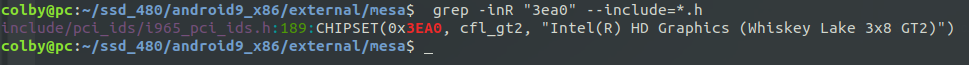

从中我们发现 在这个 i965_pci_ids.h 文件中有相关的内容：

通过检索 在这个几个文件中引用了 这个头文件：

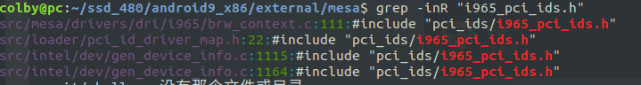

```shell
src/mesa/drivers/dri/i965/brw_context.c:111:#include "pci_ids/i965_pci_ids.h"
src/loader/pci_id_driver_map.h:22:#include "pci_ids/i965_pci_ids.h"
src/intel/dev/gen_device_info.c:1115:#include "pci_ids/i965_pci_ids.h"
src/intel/dev/gen_device_info.c:1164:#include "pci_ids/i965_pci_ids.h"
```

然后重点关注这几个目录：

##### android9代码阅读

1. 阅读这几个文件，去查看对0x3ea0的使用情况

**brw_context.c文件：**

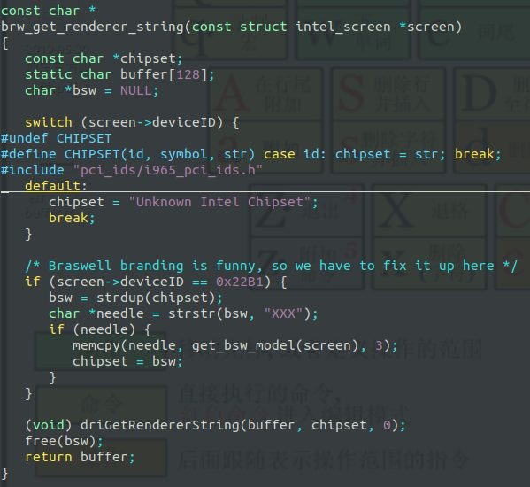

```c
#define CHIPSET(id, symbol, str) case id: chipset = str; break;
#include "pci_ids/i965_pci_ids.h"
```

```c
CHIPSET(0x3EA0, cfl_gt2, "Intel(R) HD Graphics (Whiskey Lake 3x8 GT2)")
```

这里仅仅是为了拿到  "Intel(R) HD Graphics (Whiskey Lake 3x8 GT2)"  感觉这里无关痛痒。感觉写啥都行


**pci_id_driver_map.h文件：**

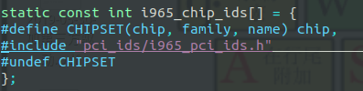

```c
#define CHIPSET(chip, family, name) chip,
#include "pci_ids/i965_pci_ids.h"                        
#undef CHIPSET
```

```c
CHIPSET(0x3EA0, cfl_gt2, "Intel(R) HD Graphics (Whiskey Lake 3x8 GT2)")
```

这里直接拿 0x3EA0 放入 int i965_chip_ids[] 数组里面了。 其他部分全扔了。这里也不是最重要的。


**gen_device_info.c文件：**

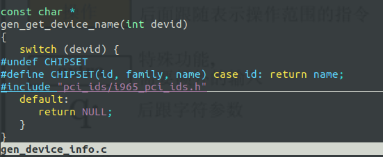

这个是返回： "Intel(R) HD Graphics (Whiskey Lake 3x8 GT2)" ， 无足轻重的事。

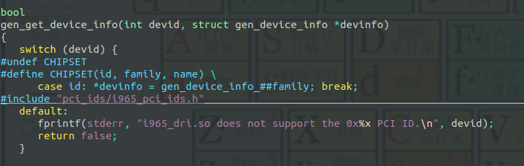

```c
#undef CHIPSET
#define CHIPSET(id, family, name) \
      case id: *devinfo = gen_device_info_##family; break;
#include "pci_ids/i965_pci_ids.h"
```

```c
CHIPSET(0x3EA0, cfl_gt2, "Intel(R) HD Graphics (Whiskey Lake 3x8 GT2)")
```

这里是拿 到  gen_device_info_cfl_gt2 这个结构体，在android7中是没有这个结构体的。所以这个应该是我们往 android7中写入的重点。 **cfl : kernel中 dri i915 的更新: 每个显卡型号都对应一个 family ,他们都是用的同一个i915驱动， 其中各个family之间的区别 就是用 类似 is_cfl ... 去区别**


现在主要看 gen_device_info_cfl_gt2 在 Android9中的定义：

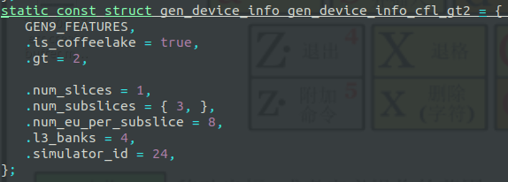

那我们把这个挪到  android7中去试试。 结果发现， 不加nomodeset 图形界面可以启动起来。而且声卡是可以使用的。没有问题。摄像头也是好的。

##### android7修改

**最终android7的修改：记录**

通过阅读android9中的内容，给出了androjiluid7的修改：

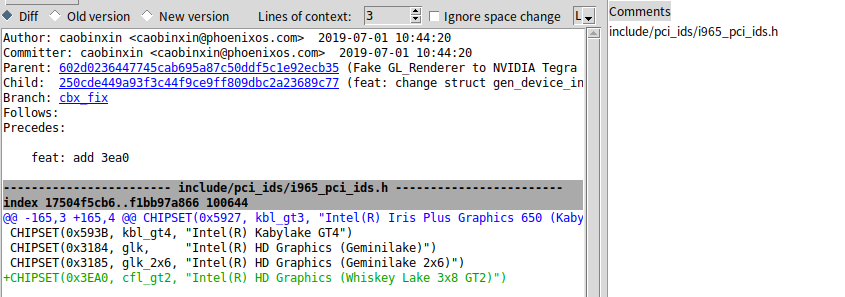

 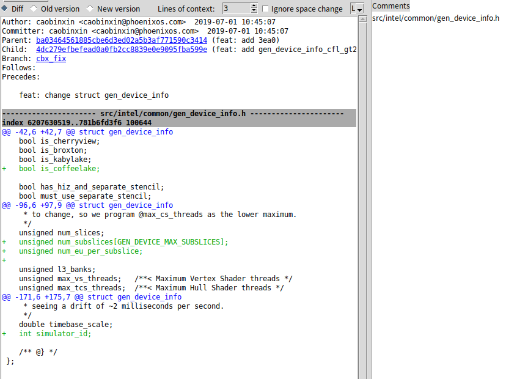

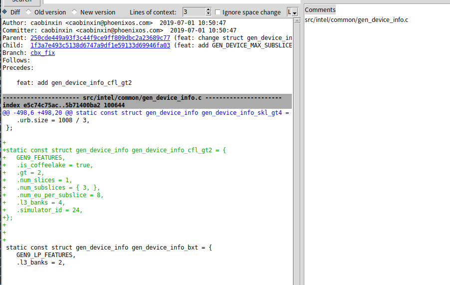


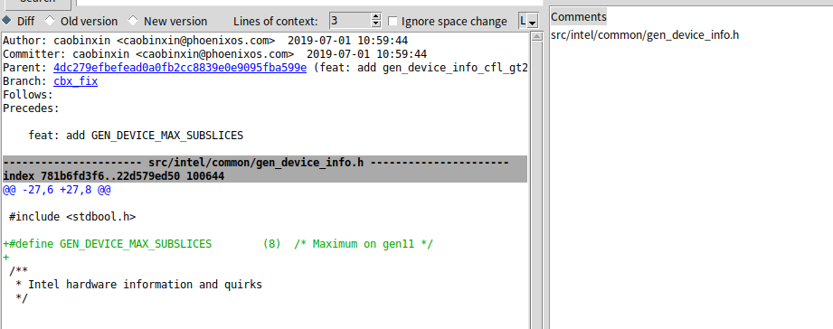

编译后发现 不加nomodeset 后 图形界面 声音 摄像头都可以工作了。

### 3.2 intel 的修改方案：

#### 3.2.1 intel patch

##### libdrm :

将patch 文件放置在 external 文件下：

```shell
hp-4.19/external$ patch -d libdrm -p1 < 0001-add-whiskeylake-U-serial-chip-id-in-libdrm.patch
```

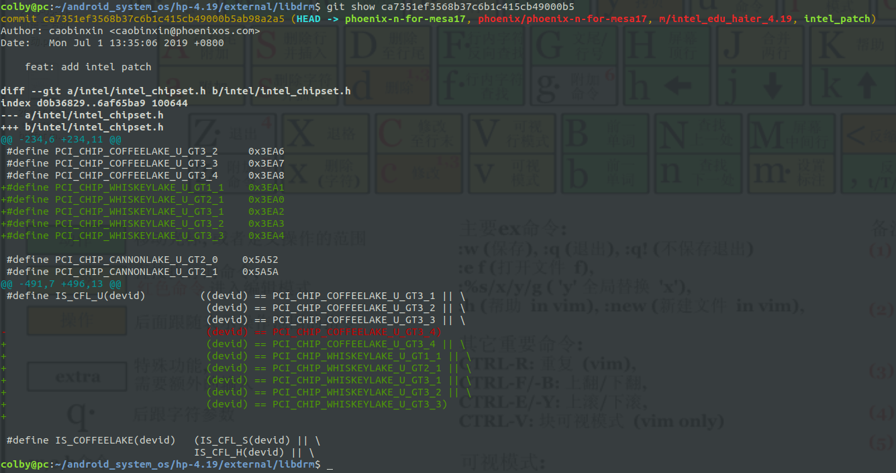

追踪如下：

```c
#define PCI_CHIP_WHISKEYLAKE_U_GT2_1    0x3EA0 // 定义 0x3ea0

#define IS_CFL_U(devid)         ((devid) == PCI_CHIP_COFFEELAKE_U_GT3_1 || \
                                 (devid) == PCI_CHIP_COFFEELAKE_U_GT3_2 || \
                                 (devid) == PCI_CHIP_COFFEELAKE_U_GT3_3 || \
                                 (devid) == PCI_CHIP_COFFEELAKE_U_GT3_4 || \
                                 (devid) == PCI_CHIP_WHISKEYLAKE_U_GT1_1 || \
                                 (devid) == PCI_CHIP_WHISKEYLAKE_U_GT2_1 || \ /*在这*/
                                 (devid) == PCI_CHIP_WHISKEYLAKE_U_GT3_1 || \
                                 (devid) == PCI_CHIP_WHISKEYLAKE_U_GT3_2 || \
                                 (devid) == PCI_CHIP_WHISKEYLAKE_U_GT3_3)
                                     
#define IS_COFFEELAKE(devid)   (IS_CFL_S(devid) || \
                IS_CFL_H(devid) || \
                IS_CFL_U(devid))/*在这*/
                                     
#define IS_GEN9(devid)      (IS_SKYLAKE(devid)  || \
                 IS_BROXTON(devid)  || \
                 IS_KABYLAKE(devid) || \
                 IS_GEMINILAKE(devid) || \
                 IS_COFFEELAKE(devid)) /*在这*/                                    
```

发现 intel和我的修改目的都是一样的， 判断当前的设备 0x3ea0 为 gen 9

不同的是， 将其加到一个正确的组中。  **IS_COFFEELAKE**

##### mesa：

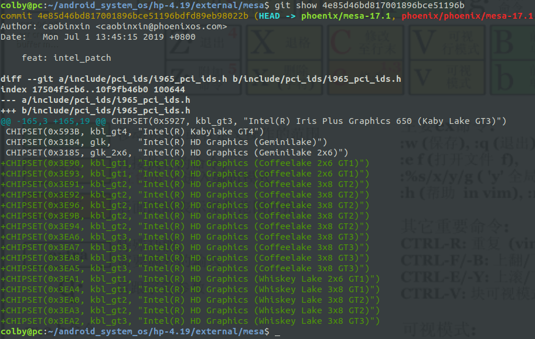

追踪：

```c
CHIPSET(0x3EA0, kbl_gt2, "Intel(R) HD Graphics (Whiskey Lake 3x8 GT2)")
    
static const struct gen_device_info gen_device_info_kbl_gt2 = {       
   GEN9_FEATURES,
   .is_kabylake = true,
   .gt = 2,
   .num_slices = 1,
   .l3_banks = 4,
};
```

在Android9 中是 如下

```c
CHIPSET(0x3EA0, cfl_gt2, "Intel(R) HD Graphics (Whiskey Lake 3x8 GT2)")
    
static const struct gen_device_info gen_device_info_cfl_gt2 = {                       
   GEN9_FEATURES, // 这个参数应该很关键
   .is_coffeelake = true,
   .gt = 2, // 这个参数应该很关键
   .num_slices = 1, // 这个参数应该很关键
   .num_subslices = { 3, },
   .num_eu_per_subslice = 8, 
   .l3_banks = 4, // 这个参数应该很关键
   .simulator_id = 24,
};
```

从中我们可以大胆猜测  只要 主要的参数配置真确，图形界面就应该可以启动起来。

## 4. i915 驱动：

### 4.1 调试技巧：

drivers/gpu/drm/drm_drv.c

```c
/*
 * drm_debug: Enable debug output.
 * Bitmask of DRM_UT_x. See include/drm/drmP.h for details.
 */
unsigned int drm_debug = 0; // 将这里 改为 6 0x6 转换成 二进制： 0110
EXPORT_SYMBOL(drm_debug);

MODULE_AUTHOR("Gareth Hughes, Leif Delgass, José Fonseca, Jon Smirl");
MODULE_DESCRIPTION("DRM shared core routines");
MODULE_LICENSE("GPL and additional rights");
MODULE_PARM_DESC(debug, "Enable debug output, where each bit enables a debug category.\n"
"\t\tBit 0 (0x01)  will enable CORE messages (drm core code)\n"
"\t\tBit 1 (0x02)  will enable DRIVER messages (drm controller code)\n" // 将打开这一层的log
"\t\tBit 2 (0x04)  will enable KMS messages (modesetting code)\n"  // 将打开这一层的log
"\t\tBit 3 (0x08)  will enable PRIME messages (prime code)\n"   
"\t\tBit 4 (0x10)  will enable ATOMIC messages (atomic code)\n"
"\t\tBit 5 (0x20)  will enable VBL messages (vblank code)\n"
"\t\tBit 7 (0x80)  will enable LEASE messages (leasing code)\n"
"\t\tBit 8 (0x100) will enable DP messages (displayport code)");
module_param_named(debug, drm_debug, int, 0600);

// 我们可以在 insmod xxxx.ko debug=6 
//  	此时传进来的 debug 会被赋值到 drm_debug 中
```


