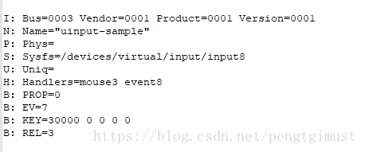

# Android 系统使用uinput模拟鼠标输入设备的方法

项目需要实现一个通过摄像头获取图像数据，然后通过OpenCV进行手势识别，再将识别到的手势信息转换成鼠标事件信息回传给input子系统，进而实现通过手势模拟鼠标操作来对Android系统进行操作的功能。
这里先对事件注入部分做简要分析介绍。
系统端怎样模拟input event呢，此处我们通过uinput桥接；原理是利用内核现有的uinput驱动，通过内核驱动uinput来发送input event，而且还容易使用kl,kcm 客制化。
在/system/core/目录下创建uinput目录，在uinput目录创建uinput.c文件和Android.mk文件。
测试代码如下：
/system/core/uinput/uinput.c
--------------------- 
```c
#include <stdio.h>
#include <stdlib.h>
#include <string.h>
#include <unistd.h>
#include <fcntl.h>
#include <errno.h>
#include <linux/input.h>
#include <linux/uinput.h>
#include <time.h>

#define die(str, args...) do { \
        perror(str); \
        exit(EXIT_FAILURE); \
} while(0)

int main(void)
{
    int                    fd;
    struct uinput_user_dev uidev;
    struct input_event     ev;
    int                    dx, dy;
    int                    i;

     fd = open("/dev/uinput", O_WRONLY | O_NONBLOCK);
if(fd < 0) die("error: open");

    //config uinput working mode,  mouse or touchscreen?  relative coordinates or absolute coordinate?
    if(ioctl(fd, UI_SET_EVBIT, EV_KEY) < 0)         //support key button
        die("error: ioctl");
    if(ioctl(fd, UI_SET_KEYBIT, BTN_LEFT) < 0)  //support mouse left key
        die("error: ioctl");

    if(ioctl(fd, UI_SET_KEYBIT, BTN_RIGHT) < 0)  //support mouse right key
        die("error: ioctl");

    if(ioctl(fd, UI_SET_EVBIT, EV_REL) < 0)       //uinput use relative coordinates
        die("error: ioctl");
    if(ioctl(fd, UI_SET_RELBIT, REL_X) < 0)         //uinput use x coordinates
        die("error: ioctl");
    if(ioctl(fd, UI_SET_RELBIT, REL_Y) < 0)         //uinput use y coordinates
        die("error: ioctl");

    memset(&uidev, 0, sizeof(uidev));                  //creat an virtul input device node in /dev/input/***
    snprintf(uidev.name, UINPUT_MAX_NAME_SIZE, "uinput-sample");
    uidev.id.bustype = BUS_USB;
    uidev.id.vendor  = 0x1;
    uidev.id.product = 0x1;
    uidev.id.version = 1;

    if(write(fd, &uidev, sizeof(uidev)) < 0)
        die("error: write");

    if(ioctl(fd, UI_DEV_CREATE) < 0)
        die("error: ioctl");

    sleep(2);
    srand(time(NULL));

while(1) {
        //simulate( x,y) coordinates for mouse
        switch(rand() % 4) {
        case 0:
            dx = -8;
            dy = -1;
            break;
        case 1:
            dx = 8;
            dy = 1;
            break;
        case 2:
            dx = -1;
            dy = 10;
            break;
        case 3:
            dx = 1;
            dy = -10;
            break;
        }
        //模拟鼠标移动
        for(i = 0; i < 20; i++) {
            //send input event to kernel input system
            memset(&ev, 0, sizeof(struct input_event));
            ev.type = EV_REL;         //send x coordinates
            ev.code = REL_X;
            ev.value = dx;
            if(write(fd, &ev, sizeof(struct input_event)) < 0)
                die("error: write");

            memset(&ev, 0, sizeof(struct input_event));
            ev.type = EV_REL;  //send y coordinates
            ev.code = REL_Y;
            ev.value = dy;
            if(write(fd, &ev, sizeof(struct input_event)) < 0)
                die("error: write");

            memset(&ev, 0, sizeof(struct input_event));
            ev.type = EV_KEY;  //mouse left key
            ev.code = BTN_LEFT;
            ev.value = 1;
            if(write(fd, &ev, sizeof(struct input_event)) < 0)
                die("error: write");

            memset(&ev, 0, sizeof(struct input_event));
            ev.type = EV_SYN; // inform input system to process this input event
            ev.code = 0;
            ev.value = 0;
            if(write(fd, &ev, sizeof(struct input_event)) < 0)
                die("error: write");
            usleep(15000);
        }
        for(i = 0; i < 3; i++){
            memset(&ev, 0, sizeof(struct input_event));
            ev.type = EV_KEY;  //mouse left key
            ev.code = BTN_LEFT;
            ev.value = 0;
            if(write(fd, &ev, sizeof(struct input_event)) < 0)
                die("error: write");

            memset(&ev, 0, sizeof(struct input_event));
            ev.type = EV_SYN; // inform input system to process this input event
            ev.code = 0;
            ev.value = 0;
            if(write(fd, &ev, sizeof(struct input_event)) < 0)
                die("error: write");
        }
        sleep(3);
        //模拟鼠标左键点击
        //mouse click left key begin
        for(i = 0; i < 2; i++){
            memset(&ev, 0, sizeof(struct input_event));
            ev.type = EV_KEY;  //mouse left key
            ev.code = BTN_LEFT;
            ev.value = 1;
            if(write(fd, &ev, sizeof(struct input_event)) < 0)
                die("error: write");

            memset(&ev, 0, sizeof(struct input_event));
            ev.type = EV_SYN; // inform input system to process this input event
            ev.code = 0;
            ev.value = 0;
            if(write(fd, &ev, sizeof(struct input_event)) < 0)
                die("error: write");
        usleep(15000);
        }

        usleep(15000);

        for(i = 0; i < 3; i++){
            memset(&ev, 0, sizeof(struct input_event));
            ev.type = EV_KEY;  //mouse left key
            ev.code = BTN_LEFT;
            ev.value = 0;
            if(write(fd, &ev, sizeof(struct input_event)) < 0)
                die("error: write");

            memset(&ev, 0, sizeof(struct input_event));
            ev.type = EV_SYN; // inform input system to process this input event
            ev.code = 0;
            ev.value = 0;
            if(write(fd, &ev, sizeof(struct input_event)) < 0)
                die("error: write");
            usleep(15000);
        }
        sleep(3);
        //mouse click left key end

        //模拟鼠标右键点击
        //mouse click right key begin
        for(i = 0; i < 3; i++){
            memset(&ev, 0, sizeof(struct input_event));
            ev.type = EV_KEY;  //mouse right key
            ev.code = BTN_RIGHT;
            ev.value = 1;
            if(write(fd, &ev, sizeof(struct input_event)) < 0)
                die("error: write");

            memset(&ev, 0, sizeof(struct input_event));
            ev.type = EV_SYN; // inform input system to process this input event
            ev.code = 0;
            ev.value = 0;
            if(write(fd, &ev, sizeof(struct input_event)) < 0)
                die("error: write");
            usleep(15000);
        }

        usleep(15000);

        for(i = 0; i < 3; i++){
            memset(&ev, 0, sizeof(struct input_event));
            ev.type = EV_KEY;  //mouse right key
            ev.code = BTN_RIGHT;
            ev.value = 0;
            if(write(fd, &ev, sizeof(struct input_event)) < 0)
                die("error: write");

            memset(&ev, 0, sizeof(struct input_event));
            ev.type = EV_SYN; // inform input system to process this input event
            ev.code = 0;
            ev.value = 0;
            if(write(fd, &ev, sizeof(struct input_event)) < 0)
                die("error: write");
            usleep(15000);
        }
        //mouse click right key end
        sleep(3);
    }

    sleep(2);

    if(ioctl(fd, UI_DEV_DESTROY) < 0)
        die("error: ioctl");
    close(fd);
    return 0;
}
```

/system/core/uinput/Android.mk

```make
LOCAL_PATH:= $(call my-dir)

include $(CLEAR_VARS)

LOCAL_SRC_FILES:= \
    uinput.c

LOCAL_MODULE := uinput

include $(BUILD_EXECUTABLE)
```

编译测试模块：mmm system/core/uinput/ 
将生成的uinput可执行文件push到Android系统的 /system/bin/目录。 
进入系统执行 uinput & 
使用 cat /proc/bus/input/devices 命令获取设备信息如下：

