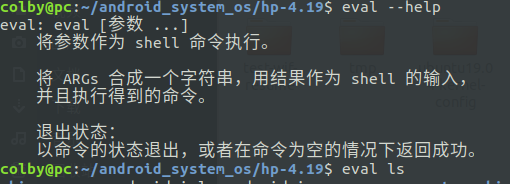

# androidx86-init.sh分析

## 1. 入口

```shell
PATH=/sbin:/system/bin:/system/xbin

DMIPATH=/sys/class/dmi/id # 通过对他的目录下相关属性的cat，可以去唯一标识这个设备
BOARD=$(cat $DMIPATH/board_name)
PRODUCT=$(cat $DMIPATH/product_name)                                                          
# import cmdline variables
for c in `cat /proc/cmdline`; do
    case $c in
        BOOT_IMAGE=*|iso-scan/*|*.*=*)
            ;;
        *=*)
            eval $c # 就是一个shell 执行器， 3.1 
            if [ -z "$1" ]; then # 如果 第一个参数 为空
                case $c in
                    DEBUG=*)
                        [ -n "$DEBUG" ] && set_property debug.logcat 1 # 且cmdline中有DEBUG=... 将设置系统属性  debug.logcat 1
                        ;;
                esac
            fi
            ;;
    esac
done

[ -n "$DEBUG" ] && set -x || exec &> /dev/null
# set -x : 会在执行每一行 shell 脚本时，把执行的内容输出来。它可以让你看到当前执行的情况，里面涉及的变量也会被替换成实际的值. 这样做是为了方便调试；每个命令都有一个记录。

# import the vendor specific script
hw_sh=/vendor/etc/init.sh
[ -e $hw_sh ] && source $hw_sh

case "$1" in
    netconsole)
        [ -n "$DEBUG" ] && do_netconsole
        phoenixos_compat
        ;;
    bootcomplete)
        do_bootcomplete
        ;;
    bootanim)
        do_bootanim
        ;;
    init|"")
        do_init
        ;;
esac

return 0
```

**首先解析 /proc/cmdline:**

```shell
 cat /proc/cmdline

 BOOT_IMAGE=/EFI/PhoenixOS/kernel quiet root=/dev/ram0 androidboot.hardware=android_x86 SRC=/PhoenixOS vga=788
```

脚本的解析过程如下：

```shell
BOOT_IMAGE=/EFI/PhoenixOS/kernel # 进入： BOOT_IMAGE 分支
quiet
root=/dev/ram0 # 进入： *=* 分支
androidboot.hardware=android_x86 # 进入： BOOT_IMAGE 分支

SRC=/PhoenixOS # 进入： *=* 分支

vga=788 # 进入： *=* 分支
```


## 3. 基础：

### 3.1 eval:



### 3.2 传参：

我们可以在执行 Shell 脚本时，向脚本传递参数，脚本内获取参数的格式为：**$n**。**n** 代表一个数字，1 为执行脚本的第一个参数，2 为执行脚本的第二个参数，以此类推……

实例

以下实例我们向脚本传递三个参数，并分别输出，其中 **$0** 为执行的文件名：

```shell
#!/bin/bash
# author:菜鸟教程
# url:www.runoob.com

echo "Shell 传递参数实例！";
echo "执行的文件名：$0";
echo "第一个参数为：$1";
echo "第二个参数为：$2";
echo "第三个参数为：$3";
```

为脚本设置可执行权限，并执行脚本，输出结果如下所示：

```shell
$ chmod +x test.sh 
$ ./test.sh 1 2 3
Shell 传递参数实例！
执行的文件名：./test.sh
第一个参数为：1
第二个参数为：2
第三个参数为：3
```

 另外，还有几个特殊字符用来处理参数：

| 参数处理 | 说明                                                         |
| -------- | ------------------------------------------------------------ |
| $#       | 传递到脚本的参数个数                                         |
| $*       | 以一个单字符串显示所有向脚本传递的参数。  如"$*"用「"」括起来的情况、以"$1 $2 … $n"的形式输出所有参数。 |
| $$       | 脚本运行的当前进程ID号                                       |
| $!       | 后台运行的最后一个进程的ID号                                 |
| $@       | 与$*相同，但是使用时加引号，并在引号中返回每个参数。   如"$@"用「"」括起来的情况、以"$1" "$2" … "$n" 的形式输出所有参数。 |
| $-       | 显示Shell使用的当前选项，与[set命令](https://www.runoob.com/linux/linux-comm-set.html)功能相同。 |
| $?       | 显示最后命令的退出状态。0表示没有错误，其他任何值表明有错误。 |

```shell
#!/bin/bash
# author:菜鸟教程
# url:www.runoob.com

echo "Shell 传递参数实例！";
echo "第一个参数为：$1";

echo "参数个数为：$#";
echo "传递的参数作为一个字符串显示：$*";
```

执行脚本，输出结果如下所示：

```shell
$ chmod +x test.sh 
$ ./test.sh 1 2 3
Shell 传递参数实例！
第一个参数为：1
参数个数为：3
传递的参数作为一个字符串显示：1 2 3
```

$* 与 $@ 区别：

- 相同点：都是引用所有参数。
-  不同点：只有在双引号中体现出来。假设在脚本运行时写了三个参数 1、2、3，，则 " * " 等价于 "1 2 3"（传递了一个参数），而 "@" 等价于 "1" "2" "3"（传递了三个参数）。 

```shell
#!/bin/bash
# author:菜鸟教程
# url:www.runoob.com

echo "-- \$* 演示 ---"
for i in "$*"; do
    echo $i
done

echo "-- \$@ 演示 ---"
for i in "$@"; do
    echo $i
done
```

执行脚本，输出结果如下所示：

```shell
$ chmod +x test.sh 
$ ./test.sh 1 2 3
-- $* 演示 ---
1 2 3
-- $@ 演示 ---
1
2
3
```

**额外补充：**

在为shell脚本传递的参数中**如果包含空格，应该使用单引号或者双引号将该参数括起来，以便于脚本将这个参数作为整体来接收**。

在有参数时，可以使用对参数进行校验的方式处理以减少错误发生：

```shell
if [ -n "$1" ]; then
    echo "包含第一个参数"
else
    echo "没有包含第一参数"
fi
```

**注意**：中括号 [] 与其中间的代码应该有空格隔开

Shell 里面的中括号（包括单中括号与双中括号）可用于一些条件的测试：

- 算术比较, 比如一个变量是否为0, `[ $var -eq 0 ]`。
- 文件属性测试，比如一个文件是否存在，`[ -e $var ]`, 是否是目录，`[ -d $var ]`。
- 字符串比较, 比如两个字符串是否相同， `[[ $var1 = $var2 ]]`。

> [] 常常可以使用 test 命令来代替，具体可参看：[Shell 中的中括号用法总结](https://www.runoob.com/w3cnote/shell-summary-brackets.html)。

### 3.3 中括号用法总结

Shell 里面的中括号（包括单中括号与双中括号）可用于一些条件的测试：

- 算术比较, 比如一个变量是否为0, `[ $var -eq 0 ]`。
- 文件属性测试，比如一个文件是否存在，`[ -e $var ]`, 是否是目录，`[ -d $var ]`。
- 字符串比较, 比如两个字符串是否相同， `[[ $var1 = $var2 ]]`。

[] 常常可以使用 test 命令来代替，后面有介绍。

#### 3.3.1 算术比较

对变量或值进行算术条件判断：

```shell
[ $var -eq 0 ]  # 当 $var 等于 0 时，返回真
[ $var -ne 0 ]  # 当 $var 不等于 0 时，返回真
```

 需要注意的是 [ 与 ] 与操作数之间一定要有一个空格，否则会报错。比如下面这样就会报错:

```shell
[$var -eq 0 ]  或 [ $var -ne 0] 
```

其他比较操作符：

| 操作符 | 意义       |
| ------ | ---------- |
| -gt    | 大于       |
| -lt    | 小于       |
| -ge    | 大于或等于 |
| -le    | 小于或等于 |

可以通过 -a (and) 或 -o (or) 结合多个条件进行测试：

```shell
[ $var1 -ne 0 -a $var2 -gt 2 ]  # 使用逻辑与 -a
[ $var1 -ne 0 -o $var2 -gt 2 ]  # 使用逻辑或 -o
```

#### 3.3.2 文件系统属性测试

使用不同的条件标志测试不同的文件系统属性。

| 操作符             | 意义                                                         |
| ------------------ | ------------------------------------------------------------ |
| `[ -f $file_var ]` | 变量 $file_var 是一个正常的文件路径或文件名 (file)，则返回真 |
| `[ -x $var ]`      | 变量 $var 包含的文件可执行 (execute)，则返回真               |
| `[ -d $var ]`      | 变量 $var 包含的文件是目录 (directory)，则返回真             |
| `[ -e $var ]`      | 变量 $var 包含的文件存在 (exist)，则返回真                   |
| `[ -c $var ]`      | 变量 $var 包含的文件是一个字符设备文件的路径 (character)，则返回真 |
| `[ -b $var ]`      | 变量 $var 包含的文件是一个块设备文件的路径 (block)，则返回真 |
| `[ -w $var ]`      | 变量 $var 包含的文件可写(write)，则返回真                    |
| `[ -r $var ]`      | 变量 $var 包含的文件可读 (read)，则返回真                    |
| `[ -L $var ]`      | 变量 $var 包含是一个符号链接 (link)，则返回真                |

使用方法如下：

```shell
fpath="/etc/passwd"
if [ -e $fpath ]; then
  echo File exits;
else
  echo Does not exit;
fi
```

#### 3.3.3 字符串比较

在进行字符串比较时，最好使用双中括号 [[ ]]. 因为单中括号可能会导致一些错误，因此最好避开它们。

检查两个字符串是否相同：

```shell
[[ $str1 = $str2 ]]
```

 当 str1等于str1等于str2 时，返回真。也就是说，str1 和 str2 包含的文本是一样的。其中的单等于号也可以写成双等于号，也就是说，上面的字符串比较等效于 [[ $str1 == $str2 ]]。

注意 = 前后有一个空格，如果忘记加空格, 就变成了赋值语句，而非比较关系了。

字符串的其他比较情况：

| 操作符                 | 意义                               |
| ---------------------- | ---------------------------------- |
| `[[ $str1 != $str2 ]]` | 如果 str1 与 str2 不相同，则返回真 |
| `[[ -z $str1 ]]`       | 如果 str1 是空字符串，则返回真     |
| `[[ -n $str1 ]]`       | 如果 str1 是非空字符串，则返回真   |

使用逻辑运算符 && 和 || 可以轻松地将多个条件组合起来, 比如：

```shell
str1="Not empty"
str2=""
if [[ -n $str1 ]] && [[ -z $str2 ]];
then
  echo str1 is nonempty and str2 is empty string.
fi
```

test 命令也可以从来执行条件检测，用 test 可以避免使用过多的括号，[] 中的测试条件同样可以通过 test 来完成。

```shell
if [ $var -eq 0 ]; then echo "True"; fi
```

等价于:

```shell
if test $var -eq 0; then echo "True"; fi
```

### 3.4 set

**语法**

```shell
set [-可选参数] [-o 选项]
```

**功能说明**

set 指令可根据不同的需求来设置当前所使用 shell 的执行方式，同时也可以用来设置或显示 shell 变量的值。当指定某个单一的选项时将设置 shell 的常用特性，如果在选项后使用 -o 参数将打开特殊特性，若是 +o 将关闭相应的特殊特性。而不带任何参数的 set 指令将显示当前 shell 中的全部变量，且总是返回 true，除非遇到非法的选项。
参数说明

可选参数及其说明如下：
参数 	说明
-a 	标示已修改的变量，以供输出至环境变量
-b 	使被中止的后台程序立刻回报执行状态
-d 	Shell预设会用杂凑表记忆使用过的指令，以加速指令的执行。使用-d参数可取消
-e 	若指令传回值不等于0，则立即退出shell
-f 	取消使用通配符
-h 	自动记录函数的所在位置
-k 	指令所给的参数都会被视为此指令的环境变量
-l 	记录for循环的变量名称
-m 	使用监视模式
-n 	测试模式，只读取指令，而不实际执行
-p 	启动优先顺序模式
-P 	启动-P参数后，执行指令时，会以实际的文件或目录来取代符号连接
-t 	执行完随后的指令，即退出shell
-u 	当执行时使用到未定义过的变量，则显示错误信息
-v 	显示shell所读取的输入值
-H shell 	可利用”!”加<指令编号>的方式来执行 history 中记录的指令
-x 	执行指令后，会先显示该指令及所下的参数
+<参数> 	取消某个set曾启动的参数。与-<参数>相反
-o option 	特殊属性有很多，大部分与上面的可选参数功能相同，这里就不列了
重点参数

最常用的两个参数就是 -e 与 -x ，一般写在 shell 代码逻辑之前，这两个组合在一起用，可以在 debug 的时候替你节省许多时间 。

```shell
set -x 会在执行每一行 shell 脚本时，把执行的内容输出来。它可以让你看到当前执行的情况，里面涉及的变量也会被替换成实际的值。

set -e 会在执行出错时结束程序，就像其他语言中的“抛出异常”一样。（准确说，不是所有出错的时候都会结束程序，见下面的注）

    注：set -e结束程序的条件比较复杂，在man bash里面，足足用了一段话描述各种情景。大多数执行都会在出错时退出，除非 shell 命令位于以下情况：
        一个 pipeline 的非结尾部分，比如error | ok
        一个组合语句的非结尾部分，比如ok && error || other
        一连串语句的非结尾部分，比如error; ok
        位于判断语句内，包括test、if、while等等。
```

其他用法

```shell
set：初始化位置参数

调用 set 是接一个或多个参数时，set 会把参数的值赋予位置参数，从 $1 开始赋值。如下例子：

$ cat set-it.sh

#!/bin/bash

set first second third
echo $3 $2 $1

$ ./set-it.sh
third second first
  

如上，在执行 set-it.sh 脚本时并没有输入参数，但是使用 set 指令后会对位置参数进行赋值。

set：显示 shell 变量

如果不带任何参数的使用 set 命令，set 指令就会显示一列已设置的 shell 变量，包括用户定义的变量和关键字变量。

$ set 
BASH_VERSION='4.2.24(1)-release'
COLORS=/etc/DIR_COLORS
MAIL=/var/spool/mail/username
...
```
### 3.5  输入/输出重定向

大多数 UNIX 系统命令从你的终端接受输入并将所产生的输出发送回到您的终端。一个命令通常从一个叫标准输入的地方读取输入，默认情况下，这恰好是你的终端。同样，一个命令通常将其输出写入到标准输出，默认情况下，这也是你的终端。 

重定向命令列表如下：

| 命令            | 说明                                               |
| --------------- | -------------------------------------------------- |
| command > file  | 将输出重定向到 file。                              |
| command < file  | 将输入重定向到 file。                              |
| command >> file | 将输出以追加的方式重定向到 file。                  |
| n > file        | 将文件描述符为 n 的文件重定向到 file。             |
| n >> file       | 将文件描述符为 n 的文件以追加的方式重定向到 file。 |
| n >& m          | 将输出文件 m 和 n 合并。                           |
| n <& m          | 将输入文件 m 和 n 合并。                           |
| << tag          | 将开始标记 tag 和结束标记 tag 之间的内容作为输入。 |

> 需要注意的是文件描述符 0 通常是标准输入（STDIN），1 是标准输出（STDOUT），2 是标准错误输出（STDERR）。

------

## 输出重定向

重定向一般通过在命令间插入特定的符号来实现。特别的，这些符号的语法如下所示:

```
command1 > file1
```

 上面这个命令执行command1然后将输出的内容存入file1。

注意任何file1内的已经存在的内容将被新内容替代。如果要将新内容添加在文件末尾，请使用>>操作符。 

### 实例

执行下面的 who 命令，它将命令的完整的输出重定向在用户文件中(users):

```
$ who > users
```

执行后，并没有在终端输出信息，这是因为输出已被从默认的标准输出设备（终端）重定向到指定的文件。

你可以使用 cat 命令查看文件内容：

```
$ cat users
_mbsetupuser console  Oct 31 17:35 
tianqixin    console  Oct 31 17:35 
tianqixin    ttys000  Dec  1 11:33 
```

输出重定向会覆盖文件内容，请看下面的例子：

```
$ echo "菜鸟教程：www.runoob.com" > users
$ cat users
菜鸟教程：www.runoob.com
$
```

如果不希望文件内容被覆盖，可以使用 >> 追加到文件末尾，例如：

```
$ echo "菜鸟教程：www.runoob.com" >> users
$ cat users
菜鸟教程：www.runoob.com
菜鸟教程：www.runoob.com
$
```

------

## 输入重定向

 和输出重定向一样，Unix 命令也可以从文件获取输入，语法为： 

```
command1 < file1
```

 这样，本来需要从键盘获取输入的命令会转移到文件读取内容。 

 注意：输出重定向是大于号(>)，输入重定向是小于号(<)。 

### 实例

接着以上实例，我们需要统计 users 文件的行数,执行以下命令：

```
$ wc -l users
       2 users
```

也可以将输入重定向到 users 文件：

```
$  wc -l < users
       2 
```

注意：上面两个例子的结果不同：第一个例子，会输出文件名；第二个不会，因为它仅仅知道从标准输入读取内容。

```
command1 < infile > outfile
```

同时替换输入和输出，执行command1，从文件infile读取内容，然后将输出写入到outfile中。

### 重定向深入讲解

一般情况下，每个 Unix/Linux 命令运行时都会打开三个文件：

-  		标准输入文件(stdin)：stdin的文件描述符为0，Unix程序默认从stdin读取数据。
-  		标准输出文件(stdout)：stdout 的文件描述符为1，Unix程序默认向stdout输出数据。
-  		标准错误文件(stderr)：stderr的文件描述符为2，Unix程序会向stderr流中写入错误信息。

 默认情况下，command > file 将 stdout 重定向到 file，command < file 将stdin 重定向到 file。

如果希望 stderr 重定向到 file，可以这样写：

```
$ command 2 > file
```

如果希望 stderr 追加到 file 文件末尾，可以这样写：

```
$ command 2 >> file
```

**2** 表示标准错误文件(stderr)。

如果希望将 stdout 和 stderr 合并后重定向到 file，可以这样写：

```
$ command > file 2>&1

或者

$ command >> file 2>&1
```

如果希望对 stdin 和 stdout 都重定向，可以这样写：

```
$ command < file1 >file2
```

command 命令将 stdin 重定向到 file1，将 stdout 重定向到 file2。 

------

## Here Document

 Here Document 是 Shell 中的一种特殊的重定向方式，用来将输入重定向到一个交互式 Shell 脚本或程序。 

它的基本的形式如下：

```
command << delimiter
    document
delimiter
```

它的作用是将两个 delimiter 之间的内容(document) 作为输入传递给 command。

> 注意：
>
> -  		结尾的delimiter 一定要顶格写，前面不能有任何字符，后面也不能有任何字符，包括空格和 tab 缩进。
> -  		开始的delimiter前后的空格会被忽略掉。

### 实例

在命令行中通过 wc -l 命令计算 Here Document 的行数：

```
$ wc -l << EOF
    欢迎来到
    菜鸟教程
    www.runoob.com
EOF
3          # 输出结果为 3 行
$
```

我们也可以将 Here Document 用在脚本中，例如：

```
#!/bin/bash
# author:菜鸟教程
# url:www.runoob.com

cat << EOF
欢迎来到
菜鸟教程
www.runoob.com
EOF
```

 执行以上脚本，输出结果： 

```
欢迎来到
菜鸟教程
www.runoob.com
```

------

## /dev/null 文件

如果希望执行某个命令，但又不希望在屏幕上显示输出结果，那么可以将输出重定向到 /dev/null：

```
$ command > /dev/null
```

/dev/null 是一个特殊的文件，写入到它的内容都会被丢弃；如果尝试从该文件读取内容，那么什么也读不到。但是 /dev/null 文件非常有用，将命令的输出重定向到它，会起到"禁止输出"的效果。

如果希望屏蔽 stdout 和 stderr，可以这样写：

```
$ command > /dev/null 2>&1
```

> **注意：**0 是标准输入（STDIN），1 是标准输出（STDOUT），2 是标准错误输出（STDERR）。