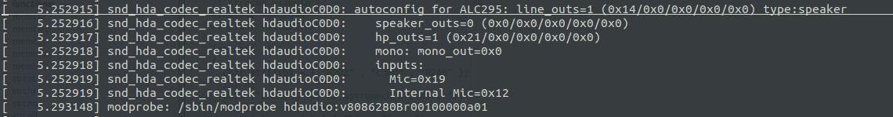

# 系统切换声卡问题：

## 1. 问题描述

从windows切换过去之后，没有声音。 做一次休眠唤醒之后，就有声音了。

或者直接 断电关机 之后，启动是有声音的。

## 2. 问题定位

windows 有省电模式， 不过对设备的操作是成对出现的。现在怀疑，我们的windows在做省电模式的时候，向声卡设备 的某一个寄存器做了，配置。导致切换到android的时候，dri在初始化 dev的时候，没有对 该寄存器从新写值。

## 3.fix bug

### 3.1 



```shell
snd_hda_codec_realtek hdaudioC0D0: autoconfig for ALC295: line_outs=1 (0x14/0x0/0x0/0x0/0x0) type:speaker
```


```shell
hp-4.19/kernel/sound/pci/hda$ vim hda_auto_parser.c +411
```

```c
int snd_hda_parse_pin_defcfg(struct hda_codec *codec,       
                 struct auto_pin_cfg *cfg, 
                 const hda_nid_t *ignore_nids,
                 unsigned int cond_flags)
{
    	codec_info(codec, "autoconfig for %s: line_outs=%d (0x%x/0x%x/0x%x/0x%x/0x%x) type:%s\n",
           codec->core.chip_name, cfg->line_outs, cfg->line_out_pins[0],
           cfg->line_out_pins[1], cfg->line_out_pins[2],
           cfg->line_out_pins[3], cfg->line_out_pins[4],
           cfg->line_out_type == AUTO_PIN_HP_OUT ? "hp" :
           (cfg->line_out_type == AUTO_PIN_SPEAKER_OUT ?
            "speaker" : "line"));
}


```

找到驱动

```shell
hp-4.19/kernel/sound/pci/hda$ vim patch_realtek.c +1096 # 这个就是声卡的驱动
```

```c
module_hda_codec_driver(realtek_driver); /* */

static struct hda_codec_driver realtek_driver = { /*realtek_driver */
    .id = snd_hda_id_realtek,   /* 在这*/                                           
};

static const struct hda_device_id snd_hda_id_realtek[] = { /* snd_hda_id_realtek 在这*/
    HDA_CODEC_ENTRY(0x10ec0295, "ALC295", patch_alc269),
}

#define HDA_CODEC_ENTRY(_vid, _name, _patch) \ 
    HDA_CODEC_REV_ENTRY(_vid, 0, _name, _patch)
        
        
       
 #define HDA_CODEC_REV_ENTRY(_vid, _rev, _name, _patch) \      
    { .vendor_id = (_vid), .rev_id = (_rev), .name = (_name), \
      .api_version = HDA_DEV_LEGACY, \
      .driver_data = (unsigned long)(_patch) }    

struct hda_device_id {               
    __u32 vendor_id; // 0x10ec0295
    __u32 rev_id; // 0 
    __u8 api_version; // HDA_DEV_LEGACY
    const char *name; // ALC295
    unsigned long driver_data; // patch_alc269
};
```

现在分析他是怎么注册的：

```c
module_hda_codec_driver(realtek_driver); /* */


#define module_hda_codec_driver(drv) \                  
    module_driver(drv, hda_codec_driver_register, \
              hda_codec_driver_unregister)
        
        

#define module_driver(__driver, __register, __unregister, ...) \                 
static int __init __driver##_init(void) \
{ \
    return __register(&(__driver) , ##__VA_ARGS__); \
} \ 
module_init(__driver##_init); \
static void __exit __driver##_exit(void) \
{ \ 
    __unregister(&(__driver) , ##__VA_ARGS__); \
} \ 
module_exit(__driver##_exit);  


#define hda_codec_driver_register(drv) \    
    __hda_codec_driver_register(drv, KBUILD_MODNAME, THIS_MODULE)
        
        
void hda_codec_driver_unregister(struct hda_codec_driver *drv)
{
    driver_unregister(&drv->core.driver);
}
```

```c
/*自动定义两个函数*/
static int __init realtek_driver_init(void)
{ 
    return __hda_codec_driver_register(&(realtek_driver), KBUILD_MODNAME, THIS_MODULE);
} 
module_init(realtek_driver_init);
static void __exit realtek_driver_exit(void)
{ 
    hda_codec_driver_unregister(&(realtek_driver)); 
} 
module_exit(realtek_driver_exit);


```

```c
// hp-4.19/kernel/sound/pci/hda$ vim hda_bind.c +153
int __hda_codec_driver_register(struct hda_codec_driver *drv, const char *name, 
                   struct module *owner)
{
    drv->core.driver.name = name;
    drv->core.driver.owner = owner;
    drv->core.driver.bus = &snd_hda_bus_type;
    drv->core.driver.probe = hda_codec_driver_probe;/**/
    drv->core.driver.remove = hda_codec_driver_remove;
    drv->core.driver.shutdown = hda_codec_driver_shutdown;
    drv->core.driver.pm = &hda_codec_driver_pm;/**/
    drv->core.type = HDA_DEV_LEGACY;
    drv->core.match = hda_codec_match;
    drv->core.unsol_event = hda_codec_unsol_event;
    return driver_register(&drv->core.driver);
}
```


现在记录一下休眠唤醒的测试结果

1. 没有去掉 动态电源管理

   现象： 切换系统无声、休眠唤醒之后有声音

   函数调用如下：

   ```shell
   colby hda_codec_driver_probe 83
   colby hda_codec_driver_probe 83
   
   colby hda_codec_runtime_suspend 2922
   colby hda_codec_runtime_suspend 2922
   
   
   colby hda_codec_pm_suspend 2965
   colbyhda_codec_runtime_suspend hda_codec_pm_suspend 2965
   
   colby hda_codec_pm_resume 2972
   colby hda_codec_runtime_resume 2939
   colby hda_codec_pm_resume 2972
   colby hda_codec_runtime_resume 2939
   
   colby hda_codec_runtime_suspend 2922
   olby hda_codec_runtime_suspend 2922
   ```

2. 去掉动态电源管理

   ​	现象： 切换系统无声、休眠唤醒之后无声

   ```shell
   colby hda_codec_driver_probe 83
   colby hda_codec_driver_probe 83
   
   colby hda_codec_pm_suspend 2965
   colby hda_codec_pm_suspend 2965
   
   colby hda_codec_pm_resume 2972
   colby hda_codec_pm_resume 2972
   ```

   

简化一下：

休眠唤醒后有声：

```shell
colby hda_codec_pm_suspend 2965 # 睡眠

colby hda_codec_pm_resume 2972
colby hda_codec_runtime_resume 2939

```

唤醒后无声：

```shell

colby hda_codec_pm_suspend 2965 # 睡眠

colby hda_codec_pm_resume 2972 # 唤醒
```

从对比中我们知道，我们可以让其在probe中多做一次  hda_codec_runtime_resume 即可解决问题。


写一个定时器：

参照：

```shell
hp-4.19/kernel/drivers$ vim watchdog/cpwd.c +254
```

```c
#define WD_BTIMEOUT (jiffies + (HZ * 1000))
// 注册进系统 此时就开始执行了
cpwd_timer.expires = WD_BTIMEOUT;            
add_timer(&cpwd_timer);

del_timer_sync(&cpwd_timer);
```


```c
// 初始化 一般在 probe中
#include <linux/timer.h>

static struct timer_list cpwd_timer;

timer_setup(&cpwd_timer, cpwd_brokentimer, 0);        
cpwd_timer.expires  = WD_BTIMEOUT;

static void cpwd_brokentimer(struct timer_list *unused)                         
{
    if (timer_pending(&cpwd_timer))
        del_timer(&cpwd_timer);
    
    if (tripped) {
        /* there is at least one timer brokenstopped-- reschedule */                
        cpwd_timer.expires = WD_BTIMEOUT;
        add_timer(&cpwd_timer);
    }
}
```

写我们自己的 定时器：


```c
#include <linux/timer.h>
#define RESUME_TIMEOUT_TIME (jiffies + (HZ * 2))

static struct timer_list resume_timer;
struct device *resume_dev;
static void resume_timeout(struct timer_list* timer)                    
{
    static int count = 0;
    printk(KERN_ERR"colby %s %d...\n", __func__, __LINE__);
    if (timer_pending(&resume_timer))/*当我们将要执行 resume_timeout 时，系统会将 resume_timer 从内核链表中删除，所以此时，这个判断为 false, del_timer是不成立的。*/
        del_timer(&resume_timer);

    mod_timer(&resume_timer, RESUME_TIMEOUT_TIME);
}
```

```c
static int hda_codec_driver_probe(struct device *dev)
{
    if (timer_pending(&resume_timer)){ /*如果当前系统中存在 resume_timer定时器，就啥事都别做*/
        printk(KERN_ERR"colby resume_timer existence... \n");   
    }else{
        /*如果不存在就 注册这个定时器。*/
        printk(KERN_ERR"colby resume_timer no existence , add resume_timer ... \n");    
        resume_dev = dev;
        timer_setup(&resume_timer, resume_timeout, 0);
        resume_timer.expires  = RESUME_TIMEOUT_TIME;
        add_timer(&resume_timer);
    }
}
```


获取vendor_id:

```c
switch (codec->core.vendor_id) {
        case 0x10ec0295: 
}
```

