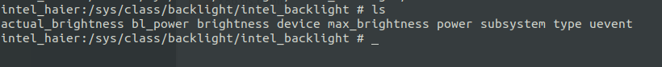

# 背光

## 1. 接口：

在sys中的接口



```shell
echo 4000 > brightness # 调节背光
```

对应在kernel中的源码：

4.19.50

```shell
hp-4.19/kernel$ grep -inR "(brightness)"
```

```shell
DEVICE_ATTR_RW(brightness);
```

```c
static ssize_t brightness_store(struct device *dev,
        struct device_attribute *attr, const char *buf, size_t count)
{
    int rc; 
    struct backlight_device *bd = to_backlight_device(dev);
    unsigned long brightness;

    rc = kstrtoul(buf, 0, &brightness);
    if (rc)
        return rc; 

    rc = backlight_device_set_brightness(bd, brightness);

    return rc ? rc : count;
}

static ssize_t brightness_show(struct device *dev,                     
        struct device_attribute *attr, char *buf)
{
    struct backlight_device *bd = to_backlight_device(dev);

    return sprintf(buf, "%d\n", bd->props.brightness);
}


static DEVICE_ATTR_RW(brightness);/*这个是重点*/

```

```c
/* dev_attr_brightness 定义：*/
#define DEVICE_ATTR_RW(_name) \                     
    struct device_attribute dev_attr_##_name = __ATTR_RW(_name)
        
#define __ATTR_RW(_name) __ATTR(_name, 0644, _name##_show, _name##_store)
        
#define __ATTR(_name, _mode, _show, _store) {               \       
    .attr = {.name = __stringify(_name),                \
         .mode = VERIFY_OCTAL_PERMISSIONS(_mode) },     \
    .show   = _show,                        \
    .store  = _store,                       \
}        
```


在那 注册的呢：dev_attr_brightness

```shell
hp-4.19/kernel$ vim drivers/video/backlight/backlight.c +291
```

```c
static struct attribute *bl_device_attrs[] = { 
    &dev_attr_bl_power.attr,
    &dev_attr_brightness.attr,                           
    &dev_attr_actual_brightness.attr,
    &dev_attr_max_brightness.attr,
    &dev_attr_type.attr,
    NULL,
};
ATTRIBUTE_GROUPS(bl_device);
```

```c
#define ATTRIBUTE_GROUPS(_name)                 \                       
static const struct attribute_group _name##_group = {       \ /*bl_device_group*/
    .attrs = _name##_attrs,                 \ /*bl_device_attrs*/
};                              \
__ATTRIBUTE_GROUPS(_name)
    
 /*bl_device_groups*/   
#define __ATTRIBUTE_GROUPS(_name)               \                         
static const struct attribute_group *_name##_groups[] = {   \
    &_name##_group,                     \ /*bl_device_group*/
    NULL,                           \
} 
```

bl_device_groups 是在那注册的：

```shell
hp-4.19/kernel$ vim drivers/video/backlight/backlight.c +670
```

```c
static int __init backlight_class_init(void)
{
    backlight_class = class_create(THIS_MODULE, "backlight");
    if (IS_ERR(backlight_class)) {
        pr_warn("Unable to create backlight class; errno = %ld\n",
            PTR_ERR(backlight_class));
        return PTR_ERR(backlight_class);
    }   

    backlight_class->dev_groups = bl_device_groups;  /*bl_device_groups 在这 */                                                               
    backlight_class->pm = &backlight_class_dev_pm_ops;
    INIT_LIST_HEAD(&backlight_dev_list);
    mutex_init(&backlight_dev_list_mutex);
    BLOCKING_INIT_NOTIFIER_HEAD(&backlight_notifier);

    return 0;
}


postcore_initcall(backlight_class_init);

#define postcore_initcall(fn)       module_init(fn)
```


**总结一句， 所有在 sys下看到的 文件，都可以搜索的到：  DEVICE_ATTR_RW() 和这个相关的 就是。** 

