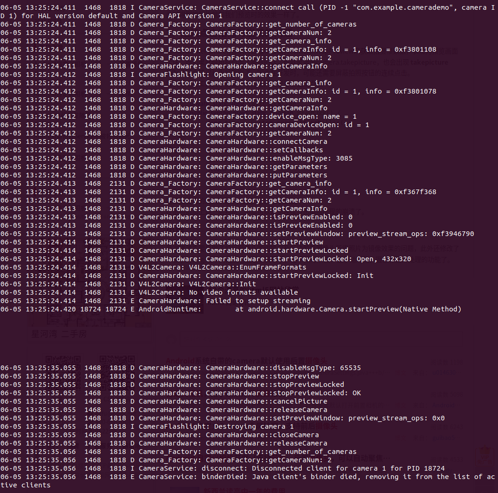

# camera 查错

## 1. 错误描述

```shell
frameworks/base$ vim services/java/com/android/server/SystemServer.java
```

mSystemServiceManager.startService(RetailDemoModeService.class);

当我们在启动 java层的服务的时候，RetailDemoModeService， 会因为摄像头的问题，而导致安卓系统启动不起来。

## 2. 重点追的几个函数：

### 2.1 CameraService::makeClient

路径： frameworks$ vim ./av/services/camera/libcameraservice/CameraService.cpp

```c++
Status CameraService::makeClient(const sp<CameraService>& cameraService,
        const sp<IInterface>& cameraCb, const String16& packageName, int cameraId,
        int facing, int clientPid, uid_t clientUid, int servicePid, bool legacyMode,
        int halVersion, int deviceVersion, apiLevel effectiveApiLevel,
        /*out*/sp<BasicClient>* client) {

    ALOGI("CHAOZHUO_COLBY makeClient 1. ") ;
    if (halVersion < 0 || halVersion == deviceVersion) {
        // Default path: HAL version is unspecified by caller, create CameraClient
        // based on device version reported by the HAL.
        switch(deviceVersion) {
          case CAMERA_DEVICE_API_VERSION_1_0:
            if (effectiveApiLevel == API_1) {  // Camera1 API route
                sp<ICameraClient> tmp = static_cast<ICameraClient*>(cameraCb.get());
                *client = new CameraClient(cameraService, tmp, packageName, cameraId, facing,
                        clientPid, clientUid, getpid(), legacyMode);
                
                ALOGI("CHAOZHUO_COLBY makeClient 2. ") ;

            } else { // Camera2 API route
                ALOGW("Camera using old HAL version: %d", deviceVersion);
                ALOGI("CHAOZHUO_COLBY makeClient 3. ") ;
                return STATUS_ERROR_FMT(ERROR_DEPRECATED_HAL,
                        "Camera device \"%d\" HAL version %d does not support camera2 API",
                        cameraId, deviceVersion);
            }
            break;
          case CAMERA_DEVICE_API_VERSION_3_0:
          case CAMERA_DEVICE_API_VERSION_3_1:
          case CAMERA_DEVICE_API_VERSION_3_2:
          case CAMERA_DEVICE_API_VERSION_3_3:
          case CAMERA_DEVICE_API_VERSION_3_4:
            if (effectiveApiLevel == API_1) { // Camera1 API route
                sp<ICameraClient> tmp = static_cast<ICameraClient*>(cameraCb.get());
                *client = new Camera2Client(cameraService, tmp, packageName, cameraId, facing,
                        clientPid, clientUid, servicePid, legacyMode);
                ALOGI("CHAOZHUO_COLBY makeClient 4. ") ;
            } else { // Camera2 API route
                sp<hardware::camera2::ICameraDeviceCallbacks> tmp =
                        static_cast<hardware::camera2::ICameraDeviceCallbacks*>(cameraCb.get());
                *client = new CameraDeviceClient(cameraService, tmp, packageName, cameraId,
                        facing, clientPid, clientUid, servicePid);
                ALOGI("CHAOZHUO_COLBY makeClient 5. ") ;
            }
            break;
          default:
            // Should not be reachable
            ALOGE("Unknown camera device HAL version: %d", deviceVersion);
            ALOGI("CHAOZHUO_COLBY makeClient 6. ") ;
            return STATUS_ERROR_FMT(ERROR_INVALID_OPERATION,
                    "Camera device \"%d\" has unknown HAL version %d",
                    cameraId, deviceVersion);
        }
    } else {
        // A particular HAL version is requested by caller. Create CameraClient
        // based on the requested HAL version.
        if (deviceVersion > CAMERA_DEVICE_API_VERSION_1_0 &&
            halVersion == CAMERA_DEVICE_API_VERSION_1_0) {
            // Only support higher HAL version device opened as HAL1.0 device.
            sp<ICameraClient> tmp = static_cast<ICameraClient*>(cameraCb.get());
            *client = new CameraClient(cameraService, tmp, packageName, cameraId, facing,
                    clientPid, clientUid, servicePid, legacyMode);
            ALOGI("CHAOZHUO_COLBY makeClient 7. ") ;
        } else {
            // Other combinations (e.g. HAL3.x open as HAL2.x) are not supported yet.
            ALOGE("Invalid camera HAL version %x: HAL %x device can only be"
                    " opened as HAL %x device", halVersion, deviceVersion,
                    CAMERA_DEVICE_API_VERSION_1_0);
            ALOGI("CHAOZHUO_COLBY makeClient 8. ") ;
            return STATUS_ERROR_FMT(ERROR_ILLEGAL_ARGUMENT,
                    "Camera device \"%d\" (HAL version %d) cannot be opened as HAL version %d",
                    cameraId, deviceVersion, halVersion);
        }
    }
    ALOGI("CHAOZHUO_COLBY makeClient 9. end ") ;                                                                      
    return Status::ok();
}

```

### 2.2 CameraService::onFirstRef

frameworks/av/services/camera$ gedit libcameraservice/CameraService.cpp

cpp服务刚起来的时候，就开始调用这个了

```c++
void CameraService::onFirstRef()
{
	ALOGI("CHAOZHUO_COLBY CameraService::onFirstRef 1 ...") ;
    ALOGI("CameraService process starting");

    BnCameraService::onFirstRef();

    // Update battery life tracking if service is restarting
    BatteryNotifier& notifier(BatteryNotifier::getInstance());
    notifier.noteResetCamera();
    notifier.noteResetFlashlight();

    camera_module_t *rawModule;
    int err = hw_get_module(CAMERA_HARDWARE_MODULE_ID,
            (const hw_module_t **)&rawModule);
    if (err < 0) {
		ALOGI("CHAOZHUO_COLBY CameraService::onFirstRef 2 ...") ;
        ALOGE("Could not load camera HAL module: %d (%s)", err, strerror(-err));
        logServiceError("Could not load camera HAL module", err);
        return;
    }

    mModule = new CameraModule(rawModule);
    err = mModule->init();
    if (err != OK) {
		ALOGI("CHAOZHUO_COLBY CameraService::onFirstRef 3 ...") ;
        ALOGE("Could not initialize camera HAL module: %d (%s)", err,
            strerror(-err));
        logServiceError("Could not initialize camera HAL module", err);

        delete mModule;
        mModule = nullptr;
        return;
    }
    ALOGI("Loaded \"%s\" camera module", mModule->getModuleName());

    mNumberOfCameras = mModule->getNumberOfCameras();
    mNumberOfNormalCameras = mNumberOfCameras;

    // Setup vendor tags before we call get_camera_info the first time
    // because HAL might need to setup static vendor keys in get_camera_info
    VendorTagDescriptor::clearGlobalVendorTagDescriptor();
    if (mModule->getModuleApiVersion() >= CAMERA_MODULE_API_VERSION_2_2) {
		ALOGI("CHAOZHUO_COLBY CameraService::onFirstRef 4 ...") ;
        setUpVendorTags();
    }

    mFlashlight = new CameraFlashlight(*mModule, *this);
    status_t res = mFlashlight->findFlashUnits();
    if (res) {
		ALOGI("CHAOZHUO_COLBY CameraService::onFirstRef 5 ...") ;
        // impossible because we haven't open any camera devices.
        ALOGE("Failed to find flash units.");
    }

    int latestStrangeCameraId = INT_MAX;
    for (int i = 0; i < mNumberOfCameras; i++) {
		ALOGI("CHAOZHUO_COLBY CameraService::onFirstRef 6 ...") ;
        String8 cameraId = String8::format("%d", i);

        // Get camera info

        struct camera_info info;
        bool haveInfo = true;
        status_t rc = mModule->getCameraInfo(i, &info);
        if (rc != NO_ERROR) {
			ALOGI("CHAOZHUO_COLBY CameraService::onFirstRef 7 ...") ;
            ALOGE("%s: Received error loading camera info for device %d, cost and"
                    " conflicting devices fields set to defaults for this device.",
                    __FUNCTION__, i);
            haveInfo = false;
        }

        // Check for backwards-compatibility support
        if (haveInfo) {
			ALOGI("CHAOZHUO_COLBY CameraService::onFirstRef 8 ...") ;
            if (checkCameraCapabilities(i, info, &latestStrangeCameraId) != OK) {
				ALOGI("CHAOZHUO_COLBY CameraService::onFirstRef 9 ...") ;
                delete mModule;
                mModule = nullptr;
                return;
            }
        }

        // Defaults to use for cost and conflicting devices
        int cost = 100;
        char** conflicting_devices = nullptr;
        size_t conflicting_devices_length = 0;

        // If using post-2.4 module version, query the cost + conflicting devices from the HAL
        if (mModule->getModuleApiVersion() >= CAMERA_MODULE_API_VERSION_2_4 && haveInfo) {
			ALOGI("CHAOZHUO_COLBY CameraService::onFirstRef 10 ...") ;
            cost = info.resource_cost;
            conflicting_devices = info.conflicting_devices;
            conflicting_devices_length = info.conflicting_devices_length;
        }

        std::set<String8> conflicting;
        for (size_t i = 0; i < conflicting_devices_length; i++) {
			ALOGI("CHAOZHUO_COLBY CameraService::onFirstRef 11 ...") ;
            conflicting.emplace(String8(conflicting_devices[i]));
        }

        // Initialize state for each camera device
        {
            Mutex::Autolock lock(mCameraStatesLock);
            mCameraStates.emplace(cameraId, std::make_shared<CameraState>(cameraId, cost,
                    conflicting));
        }

        if (mFlashlight->hasFlashUnit(cameraId)) {
			ALOGI("CHAOZHUO_COLBY CameraService::onFirstRef 12 ...") ;
            mTorchStatusMap.add(cameraId,
                    ICameraServiceListener::TORCH_STATUS_AVAILABLE_OFF);
        }
    }

    if (mModule->getModuleApiVersion() >= CAMERA_MODULE_API_VERSION_2_1) {
		ALOGI("CHAOZHUO_COLBY CameraService::onFirstRef 13 ...") ;
        mModule->setCallbacks(this);
    }

    CameraService::pingCameraServiceProxy();
	ALOGI("CHAOZHUO_COLBY CameraService::onFirstRef 14 ... end") ;
}
```

## 3. hal 函数表

```cpp
#define HAL_MODULE_INFO_SYM         HMI

camera_module_t HAL_MODULE_INFO_SYM = {                                                                               
    common: {
         tag:           HARDWARE_MODULE_TAG,
         version_major: 1,
         version_minor: 0,
         id:            CAMERA_HARDWARE_MODULE_ID,
         name:          "Camera Module",
         author:        "The Android Open Source Project",
         methods:       &android::CameraFactory::mCameraModuleMethods,
         dso:           NULL,
         reserved:      {0},
    },  
    get_number_of_cameras:  android::CameraFactory::get_number_of_cameras,
    get_camera_info:        android::CameraFactory::get_camera_info,
};

```


CameraHardware.cpp

```cpp
camera_device_ops_t CameraHardware::mDeviceOps = {                                                                    
    CameraHardware::set_preview_window,
    CameraHardware::set_callbacks,
    CameraHardware::enable_msg_type,
    CameraHardware::disable_msg_type,
    CameraHardware::msg_type_enabled,
    CameraHardware::start_preview,
    CameraHardware::stop_preview,
    CameraHardware::preview_enabled,
    CameraHardware::store_meta_data_in_buffers,
    CameraHardware::start_recording,
    CameraHardware::stop_recording,
    CameraHardware::recording_enabled,
    CameraHardware::release_recording_frame,
    CameraHardware::auto_focus,
    CameraHardware::cancel_auto_focus,
    CameraHardware::take_picture,
    CameraHardware::cancel_picture,
    CameraHardware::set_parameters,
    CameraHardware::get_parameters,
    CameraHardware::put_parameters,
    CameraHardware::send_command,
    CameraHardware::release,
    CameraHardware::dump
};

```


## 4. shell

```shell
# 编译调试

cd /home/colby/android_system_os/haier;source ./build/envsetup.sh;lunch android_x86_64-userdebug;make camera.x86; adb connect 192.168.1.231; sleep 3s; adb root; sleep 2s; adb push out/target/product/x86_64/system/lib64/hw/camera.x86.so /system/lib64/hw ; adb shell stop ; sleep 2s; adb shell start;


#进入
adb connect 192.168.1.231; sleep 3s; adb root; sleep 2s; adb shell
```


## 5. 从应用层开始查问题：

应用层代码：

```java
private void startPreview(){
        camera = Camera.open();// 这个地方会返回错误
        try {
            camera.setPreviewDisplay(sfv_preview.getHolder());
            camera.setDisplayOrientation(90);   //让相机旋转90度
            camera.startPreview();
        } catch (IOException e) {
            e.printStackTrace();
        }
    }
```

framework:

```java
public static Camera open() {
        int numberOfCameras = getNumberOfCameras();
        CameraInfo cameraInfo = new CameraInfo();
        for (int i = 0; i < numberOfCameras; i++) {
            getCameraInfo(i, cameraInfo);
            if (cameraInfo.facing == CameraInfo.CAMERA_FACING_BACK) {
                return new Camera(i);// 这个会报错
            }
        }
        return null;
    }
```

```java
Camera(int cameraId) {
        int err = cameraInitNormal(cameraId);// 这儿会报错
        if (checkInitErrors(err)) {
            if (err == -EACCES) {
                // 会抛出异常
                throw new RuntimeException("Fail to connect to camera service");
            } else if (err == -ENODEV) {
                throw new RuntimeException("Camera initialization failed");
            }
            // Should never hit this.
            throw new RuntimeException("Unknown camera error");
        }
        initAppOps();
    }
```

```java
private int cameraInitNormal(int cameraId) {
        return cameraInitVersion(cameraId, CAMERA_HAL_API_VERSION_NORMAL_CONNECT);
    }
```

```java
private int cameraInitVersion(int cameraId, int halVersion) {
        mShutterCallback = null;
        mRawImageCallback = null;
        mJpegCallback = null;
        mPreviewCallback = null;
        mPostviewCallback = null;
        mUsingPreviewAllocation = false;
        mZoomListener = null;

        Looper looper;
        if ((looper = Looper.myLooper()) != null) {
            mEventHandler = new EventHandler(this, looper);
        } else if ((looper = Looper.getMainLooper()) != null) {
            mEventHandler = new EventHandler(this, looper);
        } else {
            mEventHandler = null;
        }

    	// 应该是这个地方报错
        return native_setup(new WeakReference<Camera>(this), cameraId, halVersion,
                ActivityThread.currentOpPackageName());
    }
```

jni 层


hal 层

从log 中发现：

是我们应用层 没有富裕相机的权限：

```shell
E CameraService: Permission Denial: can't use the camera pid=8887, uid=10052
```


先暂时记录一个调用顺序

/home/colby/android_system_os/haier/hardware/libcamera/CameraFactory.cpp

```cpp
camera_module_t HAL_MODULE_INFO_SYM = { 
    common: {
         tag:           HARDWARE_MODULE_TAG,
         version_major: 1,
         version_minor: 0,
         id:            CAMERA_HARDWARE_MODULE_ID,
         name:          "Camera Module",
         author:        "The Android Open Source Project",
         methods:       &android::CameraFactory::mCameraModuleMethods,
         dso:           NULL,
         reserved:      {0},
    },  
    get_number_of_cameras:  android::CameraFactory::get_number_of_cameras,
    get_camera_info:        android::CameraFactory::get_camera_info,  // 从这作为其实入口的                                                
};

// 1.
int CameraFactory::get_camera_info(int camera_id,struct camera_info* info)                 {
    ALOGD("CameraFactory::get_camera_info");
    return gCameraFactory.getCameraInfo(camera_id, info);// 2.
}

// 2.
int CameraFactory::getCameraInfo(int camera_id, struct camera_info* info)                 {
    ALOGD("CameraFactory::getCameraInfo: id = %d, info = %p", camera_id, info);

    if (camera_id < 0 || camera_id >= getCameraNum()) { // 3.
        ALOGE("%s: Camera id %d is out of bounds (%d)",
                __FUNCTION__, camera_id, getCameraNum());
        return -EINVAL;
    }   
            
    return CameraHardware::getCameraInfo(info,mCameraFacing[camera_id],mCameraOrientation[camera_id]);// 4.
}   

// 3.
int CameraFactory::getCameraNum()
{
    ALOGD("CameraFactory::getCameraNum: %d", mCameraNum);                                                             
    return mCameraNum;
}


// 4. 
status_t CameraHardware::getCameraInfo(struct camera_info* info, int facing,
                                       int orientation)
{
    ALOGD("CameraHardware::getCameraInfo");                                                                           

    info->facing = facing;
    info->orientation = orientation;

    return NO_ERROR;
}

```

### 5.1  埋点 检查调用的hal库是否正确

haier/hardware/libcamera$ vim CameraFactory.cpp +208

```cpp
int CameraFactory::get_camera_info(int camera_id,
                                           struct camera_info* info)
{
    ALOGD("CameraFactory::get_camera_info %s", __FILE__);                                                             
    return gCameraFactory.getCameraInfo(camera_id, info);
}

```

### 5.2 前置摄像头差错

app 现在是  后置摄像头可以正常使用了

现在 我们去查 前置摄像头的使用

报错：




```shell
06-05 13:25:24.414  1468  2131 E V4L2Camera: No video formats available
06-05 13:25:24.414  1468  2131 E CameraHardware: Failed to setup streaming
06-05 13:25:24.420 18724 18724 E AndroidRuntime: 	at android.hardware.Camera.startPreview(Native Method)


06-05 13:25:35.056  1468  1818 E CameraService: binderDied: Java client's binder died, removing it from the list of active clients
```

haier/hardware/libcamera$ vim V4L2Camera.cpp +151

```cpp
int V4L2Camera::Init(int width, int height, int fps)
{
    ALOGD("V4L2Camera::Init");

    /* Initialize the capture to the specified width and height */
    static const struct {
        int fmt;            /* PixelFormat */
        int bpp;            /* bytes per pixel */
        int isplanar;       /* If format is planar or not */
        int allowscrop;     /* If we support cropping with this pixel format */
    } pixFmtsOrder[] = { 
        {V4L2_PIX_FMT_YUYV,     2,0,1},
        {V4L2_PIX_FMT_YVYU,     2,0,1},
        {V4L2_PIX_FMT_UYVY,     2,0,1},
        {V4L2_PIX_FMT_YYUV,     2,0,1},
    };  

    int ret;

    // If no formats, break here
    if (m_AllFmts.isEmpty()) {
        ALOGE("No video formats available");     // 在这报错                                                                     
        return -1; 
    }   
    
    ...
}
```

m_AllFmts 这个是在那 赋值的呢

```cpp
bool V4L2Camera::EnumFrameIntervals(int pixfmt, int width, int height)                     {
    m_AllFmts.add( SurfaceDesc( width, height, fival.discrete.denominator ) );
    
    m_AllFmts.add( SurfaceDesc( width, height, 1 ) );
}
```


### 5.3 EnumFrameFormats 追

haier/hardware/libcamera$ vim V4L2Camera.cpp

```cpp
bool V4L2Camera::EnumFrameFormats()
{
    ALOGD("V4L2Camera::EnumFrameFormats");
    ALOGD("CHAOZHUO_COLBY EnumFrameFormats 1. ") ;
    struct v4l2_fmtdesc fmt;
    int ret;

    // Start with no modes
    m_AllFmts.clear();

    memset(&fmt, 0, sizeof(fmt));
    fmt.index = 0;
    fmt.type = V4L2_BUF_TYPE_VIDEO_CAPTURE;

    while ((ret = ioctl(fd,VIDIOC_ENUM_FMT, &fmt))>= 0) {
        ALOGD("CHAOZHUO_COLBY EnumFrameFormats 2. ") ;
        fmt.index++;
        ALOGD("{ pixelformat = '%c%c%c%c', description = '%s' }",
                fmt.pixelformat & 0xFF, (fmt.pixelformat >> 8) & 0xFF,
                (fmt.pixelformat >> 16) & 0xFF, (fmt.pixelformat >> 24) & 0xFF,
                fmt.description);

        //enumerate frame sizes for this pixel format
        if (!EnumFrameSizes(fmt.pixelformat)) {
            ALOGD("CHAOZHUO_COLBY EnumFrameFormats 3. ") ;
            ALOGE("  Unable to enumerate frame sizes.");
        }
    };
    
    if(ret < 0){
        ALOGD("获取ioctl(VIDIOC_ENUM_FMT) 出错了，这里根本就没有获取到该相机的参数") ;
    }

    // Now, select the best preview format and the best PictureFormat
    m_BestPreviewFmt = SurfaceDesc();
    m_BestPictureFmt = SurfaceDesc();

    unsigned int i;
    for (i=0; i<m_AllFmts.size(); i++) {
        ALOGD("CHAOZHUO_COLBY EnumFrameFormats 4. ") ;
        SurfaceDesc s = m_AllFmts[i];

        // Prioritize size over everything else when taking pictures. use the
        // least fps possible, as that usually means better quality
        if ((s.getSize()  > m_BestPictureFmt.getSize()) ||
            (s.getSize() == m_BestPictureFmt.getSize() && s.getFps() < m_BestPictureFmt.getFps() )
            ) {
            ALOGD("CHAOZHUO_COLBY EnumFrameFormats 5. ") ;
            m_BestPictureFmt = s;
        }

        // Prioritize fps, then size when doing preview
        if ((s.getFps()  > m_BestPreviewFmt.getFps()) ||
            (s.getFps() == m_BestPreviewFmt.getFps() && s.getSize() > m_BestPreviewFmt.getSize() )
            ) {
            ALOGD("CHAOZHUO_COLBY EnumFrameFormats 6. ") ;
            m_BestPreviewFmt = s;
        }

    }

    ALOGD("CHAOZHUO_COLBY EnumFrameFormats 7 ... end ") ;                                                             
    return true;
}

```

