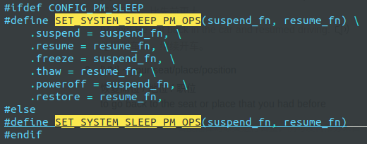

# 4.19.15-触屏调试

## 1. 问题描述

海尔 触摸屏：

1. 断电开机后，触摸板不能使用。休眠唤醒后可以正常使用。
2. 从win10重启到凤凰系统下，触摸板是可以使用的。

初步的解决方案：

1. 屏蔽 haier/kernel/drivers/hid/i2c-hid 下 和电源管理相关的设置

```shell
i2c-hid-core.c:1201:#ifdef CONFIG_PM_SLEEP
i2c-hid-core.c:1296:#ifdef CONFIG_PM
```

由于这是一个临时的解决方案，海尔厂商不太满意，需要重新定位问题

## 2. 驱动分析

i2c-hid-core.c

```c
static struct i2c_driver i2c_hid_driver = {
    .driver = {
        .name   = "i2c_hid",
        .pm = &i2c_hid_pm,    // 这里是关键                                                                                      
        .acpi_match_table = ACPI_PTR(i2c_hid_acpi_match),
        .of_match_table = of_match_ptr(i2c_hid_of_match),
    },   

    .probe      = i2c_hid_probe,
    .remove     = i2c_hid_remove,
    .shutdown   = i2c_hid_shutdown,
    .id_table   = i2c_hid_id_table,
};

```

```c
static const struct dev_pm_ops i2c_hid_pm = {                                                                         
    SET_SYSTEM_SLEEP_PM_OPS(i2c_hid_suspend, i2c_hid_resume)
    SET_RUNTIME_PM_OPS(i2c_hid_runtime_suspend, i2c_hid_runtime_resume,
               NULL)
};
```





从这里我们知道， 我们的 dev_pm_ops是赋值给了 device_driver中的pm了。


这里记录一个参考url: http://www.wowotech.net/pm_subsystem/device_driver_pm.html

### 2.1 谁调用 

```c
static const struct dev_pm_ops i2c_hid_pm = {                                                                         
    SET_SYSTEM_SLEEP_PM_OPS(i2c_hid_suspend, i2c_hid_resume)
    SET_RUNTIME_PM_OPS(i2c_hid_runtime_suspend, i2c_hid_runtime_resume,
               NULL)
};
```


参考url:http://www.wowotech.net/pm_subsystem/pm_interface.html

这里我们只需要查明 谁调用了 


#### 2.1.1 device_pm_callbacks的函数

所谓的PM Domain（电源域），是针对“device”来说的。bus_type、device_driver、class、device_type等结构，本质上代表的是设备驱动，电源管理的操作，由设备驱动负责，是理所应当的。但在内核中，由于各种原因，是允许没有driver的device存在的，那么怎么处理这些设备的电源管理呢？就是通过设备的电源域实现的。

操作 dev_pm_ops的函数的封装：


内核在定义device PM callbacks数据结构的同时，为了方便使用该数据结构，也定义了大量的操作API，这些API分为两类。

◆通用的辅助性质的API，直接调用指定设备所绑定的driver的、pm指针的、相应的callback，如下

pm.h

```c
extern int pm_generic_prepare(struct device *dev);
extern int pm_generic_suspend_late(struct device *dev);
extern int pm_generic_suspend_noirq(struct device *dev);
extern int pm_generic_suspend(struct device *dev);
extern int pm_generic_resume_early(struct device *dev);
extern int pm_generic_resume_noirq(struct device *dev);
extern int pm_generic_resume(struct device *dev);
extern int pm_generic_freeze_noirq(struct device *dev);                                                               
extern int pm_generic_freeze_late(struct device *dev);
extern int pm_generic_freeze(struct device *dev);
extern int pm_generic_thaw_noirq(struct device *dev);
extern int pm_generic_thaw_early(struct device *dev);
extern int pm_generic_thaw(struct device *dev);
extern int pm_generic_restore_noirq(struct device *dev);
extern int pm_generic_restore_early(struct device *dev);
extern int pm_generic_restore(struct device *dev);
extern int pm_generic_poweroff_noirq(struct device *dev);
extern int pm_generic_poweroff_late(struct device *dev);
extern int pm_generic_poweroff(struct device *dev);
extern void pm_generic_complete(struct device *dev);
```

实现在：drivers/base/power/generic_ops.c

```c
int pm_generic_suspend(struct device *dev)
{
    const struct dev_pm_ops *pm = dev->driver ? dev->driver->pm : NULL;

    return pm && pm->suspend ? pm->suspend(dev) : 0;  // 这里就是说，通过 pm_generic_suspend 的调用就能调用到，我们在驱动中注册的函数了                                                              
}
EXPORT_SYMBOL_GPL(pm_generic_suspend);

int pm_generic_freeze(struct device *dev)
{
    const struct dev_pm_ops *pm = dev->driver ? dev->driver->pm : NULL;

    return pm && pm->freeze ? pm->freeze(dev) : 0;  // 冻结                                                                  
}
EXPORT_SYMBOL_GPL(pm_generic_freeze);

int pm_generic_poweroff(struct device *dev)
{
    const struct dev_pm_ops *pm = dev->driver ? dev->driver->pm : NULL;

    return pm && pm->poweroff ? pm->poweroff(dev) : 0;                                                                
}
EXPORT_SYMBOL_GPL(pm_generic_poweroff);

int pm_generic_runtime_suspend(struct device *dev)
{
    const struct dev_pm_ops *pm = dev->driver ? dev->driver->pm : NULL;
    int ret;

    ret = pm && pm->runtime_suspend ? pm->runtime_suspend(dev) : 0;

    return ret;
}
EXPORT_SYMBOL_GPL(pm_generic_runtime_suspend);


// 如何调用 runtime_idle可以参考这个接口
RPM_GET_CALLBACK(dev, runtime_idle);
```

◆和整体电源管理行为相关的API，目的是将各个独立的电源管理行为组合起来，组成一个较为简单的功能，如下

pm.h

```c
#ifdef CONFIG_PM_SLEEP
extern void device_pm_lock(void);
extern void dpm_resume_start(pm_message_t state);
extern void dpm_resume_end(pm_message_t state);
extern void dpm_noirq_resume_devices(pm_message_t state);
extern void dpm_noirq_end(void);
extern void dpm_resume_noirq(pm_message_t state);
extern void dpm_resume_early(pm_message_t state);
extern void dpm_resume(pm_message_t state);
extern void dpm_complete(pm_message_t state);

extern void device_pm_unlock(void);                                                                                   
extern int dpm_suspend_end(pm_message_t state);
extern int dpm_suspend_start(pm_message_t state);
extern void dpm_noirq_begin(void);
extern int dpm_noirq_suspend_devices(pm_message_t state);
extern int dpm_suspend_noirq(pm_message_t state);
extern int dpm_suspend_late(pm_message_t state);
extern int dpm_suspend(pm_message_t state);
extern int dpm_prepare(pm_message_t state);

extern void __suspend_report_result(const char *function, void *fn, int ret);

#define suspend_report_result(fn, ret)                  \
    do {                                \
        __suspend_report_result(__func__, fn, ret);     \
    } while (0)

extern int device_pm_wait_for_dev(struct device *sub, struct device *dev);
extern void dpm_for_each_dev(void *data, void (*fn)(struct device *, void *));
```

这些API的功能和动作解析如下。

##### 2.1.1.1 dpm_prepare 函数解析

dpm_prepare，执行**所有设备**的“->prepare() callback(s)”，内部动作为：

```c
int dpm_prepare(pm_message_t state)
{
    int error = 0;

    trace_suspend_resume(TPS("dpm_prepare"), state.event, true);
    might_sleep();

    /*
     * Give a chance for the known devices to complete their probes, before
     * disable probing of devices. This sync point is important at least
     * at boot time + hibernation restore.
     */
    wait_for_device_probe();
    /*
     * It is unsafe if probing of devices will happen during suspend or
     * hibernation and system behavior will be unpredictable in this case.
     * So, let's prohibit device's probing here and defer their probes
     * instead. The normal behavior will be restored in dpm_complete().
     */
    device_block_probing();

    mutex_lock(&dpm_list_mtx);
    while (!list_empty(&dpm_list)) {
        struct device *dev = to_device(dpm_list.next);

        get_device(dev);
        mutex_unlock(&dpm_list_mtx);

        trace_device_pm_callback_start(dev, "", state.event);
        error = device_prepare(dev, state);// 这个是关键
        trace_device_pm_callback_end(dev, error);

        mutex_lock(&dpm_list_mtx);
        if (error) {
            if (error == -EAGAIN) {
                put_device(dev);
                error = 0;
                continue;
            }
            printk(KERN_INFO "PM: Device %s not prepared "
                "for power transition: code %d\n",
                dev_name(dev), error);
            put_device(dev);
            break;
        }
        dev->power.is_prepared = true;
        if (!list_empty(&dev->power.entry))
            list_move_tail(&dev->power.entry, &dpm_prepared_list);
        put_device(dev);
    }
    mutex_unlock(&dpm_list_mtx);
    trace_suspend_resume(TPS("dpm_prepare"), state.event, false);
    return error;
}                                                             
```

1）遍历dpm_list，依次取出挂在该list中的device指针。      
   【注1：设备模型在添加设备（device_add）时，会调用device_pm_add接口，将该设备添加到全局链表dpm_list中，以方便后续的遍历操作。】

2）调用内部接口device_prepare，执行实际的prepare动作。该接口会返回执行的结果。

3）如果执行失败，打印错误信息。

4）如果执行成功，将dev->power.is_prepared(就是上面我们提到的struct dev_pm_info类型的变量）设为TRUE，表示设备已经prepared了。同时，将该设备添加到dpm_prepared_list中（该链表保存了所有已经处于prepared状态的设备）。

 

内部接口device_prepare的执行动作为：

1）根据dev->power.syscore，断该设备是否为syscore设备。如果是，则直接返回（因为syscore设备会单独处理）。

2）在prepare时期，调用pm_runtime_get_noresume接口，关闭Runtime suspend功能。以避免由Runtime suspend造成的不能正常唤醒的Issue。该功能会在complete时被重新开启。      
   【注2：pm_runtime_get_noresume的实现很简单，就是增加该设备power变量的引用计数（dev->power.usage_count），Runtime PM会根据该计数是否大于零，判断是否开启Runtime PM功能。】

3）调用device_may_wakeup接口，根据当前设备是否有wakeup source（dev->power.wakeup）以及是否允许wakeup（dev->power.can_wakeup），判定该设备是否是一个wakeup path（记录在dev->power.wakeup_path中）。       
    【注3：设备的wake up功能，是指系统在低功耗状态下（如suspend、hibernate），某些设备具备唤醒系统的功能。这是电源管理过程的一部分。】

4）根据优先顺序，获得用于prepare的callback函数。由于设备模型有bus、driver、device等多个层级，而prepare接口可能由任意一个层级实现。这里的优先顺序是指，只要优先级高的层级注册了prepare，就会优先使用它，而不会使用优先级低的prepare。优先顺序为：dev->pm_domain->ops、dev->type->pm、dev->class->pm、dev->bus->pm、dev->driver->pm（这个优先顺序同样适用于其它callbacks）。       

5）如果得到有限的prepare函数，调用并返回结果。 

##### 2.1.1.2 dpm_suspend

dpm_suspend，执行所有设备的“->suspend() callback(s)”，其内部动作和dpm_prepare类似：

> 1）遍历dpm_list，依次取出挂在该list中的device指针。      
>
> 2）调用内部接口device_suspend，执行实际的prepare动作。该接口会返回执行的结果。
>
> 3）如果suspend失败，将该设备的信息记录在一个struct suspend_stats类型的数组中，并打印错误错误信息。
>
> 4）最后将设备从其它链表（如dpm_prepared_list），转移到dpm_suspended_list链表中。
>
> 内部接口device_suspend的动作和device_prepare类似，这里不再描述了。

##### 2.1.1.3 其他函数

dpm_suspend_start，依次执行dpm_prepare和dpm_suspend两个动作。

dpm_suspend_end，依次执行所有设备的“->suspend_late() callback(s)”以及所有设备的“->suspend_noirq() callback(s)”。动作和上面描述的类似，这里不再说明了。

dpm_resume、dpm_complete、dpm_resume_start、dpm_resume_end，是电源管理过程的唤醒动作，和dpm_suspend_xxx系列的接口类似。不再说明了。


### 2.1 dev_pm_ops

这里要想，弄明白 设备的电源管理，就必须搞明白，有那些地方引用到了 dev_pm_ops

device.h


> 
>
> 注意看这里有一个电源域： dev_pm_domain 其中包含了 dev_pm_ops
>
> pm.h
>
> 
>
> **总结：**
>
> 可谓是狡兔多窟，struct dev_pm_ops存在于`struct device、``struct device_type、``struct class、``struct bus_type、``struct device_driver`等所有和设备模型有关的实体中`。`
>
> 由之前的文章可知，kernel在电源管理的过程中，会按照如下优先级调用dev_pm_ops中的回调函数，以命令设备实现相应的状态切换`： `
>
> ```
>     dev->pm_domain->ops、dev->type->pm、dev->class->pm、dev->bus->pm、dev->driver->pm。
>   
> ```
>
> 因此，设备driver需要做的事情也很单纯，实现这些回调函数，并保存在合适的位置。但这么多位置，到底怎么实现呢？我们接着分析。
>
> 从上面的总结中，我们能看到 设备的电源控制，按照优先级，pm_domain最高 driver最低， 共5个岔路口都可以被调用到。而我们的问题是出在了 最低的一个优先级的调用，即 driver的调用

```c
struct device {
    struct dev_pm_domain    *pm_domain;
    const struct device_type *type;
    struct class        *class;
    struct bus_type *bus;
    struct device_driver *driver;
}
```

由之前的描述可知，系统在电源状态切换时，会按照一定的优先顺序，调用设备的pm 
ops。所谓的优先顺序，是指：只要存在优先级高的ops（如dev->pm_domain->ops），则调用该ops，否则继续查找下一个优先级。因此，设备驱动可以根据该设备的实际情况，在指定层次上，实现dev
pm ops，以达到电源管理的目的。

dev pm ops可以存在于pm domain、device type、class、bus、device driver任何一个地方，本章以pm domain、bus和device driver三个典型场景为例，介绍设备电源管理的实现思路。

注1：为了方便，我会以`struct dev_pm_ops`中的.suspend函数为例，其它类似。

#### **2.1.1 pm domain**

当一个设备属于某个pm domain时（具体可参考“[Linux PM domain framework(1)_概述和使用流程](http://www.wowotech.net/pm_subsystem/pm_domain_overview.html)”），系统suspend的过程中，会直接调用pm_domain->ops.suspend。而由pm_genpd_init可知，pm_domain->ops.suspend由pm_genpd_suspend实现：

```c
int pm_genpd_init(){
    genpd->domain.ops.runtime_suspend = genpd_runtime_suspend;
    genpd->domain.ops.runtime_resume = genpd_runtime_resume;
    genpd->domain.ops.prepare = genpd_prepare;
    genpd->domain.ops.suspend_noirq = genpd_suspend_noirq;
    genpd->domain.ops.resume_noirq = genpd_resume_noirq;                                                              
    genpd->domain.ops.freeze_noirq = genpd_freeze_noirq;
    genpd->domain.ops.thaw_noirq = genpd_thaw_noirq;
    genpd->domain.ops.poweroff_noirq = genpd_poweroff_noirq;
    genpd->domain.ops.restore_noirq = genpd_restore_noirq;
    genpd->domain.ops.complete = genpd_complete;
}
genpd->domain.ops.suspend = pm_genpd_suspend;
```


这里有点尴尬了，居然没有搜索到 4.19.15的内核就是个坑啊

### 3. 问题追踪：

根据上面的分析现在有如下思路：

思路一：

1. 首先搞清楚，i2c-hid 断电开机后，对应的驱动管理函数，的调用栈的信息
2. 然后根据调用栈，在去深入的分析，开关机到底做了那些事情

先就对思路一，的改动进行记录：

首先我们对休眠唤醒相关函数加了 调用栈的打印信息：


断电关机 然后开机 发现只有 i2c_hid_runtime_suspend  和 i2c_hid_runtime_resume两个函数被调用了，其他函数是没有被调用的。

**Q.** 那此时就产生一个问题了，是谁 触发这次 休眠的？

通过查资料：http://www.wowotech.net/pm_subsystem/rpm_overview.html

得出结论，触发这次休眠的是，我们驱动自身。

能够触发此次休眠的函数是 pm_runtime_put 函数，（备注： put 使得引用计数减少，触发此次休眠。 get 函数 增加引用计数 触发设备的唤醒）

既然休眠是 由put函数 导致的，那我们此时，就要查清楚，在那些地方调用了put系列函数，

此时对 probe函数 进行了详细的追踪。

对probe 函数进行了打印追踪


发现此时 跑了 26 这个分支，

而26这个分支的代码如下：此时我们就算是找到这次休眠的 触发源了。

```c
if (!(ihid->quirks & I2C_HID_QUIRK_NO_RUNTIME_PM))
        pm_runtime_put(&client->dev);
```

**Q.** 那这里有产生一个新的疑问，怎么就执行这个 分支了呢？

```c
ihid->quirks = i2c_hid_lookup_quirk(hid->vendor, hid->product);
```

```c
static u32 i2c_hid_lookup_quirk(const u16 idVendor, const u16 idProduct)                                              
{
    u32 quirks = 0;
    int n;
	// cur 的打印语句在这里
    for (n = 0; i2c_hid_quirks[n].idVendor; n++){
        // for 的打印语句在这里
        if (i2c_hid_quirks[n].idVendor == idVendor &&
            (i2c_hid_quirks[n].idProduct == (__u16)HID_ANY_ID ||
             i2c_hid_quirks[n].idProduct == idProduct)){
            // if 的打印语句在这里
            quirks = i2c_hid_quirks[n].quirks;
        }
    }
    // return 打印在这里
    return quirks;
}
```

该函数的打印结果如下：


根据这个打印，语句就有了下面对 4.19.15 的修改方案了。

### 4. 问题修复：

#### 4.19.15

hid-ids.h

在文件中，添加我们要改动的设备 厂商ID和设备ID

```c
#define I2C_VENDOR_ID_GXTP7385  0x27C6                                                                            
#define I2c_PRODUCT_ID_GXTP7385 0x0113
```


haier/kernel/drivers/hid/i2c-hid$ vim i2c-hid-core.c

```c
static const struct i2c_hid_quirks {
    __u16 idVendor;
    __u16 idProduct;
    __u32 quirks;
} i2c_hid_quirks[] = {
    { USB_VENDOR_ID_WEIDA, USB_DEVICE_ID_WEIDA_8752,
        I2C_HID_QUIRK_SET_PWR_WAKEUP_DEV },
    { USB_VENDOR_ID_WEIDA, USB_DEVICE_ID_WEIDA_8755,
        I2C_HID_QUIRK_SET_PWR_WAKEUP_DEV },
    { I2C_VENDOR_ID_HANTICK, I2C_PRODUCT_ID_HANTICK_5288,
        I2C_HID_QUIRK_NO_IRQ_AFTER_RESET |
        I2C_HID_QUIRK_NO_RUNTIME_PM },                                                                                
    { I2C_VENDOR_ID_RAYDIUM, I2C_PRODUCT_ID_RAYDIUM_4B33,
        I2C_HID_QUIRK_DELAY_AFTER_SLEEP },
    { I2C_VENDOR_ID_GXTP7385, I2c_PRODUCT_ID_GXTP7385,
        I2C_HID_QUIRK_NO_RUNTIME_PM },
    { 0, 0 }
};
```

#### 4.14.15

直接将 prob 函数中  最下面的 pm_runtime_put 函数 注销掉 即可。