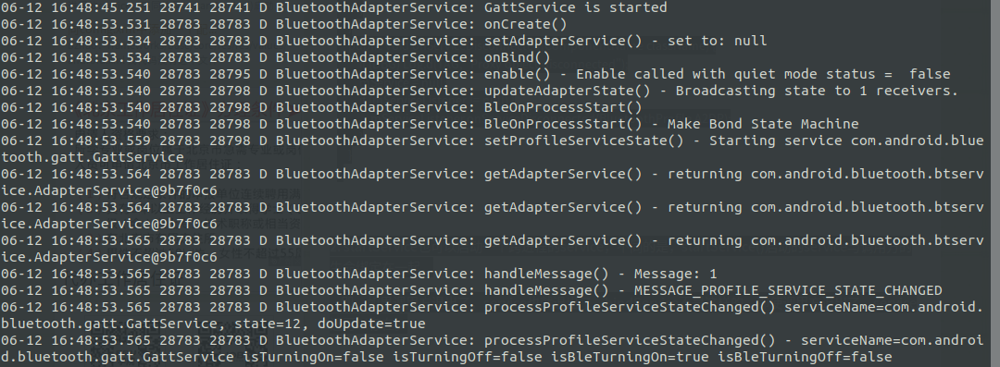

# android 系统蓝牙源码分析

## 1. 概述

Android平台的蓝牙技术是基于BlueZ实现的，BlueZ是通过Linux中的一套完整的蓝牙协议栈开源的实现。


在Android平台中，蓝牙系统从上到下主要包括：

1. java框架中的Bluetooth类、
2. Android适配库
3. blueZ库
4. 驱动程序和协议


## 2. framework层的蓝牙管理分析：

参考资料：https://www.cnblogs.com/MMLoveMeMM/articles/4087848.html

### 2.1 蓝牙服务的启动

在前面章节android启动过程中介绍到android服务的启动，init进程中，启动Zygote后，然后由SystemServer启动一系列服务，蓝牙服务就是在这个时候启动的。详细见代码：

/framework/base/services/java/com/android/server/SystemServer.java

```java
// startOtherServices [SystemServer]

// Skip Bluetooth if we have an emulator kernel
            // TODO: Use a more reliable check to see if this product should
            // support Bluetooth - see bug 988521
            if (isEmulator) {
                Slog.i(TAG, "No Bluetooth Service (emulator)");
            } else if (mFactoryTestMode == FactoryTest.FACTORY_TEST_LOW_LEVEL) {
                Slog.i(TAG, "No Bluetooth Service (factory test)");
            } else if (!context.getPackageManager().hasSystemFeature
                       (PackageManager.FEATURE_BLUETOOTH)) {
                Slog.i(TAG, "No Bluetooth Service (Bluetooth Hardware Not Present)");
            } else if (disableBluetooth) {
                Slog.i(TAG, "Bluetooth Service disabled by config");
            } else {
            	// 启动蓝牙服务
                mSystemServiceManager.startService(BluetoothService.class);
                // 这个里面 new BluetoothService() 并同时调用 onStart() 方法
            }    


if (context.getPackageManager().hasSystemFeature(PackageManager.FEATURE_WATCH)) {
            // 这个是启动穿戴设备的蓝牙服务
    		mSystemServiceManager.startService(WEAR_BLUETOOTH_SERVICE_CLASS);                                         
            mSystemServiceManager.startService(WEAR_WIFI_MEDIATOR_SERVICE_CLASS);
          if (!disableNonCoreServices) {                 
              mSystemServiceManager.startService(WEAR_TIME_SERVICE_CLASS);
          }
        }


// 先是这个
PHASE_SYSTEM_SERVICES_READY

// 后是这个
PHASE_ACTIVITY_MANAGER_READY
```

BluetoothService.java

```java
class BluetoothService extends SystemService {
    private BluetoothManagerService mBluetoothManagerService;

    public BluetoothService(Context context) {                                                                        
        super(context);
        mBluetoothManagerService = new BluetoothManagerService(context);
        // 发现这里  new BluetoothManagerService
    }
            
    @Override       
    public void onStart() {
    }       
        
    //  public static final String BLUETOOTH_MANAGER_SERVICE = "bluetooth_manager"
    @Override
    public void onBootPhase(int phase) {
        if (phase == SystemService.PHASE_SYSTEM_SERVICES_READY) {
            // 等到 其他系统服务都起来之后， 这里有注册了一个新的服务  BLUETOOTH_MANAGER_SERVICE
            publishBinderService(BluetoothAdapter.BLUETOOTH_MANAGER_SERVICE,
                    mBluetoothManagerService);
            
            // 当activity manager 准备好之后， 这里会被再次调用到
        } else if (phase == SystemService.PHASE_ACTIVITY_MANAGER_READY) {
            mBluetoothManagerService.handleOnBootPhase();// 分析这个
        }       
    }       
                
    @Override 
    public void onSwitchUser(int userHandle) {
        mBluetoothManagerService.handleOnSwitchUser(userHandle);
    }       
                
    @Override 
    public void onUnlockUser(int userHandle) {
        mBluetoothManagerService.handleOnUnlockUser(userHandle);
    }       
}           

```


BluetoothManagerService.java

```java
class BluetoothManagerService extends IBluetoothManager.Stub {                                              
    private static final String TAG = "BluetoothManagerService";
    
    
    
	public void handleOnBootPhase() {                                                                                 
        if (DBG) Slog.d(TAG, "Bluetooth boot completed");
        if (mEnableExternal && isBluetoothPersistedStateOnBluetooth()) {
            // 这个if 是不会执行到的
            if (DBG) Slog.d(TAG, "Auto-enabling Bluetooth.");
            sendEnableMsg(mQuietEnableExternal);
        } else if (!isNameAndAddressSet()) {
            // 走下面的
            if (DBG) Slog.d(TAG, "Getting adapter name and address");
            Message getMsg = mHandler.obtainMessage(MESSAGE_GET_NAME_AND_ADDRESS);
            mHandler.sendMessage(getMsg);
        }    
    }   
    
    
    
}
```

这里的 mHandler 

```java
// 构造函数中赋值的 
BluetoothManagerService(Context context) {
        mHandler = new BluetoothHandler(IoThread.get().getLooper()); 
 }
```

```java
private BluetoothServiceConnection mConnection = new BluetoothServiceConnection();

private class BluetoothHandler extends Handler {
        boolean mGetNameAddressOnly = false;

        public BluetoothHandler(Looper looper) {
            super(looper);
        }

        @Override
        public void handleMessage(Message msg) {
            if (DBG) Slog.d (TAG, "Message: " + msg.what);
            switch (msg.what) {
                case MESSAGE_GET_NAME_AND_ADDRESS:                                                                    
                    if ((mBluetooth == null) && (!mBinding)) {
                        mGetNameAddressOnly = true;
                            Message timeoutMsg = mHandler.obtainMessage(MESSAGE_TIMEOUT_BIND);                        
                            mHandler.sendMessageDelayed(timeoutMsg, TIMEOUT_BIND_MS);
                            Intent i = new Intent(IBluetooth.class.getName());
                        
                        // 1. 绑定服务
                        if (!doBind(i, mConnection,
                                Context.BIND_AUTO_CREATE | Context.BIND_IMPORTANT,
                                UserHandle.CURRENT)) {
                                mHandler.removeMessages(MESSAGE_TIMEOUT_BIND);
                            } else {
                                mBinding = true;
                            }

                    }
        	}
        
        }
            
            
  
 }
```

```java
// 1. 
boolean doBind(Intent intent, ServiceConnection conn, int flags, UserHandle user) {                               
        ComponentName comp = intent.resolveSystemService(mContext.getPackageManager(), 0);
        intent.setComponent(comp);
    
    	// internt中有包名字
    	// mContext.bindServiceAsUser 这是通过 AMS 找到服务， 属于应用层服务的范畴了
        if (comp == null || !mContext.bindServiceAsUser(intent, conn, flags, user)) {
            Slog.e(TAG, "Fail to bind to: " + intent);
            return false;
        }
        return true;
    }

```

这里bindServiceAsUser 走的是 应用层 server的范畴：

那如何去找到这个服务呢：这里有两个思路：

**思路一：**

这个是最快的，不过是根据思路二，反推出来的。属于正向思维。

```java
//BluetoothManagerService.java

import android.bluetooth.IBluetooth;

Intent i = new Intent(IBluetooth.class.getName());

mContext.bindServiceAsUser(intent, conn, flags, user)；
```

找到这里的 Intent 的值：

这里可以大胆的猜出 intent的值为 “android.bluetooth.IBluetooth”


然后在 AndroidManifest.xml 去搜索：


居然搜索到了： packages/apps/Bluetooth/AndroidManifest.xml:103


这样我们就找到了对应的类  .btservice.AdapterService 也就是AdapterService.java文件

这是正向的思路

**思路二：**

我也是凭借这种思路，找到的，然后在反推出的思路一：

首先，我觉得  android.bluetooth.IBluetooth 像是 跨进程通信的接口文件，所以这里应该去搜索 对应的 aidl文件


一看有，那一定out 目录下存在 对应的java文件


这里我就想，既然是个服务，肯定有人会继承 这个stub类：


```shell
packages/apps/Bluetooth/src/com/android/bluetooth/btservice/AdapterService.java:865:    private static class AdapterServiceBinder extends IBluetooth.Stub {
```

这里真的有，

然后我找到了这个 app对应的  AndroidManifest.xml ，果真找到了  android.bluetooth.IBluetooth，我就更加坚定我找的是对的。


#### 2.1.1 分析AdapterService

packages/apps/Bluetooth/src/com/android/bluetooth/btservice/AdapterService.java

```java
public class AdapterService extends Service {// 应用层框架中的服务
    public void onCreate() {
        super.onCreate();
        debugLog("onCreate()");
        mBinder = new AdapterServiceBinder(this);// 创建了IBinder
	}

	public IBinder onBind(Intent intent) {
        debugLog("onBind()");
        return mBinder;// 这个地方会将IBinder返回给 客户端
	}

	private AdapterServiceBinder mBinder;

	private static class AdapterServiceBinder extends IBluetooth.Stub {                                               
        private AdapterService mService;
	}
}
```

从这个简短的分析中，我们可以很清楚的看到  应用层框架中 Service的使用规范。

下面的这个日志是，出问题的板子的日志：



发现这个服务在不断的在重启


进程pid 在定时改变，而 kernel 4.14.15 中这个进程是不会死的。估计问题就出在这里了。

