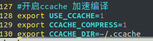
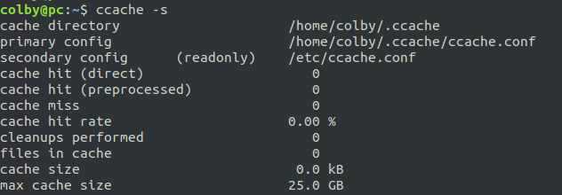

# ccache 加速编译

```
「华硕: 开启ccache
vim .bashrc and add below 3 lines to bottom
export USE_CCACHE=1
export CCACHE_COMPRESS=1
export CCACHE_DIR=/opt/ccache
设置ccache 大小
ccache -M 25G
查看设置是否成功
ccache -s」
—————————
```

```
「华硕: export CCACHE_DIR=/opt/ccache 可以自己定义，默认是.ccache」
```

我自己的配置：

.bashrc:



```shell
ccache -M 25G # 只需要设置一次即可 ，会将这个写在 
```


会写在这个配置文件中。

查看是否设置成功：

```shell
ccache -s
```



