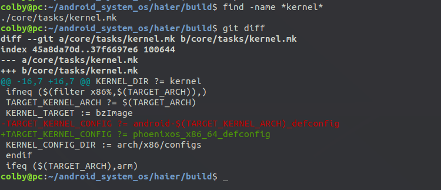
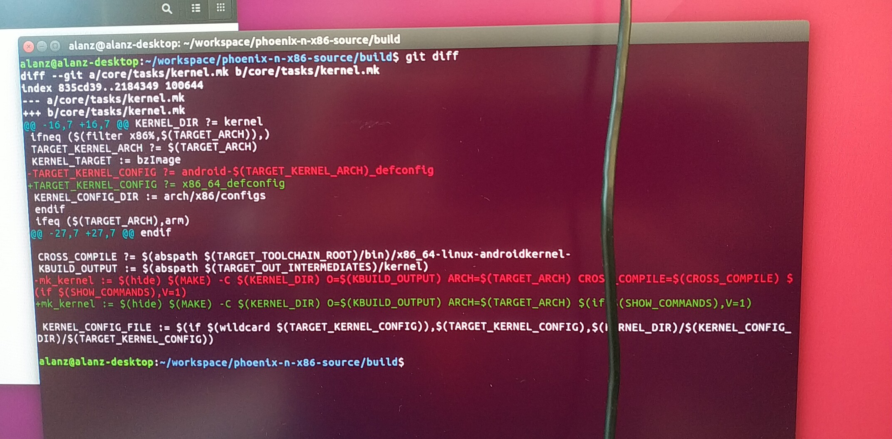
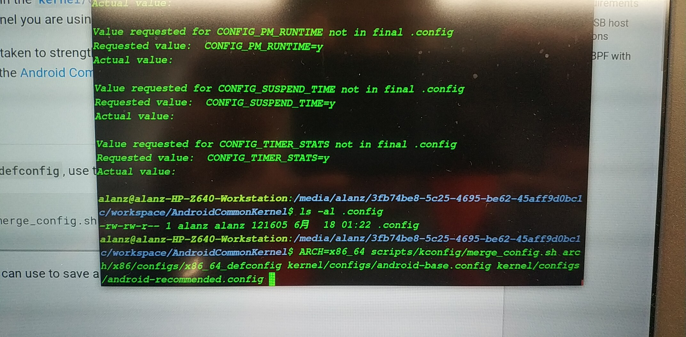
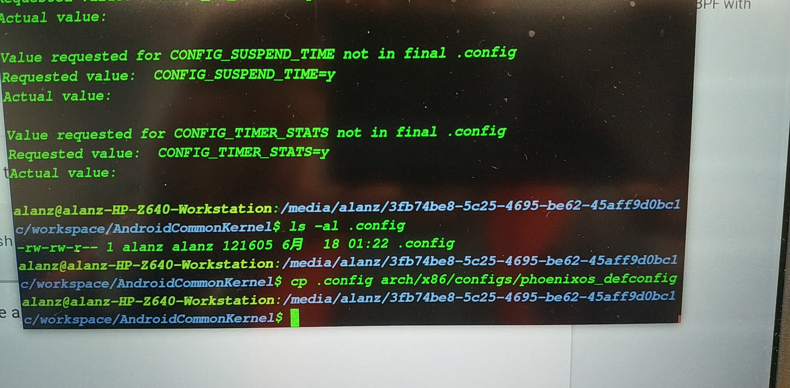
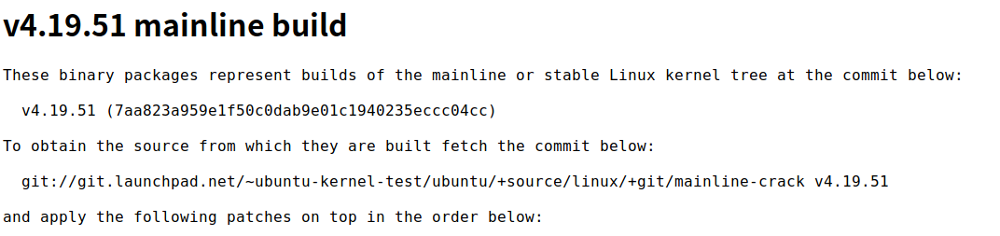
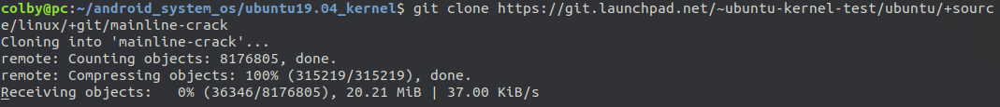
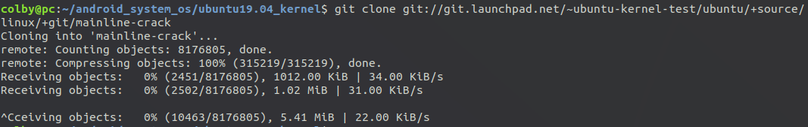

# merge config

```shell
haier/kernel$ ./scripts/kconfig/merge_config.sh -m ./android-x86_64_defconfig ./kernel/configs/android-base.config
```

解释如下

Using ./android-x86_64_defconfig as base
Merging ./kernel/configs/android-base.config

```shell
haier/kernel$ cp .config arch/x86/configs/phoenixos_x86_64_defconfig
```

# kernel 升级

参考这个文档：

https://source.android.google.cn/

googlesource 上kernel的代码

https://android.googlesource.com/kernel/common/

内核的配置

https://source.android.google.cn/devices/architecture/kernel/config


升级内核步骤记录如下：

1. 从googlesource中下载common的内核

```shell
git clone https://android.googlesource.com/kernel/common
git checkout android-4.19
```

make kernelversion 是4.19.51的内核

2. 将新kernel拷贝到 haier/kernel目录下
3. 生成.config文件

```shell
haier/kernel$ ./scripts/kconfig/merge_config.sh -m ./android-x86_64_defconfig ./kernel/configs/android-base.config

#此时会生成 .config文件

```

我们将这个.config 文件保存一份，

```shell
haier/kernel$ cp .config arch/x86/configs/phoenixos_x86_64_defconfig
```

这个就是此次我们的配置

4. 修改build



alan给的修改方案



此时就可以编译了，此时就可以编译通过了，

其中有个错，不详细记录了，

在链接vmlinux的时候，会报一个 ld 选项的错误

```shell
grep -inR "discard-none" --include=Makefile
# 找到这个选项，将这个删除即可 
```


alan:指导的：

生成config配置文件：

```shell
ARCH=x86_64 scripts/kconfig/merge_config.sh arch/x86/configs/x86_64_defconfig kernel/configs/android-base.config kernel/configs/android-recommended.config

cp .config ../../haier/kernel/arch/x86/configs/phoenixos_x86_64_defconfig
```





根据alan指导后生成的配置，报下面的错

报错二

building kernel with non-retpoline compiler

Please update your compiler.

修改方案：

```shell
mk_kernel := $(hide) $(MAKE) -C $(KERNEL_DIR) O=$(KBUILD_OUTPUT) ARCH=$(TARGET_ARCH) CROSS_COMPILE="$(abspath $(CC_WRAPPER)) $(CROSS_COMPILE)" $(if $(SHOW_COMMANDS),V=1)  
```

改成

```shell
mk_kernel := $(hide) $(MAKE) -C $(KERNEL_DIR) O=$(KBUILD_OUTPUT) ARCH=$(TARGET_ARCH)  $(if $(SHOW_COMMANDS),V=1)  
```

# 换ubuntu19.04 的kernel

url:

https://wiki.ubuntu.com/Kernel/MainlineBuilds

<http://kernel.ubuntu.com/~kernel-ppa/mainline/?C=N;O=D>

https://kernel.ubuntu.com/%7Ekernel-ppa/mainline/v4.19.51/



```shell
git clone git://git.launchpad.net/~ubuntu-kernel-test/ubuntu/+source/linux/+git/mainline-crack
```

或者是这样，也是可以的：






```
「Alan Zhang: Ubuntu Mainline kernel, @文正, you need to "git tag -a" to see the 4.19.51 rev, then checkout, then apply the patches, and build.链接: https://pan.baidu.com/s/1-qdexlB2oHbvvusY5JeZPg 提取码: 4d5f 」
```

ubuntu 的编译指令：

```shell
make ARCH=x86 CROSS_COMPILE= KERNELVERSION=4.19.51-041951-generic CONFIG_DEBUG_SECTION_MISMATCH=y KBUILD_BUILD_VERSION="201906151031" LOCALVERSION= localver-extra= CFLAGS_MODULE="-DPKG_ABI=041951" O=/home/kernel/COD/linux/debian/build/build-generic -j1 syncconfig prepare scripts
```

## 内核制作deb包

http://blog.chinaunix.net/uid-26826958-id-3282945.html

