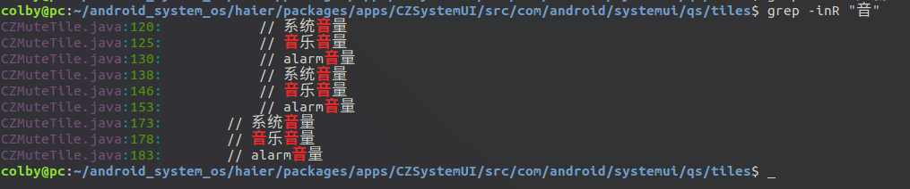
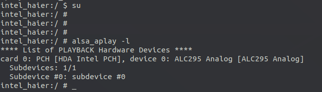
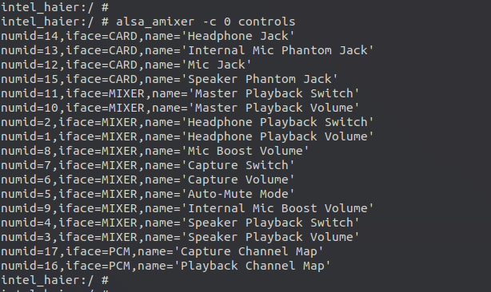
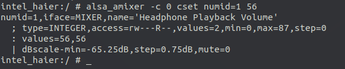
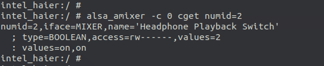
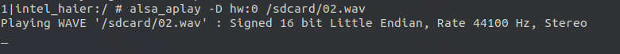
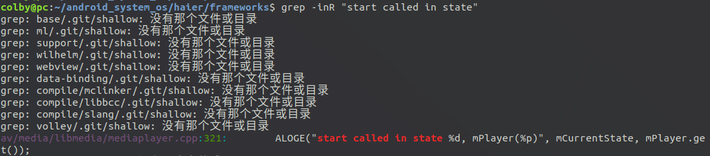
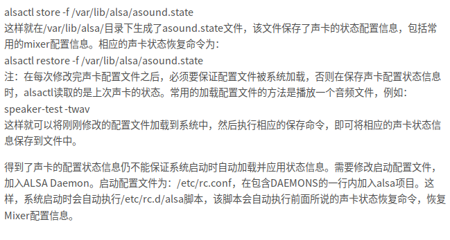

# 音量调节

## 1. shell 准备

```shell
adb connect 192.168.1.19; adb shell
```


对于凤凰系统， HDMI audio
无声的问题，从我的调研结果上看，不是kernel的问题，也不是驱动问题，应该是alsa_amixer参数设置的问题，或者说是声道选择问题，具体分析如下.

1. 在目前的4.14内核的凤凰系统上，有两个重要的pcm设备: 查看 ls /dev/snd/  --> 
pcmC0D0p （笔记本内部扬声器输出）和 pcmC0D3p（这个是HDMI输出）
2. 在命令行下播放声音文件: alsa_aplay -D hw:0,3
/sdcard/02.wav  HDMI声音输出是正常的,
所以驱动什么的应该都是好的。
3. 只要在连接HDMI的时候，切换到相应的audio输出就好。实际操作的时候有可能会遇到各种坑, 也请开发同学评估一下。

设置默认声卡：

http://blog.chinaunix.net/uid-27875-id-5729990.html

调节音量：

https://blog.csdn.net/liuxd3000/article/details/40650349

理解和使用Alsa的配置文件：

https://blog.csdn.net/colorant/article/details/2598815

代码的起始位置：

```
「Jeffzhou: phoenix-n-x86/packages/apps/CZSystemUI/src/com/android/systemui/qs/tiles」
—————————
```

在这个目录下面的 带有CZ的字样的文件：



查看有几个声卡：



由于我的codec 为alc295,所以
从上面得知alc295挂在card0上，所以以后我们当配置amixer 时就-c 0 就对了

列出card0上的控制方法：



```shell
numid=14,iface=CARD,name='Headphone Jack' # 耳机插孔
numid=13,iface=CARD,name='Internal Mic Phantom Jack' # 内置麦克风幻影插孔
numid=12,iface=CARD,name='Mic Jack' # 麦克风插孔
numid=15,iface=CARD,name='Speaker Phantom Jack' # 扬声器幻影插孔
numid=11,iface=MIXER,name='Master Playback Switch'
numid=10,iface=MIXER,name='Master Playback Volume' # 主播放音量
numid=2,iface=MIXER,name='Headphone Playback Switch'
numid=1,iface=MIXER,name='Headphone Playback Volume' # 耳机播放音量
numid=8,iface=MIXER,name='Mic Boost Volume' # 麦克风增强音量
numid=7,iface=MIXER,name='Capture Switch'
numid=6,iface=MIXER,name='Capture Volume' # 捕获音量
numid=5,iface=MIXER,name='Auto-Mute Mode' # 自动静音模式
numid=9,iface=MIXER,name='Internal Mic Boost Volume' # 内置 麦克风增强音量
numid=4,iface=MIXER,name='Speaker Playback Switch'
numid=3,iface=MIXER,name='Speaker Playback Volume' # 扬声器播放音量
numid=17,iface=PCM,name='Capture Channel Map'
numid=16,iface=PCM,name='Playback Channel Map' # 播放频道
```

设置耳机的音量：





## 2.alsa 音频路径的问题

https://blog.csdn.net/lininglive/article/details/52152164

下面的两个命令都可以播放音乐：





log 打印：

```shell
intel_haier:/system/etc # logcat "*:E"

06-18 15:51:00.871  2402  2402 E MediaPlayer: start called in state 0, mPlayer(0x73c925bfe740)
06-18 15:51:00.871  2402  2402 E MediaPlayer: error (-38, 0)
06-18 15:51:00.871  2402  2402 E MediaPlayer: Error (-38,0)
```



av/media/libmedia/mediaplayer.cpp:321

```shell

```

hi ,alan ,有个问题想请教一下，hp (kernel 4.19.15)中，扬声器 不能使用的问题。现象是， 插入耳机 是有声音的，  拔掉 耳机后 扬声器无声音。ubuntu 19.04 中的表现和我上述 一致。 Alsa.conf 中默认配置使用的声卡是 0 设备也为0。


## 3.论坛资料：

https://flaterco.com/kb/Android-x86.html

https://source.android.com/devices/audio/debugging

https://www.android-x86.org/

https://blog.csdn.net/lile777/article/details/62428473

adb connect 192.168.1.61



