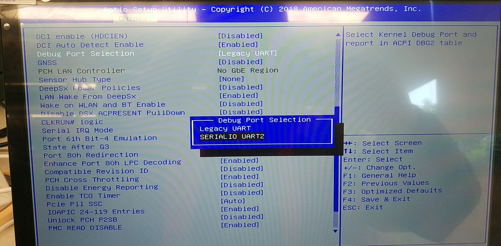

# 内核传参-串口配置

## 1. 参考资料

https://www.cnblogs.com/linuxbo/p/4286227.html

https://blog.csdn.net/exbob/article/details/6626654

## 2. 在bios中配置串口

要想内核可以成功的在启动阶段向串口输出打印信息。 就首先得保证  在BIOS中配置了 串口调试

然后在 内核传参中 添加 console=ttyUSB0,115200n 这样才能正确的打印出信息。

