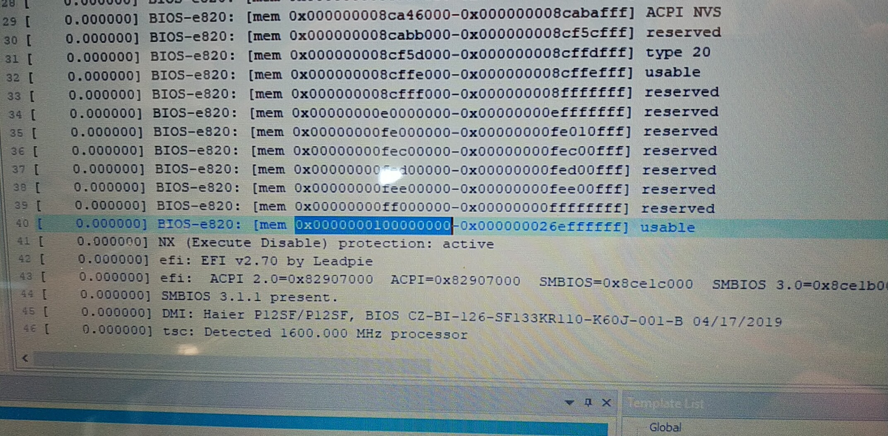

# Linux Pstore 简介

```
「华硕: 对于串口log， 之前在台电的项目上，也遇到类似的困难，也是没办法连接串口。最后是从 /sys/fs/pstore/ 读的offline的log， 」
—————————
```


主要用于存储内核异常时的log信息。实现方式是，管理一块“非易失性的存储空间”，如不断电的RAM或外部存储，当系统异常时，将log信息写到Pstore管理的存储空间，直到下一次系统正常时，在将log读出来，以文件形式提供给用户使用。


   模块代码主要在 kernel/fs/pstore 下。

      由四部分组成：
          一个核心组件：pstore
                        源码：platform.c inode.c
    
          三个功能组件：
                  ftrace     : ftrace.c
                  pmsg     : pmsg.c
                  ramoops: ram_core.c
    
        注册ramoops驱动：ram.c
        注册ramoops设备：客制化


  参考文档：

      [1] kernel/Documentation/ramoops.txt 
    
      [2] http://blog.csdn.net/zangdongming/article/details/37729315
    
      [3] http://blog.51cto.com/xiamachao/1872790
    
      [4] Documentation/ABI/testing/pstore
    
      [5] http://blog.csdn.net/ldinvicible/article/details/51789041


alan 指导：



```
「Alan Zhang: @文正 这个e820表的启示地址是你设置pstore start addr.」
—————————
```

```
「Alan Zhang: @文正 128MByte ok.」
—————————
```

由于HP 的电脑 休眠唤醒后，屏幕启动不起来，  用 pstore 查问题意义不大，这里暂时先不用这种方式

```
「Alan Zhang: @文正 @华硕 一定要接串口才能看到为何Intel的GPU驱动无法工作。pstore不适合这个case。pstore必须要能从新进系统才能看到问题。不要试了。」
—————————
```

