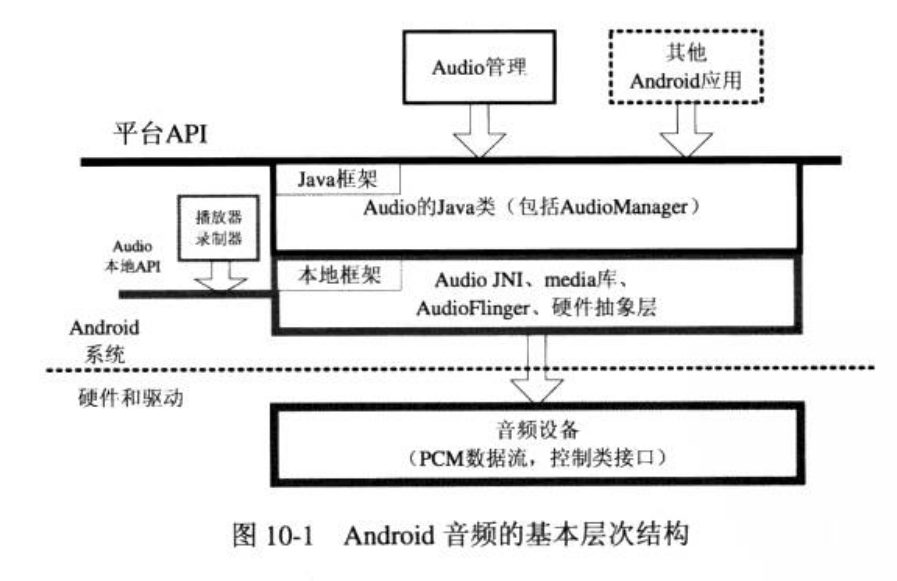
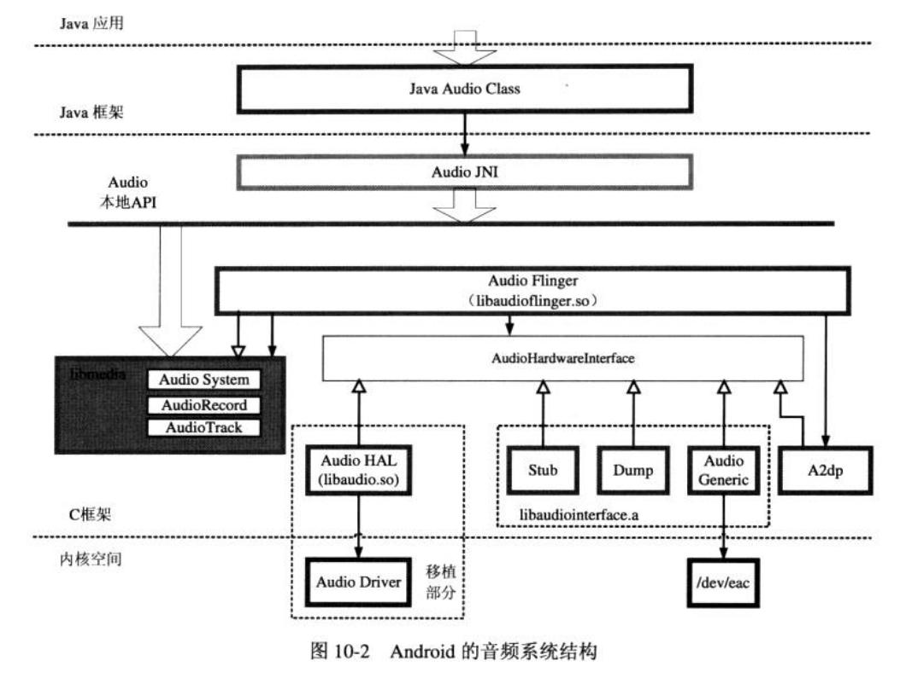
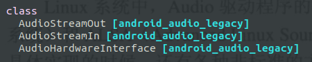

# android-音频系统分析

## 1. 概述：



音频系统对上层的接口包括数据流接口和控制接口，这些接口在本地层和java层均有提供。

在java层虽然也可以进行数据流的操作，但是通常在java层只是进行控制类的操作，数据流的操作大都通过本地接口进行。



**移植的内容：**

​		在Android系统中， audio标准化部分是硬件抽象层的接口，因此针对特定的平台，audio系统的移植包括：audio驱动程序和audio硬件抽象层。

​		audio驱动程序需要在linux内核中实现，虽然实现方式各异，然而在通常的情况下，audio的驱动程序都需要提供用于音量控制等的控制类接口，由于PCM输入、输出的数据类接口。

​		audio硬件抽象层是audio驱动程序和audio本地框架类AudioFlinger的接口。根据Android系统的接口定义，audio硬件抽象层是c++类的接口，实现audio硬件抽象层需要继承接口中定义的三个类，分别用于总控、输出和输入。


## 2. 移植和调试要点：

### 2.1 驱动：

audio 驱动程序的框架有标准的OSS和ALSA 两种框架。

但是各种不同的audio驱动程序的功能大同小异，基本都需要包含一下两个方面的功能。

- 控制接口： 音量控制、静音、通道控制等功能。
- 数据接口：需要支持PCM（脉冲编码调制）类型的输入和输出。

### 2.2 硬件抽象层的内容：

**硬件抽象层的接口文件：**

```shell
haier/hardware$ find -name AudioHardwareInterface.h
./libhardware_legacy/include/hardware_legacy/AudioHardwareInterface.h
```




