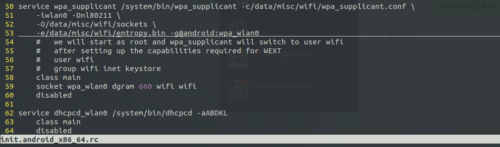
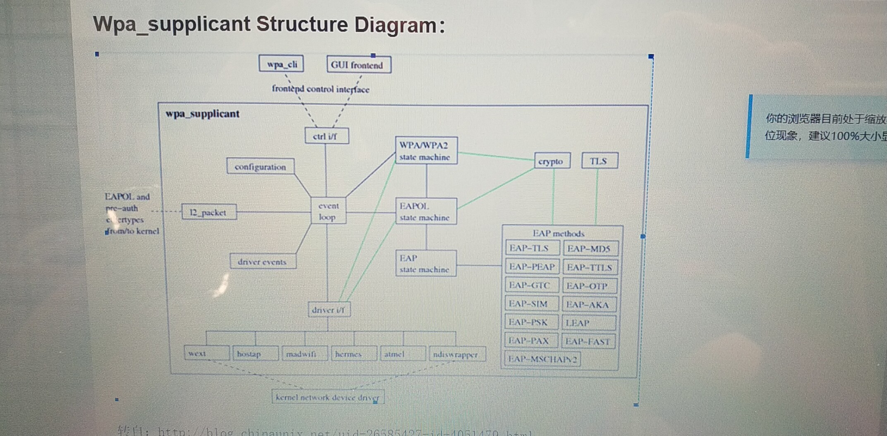
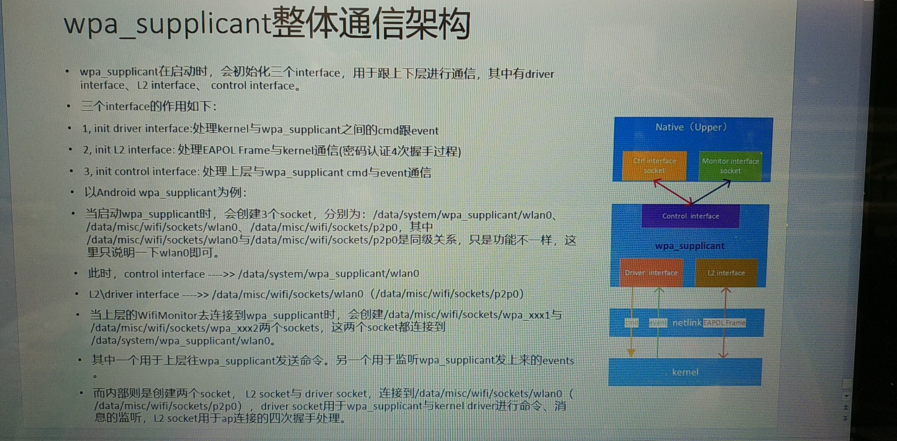

# hp-wifi-bt


目前的状态是，从休眠和唤醒中判断， wifi 和 bt 驱动似乎是工作正常的。有可能是selinux检查不通过，而导致的wifi和bt不能使用。

wifi 和 bt  : wifi 和 蓝牙



```shell
wpa_supplicant  -c/system/etc/wifi/wpa_supplicant.conf -iwlan0 -Dnl80211 -O/data/misc/wifi/sockets -e/data/misc/wifi/entropy.bin -g@android:wpa_wlan0
```


## wifi 驱动分析：

probe->rtw_drv_init -> rtw_pci_primary_adapter_init -> rtw_set_hal_ops -> rtl8821ce_set_hal_ops ->  rtl8821ce_init_bd

驱动的入口：pci_intf.c

haier/kernel/drivers/net/wireless/rtl8821ce$ find -name pci_intf.c
./os_dep/linux/pci_intf.c

```c
module_init(rtw_drv_entry);// 1.
```

```c
static int __init rtw_drv_entry(void)
{
    int ret = 0; 
    pci_drvpriv.drv_registered = _TRUE;
    rtw_drv_proc_init();
    rtw_ndev_notifier_register();

    ret = pci_register_driver(&pci_drvpriv.rtw_pci_drv);// 2. 

    return ret; 
}
```

```c
// 2.1 
struct pci_drv_priv {
    struct pci_driver rtw_pci_drv;
    int drv_registered;
};


static struct pci_drv_priv pci_drvpriv = {
    .rtw_pci_drv.name = (char *)DRV_NAME,
    .rtw_pci_drv.probe = rtw_drv_init,// 2.2
    .rtw_pci_drv.remove = rtw_dev_remove,
    .rtw_pci_drv.shutdown = rtw_dev_remove,                                                                           
    .rtw_pci_drv.id_table = rtw_pci_id_tbl,
#ifdef CONFIG_PM
    .rtw_pci_drv.suspend = rtw_pci_suspend,
    .rtw_pci_drv.resume = rtw_pci_resume,
#endif
};
```

```c
// 2.2
static int rtw_drv_init(struct pci_dev *pdev, const struct pci_device_id *pdid)
{
    for (i = 0; i < padapter->registrypriv.virtual_iface_num; i++) {
        // 3. 
        if (rtw_drv_add_vir_if(padapter, pci_set_intf_ops) == NULL) { // 这个地方有注册wlan0                                                
            RTW_INFO("rtw_drv_add_iface failed! (%d)\n", i);
            goto free_if_vir;
        }
    }
    
    /* dev_alloc_name && register_netdev */
    if (rtw_os_ndevs_init(dvobj) != _SUCCESS) // 3.             
        goto free_if_vir;
}
```

```c
static void rtw_hook_vir_if_ops(struct net_device *ndev)
{
    if (loadparam(padapter) != _SUCCESS);
}

uint loadparam(_adapter *padapter)                            
{
    snprintf(registry_par->ifname, 16, "%s", ifname);
}

char *ifname = "wlan%d";                     
module_param(ifname, charp, 0644);
```

```c
// 3.
int rtw_os_ndevs_init(struct dvobj_priv *dvobj)
{   
    int ret = _FAIL;
    
    if (rtw_os_ndevs_alloc(dvobj) != _SUCCESS)                                                                        
        goto exit;
    
    if (rtw_os_ndevs_register(dvobj) != _SUCCESS)// 4.
        goto os_ndevs_free;
     
    ret = _SUCCESS;
    
os_ndevs_free:
    if (ret != _SUCCESS)
        rtw_os_ndevs_free(dvobj);
exit:
    return ret;
}
```

```c
// 4. 
int rtw_os_ndevs_register(struct dvobj_priv *dvobj)
{
    if (adapter->iface_id == IFACE_ID0)
                name = regsty->ifname;
    
    status = rtw_os_ndev_register(adapter, name);// 5. 
}
```

```c
// 5. 
int rtw_os_ndev_register(_adapter *adapter, const char *name)
{
    /* alloc netdev name */                
    rtw_init_netdev_name(ndev, name);
    
    register_netdev(ndev);// 6. 
}
```


参考资料：

【1】https://blog.csdn.net/lbaihao/article/details/73250798

【2】https://blog.csdn.net/qq_27977257/article/details/53581386

【3】https://blog.csdn.net/zqixiao_09/article/details/51105877

【4】https://www.xuebuyuan.com/3253492.html

使用NL80211的工具通过一个特殊的socket( Netlink技术)和驱动打通信，典型工具包括IW、iwconfig等


nl80211接口逐渐替代wext接口的原因主要是使用netlink技术在应用层和内核层数据交换上相比ioctl方式具有优势。 Netlink 是一种在内核与用户应用间进行双向数据传输的非常好的方式，用户态应用使用标准的 socket API 就可以使用 netlink 提供的强大功能，内核态需要使用专门的内核 API 来使用 netlink。

## netlink 分析

### kernel层

```shell
haier/kernel/drivers/net/wireless/rtl8821ce$ grep -inR "sock_create"

os_dep/linux/os_intfs.c:3339:	err = sock_create(AF_NETLINK, SOCK_DGRAM, NETLINK_ROUTE, &sock);
```


kernel 和app 层得有同样的， NETLINK_ROUTE

```c
#define NETLINK_ROUTE       0   /* Routing/device hook              */
```

### APP层

```c
static int wpas_ctrl_iface_open_sock(struct wpa_supplicant *wpa_s,struct ctrl_iface_priv *priv)
{
    priv->sock = android_get_control_socket(addr.sun_path);
}
```

## wpa_

alan 给的指导：





