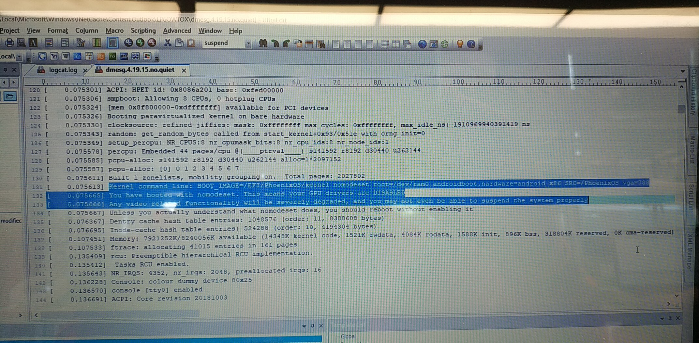

# hp-休眠后无法唤醒

## 1. 问题定位：

现象：

	1. echo mem > /sys/power/state  # 进入休眠
 	2. 此时电源灯忽明忽暗， adb 无法使用
 	3. 点击或者手动按电源灯
 	4. 此时 电源灯常亮，adb 可以正常使用

根据此现象，我们知道， 我们的kernel可以正常的唤醒，

但是此时我们的屏幕还是黑的。

131 [    0.075613] Kernel command line: BOOT_IMAGE=/EFI/PhoenixOS/kernel nomodeset root=/dev/ram0 androidboot.hardware=android_x86 SRC=/PhoenixOS vga=788

 132 [    0.075665] You have booted with nomodeset. This means your GPU drivers are DISABLED

从中，我们发现 我们配置的 这个内核启动参数 nomodeset 参数，意味者 GPU的驱动是不能正常使用的。

屏幕是黑的， 是不是有可能 和 gpu 没有起来有很大的关系。

暂时留个 疑问在这里？ 