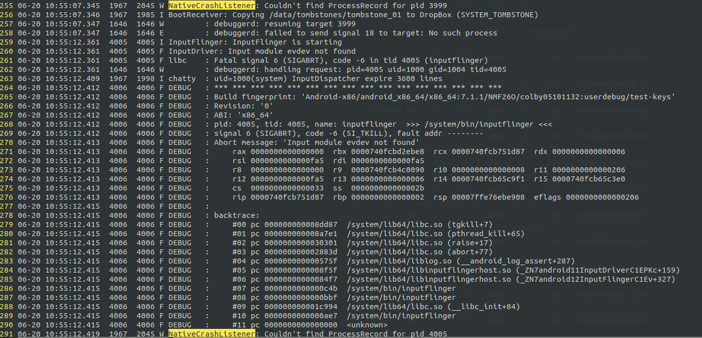
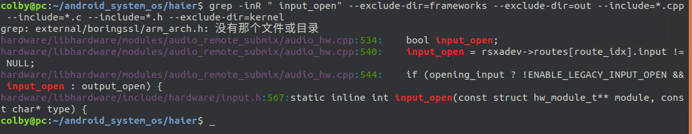
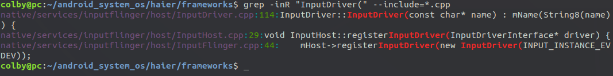
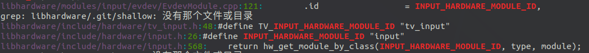
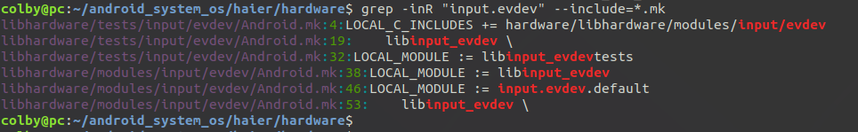
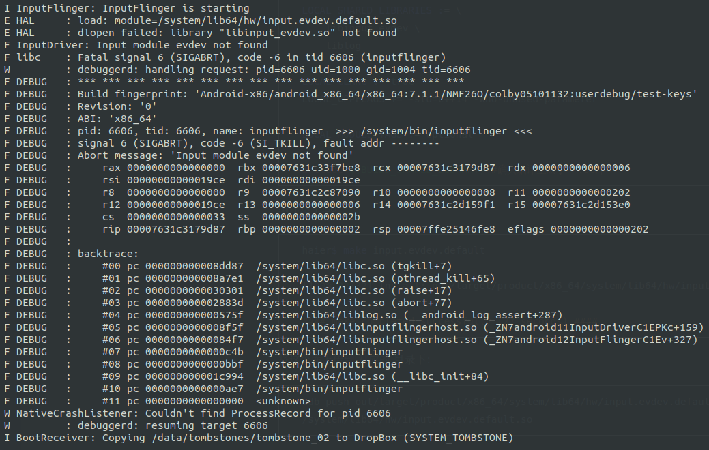

# inputflinger 报错修复

## 1. 报错分析

报错的内容：

```shell
06-20 10:54:46.996  3975  3975 I InputFlinger: InputFlinger is starting                                   
06-20 10:54:46.996  1967  1998 I chatty  : uid=1000(system) InputDispatcher expire 3600 lines                         
06-20 10:54:46.996  3975  3975 F InputDriver: Input module evdev not found                                    
06-20 10:54:46.996  3975  3975 F libc    : Fatal signal 6 (SIGABRT), code -6 in tid 3975 (inputflinger)  
06-20 10:54:46.996  1646  1646 W         : debuggerd: handling request: pid=3975 uid=1000 gid=1004 tid=3975           
06-20 10:54:47.048  3976  3976 F DEBUG   : *** *** *** *** *** *** *** *** *** *** *** *** *** *** *** ***     
06-20 10:54:47.048  3976  3976 F DEBUG   : Build fingerprint: 'Android-x86/android_x86_64/x86_64:7.1.1/NMF26O/colby051
06-20 10:54:47.048  3976  3976 F DEBUG   : Revision: '0'                                                              
06-20 10:54:47.048  3976  3976 F DEBUG   : ABI: 'x86_64'                                                              
06-20 10:54:47.048  3976  3976 F DEBUG   : pid: 3975, tid: 3975, name: inputflinger  >>> /system/bin/inputflinger <<< 
06-20 10:54:47.048  3976  3976 F DEBUG   : signal 6 (SIGABRT), code -6 (SI_TKILL), fault addr --------                
06-20 10:54:47.048  3976  3976 F DEBUG   : Abort message: 'Input module evdev not found'                  
06-20 10:54:47.048  3976  3976 F DEBUG   :     rax 0000000000000000  rbx 0000749f99b40be8  rcx 0000749f9948dd87  rdx 0
06-20 10:54:47.048  3976  3976 F DEBUG   :     rsi 0000000000000f87  rdi 0000000000000f87                      
06-20 10:54:47.048  3976  3976 F DEBUG   :     r8  0000000000000000  r9  0000749f992d2090  r10 0000000000000008  r11 0
06-20 10:54:47.048  3976  3976 F DEBUG   :     r12 0000000000000f87  r13 0000000000000006  r14 0000749f993fa9f1  r15 0
06-20 10:54:47.048  3976  3976 F DEBUG   :     cs  0000000000000033  ss  000000000000002b                             
06-20 10:54:47.048  3976  3976 F DEBUG   :     rip 0000749f9948dd87  rbp 0000000000000002  rsp 00007ffd4e49cd48  eflag
06-20 10:54:47.049  3976  3976 F DEBUG   :                                                                            
06-20 10:54:47.049  3976  3976 F DEBUG   : backtrace:                                                                 
06-20 10:54:47.049  3976  3976 F DEBUG   :     #00 pc 000000000008dd87  /system/lib64/libc.so (tgkill+7)              
06-20 10:54:47.049  3976  3976 F DEBUG   :     #01 pc 000000000008a7e1  /system/lib64/libc.so (pthread_kill+65)       
06-20 10:54:47.049  3976  3976 F DEBUG   :     #02 pc 0000000000030301  /system/lib64/libc.so (raise+17)
06-20 10:54:47.049  3976  3976 F DEBUG   :     #03 pc 000000000002883d  /system/lib64/libc.so (abort+77)              
06-20 10:54:47.049  3976  3976 F DEBUG   :     #04 pc 000000000000575f  /system/lib64/liblog.so (__android_log_assert+
06-20 10:54:47.049  3976  3976 F DEBUG   :     #05 pc 0000000000008f5f  /system/lib64/libinputflingerhost.so (_ZN7andr
06-20 10:54:47.049  3976  3976 F DEBUG   :     #06 pc 00000000000084f7  /system/lib64/libinputflingerhost.so (_ZN7andr
06-20 10:54:47.049  3976  3976 F DEBUG   :     #07 pc 0000000000000c4b  /system/bin/inputflinger                      
06-20 10:54:47.049  3976  3976 F DEBUG   :     #08 pc 0000000000000bbf  /system/bin/inputflinger                      
06-20 10:54:47.049  3976  3976 F DEBUG   :     #09 pc 000000000001c994  /system/lib64/libc.so (__libc_init+84)        
06-20 10:54:47.049  3976  3976 F DEBUG   :     #10 pc 0000000000000ae7  /system/bin/inputflinger
```



这个是调用的顺序：

out/target/product/x86_64/symbols$ addr2line -e ./system/bin/inputflinger 0000000000000ae7
frameworks/native/services/inputflinger/host/main.cpp:?

out/target/product/x86_64/symbols$ addr2line -e ./system/lib64/libc.so 000000000001c994
bionic/libc/bionic/libc_init_dynamic.cpp:109

out/target/product/x86_64/symbols$ addr2line -e ./system/bin/inputflinger 0000000000000bbf
/proc/self/cwd/frameworks/native/include/binder/BinderService.h:45

out/target/product/x86_64/symbols$ addr2line -e ./system/bin/inputflinger 0000000000000c4b
/proc/self/cwd/frameworks/native/include/binder/BinderService.h:41 (discriminator 1)

out/target/product/x86_64/symbols$ addr2line -e ./system/lib64/libinputflingerhost.so 00000000000084f7
/proc/self/cwd/frameworks/native/services/inputflinger/host/InputFlinger.cpp:44 (discriminator 5)

out/target/product/x86_64/symbols$ addr2line -e ./system/lib64/libinputflingerhost.so 0000000000008f5f
/proc/self/cwd/frameworks/native/services/inputflinger/host/InputDriver.cpp:117 (discriminator 4)

out/target/product/x86_64/symbols$ addr2line -e ./system/lib64/liblog.so 000000000000575f
/proc/self/cwd/system/core/liblog/logger_write.c:489


错误的函数调用链如下：

main() ->  __libc_init() -> exit() -> publish(allowIsolated); -> mHost->registerInputDriver()

-> LOG_ALWAYS_FATAL_IF(err != 0, "Input module %s not found", name); ->  __android_log_assert()

-> abort();


出错的点在：

haier$ vim frameworks/native/services/inputflinger/host/InputDriver.cpp +117中

```c
InputDriver::InputDriver(const char* name) : mName(String8(name)) {
    const hw_module_t* module;
    int err = input_open(&module, name);
    LOG_ALWAYS_FATAL_IF(err != 0, "Input module %s not found", name);       // 在这个地方抛出来的 abort;                                          
    mHal = reinterpret_cast<const input_module_t*>(module);
}

```




haier$ vim hardware/libhardware/include/hardware/input.h +567

```c
static inline int input_open(const struct hw_module_t** module, const char* type) {                                   
    return hw_get_module_by_class(INPUT_HARDWARE_MODULE_ID, type, module);// 1.
}
```

这里的InputDriver 是一个构造函数， 这个构造函数是谁调用的呢？



native/services/inputflinger/host/InputFlinger.cpp:44

```c
InputFlinger::InputFlinger() :
    BnInputFlinger() {
    ALOGI("InputFlinger is starting");
    mHost = new InputHost();
    mHost->registerInputDriver(new InputDriver(INPUT_INSTANCE_EVDEV));
}
```

hw_get_module_by_class 都干了些啥事：
colby@pc:~/android_system_os/haier/hardware$ vim libhardware/modules/input/evdev/EvdevModule.cpp +121




```c
// 1.  class_id = "input"  ; inst = "evdev"
int hw_get_module_by_class(const char *class_id, const char *inst,
                           const struct hw_module_t **module)
{
    int i = 0;
    char prop[PATH_MAX] = {0};
    char path[PATH_MAX] = {0};
    char name[PATH_MAX] = {0};
    char prop_name[PATH_MAX] = {0};


    if (inst)
        snprintf(name, PATH_MAX, "%s.%s", class_id, inst);// name = "input.evdev"
    else
        strlcpy(name, class_id, PATH_MAX);

    snprintf(prop_name, sizeof(prop_name), "ro.hardware.%s", name);// prop_name = "ro.hardware.input.evdev"
    if (property_get(prop_name, prop, NULL) > 0) {// 由于没有这个属性，这里不走 
        if (hw_module_exists(path, sizeof(path), name, prop) == 0) {
            goto found;
        }
    }

    for (i=0 ; i<HAL_VARIANT_KEYS_COUNT; i++) {
        if (property_get(variant_keys[i], prop, NULL) == 0) {// 1. 
            continue;
        }
        if (hw_module_exists(path, sizeof(path), name, prop) == 0) {// 2. 
            goto found;
        }
    }

    if (hw_module_exists(path, sizeof(path), name, "default") == 0) {
        goto found;
    }

    return -ENOENT;

found:
    /* load the module, if this fails, we're doomed, and we should not try
     * to load a different variant. */
    return load(class_id, path, module);
}

```

```c
static const char *variant_keys[] = {             
    "ro.hardware", 
    "ro.product.board",
    "ro.board.platform",
    "ro.arch"
};

```

```shell
# 1. 

intel_haier:/ # getprop | grep "ro.hardware"                                 
[ro.hardware]: [android_x86_64]

intel_haier:/ # getprop | grep "ro.product.board"                              
[ro.product.board]: []

intel_haier:/ # getprop | grep "ro.board.platform"                             
[ro.board.platform]: [android-x86]

intel_haier:/ # getprop | grep "ro.arch"                                       
[ro.arch]: [x86]
```

```c
// 2. 
// name = "input.evdev" 
// subname : 
//			1. android_x86_64
//			2. android-x86
//			3. x86

#define HAL_LIBRARY_PATH1 "/system/lib64/hw"
#define HAL_LIBRARY_PATH2 "/vendor/lib64/hw"
#define HAL_LIBRARY_PATH3 "/odm/lib64/hw"

static int hw_module_exists(char *path, size_t path_len, const char *name,const char *subname)
{
    snprintf(path, path_len, "%s/%s.%s.so",
             HAL_LIBRARY_PATH3, name, subname);
    if (access(path, R_OK) == 0)
        return 0;

    snprintf(path, path_len, "%s/%s.%s.so",
             HAL_LIBRARY_PATH2, name, subname);
    if (access(path, R_OK) == 0)
        return 0;

    snprintf(path, path_len, "%s/%s.%s.so",
             HAL_LIBRARY_PATH1, name, subname);
    if (access(path, R_OK) == 0)
        return 0;

    return -ENOENT;
}
```

这里分情况讨论：

库的名字有：

input.evdev.android_x86_64.so

input.evdev.android-x86.so

input.evdev.x86.so

查找目录的顺序是：

/odm/lib64/hw

/vendor/lib64/hw

/system/lib64/hw

通过在 kernel 4.14.15 中的系统中查找，并没有找到 如上所说的.so库

查找源码，看有没有 对应的库：



libhardware/modules/input/evdev/Android.mk:46:LOCAL_MODULE := input.evdev.default

这里发现了 input.evdev.default

```makefile
LOCAL_MODULE := input.evdev.default
LOCAL_MODULE_RELATIVE_PATH := hw

LOCAL_SRC_FILES := \                                                                                                  
    EvdevModule.cpp

LOCAL_SHARED_LIBRARIES := \
    libinput_evdev \
    liblog

LOCAL_CLANG := true
LOCAL_CPPFLAGS += -std=c++14 -Wno-unused-parameter

LOCAL_MODULE_TAGS := optional

include $(BUILD_SHARED_LIBRARY) #确实编译生成了 *.so库
```

编译这个.so

```shell
haier$ make input.evdev.default

[100% 32/32] Install: out/target/product/x86_64/system/lib64/hw/input.evdev.default.so

#### make completed successfully (27 seconds) ####
```

将这个库上传到 对应的 目录下：

```shell
adb push out/target/product/x86_64/system/lib64/hw/input.evdev.default.so /system/lib64/hw/input.evdev.default.so
```


将这个库传递上去后，发现新的报错出来了：



```shell

06-20 14:32:04.145  6606  6606 I InputFlinger: InputFlinger is starting

06-20 14:32:04.145  6606  6606 E HAL     : load: module=/system/lib64/hw/input.evdev.default.so

06-20 14:32:04.145  6606  6606 E HAL     : dlopen failed: library "libinput_evdev.so" not found

06-20 14:32:04.145  6606  6606 F InputDriver: Input module evdev not found
```

看见此时少  libinput_evdev.so 文件：

此时编译 libinput_evdev 然后上传即可。

```shell
make libinput_evdev
```


## 2. 解决方案

```shell
make input.evdev.default
adb push out/target/product/x86_64/system/lib64/hw/input.evdev.default.so /system/lib64/hw/input.evdev.default.so

make libinput_evdev
adb push out/target/product/x86_64/system/lib64/libinput_evdev.so /system/lib64/libinput_evdev.so
```


最终的编译方案是：

```shell
. ./build/envsetup.sh
lunch android_x86_64-userdebug
make libinput_evdev
make input.evdev.default
make iso_img -j8
```


