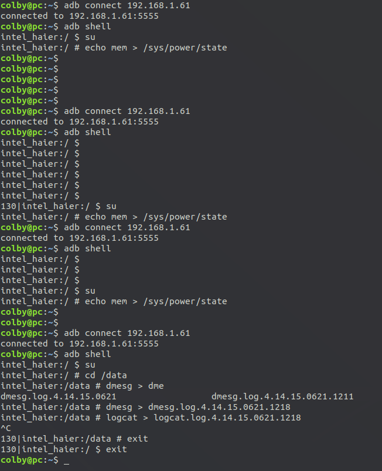
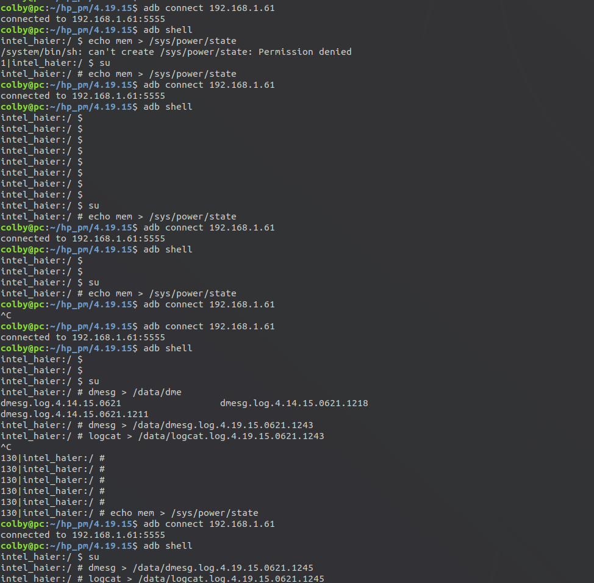
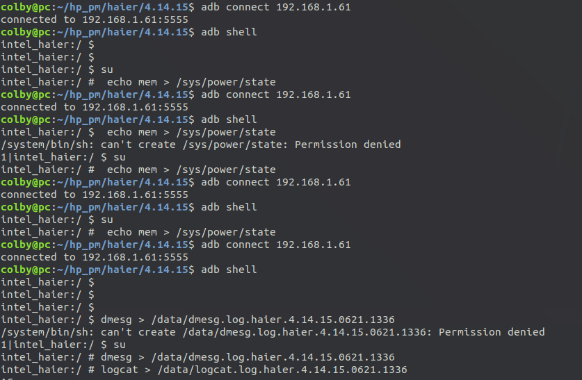
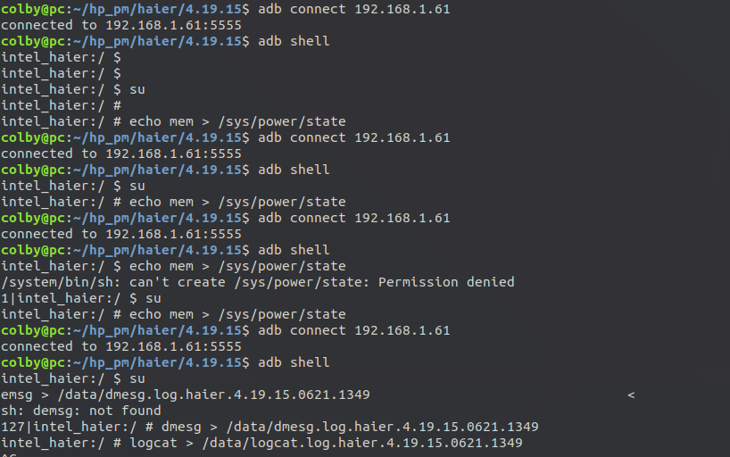

# hp-4.14.15-pm问题：

操作流程如下：

1. 开机
2. 此时adb可以工作
3. echo mem > /sys/power/state
4. 此时现象： 电源灯闪烁， adb connection timed out
5. 点击电源开关
6. 此时现象 电源灯常开，adb 可以连接， 屏幕黑

内核传参如下：

```shell
intel_haier:/ # cat /proc/cmdline                                              
BOOT_IMAGE=/EFI/PhoenixOS/kernel quiet root=/dev/ram0 androidboot.hardware=android_x86 SRC=/PhoenixOS vga=788
```

ps: 和4.19.15表现差不多

多次休眠唤醒结果：



```shell
BOOT_IMAGE=/EFI/PhoenixOS/kernel quiet root=/dev/ram0 androidboot.hardware=android_x86 SRC=/PhoenixOS vga=788
```


4.19.15

```shell
BOOT_IMAGE=/EFI/PhoenixOS/kernel quiet nomodeset root=/dev/ram0 androidboot.hardware=android_x86 SRC=/PhoenixOS vga=788
```



海尔：

4.14.15 



```shell
BOOT_IMAGE=/EFI/PhoenixOS/kernel quiet root=/dev/ram0 androidboot.hardware=android_x86 SRC=/PhoenixOS vga=788
```


4.19.15



```shell
BOOT_IMAGE=/EFI/PhoenixOS/kernel quiet root=/dev/ram0 androidboot.hardware=android_x86 SRC=/PhoenixOS vga=788
```

